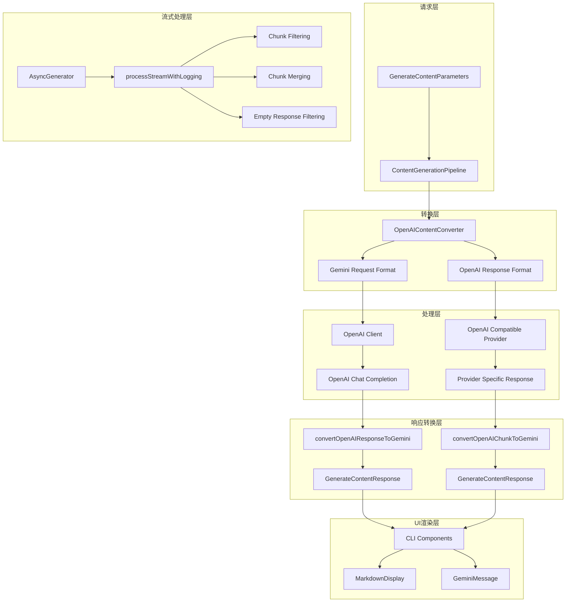
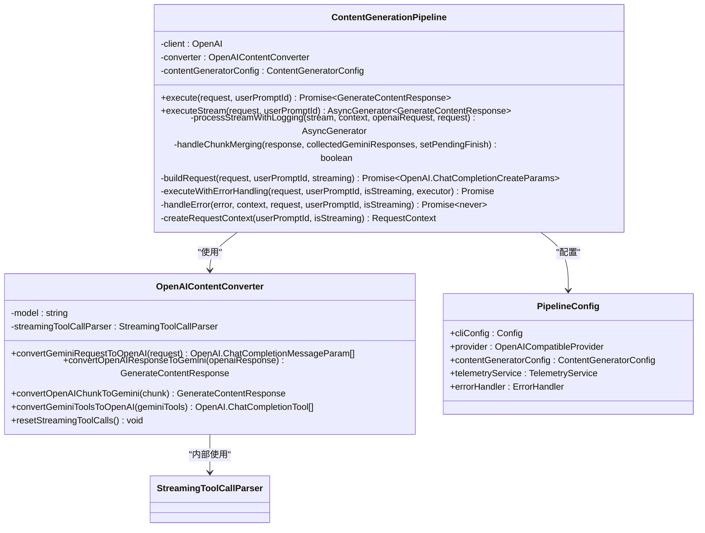
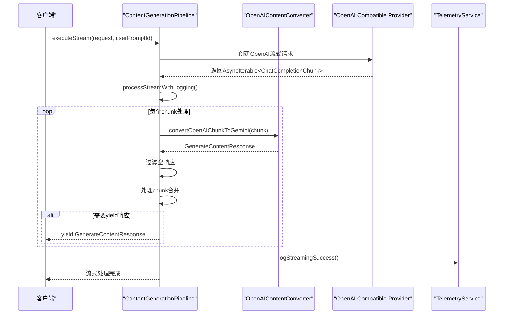
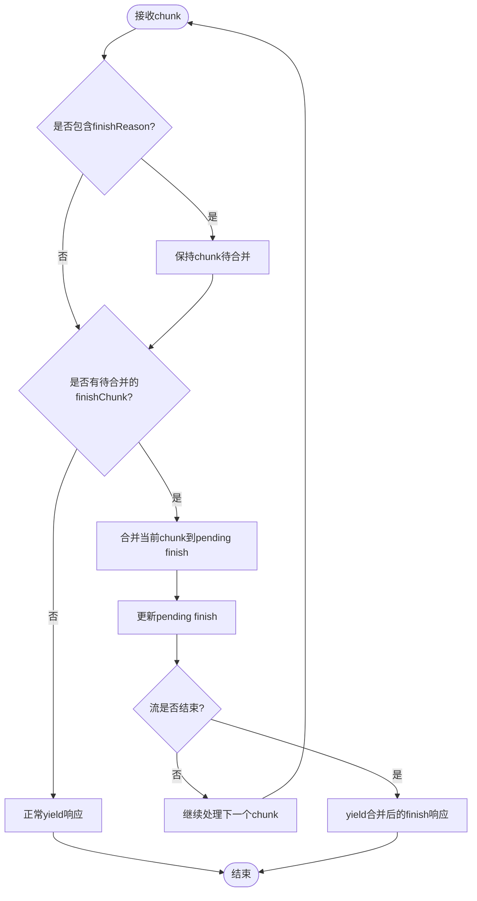
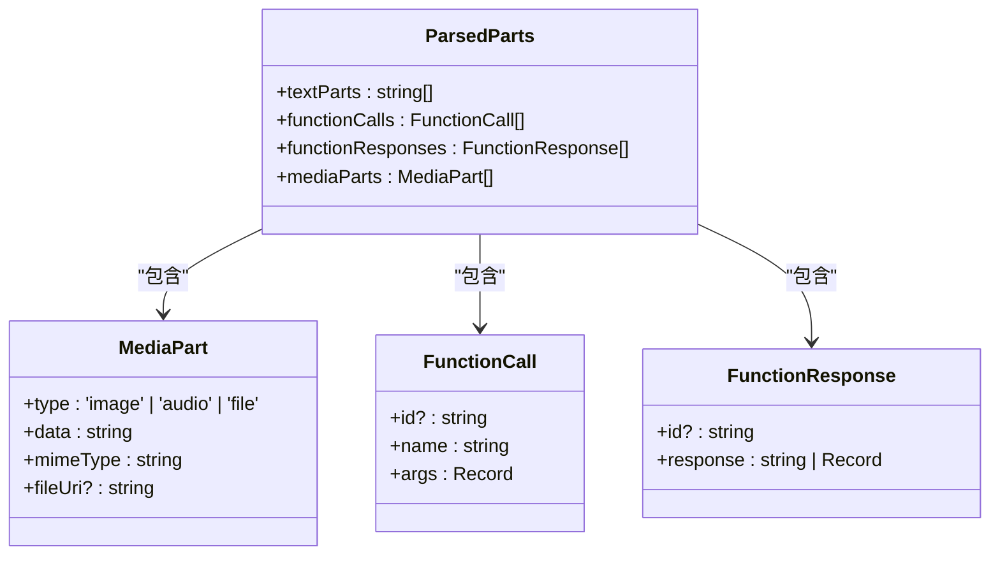
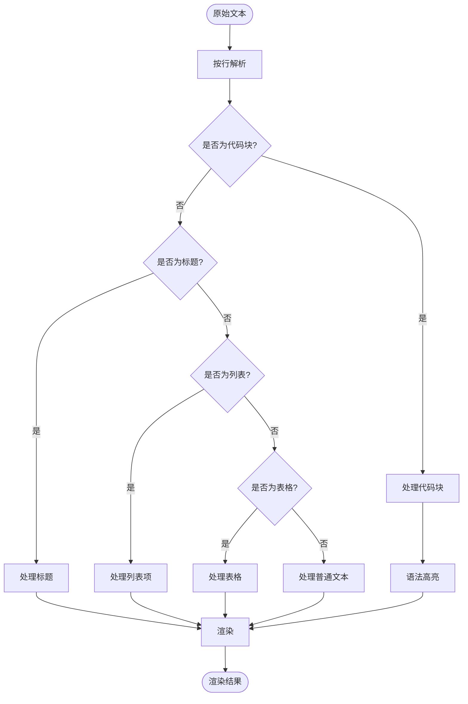
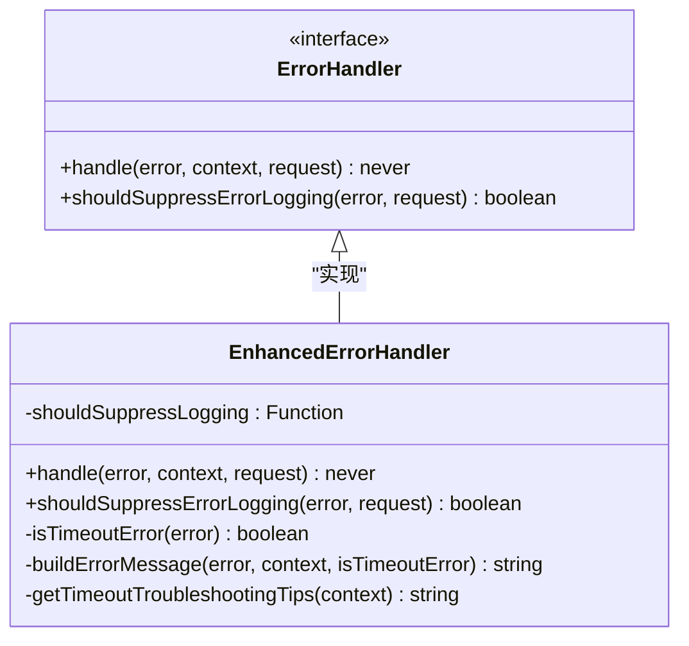
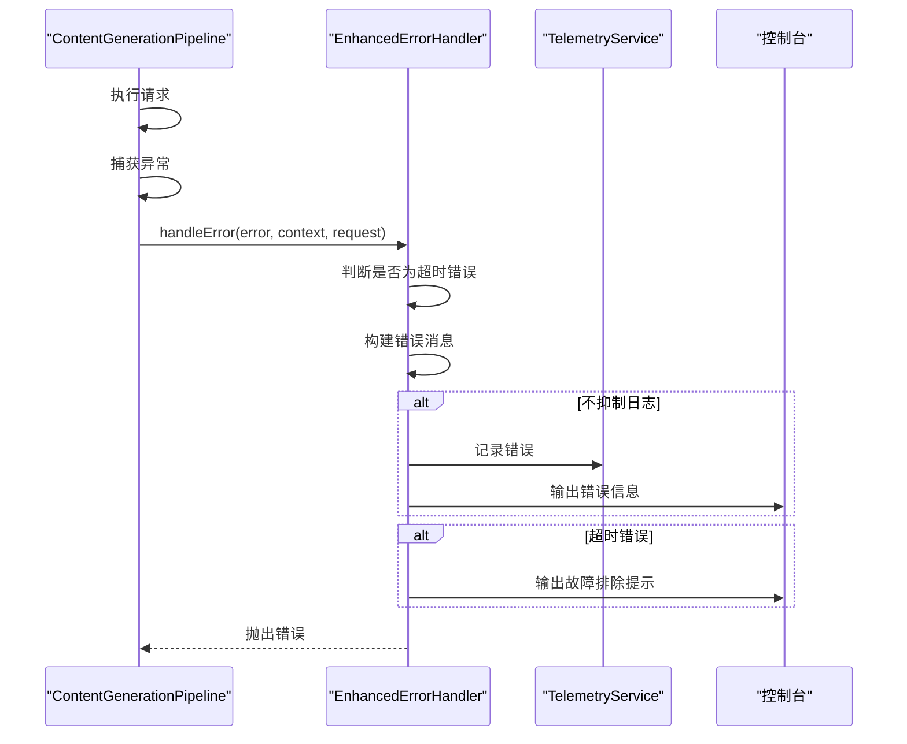
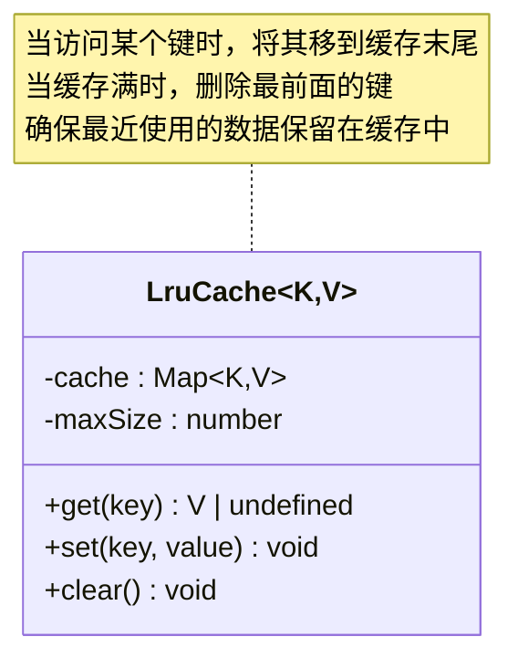
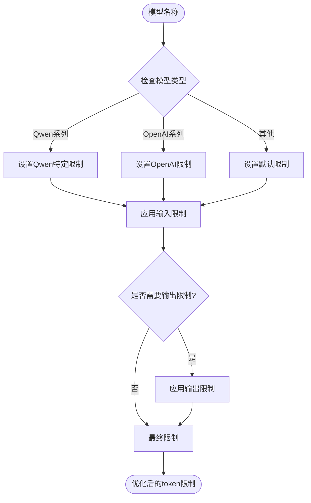

# 响应处理流程

<cite>
**本文档引用的文件**
- [pipeline.ts](file://packages/core/src/core/openaiContentGenerator/pipeline.ts)
- [converter.ts](file://packages/core/src/core/openaiContentGenerator/converter.ts)
- [errorHandler.ts](file://packages/core/src/core/openaiContentGenerator/errorHandler.ts)
- [types.ts](file://packages/cli/src/services/prompt-processors/types.ts)
- [GeminiMessage.tsx](file://packages/cli/src/ui/components/messages/GeminiMessage.tsx)
- [MarkdownDisplay.tsx](file://packages/cli/src/ui/utils/MarkdownDisplay.tsx)
- [LruCache.ts](file://packages/core/src/utils/LruCache.ts)
- [requestTokenizer.ts](file://packages/core/src/utils/request-tokenizer/requestTokenizer.ts)
</cite>

## 目录
1. [简介](#简介)
2. [系统架构概览](#系统架构概览)
3. [ContentGenerationPipeline核心组件](#contentgenerationpipeline核心组件)
4. [流式响应处理流程](#流式响应处理流程)
5. [非流式响应处理流程](#非流式响应处理流程)
6. [响应数据标准化封装](#响应数据标准化封装)
7. [CLI可渲染UI组件](#cli可渲染ui组件)
8. [错误传播机制](#错误传播机制)
9. [响应缓存策略](#响应缓存策略)
10. [性能优化建议](#性能优化建议)
11. [故障排除指南](#故障排除指南)
12. [总结](#总结)

## 简介

qwen-code系统中的AI模型响应处理与返回流程是一个复杂而精密的系统，负责将来自不同AI提供商（如OpenAI、Google Gemini等）的原始响应转换为统一的格式，并通过CLI界面呈现给用户。该系统支持两种主要的响应模式：流式响应和非流式响应，每种模式都有其独特的处理逻辑和优化策略。

## 系统架构概览



**图表来源**
- [pipeline.ts](file://packages/core/src/core/openaiContentGenerator/pipeline.ts#L25-L418)
- [converter.ts](file://packages/core/src/core/openaiContentGenerator/converter.ts#L40-L1036)

## ContentGenerationPipeline核心组件

ContentGenerationPipeline是整个响应处理流程的核心控制器，它负责协调各个组件的工作并管理执行流程。



**图表来源**
- [pipeline.ts](file://packages/core/src/core/openaiContentGenerator/pipeline.ts#L25-L418)
- [converter.ts](file://packages/core/src/core/openaiContentGenerator/converter.ts#L40-L100)

**章节来源**
- [pipeline.ts](file://packages/core/src/core/openaiContentGenerator/pipeline.ts#L25-L418)
- [converter.ts](file://packages/core/src/core/openaiContentGenerator/converter.ts#L40-L100)

## 流式响应处理流程

流式响应处理是qwen-code系统中最复杂的部分，它需要实时处理来自AI模型的分块数据，并将其转换为适合CLI显示的格式。

### processStreamWithLogging方法详解



**图表来源**
- [pipeline.ts](file://packages/core/src/core/openaiContentGenerator/pipeline.ts#L75-L150)
- [converter.ts](file://packages/core/src/core/openaiContentGenerator/converter.ts#L584-L700)

### 分块合并策略

系统实现了智能的分块合并策略，以处理不同AI提供商发送finishReason和usageMetadata的方式：



**图表来源**
- [pipeline.ts](file://packages/core/src/core/openaiContentGenerator/pipeline.ts#L152-L200)

### 空响应过滤机制

为了防止下游处理出现问题，系统会自动过滤掉没有任何内容的空响应：

```typescript
// 过滤空响应的逻辑
if (
  response.candidates?.[0]?.content?.parts?.length === 0 &&
  !response.candidates?.[0]?.finishReason &&
  !response.usageMetadata
) {
  continue; // 跳过空响应
}
```

**章节来源**
- [pipeline.ts](file://packages/core/src/core/openaiContentGenerator/pipeline.ts#L75-L200)
- [pipeline.ts](file://packages/core/src/core/openaiContentGenerator/pipeline.test.ts#L1209-L1248)

## 非流式响应处理流程

非流式响应处理相对简单，直接将完整的AI响应转换为Gemini格式。

### convertOpenAIResponseToGemini转换逻辑

```mermaid
flowchart TD
Start([OpenAI ChatCompletion]) --> ExtractChoice[提取choices[0]]
ExtractChoice --> CreateResponse[创建GenerateContentResponse]
CreateResponse --> ProcessText{"是否有文本内容?"}
ProcessText --> |是| AddTextPart[添加text part]
ProcessText --> |否| ProcessTools{"是否有工具调用?"}
AddTextPart --> ProcessTools
ProcessTools --> |是| LoopTools[遍历tool_calls]
ProcessTools --> |否| SetFinishReason[设置finishReason]
LoopTools --> ParseArgs[解析JSON参数]
ParseArgs --> AddToolPart[添加functionCall part]
AddToolPart --> MoreTools{"还有更多工具?"}
MoreTools --> |是| LoopTools
MoreTools --> |否| SetFinishReason
SetFinishReason --> ProcessUsage{"是否有usage信息?"}
ProcessUsage --> |是| CalculateTokens[计算token使用量]
ProcessUsage --> |否| Complete[完成响应]
CalculateTokens --> EstimateSplit{"是否需要估算token分割?"}
EstimateSplit --> |是| ApplyEstimation[应用70%/30%估算]
EstimateSplit --> |否| UseDirect[使用直接值]
ApplyEstimation --> Complete
UseDirect --> Complete
Complete --> End([GenerateContentResponse])
```

**图表来源**
- [converter.ts](file://packages/core/src/core/openaiContentGenerator/converter.ts#L495-L583)

**章节来源**
- [converter.ts](file://packages/core/src/core/openaiContentGenerator/converter.ts#L495-L583)

## 响应数据标准化封装

所有AI模型的响应都通过PromptPipelineContent类型进行标准化封装，确保在CLI界面中的一致性显示。

### PromptPipelineContent类型定义

```typescript
export type PromptPipelineContent = PartUnion[];
```

这个类型定义了提示处理器管道的输入/输出格式，其中PartUnion是Google GenAI库中定义的内容部分类型。

### 内容部分分类处理

系统对不同类型的内容部分进行分类处理：



**图表来源**
- [converter.ts](file://packages/core/src/core/openaiContentGenerator/converter.ts#L30-L40)

**章节来源**
- [types.ts](file://packages/cli/src/services/prompt-processors/types.ts#L10-L36)
- [converter.ts](file://packages/core/src/core/openaiContentGenerator/converter.ts#L30-L40)

## CLI可渲染UI组件

CLI界面通过一系列React组件将AI响应转换为用户友好的格式。

### MarkdownDisplay组件

MarkdownDisplay组件负责将AI生成的文本内容渲染为富文本格式：



**图表来源**
- [MarkdownDisplay.tsx](file://packages/cli/src/ui/utils/MarkdownDisplay.tsx#L45-L98)

### GeminiMessage组件

GeminiMessage组件专门用于渲染AI模型生成的响应：

```typescript
export const GeminiMessage: React.FC<GeminiMessageProps> = ({
  text,
  isPending,
  availableTerminalHeight,
  terminalWidth,
}) => {
  const prefix = '✦ ';
  
  return (
    <Box flexDirection="row">
      <Box width={prefixWidth}>
        <Text color={Colors.AccentPurple} aria-label={SCREEN_READER_MODEL_PREFIX}>
          {prefix}
        </Text>
      </Box>
      <Box flexGrow={1} flexDirection="column">
        <MarkdownDisplay
          text={text}
          isPending={isPending}
          availableTerminalHeight={availableTerminalHeight}
          terminalWidth={terminalWidth}
        />
      </Box>
    </Box>
  );
};
```

**章节来源**
- [MarkdownDisplay.tsx](file://packages/cli/src/ui/utils/MarkdownDisplay.tsx#L45-L98)
- [GeminiMessage.tsx](file://packages/cli/src/ui/components/messages/GeminiMessage.tsx#L15-L49)

## 错误传播机制

系统实现了完善的错误传播机制，确保错误能够被正确捕获、记录和处理。

### EnhancedErrorHandler类



**图表来源**
- [errorHandler.ts](file://packages/core/src/core/openaiContentGenerator/errorHandler.ts#L10-L130)

### 错误处理流程



**图表来源**
- [errorHandler.ts](file://packages/core/src/core/openaiContentGenerator/errorHandler.ts#L25-L80)

**章节来源**
- [errorHandler.ts](file://packages/core/src/core/openaiContentGenerator/errorHandler.ts#L10-L130)

## 响应缓存策略

系统采用了LRU（最近最少使用）缓存策略来优化性能和减少重复计算。

### LruCache实现



**图表来源**
- [LruCache.ts](file://packages/core/src/utils/LruCache.ts#L8-L40)

### 缓存应用场景

1. **请求令牌计数缓存**：避免重复计算相同内容的token数量
2. **工具调用解析缓存**：缓存已解析的工具调用参数
3. **响应内容缓存**：缓存频繁访问的响应内容

**章节来源**
- [LruCache.ts](file://packages/core/src/utils/LruCache.ts#L8-L40)

## 性能优化建议

### Token限制管理

系统实现了智能的token限制管理，根据不同的模型特性调整输入和输出的token限制：



### 请求优化策略

1. **批量token计算**：使用批量计算减少API调用次数
2. **压缩算法**：对历史对话进行智能压缩
3. **缓存机制**：缓存常用的数据结构和计算结果

**章节来源**
- [requestTokenizer.ts](file://packages/core/src/utils/request-tokenizer/requestTokenizer.ts#L169-L202)

## 故障排除指南

### 常见问题及解决方案

#### 1. 流式响应超时

**症状**：流式响应长时间无响应或突然中断

**原因**：
- 网络连接不稳定
- 输入内容过大
- AI提供商服务异常

**解决方案**：
```typescript
// 增加超时时间配置
contentGenerator.timeout = 30000; // 30秒

// 减少输入复杂度
// - 截断长文本
// - 移除不必要的上下文
// - 使用更简洁的prompt
```

#### 2. 响应格式不匹配

**症状**：AI响应无法正确转换为Gemini格式

**原因**：
- AI提供商返回格式异常
- 工具调用参数解析失败
- 多模态内容处理错误

**解决方案**：
```typescript
// 启用调试模式
console.debug('Raw response:', rawResponse);
console.debug('Parsed parts:', parsedParts);

// 实现降级处理
try {
  const response = converter.convertOpenAIChunkToGemini(chunk);
  return response;
} catch (error) {
  // 返回简化版本的响应
  return new GenerateContentResponse();
}
```

#### 3. 内存泄漏问题

**症状**：长时间运行后内存使用持续增长

**原因**：
- 流式处理未正确清理
- 缓存大小超出预期
- 异常处理不当

**解决方案**：
```typescript
// 定期清理缓存
setInterval(() => {
  lruCache.clear();
}, 300000); // 每5分钟清理一次

// 确保流式处理正确关闭
try {
  for await (const chunk of stream) {
    // 处理chunk
  }
} finally {
  // 清理资源
  converter.resetStreamingToolCalls();
}
```

**章节来源**
- [errorHandler.ts](file://packages/core/src/core/openaiContentGenerator/errorHandler.ts#L40-L80)

## 总结

qwen-code系统的AI模型响应处理与返回流程是一个高度优化的系统，具有以下特点：

1. **双模式支持**：同时支持流式和非流式响应处理
2. **格式标准化**：通过统一的GenerateContentResponse格式处理不同提供商的响应
3. **智能过滤**：自动过滤无效响应，提高系统稳定性
4. **错误处理**：完善的错误传播和故障排除机制
5. **性能优化**：多层缓存和token限制管理
6. **用户体验**：丰富的CLI界面组件，支持Markdown渲染

该系统的设计充分考虑了生产环境的需求，在保证功能完整性的同时，提供了良好的可维护性和扩展性。通过合理的架构设计和优化策略，系统能够在各种网络条件下稳定运行，并为用户提供流畅的交互体验。