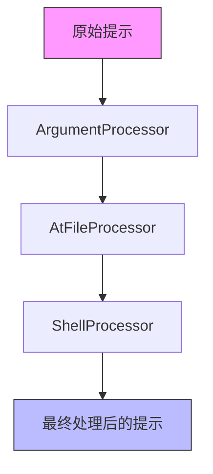
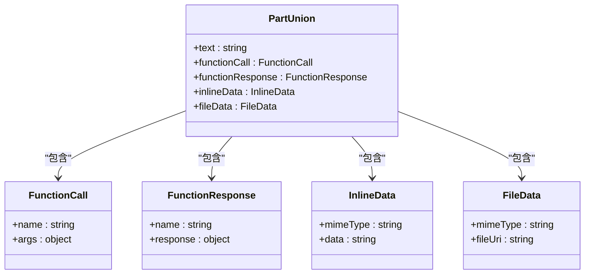
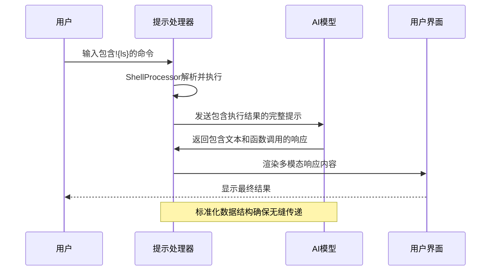

# 响应数据标准化

<cite>
**本文档引用的文件**   
- [types.ts](file://packages/cli/src/services/prompt-processors/types.ts)
- [partUtils.ts](file://packages/core/src/utils/partUtils.ts)
- [shellProcessor.ts](file://packages/cli/src/services/prompt-processors/shellProcessor.ts)
- [atFileProcessor.ts](file://packages/cli/src/services/prompt-processors/atFileProcessor.ts)
- [argumentProcessor.ts](file://packages/cli/src/services/prompt-processors/argumentProcessor.ts)
- [generateContentResponseUtilities.ts](file://packages/core/src/utils/generateContentResponseUtilities.ts)
</cite>

## 目录
1. [引言](#引言)
2. [核心数据结构](#核心数据结构)
3. [提示处理器管道](#提示处理器管道)
4. [PartUnion联合类型详解](#partunion联合类型详解)
5. [可扩展性设计](#可扩展性设计)
6. [实际应用场景](#实际应用场景)
7. [错误处理与数据验证](#错误处理与数据验证)
8. [结论](#结论)

## 引言
qwen-code系统通过标准化的数据封装机制来处理AI模型的多模态响应。该机制以PromptPipelineContent类型为核心，统一表示文本、函数调用、图像等不同类型的数据片段。这种设计确保了系统各组件间数据格式的一致性，简化了UI渲染逻辑，并增强了系统的可扩展性和健壮性。

## 核心数据结构

**Section sources**
- [types.ts](file://packages/cli/src/services/prompt-processors/types.ts#L10-L15)

## 提示处理器管道

**Diagram sources **
- [types.ts](file://packages/cli/src/services/prompt-processors/types.ts#L17-L34)
- [argumentProcessor.ts](file://packages/cli/src/services/prompt-processors/argumentProcessor.ts#L17-L26)
- [atFileProcessor.ts](file://packages/cli/src/services/prompt-processors/atFileProcessor.ts#L20-L96)
- [shellProcessor.ts](file://packages/cli/src/services/prompt-processors/shellProcessor.ts#L58-L207)

## PartUnion联合类型详解

**Diagram sources **
- [partUtils.ts](file://packages/core/src/utils/partUtils.ts#L1-L169)
- [generateContentResponseUtilities.ts](file://packages/core/src/utils/generateContentResponseUtilities.ts#L52-L106)

**Section sources**
- [partUtils.ts](file://packages/core/src/utils/partUtils.ts#L1-L169)

## 可扩展性设计

**Section sources**
- [types.ts](file://packages/cli/src/services/prompt-processors/types.ts#L10-L15)
- [partUtils.ts](file://packages/core/src/utils/partUtils.ts#L131-L168)

## 实际应用场景

**Diagram sources **
- [shellProcessor.ts](file://packages/cli/src/services/prompt-processors/shellProcessor.ts#L58-L207)
- [partUtils.ts](file://packages/core/src/utils/partUtils.ts#L53-L89)

## 错误处理与数据验证

**Section sources**
- [partUtils.ts](file://packages/core/src/utils/partUtils.ts#L53-L89)
- [generateContentResponseUtilities.ts](file://packages/core/src/utils/generateContentResponseUtilities.ts#L52-L106)

## 结论
qwen-code系统通过PromptPipelineContent类型实现了AI响应数据的标准化封装。这种设计不仅确保了提示处理器管道中数据格式的一致性，还支持系统的可扩展性，使新增的响应类型能够无缝集成到现有处理流程中。标准化的数据结构简化了UI渲染逻辑，在错误处理和数据验证方面也展现出显著优势。