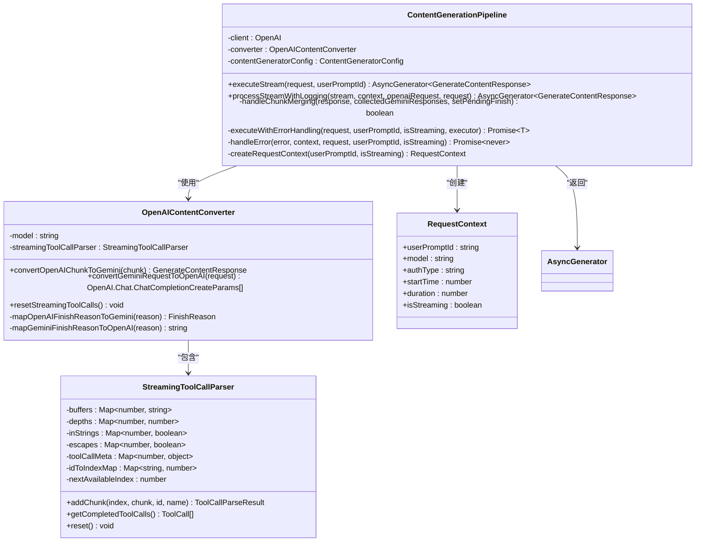
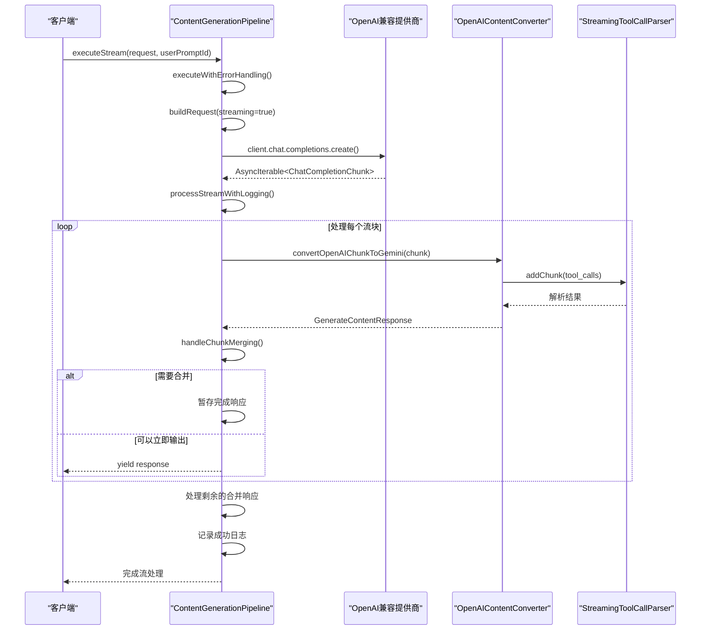
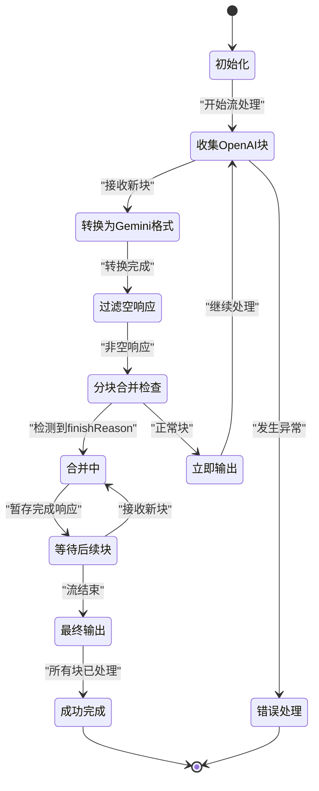
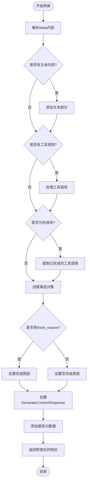
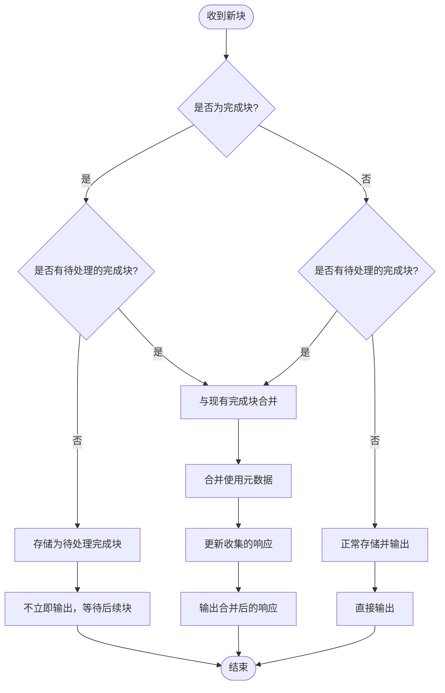
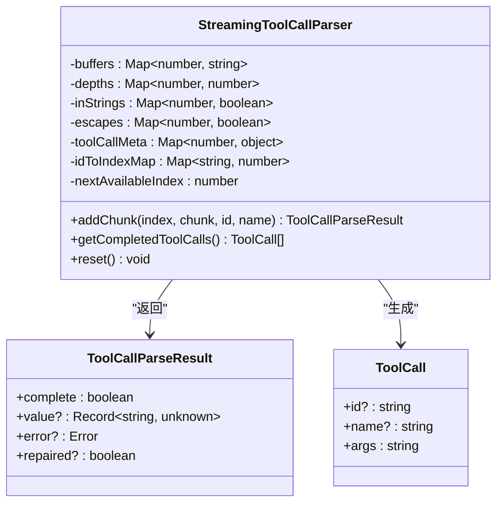
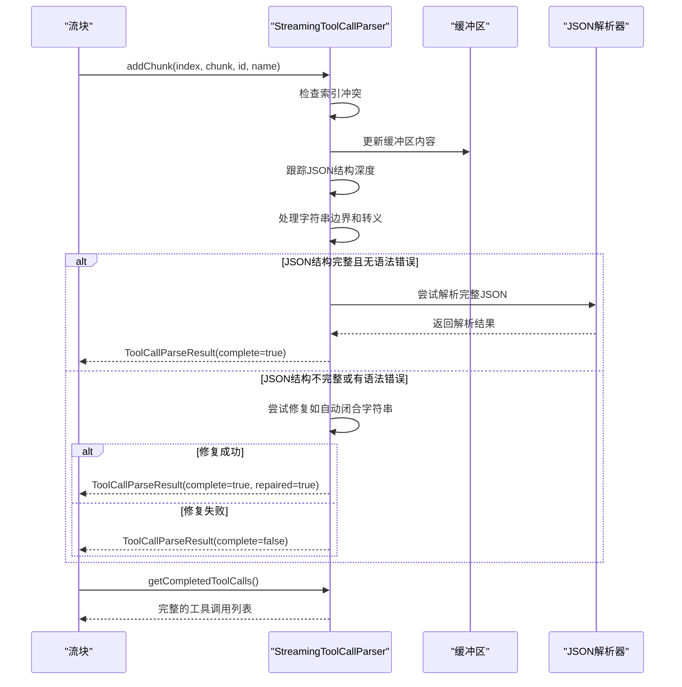
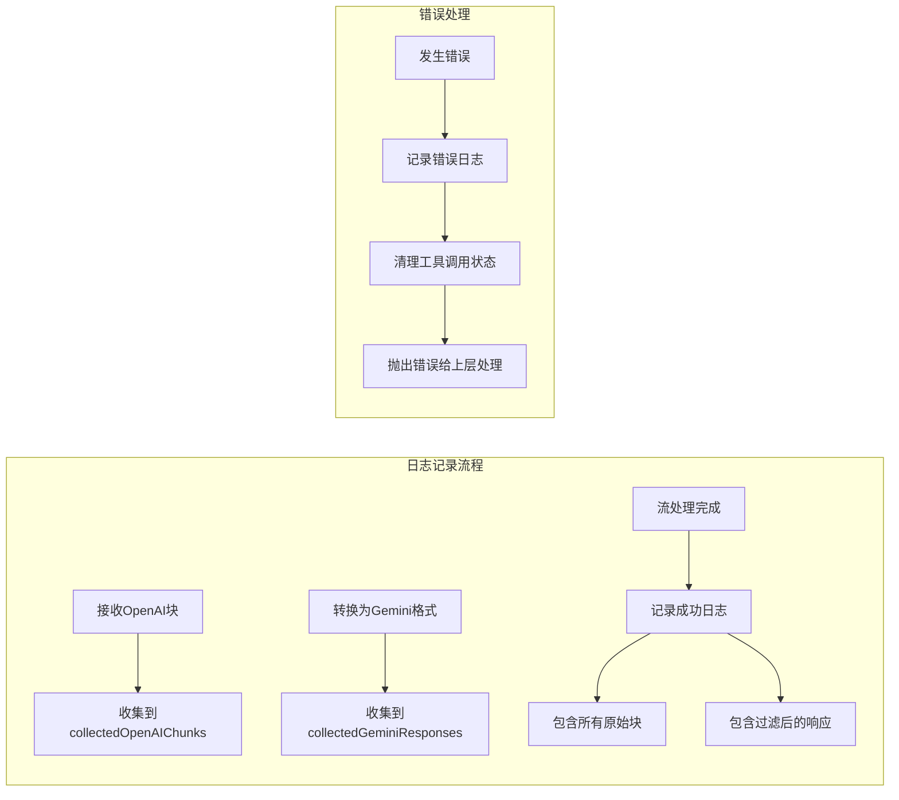
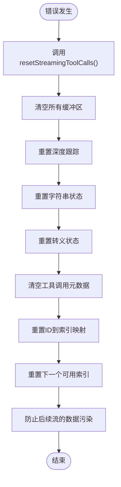

# 流式响应处理

<cite>
**本文档引用的文件**
- [pipeline.ts](file://packages/core/src/core/openaiContentGenerator/pipeline.ts)
- [converter.ts](file://packages/core/src/core/openaiContentGenerator/converter.ts)
- [streamingToolCallParser.ts](file://packages/core/src/core/openaiContentGenerator/streamingToolCallParser.ts)
- [pipeline.test.ts](file://packages/core/src/core/openaiContentGenerator/pipeline.test.ts)
- [geminiChat.ts](file://packages/core/src/core/geminiChat.ts)
</cite>

## 目录
1. [简介](#简介)
2. [核心组件架构](#核心组件架构)
3. [ContentGenerationPipeline执行流程](#contentgenerationpipeline执行流程)
4. [流式响应处理详解](#流式响应处理详解)
5. [OpenAI到Gemini格式转换](#openai到gemini格式转换)
6. [分块合并机制](#分块合并机制)
7. [工具调用处理](#工具调用处理)
8. [日志记录与监控](#日志记录与监控)
9. [错误处理机制](#错误处理机制)
10. [性能优化考虑](#性能优化考虑)
11. [故障排除指南](#故障排除指南)
12. [总结](#总结)

## 简介

qwen-code系统中的流式AI响应处理是一个复杂而精密的管道系统，负责将来自不同AI提供商的流式响应转换为统一的Gemini格式。该系统的核心是`ContentGenerationPipeline.executeStream`方法，它实现了从OpenAI兼容的流式响应创建到最终Gemini兼容的`GenerateContentResponse`对象的完整转换流程。

本文档深入分析了流式处理的异步生成器模式、分块合并策略、工具调用解析以及错误恢复机制，为开发者提供了全面的技术参考。

## 核心组件架构



**图表来源**
- [pipeline.ts](file://packages/core/src/core/openaiContentGenerator/pipeline.ts#L25-L45)
- [converter.ts](file://packages/core/src/core/openaiContentGenerator/converter.ts#L45-L65)
- [streamingToolCallParser.ts](file://packages/core/src/core/openaiContentGenerator/streamingToolCallParser.ts#L25-L45)

**章节来源**
- [pipeline.ts](file://packages/core/src/core/openaiContentGenerator/pipeline.ts#L1-L418)
- [converter.ts](file://packages/core/src/core/openaiContentGenerator/converter.ts#L1-L1036)

## ContentGenerationPipeline执行流程

`ContentGenerationPipeline.executeStream`方法是整个流式处理的核心入口点，它遵循严格的阶段化处理模式：



**图表来源**
- [pipeline.ts](file://packages/core/src/core/openaiContentGenerator/pipeline.ts#L58-L75)
- [pipeline.ts](file://packages/core/src/core/openaiContentGenerator/pipeline.ts#L93-L162)

**章节来源**
- [pipeline.ts](file://packages/core/src/core/openaiContentGenerator/pipeline.ts#L58-L75)
- [pipeline.ts](file://packages/core/src/core/openaiContentGenerator/pipeline.ts#L93-L162)

## 流式响应处理详解

### 异步生成器模式

流式处理采用异步生成器模式，允许实时消费响应数据：

```typescript
// 执行流式请求的核心方法
async executeStream(
  request: GenerateContentParameters,
  userPromptId: string,
): Promise<AsyncGenerator<GenerateContentResponse>> {
  return this.executeWithErrorHandling(
    request,
    userPromptId,
    true,
    async (openaiRequest, context) => {
      // 阶段1：创建OpenAI流
      const stream = (await this.client.chat.completions.create(
        openaiRequest,
      )) as AsyncIterable<OpenAI.Chat.ChatCompletionChunk>;

      // 阶段2：处理流并进行转换和日志记录
      return this.processStreamWithLogging(
        stream,
        context,
        openaiRequest,
        request,
      );
    },
  );
}
```

### 流处理状态管理



**图表来源**
- [pipeline.ts](file://packages/core/src/core/openaiContentGenerator/pipeline.ts#L93-L162)

**章节来源**
- [pipeline.ts](file://packages/core/src/core/openaiContentGenerator/pipeline.ts#L58-L75)
- [pipeline.ts](file://packages/core/src/core/openaiContentGenerator/pipeline.ts#L93-L162)

## OpenAI到Gemini格式转换

### convertOpenAIChunkToGemini方法

`convertOpenAIChunkToGemini`方法是流式处理的核心转换引擎，负责将OpenAI的`ChatCompletionChunk`转换为Gemini的`GenerateContentResponse`格式：



**图表来源**
- [converter.ts](file://packages/core/src/core/openaiContentGenerator/converter.ts#L584-L700)

### 关键转换逻辑

1. **文本内容处理**：直接将`delta.content`转换为Gemini的文本部分
2. **工具调用处理**：通过`StreamingToolCallParser`解析和重组工具调用
3. **完成原因映射**：将OpenAI的完成原因映射到Gemini的枚举值
4. **使用元数据计算**：智能估算令牌计数（当只有总令牌数时）

**章节来源**
- [converter.ts](file://packages/core/src/core/openaiContentGenerator/converter.ts#L584-L700)

## 分块合并机制

### handleChunkMerging方法

`handleChunkMerging`方法解决了不同AI提供商发送数据格式不一致的问题，特别是当`finishReason`和`usageMetadata`分开发送时：



**图表来源**
- [pipeline.ts](file://packages/core/src/core/openaiContentGenerator/pipeline.ts#L164-L234)

### 合并策略详解

系统采用以下策略处理分块合并：

1. **完成块检测**：识别包含`finishReason`的块
2. **待处理状态管理**：使用`pendingFinishResponse`变量暂存完成块
3. **使用元数据合并**：优先使用最新可用的使用信息
4. **最终输出**：在流结束时输出合并后的响应

**章节来源**
- [pipeline.ts](file://packages/core/src/core/openaiContentGenerator/pipeline.ts#L164-L234)

## 工具调用处理

### StreamingToolCallParser架构

`StreamingToolCallParser`类专门处理流式工具调用的复杂性：



**图表来源**
- [streamingToolCallParser.ts](file://packages/core/src/core/openaiContentGenerator/streamingToolCallParser.ts#L25-L45)

### 工具调用解析流程



**图表来源**
- [streamingToolCallParser.ts](file://packages/core/src/core/openaiContentGenerator/streamingToolCallParser.ts#L50-L150)

**章节来源**
- [streamingToolCallParser.ts](file://packages/core/src/core/openaiContentGenerator/streamingToolCallParser.ts#L1-L415)
- [converter.ts](file://packages/core/src/core/openaiContentGenerator/converter.ts#L584-L650)

## 日志记录与监控

### 收集数组的作用

系统维护两个关键的收集数组用于日志记录：

1. **collectedGeminiResponses**：收集转换后的Gemini格式响应，用于内部处理和验证
2. **collectedOpenAIChunks**：收集原始的OpenAI格式块，用于完整的审计和调试



**图表来源**
- [pipeline.ts](file://packages/core/src/core/openaiContentGenerator/pipeline.ts#L93-L162)

### pendingFinishResponse状态管理

`pendingFinishResponse`变量是分块合并机制的关键状态变量：

- **初始化**：`null`表示没有待处理的完成块
- **设置**：当检测到完成块时，将其存储到此变量
- **合并**：将后续块的数据合并到此响应中
- **输出**：在流结束时输出合并后的响应
- **重置**：在错误处理中被重置以防止数据污染

**章节来源**
- [pipeline.ts](file://packages/core/src/core/openaiContentGenerator/pipeline.ts#L93-L162)

## 错误处理机制

### resetStreamingToolCalls方法

`resetStreamingToolCalls`方法在错误情况下防止数据污染：



**图表来源**
- [converter.ts](file://packages/core/src/core/openaiContentGenerator/converter.ts#L65-L75)

### 错误传播策略

系统采用分层错误处理策略：

1. **内部捕获**：在`processStreamWithLogging`中捕获所有异常
2. **状态清理**：调用`resetStreamingToolCalls`清理状态
3. **日志记录**：记录详细的错误信息和上下文
4. **错误转发**：将错误传递给上层处理程序

**章节来源**
- [pipeline.ts](file://packages/core/src/core/openaiContentGenerator/pipeline.ts#L162-L168)
- [pipeline.ts](file://packages/core/src/core/openaiContentGenerator/pipeline.test.ts#L413-L451)

## 性能优化考虑

### 内存管理策略

1. **及时释放**：在流处理完成后立即释放相关资源
2. **状态重置**：在每次新流开始前重置所有状态变量
3. **缓冲区限制**：避免无限增长的缓冲区

### 并发处理优化

虽然当前实现是顺序处理，但架构支持并发扩展：

- **独立的解析器实例**：每个流使用独立的`StreamingToolCallParser`
- **无共享状态**：解析器状态完全隔离
- **可扩展的转换器**：支持多线程转换处理

## 故障排除指南

### 常见问题诊断

1. **空响应过滤**：
   ```typescript
   // 过滤条件：空内容、无完成原因、无使用信息
   if (
     response.candidates?.[0]?.content?.parts?.length === 0 &&
     !response.candidates?.[0]?.finishReason &&
     !response.usageMetadata
   ) {
     continue; // 跳过空响应
   }
   ```

2. **分块合并问题**：
   - 检查`pendingFinishResponse`状态
   - 验证使用元数据的合并逻辑
   - 确认流结束时的最终输出

3. **工具调用解析失败**：
   - 检查JSON解析状态
   - 验证字符串边界处理
   - 确认转义字符处理

### 调试技巧

1. **启用详细日志**：记录所有原始OpenAI块和转换后的Gemini响应
2. **状态检查点**：在关键处理点记录状态变量值
3. **单元测试覆盖**：针对各种边缘情况进行充分测试

**章节来源**
- [pipeline.ts](file://packages/core/src/core/openaiContentGenerator/pipeline.ts#L123-L140)
- [pipeline.test.ts](file://packages/core/src/core/openaiContentGenerator/pipeline.test.ts#L500-L600)

## 总结

qwen-code系统的流式AI响应处理是一个高度优化的管道系统，具有以下关键特性：

1. **模块化设计**：清晰分离的职责分工，便于维护和扩展
2. **容错能力**：完善的错误处理和状态重置机制
3. **格式兼容**：智能的跨平台格式转换
4. **性能优化**：高效的内存管理和并发处理能力
5. **可观测性**：全面的日志记录和监控支持

该系统通过精心设计的异步生成器模式、智能的分块合并策略和robust的错误处理机制，确保了流式AI响应处理的可靠性和效率。开发者可以通过深入理解这些机制来更好地利用和扩展系统功能。