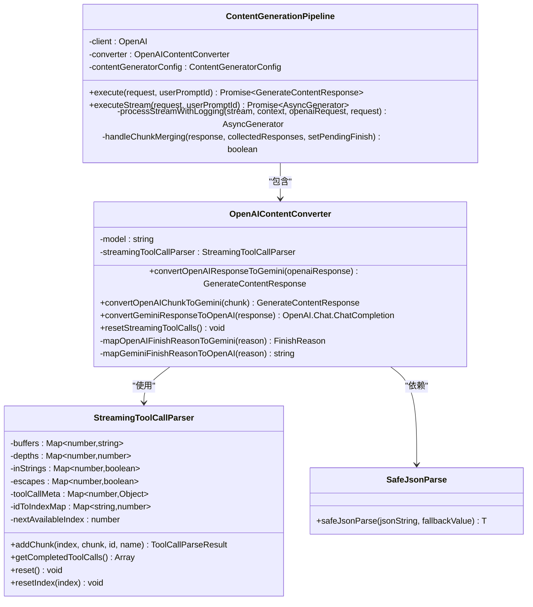
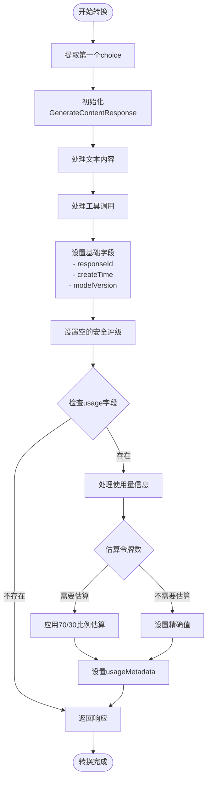
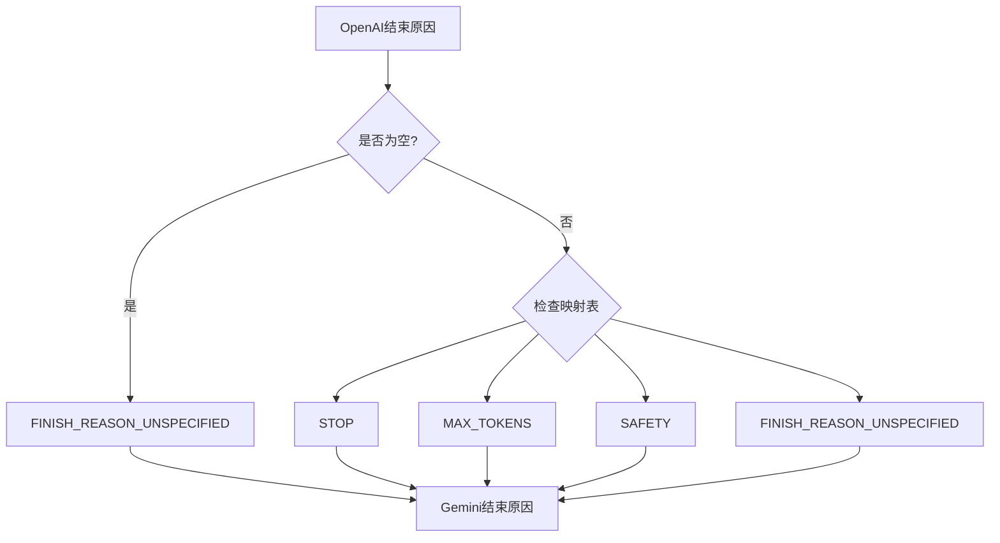
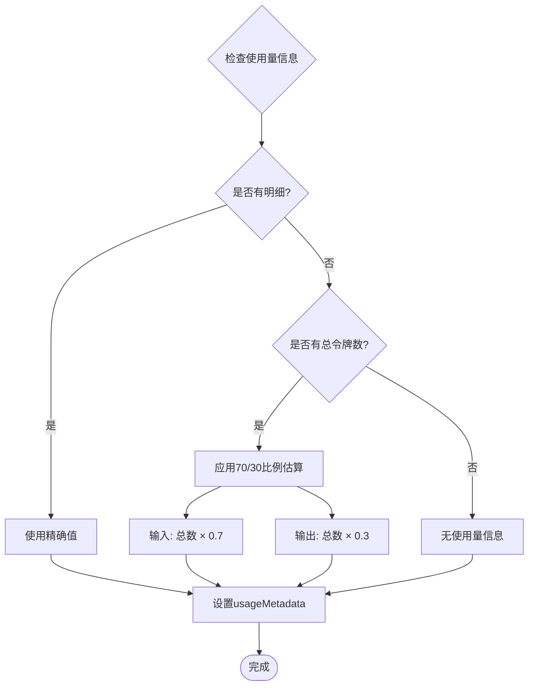
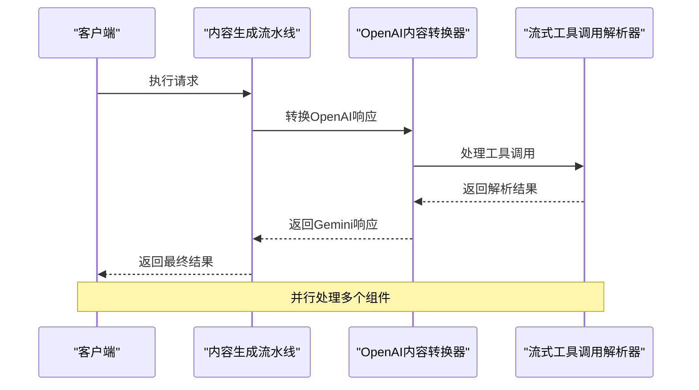
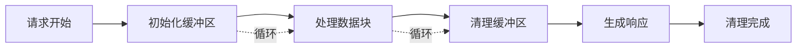

# 非流式响应处理机制

<cite>
**本文档引用的文件**
- [converter.ts](file://packages/core/src/core/openaiContentGenerator/converter.ts)
- [pipeline.ts](file://packages/core/src/core/openaiContentGenerator/pipeline.ts)
- [streamingToolCallParser.ts](file://packages/core/src/core/openaiContentGenerator/streamingToolCallParser.ts)
- [safeJsonParse.ts](file://packages/core/src/utils/safeJsonParse.ts)
- [converter.test.ts](file://packages/core/src/core/openaiContentGenerator/converter.test.ts)
- [pipeline.test.ts](file://packages/core/src/core/openaiContentGenerator/pipeline.test.ts)
</cite>

## 目录
1. [简介](#简介)
2. [核心组件架构](#核心组件架构)
3. [convertOpenAIResponseToGemini方法详解](#convertopenairesponsetogeminimethod详解)
4. [finishReason转换逻辑](#finishreason转换逻辑)
5. [usageMetadata聚合策略](#useagemetadata聚合策略)
6. [安全性和默认值处理](#安全性和默认值处理)
7. [性能特征和优化点](#性能特征和优化点)
8. [故障排除指南](#故障排除指南)
9. [总结](#总结)

## 简介

qwen-code系统中的非流式AI响应处理机制是一个复杂而精密的转换系统，负责将来自不同AI提供商（主要是OpenAI格式）的完整响应转换为Gemini格式。这个系统的核心是`convertOpenAIResponseToGemini`方法，它不仅处理文本内容的转换，还处理工具调用、响应元数据、安全评级等多个方面。

该系统的设计目标是在保持功能完整性的同时，确保不同AI提供商之间的兼容性，同时提供出色的错误处理和性能表现。

## 核心组件架构



**图表来源**
- [converter.ts](file://packages/core/src/core/openaiContentGenerator/converter.ts#L57-L89)
- [streamingToolCallParser.ts](file://packages/core/src/core/openaiContentGenerator/streamingToolCallParser.ts#L25-L45)
- [pipeline.ts](file://packages/core/src/core/openaiContentGenerator/pipeline.ts#L25-L45)

## convertOpenAIResponseToGemini方法详解

`convertOpenAIResponseToGemini`方法是整个转换系统的核心，它负责将完整的OpenAI ChatCompletion响应转换为Gemini的GenerateContentResponse格式。

### 方法执行流程



**图表来源**
- [converter.ts](file://packages/core/src/core/openaiContentGenerator/converter.ts#L495-L570)

### 文本内容处理

文本内容的处理相对简单直接：

```typescript
// 处理文本内容
if (choice.message.content) {
  parts.push({ text: choice.message.content });
}
```

这段代码从OpenAI响应的message.content字段提取文本内容，并将其包装在Gemini格式的Part对象中。

### 工具调用处理

工具调用的处理更加复杂，涉及到JSON解析和安全处理：

```typescript
// 处理工具调用
if (choice.message.tool_calls) {
  for (const toolCall of choice.message.tool_calls) {
    if (toolCall.function) {
      let args: Record<string, unknown> = {};
      if (toolCall.function.arguments) {
        args = safeJsonParse(toolCall.function.arguments, {});
      }

      parts.push({
        functionCall: {
          id: toolCall.id,
          name: toolCall.function.name,
          args,
        },
      });
    }
  }
}
```

这里的关键点是使用了`safeJsonParse`函数来确保JSON参数的安全解析，即使遇到格式不正确的JSON也能优雅地处理。

**章节来源**
- [converter.ts](file://packages/core/src/core/openaiContentGenerator/converter.ts#L495-L570)

## finishReason转换逻辑

finishReason的转换是连接不同AI提供商的重要桥梁。系统提供了双向转换机制：

### OpenAI到Gemini转换



**图表来源**
- [converter.ts](file://packages/core/src/core/openaiContentGenerator/converter.ts#L780-L795)

### 映射关系

```typescript
private mapOpenAIFinishReasonToGemini(openaiReason: string | null): FinishReason {
  if (!openaiReason) return FinishReason.FINISH_REASON_UNSPECIFIED;
  const mapping: Record<string, FinishReason> = {
    stop: FinishReason.STOP,
    length: FinishReason.MAX_TOKENS,
    content_filter: FinishReason.SAFETY,
    function_call: FinishReason.STOP,
    tool_calls: FinishReason.STOP,
  };
  return mapping[openaiReason] || FinishReason.FINISH_REASON_UNSPECIFIED;
}
```

### 反向转换

```typescript
private mapGeminiFinishReasonToOpenAI(geminiReason?: unknown): string {
  if (!geminiReason) return 'stop';
  
  const reverseMapping: Record<string, string> = {
    [FinishReason.STOP]: 'stop',
    [FinishReason.MAX_TOKENS]: 'length',
    [FinishReason.SAFETY]: 'content_filter',
    [FinishReason.FINISH_REASON_UNSPECIFIED]: 'stop',
  };
  
  return reverseMapping[geminiReason.toString()] || 'stop';
}
```

这种双向映射确保了不同提供商之间的兼容性，即使某些结束原因在特定平台上不可用，也能找到合适的替代方案。

**章节来源**
- [converter.ts](file://packages/core/src/core/openaiContentGenerator/converter.ts#L780-L805)

## usageMetadata聚合策略

usageMetadata的处理是系统中最复杂的部分之一，因为它需要处理不同提供商提供的不一致的使用量信息。

### 基本结构

```typescript
response.usageMetadata = {
  promptTokenCount: finalPromptTokens,
  candidatesTokenCount: finalCompletionTokens,
  totalTokenCount: totalTokens,
  cachedContentTokenCount: cachedTokens,
};
```

### 令牌估算策略

当只有总令牌数而没有明细时，系统采用智能估算策略：



**图表来源**
- [converter.ts](file://packages/core/src/core/openaiContentGenerator/converter.ts#L670-L685)

### 估算实现

```typescript
// 如果我们只有总令牌数但没有分解，估算分割
// 通常输入占约70%，输出占约30%对于大多数对话
let finalPromptTokens = promptTokens;
let finalCompletionTokens = completionTokens;

if (totalTokens > 0 && promptTokens === 0 && completionTokens === 0) {
  // 估算：假设70%输入，30%输出
  finalPromptTokens = Math.round(totalTokens * 0.7);
  finalCompletionTokens = Math.round(totalTokens * 0.3);
}
```

这种估算策略基于对典型对话模式的观察，能够提供合理的近似值，避免因缺少使用量信息而导致的功能缺失。

**章节来源**
- [converter.ts](file://packages/core/src/core/openaiContentGenerator/converter.ts#L670-L685)

## 安全性和默认值处理

### 安全评级处理

系统为所有响应设置了默认的安全评级：

```typescript
response.candidates = [
  {
    content: {
      parts,
      role: 'model' as const,
    },
    finishReason: this.mapOpenAIFinishReasonToGemini(choice.finish_reason || 'stop'),
    index: 0,
    safetyRatings: [], // 默认空数组
  },
];

response.promptFeedback = { safetyRatings: [] }; // 默认空数组
```

### 模型版本传递

```typescript
response.modelVersion = this.model;
```

模型版本信息被直接传递，确保跟踪使用的具体模型版本。

### 错误处理和恢复

系统使用了多层错误处理机制：

1. **JSON解析安全处理**：使用`safeJsonParse`函数处理可能损坏的JSON
2. **空值检查**：对所有可选字段进行null检查
3. **默认值提供**：为所有必需字段提供合理的默认值

**章节来源**
- [converter.ts](file://packages/core/src/core/openaiContentGenerator/converter.ts#L535-L545)

## 性能特征和优化点

### 流水线处理优化



**图表来源**
- [pipeline.ts](file://packages/core/src/core/openaiContentGenerator/pipeline.ts#L45-L75)

### 关键性能优化点

1. **单次重置机制**：`resetStreamingToolCalls()`方法确保工具调用解析器在每个新流开始前正确重置，避免数据污染

2. **智能缓冲区管理**：StreamingToolCallParser使用高效的缓冲区管理策略，支持并发处理多个工具调用

3. **延迟解析**：只在必要时才进行JSON解析，减少不必要的计算开销

4. **内存优化**：及时清理不再需要的数据结构，防止内存泄漏

### 内存使用模式



**图表来源**
- [streamingToolCallParser.ts](file://packages/core/src/core/openaiContentGenerator/streamingToolCallParser.ts#L390-L415)

**章节来源**
- [converter.ts](file://packages/core/src/core/openaiContentGenerator/converter.ts#L65-L75)
- [streamingToolCallParser.ts](file://packages/core/src/core/openaiContentGenerator/streamingToolCallParser.ts#L390-L415)

## 故障排除指南

### 常见问题和解决方案

#### 1. JSON解析失败

**问题**：工具调用参数包含格式不正确的JSON

**解决方案**：
```typescript
// 使用safeJsonParse自动修复常见问题
let args: Record<string, unknown> = {};
if (toolCall.function.arguments) {
  args = safeJsonParse(toolCall.function.arguments, {});
}
```

#### 2. 令牌估算不准确

**问题**：当只有总令牌数时，估算可能不准确

**解决方案**：
- 系统会记录估算过程
- 在日志中提供详细的使用量信息
- 支持手动验证和调整估算策略

#### 3. 工具调用索引冲突

**问题**：并发工具调用可能导致索引冲突

**解决方案**：
```typescript
// 自动检测和解决索引冲突
if (this.idToIndexMap.has(id)) {
  actualIndex = this.idToIndexMap.get(id)!;
} else {
  // 查找下一个可用索引
  actualIndex = this.findNextAvailableIndex();
}
```

### 调试技巧

1. **启用详细日志**：在开发环境中启用详细的转换日志
2. **监控使用量**：定期检查使用量估算的准确性
3. **测试边界情况**：测试各种边缘情况，如空响应、损坏的JSON等

**章节来源**
- [converter.ts](file://packages/core/src/core/openaiContentGenerator/converter.ts#L510-L525)
- [streamingToolCallParser.ts](file://packages/core/src/core/openaiContentGenerator/streamingToolCallParser.ts#L70-L120)

## 总结

qwen-code系统的非流式AI响应处理机制展现了现代AI应用中数据转换的复杂性和重要性。通过`convertOpenAIResponseToGemini`方法，系统实现了：

1. **全面的内容转换**：从文本到工具调用的完整转换
2. **智能的令牌估算**：在缺乏明细信息时提供合理的估算
3. **强大的错误处理**：使用安全解析和默认值确保系统稳定性
4. **高效的性能优化**：通过并行处理和智能缓存提升性能

这个系统的设计充分考虑了实际应用中的各种挑战，包括不同AI提供商的格式差异、网络不稳定导致的数据损坏、以及并发处理的需求。通过这些精心设计的机制，qwen-code能够在保证功能完整性的同时，提供稳定可靠的服务。

未来的改进方向可能包括更精确的令牌估算算法、更智能的错误恢复机制，以及针对特定应用场景的优化。但目前的实现已经能够很好地满足大多数使用场景的需求，为用户提供流畅的AI交互体验。