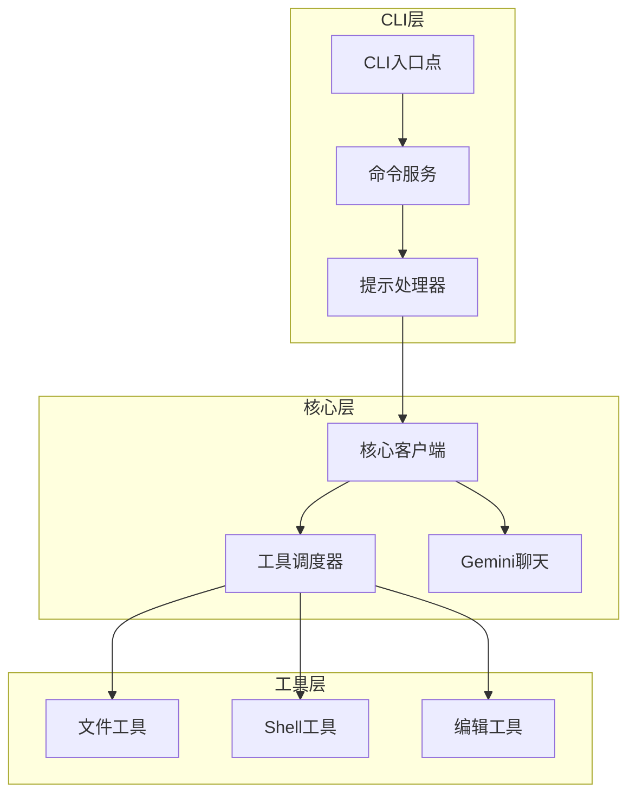
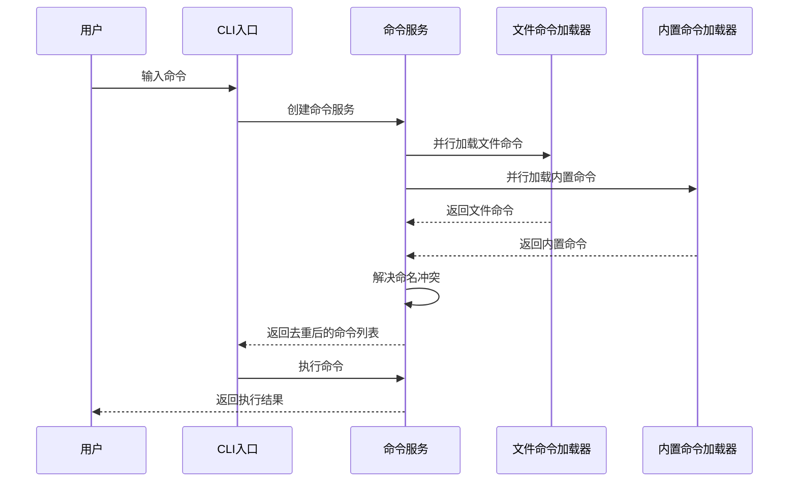
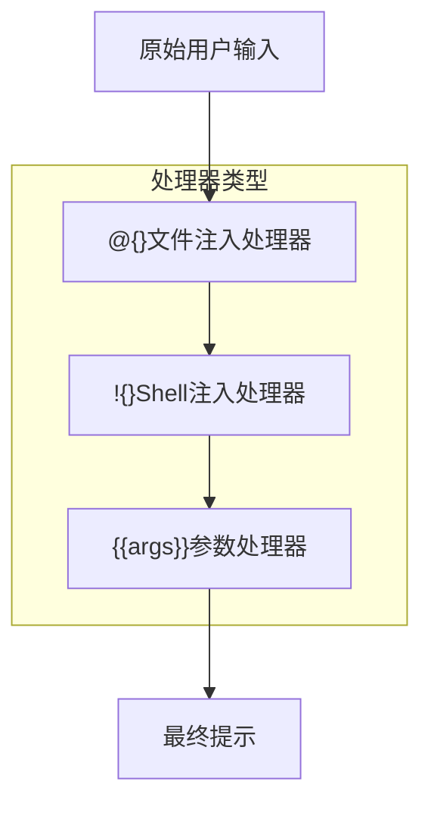
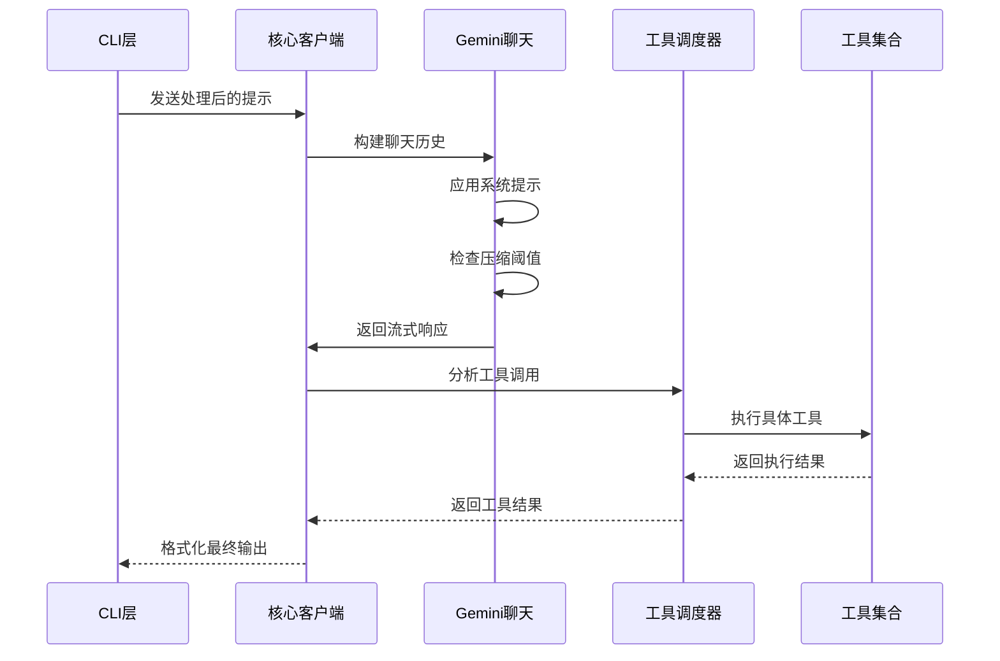
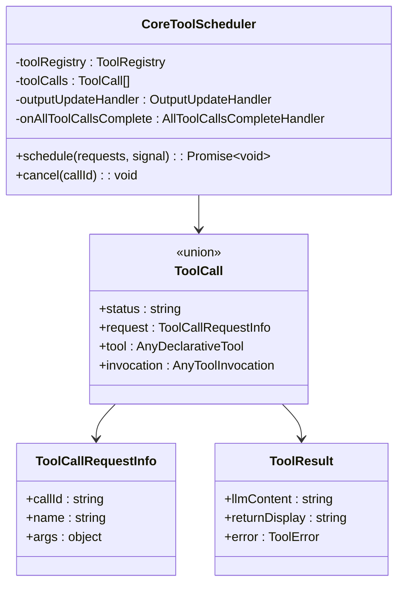
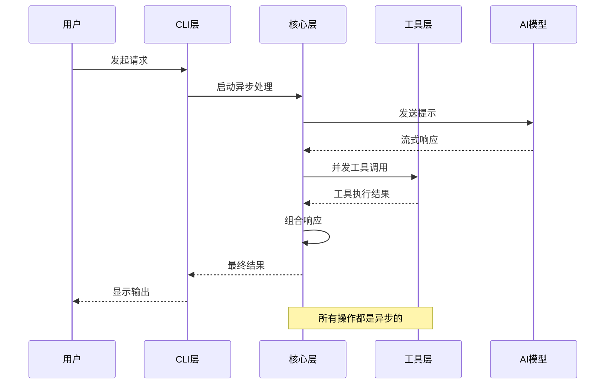

# 数据流分析

<cite>
**本文档中引用的文件**
- [CommandService.ts](file://packages/cli/src/services/CommandService.ts)
- [FileCommandLoader.ts](file://packages/cli/src/services/FileCommandLoader.ts)
- [shellProcessor.ts](file://packages/cli/src/services/prompt-processors/shellProcessor.ts)
- [atFileProcessor.ts](file://packages/cli/src/services/prompt-processors/atFileProcessor.ts)
- [argumentProcessor.ts](file://packages/cli/src/services/prompt-processors/argumentProcessor.ts)
- [client.ts](file://packages/core/src/core/client.ts)
- [turn.ts](file://packages/core/src/core/turn.ts)
- [coreToolScheduler.ts](file://packages/core/src/core/coreToolScheduler.ts)
- [slashCommandProcessor.ts](file://packages/cli/src/ui/hooks/slashCommandProcessor.ts)
- [types.ts](file://packages/cli/src/services/prompt-processors/types.ts)
</cite>

## 目录
1. [简介](#简介)
2. [项目结构概览](#项目结构概览)
3. [CLI命令处理管道](#cli命令处理管道)
4. [提示处理器架构](#提示处理器架构)
5. [核心处理管道](#核心处理管道)
6. [工具调用系统](#工具调用系统)
7. [数据流可视化](#数据流可视化)
8. [异步操作与错误处理](#异步操作与错误处理)
9. [性能考虑](#性能考虑)
10. [故障排除指南](#故障排除指南)
11. [结论](#结论)

## 简介

qwen-code系统是一个复杂的AI驱动的代码助手，其数据流和请求处理管道设计精巧，能够高效地处理用户输入、预处理、AI模型交互和工具调用。本文档深入分析了从用户在CLI输入命令开始，到最终输出返回给用户的完整数据流过程。

系统的核心设计理念是模块化和可扩展性，通过清晰的分层架构实现了数据的有序流动：CLI层负责用户交互和命令解析，核心层负责AI模型交互和工具调度，工具层则提供具体的文件操作、Shell执行等功能。

## 项目结构概览



**图表来源**
- [CommandService.ts](file://packages/cli/src/services/CommandService.ts#L1-L104)
- [client.ts](file://packages/core/src/core/client.ts#L1-L199)

**章节来源**
- [CommandService.ts](file://packages/cli/src/services/CommandService.ts#L1-L104)
- [FileCommandLoader.ts](file://packages/cli/src/services/FileCommandLoader.ts#L1-L199)

## CLI命令处理管道

### 命令发现与加载

CLI层的核心组件是`CommandService`，它采用提供者模式来发现和加载所有斜杠命令。该服务初始化时会传入一组`ICommandLoader`实例，每个实例负责从特定源获取命令（例如内置代码、本地文件）。



**图表来源**
- [CommandService.ts](file://packages/cli/src/services/CommandService.ts#L40-L85)
- [FileCommandLoader.ts](file://packages/cli/src/services/FileCommandLoader.ts#L70-L120)

### 命令执行流程

当用户输入命令时，系统会按照以下步骤处理：

1. **命令解析**：CLI解析用户输入，提取命令名称和参数
2. **命令查找**：在已加载的命令列表中查找匹配的命令
3. **参数验证**：验证命令参数的有效性
4. **权限检查**：检查用户是否有权执行该命令
5. **上下文构建**：构建命令执行所需的上下文环境

**章节来源**
- [CommandService.ts](file://packages/cli/src/services/CommandService.ts#L40-L104)
- [slashCommandProcessor.ts](file://packages/cli/src/ui/hooks/slashCommandProcessor.ts#L585-L618)

## 提示处理器架构

### 处理器管道设计

提示处理器是系统中负责预处理用户输入的关键组件。它们形成一个链式管道，每个处理器专注于特定类型的输入转换。



**图表来源**
- [atFileProcessor.ts](file://packages/cli/src/services/prompt-processors/atFileProcessor.ts#L1-L96)
- [shellProcessor.ts](file://packages/cli/src/services/prompt-processors/shellProcessor.ts#L1-L199)
- [argumentProcessor.ts](file://packages/cli/src/services/prompt-processors/argumentProcessor.ts#L1-L26)

### 文件注入处理器 (@{})

`AtFileProcessor`负责将文件内容注入到提示中。它识别`@{}`语法，读取指定路径的文件内容，并将其安全地插入到提示中。

主要功能：
- 安全的文件路径验证
- 支持.gitignore和.qwenignore规则
- 错误处理和回退机制
- 上下文信息注入

### Shell注入处理器 (!{})

`ShellProcessor`处理Shell命令注入，支持参数替换和安全执行。

主要功能：
- 参数转义和安全检查
- 命令权限验证
- 输出捕获和错误处理
- 超时控制

### 参数处理器 ({{args}})

`DefaultArgumentProcessor`将用户提供的原始参数附加到提示末尾，允许AI模型自行解析参数。

**章节来源**
- [atFileProcessor.ts](file://packages/cli/src/services/prompt-processors/atFileProcessor.ts#L1-L96)
- [shellProcessor.ts](file://packages/cli/src/services/prompt-processors/shellProcessor.ts#L1-L199)
- [argumentProcessor.ts](file://packages/cli/src/services/prompt-processors/argumentProcessor.ts#L1-L26)

## 核心处理管道

### AI模型交互

核心层负责与AI模型的交互，包括上下文构建、提示生成和响应处理。



**图表来源**
- [client.ts](file://packages/core/src/core/client.ts#L1-L199)
- [turn.ts](file://packages/core/src/core/turn.ts#L1-L199)

### 上下文构建

系统智能地管理对话历史和上下文信息，包括：

- **环境上下文**：工作目录结构、Git状态、文件内容
- **会话上下文**：历史消息、用户偏好设置
- **压缩机制**：当历史过长时自动压缩以节省token

### 流式响应处理

系统支持流式响应，能够实时接收和显示AI生成的内容：

- 实时文本流处理
- 思考过程显示
- 工具调用指示
- 错误恢复机制

**章节来源**
- [client.ts](file://packages/core/src/core/client.ts#L1-L199)
- [turn.ts](file://packages/core/src/core/turn.ts#L1-L199)

## 工具调用系统

### 工具调度器架构

工具调度器是系统的核心组件之一，负责协调所有工具的执行。



**图表来源**
- [coreToolScheduler.ts](file://packages/core/src/core/coreToolScheduler.ts#L255-L281)

### 工具生命周期

工具调用遵循严格的生命周期管理：

1. **验证阶段**：验证工具参数和权限
2. **调度阶段**：将工具调用加入队列
3. **确认阶段**：等待用户确认（如果需要）
4. **执行阶段**：实际执行工具操作
5. **完成阶段**：报告执行结果

### 异步工具执行

系统支持并发工具执行，具有以下特性：

- 请求队列管理
- 取消信号支持
- 输出流式更新
- 错误隔离和恢复

**章节来源**
- [coreToolScheduler.ts](file://packages/core/src/core/coreToolScheduler.ts#L1-L200)

## 数据流可视化

### 完整数据流图

```mermaid
flowchart TD
UserInput[用户输入] --> ParseCommand[命令解析]
ParseCommand --> LoadCommand[加载命令]
LoadCommand --> BuildContext[构建上下文]
BuildContext --> PromptProcessors[提示处理器]
PromptProcessors --> AtFile[@{}处理器]
AtFile --> ShellProcessor[!{}处理器]
ShellProcessor --> ArgProcessor[{{args}}处理器]
ArgProcessor --> FinalPrompt[最终提示]
FinalPrompt --> CoreClient[核心客户端]
CoreClient --> GeminiChat[Gemini聊天]
GeminiChat --> ToolAnalysis[工具分析]
ToolAnalysis --> ToolScheduler[工具调度器]
ToolScheduler --> ToolExecution[工具执行]
ToolExecution --> ToolResults[工具结果]
ToolResults --> ResponseFormat[响应格式化]
ResponseFormat --> StreamOutput[流式输出]
StreamOutput --> UserOutput[用户输出]
subgraph "错误处理"
ErrorHandler[错误处理器]
RetryLogic[重试逻辑]
TimeoutHandling[超时处理]
end
ToolScheduler -.-> ErrorHandler
CoreClient -.-> RetryLogic
GeminiChat -.-> TimeoutHandling
```

**图表来源**
- [CommandService.ts](file://packages/cli/src/services/CommandService.ts#L1-L104)
- [FileCommandLoader.ts](file://packages/cli/src/services/FileCommandLoader.ts#L1-L199)
- [client.ts](file://packages/core/src/core/client.ts#L1-L199)

### 数据传递机制

系统采用多种机制确保数据在各层间正确传递：

1. **对象传递**：复杂数据结构通过JavaScript对象传递
2. **事件流**：使用事件系统处理异步通知
3. **回调函数**：通过回调处理工具执行结果
4. **流式传输**：支持大块数据的流式传输

## 异步操作与错误处理

### 异步操作管理

系统广泛使用异步操作来提高性能和响应性：



**图表来源**
- [coreToolScheduler.ts](file://packages/core/src/core/coreToolScheduler.ts#L255-L281)

### 错误传播机制

系统实现了多层次的错误处理：

1. **局部错误处理**：单个组件内部处理可恢复错误
2. **传播机制**：错误向上传播到上层处理
3. **用户友好**：将技术错误转换为用户友好的消息
4. **日志记录**：详细的错误日志用于调试

### 流式数据处理

系统支持流式数据处理，包括：

- **实时进度更新**：工具执行进度的实时反馈
- **增量响应**：AI响应的增量显示
- **错误恢复**：部分失败时的恢复策略
- **资源清理**：异常情况下的资源清理

**章节来源**
- [coreToolScheduler.ts](file://packages/core/src/core/coreToolScheduler.ts#L1-L200)

## 性能考虑

### 缓存策略

系统采用多级缓存来提高性能：

- **工具结果缓存**：避免重复执行相同工具
- **文件内容缓存**：减少文件读取开销
- **AI响应缓存**：缓存相似查询的结果
- **上下文缓存**：缓存常用的上下文信息

### 并发控制

为了防止系统过载，系统实施了并发控制：

- **工具执行限制**：限制同时执行的工具数量
- **内存使用监控**：监控内存使用情况
- **CPU使用优化**：优化计算密集型操作
- **网络请求限制**：控制并发网络请求数量

### 资源管理

系统实现了完善的资源管理机制：

- **连接池**：复用网络连接
- **内存池**：复用内存分配
- **文件句柄管理**：及时关闭文件句柄
- **定时器清理**：清理未使用的定时器

## 故障排除指南

### 常见问题诊断

1. **命令加载失败**
   - 检查TOML文件语法
   - 验证文件权限
   - 查看加载器错误日志

2. **提示处理器错误**
   - 验证文件路径存在性
   - 检查Shell命令安全性
   - 确认参数格式正确

3. **工具执行失败**
   - 检查工具权限配置
   - 验证工作目录设置
   - 查看工具执行日志

4. **AI模型交互问题**
   - 检查API密钥有效性
   - 验证网络连接
   - 查看模型可用性

### 调试技巧

- 使用详细日志级别查看完整执行流程
- 启用开发者工具查看网络请求
- 利用断点调试复杂的异步流程
- 检查内存使用情况避免泄漏

**章节来源**
- [coreToolScheduler.ts](file://packages/core/src/core/coreToolScheduler.ts#L1-L200)

## 结论

qwen-code系统的数据流和请求处理管道展现了现代软件架构的最佳实践。通过清晰的分层设计、模块化的组件结构和完善的错误处理机制，系统能够高效、可靠地处理复杂的AI驱动任务。

系统的主要优势包括：

1. **模块化设计**：各组件职责明确，易于维护和扩展
2. **异步处理**：充分利用异步操作提高系统性能
3. **错误恢复**：多层次的错误处理确保系统稳定性
4. **流式响应**：实时反馈提升用户体验
5. **安全机制**：多重安全检查保护系统安全

这种设计不仅满足了当前的功能需求，也为未来的功能扩展奠定了坚实的基础。通过持续的优化和改进，系统将继续为用户提供更加智能和高效的代码辅助体验。