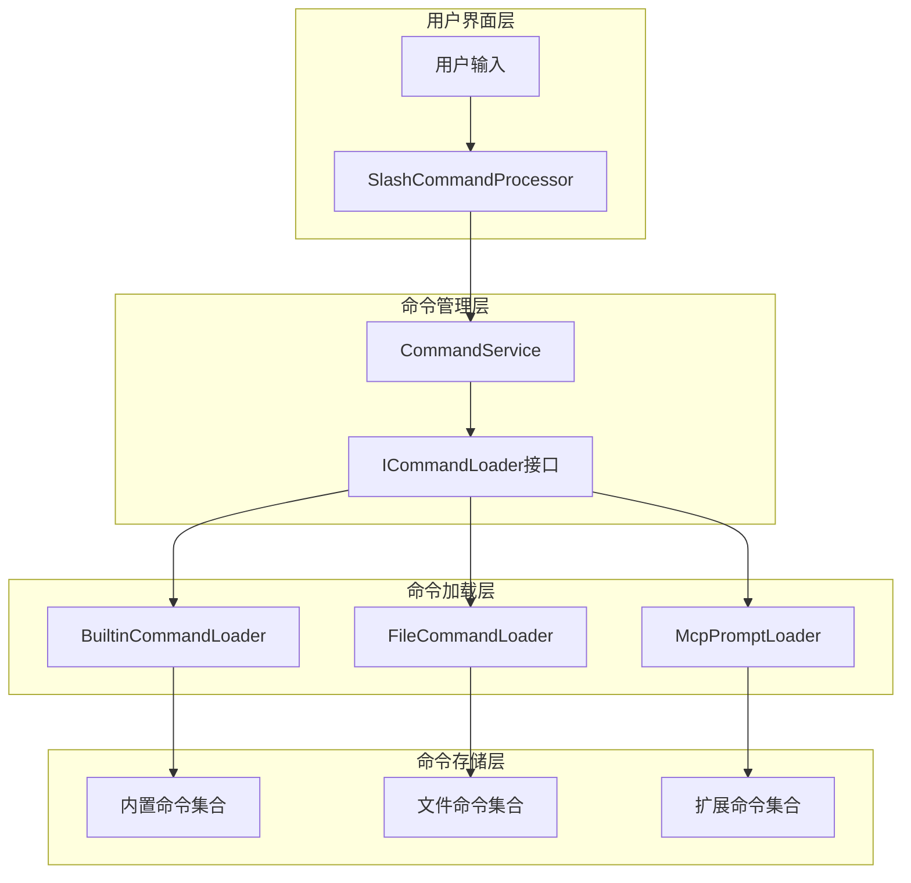
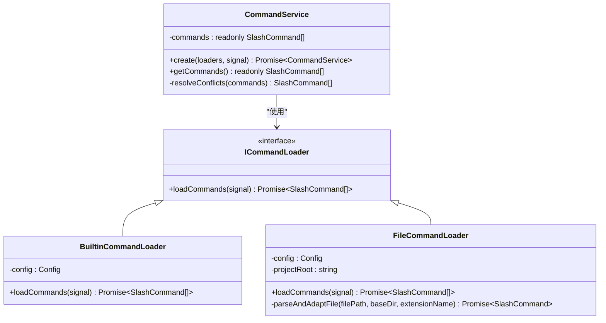
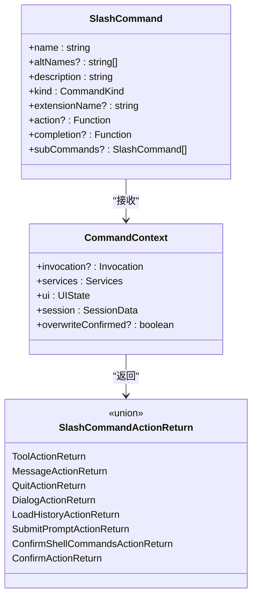
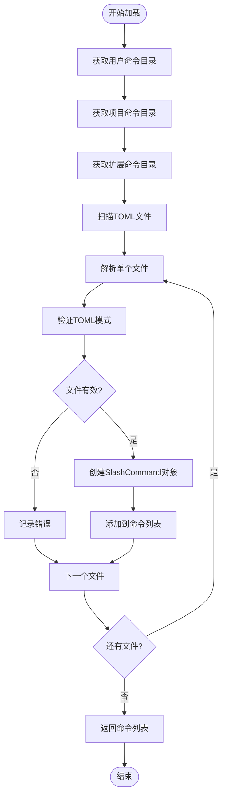
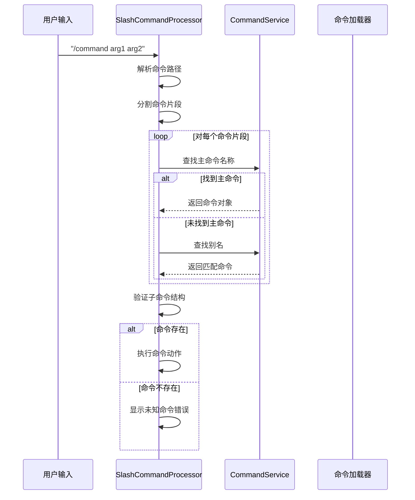
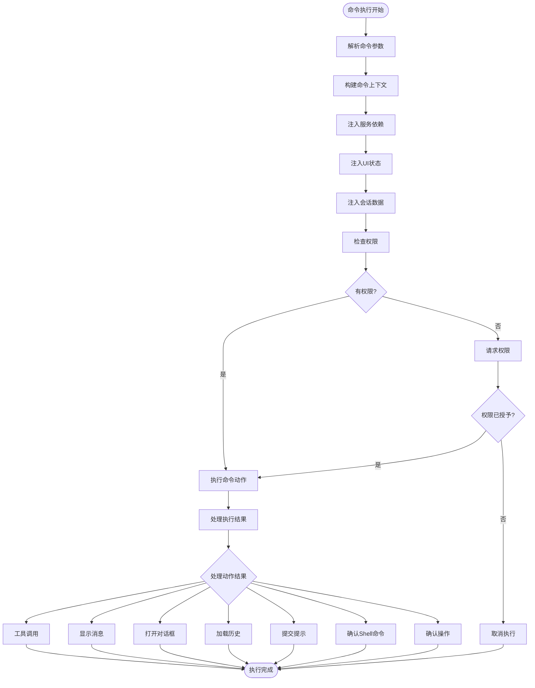
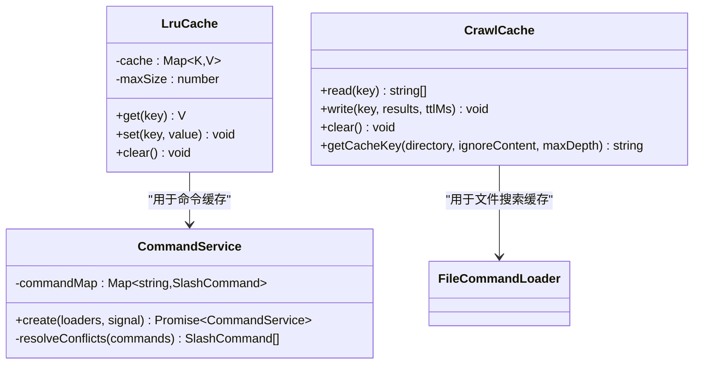

# 命令调度系统

<cite>
**本文档引用的文件**
- [CommandService.ts](file://packages/cli/src/services/CommandService.ts)
- [BuiltinCommandLoader.ts](file://packages/cli/src/services/BuiltinCommandLoader.ts)
- [FileCommandLoader.ts](file://packages/cli/src/services/FileCommandLoader.ts)
- [types.ts](file://packages/cli/src/services/types.ts)
- [slashCommandProcessor.ts](file://packages/cli/src/ui/hooks/slashCommandProcessor.ts)
- [types.ts](file://packages/cli/src/ui/commands/types.ts)
- [helpCommand.ts](file://packages/cli/src/ui/commands/helpCommand.ts)
- [crawlCache.ts](file://packages/core/src/utils/filesearch/crawlCache.ts)
- [LruCache.ts](file://packages/core/src/utils/LruCache.ts)
</cite>

## 目录
1. [简介](#简介)
2. [架构概览](#架构概览)
3. [核心组件分析](#核心组件分析)
4. [命令加载机制](#命令加载机制)
5. [命令匹配算法](#命令匹配算法)
6. [命令执行流程](#命令执行流程)
7. [性能优化策略](#性能优化策略)
8. [故障排除指南](#故障排除指南)
9. [总结](#总结)

## 简介

Qwen Code的命令调度系统是一个高度模块化和可扩展的架构，负责管理所有Slash命令的发现、加载、匹配和执行。该系统通过CommandService作为中央协调器，结合多种命令加载器（BuiltinCommandLoader、FileCommandLoader等），实现了灵活的命令注册表管理和高效的命令执行机制。

系统的核心设计理念是提供统一的命令接口，支持内置命令、文件级命令和扩展命令的无缝集成，同时确保高性能和良好的用户体验。

## 架构概览

命令调度系统采用分层架构设计，主要包括以下层次：



**图表来源**
- [CommandService.ts](file://packages/cli/src/services/CommandService.ts#L1-L104)
- [slashCommandProcessor.ts](file://packages/cli/src/ui/hooks/slashCommandProcessor.ts#L1-L685)

## 核心组件分析

### CommandService - 命令服务中心

CommandService是整个命令调度系统的核心协调器，负责管理所有命令加载器的生命周期和命令冲突解决。



**图表来源**
- [CommandService.ts](file://packages/cli/src/services/CommandService.ts#L20-L104)
- [types.ts](file://packages/cli/src/services/types.ts#L10-L24)
- [BuiltinCommandLoader.ts](file://packages/cli/src/services/BuiltinCommandLoader.ts#L41-L94)
- [FileCommandLoader.ts](file://packages/cli/src/services/FileCommandLoader.ts#L47-L308)

**章节来源**
- [CommandService.ts](file://packages/cli/src/services/CommandService.ts#L1-L104)
- [types.ts](file://packages/cli/src/services/types.ts#L1-L25)

### 命令类型系统

系统定义了完整的命令类型体系，支持多种命令类型和返回结果：



**图表来源**
- [types.ts](file://packages/cli/src/ui/commands/types.ts#L150-L211)

**章节来源**
- [types.ts](file://packages/cli/src/ui/commands/types.ts#L1-L212)

## 命令加载机制

### 内置命令加载器（BuiltinCommandLoader）

BuiltinCommandLoader负责加载应用程序的核心内置命令，这些命令是硬编码在代码中的基础功能。

```typescript
// 内置命令加载示例
async loadCommands(_signal: AbortSignal): Promise<SlashCommand[]> {
  const allDefinitions: Array<SlashCommand | null> = [
    aboutCommand,
    agentsCommand,
    approvalModeCommand,
    authCommand,
    bugCommand,
    chatCommand,
    clearCommand,
    // ... 更多内置命令
  ];
  
  return allDefinitions.filter((cmd): cmd is SlashCommand => cmd !== null);
}
```

### 文件命令加载器（FileCommandLoader）

FileCommandLoader扫描用户配置目录和项目目录，发现并加载自定义命令定义文件。



**图表来源**
- [FileCommandLoader.ts](file://packages/cli/src/services/FileCommandLoader.ts#L60-L120)

### 命令加载顺序和优先级

命令加载遵循特定的优先级顺序，确保正确的冲突解决：

1. **MCP提示加载器** - 最高优先级
2. **内置命令加载器** - 中等优先级
3. **文件命令加载器** - 最低优先级

这种顺序确保：
- 用户自定义命令可以覆盖内置命令
- 扩展命令可以在最后阶段检测所有冲突
- 冲突解决策略得到正确应用

**章节来源**
- [FileCommandLoader.ts](file://packages/cli/src/services/FileCommandLoader.ts#L1-L308)
- [BuiltinCommandLoader.ts](file://packages/cli/src/services/BuiltinCommandLoader.ts#L1-L95)

## 命令匹配算法

### 前缀匹配和别名解析

SlashCommandProcessor实现了智能的命令匹配算法，支持主命令名称和别名的双重匹配：



**图表来源**
- [slashCommandProcessor.ts](file://packages/cli/src/ui/hooks/slashCommandProcessor.ts#L288-L350)

### 多级命令匹配

系统支持多级命令结构，允许复杂的嵌套命令：

```typescript
// 示例：多级命令匹配
const commandPath = ['memory', 'add', 'file.txt']
let currentCommands = commands;
let commandToExecute: SlashCommand | undefined;

for (const part of commandPath) {
  let foundCommand = currentCommands.find(cmd => cmd.name === part);
  
  if (!foundCommand) {
    foundCommand = currentCommands.find(cmd => 
      cmd.altNames?.includes(part)
    );
  }
  
  if (foundCommand) {
    commandToExecute = foundCommand;
    if (foundCommand.subCommands) {
      currentCommands = foundCommand.subCommands;
    }
  }
}
```

**章节来源**
- [slashCommandProcessor.ts](file://packages/cli/src/ui/hooks/slashCommandProcessor.ts#L288-L350)

## 命令执行流程

### 参数解析和上下文注入

命令执行过程包含完整的参数解析和上下文注入机制：



**图表来源**
- [slashCommandProcessor.ts](file://packages/cli/src/ui/hooks/slashCommandProcessor.ts#L350-L600)

### 权限校验和安全控制

系统实现了多层次的安全控制机制：

1. **Shell命令确认** - 对危险Shell命令进行用户确认
2. **文件操作权限** - 控制文件读写访问
3. **网络请求限制** - 限制外部API调用
4. **会话级权限** - 基于当前会话状态的动态权限

**章节来源**
- [slashCommandProcessor.ts](file://packages/cli/src/ui/hooks/slashCommandProcessor.ts#L350-L685)

## 性能优化策略

### 缓存机制

系统实现了多层缓存机制以提升性能：



**图表来源**
- [LruCache.ts](file://packages/core/src/utils/LruCache.ts#L1-L40)
- [crawlCache.ts](file://packages/core/src/utils/filesearch/crawlCache.ts#L1-L70)

### 懒加载和延迟初始化

系统采用懒加载策略减少启动时间：

1. **按需加载命令** - 只在需要时加载特定命令
2. **延迟文件扫描** - 在首次访问时才扫描命令文件
3. **异步初始化** - 使用Promise.allSettled并行加载多个命令源

### 内存优化

- **只读数组** - 使用Object.freeze保护命令列表
- **弱引用** - 合理使用WeakMap避免内存泄漏
- **定时清理** - 自动清理过期缓存条目

**章节来源**
- [crawlCache.ts](file://packages/core/src/utils/filesearch/crawlCache.ts#L1-L70)
- [LruCache.ts](file://packages/core/src/utils/LruCache.ts#L1-L40)

## 故障排除指南

### 常见问题和解决方案

1. **命令加载失败**
   - 检查TOML文件语法
   - 验证命令定义模式
   - 查看控制台错误日志

2. **命令匹配失败**
   - 确认命令名称拼写
   - 检查别名配置
   - 验证命令层级结构

3. **权限拒绝错误**
   - 检查用户权限设置
   - 验证文件系统访问权限
   - 确认Shell命令白名单

### 调试技巧

- 启用调试模式查看详细日志
- 使用命令历史记录追踪执行路径
- 检查缓存状态和失效原因

**章节来源**
- [slashCommandProcessor.ts](file://packages/cli/src/ui/hooks/slashCommandProcessor.ts#L600-L685)

## 总结

Qwen Code的命令调度系统展现了现代软件架构的最佳实践，通过模块化设计、清晰的职责分离和完善的性能优化策略，构建了一个高效、可扩展且易于维护的命令管理系统。

系统的主要优势包括：

- **高度模块化** - 清晰的组件分离和接口定义
- **灵活扩展** - 支持多种命令源和自定义扩展
- **高性能** - 多层缓存和懒加载优化
- **安全性** - 完善的权限控制和安全检查
- **易用性** - 直观的命令语法和丰富的帮助功能

该系统为开发者提供了强大而灵活的命令处理能力，同时保持了良好的性能表现和用户体验。