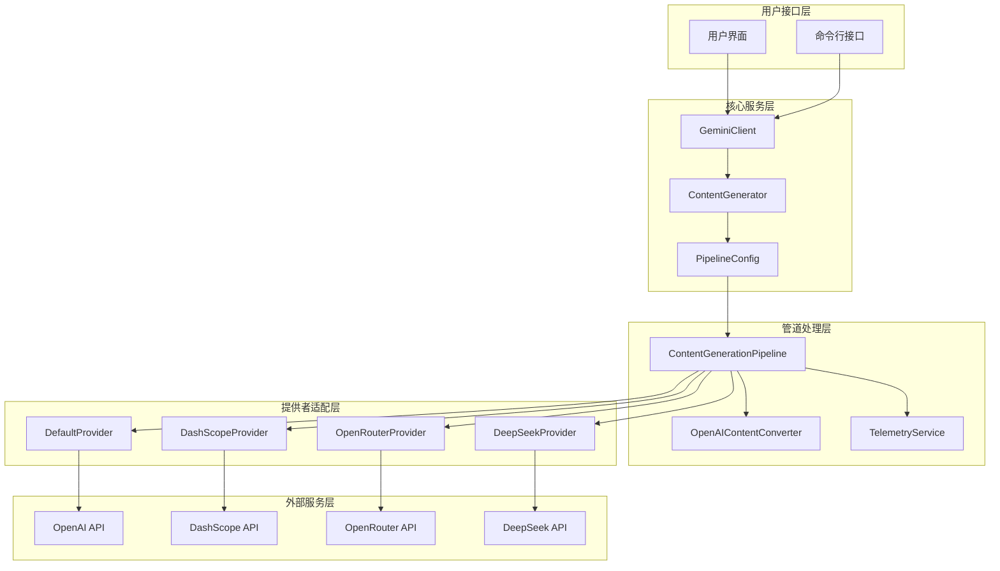
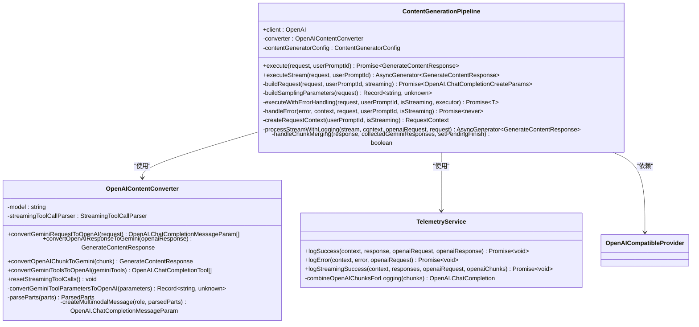
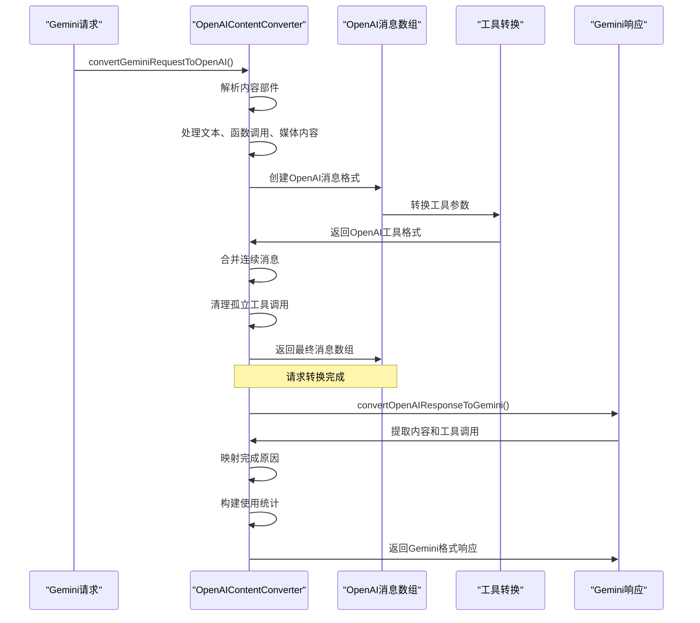
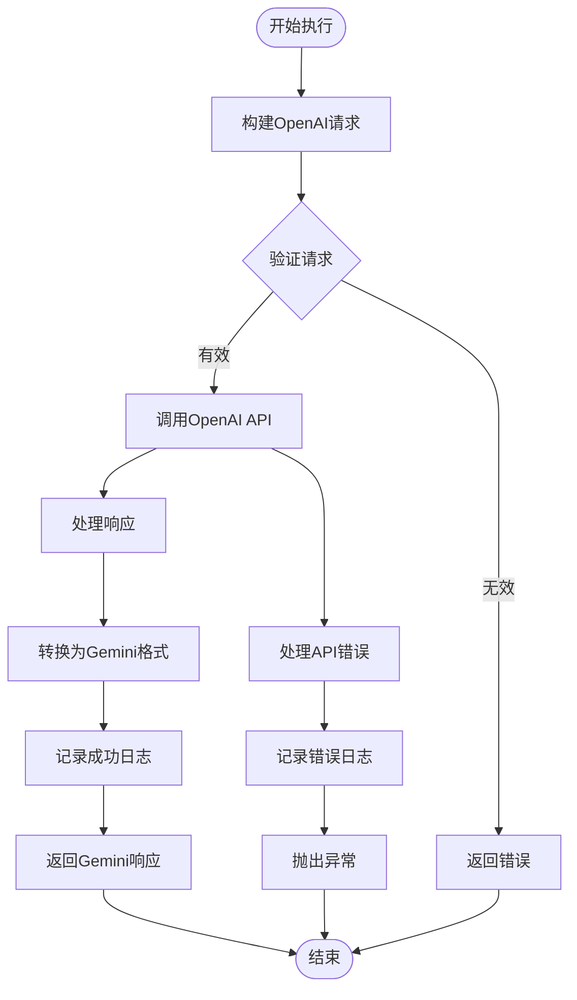
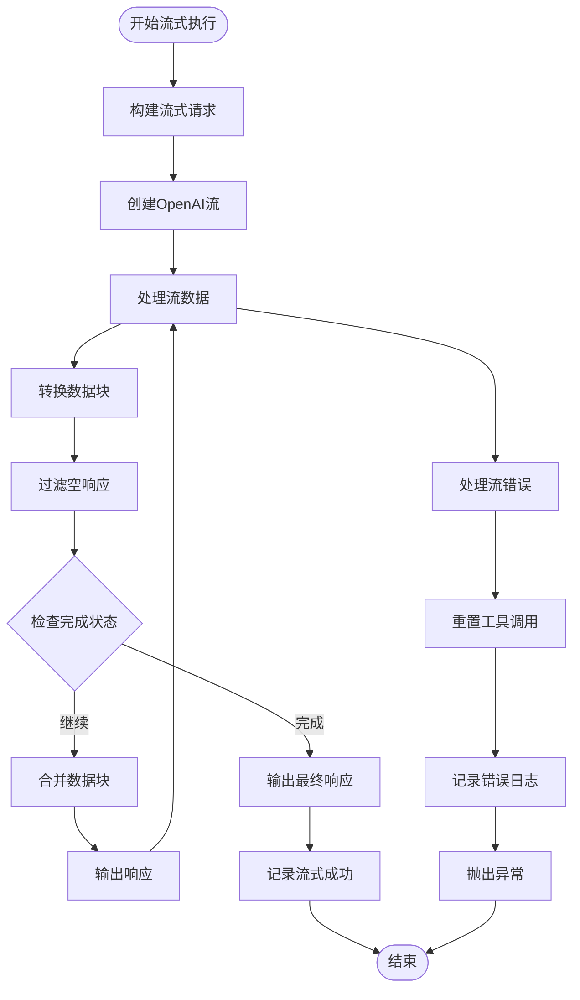
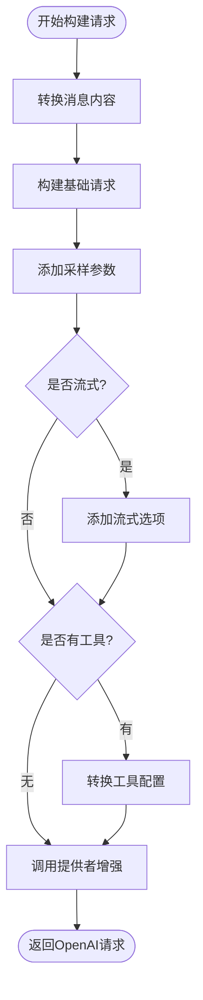
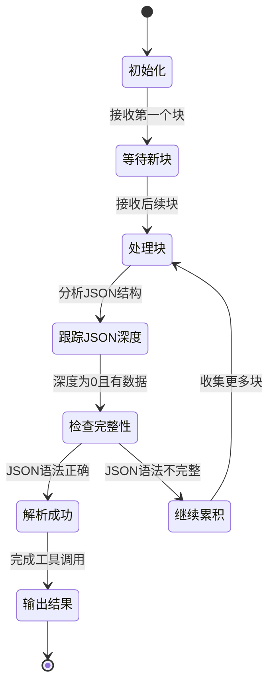
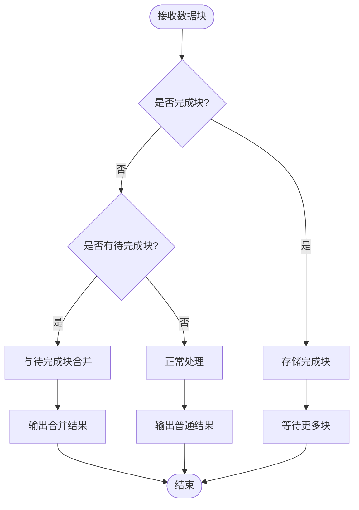
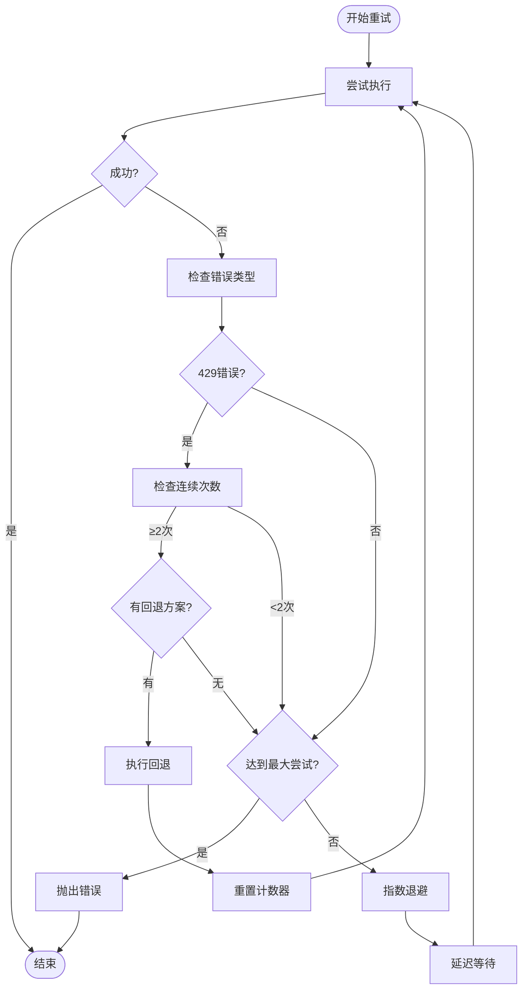
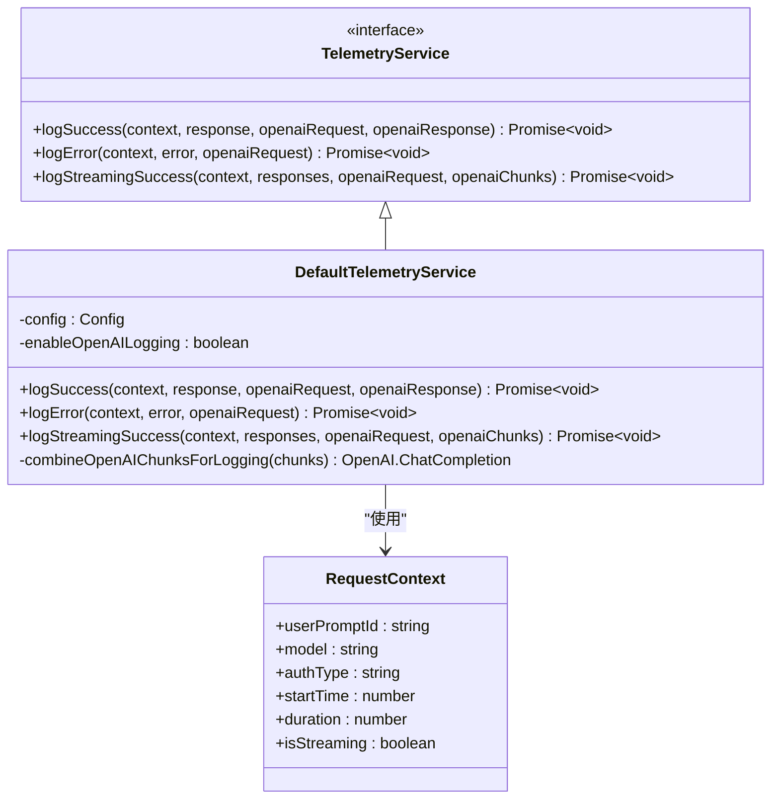

# 核心管道执行流程文档

<cite>
**本文档引用的文件**
- [pipeline.ts](file://packages/core/src/core/openaiContentGenerator/pipeline.ts)
- [converter.ts](file://packages/core/src/core/openaiContentGenerator/converter.ts)
- [client.ts](file://packages/core/src/core/client.ts)
- [telemetryService.ts](file://packages/core/src/core/openaiContentGenerator/telemetryService.ts)
- [retry.ts](file://packages/core/src/utils/retry.ts)
- [streamingToolCallParser.ts](file://packages/core/src/core/openaiContentGenerator/streamingToolCallParser.ts)
- [default.ts](file://packages/core/src/core/openaiContentGenerator/provider/default.ts)
- [types.ts](file://packages/core/src/core/openaiContentGenerator/provider/types.ts)
</cite>

## 目录
1. [简介](#简介)
2. [项目架构概览](#项目架构概览)
3. [核心组件分析](#核心组件分析)
4. [管道执行流程](#管道执行流程)
5. [请求转换机制](#请求转换机制)
6. [流式响应处理](#流式响应处理)
7. [错误处理与重试机制](#错误处理与重试机制)
8. [遥测与监控](#遥测与监控)
9. [性能优化策略](#性能优化策略)
10. [故障排除指南](#故障排除指南)
11. [总结](#总结)

## 简介

ContentGenerationPipeline是qwen-code核心层的关键组件，负责将Gemini格式的请求转换为OpenAI兼容格式，并协调模型调用、流式响应处理和错误重试。该管道系统通过多层抽象实现了从用户输入到模型响应的完整数据流转，确保了不同模型提供商之间的兼容性和可靠性。

## 项目架构概览



**图表来源**
- [pipeline.ts](file://packages/core/src/core/openaiContentGenerator/pipeline.ts#L1-L418)
- [client.ts](file://packages/core/src/core/client.ts#L1-L799)

## 核心组件分析

### ContentGenerationPipeline 类

ContentGenerationPipeline是整个管道的核心控制器，负责协调各个组件的工作流程。



**图表来源**
- [pipeline.ts](file://packages/core/src/core/openaiContentGenerator/pipeline.ts#L25-L418)
- [converter.ts](file://packages/core/src/core/openaiContentGenerator/converter.ts#L45-L1036)

**章节来源**
- [pipeline.ts](file://packages/core/src/core/openaiContentGenerator/pipeline.ts#L25-L418)
- [converter.ts](file://packages/core/src/core/openaiContentGenerator/converter.ts#L45-L1036)

### OpenAIContentConverter 转换器

OpenAIContentConverter负责在Gemini和OpenAI格式之间进行双向转换，是管道中的关键桥梁组件。



**图表来源**
- [converter.ts](file://packages/core/src/core/openaiContentGenerator/converter.ts#L150-L300)
- [converter.ts](file://packages/core/src/core/openaiContentGenerator/converter.ts#L700-L850)

**章节来源**
- [converter.ts](file://packages/core/src/core/openaiContentGenerator/converter.ts#L150-L850)

## 管道执行流程

### 非流式执行流程



**图表来源**
- [pipeline.ts](file://packages/core/src/core/openaiContentGenerator/pipeline.ts#L35-L55)

### 流式执行流程



**图表来源**
- [pipeline.ts](file://packages/core/src/core/openaiContentGenerator/pipeline.ts#L57-L85)
- [pipeline.ts](file://packages/core/src/core/openaiContentGenerator/pipeline.ts#L87-L150)

**章节来源**
- [pipeline.ts](file://packages/core/src/core/openaiContentGenerator/pipeline.ts#L35-L150)

## 请求转换机制

### buildRequest 方法详解

buildRequest方法是管道的核心转换逻辑，负责将Gemini格式的请求参数转换为OpenAI兼容格式。



**图表来源**
- [pipeline.ts](file://packages/core/src/core/openaiContentGenerator/pipeline.ts#L250-L290)

### 采样参数处理

buildSamplingParameters方法实现了智能的参数优先级处理：

1. **优先级顺序**: 请求参数 > 配置参数 > 默认值
2. **参数映射**: 将Gemini参数名映射到OpenAI参数名
3. **类型转换**: 确保数值参数的正确类型

```typescript
// 参数优先级示例
const temperature = getParameterValue('temperature', 'temperature', 0.0);
const top_p = getParameterValue('top_p', 'topP', 1.0);
const max_tokens = getParameterValue('max_tokens', 'maxOutputTokens');
```

**章节来源**
- [pipeline.ts](file://packages/core/src/core/openaiContentGenerator/pipeline.ts#L250-L320)

## 流式响应处理

### StreamingToolCallParser 工作原理

StreamingToolCallParser专门处理流式工具调用的复杂性，解决了多个技术挑战：



**图表来源**
- [streamingToolCallParser.ts](file://packages/core/src/core/openaiContentGenerator/streamingToolCallParser.ts#L1-L415)

### 块合并策略

handleChunkMerging方法实现了复杂的块合并逻辑，处理不同提供商发送finishReason和usageMetadata分离的问题：



**图表来源**
- [pipeline.ts](file://packages/core/src/core/openaiContentGenerator/pipeline.ts#L152-L200)

**章节来源**
- [pipeline.ts](file://packages/core/src/core/openaiContentGenerator/pipeline.ts#L152-L200)
- [streamingToolCallParser.ts](file://packages/core/src/core/openaiContentGenerator/streamingToolCallParser.ts#L1-L415)

## 错误处理与重试机制

### retryWithBackoff 实现

retryWithBackoff提供了智能的指数退避重试机制：



**图表来源**
- [retry.ts](file://packages/core/src/utils/retry.ts#L70-L200)

### 错误分类与处理

系统对不同类型的错误采用不同的处理策略：

1. **429错误**: 指数退避 + 可选回退方案
2. **5xx服务器错误**: 指数退避
3. **认证错误**: 直接抛出
4. **网络错误**: 指数退避

**章节来源**
- [retry.ts](file://packages/core/src/utils/retry.ts#L70-L356)

## 遥测与监控

### TelemetryService 功能

TelemetryService提供了完整的监控和日志记录功能：



**图表来源**
- [telemetryService.ts](file://packages/core/src/core/openaiContentGenerator/telemetryService.ts#L15-L50)

### 日志记录策略

1. **成功请求**: 记录响应时间、令牌使用量、模型信息
2. **错误请求**: 记录错误详情、请求ID、认证类型
3. **流式请求**: 合并所有数据块后记录完整交互

**章节来源**
- [telemetryService.ts](file://packages/core/src/core/openaiContentGenerator/telemetryService.ts#L15-L256)

## 性能优化策略

### 缓存与复用

1. **客户端缓存**: OpenAI客户端实例复用
2. **转换器缓存**: 内容转换结果缓存
3. **工具调用解析器**: 流式工具调用状态复用

### 异步处理优化

1. **并发请求**: 支持多个独立请求并发执行
2. **流式处理**: 实现真正的流式响应处理
3. **背压控制**: 自动处理高负载情况下的背压

### 内存管理

1. **及时清理**: 流式处理完成后立即清理状态
2. **对象池**: 复用频繁创建的对象
3. **垃圾回收**: 主动释放不再需要的资源

## 故障排除指南

### 常见问题诊断

1. **转换失败**: 检查Gemini到OpenAI格式映射
2. **流式中断**: 验证StreamingToolCallParser状态
3. **超时问题**: 调整超时设置和重试参数
4. **认证错误**: 验证API密钥和权限设置

### 调试工具

1. **详细日志**: 启用详细的遥测日志记录
2. **状态检查**: 使用内置的状态检查工具
3. **性能监控**: 监控请求延迟和成功率

**章节来源**
- [pipeline.ts](file://packages/core/src/core/openaiContentGenerator/pipeline.ts#L320-L418)

## 总结

ContentGenerationPipeline通过精心设计的架构和多层抽象，实现了从Gemini格式到OpenAI兼容格式的无缝转换。其核心优势包括：

1. **高度可扩展**: 支持多种模型提供商和格式转换
2. **健壮的错误处理**: 完善的重试机制和错误恢复
3. **实时流式处理**: 支持真正的流式响应和工具调用
4. **全面的监控**: 完整的遥测和日志记录功能
5. **性能优化**: 多种优化策略确保高效运行

该管道系统为qwen-code提供了稳定可靠的模型调用基础设施，支持复杂的对话场景和工具集成需求。