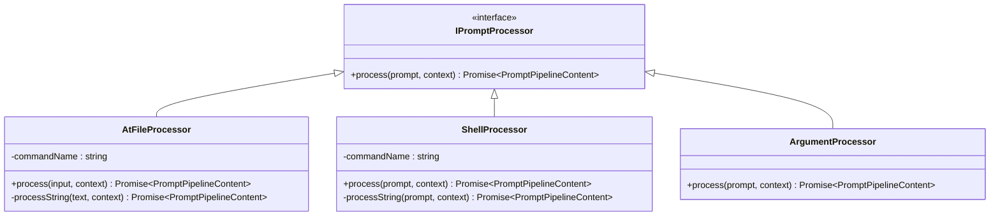

# 请求处理流程

<cite>
**本文档引用的文件**
- [packages/cli/src/services/prompt-processors/injectionParser.ts](file://packages/cli/src/services/prompt-processors/injectionParser.ts)
- [packages/cli/src/services/prompt-processors/atFileProcessor.ts](file://packages/cli/src/services/prompt-processors/atFileProcessor.ts)
- [packages/cli/src/services/prompt-processors/shellProcessor.ts](file://packages/cli/src/services/prompt-processors/shellProcessor.ts)
- [packages/cli/src/services/CommandService.ts](file://packages/cli/src/services/CommandService.ts)
- [packages/core/src/core/openaiContentGenerator/pipeline.ts](file://packages/core/src/core/openaiContentGenerator/pipeline.ts)
- [packages/core/src/core/contentGenerator.ts](file://packages/core/src/core/contentGenerator.ts)
- [packages/core/src/telemetry/loggers.ts](file://packages/core/src/telemetry/loggers.ts)
</cite>

## 目录
1. [简介](#简介)
2. [项目结构概览](#项目结构概览)
3. [CLI层处理流程](#cli层处理流程)
4. [核心层处理流程](#核心层处理流程)
5. [详细组件分析](#详细组件分析)
6. [数据流分析](#数据流分析)
7. [错误处理机制](#错误处理机制)
8. [遥测日志记录](#遥测日志记录)
9. [性能考虑](#性能考虑)
10. [故障排除指南](#故障排除指南)
11. [总结](#总结)

## 简介

qwen-code系统是一个复杂的AI代码助手平台，其请求处理流程涉及多个层次的处理和转换。本文档详细分析了从用户输入到AI模型调用的完整请求处理流程，重点关注CLI层的prompt processors如何对原始输入进行预处理，以及core层如何将Gemini格式请求转换为OpenAI兼容格式。

该系统采用分层架构设计，通过prompt processors（如atFileProcessor、shellProcessor）解析出!{}或@{}格式的指令注入，通过injectionParser.ts中的extractInjections函数进行语法校验与内容提取。然后，CommandService根据解析后的命令名称查找对应的处理器并进行调度，最终通过ContentGenerationPipeline完成请求转换和AI模型调用。

## 项目结构概览


**图表来源**
- [packages/cli/src/services/CommandService.ts](file://packages/cli/src/services/CommandService.ts#L1-L104)
- [packages/core/src/core/openaiContentGenerator/pipeline.ts](file://packages/core/src/core/openaiContentGenerator/pipeline.ts#L1-L50)

## CLI层处理流程

CLI层负责处理用户输入并进行初步的预处理。主要包含以下三个关键组件：

### Prompt Processors架构



**图表来源**
- [packages/cli/src/services/prompt-processors/atFileProcessor.ts](file://packages/cli/src/services/prompt-processors/atFileProcessor.ts#L1-L50)
- [packages/cli/src/services/prompt-processors/shellProcessor.ts](file://packages/cli/src/services/prompt-processors/shellProcessor.ts#L1-L50)

### Injection Parser处理流程


**图表来源**
- [packages/cli/src/services/prompt-processors/injectionParser.ts](file://packages/cli/src/services/prompt-processors/injectionParser.ts#L25-L89)
- [packages/cli/src/services/prompt-processors/atFileProcessor.ts](file://packages/cli/src/services/prompt-processors/atFileProcessor.ts#L20-L80)

**章节来源**
- [packages/cli/src/services/prompt-processors/injectionParser.ts](file://packages/cli/src/services/prompt-processors/injectionParser.ts#L1-L90)
- [packages/cli/src/services/prompt-processors/atFileProcessor.ts](file://packages/cli/src/services/prompt-processors/atFileProcessor.ts#L1-L97)
- [packages/cli/src/services/prompt-processors/shellProcessor.ts](file://packages/cli/src/services/prompt-processors/shellProcessor.ts#L1-L208)

## 核心层处理流程

核心层负责将CLI层处理后的请求转换为AI模型可接受的格式，并执行实际的AI模型调用。

### ContentGenerationPipeline架构


**图表来源**
- [packages/core/src/core/openaiContentGenerator/pipeline.ts](file://packages/core/src/core/openaiContentGenerator/pipeline.ts#L20-L50)

### 请求转换流程


**图表来源**
- [packages/core/src/core/openaiContentGenerator/pipeline.ts](file://packages/core/src/core/openaiContentGenerator/pipeline.ts#L150-L200)

**章节来源**
- [packages/core/src/core/openaiContentGenerator/pipeline.ts](file://packages/core/src/core/openaiContentGenerator/pipeline.ts#L1-L418)

## 详细组件分析

### AtFileProcessor详细分析

AtFileProcessor负责处理@{}格式的文件注入指令。它通过extractInjections函数识别文件路径，并尝试读取对应文件的内容。

```typescript
// 文件注入处理示例
const injections = extractInjections(
  text,
  AT_FILE_INJECTION_TRIGGER,
  this.commandName,
);
```

该处理器支持：
- 文件内容注入
- Gitignore过滤
- 错误处理和回退机制
- UI消息通知

### ShellProcessor详细分析

ShellProcessor处理!{}格式的Shell命令注入，具有更复杂的安全检查和权限验证机制。

```typescript
// Shell注入处理流程
const injections = extractInjections(
  prompt,
  SHELL_INJECTION_TRIGGER,
  this.commandName,
);

// 安全检查
const { allAllowed, disallowedCommands, blockReason, isHardDenial } =
  checkCommandPermissions(command, config, sessionShellAllowlist);
```

安全特性包括：
- 命令权限检查
- 参数转义
- 执行结果收集
- 异常处理

### CommandService详细分析

CommandService负责命令发现、加载和冲突解决。


**图表来源**
- [packages/cli/src/services/CommandService.ts](file://packages/cli/src/services/CommandService.ts#L40-L80)

**章节来源**
- [packages/cli/src/services/prompt-processors/atFileProcessor.ts](file://packages/cli/src/services/prompt-processors/atFileProcessor.ts#L20-L97)
- [packages/cli/src/services/prompt-processors/shellProcessor.ts](file://packages/cli/src/services/prompt-processors/shellProcessor.ts#L40-L150)
- [packages/cli/src/services/CommandService.ts](file://packages/cli/src/services/CommandService.ts#L1-L104)

## 数据流分析

完整的请求处理数据流如下：


**图表来源**
- [packages/cli/src/services/CommandService.ts](file://packages/cli/src/services/CommandService.ts#L40-L70)
- [packages/core/src/core/openaiContentGenerator/pipeline.ts](file://packages/core/src/core/openaiContentGenerator/pipeline.ts#L30-L60)

## 错误处理机制

系统实现了多层次的错误处理机制：

### Prompt Processor错误处理


### Pipeline错误处理

```typescript
private async handleError(
  error: unknown,
  context: RequestContext,
  request: GenerateContentParameters,
  userPromptId?: string,
  isStreaming?: boolean,
): Promise<never> {
  // 构建请求用于日志记录
  let openaiRequest: OpenAI.ChatCompletionCreateParams;
  try {
    openaiRequest = await this.buildRequest(request, userPromptId, isStreaming);
  } catch (_buildError) {
    // 创建最小请求用于日志
    openaiRequest = { model: this.contentGeneratorConfig.model, messages: [] };
  }
  
  // 记录错误并处理
  await this.config.telemetryService.logError(context, error, openaiRequest);
  this.config.errorHandler.handle(error, context, request);
}
```

**章节来源**
- [packages/core/src/core/openaiContentGenerator/pipeline.ts](file://packages/core/src/core/openaiContentGenerator/pipeline.ts#L350-L400)

## 遥测日志记录

系统集成了全面的遥测和日志记录功能：

### 日志记录架构


**图表来源**
- [packages/core/src/telemetry/loggers.ts](file://packages/core/src/telemetry/loggers.ts#L1-L50)

### 流式响应处理


**图表来源**
- [packages/core/src/core/openaiContentGenerator/pipeline.ts](file://packages/core/src/core/openaiContentGenerator/pipeline.ts#L80-L150)

**章节来源**
- [packages/core/src/telemetry/loggers.ts](file://packages/core/src/telemetry/loggers.ts#L1-L200)

## 性能考虑

系统在设计时充分考虑了性能优化：

### 流式处理优化

- 支持异步流式处理，避免阻塞UI
- 实现chunk合并机制，减少网络往返
- 使用LRU缓存管理工具调用状态

### 内存管理

- 及时清理流式工具调用状态
- 限制并发请求数量
- 实现优雅的资源释放

### 缓存策略

- 工具调用结果缓存
- 文件内容缓存
- 配置信息缓存

## 故障排除指南

### 常见问题诊断

1. **注入语法错误**
   - 检查大括号是否平衡
   - 验证命令名称正确性
   - 确认文件路径存在

2. **权限被拒绝**
   - 检查shell命令白名单
   - 验证文件访问权限
   - 确认用户认证状态

3. **网络连接问题**
   - 检查代理设置
   - 验证API密钥有效性
   - 确认模型可用性

### 调试工具

- 启用调试模式获取详细日志
- 使用telemetry日志分析请求流程
- 检查错误堆栈跟踪

**章节来源**
- [packages/core/src/core/openaiContentGenerator/pipeline.ts](file://packages/core/src/core/openaiContentGenerator/pipeline.ts#L350-L418)

## 总结

qwen-code系统的请求处理流程体现了现代AI应用的最佳实践：

1. **分层架构设计**：清晰分离CLI层和Core层职责
2. **安全优先**：多层安全检查和权限控制
3. **错误处理**：完善的异常处理和恢复机制
4. **可观测性**：全面的日志记录和遥测功能
5. **性能优化**：流式处理和智能缓存策略

该系统通过精心设计的处理流程，确保了从用户输入到AI模型响应的高效、安全和可靠的数据流转。每个组件都承担着特定的职责，同时保持良好的解耦和可扩展性，为用户提供优质的AI代码辅助体验。