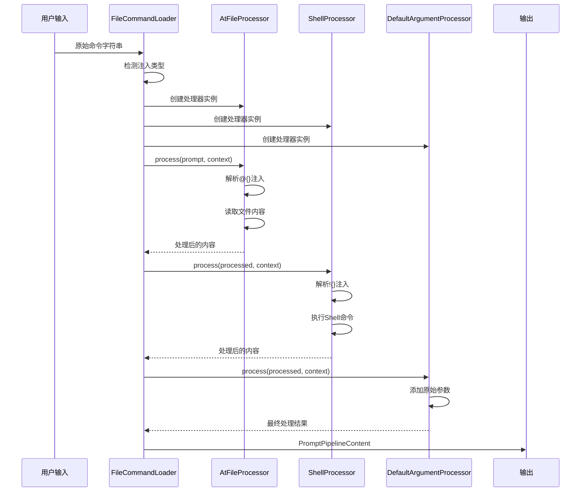
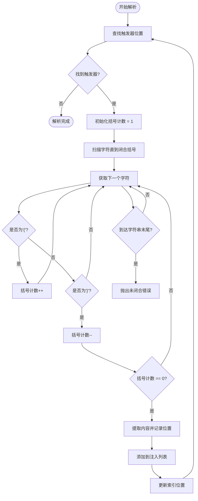
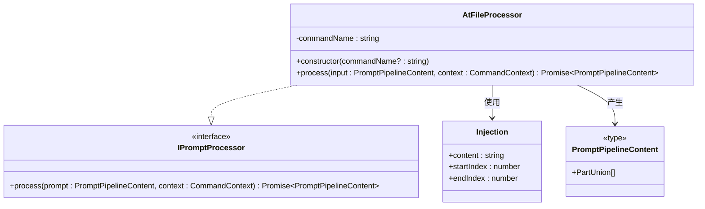
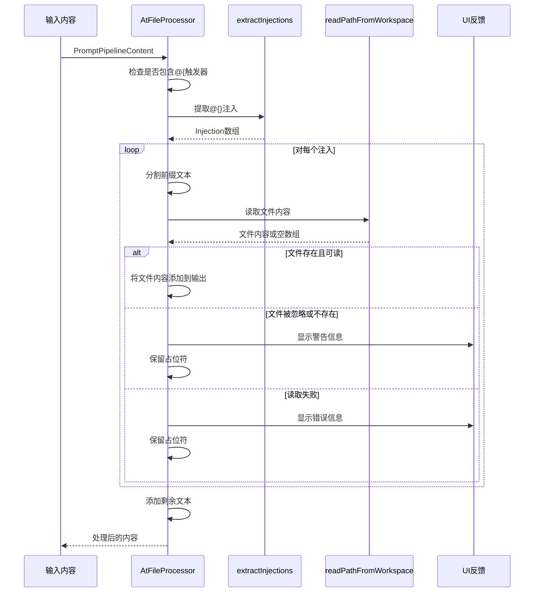
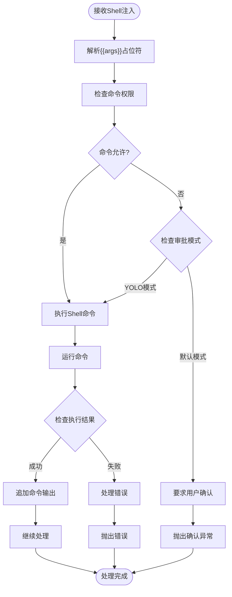
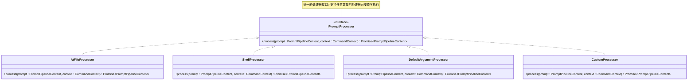
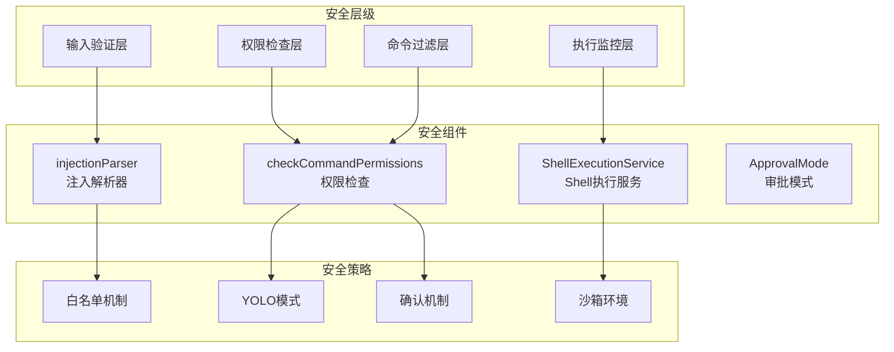

# 请求预处理机制

<cite>
**本文档中引用的文件**
- [injectionParser.ts](file://packages/cli/src/services/prompt-processors/injectionParser.ts)
- [atFileProcessor.ts](file://packages/cli/src/services/prompt-processors/atFileProcessor.ts)
- [shellProcessor.ts](file://packages/cli/src/services/prompt-processors/shellProcessor.ts)
- [argumentProcessor.ts](file://packages/cli/src/services/prompt-processors/argumentProcessor.ts)
- [types.ts](file://packages/cli/src/services/prompt-processors/types.ts)
- [FileCommandLoader.ts](file://packages/cli/src/services/FileCommandLoader.ts)
- [injectionParser.test.ts](file://packages/cli/src/services/prompt-processors/injectionParser.test.ts)
- [atFileProcessor.test.ts](file://packages/cli/src/services/prompt-processors/atFileProcessor.test.ts)
- [shellProcessor.test.ts](file://packages/cli/src/services/prompt-processors/shellProcessor.test.ts)
</cite>

## 目录
1. [简介](#简介)
2. [架构概览](#架构概览)
3. [核心组件分析](#核心组件分析)
4. [预处理器链](#预处理器链)
5. [注入解析器详解](#注入解析器详解)
6. [文件引用处理器](#文件引用处理器)
7. [Shell命令处理器](#shell命令处理器)
8. [扩展性设计](#扩展性设计)
9. [安全机制](#安全机制)
10. [故障排除指南](#故障排除指南)
11. [总结](#总结)

## 简介

Qwen-code系统中的用户输入预处理机制是一个高度模块化和可扩展的框架，专门设计用于处理和转换用户输入中的特殊指令注入。该系统通过三个主要的预处理器（@{}文件引用处理器、!{} Shell命令处理器和默认参数处理器）组成的管道，将原始输入转换为结构化的指令对象，并最终生成适合发送给语言模型的提示内容。

这种设计的核心优势在于：
- **安全性优先**：按照安全级别排序的处理器执行顺序
- **模块化设计**：每个处理器专注于特定的功能领域
- **错误处理**：完善的错误检测和恢复机制
- **扩展性**：清晰的接口设计支持未来新增处理器类型

## 架构概览

```mermaid
graph TB
subgraph "用户输入层"
UI[用户输入]
end
subgraph "预处理管道"
subgraph "处理器链"
A[AtFileProcessor<br/>@{} 文件引用]
S[ShellProcessor<br/>!{} Shell命令]
D[DefaultArgumentProcessor<br/>默认参数处理]
end
end
subgraph "核心引擎"
IP[injectionParser<br/>注入解析器]
EP[extractInjections<br/>提取注入函数]
end
subgraph "输出层"
PC[PromptPipelineContent<br/>处理后的内容]
end
UI --> A
A --> S
S --> D
D --> PC
A -.-> IP
S -.-> IP
IP --> EP
EP --> A
EP --> S
```

**图表来源**
- [FileCommandLoader.ts](file://packages/cli/src/services/FileCommandLoader.ts#L220-L240)
- [types.ts](file://packages/cli/src/services/prompt-processors/types.ts#L19-L36)

## 核心组件分析

### 预处理器接口设计

所有预处理器都实现了统一的`IPromptProcessor`接口，确保了系统的模块化和一致性：

```typescript
export interface IPromptProcessor {
  process(
    prompt: PromptPipelineContent,
    context: CommandContext,
  ): Promise<PromptPipelineContent>;
}
```

这个接口的设计体现了以下关键特性：
- **异步处理**：支持I/O密集型操作（如文件读取、Shell命令执行）
- **上下文感知**：访问完整的命令上下文信息
- **多模态支持**：处理文本和其他媒体类型的混合内容

### 处理管道架构



**图表来源**
- [FileCommandLoader.ts](file://packages/cli/src/services/FileCommandLoader.ts#L270-L290)
- [atFileProcessor.ts](file://packages/cli/src/services/prompt-processors/atFileProcessor.ts#L25-L50)

**章节来源**
- [types.ts](file://packages/cli/src/services/prompt-processors/types.ts#L19-L36)
- [FileCommandLoader.ts](file://packages/cli/src/services/FileCommandLoader.ts#L220-L240)

## 预处理器链

### 执行顺序与安全策略

预处理器按照严格的安全优先级顺序执行：

1. **@-File Injection处理器**（安全第一）
   - 首先运行以确保不会执行可能动态生成恶意路径的Shell命令
   - 只有在确认文件引用安全后才继续处理Shell注入

2. **Shell Injection处理器**（权限检查）
   - 在文件内容被安全注入后运行
   - 执行Shell命令前进行权限验证

3. **默认参数处理器**（最后补充）
   - 如果没有显式的`{{args}}`占位符，则追加原始调用参数

### 处理器创建逻辑

```typescript
// 1. @-File Injection (Security First)
if (usesAtFileInjection) {
  processors.push(new AtFileProcessor(baseCommandName));
}

// 2. Argument and Shell Injection
if (usesShellInjection || usesArgs) {
  processors.push(new ShellProcessor(baseCommandName));
}

// 3. Default Argument Handling
if (!usesArgs) {
  processors.push(new DefaultArgumentProcessor());
}
```

这种设计确保了：
- **安全隔离**：Shell命令永远不会在文件路径解析之前执行
- **依赖管理**：后续处理器可以安全地使用前序处理器的结果
- **错误传播**：任何处理器的错误都会阻止后续处理

**章节来源**
- [FileCommandLoader.ts](file://packages/cli/src/services/FileCommandLoader.ts#L230-L245)

## 注入解析器详解

### extractInjections函数实现

`injectionParser.ts`中的`extractInjections`函数是整个预处理系统的核心，负责识别和解析各种格式的指令注入。

```typescript
export function extractInjections(
  prompt: string,
  trigger: string,
  contextName?: string,
): Injection[] {
  const injections: Injection[] = [];
  let index = 0;

  while (index < prompt.length) {
    const startIndex = prompt.indexOf(trigger, index);
    
    if (startIndex === -1) {
      break;
    }
    
    // Brace counting logic for nested structures
    let currentIndex = startIndex + trigger.length;
    let braceCount = 1;
    let foundEnd = false;
    
    // ... brace counting implementation ...
  }
  
  return injections;
}
```

### 正则表达式匹配与语法校验

注入解析器采用智能的括号计数算法而非简单的正则表达式匹配，这使得它能够正确处理嵌套结构：



**图表来源**
- [injectionParser.ts](file://packages/cli/src/services/prompt-processors/injectionParser.ts#L25-L80)

### 内容提取与错误处理

解析器返回的`Injection`接口定义了标准的数据结构：

```typescript
export interface Injection {
  content: string;      // 提取的内容（已修剪）
  startIndex: number;   // 注入起始索引（包含触发器）
  endIndex: number;     // 注入结束索引（不包含触发器后的字符）
}
```

错误处理机制确保了系统的健壮性：

```typescript
if (!foundEnd) {
  const contextInfo = contextName ? ` in command '${contextName}'` : '';
  throw new Error(
    `Invalid syntax${contextInfo}: Unclosed injection starting at index ${startIndex} ('${trigger}').`
  );
}
```

### 支持的注入格式

系统支持两种主要的注入格式：

1. **文件引用格式**：`@{path/to/file.txt}`
2. **Shell命令格式**：`!{git status --porcelain}`

每种格式都有其特定的处理逻辑和安全考虑。

**章节来源**
- [injectionParser.ts](file://packages/cli/src/services/prompt-processors/injectionParser.ts#L1-L90)
- [injectionParser.test.ts](file://packages/cli/src/services/prompt-processors/injectionParser.test.ts#L1-L180)

## 文件引用处理器

### AtFileProcessor工作原理

`AtFileProcessor`负责处理`@{}`格式的文件引用注入，这是系统中最基础也是最安全的注入类型。



**图表来源**
- [atFileProcessor.ts](file://packages/cli/src/services/prompt-processors/atFileProcessor.ts#L19-L25)
- [types.ts](file://packages/cli/src/services/prompt-processors/types.ts#L10-L15)

### 数据流处理过程

文件引用处理器的处理流程如下：



**图表来源**
- [atFileProcessor.ts](file://packages/cli/src/services/prompt-processors/atFileProcessor.ts#L30-L90)

### 错误处理与用户体验

AtFileProcessor实现了完善的错误处理机制：

```typescript
try {
  const fileContentParts = await readPathFromWorkspace(pathStr, config);
  if (fileContentParts.length === 0) {
    const uiMessage = `File '@{${pathStr}}' was ignored by .gitignore or .qwenignore and was not included in the prompt.`;
    context.ui.addItem(
      { type: MessageType.INFO, text: uiMessage },
      Date.now(),
    );
  }
  output.push(...fileContentParts);
} catch (error) {
  const message = error instanceof Error ? error.message : String(error);
  const uiMessage = `Failed to inject content for '@{${pathStr}}': ${message}`;
  
  console.error(`[AtFileProcessor] ${uiMessage}. Leaving placeholder in prompt.`);
  context.ui.addItem(
    { type: MessageType.ERROR, text: uiMessage },
    Date.now(),
  );
  
  const placeholder = text.substring(injection.startIndex, injection.endIndex);
  output.push({ text: placeholder });
}
```

这种设计确保了：
- **优雅降级**：即使某个文件无法读取，也不会影响整体处理流程
- **用户反馈**：提供清晰的错误信息和状态指示
- **内容完整性**：保留原始占位符作为调试参考

**章节来源**
- [atFileProcessor.ts](file://packages/cli/src/services/prompt-processors/atFileProcessor.ts#L1-L97)
- [atFileProcessor.test.ts](file://packages/cli/src/services/prompt-processors/atFileProcessor.test.ts#L1-L200)

## Shell命令处理器

### ShellProcessor核心功能

`ShellProcessor`是最复杂也是最强大的预处理器，负责处理`!{}`格式的Shell命令注入，提供了完整的命令执行和安全控制功能。

### 安全检查与权限验证



**图表来源**
- [shellProcessor.ts](file://packages/cli/src/services/prompt-processors/shellProcessor.ts#L100-L180)

### 参数替换与转义

Shell处理器实现了智能的参数替换机制：

```typescript
private async processString(
  prompt: string,
  context: CommandContext,
): Promise<PromptPipelineContent> {
  const userArgsRaw = context.invocation?.args || '';
  
  // 替换外部{{args}}为原始输入
  if (!prompt.includes(SHELL_INJECTION_TRIGGER)) {
    return [{ text: prompt.replaceAll(SHORTHAND_ARGS_PLACEHOLDER, userArgsRaw) }];
  }
  
  // 解析内部{{args}}为转义后的输入
  const resolvedCommand = command.replaceAll(
    SHORTHAND_ARGS_PLACEHOLDER,
    escapeShellArg(userArgsRaw, shell),
  );
}
```

这种设计确保了：
- **外部参数**：`{{args}}`在`!{}`外部直接插入原始值
- **内部参数**：`{{args}}`在`!{}`内部自动转义，防止Shell注入攻击
- **跨平台兼容**：根据操作系统选择合适的转义策略

### 命令执行与结果处理

```typescript
const { result } = await ShellExecutionService.execute(
  injection.resolvedCommand,
  config.getTargetDir(),
  () => {},  // 进度回调
  new AbortController().signal,  // 中断信号
  config.getShouldUseNodePtyShell(),  // PTY支持
);

const executionResult = await result;

// 处理执行结果
if (executionResult.error && !executionResult.aborted) {
  throw new Error(`Failed to start shell command: ${executionResult.error.message}`);
}

// 追加输出，stderr明确标记
processedPrompt += executionResult.output;

// 添加状态消息
if (executionResult.exitCode !== 0 && executionResult.exitCode !== null) {
  processedPrompt += `\n[Shell command exited with code ${executionResult.exitCode}]`;
}
```

### 确认机制

对于不被允许的命令，ShellProcessor实现了分层的确认机制：

```typescript
if (!allAllowed) {
  if (isHardDenial) {
    throw new Error(`${this.commandName} cannot be run. Blocked command: "${command}"`);
  }
  
  // 如果不是硬拒绝，在YOLO模式下自动批准
  if (config.getApprovalMode() !== ApprovalMode.YOLO) {
    disallowedCommands.forEach((uc) => commandsToConfirm.add(uc));
  }
}

// 抛出确认异常，由UI层处理
if (commandsToConfirm.size > 0) {
  throw new ConfirmationRequiredError(
    'Shell command confirmation required',
    Array.from(commandsToConfirm),
  );
}
```

**章节来源**
- [shellProcessor.ts](file://packages/cli/src/services/prompt-processors/shellProcessor.ts#L1-L208)
- [shellProcessor.test.ts](file://packages/cli/src/services/prompt-processors/shellProcessor.test.ts#L1-L200)

## 扩展性设计

### 接口抽象与模块化

Qwen-code的预处理系统采用了高度抽象的设计，使得添加新的处理器类型变得简单而直观：



**图表来源**
- [types.ts](file://packages/cli/src/services/prompt-processors/types.ts#L19-L36)

### 新处理器开发指南

要添加新的处理器类型，开发者需要遵循以下步骤：

1. **实现IPromptProcessor接口**：
```typescript
export class CustomProcessor implements IPromptProcessor {
  async process(
    prompt: PromptPipelineContent,
    context: CommandContext,
  ): Promise<PromptPipelineContent> {
    // 实现自定义处理逻辑
    return modifiedPrompt;
  }
}
```

2. **在FileCommandLoader中注册**：
```typescript
// 检测自定义注入类型
const usesCustomInjection = validDef.prompt.includes(CUSTOM_TRIGGER);

if (usesCustomInjection) {
  processors.push(new CustomProcessor(commandName));
}
```

3. **定义触发器和配置**：
```typescript
export const CUSTOM_INJECTION_TRIGGER = '%{';
```

### 扩展点分析

系统提供了多个扩展点：

1. **注入触发器**：支持自定义的注入格式
2. **处理器优先级**：通过执行顺序控制处理逻辑
3. **错误处理策略**：支持不同的错误处理方式
4. **上下文信息**：提供丰富的命令上下文访问

**章节来源**
- [types.ts](file://packages/cli/src/services/prompt-processors/types.ts#L1-L55)
- [FileCommandLoader.ts](file://packages/cli/src/services/FileCommandLoader.ts#L220-L250)

## 安全机制

### 多层次安全防护

Qwen-code的预处理系统实现了多层次的安全防护机制：



### 权限验证机制

```typescript
const { allAllowed, disallowedCommands, blockReason, isHardDenial } = 
  checkCommandPermissions(command, config, sessionShellAllowlist);

if (!allAllowed) {
  if (isHardDenial) {
    throw new Error(`Command blocked: "${command}". Reason: ${blockReason}`);
  }
  
  if (config.getApprovalMode() !== ApprovalMode.YOLO) {
    disallowedCommands.forEach(cmd => commandsToConfirm.add(cmd));
  }
}
```

### 转义与清理

系统对Shell命令进行了严格的转义处理：

```typescript
// 跨平台转义逻辑
const userArgsEscaped = escapeShellArg(userArgsRaw, shell);

// 路径转义
const escapedPath = escapeShellArg(filePath, shell);
```

### 审批模式

系统支持三种审批模式：

1. **YOLO模式**：自动批准所有命令
2. **默认模式**：需要手动确认危险命令
3. **严格模式**：禁止所有Shell命令

**章节来源**
- [shellProcessor.ts](file://packages/cli/src/services/prompt-processors/shellProcessor.ts#L100-L140)

## 故障排除指南

### 常见问题与解决方案

#### 1. 未闭合的注入语法

**问题**：`Unclosed injection starting at index X ('!{')`

**原因**：注入语句缺少对应的闭合括号

**解决方案**：
```bash
# 错误示例
!{git status

# 正确示例
!{git status}
```

#### 2. 文件引用失败

**问题**：文件被忽略或不存在

**原因**：
- 文件被.gitignore或.qwenignore规则忽略
- 文件路径错误
- 文件权限不足

**解决方案**：
```bash
# 检查文件是否存在
ls -la @{path/to/file.txt}

# 检查忽略规则
cat .gitignore
cat .qwenignore
```

#### 3. Shell命令权限被拒绝

**问题**：命令被安全配置阻止

**解决方案**：
1. 检查审批模式设置
2. 将命令添加到白名单
3. 使用YOLO模式（仅限开发环境）

#### 4. 参数转义问题

**问题**：特殊字符导致命令执行失败

**解决方案**：
```bash
# 自动转义会处理大多数情况
!{echo "{{args}}"}

# 手动转义特殊字符
!{echo "hello world"}
```

### 调试技巧

1. **启用详细日志**：
```typescript
console.log('[Debug] Processing injection:', injection);
```

2. **检查处理器执行顺序**：
```typescript
console.log('[Debug] Processor order:', processors.map(p => p.constructor.name));
```

3. **验证注入解析**：
```typescript
const injections = extractInjections(prompt, trigger);
console.log('[Debug] Found injections:', injections);
```

**章节来源**
- [injectionParser.ts](file://packages/cli/src/services/prompt-processors/injectionParser.ts#L60-L80)
- [atFileProcessor.ts](file://packages/cli/src/services/prompt-processors/atFileProcessor.ts#L50-L80)

## 总结

Qwen-code的用户输入预处理机制是一个设计精良、功能完备的系统，具有以下核心特点：

### 设计优势

1. **模块化架构**：清晰的职责分离和接口抽象
2. **安全优先**：严格的安全检查和权限控制
3. **错误处理**：完善的错误检测和优雅降级
4. **扩展性**：易于添加新的处理器类型
5. **跨平台支持**：适配不同操作系统的特性

### 技术亮点

- **智能注入解析**：支持嵌套结构和复杂语法
- **多模态内容处理**：支持文本和多媒体内容
- **异步处理**：高效的I/O操作处理
- **用户反馈**：及时的状态更新和错误提示

### 应用价值

该预处理系统不仅为Qwen-code提供了强大的功能扩展能力，也为其他类似项目提供了优秀的参考架构。其设计理念和实现方式充分体现了现代软件工程的最佳实践，特别是在安全性、可维护性和可扩展性方面的平衡。

通过深入理解这套预处理机制，开发者可以更好地利用Qwen-code的强大功能，同时也能为系统的进一步改进和扩展奠定坚实的基础。