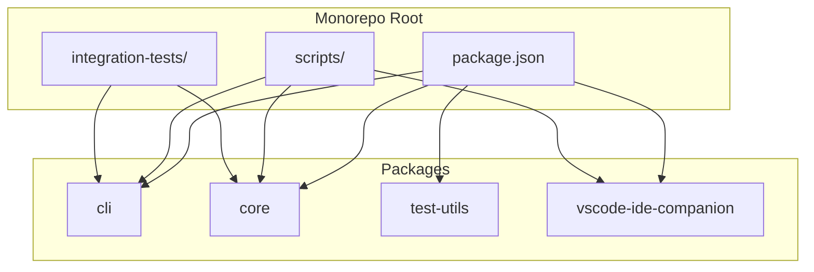

# 架构概览

<cite>
**本文档中引用的文件**
- [CommandService.ts](file://packages/cli/src/services/CommandService.ts)
- [coreToolScheduler.ts](file://packages/core/src/core/coreToolScheduler.ts)
- [tool-registry.ts](file://packages/core/src/tools/tool-registry.ts)
- [extension.ts](file://packages/vscode-ide-companion/src/extension.ts)
- [index.ts](file://packages/core/src/index.ts)
- [gemini.tsx](file://packages/cli/src/gemini.tsx)
- [file-system-test-helpers.ts](file://packages/test-utils/src/file-system-test-helpers.ts)
</cite>

## 目录
1. [项目结构](#项目结构)
2. [核心包职责划分](#核心包职责划分)
3. [系统上下文与交互模式](#系统上下文与交互模式)
4. [依赖关系与通信机制](#依赖关系与通信机制)
5. [可扩展性、可维护性与多环境部署](#可扩展性可维护性与多环境部署)

## 项目结构

qwen-code 项目采用模块化单体仓库（monorepo）架构，通过 `packages` 目录组织四个核心功能包。这种结构将 CLI 交互、核心 AI 引擎、测试工具和 IDE 集成等关注点分离，同时保持在单一代码库中进行统一管理。`integration-tests` 目录包含端到端测试，`scripts` 目录包含构建和发布脚本，确保了开发和部署流程的自动化。



**Diagram sources**
- [package.json](file://package.json)

## 核心包职责划分

qwen-code 的架构设计遵循单一职责原则，将系统划分为四个明确的包，每个包负责特定的功能领域。

### cli 包：用户交互入口
`cli` 包是用户与系统交互的主要入口点。它负责解析命令行参数、管理用户配置、渲染基于 Ink 的交互式 UI 界面，并处理所有用户输入。其核心服务 `CommandService` 负责发现和加载所有可用的斜杠命令（如 `/help`, `/settings`），并根据用户输入调度相应的命令处理器。该包通过依赖 `core` 包来执行实际的 AI 工作流，自身不包含核心业务逻辑。

**Section sources**
- [gemini.tsx](file://packages/cli/src/gemini.tsx)
- [CommandService.ts](file://packages/cli/src/services/CommandService.ts)

### core 包：核心 AI 工作流引擎
`core` 包是整个系统的“大脑”，实现了核心的 AI 工作流引擎和工具执行逻辑。它包含以下关键组件：
- **内容生成器 (ContentGenerator)**：与 Gemini 等 LLM 服务通信，生成 AI 响应。
- **工具注册表 (ToolRegistry)**：一个中心化的注册表，用于管理和发现所有可用的工具（如 `read-file`, `shell`, `web-search`）。
- **核心工具调度器 (CoreToolScheduler)**：负责调度、执行和管理工具调用的生命周期，包括处理确认、错误和取消。
- **各种服务 (Services)**：提供文件系统、Git、Shell 执行等底层服务。

该包的设计是无头的（headless），不包含任何 UI 代码，使其可以被 `cli` 或其他前端（如 VS Code 扩展）复用。

**Section sources**
- [index.ts](file://packages/core/src/index.ts)
- [coreToolScheduler.ts](file://packages/core/src/core/coreToolScheduler.ts)
- [tool-registry.ts](file://packages/core/src/tools/tool-registry.ts)

### test-utils 包：跨包测试支持
`test-utils` 包为整个 monorepo 提供共享的测试工具和辅助函数。它包含 `createTmpDir` 和 `cleanupTmpDir` 等函数，用于在测试中创建和清理临时文件系统结构。这种设计避免了在 `cli` 和 `core` 等包中重复编写文件系统测试代码，提高了测试代码的可维护性和一致性。

**Section sources**
- [file-system-test-helpers.ts](file://packages/test-utils/src/file-system-test-helpers.ts)

### vscode-ide-companion 包：VSCode IDE 深度集成
`vscode-ide-companion` 包是一个独立的 VS Code 扩展，实现了与 qwen-code 的深度集成。它通过一个本地 HTTP 服务器 (`IDEServer`) 与运行在终端中的 qwen-code CLI 进行通信。该扩展提供了在 VS Code 内部查看和接受 AI 生成的代码差异（diff）的功能，并通过 `qwen-code.runQwenCode` 命令从 VS Code 内部启动 CLI。

**Section sources**
- [extension.ts](file://packages/vscode-ide-companion/src/extension.ts)

## 系统上下文与交互模式

```mermaid
graph LR
User[用户] --> CLI[CLI 包]
CLI --> |调度命令| CommandService[CommandService]
CommandService --> |调用| Core[Core 包]
Core --> |执行| ToolRegistry[工具注册表]
ToolRegistry --> |加载| Tool[具体工具<br>如: read-file, shell]
Tool --> |使用| Services[服务<br>如: 文件系统, Shell]
VSCode[VS Code IDE] --> |通信| IDECompanion[VSCode IDE Companion]
IDECompanion < --> |HTTP API| Core
```

**Diagram sources**
- [CommandService.ts](file://packages/cli/src/services/CommandService.ts)
- [coreToolScheduler.ts](file://packages/core/src/core/coreToolScheduler.ts)
- [extension.ts](file://packages/vscode-ide-companion/src/extension.ts)

## 依赖关系与通信机制

### CLI 与 Core 的通信：CommandService 调度
`cli` 包通过 `CommandService` 与 `core` 包进行交互。当用户输入一个斜杠命令时，`CommandService` 会查找并执行相应的命令处理器。这些处理器最终会调用 `core` 包暴露的 API 来启动 AI 工作流。例如，`/chat` 命令会触发 `core` 包中的 `client` 来与 LLM 交互。

### Core 内部的通信：工具注册表与调度器
`core` 包内部的核心交互模式是基于工具注册表的。系统启动时，所有工具（如 `read-file.ts`, `shell.ts`）都会向 `ToolRegistry` 注册自己。当 AI 模型决定需要执行一个工具时，`CoreToolScheduler` 会从 `ToolRegistry` 中查找对应的工具实例，创建一个 `ToolInvocation` 对象，并执行它。这种动态加载和执行的模式使得系统可以轻松地添加新工具而无需修改调度器代码。

**Section sources**
- [CommandService.ts](file://packages/cli/src/services/CommandService.ts)
- [coreToolScheduler.ts](file://packages/core/src/core/coreToolScheduler.ts)
- [tools/](file://packages/core/src/tools/)

## 可扩展性、可维护性与多环境部署

这种模块化单体仓库架构为 qwen-code 提供了卓越的可扩展性、可维护性和多环境部署能力。

### 可扩展性
通过 `ToolRegistry`，开发者可以轻松地创建新的 `DeclarativeTool` 并将其注册到系统中。只要遵循工具接口，新工具就能被 `CoreToolScheduler` 自动发现和执行。同样，VS Code 扩展的独立性也允许为其他 IDE（如 JetBrains）创建类似的集成包。

### 可维护性
关注点的分离是可维护性的关键。`cli` 包专注于 UI 和用户交互，`core` 包专注于业务逻辑，`test-utils` 包专注于测试，`vscode-ide-companion` 包专注于 IDE 集成。这种清晰的边界使得团队可以并行开发不同模块，降低了代码耦合度，简化了代码审查和调试。

### 多环境部署
`core` 包的无头设计是实现多环境部署的基础。同一个 `core` 包可以被不同的前端使用：
- **终端环境**：由 `cli` 包作为前端，提供基于文本的交互。
- **IDE 环境**：由 `vscode-ide-companion` 作为前端，提供图形化的集成体验。
- **未来可能的环境**：如 Web UI 或移动应用，都可以复用相同的 `core` 包来保证功能一致性。