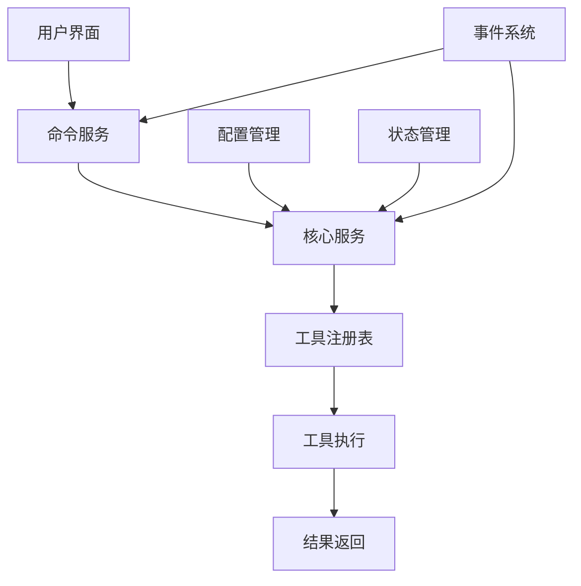
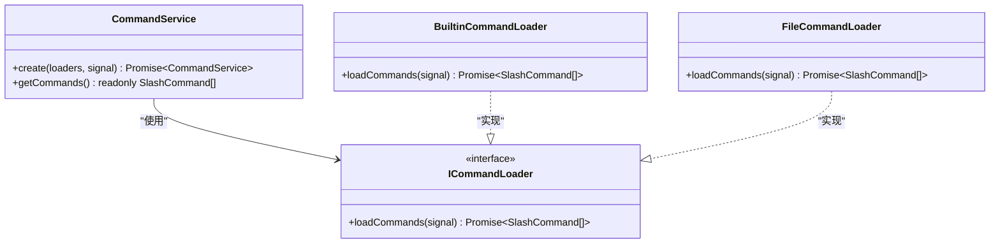
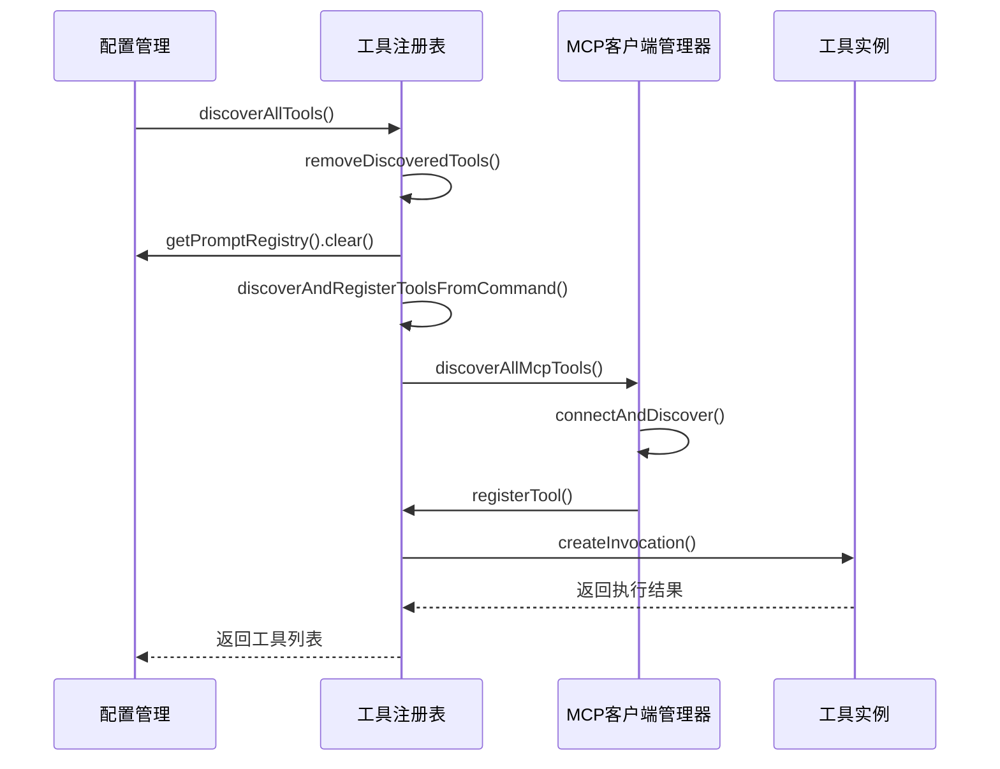
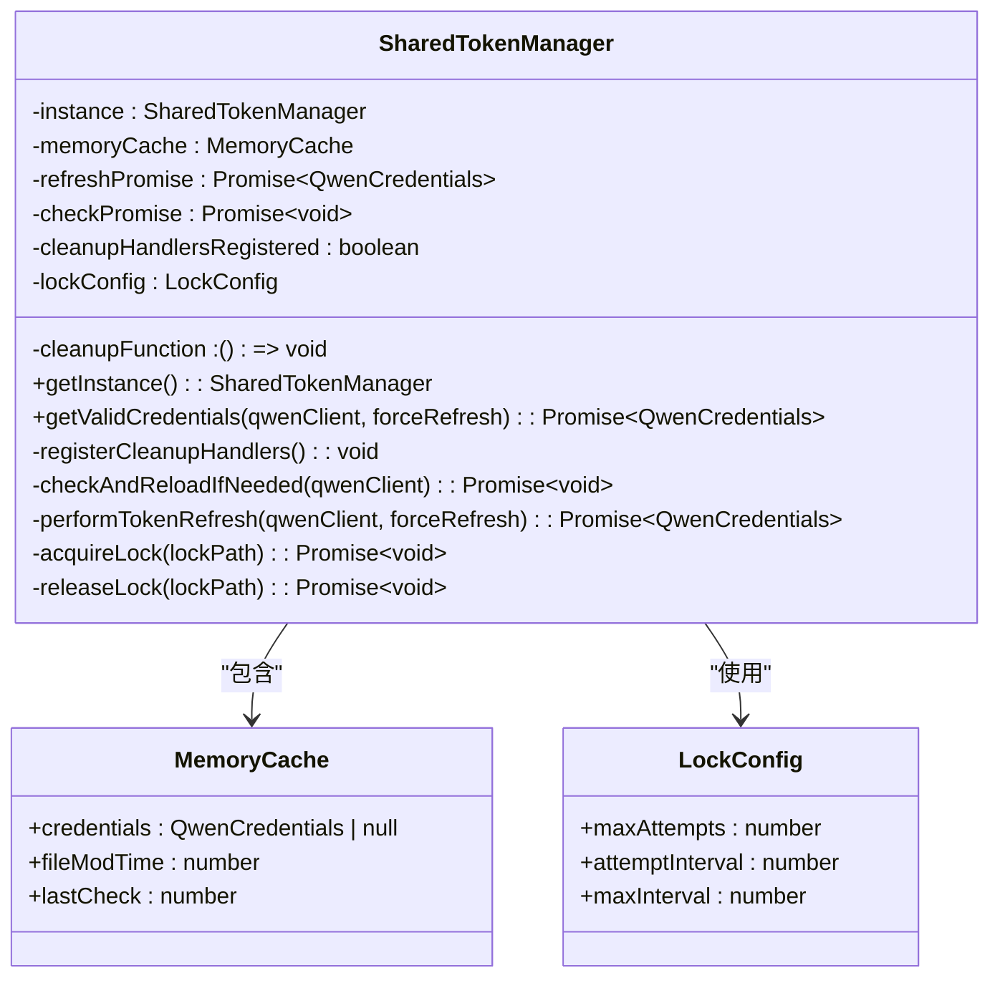
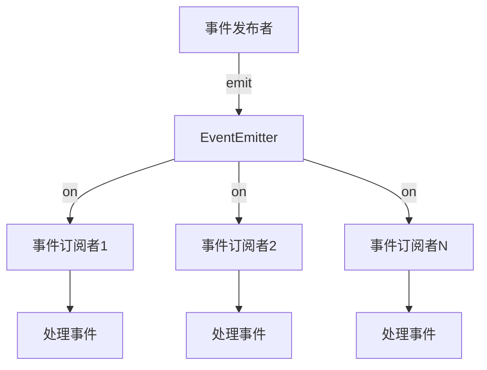

# 架构设计

<cite>
**本文档中引用的文件**  
- [sharedTokenManager.ts](file://packages/core/src/qwen/sharedTokenManager.ts)
- [tool-registry.ts](file://packages/core/src/tools/tool-registry.ts)
- [CommandService.ts](file://packages/cli/src/services/CommandService.ts)
- [events.ts](file://packages/cli/src/utils/events.ts)
- [builtin-agents.ts](file://packages/core/src/subagents/builtin-agents.ts)
- [index.ts](file://packages/core/src/index.ts)
- [gemini.tsx](file://packages/cli/src/gemini.tsx)
- [index.ts](file://packages/cli/index.ts)
</cite>

## 目录
1. [项目结构](#项目结构)
2. [核心组件](#核心组件)
3. [架构概述](#架构概述)
4. [详细组件分析](#详细组件分析)
5. [依赖分析](#依赖分析)
6. [性能考虑](#性能考虑)
7. [故障排除指南](#故障排除指南)
8. [结论](#结论)

## 项目结构

qwen-code项目采用多包（monorepo）架构，将不同功能模块组织在packages目录下。这种设计允许各包独立开发、测试和维护，同时共享公共配置和工具。主要包包括：
- **cli**: 命令行界面，负责用户交互和命令解析
- **core**: 核心功能模块，包含业务逻辑、工具管理和状态管理
- **test-utils**: 测试工具和辅助函数
- **vscode-ide-companion**: VS Code IDE集成插件

这种模块化设计提高了代码的可维护性和可扩展性，同时通过workspace配置实现了包间的依赖管理。

**Section sources**
- [package.json](file://package.json#L1-L111)
- [packages/cli/package.json](file://packages/cli/package.json#L1-L88)
- [packages/core/package.json](file://packages/core/package.json#L1-L89)

## 核心组件

qwen-code的核心组件包括命令服务、工具注册表、全局状态管理器和事件系统。这些组件共同构成了系统的骨架，支持从用户输入到结果输出的完整处理流程。命令服务负责解析和调度用户命令，工具注册表管理所有可用工具的生命周期，单例模式的全局状态管理器确保跨组件的状态一致性，而观察者模式的事件系统则实现了组件间的松耦合通信。

**Section sources**
- [CommandService.ts](file://packages/cli/src/services/CommandService.ts#L1-L103)
- [tool-registry.ts](file://packages/core/src/tools/tool-registry.ts#L1-L476)
- [sharedTokenManager.ts](file://packages/core/src/qwen/sharedTokenManager.ts#L1-L881)
- [events.ts](file://packages/cli/src/utils/events.ts#L1-L14)

## 架构概述

qwen-code采用分层架构设计，从上到下分为用户界面层、命令处理层、核心服务层和工具执行层。用户通过CLI输入命令，经过prompt处理器处理后，由CommandService进行调度，最终在core模块中执行并返回结果。系统通过工具注册表实现动态工具加载和管理，支持运行时发现和注册新工具。



**Diagram sources**
- [index.ts](file://packages/core/src/index.ts#L1-L118)
- [gemini.tsx](file://packages/cli/src/gemini.tsx#L1-L30)

## 详细组件分析

### 命令处理流程分析

qwen-code的请求处理管道从CLI接收用户输入开始，经过多个处理阶段。首先，输入被传递给prompt处理器进行预处理，然后由CommandService根据命令类型进行调度。CommandService采用工厂模式创建相应的命令处理器，最后在core模块中执行具体操作并返回结果。

#### 命令服务类图


**Diagram sources**
- [CommandService.ts](file://packages/cli/src/services/CommandService.ts#L1-L103)
- [types.ts](file://packages/cli/src/services/types.ts#L1-L10)

**Section sources**
- [CommandService.ts](file://packages/cli/src/services/CommandService.ts#L1-L103)

### 工具注册表分析

工具注册表（tool-registry）是qwen-code的核心组件之一，负责管理所有工具的生命周期。它支持动态工具加载，可以从外部命令或MCP服务器发现新工具，并将其注册到系统中。注册表采用观察者模式，在工具发生变化时通知相关组件。

#### 工具注册表序列图


**Diagram sources**
- [tool-registry.ts](file://packages/core/src/tools/tool-registry.ts#L1-L476)
- [mcp-client-manager.ts](file://packages/core/src/tools/mcp-client-manager.ts#L1-L50)

**Section sources**
- [tool-registry.ts](file://packages/core/src/tools/tool-registry.ts#L1-L476)

### 全局状态管理分析

qwen-code使用单例模式实现全局状态管理，确保跨组件的状态一致性。SharedTokenManager类是典型的单例实现，通过私有构造函数和静态getInstance方法确保系统中只有一个实例存在。该管理器负责OAuth令牌的获取、刷新和缓存，使用文件锁机制防止多进程竞争。

#### 单例模式实现


**Diagram sources**
- [sharedTokenManager.ts](file://packages/core/src/qwen/sharedTokenManager.ts#L1-L881)

**Section sources**
- [sharedTokenManager.ts](file://packages/core/src/qwen/sharedTokenManager.ts#L1-L881)

### 事件系统分析

qwen-code采用观察者模式实现事件系统，通过EventEmitter实现组件间的松耦合通信。appEvents实例作为全局事件中心，允许不同组件订阅和发布事件，如打开调试控制台或记录错误信息。

#### 事件系统流程图


**Diagram sources**
- [events.ts](file://packages/cli/src/utils/events.ts#L1-L14)

**Section sources**
- [events.ts](file://packages/cli/src/utils/events.ts#L1-L14)

## 依赖分析

qwen-code的依赖关系清晰地反映了其模块化设计。cli包依赖于core包提供的核心服务，而core包又依赖于外部库如@google/genai和@modelcontextprotocol/sdk。test-utils包被其他包作为开发依赖引用，提供测试辅助功能。vscode-ide-companion包独立存在，通过标准接口与核心系统通信。

```mermaid
graph TD
A[cli] --> B[core]
B --> C[test-utils]
A --> C
D[vscode-ide-companion] --> B
B --> E[@google/genai]
B --> F[@modelcontextprotocol/sdk]
A --> G[@google/genai]
A --> H[ink]
A --> I[react]
```

**Diagram sources**
- [packages/cli/package.json](file://packages/cli/package.json#L1-L88)
- [packages/core/package.json](file://packages/core/package.json#L1-L89)

**Section sources**
- [packages/cli/package.json](file://packages/cli/package.json#L1-L88)
- [packages/core/package.json](file://packages/core/package.json#L1-L89)

## 性能考虑

qwen-code在设计时考虑了多个性能因素。工具注册表实现了缓存机制，避免重复的文件系统操作。SharedTokenManager使用内存缓存和时间戳检查，减少不必要的磁盘I/O。事件系统采用异步发布-订阅模式，确保UI响应性。此外，系统通过限制工具发现命令的输出大小（10MB）来防止内存溢出。

## 故障排除指南

当遇到认证问题时，检查~/.qwen/oauth_creds.json文件的权限和内容。对于工具发现失败，验证toolDiscoveryCommand配置是否正确。如果遇到锁文件问题，可以手动删除~/.qwen/oauth_creds.lock文件。在调试模式下，启用DEBUG环境变量可以获得更详细的日志输出。

**Section sources**
- [sharedTokenManager.ts](file://packages/core/src/qwen/sharedTokenManager.ts#L1-L881)
- [tool-registry.ts](file://packages/core/src/tools/tool-registry.ts#L1-L476)

## 结论

qwen-code通过精心设计的模块化架构，实现了功能的高内聚和低耦合。单例模式确保了全局状态的一致性，工厂模式支持灵活的组件创建，观察者模式实现了松耦合的事件通信。请求处理管道清晰地分离了关注点，从用户输入到结果输出的每个阶段都有明确的职责。工具注册表的设计支持动态扩展，使系统能够适应不断变化的需求。整体架构既满足了当前的功能需求，又为未来的扩展留下了充足的空间。