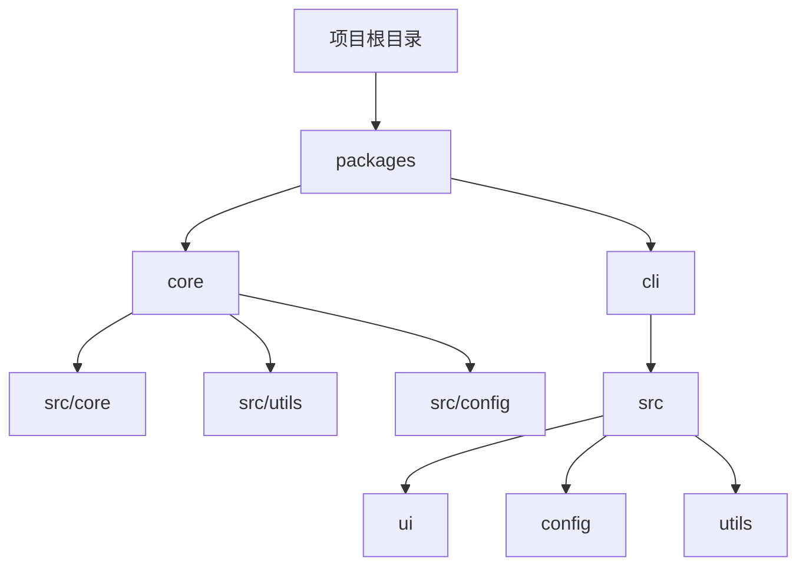
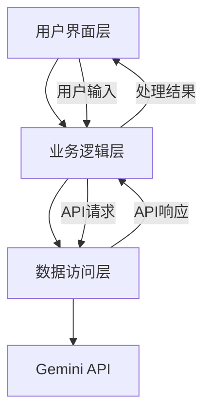
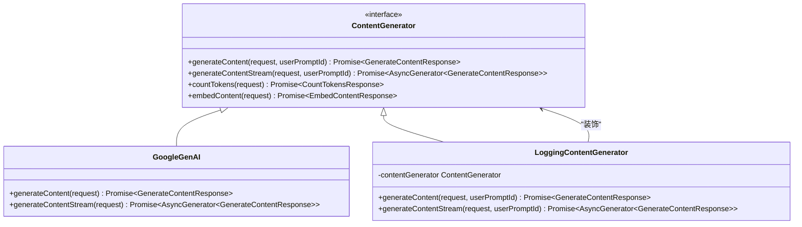
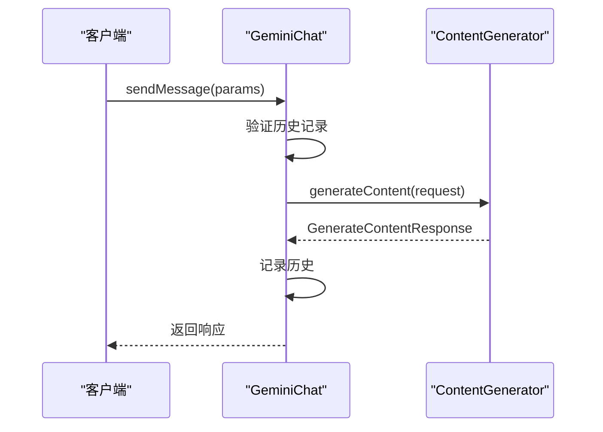
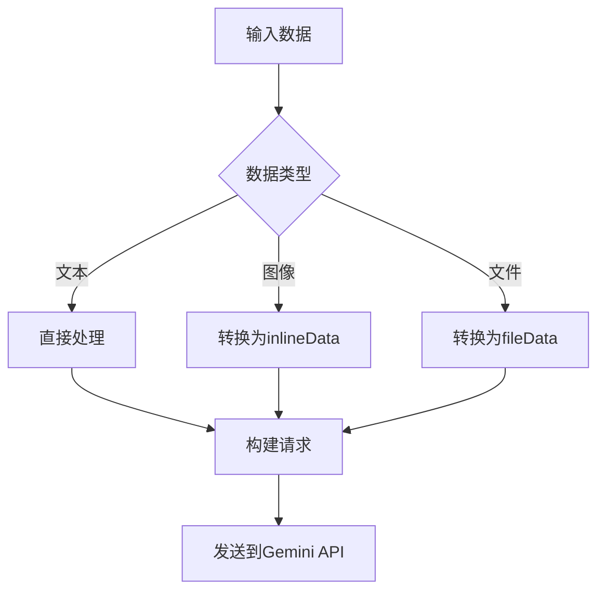
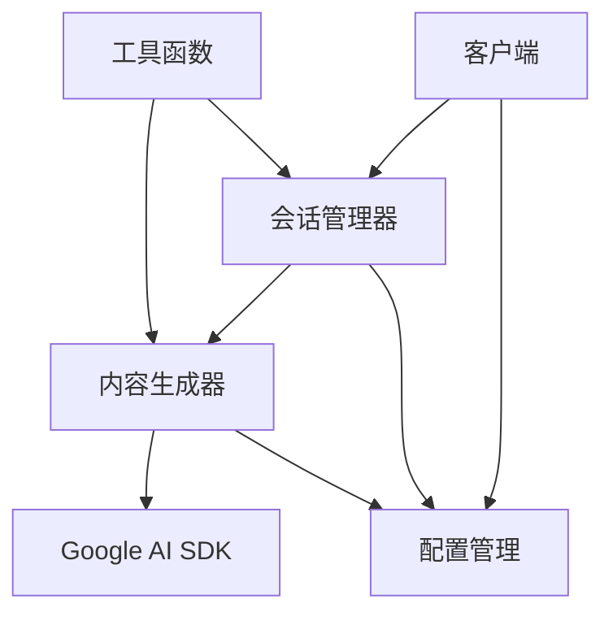

# Gemini内容生成器

<cite>
**本文档引用的文件**  
- [geminiRequest.ts](file://packages/core/src/core/geminiRequest.ts)
- [geminiChat.ts](file://packages/core/src/core/geminiChat.ts)
- [contentGenerator.ts](file://packages/core/src/core/contentGenerator.ts)
- [client.ts](file://packages/core/src/core/client.ts)
- [partUtils.ts](file://packages/core/src/utils/partUtils.ts)
- [retry.ts](file://packages/core/src/utils/retry.ts)
- [quotaErrorDetection.ts](file://packages/core/src/utils/quotaErrorDetection.ts)
- [models.ts](file://packages/core/src/config/models.ts)
</cite>

## 目录
1. [介绍](#介绍)
2. [项目结构](#项目结构)
3. [核心组件](#核心组件)
4. [架构概述](#架构概述)
5. [详细组件分析](#详细组件分析)
6. [依赖分析](#依赖分析)
7. [性能考虑](#性能考虑)
8. [故障排除指南](#故障排除指南)
9. [结论](#结论)

## 介绍
本文档全面解析Gemini内容生成器的实现细节，重点说明如何利用Google AI SDK与Gemini模型进行交互。文档涵盖了会话管理、多轮对话状态维护、流式响应处理等核心功能，并深入探讨了Gemini特有的多模态输入处理、安全设置和生成配置参数。同时，文档分析了geminiRequest模块如何封装底层HTTP请求，处理认证令牌刷新和错误重试机制。通过代码示例展示了如何构建包含文本和图像的多模态请求，以及如何解析包含工具调用的复杂响应。最后，文档讨论了与Gemini API配额限制和速率控制的应对策略。

## 项目结构
Gemini内容生成器的项目结构遵循模块化设计原则，主要分为核心功能模块和CLI界面模块。核心功能位于`packages/core/src/core`目录下，包含内容生成、会话管理、工具调用等核心逻辑。CLI界面模块位于`packages/cli/src`目录下，负责用户交互和命令行参数处理。配置管理、工具函数和实用程序分布在各自的子目录中，确保代码的可维护性和可扩展性。

**图示来源**  
- [geminiChat.ts](file://packages/core/src/core/geminiChat.ts#L1-L20)
- [client.ts](file://packages/core/src/core/client.ts#L1-L20)

**本节来源**  
- [geminiChat.ts](file://packages/core/src/core/geminiChat.ts#L1-L50)
- [client.ts](file://packages/core/src/core/client.ts#L1-L50)

## 核心组件
Gemini内容生成器的核心组件包括内容生成器（ContentGenerator）、会话管理器（GeminiChat）和客户端（GeminiClient）。内容生成器负责与Gemini API进行底层通信，会话管理器维护多轮对话状态，客户端则协调整个交互流程。这些组件通过清晰的接口定义和依赖注入机制协同工作，确保系统的稳定性和可扩展性。

**本节来源**  
- [contentGenerator.ts](file://packages/core/src/core/contentGenerator.ts#L1-L100)
- [geminiChat.ts](file://packages/core/src/core/geminiChat.ts#L1-L100)
- [client.ts](file://packages/core/src/core/client.ts#L1-L100)

## 架构概述
Gemini内容生成器采用分层架构设计，从上到下分为用户界面层、业务逻辑层和数据访问层。用户界面层负责接收用户输入和展示输出结果；业务逻辑层包含会话管理、工具调用和流式处理等核心功能；数据访问层则封装了与Gemini API的通信细节。这种分层设计使得各组件职责分明，便于维护和扩展。

**图示来源**  
- [client.ts](file://packages/core/src/core/client.ts#L1-L20)
- [contentGenerator.ts](file://packages/core/src/core/contentGenerator.ts#L1-L20)

## 详细组件分析

### 内容生成器分析
内容生成器是Gemini内容生成器的核心组件，负责与Gemini API进行通信。它支持多种认证方式，包括Google OAuth、API密钥和Vertex AI。内容生成器通过`createContentGenerator`函数创建，该函数根据配置参数选择合适的实现。

**图示来源**  
- [contentGenerator.ts](file://packages/core/src/core/contentGenerator.ts#L15-L80)
- [geminiRequest.ts](file://packages/core/src/core/geminiRequest.ts#L1-L20)

### 会话管理器分析
会话管理器（GeminiChat）负责维护多轮对话状态，确保上下文的连贯性。它通过`sendMessage`和`sendMessageStream`方法支持同步和流式响应处理。会话管理器还实现了智能重试机制，当遇到无效内容时会自动重试。

**图示来源**  
- [geminiChat.ts](file://packages/core/src/core/geminiChat.ts#L150-L200)
- [client.ts](file://packages/core/src/core/client.ts#L150-L200)

### 多模态请求处理
Gemini内容生成器支持多模态输入处理，可以同时处理文本、图像和文件数据。`partUtils`模块提供了`partToString`函数，用于将不同类型的输入部分转换为字符串表示。

**图示来源**  
- [partUtils.ts](file://packages/core/src/utils/partUtils.ts#L1-L50)
- [geminiRequest.ts](file://packages/core/src/core/geminiRequest.ts#L1-L20)

**本节来源**  
- [geminiChat.ts](file://packages/core/src/core/geminiChat.ts#L1-L100)
- [contentGenerator.ts](file://packages/core/src/core/contentGenerator.ts#L1-L100)
- [partUtils.ts](file://packages/core/src/utils/partUtils.ts#L1-L100)

## 依赖分析
Gemini内容生成器的依赖关系清晰，核心组件之间通过接口进行通信，降低了耦合度。内容生成器依赖于Google AI SDK进行API调用，会话管理器依赖于内容生成器进行实际的模型交互，客户端则协调所有组件的工作。

**图示来源**  
- [client.ts](file://packages/core/src/core/client.ts#L1-L20)
- [geminiChat.ts](file://packages/core/src/core/geminiChat.ts#L1-L20)
- [contentGenerator.ts](file://packages/core/src/core/contentGenerator.ts#L1-L20)

**本节来源**  
- [client.ts](file://packages/core/src/core/client.ts#L1-L50)
- [geminiChat.ts](file://packages/core/src/core/geminiChat.ts#L1-L50)
- [contentGenerator.ts](file://packages/core/src/core/contentGenerator.ts#L1-L50)

## 性能考虑
Gemini内容生成器在性能方面进行了多项优化。首先，通过流式响应处理减少用户等待时间；其次，实现智能重试机制避免因临时错误导致的失败；最后，通过会话压缩减少上下文长度，提高处理效率。此外，系统还支持内存自动配置，根据系统资源动态调整内存使用。

## 故障排除指南
当遇到问题时，可以参考以下常见问题的解决方案：

1. **认证失败**：检查API密钥或OAuth配置是否正确。
2. **配额超限**：系统会自动尝试切换到Gemini Flash模型，如果仍然失败，需要等待配额重置。
3. **网络超时**：检查代理设置和网络连接。
4. **无效响应**：系统会自动重试最多3次，如果仍然失败，可能是模型生成内容存在问题。

**本节来源**  
- [retry.ts](file://packages/core/src/utils/retry.ts#L1-L50)
- [quotaErrorDetection.ts](file://packages/core/src/utils/quotaErrorDetection.ts#L1-L50)
- [client.ts](file://packages/core/src/core/client.ts#L1-L50)

## 结论
Gemini内容生成器通过精心设计的架构和丰富的功能，为开发者提供了强大的内容生成能力。其模块化设计使得系统易于维护和扩展，而丰富的错误处理和性能优化机制则确保了系统的稳定性和高效性。通过深入理解其内部实现，开发者可以更好地利用这一工具，构建出更加智能和高效的应用。