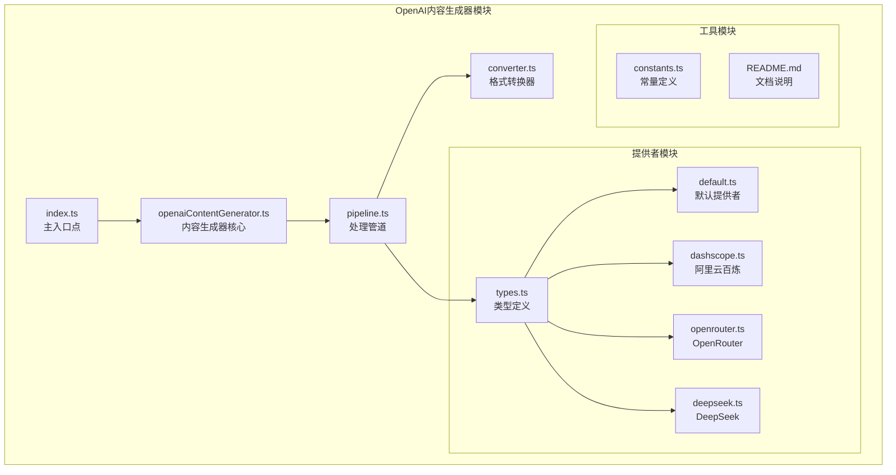
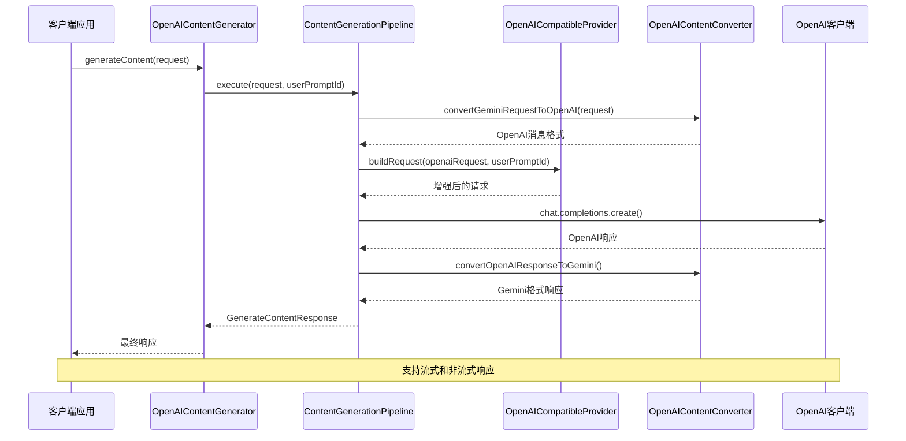
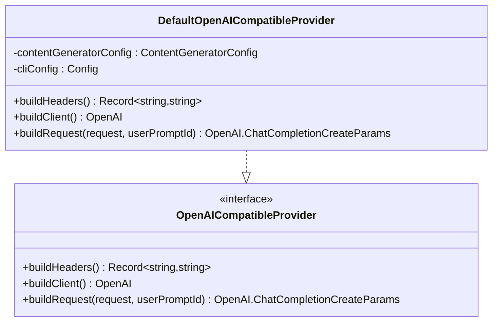
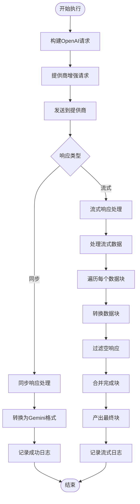
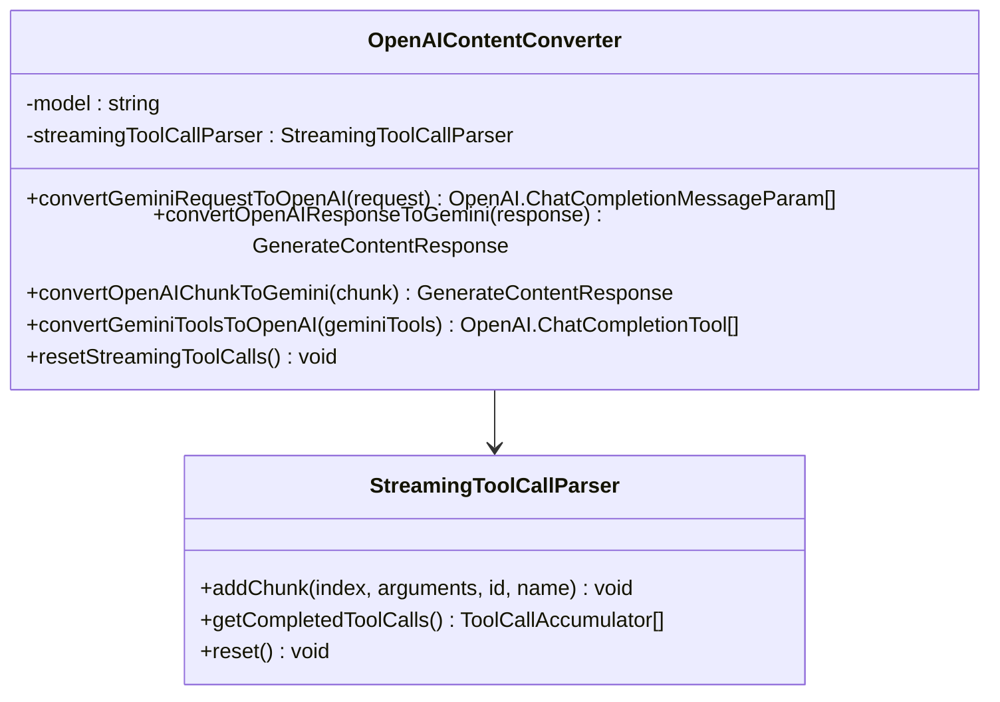

# OpenAI兼容内容生成器

<cite>
**本文档中引用的文件**
- [index.ts](file://packages/core/src/core/openaiContentGenerator/index.ts)
- [openaiContentGenerator.ts](file://packages/core/src/core/openaiContentGenerator/openaiContentGenerator.ts)
- [pipeline.ts](file://packages/core/src/core/openaiContentGenerator/pipeline.ts)
- [converter.ts](file://packages/core/src/core/openaiContentGenerator/converter.ts)
- [types.ts](file://packages/core/src/core/openaiContentGenerator/provider/types.ts)
- [default.ts](file://packages/core/src/core/openaiContentGenerator/provider/default.ts)
- [dashscope.ts](file://packages/core/src/core/openaiContentGenerator/provider/dashscope.ts)
- [openrouter.ts](file://packages/core/src/core/openaiContentGenerator/provider/openrouter.ts)
- [deepseek.ts](file://packages/core/src/core/openaiContentGenerator/provider/deepseek.ts)
- [constants.ts](file://packages/core/src/core/openaiContentGenerator/constants.ts)
- [README.md](file://packages/core/src/core/openaiContentGenerator/provider/README.md)
</cite>

## 目录
1. [简介](#简介)
2. [项目结构](#项目结构)
3. [核心组件](#核心组件)
4. [架构概览](#架构概览)
5. [详细组件分析](#详细组件分析)
6. [依赖关系分析](#依赖关系分析)
7. [性能考虑](#性能考虑)
8. [故障排除指南](#故障排除指南)
9. [结论](#结论)

## 简介

OpenAI兼容内容生成器是一个高度模块化的系统，专门设计用于支持多种OpenAI兼容API提供商。该系统采用适配器模式，能够无缝集成原生OpenAI、OpenRouter、阿里云百炼/DashScope、DeepSeek等不同提供商的服务。

该系统的核心优势在于其统一的接口设计，使得开发者可以轻松切换不同的AI服务提供商，而无需修改业务逻辑代码。通过精心设计的适配层，系统能够处理不同提供商之间的API差异、认证方式、请求格式和响应格式的转换。

## 项目结构



**图表来源**
- [index.ts](file://packages/core/src/core/openaiContentGenerator/index.ts#L1-L91)
- [openaiContentGenerator.ts](file://packages/core/src/core/openaiContentGenerator/openaiContentGenerator.ts#L1-L157)
- [pipeline.ts](file://packages/core/src/core/openaiContentGenerator/pipeline.ts#L1-L418)

**章节来源**
- [index.ts](file://packages/core/src/core/openaiContentGenerator/index.ts#L1-L91)
- [README.md](file://packages/core/src/core/openaiContentGenerator/provider/README.md#L1-L61)

## 核心组件

### 内容生成器适配器

OpenAI内容生成器是整个系统的核心，它实现了统一的内容生成接口，隐藏了底层提供商的具体实现细节。

```typescript
export class OpenAIContentGenerator implements ContentGenerator {
  protected pipeline: ContentGenerationPipeline;

  constructor(
    contentGeneratorConfig: ContentGeneratorConfig,
    cliConfig: Config,
    provider: OpenAICompatibleProvider,
  ) {
    // 创建管道配置
    const pipelineConfig: PipelineConfig = {
      cliConfig,
      provider,
      contentGeneratorConfig,
      telemetryService: new DefaultTelemetryService(
        cliConfig,
        contentGeneratorConfig.enableOpenAILogging,
      ),
      errorHandler: new EnhancedErrorHandler(
        (error: unknown, request: GenerateContentParameters) =>
          this.shouldSuppressErrorLogging(error, request),
      ),
    };

    this.pipeline = new ContentGenerationPipeline(pipelineConfig);
  }
}
```

### 提供者识别与选择

系统通过智能识别机制自动选择合适的提供商：

```typescript
export function determineProvider(
  contentGeneratorConfig: ContentGeneratorConfig,
  cliConfig: Config,
): OpenAICompatibleProvider {
  const config = contentGeneratorConfig || cliConfig.getContentGeneratorConfig();

  // 检查DashScope提供商
  if (DashScopeOpenAICompatibleProvider.isDashScopeProvider(config)) {
    return new DashScopeOpenAICompatibleProvider(
      contentGeneratorConfig,
      cliConfig,
    );
  }

  if (DeepSeekOpenAICompatibleProvider.isDeepSeekProvider(config)) {
    return new DeepSeekOpenAICompatibleProvider(
      contentGeneratorConfig,
      cliConfig,
    );
  }

  // 检查OpenRouter提供商
  if (OpenRouterOpenAICompatibleProvider.isOpenRouterProvider(config)) {
    return new OpenRouterOpenAICompatibleProvider(
      contentGeneratorConfig,
      cliConfig,
    );
  }

  // 默认提供商用于标准OpenAI兼容API
  return new DefaultOpenAICompatibleProvider(contentGeneratorConfig, cliConfig);
}
```

**章节来源**
- [openaiContentGenerator.ts](file://packages/core/src/core/openaiContentGenerator/openaiContentGenerator.ts#L17-L45)
- [index.ts](file://packages/core/src/core/openaiContentGenerator/index.ts#L47-L91)

## 架构概览



**图表来源**
- [openaiContentGenerator.ts](file://packages/core/src/core/openaiContentGenerator/openaiContentGenerator.ts#L47-L60)
- [pipeline.ts](file://packages/core/src/core/openaiContentGenerator/pipeline.ts#L35-L55)

## 详细组件分析

### 提供者接口设计

所有OpenAI兼容提供商都必须实现以下核心接口：

```typescript
export interface OpenAICompatibleProvider {
  buildHeaders(): Record<string, string | undefined>;
  buildClient(): OpenAI;
  buildRequest(
    request: OpenAI.Chat.ChatCompletionCreateParams,
    userPromptId: string,
  ): OpenAI.Chat.ChatCompletionCreateParams;
}
```

这种设计确保了所有提供商都能提供一致的认证头、客户端配置和请求增强功能。

### 默认提供者实现

默认提供者为标准OpenAI兼容API提供了基础实现：



**图表来源**
- [default.ts](file://packages/core/src/core/openaiContentGenerator/provider/default.ts#L10-L58)
- [types.ts](file://packages/core/src/core/openaiContentGenerator/provider/types.ts#L18-L24)

### 阿里云百炼(DashScope)提供者

DashScope提供者针对阿里云的API进行了特殊优化，包括缓存控制、会话跟踪和视觉模型支持：

```typescript
export class DashScopeOpenAICompatibleProvider implements OpenAICompatibleProvider {
  buildHeaders(): Record<string, string | undefined> {
    const version = this.cliConfig.getCliVersion() || 'unknown';
    const userAgent = `QwenCode/${version} (${process.platform}; ${process.arch})`;
    const { authType } = this.contentGeneratorConfig;
    return {
      'User-Agent': userAgent,
      'X-DashScope-CacheControl': 'enable',
      'X-DashScope-UserAgent': userAgent,
      'X-DashScope-AuthType': authType,
    };
  }

  buildRequest(
    request: OpenAI.Chat.ChatCompletionCreateParams,
    userPromptId: string,
  ): OpenAI.Chat.ChatCompletionCreateParams {
    let messages = request.messages;
    let tools = request.tools;

    // 应用DashScope缓存控制
    if (!this.shouldDisableCacheControl()) {
      const { messages: updatedMessages, tools: updatedTools } =
        this.addDashScopeCacheControl(
          request,
          request.stream ? 'all' : 'system_only',
        );
      messages = updatedMessages;
      tools = updatedTools;
    }

    // 应用输出令牌限制
    const requestWithTokenLimits = this.applyOutputTokenLimit(
      request,
      request.model,
    );

    return {
      ...requestWithTokenLimits,
      messages,
      ...(tools ? { tools } : {}),
      ...(this.buildMetadata(userPromptId) || {}),
      /* @ts-expect-error dashscope exclusive */
      vl_high_resolution_images: true,
    } as OpenAI.Chat.ChatCompletionCreateParams;
  }
}
```

### OpenRouter提供者

OpenRouter提供者扩展了默认提供者，并添加了特定的HTTP头部信息：

```typescript
export class OpenRouterOpenAICompatibleProvider extends DefaultOpenAICompatibleProvider {
  override buildHeaders(): Record<string, string | undefined> {
    // 获取父类的基础头部
    const baseHeaders = super.buildHeaders();

    // 添加OpenRouter特定的头部
    return {
      ...baseHeaders,
      'HTTP-Referer': 'https://github.com/QwenLM/qwen-code.git',
      'X-Title': 'Qwen Code',
    };
  }
}
```

### DeepSeek提供者

DeepSeek提供者对消息内容进行特殊处理，确保只支持文本内容：

```typescript
export class DeepSeekOpenAICompatibleProvider extends DefaultOpenAICompatibleProvider {
  override buildRequest(
    request: OpenAI.Chat.ChatCompletionCreateParams,
    userPromptId: string,
  ): OpenAI.Chat.ChatCompletionCreateParams {
    const baseRequest = super.buildRequest(request, userPromptId);
    if (!baseRequest.messages?.length) {
      return baseRequest;
    }

    const messages = baseRequest.messages.map((message) => {
      if (!('content' in message)) {
        return message;
      }

      const { content } = message;

      if (
        typeof content === 'string' ||
        content === null ||
        content === undefined
      ) {
        return message;
      }

      if (!Array.isArray(content)) {
        return message;
      }

      // DeepSeek只支持文本内容，需要转换数组格式
      const text = content
        .map((part) => {
          if (part.type !== 'text') {
            throw new Error(
              `DeepSeek provider only supports text content. Found non-text part of type '${part.type}' in message with role '${message.role}'.`,
            );
          }

          return part.text ?? '';
        })
        .join('');

      return {
        ...message,
        content: text,
      } as OpenAI.Chat.ChatCompletionMessageParam;
    });

    return {
      ...baseRequest,
      messages,
    };
  }
}
```

**章节来源**
- [dashscope.ts](file://packages/core/src/core/openaiContentGenerator/provider/dashscope.ts#L15-L337)
- [openrouter.ts](file://packages/core/src/core/openaiContentGenerator/provider/openrouter.ts#L7-L31)
- [deepseek.ts](file://packages/core/src/core/openaiContentGenerator/provider/deepseek.ts#L13-L79)

### 处理管道设计

处理管道是系统的核心，负责协调整个请求-响应流程：



**图表来源**
- [pipeline.ts](file://packages/core/src/core/openaiContentGenerator/pipeline.ts#L35-L120)

### 流式响应处理机制

系统实现了复杂的流式响应处理机制，能够统一不同提供商的SSE格式：

```typescript
private async *processStreamWithLogging(
  stream: AsyncIterable<OpenAI.Chat.ChatCompletionChunk>,
  context: RequestContext,
  openaiRequest: OpenAI.Chat.ChatCompletionCreateParams,
  request: GenerateContentParameters,
): AsyncGenerator<GenerateContentResponse> {
  const collectedGeminiResponses: GenerateContentResponse[] = [];
  const collectedOpenAIChunks: OpenAI.Chat.ChatCompletionChunk[] = [];

  // 重置流式工具调用以防止数据污染
  this.converter.resetStreamingToolCalls();

  // 处理状态合并
  let pendingFinishResponse: GenerateContentResponse | null = null;

  try {
    // 转换并产出每个数据块
    for await (const chunk of stream) {
      // 始终收集OpenAI数据块用于日志记录
      collectedOpenAIChunks.push(chunk);

      const response = this.converter.convertOpenAIChunkToGemini(chunk);

      // 过滤空响应以避免下游问题
      if (
        response.candidates?.[0]?.content?.parts?.length === 0 &&
        !response.candidates?.[0]?.finishReason &&
        !response.usageMetadata
      ) {
        continue;
      }

      // 处理状态合并
      const shouldYield = this.handleChunkMerging(
        response,
        collectedGeminiResponses,
        (mergedResponse) => {
          pendingFinishResponse = mergedResponse;
        },
      );

      if (shouldYield) {
        if (pendingFinishResponse) {
          yield pendingFinishResponse;
          pendingFinishResponse = null;
        } else {
          yield response;
        }
      }
    }

    // 如果仍有待定的完成响应，产出它
    if (pendingFinishResponse) {
      yield pendingFinishResponse;
    }

    // 记录流式成功日志
    context.duration = Date.now() - context.startTime;
    await this.config.telemetryService.logStreamingSuccess(
      context,
      collectedGeminiResponses,
      openaiRequest,
      collectedOpenAIChunks,
    );
  } catch (error) {
    // 在错误时重置流式工具调用
    this.converter.resetStreamingToolCalls();
    await this.handleError(error, context, request);
  }
}
```

### 格式转换器

格式转换器负责在Gemini和OpenAI格式之间进行双向转换：



**图表来源**
- [converter.ts](file://packages/core/src/core/openaiContentGenerator/converter.ts#L40-L70)

**章节来源**
- [pipeline.ts](file://packages/core/src/core/openaiContentGenerator/pipeline.ts#L70-L150)
- [converter.ts](file://packages/core/src/core/openaiContentGenerator/converter.ts#L1-L100)

## 依赖关系分析

```mermaid
graph TB
subgraph "外部依赖"
OpenAI[openai包]
GenAI[@google/genai]
SafeJSON[safeJsonParse]
end
subgraph "内部模块"
ContentGenerator[contentGenerator.ts]
Config[config/config.ts]
Utils[utils/*]
end
subgraph "OpenAI内容生成器"
Index[index.ts]
Generator[openaiContentGenerator.ts]
Pipeline[pipeline.ts]
Converter[converter.ts]
subgraph "提供者"
Types[types.ts]
Default[default.ts]
DashScope[dashscope.ts]
OpenRouter[openrouter.ts]
DeepSeek[deepseek.ts]
end
end
Index --> Generator
Generator --> Pipeline
Pipeline --> Converter
Pipeline --> Types
Pipeline --> OpenAI
Pipeline --> GenAI
Converter --> SafeJSON
Generator --> ContentGenerator
Generator --> Config
Generator --> Utils
Types --> Default
Types --> DashScope
Types --> OpenRouter
Types --> DeepSeek
```

**图表来源**
- [index.ts](file://packages/core/src/core/openaiContentGenerator/index.ts#L1-L15)
- [pipeline.ts](file://packages/core/src/core/openaiContentGenerator/pipeline.ts#L1-L20)

**章节来源**
- [index.ts](file://packages/core/src/core/openaiContentGenerator/index.ts#L1-L15)
- [pipeline.ts](file://packages/core/src/core/openaiContentGenerator/pipeline.ts#L1-L20)

## 性能考虑

### 连接复用

系统通过OpenAI客户端的内置连接池机制实现连接复用，减少网络开销：

```typescript
buildClient(): OpenAI {
  const {
    apiKey,
    baseUrl,
    timeout = DEFAULT_TIMEOUT,
    maxRetries = DEFAULT_MAX_RETRIES,
  } = this.contentGeneratorConfig;
  const defaultHeaders = this.buildHeaders();
  return new OpenAI({
    apiKey,
    baseURL: baseUrl,
    timeout,
    maxRetries,
    defaultHeaders,
  });
}
```

### 响应缓冲

对于流式响应，系统实现了智能的缓冲机制：

1. **分块合并**：处理不同提供商可能分离发送的finishReason和usageMetadata
2. **空响应过滤**：避免无效数据块影响性能
3. **工具调用累积**：正确处理流式工具调用的分段数据

### 错误处理优化

系统实现了多层次的错误处理策略：

```typescript
private async handleError(
  error: unknown,
  context: RequestContext,
  request: GenerateContentParameters,
  userPromptId?: string,
  isStreaming?: boolean,
): Promise<never> {
  context.duration = Date.now() - context.startTime;

  // 尝试构建请求用于日志记录（即使失败也要记录错误）
  let openaiRequest: OpenAI.Chat.ChatCompletionCreateParams;
  try {
    if (userPromptId !== undefined && isStreaming !== undefined) {
      openaiRequest = await this.buildRequest(
        request,
        userPromptId,
        isStreaming,
      );
    } else {
      openaiRequest = {
        model: this.contentGeneratorConfig.model,
        messages: [],
      };
    }
  } catch (_buildError) {
    // 如果无法构建请求，创建最小请求用于日志记录
    openaiRequest = {
      model: this.contentGeneratorConfig.model,
      messages: [],
    };
  }

  await this.config.telemetryService.logError(context, error, openaiRequest);
  this.config.errorHandler.handle(error, context, request);
}
```

## 故障排除指南

### 常见配置问题

1. **API密钥验证失败**
   - 检查`apiKey`是否正确设置
   - 验证提供商URL是否匹配
   - 确认网络连接正常

2. **模型不支持错误**
   - 检查模型名称是否符合提供商要求
   - 验证模型是否在指定提供商上可用
   - 查看提供商文档确认支持的模型列表

3. **流式响应中断**
   - 检查网络稳定性
   - 验证超时设置是否合理
   - 确认提供商支持流式响应

### 调试技巧

1. **启用详细日志记录**：
```typescript
const config = {
  enableOpenAILogging: true,
  // 其他配置...
};
```

2. **检查请求转换**：
```typescript
// 在converter.ts中添加调试日志
console.log('Converted request:', JSON.stringify(openaiRequest, null, 2));
```

3. **监控响应格式**：
```typescript
// 在pipeline.ts中添加响应验证
console.log('Received response:', JSON.stringify(openaiResponse, null, 2));
```

**章节来源**
- [pipeline.ts](file://packages/core/src/core/openaiContentGenerator/pipeline.ts#L350-L400)
- [constants.ts](file://packages/core/src/core/openaiContentGenerator/constants.ts#L1-L3)

## 结论

OpenAI兼容内容生成器是一个设计精良的系统，通过适配器模式成功地抽象了不同AI提供商的差异。其主要优势包括：

1. **统一接口**：提供一致的API接口，简化了多提供商管理
2. **灵活扩展**：新的提供商可以通过实现OpenAICompatibleProvider接口轻松集成
3. **智能路由**：自动识别和选择最适合的提供商
4. **强大的流式处理**：统一处理不同提供商的SSE格式
5. **完善的错误处理**：多层次的错误恢复和日志记录机制

该系统为开发者提供了一个可靠、高性能的AI内容生成解决方案，特别适合需要在多个AI服务提供商之间切换的应用场景。通过合理的架构设计和充分的测试覆盖，系统展现了高质量的软件工程实践。