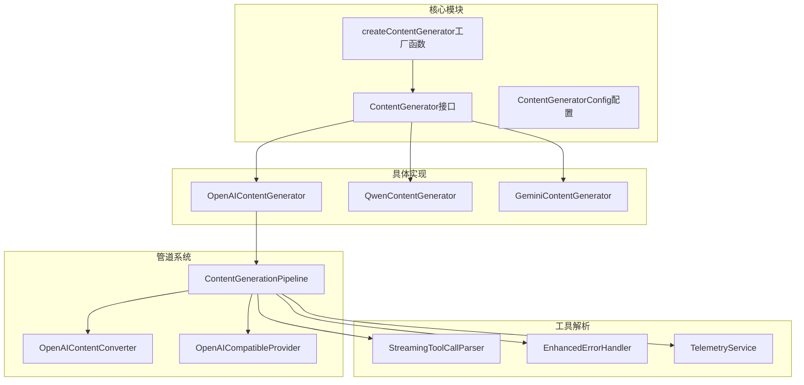
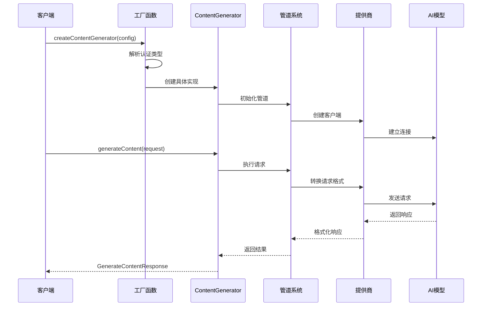
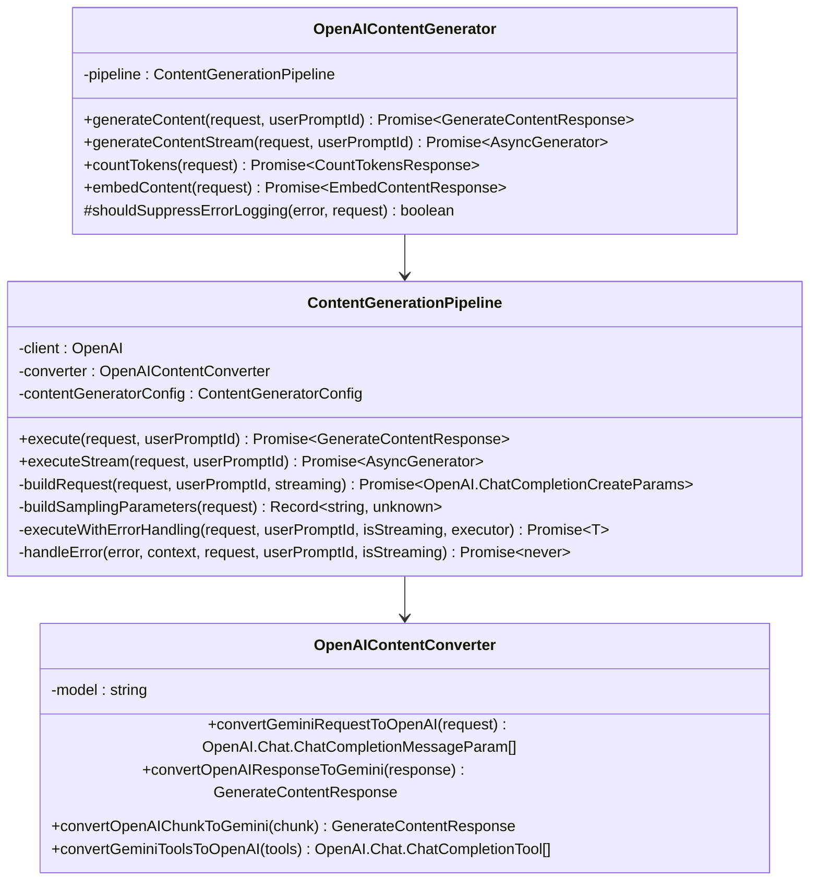
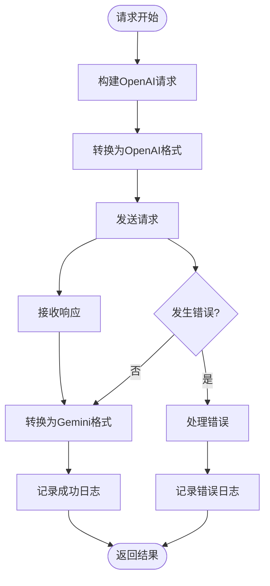
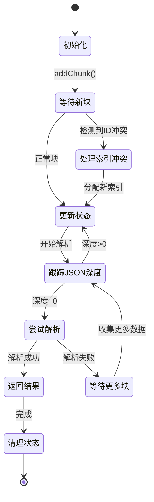
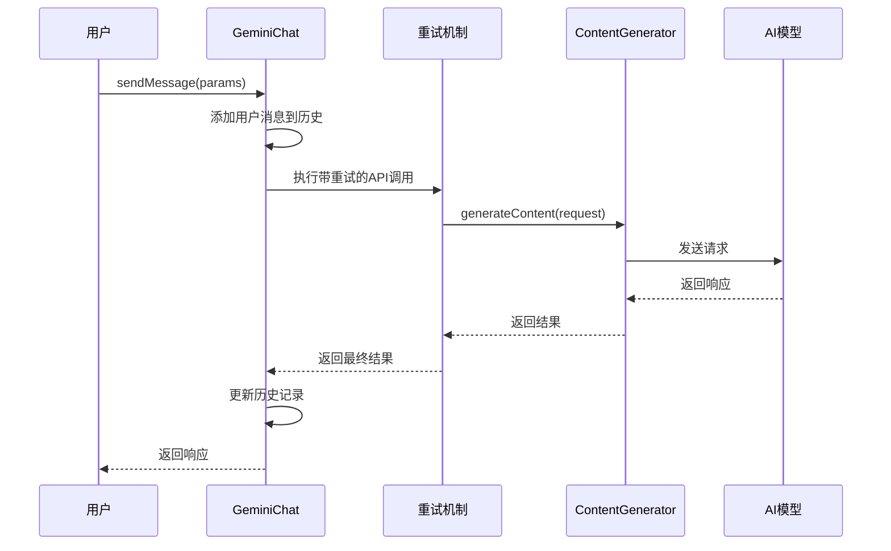
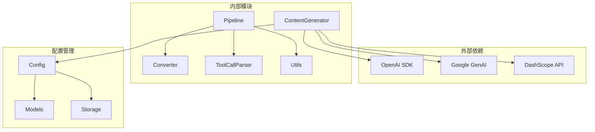

# 内容生成器

<cite>
**本文档中引用的文件**
- [contentGenerator.ts](file://packages/core/src/core/contentGenerator.ts)
- [openaiContentGenerator.ts](file://packages/core/src/core/openaiContentGenerator/openaiContentGenerator.ts)
- [pipeline.ts](file://packages/core/src/core/openaiContentGenerator/pipeline.ts)
- [streamingToolCallParser.ts](file://packages/core/src/core/openaiContentGenerator/streamingToolCallParser.ts)
- [qwenContentGenerator.ts](file://packages/core/src/qwen/qwenContentGenerator.ts)
- [geminiChat.ts](file://packages/core/src/core/geminiChat.ts)
- [dashscope.ts](file://packages/core/src/core/openaiContentGenerator/provider/dashscope.ts)
- [models.ts](file://packages/core/src/config/models.ts)
- [openaiContentGenerator.test.ts](file://packages/core/src/core/openaiContentGenerator/openaiContentGenerator.test.ts)
</cite>

## 目录
1. [简介](#简介)
2. [项目结构](#项目结构)
3. [核心组件](#核心组件)
4. [架构概览](#架构概览)
5. [详细组件分析](#详细组件分析)
6. [依赖关系分析](#依赖关系分析)
7. [性能考虑](#性能考虑)
8. [故障排除指南](#故障排除指南)
9. [结论](#结论)

## 简介

内容生成器（ContentGenerator）是Qwen代码助手的核心组件，负责统一管理多种AI模型提供商的内容生成服务。该系统采用工厂模式设计，支持OpenAI、Gemini、Qwen等多种AI模型提供商，并提供了完整的流式响应处理能力。

主要内容生成器功能包括：
- 统一的API接口抽象
- 多种AI模型提供商集成
- 流式响应处理
- 工具调用解析
- 错误处理和重试机制
- 性能优化和令牌计数

## 项目结构



**图表来源**
- [contentGenerator.ts](file://packages/core/src/core/contentGenerator.ts#L1-L246)
- [openaiContentGenerator.ts](file://packages/core/src/core/openaiContentGenerator/openaiContentGenerator.ts#L1-L157)

**章节来源**
- [contentGenerator.ts](file://packages/core/src/core/contentGenerator.ts#L1-L246)
- [openaiContentGenerator.ts](file://packages/core/src/core/openaiContentGenerator/openaiContentGenerator.ts#L1-L157)

## 核心组件

### ContentGenerator接口

ContentGenerator接口定义了所有内容生成器必须实现的核心功能：

```typescript
export interface ContentGenerator {
  generateContent(
    request: GenerateContentParameters,
    userPromptId: string,
  ): Promise<GenerateContentResponse>;

  generateContentStream(
    request: GenerateContentParameters,
    userPromptId: string,
  ): Promise<AsyncGenerator<GenerateContentResponse>>;

  countTokens(request: CountTokensParameters): Promise<CountTokensResponse>;

  embedContent(request: EmbedContentParameters): Promise<EmbedContentResponse>;

  userTier?: UserTierId;
}
```

该接口提供了四个核心方法：
- **generateContent**: 同步内容生成
- **generateContentStream**: 异步流式内容生成
- **countTokens**: 令牌计数计算
- **embedContent**: 内容嵌入生成

### 认证类型枚举

系统支持多种认证方式：

```typescript
export enum AuthType {
  LOGIN_WITH_GOOGLE = 'oauth-personal',
  USE_GEMINI = 'gemini-api-key',
  USE_VERTEX_AI = 'vertex-ai',
  CLOUD_SHELL = 'cloud-shell',
  USE_OPENAI = 'openai',
  QWEN_OAUTH = 'qwen-oauth',
}
```

### 配置参数

ContentGeneratorConfig提供了详细的配置选项：

```typescript
export type ContentGeneratorConfig = {
  model: string;
  apiKey?: string;
  baseUrl?: string;
  vertexai?: boolean;
  authType?: AuthType | undefined;
  enableOpenAILogging?: boolean;
  timeout?: number;
  maxRetries?: number;
  disableCacheControl?: boolean;
  samplingParams?: {
    top_p?: number;
    top_k?: number;
    repetition_penalty?: number;
    presence_penalty?: number;
    frequency_penalty?: number;
    temperature?: number;
    max_tokens?: number;
  };
  proxy?: string | undefined;
  userAgent?: string;
};
```

**章节来源**
- [contentGenerator.ts](file://packages/core/src/core/contentGenerator.ts#L18-L246)

## 架构概览

内容生成器系统采用了分层架构设计，通过工厂模式实现了多种AI模型提供商的统一接入：



**图表来源**
- [contentGenerator.ts](file://packages/core/src/core/contentGenerator.ts#L150-L246)
- [pipeline.ts](file://packages/core/src/core/openaiContentGenerator/pipeline.ts#L1-L418)

## 详细组件分析

### OpenAI内容生成器

OpenAIContentGenerator是系统的核心实现，继承自ContentGenerator接口：



**图表来源**
- [openaiContentGenerator.ts](file://packages/core/src/core/openaiContentGenerator/openaiContentGenerator.ts#L18-L157)
- [pipeline.ts](file://packages/core/src/core/openaiContentGenerator/pipeline.ts#L20-L418)

#### 管道系统

管道系统是OpenAIContentGenerator的核心，负责请求转换、执行和响应处理：



**图表来源**
- [pipeline.ts](file://packages/core/src/core/openaiContentGenerator/pipeline.ts#L40-L80)

**章节来源**
- [openaiContentGenerator.ts](file://packages/core/src/core/openaiContentGenerator/openaiContentGenerator.ts#L1-L157)
- [pipeline.ts](file://packages/core/src/core/openaiContentGenerator/pipeline.ts#L1-L418)

### 流式工具调用解析器

StreamingToolCallParser专门处理流式响应中的工具调用解析：



**图表来源**
- [streamingToolCallParser.ts](file://packages/core/src/core/openaiContentGenerator/streamingToolCallParser.ts#L40-L120)

#### 主要功能特性

1. **索引冲突检测**: 自动处理重复索引问题
2. **JSON完整性检查**: 确保JSON结构完整后再解析
3. **智能修复**: 自动修复未闭合的字符串
4. **多工具并发**: 支持同时处理多个工具调用

**章节来源**
- [streamingToolCallParser.ts](file://packages/core/src/core/openaiContentGenerator/streamingToolCallParser.ts#L1-L415)

### Qwen内容生成器

QwenContentGenerator扩展了OpenAIContentGenerator，增加了OAuth认证和动态令牌管理：

```mermaid
classDiagram
class QwenContentGenerator {
-qwenClient : IQwenOAuth2Client
-sharedManager : SharedTokenManager
-currentToken : string
+getCurrentEndpoint(resourceUrl) string
#shouldSuppressErrorLogging(error, request) boolean
-getValidToken() Promise~{token, endpoint}~
-executeWithCredentialManagement(operation) Promise~T~
+generateContent(request, userPromptId) Promise~GenerateContentResponse~
+generateContentStream(request, userPromptId) Promise~AsyncGenerator~
+countTokens(request) Promise~CountTokensResponse~
+embedContent(request) Promise~EmbedContentResponse~
-isAuthError(error) boolean
+getCurrentToken() string
+clearToken() void
}
class SharedTokenManager {
+getInstance() SharedTokenManager
+getValidCredentials(client, forceRefresh) Promise~Credentials~
+getCurrentCredentials() Credentials
+clearCache() void
}
class DashScopeOpenAICompatibleProvider {
+buildHeaders() Record~string, string~
+buildClient() OpenAI
+buildRequest(request, userPromptId) OpenAI.ChatCompletionCreateParams
+buildMetadata(userPromptId) DashScopeRequestMetadata
-addDashScopeCacheControl(request, cacheControl) Object
-applyOutputTokenLimit(request, model) T
}
QwenContentGenerator --|> OpenAIContentGenerator
QwenContentGenerator --> SharedTokenManager
QwenContentGenerator --> DashScopeOpenAICompatibleProvider
```

**图表来源**
- [qwenContentGenerator.ts](file://packages/core/src/qwen/qwenContentGenerator.ts#L20-L254)
- [dashscope.ts](file://packages/core/src/core/openaiContentGenerator/provider/dashscope.ts#L15-L338)

**章节来源**
- [qwenContentGenerator.ts](file://packages/core/src/qwen/qwenContentGenerator.ts#L1-L254)
- [dashscope.ts](file://packages/core/src/core/openaiContentGenerator/provider/dashscope.ts#L1-L338)

### Gemini聊天会话

GeminiChat类提供了完整的对话会话管理功能：



**图表来源**
- [geminiChat.ts](file://packages/core/src/core/geminiChat.ts#L200-L300)

**章节来源**
- [geminiChat.ts](file://packages/core/src/core/geminiChat.ts#L1-L828)

## 依赖关系分析



**图表来源**
- [contentGenerator.ts](file://packages/core/src/core/contentGenerator.ts#L1-L15)
- [pipeline.ts](file://packages/core/src/core/openaiContentGenerator/pipeline.ts#L1-L15)

**章节来源**
- [contentGenerator.ts](file://packages/core/src/core/contentGenerator.ts#L1-L246)

## 性能考虑

### 令牌计数优化

系统实现了高性能的令牌计数器：

```typescript
// 使用高精度请求令牌化器
const tokenizer = getDefaultTokenizer();
const result = await tokenizer.calculateTokens(request, {
  textEncoding: 'cl100k_base', // 使用GPT-4编码保持一致性
});
```

### 请求批处理

- **批量令牌计算**: 支持批量处理多个请求的令牌计数
- **缓存控制**: 可配置的缓存控制以减少重复计算
- **连接复用**: OpenAI客户端自动复用HTTP连接

### 错误重试机制

- **指数退避**: 实现了智能的重试策略
- **429处理**: 自动处理速率限制错误
- **持久性错误**: 区分临时错误和永久性错误

## 故障排除指南

### 常见问题及解决方案

1. **认证错误**
   - 检查API密钥是否正确设置
   - 验证网络连接和代理配置
   - 对于Qwen OAuth，确保已正确授权

2. **请求超时**
   - 调整timeout配置参数
   - 检查网络延迟
   - 考虑使用更快的模型

3. **流式响应中断**
   - 检查网络稳定性
   - 验证工具调用解析器状态
   - 确认模型支持流式响应

4. **令牌计数不准确**
   - 检查使用的编码器类型
   - 验证输入内容格式
   - 考虑使用备用计数方法

**章节来源**
- [openaiContentGenerator.test.ts](file://packages/core/src/core/openaiContentGenerator/openaiContentGenerator.test.ts#L1-L302)

## 结论

内容生成器系统通过精心设计的架构，成功实现了对多种AI模型提供商的统一接入。其主要优势包括：

1. **统一接口**: 通过ContentGenerator接口提供一致的API体验
2. **灵活扩展**: 支持新的AI模型提供商轻松集成
3. **高性能**: 优化的令牌计数和流式处理
4. **可靠性**: 完善的错误处理和重试机制
5. **可维护性**: 清晰的模块划分和职责分离

该系统为Qwen代码助手提供了强大的内容生成能力，支持从简单的文本生成到复杂的工具调用场景，是整个系统的核心基础设施。