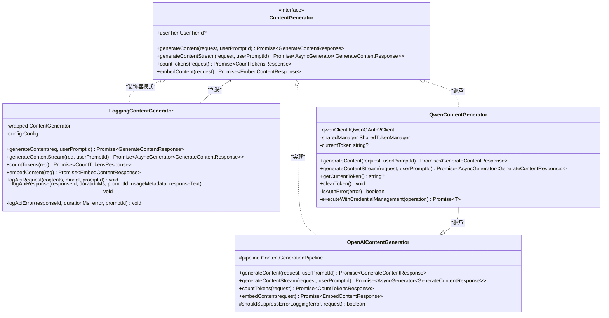
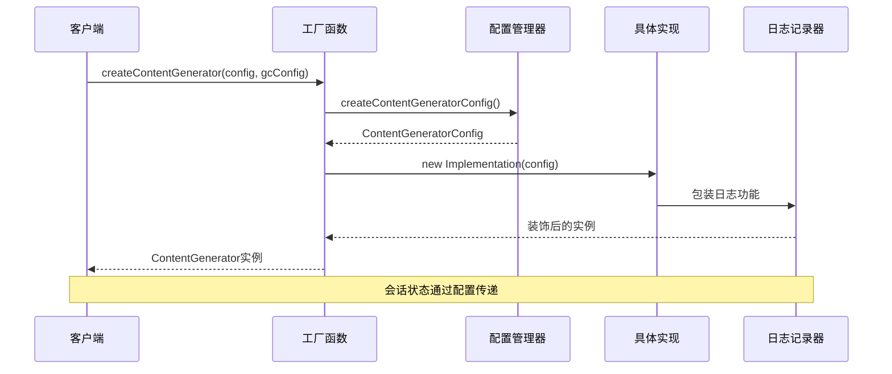
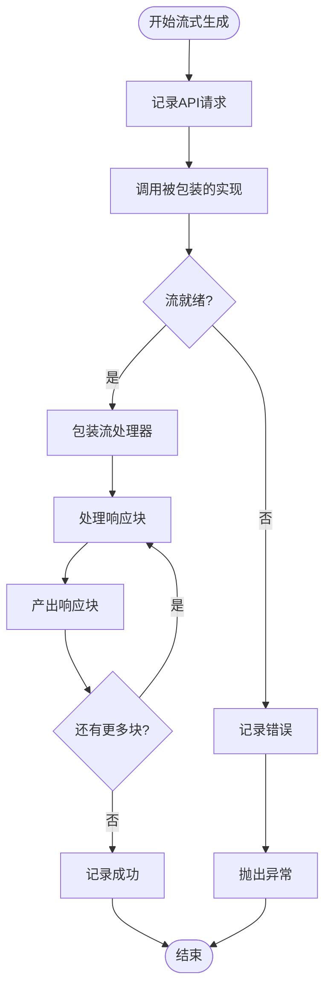
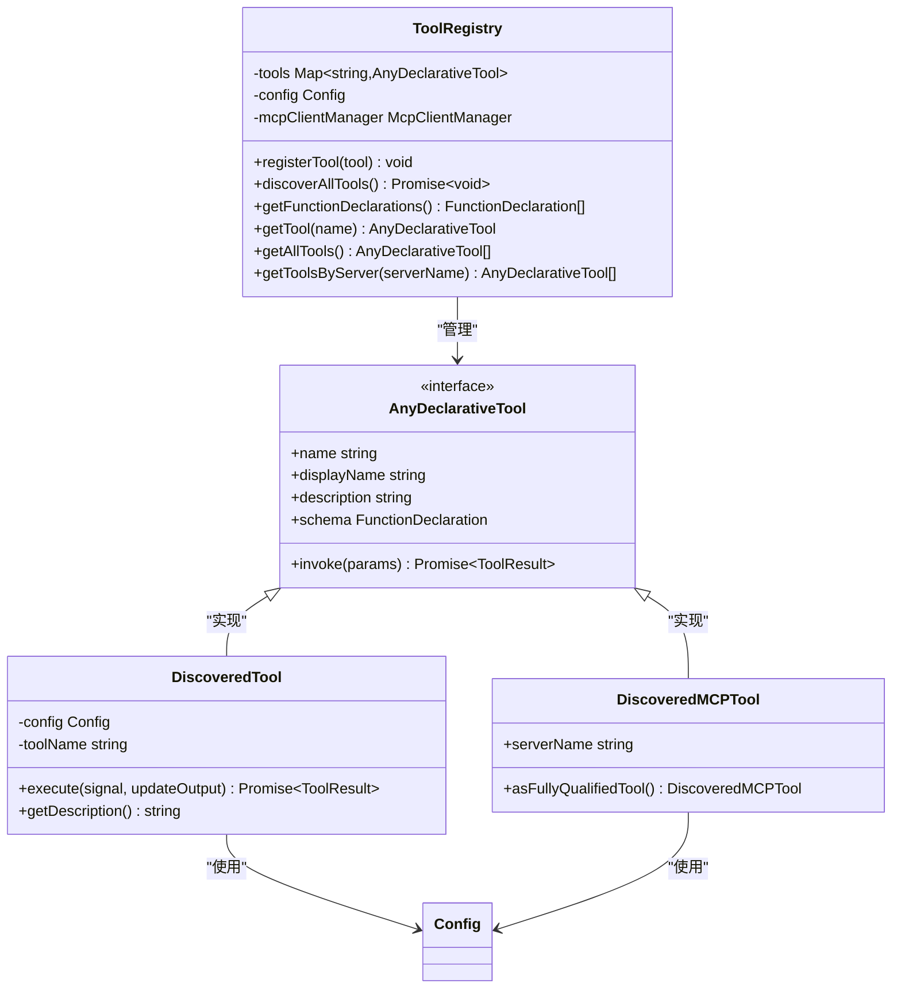
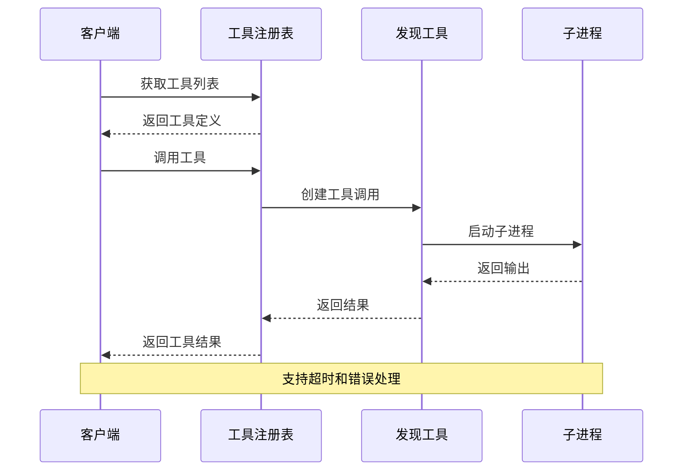
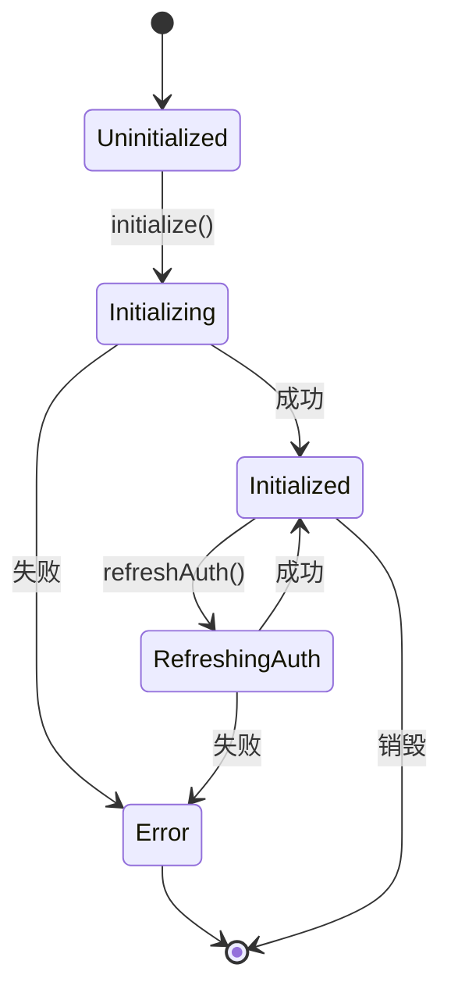
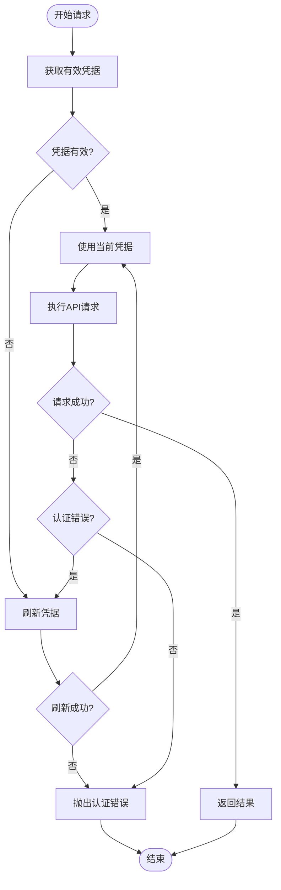
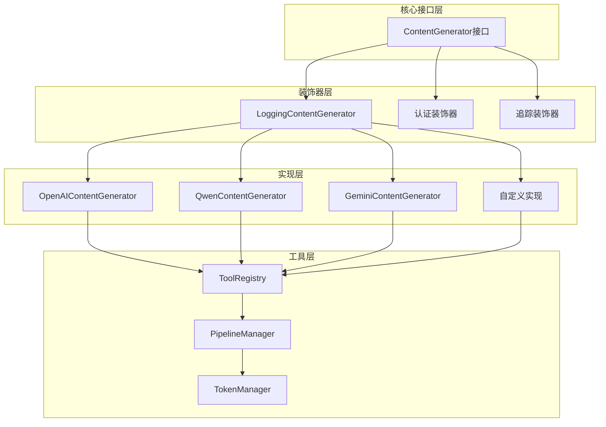
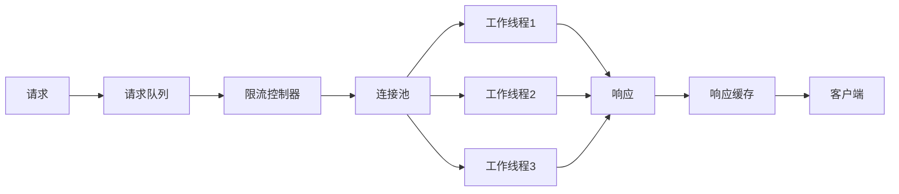
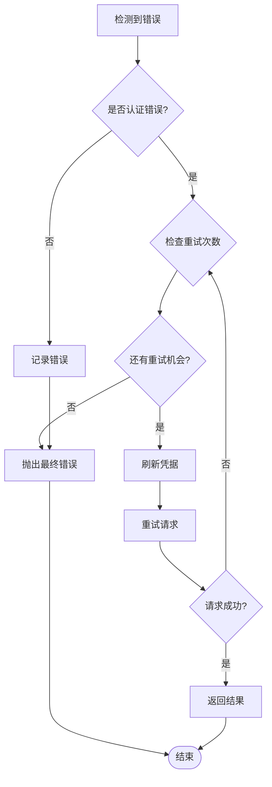

# 内容生成器接口设计与契约详解

<cite>
**本文档中引用的文件**
- [contentGenerator.ts](file://packages/core/src/core/contentGenerator.ts)
- [loggingContentGenerator.ts](file://packages/core/src/core/loggingContentGenerator.ts)
- [openaiContentGenerator.ts](file://packages/core/src/core/openaiContentGenerator/openaiContentGenerator.ts)
- [qwenContentGenerator.ts](file://packages/core/src/qwen/qwenContentGenerator.ts)
- [tool-registry.ts](file://packages/core/src/tools/tool-registry.ts)
- [config.ts](file://packages/core/src/config/config.ts)
</cite>

## 目录
1. [引言](#引言)
2. [接口设计概述](#接口设计概述)
3. [核心接口架构](#核心接口架构)
4. [实现类分析](#实现类分析)
5. [流式响应处理](#流式响应处理)
6. [工具调用集成](#工具调用集成)
7. [上下文管理机制](#上下文管理机制)
8. [认证与授权系统](#认证与授权系统)
9. [扩展性设计](#扩展性设计)
10. [性能优化策略](#性能优化策略)
11. [故障排除指南](#故障排除指南)
12. [总结](#总结)

## 引言

内容生成器接口（ContentGenerator）是Qwen代码助手项目中的核心抽象层，它为所有AI模型内容生成器提供了统一的契约和行为规范。该接口不仅定义了generateContent方法的统一签名，还支持流式响应处理、工具调用集成和复杂的上下文管理功能。

本文档将深入分析这个接口的设计理念、实现细节以及扩展机制，帮助开发者理解如何通过依赖注入方式集成不同的AI模型实现，并探讨其在实际应用中的最佳实践。

## 接口设计概述

### 核心设计理念

内容生成器接口采用了面向对象设计原则中的接口隔离原则和依赖倒置原则，通过定义清晰的契约来解耦具体的AI模型实现和上层业务逻辑。



**图表来源**
- [contentGenerator.ts](file://packages/core/src/core/contentGenerator.ts#L20-L35)
- [loggingContentGenerator.ts](file://packages/core/src/core/loggingContentGenerator.ts#L30-L40)
- [openaiContentGenerator.ts](file://packages/core/src/core/openaiContentGenerator/openaiContentGenerator.ts#L15-L25)
- [qwenContentGenerator.ts](file://packages/core/src/qwen/qwenContentGenerator.ts#L25-L35)

### 接口契约定义

ContentGenerator接口定义了四个核心方法，每个方法都有明确的职责和返回类型：

1. **generateContent**: 同步内容生成方法
2. **generateContentStream**: 流式内容生成方法  
3. **countTokens**: 令牌计数方法
4. **embedContent**: 内容嵌入方法

**章节来源**
- [contentGenerator.ts](file://packages/core/src/core/contentGenerator.ts#L20-L35)

## 核心接口架构

### 接口参数设计

接口的参数设计体现了对不同类型AI模型的兼容性和扩展性考虑：

```typescript
// 核心请求参数类型
export interface GenerateContentParameters {
  contents: Content[];
  model: string;
  safetySettings?: SafetySetting[];
  generationConfig?: GenerationConfig;
}

// 认证类型枚举
export enum AuthType {
  LOGIN_WITH_GOOGLE = 'oauth-personal',
  USE_GEMINI = 'gemini-api-key',
  USE_VERTEX_AI = 'vertex-ai',
  CLOUD_SHELL = 'cloud-shell',
  USE_OPENAI = 'openai',
  QWEN_OAUTH = 'qwen-oauth',
}

// 配置参数类型
export type ContentGeneratorConfig = {
  model: string;
  apiKey?: string;
  baseUrl?: string;
  vertexai?: boolean;
  authType?: AuthType | undefined;
  enableOpenAILogging?: boolean;
  timeout?: number;
  maxRetries?: number;
  disableCacheControl?: boolean;
  samplingParams?: {
    top_p?: number;
    top_k?: number;
    repetition_penalty?: number;
    presence_penalty?: number;
    frequency_penalty?: number;
    temperature?: number;
    max_tokens?: number;
  };
  proxy?: string | undefined;
  userAgent?: string;
};
```

### 会话状态管理

接口通过依赖注入的方式管理会话状态，确保不同实现之间的一致性：



**图表来源**
- [contentGenerator.ts](file://packages/core/src/core/contentGenerator.ts#L130-L180)
- [config.ts](file://packages/core/src/config/config.ts#L150-L200)

**章节来源**
- [contentGenerator.ts](file://packages/core/src/core/contentGenerator.ts#L37-L120)
- [config.ts](file://packages/core/src/config/config.ts#L100-L200)

## 实现类分析

### LoggingContentGenerator装饰器

LoggingContentGenerator实现了装饰器模式，为任何ContentGenerator实现添加了日志记录功能：

```typescript
export class LoggingContentGenerator implements ContentGenerator {
  constructor(
    private readonly wrapped: ContentGenerator,
    private readonly config: Config,
  ) {}

  async generateContent(
    req: GenerateContentParameters,
    userPromptId: string,
  ): Promise<GenerateContentResponse> {
    const startTime = Date.now();
    this.logApiRequest(toContents(req.contents), req.model, userPromptId);
    try {
      const response = await this.wrapped.generateContent(req, userPromptId);
      const durationMs = Date.now() - startTime;
      this._logApiResponse(
        response.responseId ?? '',
        durationMs,
        userPromptId,
        response.usageMetadata,
        JSON.stringify(response),
      );
      return response;
    } catch (error) {
      const durationMs = Date.now() - startTime;
      this._logApiError(undefined, durationMs, error, userPromptId);
      throw error;
    }
  }
}
```

这种设计的优势：
- **关注点分离**: 日志逻辑与业务逻辑完全分离
- **可插拔性**: 可以选择是否启用日志功能
- **一致性**: 所有实现都自动获得日志功能

### OpenAIContentGenerator实现

OpenAIContentGenerator展示了如何通过管道模式处理复杂的请求流程：

```typescript
export class OpenAIContentGenerator implements ContentGenerator {
  protected pipeline: ContentGenerationPipeline;

  constructor(
    contentGeneratorConfig: ContentGeneratorConfig,
    cliConfig: Config,
    provider: OpenAICompatibleProvider,
  ) {
    const pipelineConfig: PipelineConfig = {
      cliConfig,
      provider,
      contentGeneratorConfig,
      telemetryService: new DefaultTelemetryService(
        cliConfig,
        contentGeneratorConfig.enableOpenAILogging,
      ),
      errorHandler: new EnhancedErrorHandler(
        (error: unknown, request: GenerateContentParameters) =>
          this.shouldSuppressErrorLogging(error, request),
      ),
    };

    this.pipeline = new ContentGenerationPipeline(pipelineConfig);
  }
}
```

### QwenContentGenerator扩展

QwenContentGenerator展示了如何通过继承和重写来扩展基础功能：

```typescript
export class QwenContentGenerator extends OpenAIContentGenerator {
  private async executeWithCredentialManagement<T>(
    operation: () => Promise<T>,
  ): Promise<T> {
    const attemptOperation = async (): Promise<T> => {
      const { token, endpoint } = await this.getValidToken();
      this.pipeline.client.apiKey = token;
      this.pipeline.client.baseURL = endpoint;
      return await operation();
    };

    try {
      return await attemptOperation();
    } catch (error) {
      if (this.isAuthError(error)) {
        await this.sharedManager.getValidCredentials(this.qwenClient, true);
        return await attemptOperation();
      }
      throw error;
    }
  }
}
```

**章节来源**
- [loggingContentGenerator.ts](file://packages/core/src/core/loggingContentGenerator.ts#L30-L100)
- [openaiContentGenerator.ts](file://packages/core/src/core/openaiContentGenerator/openaiContentGenerator.ts#L15-L50)
- [qwenContentGenerator.ts](file://packages/core/src/qwen/qwenContentGenerator.ts#L100-L150)

## 流式响应处理

### 流式接口设计

接口支持异步生成器模式，允许实时处理AI响应：

```typescript
async generateContentStream(
  request: GenerateContentParameters,
  userPromptId: string,
): Promise<AsyncGenerator<GenerateContentResponse>> {
  const startTime = Date.now();
  this.logApiRequest(toContents(req.contents), req.model, userPromptId);

  let stream: AsyncGenerator<GenerateContentResponse>;
  try {
    stream = await this.wrapped.generateContentStream(req, userPromptId);
  } catch (error) {
    const durationMs = Date.now() - startTime;
    this._logApiError(undefined, durationMs, error, userPromptId);
    throw error;
  }

  return this.loggingStreamWrapper(stream, startTime, userPromptId);
}
```

### 流式数据处理流程



**图表来源**
- [loggingContentGenerator.ts](file://packages/core/src/core/loggingContentGenerator.ts#L100-L150)

**章节来源**
- [loggingContentGenerator.ts](file://packages/core/src/core/loggingContentGenerator.ts#L100-L150)

## 工具调用集成

### 工具注册表架构

工具调用集成通过ToolRegistry实现，支持多种类型的工具发现和管理：



**图表来源**
- [tool-registry.ts](file://packages/core/src/tools/tool-registry.ts#L100-L200)

### 工具发现机制

工具发现支持两种主要方式：命令行发现和MCP服务器发现：

```typescript
async discoverAllTools(): Promise<void> {
  this.removeDiscoveredTools();
  this.config.getPromptRegistry().clear();

  await this.discoverAndRegisterToolsFromCommand();
  await this.mcpClientManager.discoverAllMcpTools();
}

private async discoverAndRegisterToolsFromCommand(): Promise<void> {
  const discoveryCmd = this.config.getToolDiscoveryCommand();
  if (!discoveryCmd) return;

  try {
    const cmdParts = parse(discoveryCmd);
    const proc = spawn(cmdParts[0], cmdParts.slice(1));
    
    // 处理输出并注册工具
    const functions: FunctionDeclaration[] = [];
    const discoveredItems = JSON.parse(stdout.trim());
    
    for (const tool of discoveredItems) {
      if (tool && typeof tool === 'object') {
        // 提取函数声明并注册
        this.registerTool(new DiscoveredTool(this.config, func.name, func.description, parameters));
      }
    }
  } catch (e) {
    console.error(`Tool discovery command "${discoveryCmd}" failed:`, e);
    throw e;
  }
}
```

### 工具执行流程



**图表来源**
- [tool-registry.ts](file://packages/core/src/tools/tool-registry.ts#L200-L300)

**章节来源**
- [tool-registry.ts](file://packages/core/src/tools/tool-registry.ts#L100-L300)

## 上下文管理机制

### 会话状态管理

配置系统通过Config类管理完整的会话状态，包括模型设置、工具配置和用户偏好：

```typescript
export class Config {
  private toolRegistry!: ToolRegistry;
  private promptRegistry!: PromptRegistry;
  private subagentManager!: SubagentManager;
  private sessionId: string;
  private contentGeneratorConfig!: ContentGeneratorConfig;
  private readonly model: string;
  private readonly approvalMode: ApprovalMode;
  private readonly telemetrySettings: TelemetrySettings;
  
  async initialize(): Promise<void> {
    this.toolRegistry = await this.createToolRegistry();
    this.promptRegistry = new PromptRegistry();
    this.subagentManager = new SubagentManager(this);
    // 初始化其他组件...
  }
}
```

### 状态同步机制



**图表来源**
- [config.ts](file://packages/core/src/config/config.ts#L300-L400)

### 历史记录管理

客户端通过GeminiClient管理对话历史：

```typescript
async initialize(
  contentGeneratorConfig: ContentGeneratorConfig,
  extraHistory?: Content[],
) {
  this.contentGenerator = await createContentGenerator(
    contentGeneratorConfig,
    this.config,
    this.config.getSessionId(),
  );
  
  this.chat = await this.startChat(
    extraHistory || [],
    contentGeneratorConfig.model,
  );
}

getContentGenerator(): ContentGenerator {
  if (!this.contentGenerator) {
    throw new Error('Content generator not initialized');
  }
  return this.contentGenerator;
}
```

**章节来源**
- [config.ts](file://packages/core/src/config/config.ts#L200-L400)
- [client.ts](file://packages/core/src/core/client.ts#L140-L190)

## 认证与授权系统

### 多种认证方式支持

接口支持六种不同的认证类型，每种都有特定的使用场景：

```typescript
export enum AuthType {
  LOGIN_WITH_GOOGLE = 'oauth-personal',    // Google OAuth个人账户
  USE_GEMINI = 'gemini-api-key',           // Gemini API密钥
  USE_VERTEX_AI = 'vertex-ai',             // Vertex AI认证
  CLOUD_SHELL = 'cloud-shell',             // 云Shell环境
  USE_OPENAI = 'openai',                   // OpenAI兼容API
  QWEN_OAUTH = 'qwen-oauth',               // Qwen OAuth认证
}
```

### 动态认证管理

QwenContentGenerator展示了如何动态管理认证凭据：

```typescript
private async getValidToken(): Promise<{ token: string; endpoint: string }> {
  try {
    const credentials = await this.sharedManager.getValidCredentials(
      this.qwenClient,
    );

    if (!credentials.access_token) {
      throw new Error('No access token available');
    }

    return {
      token: credentials.access_token,
      endpoint: this.getCurrentEndpoint(credentials.resource_url),
    };
  } catch (error) {
    if (this.isAuthError(error)) {
      throw error;
    }
    throw new Error('Failed to obtain valid Qwen access token');
  }
}
```

### 凭据刷新机制



**图表来源**
- [qwenContentGenerator.ts](file://packages/core/src/qwen/qwenContentGenerator.ts#L80-L120)

**章节来源**
- [contentGenerator.ts](file://packages/core/src/core/contentGenerator.ts#L37-L50)
- [qwenContentGenerator.ts](file://packages/core/src/qwen/qwenContentGenerator.ts#L80-L150)

## 扩展性设计

### 插件化架构

接口设计支持通过工厂函数和依赖注入轻松添加新的AI模型实现：

```typescript
export async function createContentGenerator(
  config: ContentGeneratorConfig,
  gcConfig: Config,
  sessionId?: string,
): Promise<ContentGenerator> {
  const version = process.env['CLI_VERSION'] || process.version;
  const userAgent = `QwenCode/${version} (${process.platform}; ${process.arch})`;
  const baseHeaders: Record<string, string> = {
    'User-Agent': userAgent,
  };

  if (config.authType === AuthType.LOGIN_WITH_GOOGLE) {
    const httpOptions = { headers: baseHeaders };
    return new LoggingContentGenerator(
      await createCodeAssistContentGenerator(
        httpOptions,
        config.authType,
        gcConfig,
        sessionId,
      ),
      gcConfig,
    );
  }

  if (config.authType === AuthType.USE_OPENAI) {
    const { createOpenAIContentGenerator } = await import(
      './openaiContentGenerator/index.js'
    );
    return createOpenAIContentGenerator(config, gcConfig);
  }

  // 新的实现可以在这里添加
  if (config.authType === AuthType.NEW_MODEL_TYPE) {
    const { createNewModelContentGenerator } = await import(
      './newModelContentGenerator.js'
    );
    return createNewModelContentGenerator(config, gcConfig);
  }

  throw new Error(`Unsupported authType: ${config.authType}`);
}
```

### 配置驱动扩展

通过ContentGeneratorConfig的扩展参数，可以轻松添加新的模型特性：

```typescript
export type ContentGeneratorConfig = {
  // 现有配置...
  samplingParams?: {
    top_p?: number;
    top_k?: number;
    repetition_penalty?: number;
    presence_penalty?: number;
    frequency_penalty?: number;
    temperature?: number;
    max_tokens?: number;
  };
  // 新增配置项
  customParams?: Record<string, unknown>;
  modelSpecificSettings?: {
    [modelName: string]: Record<string, unknown>;
  };
};
```

### 组件化设计



**图表来源**
- [contentGenerator.ts](file://packages/core/src/core/contentGenerator.ts#L130-L200)

**章节来源**
- [contentGenerator.ts](file://packages/core/src/core/contentGenerator.ts#L130-L246)

## 性能优化策略

### 缓存机制

接口通过SharedTokenManager实现智能缓存：

```typescript
// Token缓存和自动刷新
private async getValidToken(): Promise<{ token: string; endpoint: string }> {
  const credentials = await this.sharedManager.getValidCredentials(
    this.qwenClient,
  );

  // 检查token是否过期或即将过期
  if (this.isTokenExpired(credentials)) {
    // 触发后台刷新
    this.sharedManager.refreshCredentials(this.qwenClient);
  }

  return {
    token: credentials.access_token,
    endpoint: this.getCurrentEndpoint(credentials.resource_url),
  };
}
```

### 连接池管理

OpenAIContentGenerator使用连接池来优化网络请求：

```typescript
// 高性能请求令牌计算
async countTokens(request: CountTokensParameters): Promise<CountTokensResponse> {
  try {
    const tokenizer = getDefaultTokenizer();
    const result = await tokenizer.calculateTokens(request, {
      textEncoding: 'cl100k_base', // 使用GPT-4编码
    });

    return { totalTokens: result.totalTokens };
  } catch (error) {
    // 回退到简单估算方法
    const content = JSON.stringify(request.contents);
    const totalTokens = Math.ceil(content.length / 4); // 粗略估算：1 token ≈ 4字符

    return { totalTokens };
  }
}
```

### 并发控制



**图表来源**
- [openaiContentGenerator.ts](file://packages/core/src/core/openaiContentGenerator/openaiContentGenerator.ts#L60-L100)

## 故障排除指南

### 常见错误类型

接口通过详细的错误分类和处理机制来提高系统的健壮性：

```typescript
private isAuthError(error: unknown): boolean {
  if (!error) return false;

  const errorMessage = 
    error instanceof Error
      ? error.message.toLowerCase()
      : String(error).toLowerCase();

  const errorWithCode = error as { status?: number | string; code?: number | string };
  const errorCode = errorWithCode?.status || errorWithCode?.code;

  return (
    errorCode === 401 ||
    errorCode === 403 ||
    errorCode === '401' ||
    errorCode === '403' ||
    errorMessage.includes('unauthorized') ||
    errorMessage.includes('forbidden') ||
    errorMessage.includes('invalid api key') ||
    errorMessage.includes('invalid access token') ||
    errorMessage.includes('token expired') ||
    errorMessage.includes('authentication') ||
    errorMessage.includes('access denied') ||
    (errorMessage.includes('token') && errorMessage.includes('expired'))
  );
}
```

### 错误恢复策略



**图表来源**
- [qwenContentGenerator.ts](file://packages/core/src/qwen/qwenContentGenerator.ts#L200-L250)

### 调试和监控

LoggingContentGenerator提供了完整的API调用跟踪：

```typescript
private _logApiError(
  responseId: string | undefined,
  durationMs: number,
  error: unknown,
  prompt_id: string,
): void {
  const errorMessage = error instanceof Error ? error.message : String(error);
  const errorType = error instanceof Error ? error.name : 'unknown';

  logApiError(
    this.config,
    new ApiErrorEvent(
      responseId,
      this.config.getModel(),
      errorMessage,
      durationMs,
      prompt_id,
      this.config.getContentGeneratorConfig()?.authType,
      errorType,
      isStructuredError(error)
        ? (error as StructuredError).status
        : undefined,
    ),
  );
}
```

**章节来源**
- [qwenContentGenerator.ts](file://packages/core/src/qwen/qwenContentGenerator.ts#L200-L254)
- [loggingContentGenerator.ts](file://packages/core/src/core/loggingContentGenerator.ts#L60-L100)

## 总结

内容生成器接口的设计体现了现代软件架构的最佳实践，通过以下关键特性实现了高度的可扩展性和维护性：

### 设计优势

1. **统一抽象**: 通过ContentGenerator接口为所有AI模型提供一致的API契约
2. **装饰器模式**: LoggingContentGenerator展示了如何通过装饰器模式添加横切关注点
3. **依赖注入**: 通过工厂函数和配置驱动的方式实现松耦合的组件集成
4. **流式处理**: 支持实时响应处理，提升用户体验
5. **工具集成**: 完整的工具发现和调用机制，支持外部工具扩展

### 扩展能力

- **多模型支持**: 易于添加新的AI模型实现
- **认证多样化**: 支持多种认证方式和动态凭据管理
- **配置灵活**: 丰富的配置选项适应不同使用场景
- **监控完善**: 全面的日志记录和错误处理机制

### 最佳实践建议

1. **遵循接口契约**: 新的实现必须严格遵守接口定义的方法签名
2. **合理使用装饰器**: 在需要时使用LoggingContentGenerator等装饰器增强功能
3. **错误处理**: 实现robust的错误处理和恢复机制
4. **性能监控**: 利用内置的日志系统进行性能监控和问题诊断
5. **测试覆盖**: 为每个实现编写全面的单元测试和集成测试

这个接口设计不仅满足了当前的功能需求，更为未来的扩展预留了充足的空间，是一个值得学习和借鉴的优秀设计案例。