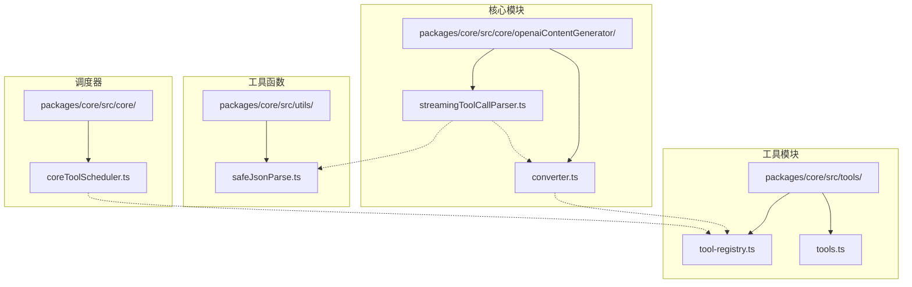
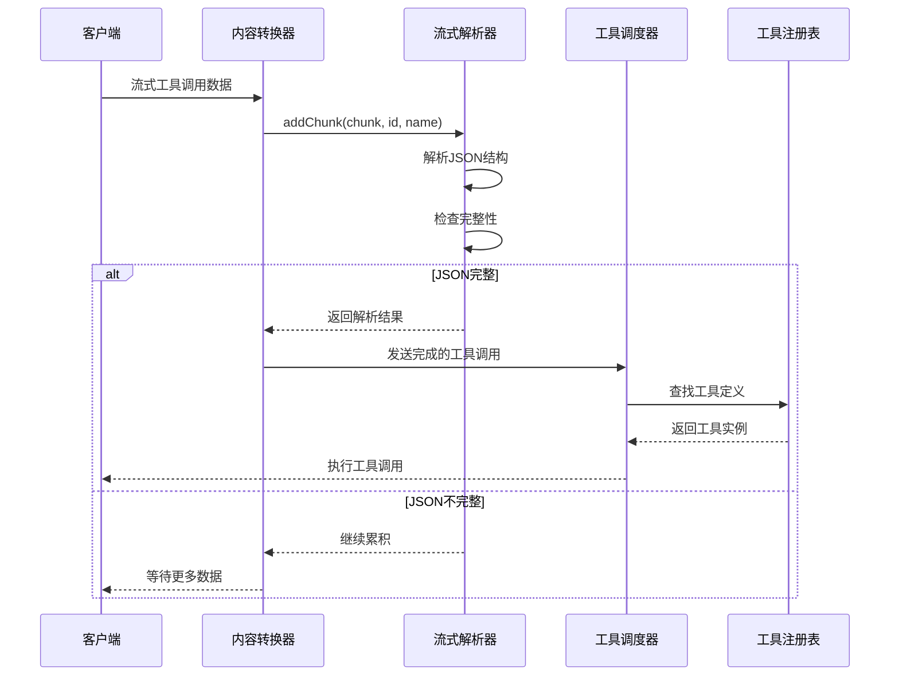
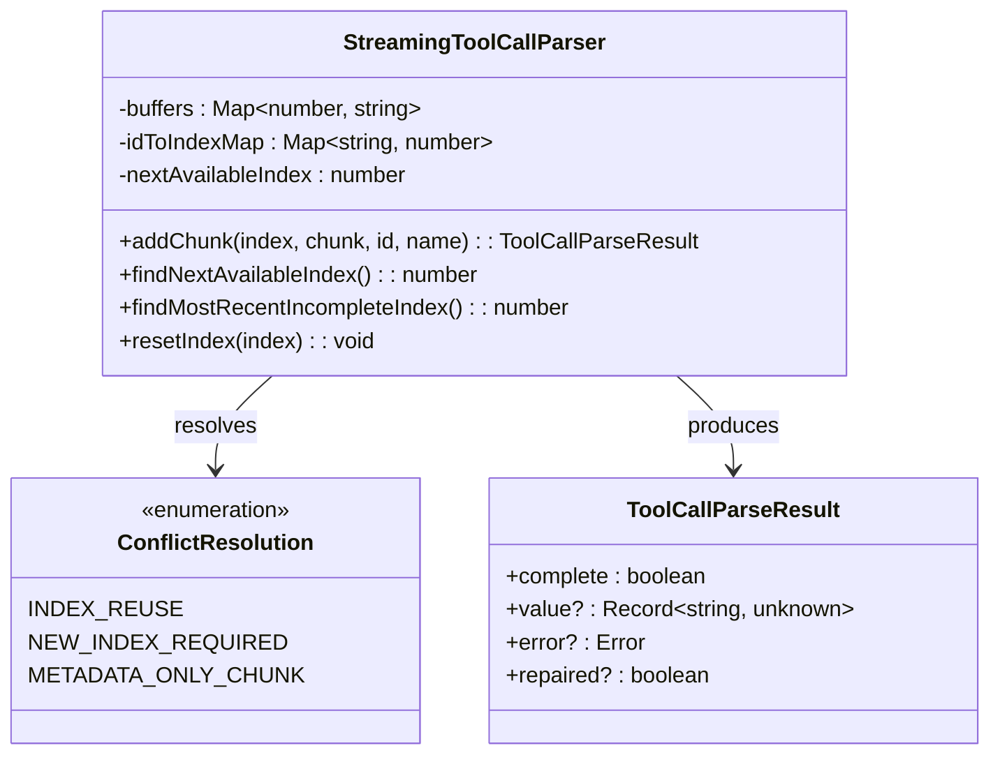
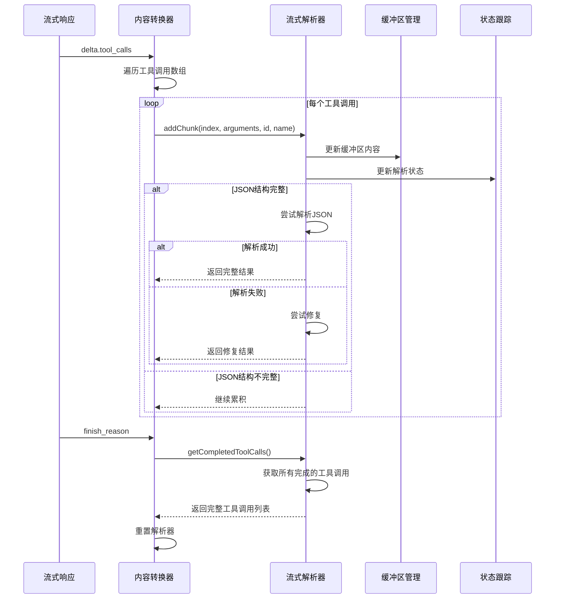
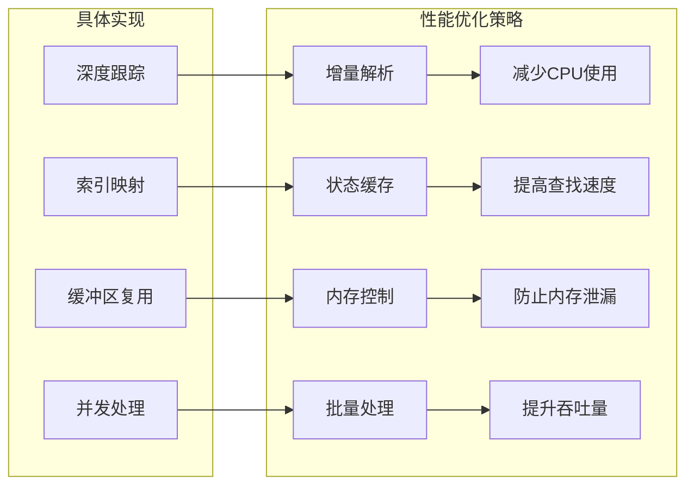
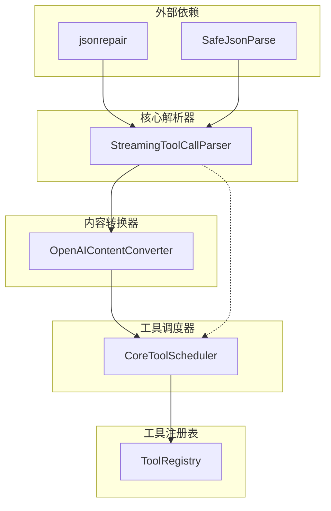

# 流式工具调用解析器

<cite>
**本文档中引用的文件**
- [streamingToolCallParser.ts](file://packages/core/src/core/openaiContentGenerator/streamingToolCallParser.ts)
- [converter.ts](file://packages/core/src/core/openaiContentGenerator/converter.ts)
- [safeJsonParse.ts](file://packages/core/src/utils/safeJsonParse.ts)
- [coreToolScheduler.ts](file://packages/core/src/core/coreToolScheduler.ts)
- [tool-registry.ts](file://packages/core/src/tools/tool-registry.ts)
- [tools.ts](file://packages/core/src/tools/tools.ts)
- [streamingToolCallParser.test.ts](file://packages/core/src/core/openaiContentGenerator/streamingToolCallParser.test.ts)
- [converter.test.ts](file://packages/core/src/core/openaiContentGenerator/converter.test.ts)
</cite>

## 目录
1. [简介](#简介)
2. [项目结构](#项目结构)
3. [核心组件](#核心组件)
4. [架构概览](#架构概览)
5. [详细组件分析](#详细组件分析)
6. [依赖关系分析](#依赖关系分析)
7. [性能考虑](#性能考虑)
8. [故障排除指南](#故障排除指南)
9. [结论](#结论)

## 简介

流式工具调用解析器是Qwen代码助手的核心组件之一，负责在接收到部分响应数据时实时解析出结构化的工具调用信息。该解析器能够处理不完整的JSON片段，通过状态机模式逐步构建完整的工具调用对象，无需等待完整响应即可开始处理。

解析器的主要功能包括：
- 实时处理流式传输的工具调用数据
- 处理不完整的JSON片段并逐步重建
- 支持多个并发工具调用的交错处理
- 自动修复常见的JSON格式问题
- 提供完整的错误处理和恢复机制

## 项目结构

流式工具调用解析器位于Qwen代码助手项目的以下目录结构中：



**图表来源**
- [streamingToolCallParser.ts](file://packages/core/src/core/openaiContentGenerator/streamingToolCallParser.ts#L1-L415)
- [converter.ts](file://packages/core/src/core/openaiContentGenerator/converter.ts#L1-L1036)

## 核心组件

### StreamingToolCallParser 类

`StreamingToolCallParser` 是解析器的核心类，负责处理流式工具调用数据。它维护多个内部状态映射表来跟踪每个工具调用的解析进度。

主要特性：
- **缓冲区管理**：为每个工具调用索引维护独立的字符串缓冲区
- **JSON深度跟踪**：监控JSON结构的嵌套深度以确定完整性
- **字符串边界检测**：准确识别字符串字面量的开始和结束位置
- **转义字符处理**：正确处理JSON中的转义序列
- **索引冲突解决**：自动处理重复索引引发的冲突

### 工具调用状态管理

解析器使用多种状态映射来跟踪每个工具调用的解析进度：

```typescript
private buffers: Map<number, string> = new Map();           // 缓冲区内容
private depths: Map<number, number> = new Map();           // JSON深度
private inStrings: Map<number, boolean> = new Map();       // 字符串状态
private escapes: Map<number, boolean> = new Map();         // 转义状态
private toolCallMeta: Map<number, { id?: string; name?: string }> = new Map();
```

**章节来源**
- [streamingToolCallParser.ts](file://packages/core/src/core/openaiContentGenerator/streamingToolCallParser.ts#L22-L46)

## 架构概览

流式工具调用解析器采用分层架构设计，与内容生成器紧密集成：



**图表来源**
- [converter.ts](file://packages/core/src/core/openaiContentGenerator/converter.ts#L605-L646)
- [streamingToolCallParser.ts](file://packages/core/src/core/openaiContentGenerator/streamingToolCallParser.ts#L48-L150)

## 详细组件分析

### JSON解析算法

解析器的核心算法基于状态机模式，通过跟踪JSON结构的深度来判断数据完整性：

```mermaid
flowchart TD
Start([接收新块]) --> InitState["初始化状态<br/>depth=0, inString=false, escape=false"]
InitState --> ProcessChar["逐字符处理"]
ProcessChar --> CheckChar{"检查字符类型"}
CheckChar --> |"{" 或 "["| IncDepth["depth++"]
CheckChar --> |"}" 或 "]"| DecDepth["depth--"]
CheckChar --> |"\""| ToggleString["切换字符串状态"]
CheckChar --> |"\"| ToggleEscape["切换转义状态"]
CheckChar --> |其他| Continue["继续处理"]
IncDepth --> UpdateState["更新状态"]
DecDepth --> UpdateState
ToggleString --> UpdateState
ToggleEscape --> UpdateState
Continue --> UpdateState
UpdateState --> CheckComplete{"depth == 0<br/>且有数据?"}
CheckComplete --> |是| TryParse["尝试JSON.parse"]
CheckComplete --> |否| ContinueAccumulate["继续累积"]
TryParse --> ParseSuccess{"解析成功?"}
ParseSuccess --> |是| ReturnComplete["返回完整结果"]
ParseSuccess --> |否| CheckInString{"字符串未闭合?"}
CheckInString --> |是| AutoRepair["自动修复：添加结尾引号"]
CheckInString --> |否| ReturnError["返回解析错误"]
AutoRepair --> RepairSuccess{"修复成功?"}
RepairSuccess --> |是| ReturnRepaired["返回修复结果"]
RepairSuccess --> |否| ReturnError
ReturnComplete --> End([结束])
ReturnRepaired --> End
ReturnError --> End
ContinueAccumulate --> End
```

**图表来源**
- [streamingToolCallParser.ts](file://packages/core/src/core/openaiContentGenerator/streamingToolCallParser.ts#L48-L150)

### 索引冲突处理机制

当多个工具调用同时进行时，可能会出现索引冲突。解析器实现了智能的冲突检测和解决机制：



**图表来源**
- [streamingToolCallParser.ts](file://packages/core/src/core/openaiContentGenerator/streamingToolCallParser.ts#L48-L150)

### 错误处理和修复策略

解析器实现了多层次的错误处理和修复机制：

1. **标准JSON解析**：首先尝试使用原生JSON.parse()
2. **自动修复**：对于未闭合的字符串，自动添加结尾引号
3. **安全解析**：使用jsonrepair库进行更激进的修复
4. **降级处理**：如果所有方法都失败，使用安全解析器

```mermaid
flowchart TD
ParseAttempt[尝试解析] --> StandardParse{标准JSON.parse}
StandardParse --> |成功| Success[返回结果]
StandardParse --> |失败| CheckInString{字符串未闭合?}
CheckInString --> |是| AutoClose["自动闭合字符串<br/>JSON.parse(chunk + '\"')"]
CheckInString --> |否| SafeParse["安全解析<br/>jsonrepair + JSON.parse"]
AutoClose --> |成功| AutoRepair[返回修复结果]
AutoClose --> |失败| SafeParse
SafeParse --> |成功| SafeResult[返回安全解析结果]
SafeParse --> |失败| Fallback["降级处理<br/>返回空对象或默认值"]
Success --> End([结束])
AutoRepair --> End
SafeResult --> End
Fallback --> End
```

**图表来源**
- [streamingToolCallParser.ts](file://packages/core/src/core/openaiContentGenerator/streamingToolCallParser.ts#L150-L180)
- [safeJsonParse.ts](file://packages/core/src/utils/safeJsonParse.ts#L15-L45)

**章节来源**
- [streamingToolCallParser.ts](file://packages/core/src/core/openaiContentGenerator/streamingToolCallParser.ts#L48-L180)
- [safeJsonParse.ts](file://packages/core/src/utils/safeJsonParse.ts#L15-L45)

### 与内容生成器的集成

解析器与内容生成器紧密集成，形成完整的流式处理管道：



**图表来源**
- [converter.ts](file://packages/core/src/core/openaiContentGenerator/converter.ts#L605-L646)

**章节来源**
- [converter.ts](file://packages/core/src/core/openaiContentGenerator/converter.ts#L605-L646)

### 性能优化策略

解析器采用了多种性能优化策略来确保高效处理：

1. **增量解析**：只在JSON结构完整时才尝试解析
2. **状态缓存**：避免重复计算相同的解析状态
3. **内存控制**：及时清理已完成的工具调用
4. **批量处理**：支持多个工具调用的同时处理



## 依赖关系分析

流式工具调用解析器的依赖关系图展示了其与其他核心组件的交互：



**图表来源**
- [streamingToolCallParser.ts](file://packages/core/src/core/openaiContentGenerator/streamingToolCallParser.ts#L1-L10)
- [converter.ts](file://packages/core/src/core/openaiContentGenerator/converter.ts#L1-L20)

**章节来源**
- [streamingToolCallParser.ts](file://packages/core/src/core/openaiContentGenerator/streamingToolCallParser.ts#L1-L10)
- [converter.ts](file://packages/core/src/core/openaiContentGenerator/converter.ts#L1-L20)

## 性能考虑

### 内存使用控制

解析器通过以下机制控制内存使用：

1. **缓冲区大小限制**：及时清理已完成的工具调用
2. **状态映射优化**：使用Map结构减少内存碎片
3. **增量处理**：避免一次性加载大量数据

### 解析效率提升

为了提升解析效率，解析器采用了以下策略：

1. **早期退出**：在JSON结构不完整时立即返回
2. **状态复用**：避免重复计算相同的解析状态
3. **字符级处理**：逐字符处理以最小化开销

### 并发处理能力

解析器支持多个工具调用的并发处理，通过独立的状态映射确保线程安全。

## 故障排除指南

### 常见问题及解决方案

1. **JSON解析失败**
   - 检查输入数据是否包含特殊字符
   - 验证字符串是否正确闭合
   - 使用自动修复功能

2. **索引冲突**
   - 确保工具调用ID唯一性
   - 检查索引分配逻辑
   - 重置解析器状态

3. **内存泄漏**
   - 及时调用reset()方法
   - 监控缓冲区大小
   - 检查状态映射清理

**章节来源**
- [streamingToolCallParser.ts](file://packages/core/src/core/openaiContentGenerator/streamingToolCallParser.ts#L338-L384)

## 结论

流式工具调用解析器是一个高度优化的组件，能够在处理不完整JSON数据的同时保持高性能和可靠性。其核心优势包括：

1. **实时处理能力**：无需等待完整响应即可开始处理
2. **鲁棒性设计**：能够处理各种异常情况和格式问题
3. **并发支持**：支持多个工具调用的同时处理
4. **错误恢复**：具备多层次的错误处理和修复机制

该解析器为Qwen代码助手提供了强大的流式工具调用处理能力，是整个系统架构中不可或缺的核心组件。