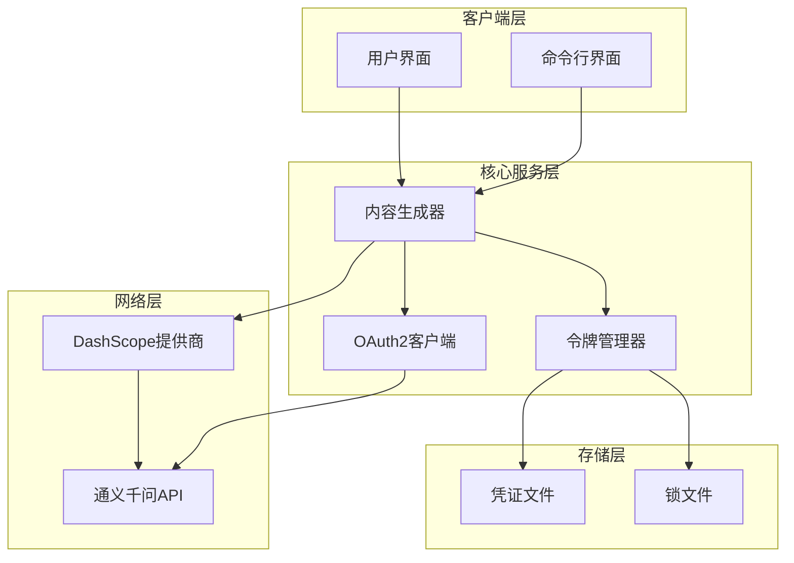
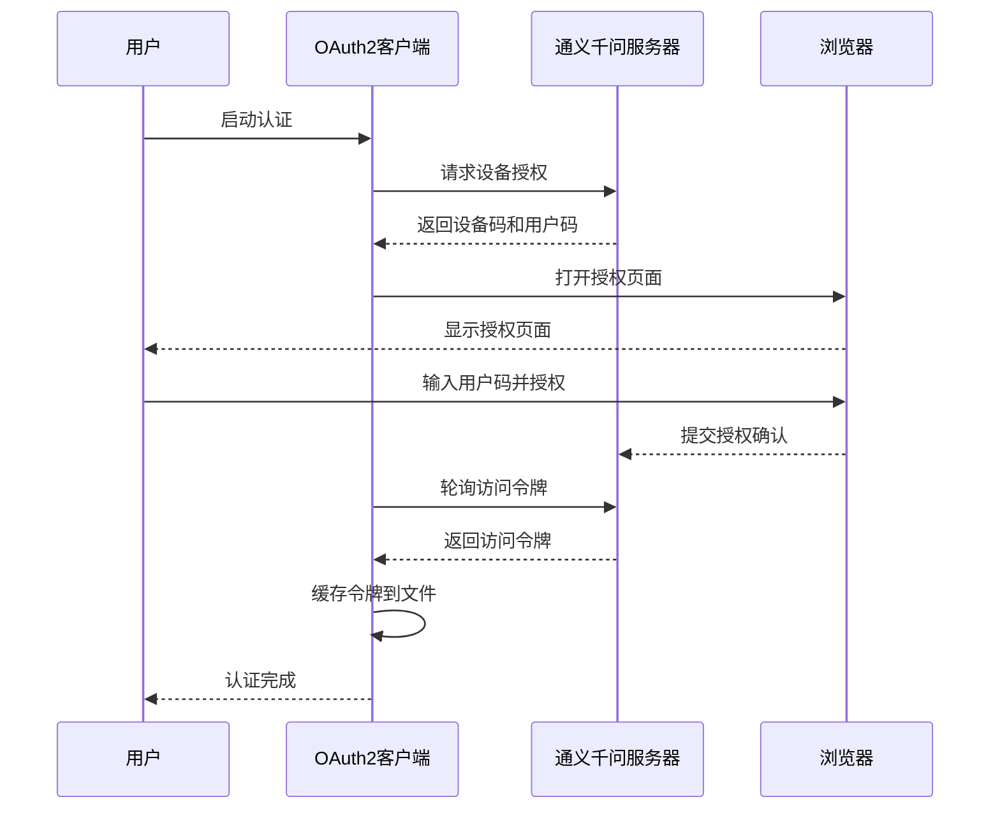
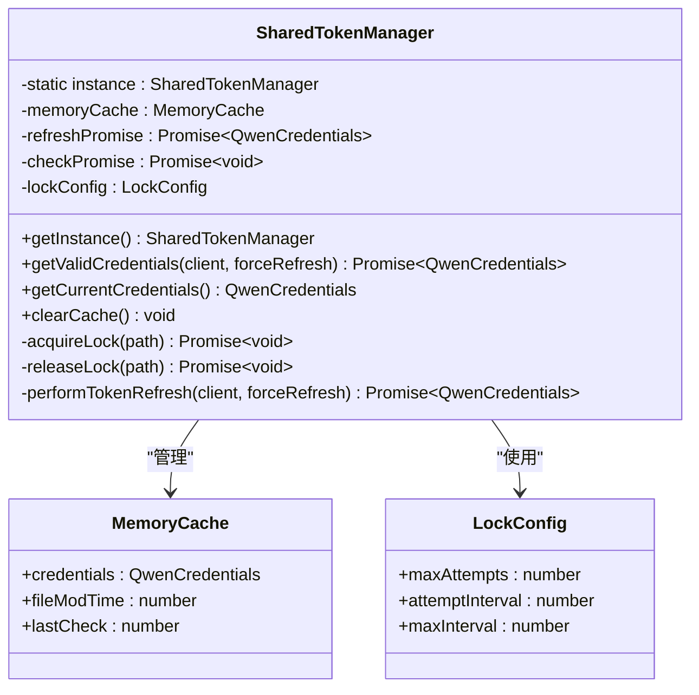
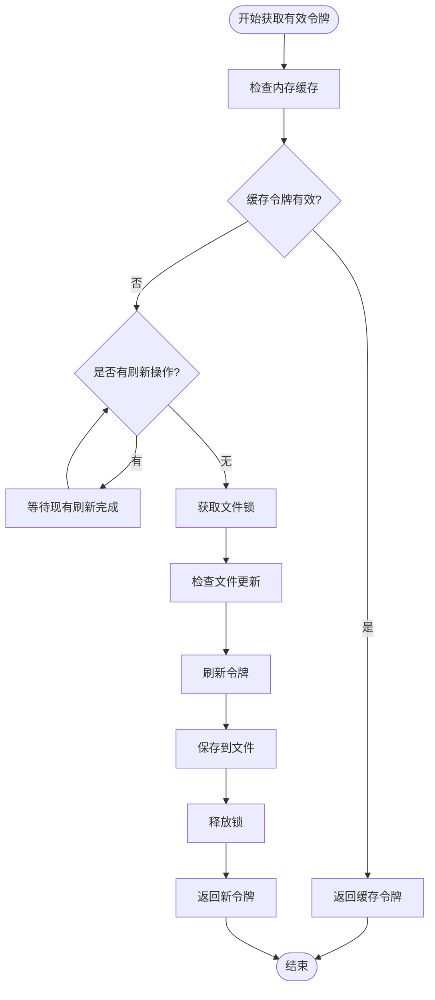
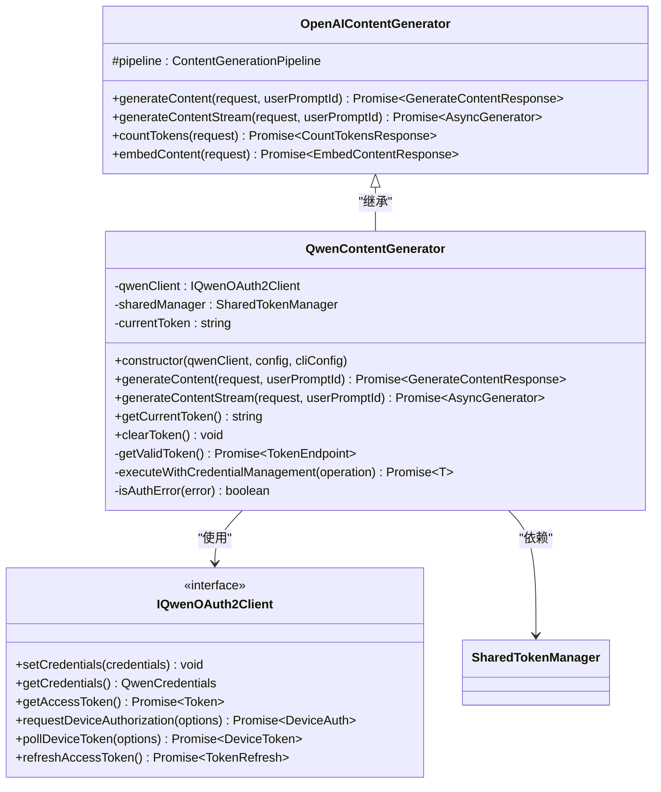
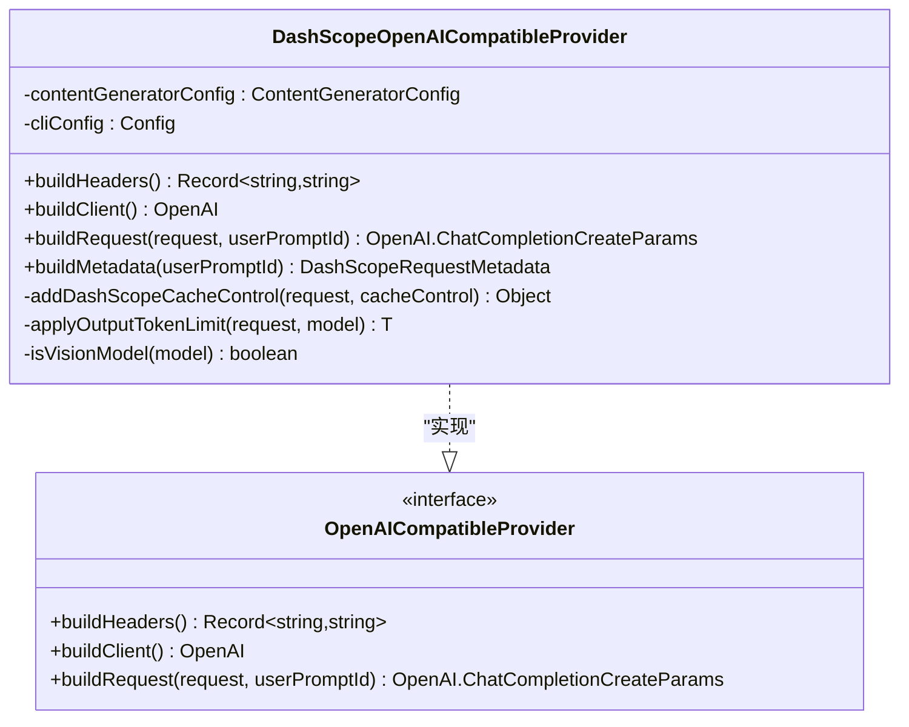
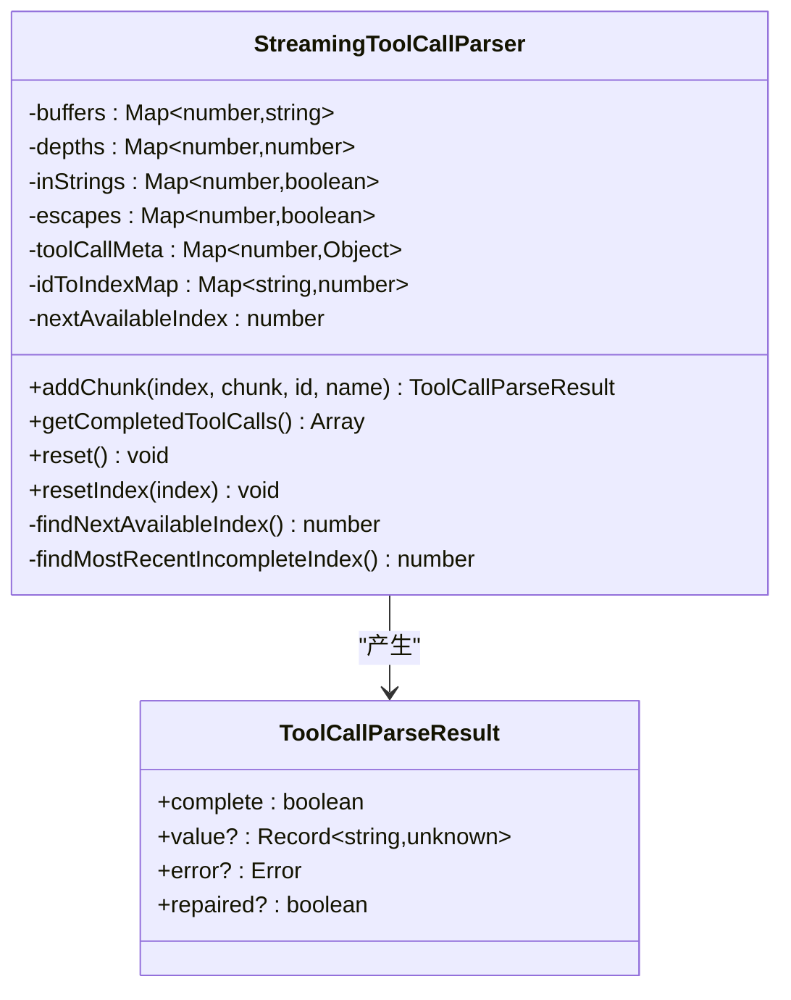
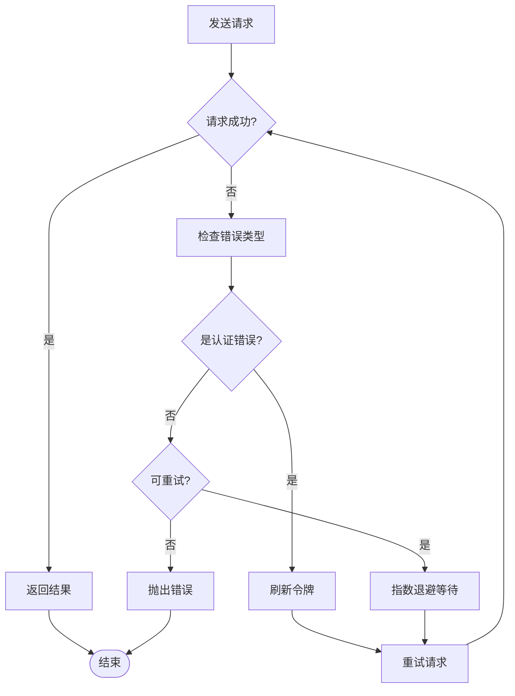

# 通义千问内容生成器

<cite>
**本文档中引用的文件**
- [qwenContentGenerator.ts](file://packages/core/src/qwen/qwenContentGenerator.ts)
- [qwenOAuth2.ts](file://packages/core/src/qwen/qwenOAuth2.ts)
- [sharedTokenManager.ts](file://packages/core/src/qwen/sharedTokenManager.ts)
- [dashscope.ts](file://packages/core/src/core/openaiContentGenerator/provider/dashscope.ts)
- [contentGenerator.ts](file://packages/core/src/core/contentGenerator.ts)
- [streamingToolCallParser.ts](file://packages/core/src/core/openaiContentGenerator/streamingToolCallParser.ts)
- [qwenContentGenerator.test.ts](file://packages/core/src/qwen/qwenContentGenerator.test.ts)
- [package.json](file://package.json)
</cite>

## 目录
1. [简介](#简介)
2. [项目架构概览](#项目架构概览)
3. [OAuth2认证流程](#oauth2认证流程)
4. [共享令牌管理器](#共享令牌管理器)
5. [内容生成器实现](#内容生成器实现)
6. [请求构建与处理](#请求构建与处理)
7. [流式响应解析](#流式响应解析)
8. [错误处理与重试机制](#错误处理与重试机制)
9. [性能优化策略](#性能优化策略)
10. [故障排除指南](#故障排除指南)
11. [总结](#总结)

## 简介

通义千问内容生成器是一个基于OAuth2认证的智能内容生成系统，专为阿里云通义千问大语言模型设计。该系统提供了完整的认证管理、令牌刷新、请求处理和响应解析功能，支持多种认证方式和灵活的配置选项。

系统的核心特性包括：
- 基于OAuth2设备授权流程的安全认证
- 跨进程共享的令牌管理系统
- 动态端点管理和自动令牌刷新
- 流式响应处理和工具调用解析
- 完善的错误处理和重试机制

## 项目架构概览



**图表来源**
- [qwenContentGenerator.ts](file://packages/core/src/qwen/qwenContentGenerator.ts#L1-L50)
- [sharedTokenManager.ts](file://packages/core/src/qwen/sharedTokenManager.ts#L1-L100)

**章节来源**
- [qwenContentGenerator.ts](file://packages/core/src/qwen/qwenContentGenerator.ts#L1-L254)
- [contentGenerator.ts](file://packages/core/src/core/contentGenerator.ts#L1-L246)

## OAuth2认证流程

### 设备授权流程

通义千问内容生成器采用OAuth2设备授权流程进行身份验证，这是一种安全且用户友好的认证方式：



**图表来源**
- [qwenOAuth2.ts](file://packages/core/src/qwen/qwenOAuth2.ts#L600-L700)
- [qwenOAuth2.ts](file://packages/core/src/qwen/qwenOAuth2.ts#L700-L800)

### PKCE安全机制

系统实现了PKCE（Proof Key for Code Exchange）以增强安全性：

```typescript
// 生成PKCE配对
const { code_verifier, code_challenge } = generatePKCEPair();

// 使用SHA-256哈希生成挑战
const codeChallenge = generateCodeChallenge(codeVerifier);
```

PKCE确保：
- 防止中间人攻击
- 加密传输代码验证器
- 增强设备授权的安全性

**章节来源**
- [qwenOAuth2.ts](file://packages/core/src/qwen/qwenOAuth2.ts#L30-L80)
- [qwenOAuth2.ts](file://packages/core/src/qwen/qwenOAuth2.ts#L600-L750)

## 共享令牌管理器

### 单例模式设计

共享令牌管理器采用单例模式，确保整个应用程序中只有一个实例负责令牌管理：



**图表来源**
- [sharedTokenManager.ts](file://packages/core/src/qwen/sharedTokenManager.ts#L100-L200)
- [sharedTokenManager.ts](file://packages/core/src/qwen/sharedTokenManager.ts#L200-L300)

### 分布式文件锁定

为了防止多个进程同时刷新令牌，系统实现了分布式文件锁定机制：

```typescript
// 获取文件锁
private async acquireLock(lockPath: string): Promise<void> {
  const { maxAttempts, attemptInterval, maxInterval } = this.lockConfig;
  let currentInterval = attemptInterval;

  for (let attempt = 0; attempt < maxAttempts; attempt++) {
    try {
      // 原子性创建锁文件（独占模式）
      await fs.writeFile(lockPath, lockId, { flag: 'wx' });
      return; // 成功获取锁
    } catch (error: unknown) {
      if ((error as NodeJS.ErrnoException).code === 'EEXIST') {
        // 锁文件已存在，检查是否过期
        // ...
      }
    }
  }
}
```

### 自动令牌刷新

令牌管理器会自动检测令牌的有效性并在必要时刷新：



**图表来源**
- [sharedTokenManager.ts](file://packages/core/src/qwen/sharedTokenManager.ts#L200-L300)
- [sharedTokenManager.ts](file://packages/core/src/qwen/sharedTokenManager.ts#L400-L500)

**章节来源**
- [sharedTokenManager.ts](file://packages/core/src/qwen/sharedTokenManager.ts#L1-L881)

## 内容生成器实现

### 继承关系

QwenContentGenerator继承自OpenAIContentGenerator，扩展了OAuth2认证功能：



**图表来源**
- [qwenContentGenerator.ts](file://packages/core/src/qwen/qwenContentGenerator.ts#L25-L50)
- [qwenOAuth2.ts](file://packages/core/src/qwen/qwenOAuth2.ts#L200-L250)

### 动态令牌管理

QwenContentGenerator实现了动态令牌管理机制，在每次请求前获取有效的访问令牌：

```typescript
private async executeWithCredentialManagement<T>(
  operation: () => Promise<T>,
): Promise<T> {
  const attemptOperation = async (): Promise<T> => {
    const { token, endpoint } = await this.getValidToken();

    // 应用动态配置
    this.pipeline.client.apiKey = token;
    this.pipeline.client.baseURL = endpoint;

    return await operation();
  };

  try {
    return await attemptOperation();
  } catch (error) {
    if (this.isAuthError(error)) {
      // 使用SharedTokenManager正确刷新并持久化令牌
      await this.sharedManager.getValidCredentials(this.qwenClient, true);
      return await attemptOperation();
    }
    throw error;
  }
}
```

**章节来源**
- [qwenContentGenerator.ts](file://packages/core/src/qwen/qwenContentGenerator.ts#L100-L200)

## 请求构建与处理

### DashScope提供商

系统使用DashScope提供商来适配通义千问API的特殊要求：



**图表来源**
- [dashscope.ts](file://packages/core/src/core/openaiContentGenerator/provider/dashscope.ts#L15-L50)

### 缓存控制优化

DashScope提供商实现了智能的缓存控制机制：

```typescript
private addDashScopeCacheControl(
  request: OpenAI.Chat.ChatCompletionCreateParams,
  cacheControl: 'system_only' | 'all',
): {
  messages: OpenAI.Chat.ChatCompletionMessageParam[];
  tools?: ChatCompletionToolWithCache[];
} {
  const messages = request.messages;
  
  const systemIndex = messages.findIndex((msg) => msg.role === 'system');
  const lastIndex = messages.length - 1;

  const updatedMessages = messages.map((message, index) => {
    const shouldAddCacheControl = Boolean(
      (index === systemIndex && systemIndex !== -1) ||
      (index === lastIndex && cacheControl === 'all'),
    );

    if (!shouldAddCacheControl) {
      return message;
    }

    return {
      ...message,
      content: this.addCacheControlToContent(message.content),
    };
  });

  return { messages: updatedMessages, tools: updatedTools };
}
```

### 模型特定配置

系统根据不同的模型类型应用特定的配置：

```typescript
private isVisionModel(model: string | undefined): boolean {
  if (!model) return false;
  
  const normalized = model.toLowerCase();
  
  if (normalized === 'vision-model') return true;
  if (normalized.startsWith('qwen-vl')) return true;
  if (normalized.startsWith('qwen3-vl-plus')) return true;
  
  return false;
}
```

**章节来源**
- [dashscope.ts](file://packages/core/src/core/openaiContentGenerator/provider/dashscope.ts#L1-L338)

## 流式响应解析

### 工具调用解析器

系统实现了专门的流式工具调用解析器来处理Qwen特有的数据格式：



**图表来源**
- [streamingToolCallParser.ts](file://packages/core/src/core/openaiContentGenerator/streamingToolCallParser.ts#L20-L50)

### 复杂JSON解析

解析器能够处理复杂的流式JSON数据，包括：

1. **索引冲突解决**：当相同的索引被用于不同的工具调用时
2. **字符串修复**：自动闭合未完成的字符串
3. **多工具并发**：同时处理多个工具调用的碎片数据
4. **状态跟踪**：维护每个工具调用的JSON解析状态

```typescript
addChunk(
  index: number,
  chunk: string,
  id?: string,
  name?: string,
): ToolCallParseResult {
  let actualIndex = index;

  // 处理工具调用ID映射以检测冲突
  if (id) {
    if (this.idToIndexMap.has(id)) {
      // 我们之前见过这个ID，使用现有的映射索引
      actualIndex = this.idToIndexMap.get(id)!;
    } else {
      // 新的工具调用ID
      if (this.buffers.has(index)) {
        const existingBuffer = this.buffers.get(index)!;
        const existingDepth = this.depths.get(index)!;
        
        // 检查我们在这个索引处是否有完整的工具调用
        if (existingBuffer.trim() && existingDepth === 0) {
          actualIndex = this.findNextAvailableIndex();
        }
      }
      
      this.idToIndexMap.set(id, actualIndex);
    }
  }

  // ... 处理JSON解析逻辑
}
```

**章节来源**
- [streamingToolCallParser.ts](file://packages/core/src/core/openaiContentGenerator/streamingToolCallParser.ts#L1-L415)

## 错误处理与重试机制

### 认证错误检测

系统实现了智能的认证错误检测机制：

```typescript
private isAuthError(error: unknown): boolean {
  if (!error) return false;

  const errorMessage = 
    error instanceof Error 
      ? error.message.toLowerCase() 
      : String(error).toLowerCase();

  const errorWithCode = error as { status?: number | string; code?: number | string };
  const errorCode = errorWithCode?.status || errorWithCode?.code;

  return (
    errorCode === 401 ||
    errorCode === 403 ||
    errorCode === '401' ||
    errorCode === '403' ||
    errorMessage.includes('unauthorized') ||
    errorMessage.includes('forbidden') ||
    errorMessage.includes('invalid api key') ||
    errorMessage.includes('invalid access token') ||
    errorMessage.includes('token expired') ||
    errorMessage.includes('authentication') ||
    errorMessage.includes('access denied') ||
    (errorMessage.includes('token') && errorMessage.includes('expired'))
  );
}
```

### 重试策略

系统实现了多层次的重试策略：



**图表来源**
- [qwenContentGenerator.ts](file://packages/core/src/qwen/qwenContentGenerator.ts#L150-L200)

**章节来源**
- [qwenContentGenerator.ts](file://packages/core/src/qwen/qwenContentGenerator.ts#L150-L254)

## 性能优化策略

### 缓存机制

系统实现了多层缓存机制来提升性能：

1. **内存缓存**：在内存中缓存令牌和文件状态
2. **文件缓存**：持久化令牌到本地文件
3. **时间限制**：避免频繁的文件I/O操作

### 并发控制

通过文件锁机制防止并发刷新令牌：

```typescript
// 使用Promise链确保只有一个刷新操作
private refreshPromise: Promise<QwenCredentials> | null = null;

// 在执行刷新前检查并等待现有操作
if (!currentRefreshPromise) {
  currentRefreshPromise = this.performTokenRefresh(qwenClient, forceRefresh);
  this.refreshPromise = currentRefreshPromise;
}
```

### 异步优化

系统广泛使用异步操作来避免阻塞：

- 异步文件操作
- Promise链式调用
- 流式处理大量数据

## 故障排除指南

### 常见问题及解决方案

1. **认证失败**
   - 检查网络连接
   - 验证浏览器是否可用
   - 清除凭据文件后重新认证

2. **令牌刷新失败**
   - 检查刷新令牌是否有效
   - 查看日志中的具体错误信息
   - 重新运行认证流程

3. **权限错误**
   - 确认模型访问权限
   - 检查API配额限制
   - 验证账户状态

### 调试技巧

```typescript
// 启用调试模式
console.debug('Token refresh lock acquisition took %sms', lockAcquisitionTime);

// 获取调试信息
const debugInfo = sharedManager.getDebugInfo();
console.log('Token manager state:', debugInfo);
```

**章节来源**
- [sharedTokenManager.ts](file://packages/core/src/qwen/sharedTokenManager.ts#L700-L800)

## 总结

通义千问内容生成器是一个功能完整、设计精良的智能内容生成系统。它通过以下关键特性确保了高性能和可靠性：

### 核心优势

1. **安全的认证机制**：基于OAuth2设备授权和PKCE的安全认证
2. **智能的令牌管理**：跨进程共享的令牌管理系统，支持自动刷新
3. **高效的流式处理**：专门的工具调用解析器处理复杂的数据格式
4. **完善的错误处理**：多层次的错误检测和恢复机制
5. **优秀的性能表现**：多层缓存和并发控制优化

### 技术亮点

- **分布式文件锁定**：防止令牌刷新冲突
- **智能JSON解析**：处理不规则的流式数据
- **动态配置管理**：运行时调整API端点和令牌
- **跨平台兼容**：支持多种操作系统和环境

该系统为开发者提供了强大而可靠的通义千问API集成能力，是构建智能应用的理想选择。