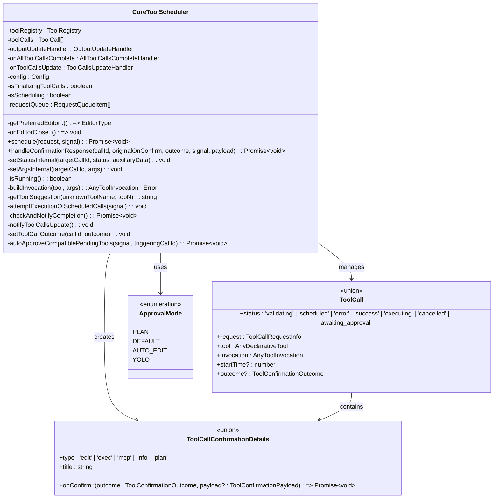

# 审批机制

<cite>
**本文档引用的文件**
- [coreToolScheduler.ts](file://packages/core/src/core/coreToolScheduler.ts)
- [coreToolScheduler.test.ts](file://packages/core/src/core/coreToolScheduler.test.ts)
- [modifiable-tool.ts](file://packages/core/src/tools/modifiable-tool.ts)
- [tools.ts](file://packages/core/src/tools/tools.ts)
- [shell.ts](file://packages/core/src/tools/shell.ts)
- [config.ts](file://packages/core/src/config/config.ts)
- [tool-call-decision.ts](file://packages/core/src/telemetry/tool-call-decision.ts)
- [approvalModeCommand.ts](file://packages/cli/src/ui/commands/approvalModeCommand.ts)
</cite>

## 目录
1. [概述](#概述)
2. [审批模式架构](#审批模式架构)
3. [CoreToolScheduler核心组件](#coretoolscheduler核心组件)
4. [三种审批模式详解](#三种审批模式详解)
5. [shouldConfirmExecute方法分析](#shouldconfirmexecute方法分析)
6. [用户确认流程](#用户确认流程)
7. [编辑工具内联修改机制](#编辑工具内联修改机制)
8. [自动批准兼容工具调用](#自动批准兼容工具调用)
9. [故障排除指南](#故障排除指南)
10. [总结](#总结)

## 概述

CoreToolScheduler是Qwen代码助手的核心组件，负责管理所有工具调用的生命周期，包括审批机制的实现。该系统提供了四种不同的审批模式：PLAN（计划模式）、YOLO（一键通过模式）、AUTO_EDIT（自动编辑模式）和DEFAULT（默认模式），每种模式都有其特定的安全级别和用户体验。

审批机制的核心功能包括：
- 根据配置的审批模式决定是否需要用户确认
- 处理不同类型的工具调用（编辑、执行、搜索等）
- 提供用户友好的确认界面
- 支持内联修改和外部编辑器集成
- 自动批准兼容的工具调用

## 审批模式架构


**图表来源**
- [config.ts](file://packages/core/src/config/config.ts#L60-L64)
- [tools.ts](file://packages/core/src/tools/tools.ts#L540-L546)

**章节来源**
- [config.ts](file://packages/core/src/config/config.ts#L60-L64)
- [approvalModeCommand.ts](file://packages/cli/src/ui/commands/approvalModeCommand.ts#L170-L222)

## CoreToolScheduler核心组件

CoreToolScheduler类是整个审批机制的核心控制器，负责管理工具调用的整个生命周期。



**图表来源**
- [coreToolScheduler.ts](file://packages/core/src/core/coreToolScheduler.ts#L255-L281)
- [tools.ts](file://packages/core/src/tools/tools.ts#L540-L546)

**章节来源**
- [coreToolScheduler.ts](file://packages/core/src/core/coreToolScheduler.ts#L255-L281)
- [tools.ts](file://packages/core/src/tools/tools.ts#L1-L50)

## 三种审批模式详解

### PLAN模式 - 计划模式

PLAN模式是最严格的安全控制模式，专门用于防止危险操作。在这种模式下，只有只读工具可以正常执行，其他所有写入或执行操作都会被阻止。


**图表来源**
- [coreToolScheduler.ts](file://packages/core/src/core/coreToolScheduler.ts#L380-L390)

### YOLO模式 - 一键通过模式

YOLO模式提供最宽松的安全控制，允许所有工具调用无需用户确认即可执行。这种模式适合高度信任的环境。


**图表来源**
- [coreToolScheduler.ts](file://packages/core/src/core/coreToolScheduler.ts#L391-L395)

### DEFAULT模式 - 默认模式

DEFAULT模式提供平衡的安全性和用户体验，在需要时提示用户确认，但不会强制每次操作都需要确认。


**图表来源**
- [coreToolScheduler.ts](file://packages/core/src/core/coreToolScheduler.ts#L396-L420)

**章节来源**
- [coreToolScheduler.ts](file://packages/core/src/core/coreToolScheduler.ts#L380-L420)
- [config.ts](file://packages/core/src/config/config.ts#L60-L64)

## shouldConfirmExecute方法分析

shouldConfirmExecute方法是每个工具的核心确认逻辑，它决定了工具调用是否需要用户确认。

### 方法签名和返回值

```typescript
shouldConfirmExecute(
  abortSignal: AbortSignal,
): Promise<ToolCallConfirmationDetails | false>
```

该方法返回两种可能的结果：
- `false`: 表示不需要确认，可以直接执行
- `ToolCallConfirmationDetails`: 包含确认详情的对象，需要用户交互

### 不同工具类型的确认逻辑

#### 编辑工具确认


**图表来源**
- [shell.ts](file://packages/core/src/tools/shell.ts#L86-L128)
- [modifiable-tool.ts](file://packages/core/src/tools/modifiable-tool.ts#L1-L50)

#### Shell命令确认

Shell工具实现了复杂的命令权限检查：

```typescript
override async shouldConfirmExecute(
  _abortSignal: AbortSignal,
): Promise<ToolCallConfirmationDetails | false> {
  const command = stripShellWrapper(this.params.command);
  const rootCommands = [...new Set(getCommandRoots(command))];
  const commandsToConfirm = rootCommands.filter(
    (command) => !this.allowlist.has(command),
  );

  if (commandsToConfirm.length === 0) {
    return false; // 已批准且白名单
  }

  const permissionCheck = isCommandNeedsPermission(command);
  if (!permissionCheck.requiresPermission) {
    return false;
  }

  const confirmationDetails: ToolExecuteConfirmationDetails = {
    type: 'exec',
    title: 'Confirm Shell Command',
    command: this.params.command,
    rootCommand: commandsToConfirm.join(', '),
    onConfirm: async (outcome: ToolConfirmationOutcome) => {
      if (outcome === ToolConfirmationOutcome.ProceedAlways) {
        commandsToConfirm.forEach((command) => this.allowlist.add(command));
      }
    },
  };
  return confirmationDetails;
}
```

**章节来源**
- [shell.ts](file://packages/core/src/tools/shell.ts#L40-L128)
- [coreToolScheduler.ts](file://packages/core/src/core/coreToolScheduler.ts#L380-L420)

## 用户确认流程

### 确认对话框触发机制

当工具调用需要用户确认时，系统会触发相应的确认对话框。确认流程包括以下步骤：


**图表来源**
- [coreToolScheduler.ts](file://packages/core/src/core/coreToolScheduler.ts#L700-L800)

### 确认结果处理

系统支持多种确认结果，每种结果对应不同的处理逻辑：


**图表来源**
- [tools.ts](file://packages/core/src/tools/tools.ts#L540-L546)
- [tool-call-decision.ts](file://packages/core/src/telemetry/tool-call-decision.ts#L0-L31)

**章节来源**
- [coreToolScheduler.ts](file://packages/core/src/core/coreToolScheduler.ts#L700-L800)
- [tools.ts](file://packages/core/src/tools/tools.ts#L540-L546)

## 编辑工具内联修改机制

对于支持修改的工具（如编辑文件），系统提供了强大的内联修改功能，允许用户直接在界面上修改提案内容。

### ModifyWithEditor工作流程


**图表来源**
- [coreToolScheduler.ts](file://packages/core/src/core/coreToolScheduler.ts#L800-L850)
- [modifiable-tool.ts](file://packages/core/src/tools/modifiable-tool.ts#L120-L175)

### 内联修改的具体实现

内联修改功能通过以下步骤实现：

1. **内容获取**: 从工具上下文中获取当前内容和建议修改内容
2. **差异生成**: 使用diff库生成差异对比
3. **用户编辑**: 在界面上展示差异并允许用户编辑
4. **参数更新**: 将用户修改应用到工具参数
5. **重新调度**: 重新调度工具调用以应用修改

```typescript
private async _applyInlineModify(
  toolCall: WaitingToolCall,
  payload: ToolConfirmationPayload,
  signal: AbortSignal,
): Promise<void> {
  if (
    toolCall.confirmationDetails.type !== 'edit' ||
    !isModifiableDeclarativeTool(toolCall.tool)
  ) {
    return;
  }

  const modifyContext = toolCall.tool.getModifyContext(signal);
  const currentContent = await modifyContext.getCurrentContent(
    toolCall.request.args,
  );

  const updatedParams = modifyContext.createUpdatedParams(
    currentContent,
    payload.newContent,
    toolCall.request.args,
  );
  const updatedDiff = Diff.createPatch(
    modifyContext.getFilePath(toolCall.request.args),
    currentContent,
    payload.newContent,
    'Current',
    'Proposed',
  );

  this.setArgsInternal(toolCall.request.callId, updatedParams);
  this.setStatusInternal(toolCall.request.callId, 'awaiting_approval', {
    ...toolCall.confirmationDetails,
    fileDiff: updatedDiff,
  });
}
```

**章节来源**
- [coreToolScheduler.ts](file://packages/core/src/core/coreToolScheduler.ts#L800-L850)
- [modifiable-tool.ts](file://packages/core/src/tools/modifiable-tool.ts#L120-L175)

## 自动批准兼容工具调用

系统实现了智能的自动批准机制，当用户批准某个工具调用时，可以自动批准同一会话中其他兼容的工具调用。

### 自动批准算法


**图表来源**
- [coreToolScheduler.ts](file://packages/core/src/core/coreToolScheduler.ts#L950-L1000)

### 兼容性检查逻辑

```typescript
private async autoApproveCompatiblePendingTools(
  signal: AbortSignal,
  triggeringCallId: string,
): Promise<void> {
  const pendingTools = this.toolCalls.filter(
    (call) =>
      call.status === 'awaiting_approval' &&
      call.request.callId !== triggeringCallId,
  ) as WaitingToolCall[];

  for (const pendingTool of pendingTools) {
    try {
      const stillNeedsConfirmation =
        await pendingTool.invocation.shouldConfirmExecute(signal);

      if (!stillNeedsConfirmation) {
        this.setToolCallOutcome(
          pendingTool.request.callId,
          ToolConfirmationOutcome.ProceedAlways,
        );
        this.setStatusInternal(pendingTool.request.callId, 'scheduled');
      }
    } catch (error) {
      console.error(
        `Error checking confirmation for tool ${pendingTool.request.callId}:`,
        error,
      );
    }
  }
}
```

**章节来源**
- [coreToolScheduler.ts](file://packages/core/src/core/coreToolScheduler.ts#L950-L1000)

## 故障排除指南

### 常见问题和解决方案

#### 1. 工具调用被意外阻止

**症状**: 工具调用显示"已取消"或"未允许工具调用"

**原因**: 当前审批模式过于严格，或者工具不在允许列表中

**解决方案**:
- 检查当前审批模式: `/approval-mode`
- 调整审批模式到更宽松的级别
- 添加工具到允许列表
- 检查文件夹信任设置

#### 2. 编辑工具无法修改文件

**症状**: 编辑工具显示确认对话框但无法修改

**原因**: 文件路径不正确或权限不足

**解决方案**:
- 确保使用绝对路径
- 检查文件权限
- 验证文件是否在工作目录范围内
- 检查IDE模式设置

#### 3. 外部编辑器无法启动

**症状**: 选择"修改与外部编辑器"但编辑器未启动

**原因**: 编辑器配置问题或路径不存在

**解决方案**:
- 检查编辑器配置
- 验证编辑器可执行文件路径
- 确保编辑器支持差异对比功能
- 检查操作系统权限

### 调试技巧

1. **启用调试模式**: 设置`DEBUG=true`环境变量
2. **检查日志输出**: 查看详细的工具调用日志
3. **验证配置**: 确认审批模式和工具配置正确
4. **测试简单场景**: 从简单的只读工具开始测试

**章节来源**
- [coreToolScheduler.ts](file://packages/core/src/core/coreToolScheduler.ts#L1000-L1055)
- [config.ts](file://packages/core/src/config/config.ts#L60-L64)

## 总结

CoreToolScheduler的审批机制是一个设计精良的安全系统，它在保证安全性的同时提供了灵活的用户体验。通过四种不同的审批模式，系统能够适应各种安全需求和使用场景。

### 主要特性总结

1. **多模式支持**: PLAN、YOLO、AUTO_EDIT、DEFAULT四种模式满足不同安全需求
2. **智能确认**: shouldConfirmExecute方法提供细粒度的确认控制
3. **内联修改**: 支持直接在界面上修改提案内容
4. **自动批准**: 智能识别兼容工具并自动批准
5. **外部编辑器集成**: 支持VS Code、Vim等主流编辑器
6. **实时反馈**: 提供详细的工具调用状态和进度反馈

### 最佳实践建议

1. **开发环境**: 使用AUTO_EDIT或YOLO模式提高效率
2. **生产环境**: 使用PLAN模式确保安全性
3. **团队协作**: 根据团队安全政策选择合适的审批模式
4. **定期审查**: 定期检查工具调用记录和审批策略
5. **用户培训**: 确保用户了解不同审批模式的含义和影响

这个审批机制的设计体现了现代软件工具在安全性和易用性之间的平衡，为用户提供了一个既安全又高效的开发体验。