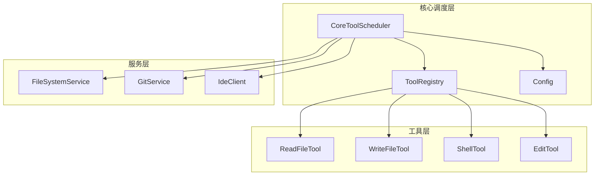
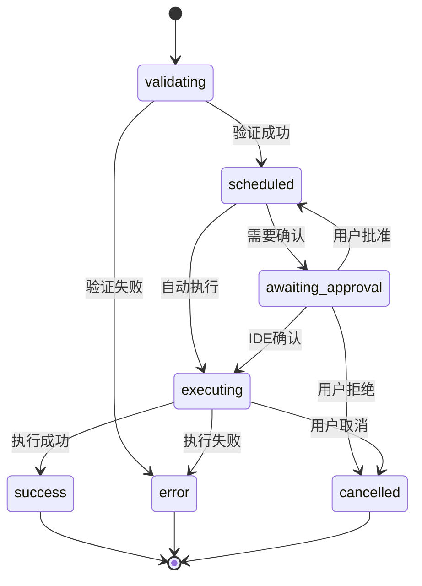
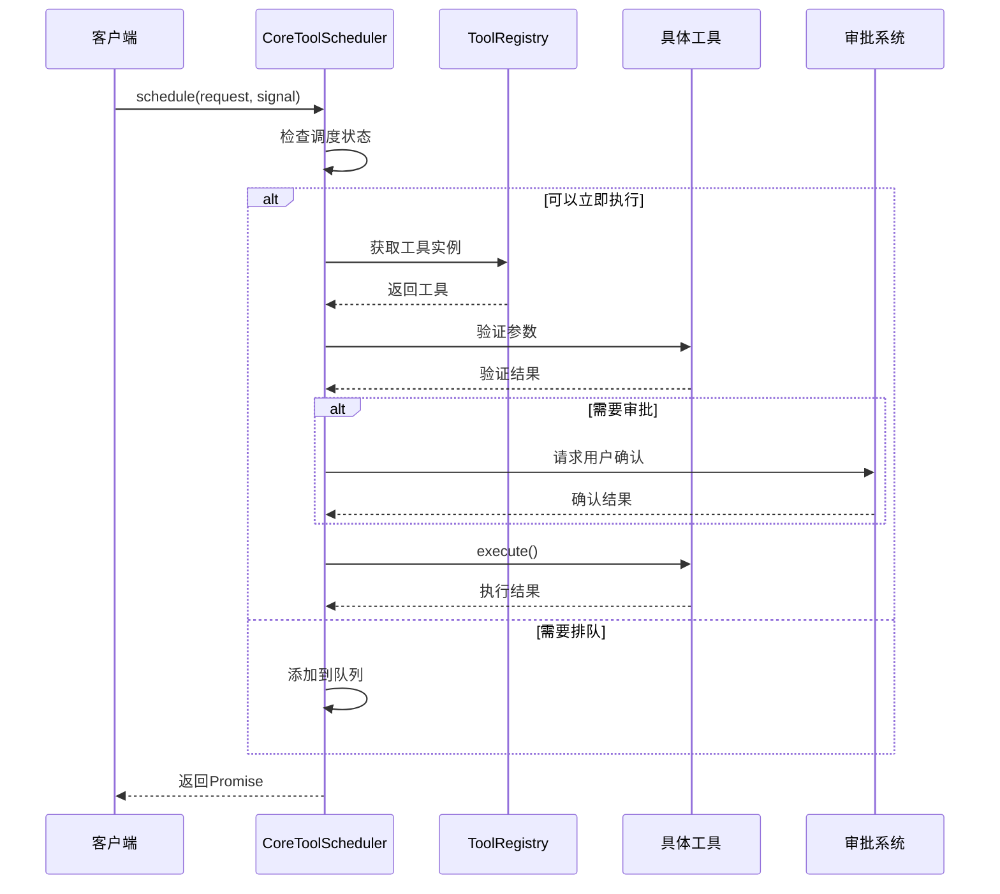
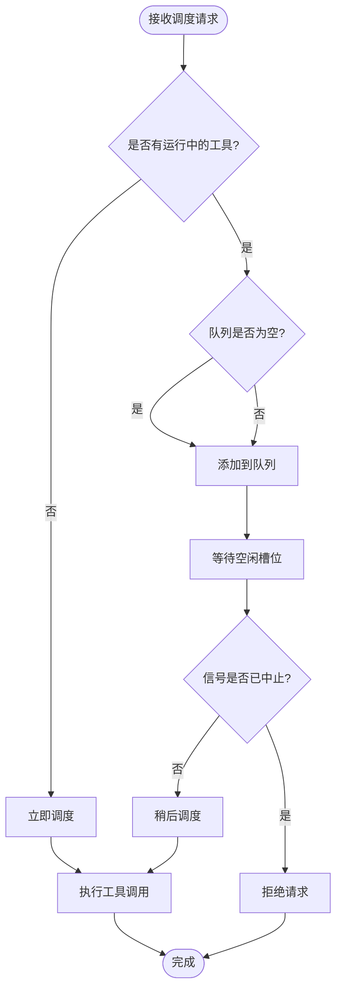
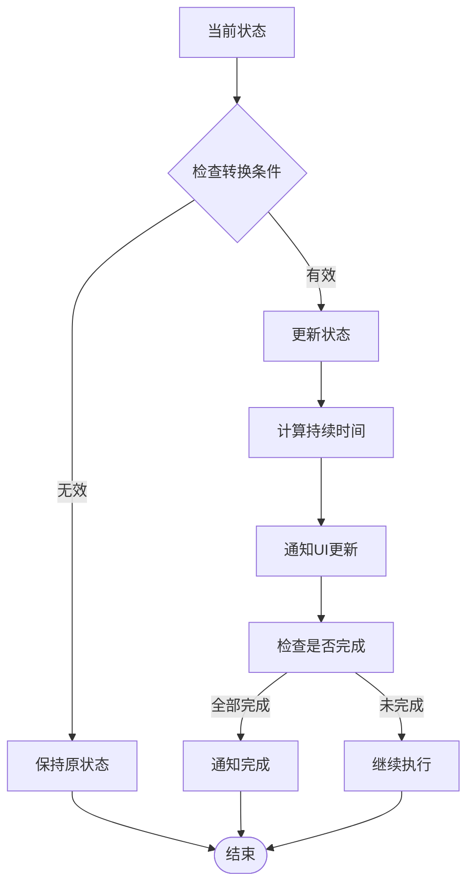
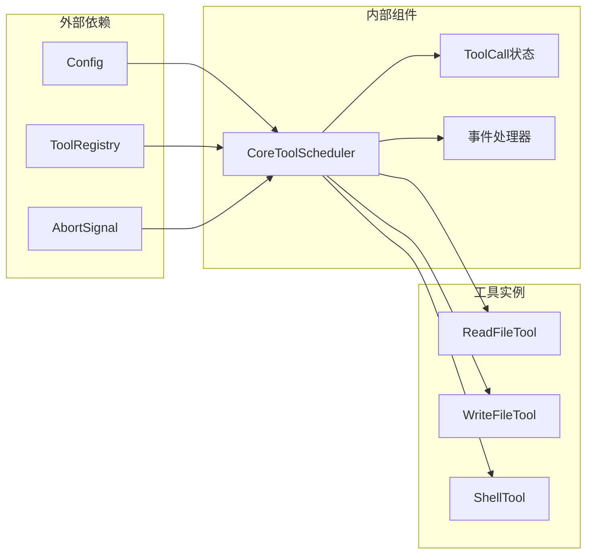

# 工具调度器架构设计与执行流程

<cite>
**本文档中引用的文件**
- [coreToolScheduler.ts](file://packages/core/src/core/coreToolScheduler.ts)
- [coreToolScheduler.test.ts](file://packages/core/src/core/coreToolScheduler.test.ts)
- [tools.ts](file://packages/core/src/tools/tools.ts)
- [read-file.ts](file://packages/core/src/tools/read-file.ts)
- [config.ts](file://packages/core/src/config/config.ts)
- [approvalModeCommand.ts](file://packages/cli/src/ui/commands/approvalModeCommand.ts)
</cite>

## 目录
1. [简介](#简介)
2. [项目结构概览](#项目结构概览)
3. [核心组件分析](#核心组件分析)
4. [架构概览](#架构概览)
5. [详细组件分析](#详细组件分析)
6. [依赖关系分析](#依赖关系分析)
7. [性能考虑](#性能考虑)
8. [故障排除指南](#故障排除指南)
9. [结论](#结论)

## 简介

CoreToolScheduler是Qwen代码助手系统中的核心组件，负责管理工具调用的完整生命周期。它实现了复杂的调度、验证、审批和执行机制，确保工具调用的安全性和可控性。该调度器支持多种审批模式，包括计划模式（PLAN）、自动审批和用户确认流程，并提供了强大的错误处理和结果回调机制。

## 项目结构概览

CoreToolScheduler位于`packages/core/src/core/`目录下，是整个系统的核心调度组件。它与其他模块紧密集成，包括工具注册表、配置管理、文件服务和IDE集成。



**图表来源**
- [coreToolScheduler.ts](file://packages/core/src/core/coreToolScheduler.ts#L255-L281)
- [config.ts](file://packages/core/src/config/config.ts#L1-L50)

## 核心组件分析

### CoreToolScheduler类结构

CoreToolScheduler是一个状态机驱动的调度器，管理着工具调用的完整生命周期。它维护一个内部状态数组，跟踪每个工具调用的状态变化。

```typescript
export class CoreToolScheduler {
  private toolCalls: ToolCall[] = [];
  private requestQueue: Array<{
    request: ToolCallRequestInfo | ToolCallRequestInfo[];
    signal: AbortSignal;
    resolve: () => void;
    reject: (reason?: Error) => void;
  }> = [];
  
  private isFinalizingToolCalls = false;
  private isScheduling = false;
}
```

### 工具调用状态类型

调度器定义了七种不同的工具调用状态：



**图表来源**
- [coreToolScheduler.ts](file://packages/core/src/core/coreToolScheduler.ts#L25-L114)

**章节来源**
- [coreToolScheduler.ts](file://packages/core/src/core/coreToolScheduler.ts#L255-L281)
- [coreToolScheduler.ts](file://packages/core/src/core/coreToolScheduler.ts#L25-L114)

## 架构概览

CoreToolScheduler采用事件驱动的架构模式，通过状态机管理工具调用的生命周期。整个系统的设计遵循以下原则：

1. **异步非阻塞**：所有工具调用都是异步执行，不会阻塞主线程
2. **状态隔离**：每个工具调用都有独立的状态，互不干扰
3. **可扩展性**：支持动态添加新工具和审批模式
4. **安全性**：通过多层验证和审批机制确保安全



**图表来源**
- [coreToolScheduler.ts](file://packages/core/src/core/coreToolScheduler.ts#L400-L500)
- [coreToolScheduler.ts](file://packages/core/src/core/coreToolScheduler.ts#L850-L950)

## 详细组件分析

### 调度器初始化与配置

CoreToolScheduler在初始化时接收多个回调函数，用于处理不同阶段的通知：

```typescript
constructor(options: CoreToolSchedulerOptions) {
  this.config = options.config;
  this.toolRegistry = options.config.getToolRegistry();
  this.outputUpdateHandler = options.outputUpdateHandler;
  this.onAllToolCallsComplete = options.onAllToolCallsComplete;
  this.onToolCallsUpdate = options.onToolCallsUpdate;
  this.getPreferredEditor = options.getPreferredEditor;
  this.onEditorClose = options.onEditorClose;
}
```

### 请求队列机制

调度器实现了智能的请求队列机制，支持并发控制和取消操作：



**图表来源**
- [coreToolScheduler.ts](file://packages/core/src/core/coreToolScheduler.ts#L400-L450)

### 审批机制实现

审批机制是CoreToolScheduler的核心功能之一，支持三种主要模式：

#### 1. 计划模式（PLAN）
在计划模式下，只有只读工具可以执行，写入操作需要特殊许可：

```typescript
const isPlanMode = this.config.getApprovalMode() === ApprovalMode.PLAN;
const isExitPlanModeTool = reqInfo.name === 'exit_plan_mode';

if (isPlanMode && !isExitPlanModeTool) {
  if (confirmationDetails) {
    this.setStatusInternal(reqInfo.callId, 'error', {
      callId: reqInfo.callId,
      responseParts: convertToFunctionResponse(
        reqInfo.name,
        reqInfo.callId,
        getPlanModeSystemReminder(),
      ),
      resultDisplay: 'Plan mode blocked a non-read-only tool call.',
      error: undefined,
      errorType: undefined,
    });
  }
}
```

#### 2. 自动审批模式
在AUTO_EDIT模式下，不需要用户确认即可执行工具：

```typescript
if (this.config.getApprovalMode() === ApprovalMode.AUTO_EDIT) {
  return false; // 不需要确认
}
```

#### 3. 用户确认流程
对于需要用户确认的工具，调度器会显示确认对话框：

```typescript
const confirmationDetails = await invocation.shouldConfirmExecute(signal);
if (confirmationDetails) {
  // 显示确认界面并等待用户响应
  this.setStatusInternal(reqInfo.callId, 'awaiting_approval', confirmationDetails);
}
```

### 状态转换逻辑

状态转换是通过`setStatusInternal`方法实现的，该方法确保状态转换的原子性和一致性：



**图表来源**
- [coreToolScheduler.ts](file://packages/core/src/core/coreToolScheduler.ts#L300-L400)

### 错误处理与恢复

调度器实现了多层次的错误处理机制：

1. **参数验证错误**：在工具调用前捕获参数错误
2. **执行时错误**：在工具执行过程中捕获异常
3. **网络错误**：处理网络连接问题
4. **超时处理**：处理长时间无响应的情况

```typescript
try {
  const toolResult = await invocation.execute(signal, liveOutputCallback);
  if (toolResult.error === undefined) {
    // 处理成功结果
  } else {
    // 处理执行错误
  }
} catch (executionError) {
  this.setStatusInternal(
    callId,
    'error',
    createErrorResponse(
      scheduledCall.request,
      executionError instanceof Error ? executionError : new Error(String(executionError)),
      ToolErrorType.UNHANDLED_EXCEPTION,
    ),
  );
}
```

**章节来源**
- [coreToolScheduler.ts](file://packages/core/src/core/coreToolScheduler.ts#L400-L600)
- [coreToolScheduler.ts](file://packages/core/src/core/coreToolScheduler.ts#L850-L950)

### 结果聚合与回调

当所有工具调用完成后，调度器会触发完成回调并聚合结果：

```typescript
private async checkAndNotifyCompletion(): Promise<void> {
  const allCallsAreTerminal = this.toolCalls.every(
    (call) => call.status === 'success' || call.status === 'error' || call.status === 'cancelled'
  );

  if (this.toolCalls.length > 0 && allCallsAreTerminal) {
    const completedCalls = [...this.toolCalls] as CompletedToolCall[];
    this.toolCalls = [];

    // 记录工具调用事件
    for (const call of completedCalls) {
      logToolCall(this.config, new ToolCallEvent(call));
    }

    // 触发完成回调
    if (this.onAllToolCallsComplete) {
      this.isFinalizingToolCalls = true;
      await this.onAllToolCallsComplete(completedCalls);
      this.isFinalizingToolCalls = false;
    }
    
    // 处理队列中的下一个请求
    if (this.requestQueue.length > 0) {
      const next = this.requestQueue.shift()!;
      this._schedule(next.request, next.signal)
        .then(next.resolve)
        .catch(next.reject);
    }
  }
}
```

**章节来源**
- [coreToolScheduler.ts](file://packages/core/src/core/coreToolScheduler.ts#L950-L1000)

## 依赖关系分析

CoreToolScheduler与多个系统组件存在密切的依赖关系：



**图表来源**
- [coreToolScheduler.ts](file://packages/core/src/core/coreToolScheduler.ts#L255-L281)
- [tools.ts](file://packages/core/src/tools/tools.ts#L1-L50)

### 关键依赖说明

1. **Config**：提供全局配置和工具注册表访问
2. **ToolRegistry**：管理所有可用工具的注册和查找
3. **AbortSignal**：支持工具调用的取消操作
4. **事件处理器**：处理状态更新和完成通知

**章节来源**
- [coreToolScheduler.ts](file://packages/core/src/core/coreToolScheduler.ts#L255-L281)
- [config.ts](file://packages/core/src/config/config.ts#L1-L100)

## 性能考虑

CoreToolScheduler在设计时充分考虑了性能优化：

### 并发控制
- 支持多个工具调用同时进行
- 使用请求队列避免资源竞争
- 实现智能的调度算法

### 内存管理
- 及时清理已完成的工具调用
- 使用弱引用避免内存泄漏
- 实现状态快照机制

### 异步优化
- 全面采用异步编程模型
- 使用Promise链式调用
- 实现背压控制机制

## 故障排除指南

### 常见问题与解决方案

#### 1. 工具调用被意外取消
**症状**：工具调用状态变为"cancelled"
**原因**：AbortSignal被触发或用户取消
**解决**：检查信号源和用户交互

#### 2. 审批循环问题
**症状**：工具调用卡在"awaiting_approval"状态
**原因**：审批流程未正确完成
**解决**：检查审批回调函数的实现

#### 3. 内存泄漏
**症状**：长时间运行后内存占用持续增长
**原因**：工具调用状态未正确清理
**解决**：确保在完成回调中清理状态

### 调试技巧

1. **启用调试模式**：设置`debugMode: true`获取详细日志
2. **监控状态变化**：使用`onToolCallsUpdate`回调观察状态转换
3. **检查配置**：验证审批模式和工具权限设置

**章节来源**
- [coreToolScheduler.ts](file://packages/core/src/core/coreToolScheduler.ts#L950-L1000)
- [coreToolScheduler.test.ts](file://packages/core/src/core/coreToolScheduler.test.ts#L1-L100)

## 结论

CoreToolScheduler是一个设计精良的工具调度系统，它成功地平衡了功能性、安全性和性能。通过状态机驱动的架构、灵活的审批机制和强大的错误处理能力，它为Qwen代码助手提供了可靠的工具执行基础。

该调度器的主要优势包括：
- **高度可配置**：支持多种审批模式和自定义策略
- **强大的错误处理**：多层次的异常捕获和恢复机制
- **优秀的并发支持**：高效的队列管理和状态同步
- **良好的扩展性**：清晰的接口设计便于添加新功能

未来的发展方向可能包括：
- 更智能的工具推荐机制
- 更精细的权限控制
- 更丰富的监控和诊断功能
- 更好的跨平台兼容性