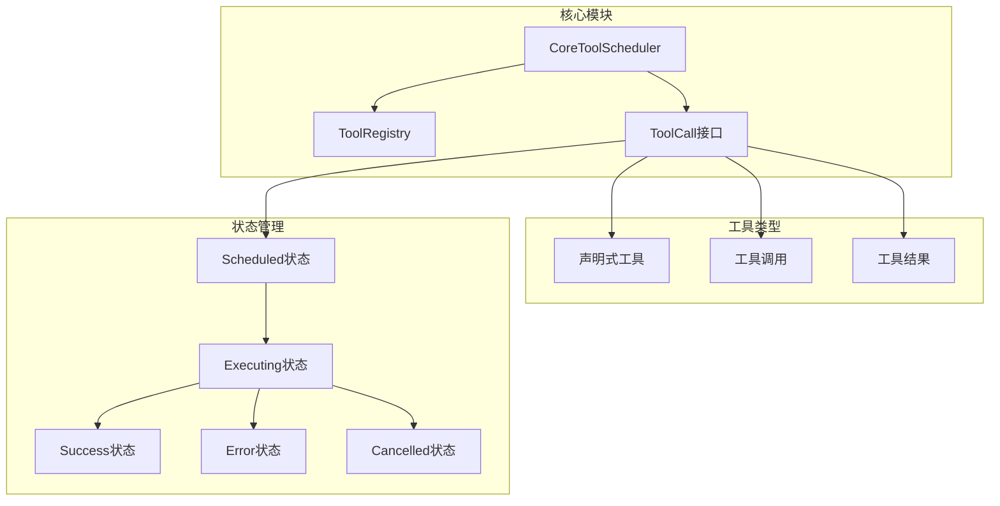
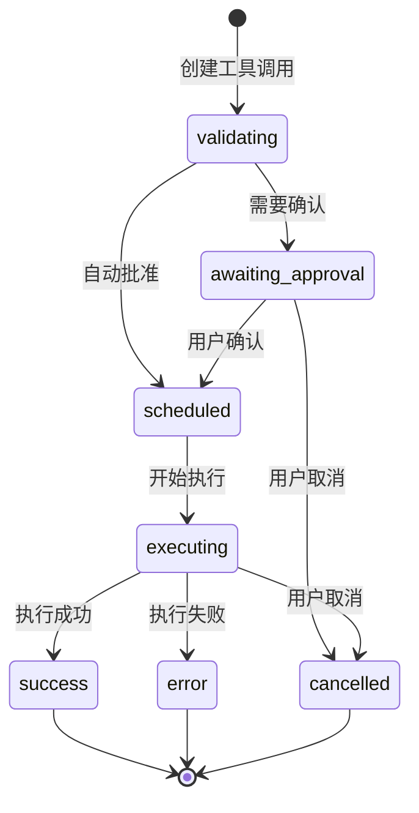
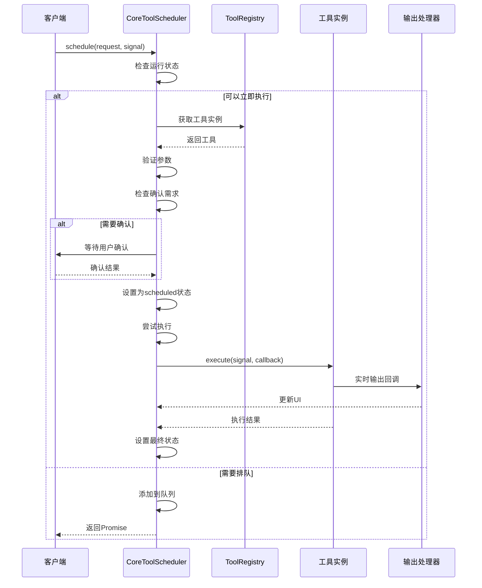
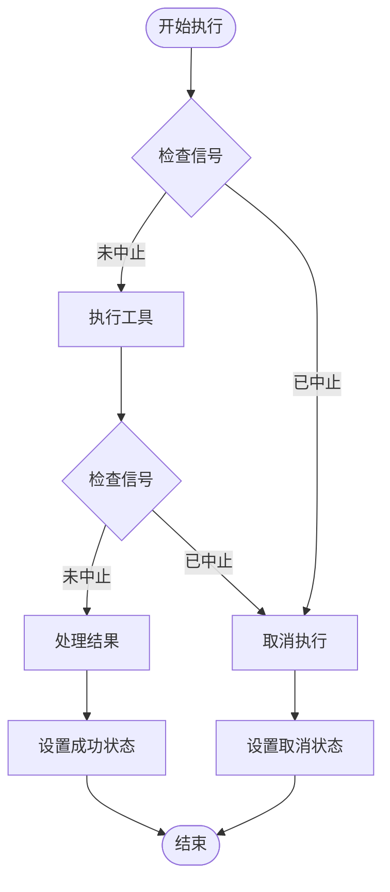
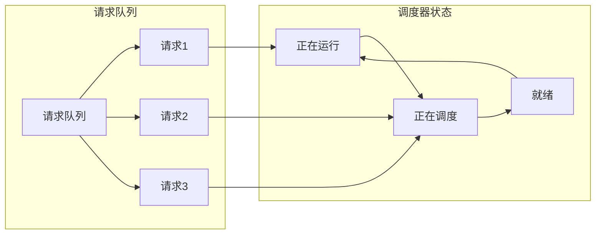
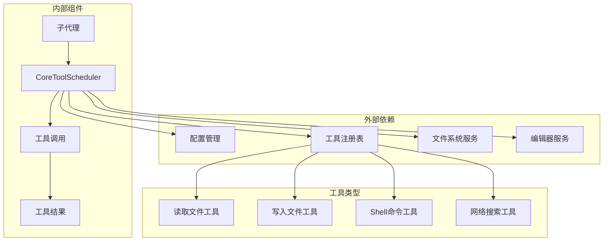

# 执行调度

<cite>
**本文档中引用的文件**
- [coreToolScheduler.ts](file://packages/core/src/core/coreToolScheduler.ts)
- [coreToolScheduler.test.ts](file://packages/core/src/core/coreToolScheduler.test.ts)
- [subagent.ts](file://packages/core/src/subagents/subagent.ts)
- [tools.ts](file://packages/core/src/tools/tools.ts)
- [read-file.ts](file://packages/core/src/tools/read-file.ts)
</cite>

## 目录
1. [简介](#简介)
2. [项目结构](#项目结构)
3. [核心组件](#核心组件)
4. [架构概览](#架构概览)
5. [详细组件分析](#详细组件分析)
6. [依赖关系分析](#依赖关系分析)
7. [性能考虑](#性能考虑)
8. [故障排除指南](#故障排除指南)
9. [结论](#结论)

## 简介

CoreToolScheduler是Qwen Code项目中的核心组件，负责管理工具调用的完整生命周期。该调度器实现了从工具注册、验证、确认到执行的完整流程，并提供了强大的状态管理和错误处理机制。

本文档深入分析了从'scheduled'状态到'executing'状态的转换过程，包括execute方法的调用机制、AbortSignal的传递方式以及实时输出回调（liveOutputCallback）的实现。同时详细解释了工具执行结果的处理逻辑，成功时如何生成ToolCallResponseInfo，失败时如何捕获和包装错误。

## 项目结构

CoreToolScheduler位于packages/core/src/core目录下，是整个系统的核心调度组件：



**图表来源**
- [coreToolScheduler.ts](file://packages/core/src/core/coreToolScheduler.ts#L255-L281)
- [tools.ts](file://packages/core/src/tools/tools.ts#L1-L50)

**章节来源**
- [coreToolScheduler.ts](file://packages/core/src/core/coreToolScheduler.ts#L1-L100)

## 核心组件

### CoreToolScheduler类

CoreToolScheduler是整个工具调度系统的核心，负责管理所有工具调用的状态转换和执行流程：

```typescript
export class CoreToolScheduler {
  private toolRegistry: ToolRegistry;
  private toolCalls: ToolCall[] = [];
  private outputUpdateHandler?: OutputUpdateHandler;
  private onAllToolCallsComplete?: AllToolCallsCompleteHandler;
  private onToolCallsUpdate?: ToolCallsUpdateHandler;
  private getPreferredEditor: () => EditorType | undefined;
  private config: Config;
  private onEditorClose: () => void;
  private isFinalizingToolCalls = false;
  private isScheduling = false;
  private requestQueue: Array<{
    request: ToolCallRequestInfo | ToolCallRequestInfo[];
    signal: AbortSignal;
    resolve: () => void;
    reject: (reason?: Error) => void;
  }> = [];
}
```

### 工具调用状态

系统支持多种工具调用状态，每种状态都有特定的含义和处理逻辑：



**图表来源**
- [coreToolScheduler.ts](file://packages/core/src/core/coreToolScheduler.ts#L56-L114)

**章节来源**
- [coreToolScheduler.ts](file://packages/core/src/core/coreToolScheduler.ts#L255-L300)

## 架构概览

CoreToolScheduler采用事件驱动的架构模式，通过状态机管理工具调用的完整生命周期：



**图表来源**
- [coreToolScheduler.ts](file://packages/core/src/core/coreToolScheduler.ts#L650-L750)
- [subagent.ts](file://packages/core/src/subagents/subagent.ts#L550-L650)

## 详细组件分析

### 状态转换机制

#### 从Scheduled到Executing的转换

当工具调用被标记为'scheduled'状态后，系统会尝试将其转换为'executing'状态：

```typescript
private attemptExecutionOfScheduledCalls(signal: AbortSignal): void {
  const allCallsFinalOrScheduled = this.toolCalls.every(
    (call) =>
      call.status === 'scheduled' ||
      call.status === 'cancelled' ||
      call.status === 'success' ||
      call.status === 'error',
  );

  if (allCallsFinalOrScheduled) {
    const callsToExecute = this.toolCalls.filter(
      (call) => call.status === 'scheduled',
    );

    callsToExecute.forEach((toolCall) => {
      if (toolCall.status !== 'scheduled') return;

      const scheduledCall = toolCall;
      const { callId, name: toolName } = scheduledCall.request;
      const invocation = scheduledCall.invocation;
      this.setStatusInternal(callId, 'executing');

      const liveOutputCallback = scheduledCall.tool.canUpdateOutput
        ? (outputChunk: ToolResultDisplay) => {
            if (this.outputUpdateHandler) {
              this.outputUpdateHandler(callId, outputChunk);
            }
            this.toolCalls = this.toolCalls.map((tc) =>
              tc.request.callId === callId && tc.status === 'executing'
                ? { ...tc, liveOutput: outputChunk }
                : tc,
            );
            this.notifyToolCallsUpdate();
          }
        : undefined;

      invocation
        .execute(signal, liveOutputCallback)
        .then(async (toolResult: ToolResult) => {
          // 处理执行结果...
        })
        .catch((executionError: Error) => {
          // 处理执行错误...
        });
    });
  }
}
```

#### AbortSignal的传递机制

AbortSignal用于支持工具执行的取消操作：



**图表来源**
- [coreToolScheduler.ts](file://packages/core/src/core/coreToolScheduler.ts#L850-L950)

#### 实时输出回调机制

对于支持流式输出的工具，系统提供了实时输出回调功能：

```typescript
const liveOutputCallback = scheduledCall.tool.canUpdateOutput
  ? (outputChunk: ToolResultDisplay) => {
      if (this.outputUpdateHandler) {
        this.outputUpdateHandler(callId, outputChunk);
      }
      this.toolCalls = this.toolCalls.map((tc) =>
        tc.request.callId === callId && tc.status === 'executing'
          ? { ...tc, liveOutput: outputChunk }
          : tc,
      );
      this.notifyToolCallsUpdate();
    }
  : undefined;
```

**章节来源**
- [coreToolScheduler.ts](file://packages/core/src/core/coreToolScheduler.ts#L850-L950)

### 错误处理机制

#### 成功状态的处理

当工具执行成功时，系统会生成ToolCallResponseInfo：

```typescript
if (toolResult.error === undefined) {
  const response = convertToFunctionResponse(
    toolName,
    callId,
    toolResult.llmContent,
  );
  const successResponse: ToolCallResponseInfo = {
    callId,
    responseParts: response,
    resultDisplay: toolResult.returnDisplay,
    error: undefined,
    errorType: undefined,
  };
  this.setStatusInternal(callId, 'success', successResponse);
}
```

#### 错误状态的处理

当工具执行失败时，系统会捕获错误并包装成标准化格式：

```typescript
else {
  // It is a failure
  const error = new Error(toolResult.error.message);
  const errorResponse = createErrorResponse(
    scheduledCall.request,
    error,
    toolResult.error.type,
  );
  this.setStatusInternal(callId, 'error', errorResponse);
}
```

#### 异常处理

系统还处理执行过程中的异常情况：

```typescript
.catch((executionError: Error) => {
  this.setStatusInternal(
    callId,
    'error',
    createErrorResponse(
      scheduledCall.request,
      executionError instanceof Error
        ? executionError
        : new Error(String(executionError)),
      ToolErrorType.UNHANDLED_EXCEPTION,
    ),
  );
});
```

**章节来源**
- [coreToolScheduler.ts](file://packages/core/src/core/coreToolScheduler.ts#L900-L950)

### 队列管理机制

当有多个工具调用需要执行时，系统使用队列来管理执行顺序：



**图表来源**
- [coreToolScheduler.ts](file://packages/core/src/core/coreToolScheduler.ts#L650-L700)

**章节来源**
- [coreToolScheduler.ts](file://packages/core/src/core/coreToolScheduler.ts#L650-L750)

## 依赖关系分析

CoreToolScheduler与多个系统组件存在密切的依赖关系：



**图表来源**
- [coreToolScheduler.ts](file://packages/core/src/core/coreToolScheduler.ts#L255-L281)
- [subagent.ts](file://packages/core/src/subagents/subagent.ts#L550-L600)

**章节来源**
- [coreToolScheduler.ts](file://packages/core/src/core/coreToolScheduler.ts#L255-L300)

## 性能考虑

### 并发控制

CoreToolScheduler通过以下机制控制并发执行：

1. **单次执行限制**：同一时间只能有一个工具调用处于执行状态
2. **队列管理**：等待的请求会被放入队列，按顺序执行
3. **状态检查**：在调度新任务前检查当前状态

### 内存管理

1. **状态清理**：完成的任务会从内存中移除
2. **结果缓存**：只保留必要的执行结果信息
3. **资源释放**：及时释放不再需要的资源

### 错误恢复

1. **优雅降级**：单个工具失败不影响其他工具
2. **状态回滚**：错误发生时可以回滚到安全状态
3. **重试机制**：支持有限次数的自动重试

## 故障排除指南

### 常见问题及解决方案

#### 工具调用被意外取消

**症状**：工具调用状态变为'cancelled'

**原因**：
- AbortSignal被触发
- 超时或超时设置不当
- 系统资源不足

**解决方案**：
```typescript
// 检查AbortSignal状态
if (signal.aborted) {
  this.setStatusInternal(
    callId,
    'cancelled',
    'User cancelled tool execution.',
  );
}
```

#### 工具执行超时

**症状**：工具长时间处于'executing'状态

**解决方案**：
1. 检查工具实现是否正确处理AbortSignal
2. 增加适当的超时检查
3. 提供进度反馈

#### 内存泄漏

**症状**：长时间运行后内存使用持续增长

**解决方案**：
1. 确保完成的任务被正确清理
2. 检查事件监听器是否正确移除
3. 验证队列大小限制

**章节来源**
- [coreToolScheduler.ts](file://packages/core/src/core/coreToolScheduler.ts#L850-L950)

## 结论

CoreToolScheduler是一个设计精良的工具调度系统，具有以下特点：

1. **完整的生命周期管理**：从创建到完成的全过程跟踪
2. **强大的状态管理**：支持多种状态转换和条件判断
3. **灵活的错误处理**：多层次的错误捕获和恢复机制
4. **高效的并发控制**：避免资源竞争和死锁
5. **可扩展的架构**：支持新工具类型的无缝集成

该系统为Qwen Code项目提供了稳定可靠的工具执行基础，确保了系统的可维护性和可扩展性。通过深入理解其实现原理，开发者可以更好地利用和扩展这个强大的调度系统。