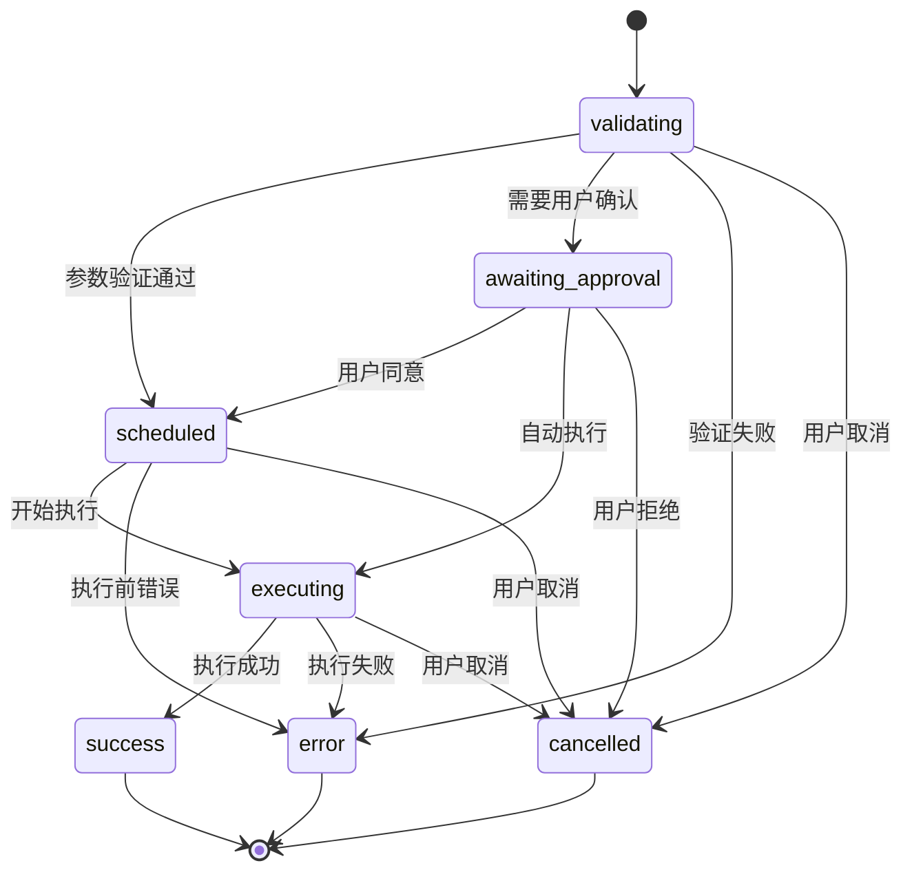
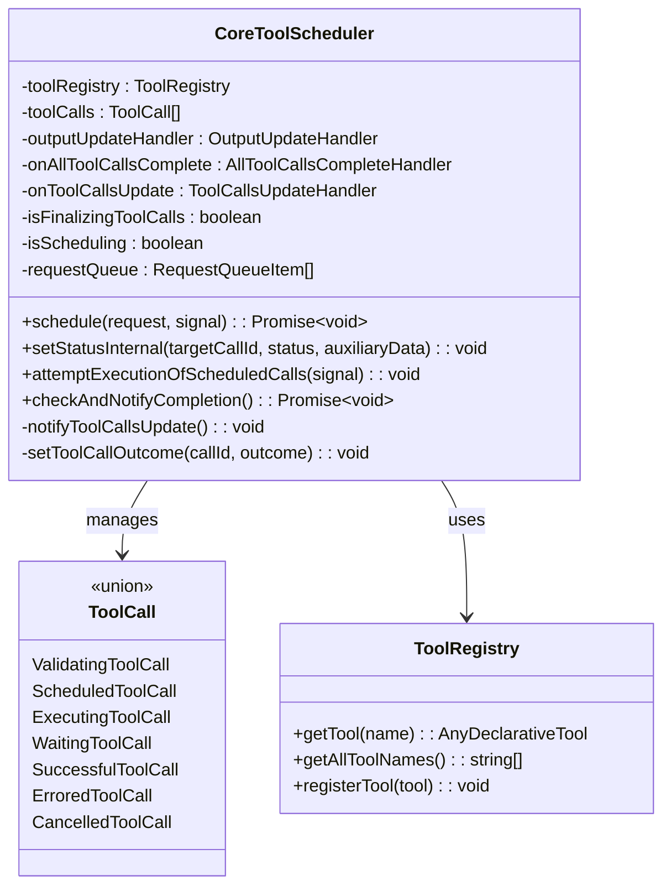
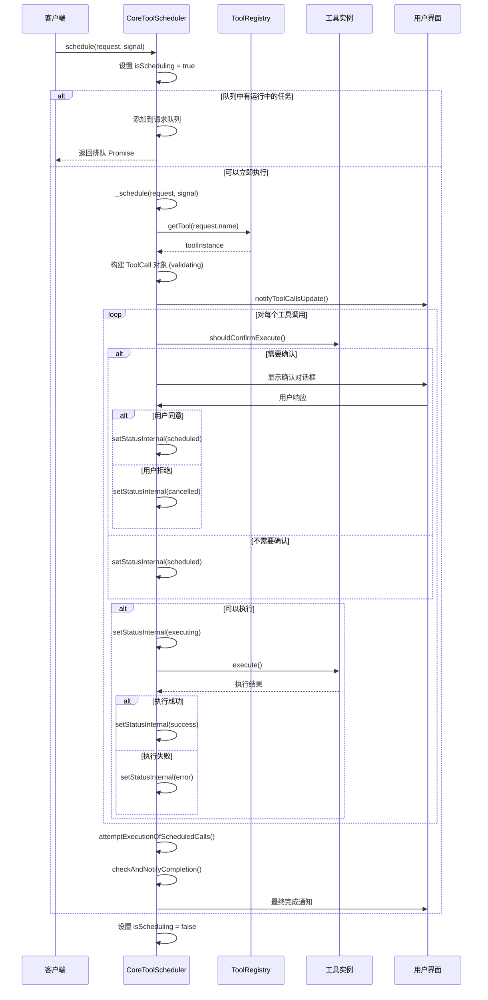
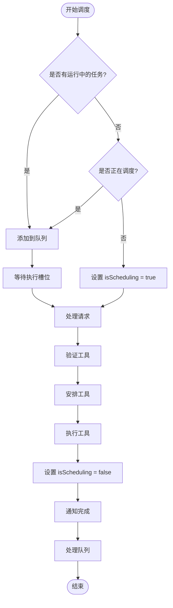
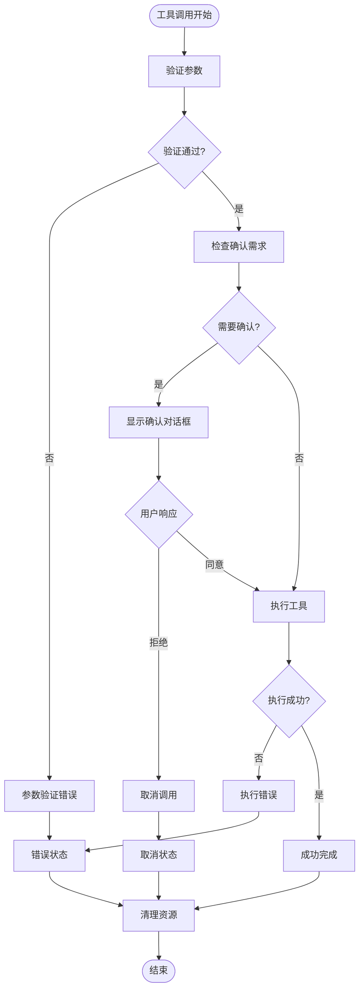

# CoreToolScheduler 状态管理系统

<cite>
**本文档引用的文件**
- [coreToolScheduler.ts](file://packages/core/src/core/coreToolScheduler.ts)
- [coreToolScheduler.test.ts](file://packages/core/src/core/coreToolScheduler.test.ts)
- [turn.ts](file://packages/core/src/core/turn.ts)
- [useReactToolScheduler.ts](file://packages/cli/src/ui/hooks/useReactToolScheduler.ts)
</cite>

## 目录
1. [简介](#简介)
2. [状态类型定义](#状态类型定义)
3. [状态转换机制](#状态转换机制)
4. [状态管理架构](#状态管理架构)
5. [核心状态转换流程](#核心状态转换流程)
6. [并发控制与原子性](#并发控制与原子性)
7. [错误处理与恢复](#错误处理与恢复)
8. [性能优化策略](#性能优化策略)
9. [故障排除指南](#故障排除指南)
10. [总结](#总结)

## 简介

CoreToolScheduler 是 Qwen Code 项目中的核心组件，负责管理和协调所有工具调用的状态转换。该系统采用状态机模式，通过严格的类型定义和原子性操作确保工具调用的可靠性和一致性。系统支持七种不同的状态：validating、scheduled、executing、awaiting_approval、success、error 和 cancelled，每种状态都有明确的转换规则和生命周期。

## 状态类型定义

### 核心状态类型

系统定义了七个主要的状态类型，每个状态都包含特定的数据结构和行为特征：

```typescript
export type ToolCall =
  | ValidatingToolCall
  | ScheduledToolCall
  | ErroredToolCall
  | SuccessfulToolCall
  | ExecutingToolCall
  | CancelledToolCall
  | WaitingToolCall;
```

### 验证中状态 (ValidatingToolCall)

```typescript
export type ValidatingToolCall = {
  status: 'validating';
  request: ToolCallRequestInfo;
  tool: AnyDeclarativeTool;
  invocation: AnyToolInvocation;
  startTime?: number;
  outcome?: ToolConfirmationOutcome;
};
```

验证中状态表示工具正在被验证其参数的有效性和可用性。此状态是工具调用生命周期的起点。

### 已调度状态 (ScheduledToolCall)

```typescript
export type ScheduledToolCall = {
  status: 'scheduled';
  request: ToolCallRequestInfo;
  tool: AnyDeclarativeTool;
  invocation: AnyToolInvocation;
  startTime?: number;
  outcome?: ToolConfirmationOutcome;
};
```

已调度状态表示工具已经通过验证并等待执行。此状态通常在不需要用户确认的情况下自动进入。

### 执行中状态 (ExecutingToolCall)

```typescript
export type ExecutingToolCall = {
  status: 'executing';
  request: ToolCallRequestInfo;
  tool: AnyDeclarativeTool;
  invocation: AnyToolInvocation;
  liveOutput?: ToolResultDisplay;
  startTime?: number;
  outcome?: ToolConfirmationOutcome;
};
```

执行中状态表示工具正在实际运行中，可能产生实时输出或进度更新。

### 待批准状态 (WaitingToolCall)

```typescript
export type WaitingToolCall = {
  status: 'awaiting_approval';
  request: ToolCallRequestInfo;
  tool: AnyDeclarativeTool;
  invocation: AnyToolInvocation;
  confirmationDetails: ToolCallConfirmationDetails;
  startTime?: number;
  outcome?: ToolConfirmationOutcome;
};
```

待批准状态表示需要用户确认才能继续执行的工具调用。此状态涉及交互式确认流程。

### 成功状态 (SuccessfulToolCall)

```typescript
export type SuccessfulToolCall = {
  status: 'success';
  request: ToolCallRequestInfo;
  tool: AnyDeclarativeTool;
  response: ToolCallResponseInfo;
  invocation: AnyToolInvocation;
  durationMs?: number;
  outcome?: ToolConfirmationOutcome;
};
```

成功状态表示工具调用已完成且没有错误。系统会记录执行时间和结果响应。

### 错误状态 (ErroredToolCall)

```typescript
export type ErroredToolCall = {
  status: 'error';
  request: ToolCallRequestInfo;
  response: ToolCallResponseInfo;
  tool?: AnyDeclarativeTool;
  durationMs?: number;
  outcome?: ToolConfirmationOutcome;
};
```

错误状态表示工具调用过程中发生错误。系统会保存错误信息和响应数据以便调试。

### 已取消状态 (CancelledToolCall)

```typescript
export type CancelledToolCall = {
  status: 'cancelled';
  request: ToolCallRequestInfo;
  response: ToolCallResponseInfo;
  tool: AnyDeclarativeTool;
  invocation: AnyToolInvocation;
  durationMs?: number;
  outcome?: ToolConfirmationOutcome;
};
```

已取消状态表示工具调用被用户或系统取消。系统会保留相关上下文信息用于显示。

**章节来源**
- [coreToolScheduler.ts](file://packages/core/src/core/coreToolScheduler.ts#L56-L114)

## 状态转换机制

### setStatusInternal 方法

`setStatusInternal` 方法是状态转换的核心机制，它确保状态转换的安全性和一致性：

```typescript
private setStatusInternal(
  targetCallId: string,
  newStatus: Status,
  auxiliaryData?: unknown,
): void {
  this.toolCalls = this.toolCalls.map((currentCall) => {
    if (
      currentCall.request.callId !== targetCallId ||
      currentCall.status === 'success' ||
      currentCall.status === 'error' ||
      currentCall.status === 'cancelled'
    ) {
      return currentCall;
    }
    
    // 状态转换逻辑...
  });
  this.notifyToolCallsUpdate();
  this.checkAndNotifyCompletion();
}
```

### 状态转换规则

状态转换遵循严格的规则以确保系统的一致性：

1. **有效状态转换**：
   - validating → scheduled/executing/awaiting_approval/error/cancelled
   - scheduled → executing/error/cancelled
   - executing → success/error/cancelled
   - awaiting_approval → scheduled/executing/cancelled
   - success/error/cancelled → 不可变

2. **不可变状态**：
   - success、error 和 cancelled 状态一旦进入就不能再改变

3. **时间戳管理**：
   - 每个非终端状态都会记录 startTime
   - 终端状态会计算 durationMs

### 状态转换图



**图表来源**
- [coreToolScheduler.ts](file://packages/core/src/core/coreToolScheduler.ts#L283-L379)

**章节来源**
- [coreToolScheduler.ts](file://packages/core/src/core/coreToolScheduler.ts#L283-L379)

## 状态管理架构

### 核心类结构



**图表来源**
- [coreToolScheduler.ts](file://packages/core/src/core/coreToolScheduler.ts#L255-L281)

### 状态持久化机制

系统使用不可变数据结构来维护状态：

```typescript
// 状态更新采用函数式编程风格
this.toolCalls = this.toolCalls.map((currentCall) => {
  if (currentCall.request.callId !== targetCallId) {
    return currentCall;
  }
  
  // 创建新的状态对象
  return {
    ...currentCall,
    status: newStatus,
    // 更新其他字段...
  };
});
```

### 事件通知机制

状态变化会触发多个级别的通知：

1. **工具调用更新**：通知 UI 层状态变化
2. **完成通知**：当所有工具调用完成时通知上层应用
3. **输出更新**：对于可更新输出的工具，实时通知输出变化

**章节来源**
- [coreToolScheduler.ts](file://packages/core/src/core/coreToolScheduler.ts#L255-L281)

## 核心状态转换流程

### 工具调用生命周期



**图表来源**
- [coreToolScheduler.ts](file://packages/core/src/core/coreToolScheduler.ts#L600-L700)

### 计划模式强制执行

系统实现了计划模式（PLAN mode）强制执行机制：

```typescript
if (isPlanMode && !isExitPlanModeTool) {
  if (confirmationDetails) {
    this.setStatusInternal(reqInfo.callId, 'error', {
      callId: reqInfo.callId,
      responseParts: convertToFunctionResponse(
        reqInfo.name,
        reqInfo.callId,
        getPlanModeSystemReminder(),
      ),
      resultDisplay: 'Plan mode blocked a non-read-only tool call.',
      error: undefined,
      errorType: undefined,
    });
  } else {
    this.setStatusInternal(reqInfo.callId, 'scheduled');
  }
}
```

### 编辑工具确认流程

对于编辑类型的工具，系统提供了复杂的确认和修改流程：

```typescript
if (confirmationDetails.type === 'edit' && confirmationDetails.ideConfirmation) {
  confirmationDetails.ideConfirmation.then((resolution) => {
    if (resolution.status === 'accepted') {
      this.handleConfirmationResponse(
        reqInfo.callId,
        confirmationDetails.onConfirm,
        ToolConfirmationOutcome.ProceedOnce,
        signal,
      );
    } else {
      this.handleConfirmationResponse(
        reqInfo.callId,
        confirmationDetails.onConfirm,
        ToolConfirmationOutcome.Cancel,
        signal,
      );
    }
  });
}
```

**章节来源**
- [coreToolScheduler.ts](file://packages/core/src/core/coreToolScheduler.ts#L600-L700)

## 并发控制与原子性

### 原子性状态更新

系统通过以下机制确保状态更新的原子性：

1. **不可变数据结构**：每次状态更新都创建新的对象
2. **条件过滤**：只更新匹配 callId 的状态
3. **状态检查**：防止终端状态的意外修改

```typescript
this.toolCalls = this.toolCalls.map((currentCall) => {
  if (
    currentCall.request.callId !== targetCallId ||
    currentCall.status === 'success' ||
    currentCall.status === 'error' ||
    currentCall.status === 'cancelled'
  ) {
    return currentCall; // 保持不变
  }
  
  // 进行状态转换...
});
```

### 并发执行控制



**图表来源**
- [coreToolScheduler.ts](file://packages/core/src/core/coreToolScheduler.ts#L500-L550)

### 请求队列管理

系统使用请求队列来管理并发请求：

```typescript
private requestQueue: Array<{
  request: ToolCallRequestInfo | ToolCallRequestInfo[];
  signal: AbortSignal;
  resolve: () => void;
  reject: (reason?: Error) => void;
}> = [];
```

队列中的请求会在当前执行完成后按顺序处理，确保系统的稳定性和可靠性。

**章节来源**
- [coreToolScheduler.ts](file://packages/core/src/core/coreToolScheduler.ts#L500-L550)

## 错误处理与恢复

### 错误类型分类

系统定义了多种错误类型来精确描述问题：

```typescript
export enum ToolErrorType {
  TOOL_NOT_REGISTERED,
  INVALID_TOOL_PARAMS,
  UNHANDLED_EXCEPTION,
  PERMISSION_DENIED,
  RESOURCE_EXHAUSTED,
  TIMEOUT,
  NETWORK_ERROR,
}
```

### 错误状态转换



**图表来源**
- [coreToolScheduler.ts](file://packages/core/src/core/coreToolScheduler.ts#L700-L800)

### 异常处理机制

系统在多个层面实现异常处理：

1. **工具执行异常**：
```typescript
invocation
  .execute(signal, liveOutputCallback)
  .then(async (toolResult: ToolResult) => {
    if (signal.aborted) {
      this.setStatusInternal(
        callId,
        'cancelled',
        'User cancelled tool execution.',
      );
      return;
    }
    
    if (toolResult.error === undefined) {
      // 处理成功结果
    } else {
      // 处理错误结果
    }
  })
  .catch((executionError: Error) => {
    this.setStatusInternal(
      callId,
      'error',
      createErrorResponse(
        scheduledCall.request,
        executionError,
        ToolErrorType.UNHANDLED_EXCEPTION,
      ),
    );
  });
```

2. **确认流程异常**：
```typescript
try {
  const confirmationDetails = await invocation.shouldConfirmExecute(signal);
  // 处理确认详情...
} catch (error) {
  this.setStatusInternal(
    reqInfo.callId,
    'error',
    createErrorResponse(
      reqInfo,
      error instanceof Error ? error : new Error(String(error)),
      ToolErrorType.UNHANDLED_EXCEPTION,
    ),
  );
}
```

### 自动恢复机制

系统实现了多种自动恢复机制：

1. **重试机制**：某些类型的错误可以自动重试
2. **降级处理**：在高级功能不可用时使用基础功能
3. **状态回滚**：在确认过程中出现问题时回滚到之前状态

**章节来源**
- [coreToolScheduler.ts](file://packages/core/src/core/coreToolScheduler.ts#L700-L800)

## 性能优化策略

### 内存管理

系统采用多种策略优化内存使用：

1. **延迟加载**：只在需要时加载工具实例
2. **缓存机制**：缓存常用的工具调用结果
3. **及时清理**：在状态转换为终端状态后及时清理资源

### 批量处理

```typescript
private attemptExecutionOfScheduledCalls(signal: AbortSignal): void {
  const allCallsFinalOrScheduled = this.toolCalls.every(
    (call) =>
      call.status === 'scheduled' ||
      call.status === 'cancelled' ||
      call.status === 'success' ||
      call.status === 'error',
  );

  if (allCallsFinalOrScheduled) {
    const callsToExecute = this.toolCalls.filter(
      (call) => call.status === 'scheduled',
    );

    callsToExecute.forEach((toolCall) => {
      // 批量执行所有可执行的工具调用
      this.setStatusInternal(toolCall.request.callId, 'executing');
      // 执行逻辑...
    });
  }
}
```

### 实时输出优化

对于支持实时输出的工具，系统实现了高效的流式处理：

```typescript
const liveOutputCallback = scheduledCall.tool.canUpdateOutput
  ? (outputChunk: ToolResultDisplay) => {
      if (this.outputUpdateHandler) {
        this.outputUpdateHandler(callId, outputChunk);
      }
      this.toolCalls = this.toolCalls.map((tc) =>
        tc.request.callId === callId && tc.status === 'executing'
          ? { ...tc, liveOutput: outputChunk }
          : tc,
      );
      this.notifyToolCallsUpdate();
    }
  : undefined;
```

**章节来源**
- [coreToolScheduler.ts](file://packages/core/src/core/coreToolScheduler.ts#L850-L900)

## 故障排除指南

### 常见问题诊断

1. **状态转换失败**
   - 检查 callId 是否正确
   - 验证目标状态是否为终端状态
   - 查看控制台日志中的警告信息

2. **工具调用超时**
   - 检查 AbortSignal 是否正确传递
   - 验证工具本身的执行时间
   - 查看网络连接状态

3. **确认对话框不显示**
   - 检查 ApprovalMode 配置
   - 验证工具是否需要确认
   - 确认 UI 层是否正确监听状态变化

### 调试工具

系统提供了丰富的调试功能：

```typescript
// 启用调试模式
const mockConfig = {
  getDebugMode: () => true,
  // 其他配置...
};

// 监听状态变化
const onToolCallsUpdate = vi.fn();
scheduler = new CoreToolScheduler({
  config: mockConfig,
  onToolCallsUpdate,
  // 其他选项...
});
```

### 日志记录

系统会记录详细的工具调用日志：

```typescript
for (const call of completedCalls) {
  logToolCall(this.config, new ToolCallEvent(call));
}
```

**章节来源**
- [coreToolScheduler.ts](file://packages/core/src/core/coreToolScheduler.ts#L950-L1000)

## 总结

CoreToolScheduler 的状态管理系统是一个设计精良的复杂状态机，具有以下特点：

1. **类型安全**：通过 TypeScript 类型系统确保状态转换的正确性
2. **原子性操作**：使用不可变数据结构保证状态更新的原子性
3. **并发控制**：通过队列和标志位管理并发访问
4. **错误处理**：完善的错误分类和恢复机制
5. **性能优化**：批量处理和实时输出优化
6. **可扩展性**：清晰的架构便于添加新状态和功能

该系统为 Qwen Code 提供了可靠的工具调用管理能力，支持复杂的交互式工作流和批处理场景。通过严格的状态约束和事件驱动的架构，系统能够处理高并发场景下的复杂状态转换，同时保持良好的用户体验和系统稳定性。