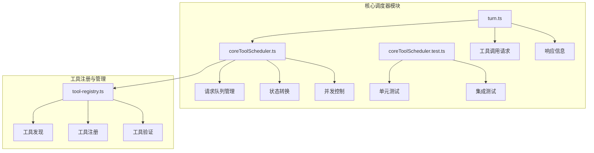
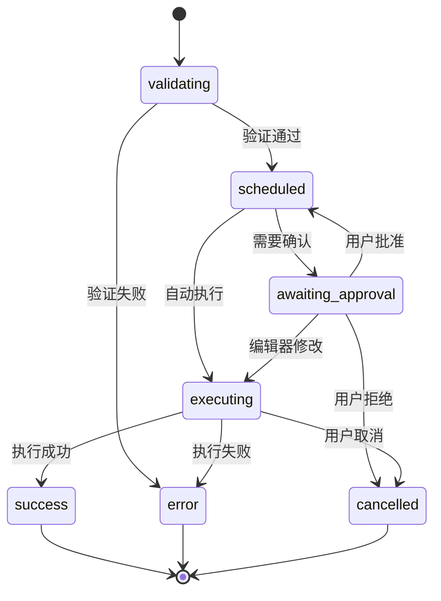
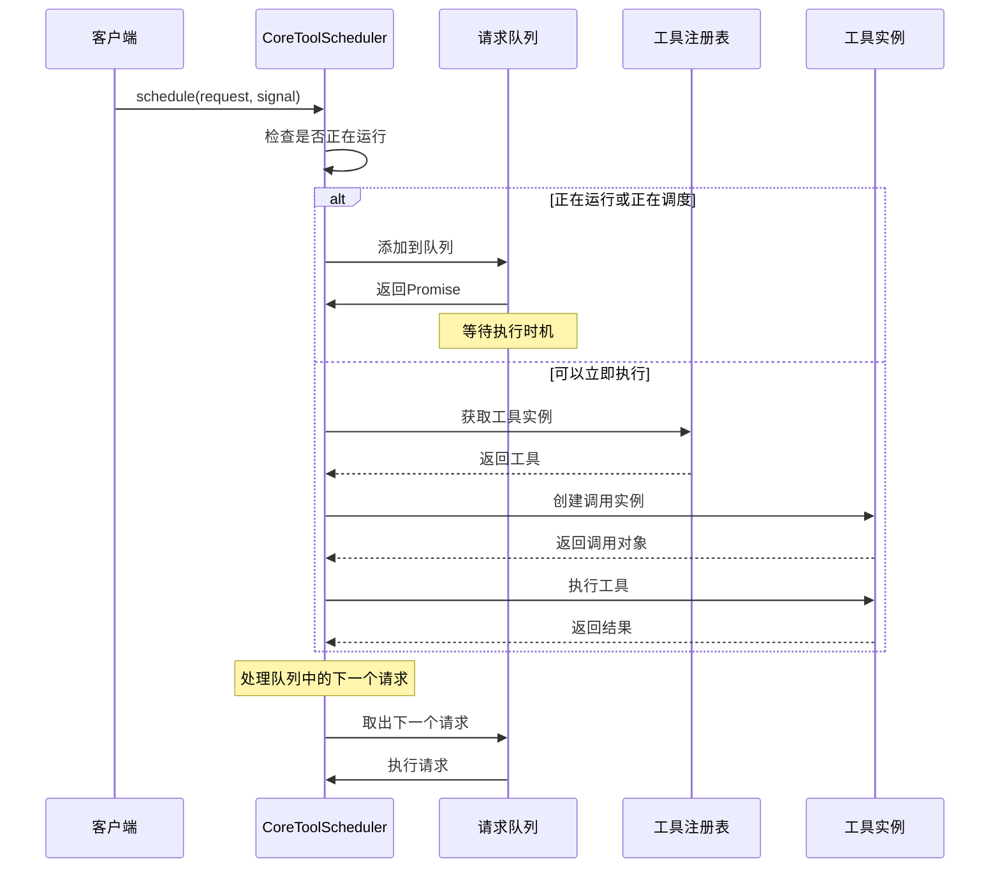
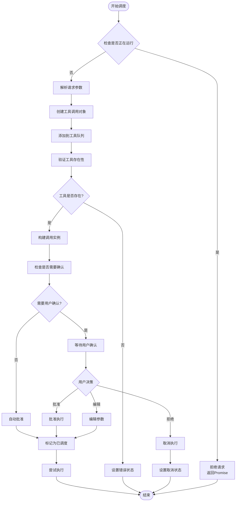
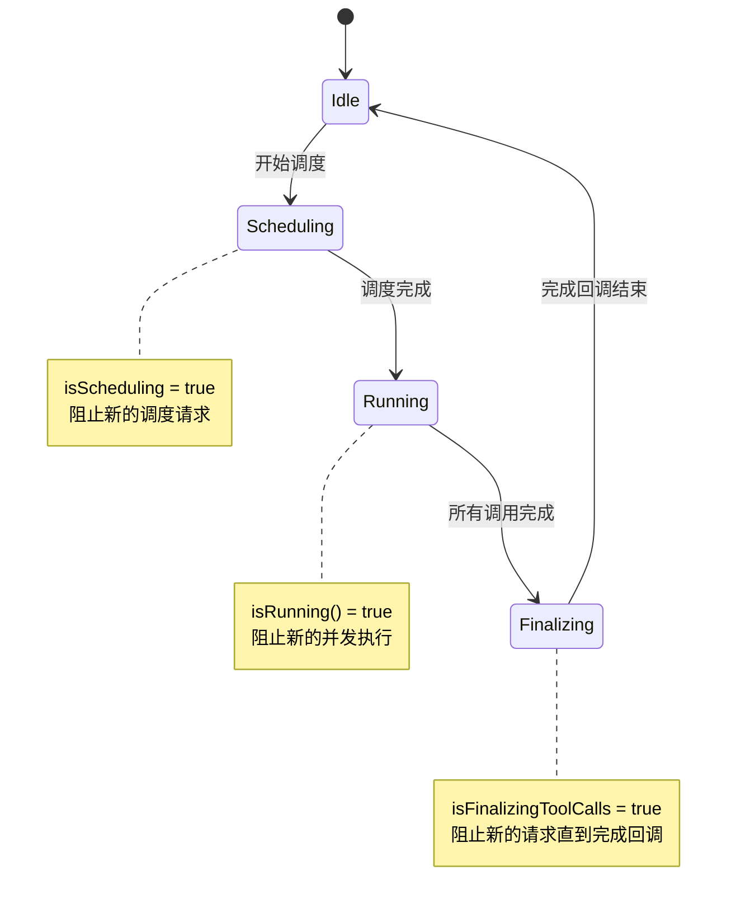
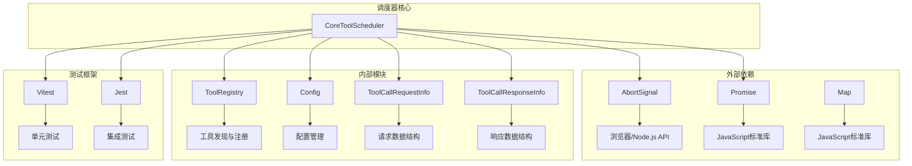

# 请求队列机制

<cite>
**本文档中引用的文件**
- [coreToolScheduler.ts](file://packages/core/src/core/coreToolScheduler.ts)
- [coreToolScheduler.test.ts](file://packages/core/src/core/coreToolScheduler.test.ts)
- [turn.ts](file://packages/core/src/core/turn.ts)
- [tool-registry.ts](file://packages/core/src/tools/tool-registry.ts)
</cite>

## 目录
1. [简介](#简介)
2. [项目结构](#项目结构)
3. [核心组件](#核心组件)
4. [架构概览](#架构概览)
5. [详细组件分析](#详细组件分析)
6. [依赖关系分析](#依赖关系分析)
7. [性能考虑](#性能考虑)
8. [故障排除指南](#故障排除指南)
9. [结论](#结论)

## 简介

CoreToolScheduler是Qwen代码助手的核心调度器，负责管理和协调所有工具调用请求。其请求队列机制是一个关键特性，确保在并发场景下能够安全地处理多个工具调用请求，同时保持系统的稳定性和响应性。

该调度器采用先进队列管理策略，当检测到当前有活跃的工具调用时，会自动将新的请求加入队列等待执行，而不是直接拒绝或覆盖现有任务。这种设计保证了用户操作的一致性和可靠性。

## 项目结构

CoreToolScheduler位于`packages/core/src/core/`目录下，是整个系统的核心组件之一。其主要文件结构如下：



**图表来源**
- [coreToolScheduler.ts](file://packages/core/src/core/coreToolScheduler.ts#L1-L50)
- [tool-registry.ts](file://packages/core/src/tools/tool-registry.ts#L1-L50)

**章节来源**
- [coreToolScheduler.ts](file://packages/core/src/core/coreToolScheduler.ts#L1-L100)
- [turn.ts](file://packages/core/src/core/turn.ts#L80-L120)

## 核心组件

### 请求队列数据结构

CoreToolScheduler使用一个专门的队列数组来管理待处理的请求：

```typescript
private requestQueue: Array<{
  request: ToolCallRequestInfo | ToolCallRequestInfo[];
  signal: AbortSignal;
  resolve: () => void;
  reject: (reason?: Error) => void;
}> = [];
```

这个数据结构包含以下关键字段：
- **request**: 单个或多个工具调用请求
- **signal**: AbortSignal用于监听取消操作
- **resolve/reject**: Promise的解析和拒绝函数
- **自动清理机制**: 当请求被取消时会自动从队列中移除

### 工具调用状态类型

调度器支持多种工具调用状态，每种状态都有特定的数据结构：



**图表来源**
- [coreToolScheduler.ts](file://packages/core/src/core/coreToolScheduler.ts#L56-L114)

**章节来源**
- [coreToolScheduler.ts](file://packages/core/src/core/coreToolScheduler.ts#L255-L281)
- [coreToolScheduler.ts](file://packages/core/src/core/coreToolScheduler.ts#L56-L114)

## 架构概览

CoreToolScheduler采用事件驱动的架构模式，结合Promise机制实现异步请求处理：



**图表来源**
- [coreToolScheduler.ts](file://packages/core/src/core/coreToolScheduler.ts#L549-L583)
- [coreToolScheduler.ts](file://packages/core/src/core/coreToolScheduler.ts#L600-L700)

## 详细组件分析

### 请求调度机制

#### schedule方法实现

`schedule`方法是调度器的核心入口点，负责处理所有传入的工具调用请求：

```typescript
schedule(
  request: ToolCallRequestInfo | ToolCallRequestInfo[],
  signal: AbortSignal,
): Promise<void> {
  if (this.isRunning() || this.isScheduling) {
    return new Promise((resolve, reject) => {
      const abortHandler = () => {
        const index = this.requestQueue.findIndex(
          (item) => item.request === request,
        );
        if (index > -1) {
          this.requestQueue.splice(index, 1);
          reject(new Error('Tool call cancelled while in queue.'));
        }
      };

      signal.addEventListener('abort', abortHandler, { once: true });

      this.requestQueue.push({
        request,
        signal,
        resolve: () => {
          signal.removeEventListener('abort', abortHandler);
          resolve();
        },
        reject: (reason?: Error) => {
          signal.removeEventListener('abort', abortHandler);
          reject(reason);
        },
      });
    });
  }
  return this._schedule(request, signal);
}
```

这个实现的关键特点：

1. **并发检查**: 使用`isRunning()`和`isScheduling`标志位检测当前状态
2. **Promise包装**: 将队列操作包装为Promise，提供异步接口
3. **AbortSignal监听**: 实现优雅的取消机制
4. **自动清理**: 在取消时自动从队列中移除请求

#### 内部调度流程

`_schedule`方法处理实际的工具调用逻辑：



**图表来源**
- [coreToolScheduler.ts](file://packages/core/src/core/coreToolScheduler.ts#L600-L750)

**章节来源**
- [coreToolScheduler.ts](file://packages/core/src/core/coreToolScheduler.ts#L549-L750)

### 状态管理系统

#### 状态转换机制

调度器实现了复杂的状态转换逻辑，确保每个工具调用都能正确地从一种状态过渡到另一种状态：

```typescript
private setStatusInternal(
  targetCallId: string,
  newStatus: Status,
  auxiliaryData?: unknown,
): void {
  this.toolCalls = this.toolCalls.map((currentCall) => {
    if (
      currentCall.request.callId !== targetCallId ||
      currentCall.status === 'success' ||
      currentCall.status === 'error' ||
      currentCall.status === 'cancelled'
    ) {
      return currentCall;
    }
    
    // 状态转换逻辑...
  });
  this.notifyToolCallsUpdate();
  this.checkAndNotifyCompletion();
}
```

#### 状态持久化

对于某些特殊状态（如取消的编辑操作），调度器会保存额外的信息：

```typescript
case 'cancelled': {
  const durationMs = existingStartTime
    ? Date.now() - existingStartTime
    : undefined;

  // 保留取消编辑操作的diff信息
  let resultDisplay: ToolResultDisplay | undefined = undefined;
  if (currentCall.status === 'awaiting_approval') {
    const waitingCall = currentCall as WaitingToolCall;
    if (waitingCall.confirmationDetails.type === 'edit') {
      resultDisplay = {
        fileDiff: waitingCall.confirmationDetails.fileDiff,
        fileName: waitingCall.confirmationDetails.fileName,
        originalContent: waitingCall.confirmationDetails.originalContent,
        newContent: waitingCall.confirmationDetails.newContent,
      };
    }
  } else if (currentCall.status === 'executing') {
    // 如果工具正在流式输出，保留最新的输出
    const executingCall = currentCall as ExecutingToolCall;
    if (executingCall.liveOutput !== undefined) {
      resultDisplay = executingCall.liveOutput;
    }
  }

  return {
    request: currentCall.request,
    tool: toolInstance,
    invocation,
    status: 'cancelled',
    response: {
      callId: currentCall.request.callId,
      responseParts: [...],
      resultDisplay,
      error: undefined,
      errorType: undefined,
    },
    durationMs,
    outcome,
  } as CancelledToolCall;
}
```

**章节来源**
- [coreToolScheduler.ts](file://packages/core/src/core/coreToolScheduler.ts#L283-L400)
- [coreToolScheduler.ts](file://packages/core/src/core/coreToolScheduler.ts#L329-L400)

### 队列处理逻辑

#### 自动执行机制

当一个工具调用完成后，调度器会自动处理队列中的下一个请求：

```typescript
private async checkAndNotifyCompletion(): Promise<void> {
  const allCallsAreTerminal = this.toolCalls.every(
    (call) =>
      call.status === 'success' ||
      call.status === 'error' ||
      call.status === 'cancelled',
  );

  if (this.toolCalls.length > 0 && allCallsAreTerminal) {
    const completedCalls = [...this.toolCalls] as CompletedToolCall[];
    this.toolCalls = [];

    // 记录工具调用事件
    for (const call of completedCalls) {
      logToolCall(this.config, new ToolCallEvent(call));
    }

    // 通知完成回调
    if (this.onAllToolCallsComplete) {
      this.isFinalizingToolCalls = true;
      await this.onAllToolCallsComplete(completedCalls);
      this.isFinalizingToolCalls = false;
    }
    
    // 处理队列中的下一个请求
    if (this.requestQueue.length > 0) {
      const next = this.requestQueue.shift()!;
      this._schedule(next.request, next.signal)
        .then(next.resolve)
        .catch(next.reject);
    }
  }
}
```

#### 并发控制策略

调度器实现了多层并发控制：

1. **调度状态控制**: `isScheduling`标志防止重叠的调度操作
2. **运行状态检查**: `isRunning()`检测是否有活跃的工具调用
3. **最终化状态**: `isFinalizingToolCalls`防止在完成回调期间接受新请求



**图表来源**
- [coreToolScheduler.ts](file://packages/core/src/core/coreToolScheduler.ts#L450-L500)

**章节来源**
- [coreToolScheduler.ts](file://packages/core/src/core/coreToolScheduler.ts#L450-L500)

### 工具注册与发现

#### 工具注册表集成

调度器通过ToolRegistry获取和管理工具实例：

```typescript
export class CoreToolScheduler {
  private toolRegistry: ToolRegistry;
  
  constructor(options: CoreToolSchedulerOptions) {
    this.config = options.config;
    this.toolRegistry = options.config.getToolRegistry();
    // ...
  }
}
```

#### 工具验证机制

调度器会验证请求的工具是否存在：

```typescript
const toolInstance = this.toolRegistry.getTool(reqInfo.name);
if (!toolInstance) {
  const suggestion = this.getToolSuggestion(reqInfo.name);
  const errorMessage = `Tool "${reqInfo.name}" not found in registry. Tools must use the exact names that are registered.${suggestion}`;
  return {
    status: 'error',
    request: reqInfo,
    response: createErrorResponse(
      reqInfo,
      new Error(errorMessage),
      ToolErrorType.TOOL_NOT_REGISTERED,
    ),
    durationMs: 0,
  };
}
```

#### 工具建议功能

当找不到工具时，调度器会提供智能建议：

```typescript
private getToolSuggestion(unknownToolName: string, topN = 3): string {
  const allToolNames = this.toolRegistry.getAllToolNames();

  const matches = allToolNames.map((toolName) => ({
    name: toolName,
    distance: levenshtein.get(unknownToolName, toolName),
  }));

  matches.sort((a, b) => a.distance - b.distance);

  const topNResults = matches.slice(0, topN);

  if (topNResults.length === 0) {
    return '';
  }

  const suggestedNames = topNResults
    .map((match) => `"${match.name}"`)
    .join(', ');

  if (topNResults.length > 1) {
    return ` Did you mean one of: ${suggestedNames}?`;
  } else {
    return ` Did you mean ${suggestedNames}?`;
  }
}
```

**章节来源**
- [coreToolScheduler.ts](file://packages/core/src/core/coreToolScheduler.ts#L255-L281)
- [coreToolScheduler.ts](file://packages/core/src/core/coreToolScheduler.ts#L400-L450)
- [tool-registry.ts](file://packages/core/src/tools/tool-registry.ts#L456-L476)

## 依赖关系分析

### 核心依赖图



**图表来源**
- [coreToolScheduler.ts](file://packages/core/src/core/coreToolScheduler.ts#L1-L50)
- [tool-registry.ts](file://packages/core/src/tools/tool-registry.ts#L1-L50)

### 组件耦合分析

调度器采用了松耦合的设计原则：

1. **接口隔离**: 通过抽象接口定义与其他模块的交互
2. **依赖注入**: 通过构造函数注入依赖，便于测试和扩展
3. **事件驱动**: 使用回调函数处理完成通知，减少直接依赖

**章节来源**
- [coreToolScheduler.ts](file://packages/core/src/core/coreToolScheduler.ts#L255-L281)
- [tool-registry.ts](file://packages/core/src/tools/tool-registry.ts#L100-L150)

## 性能考虑

### 内存管理

调度器实现了多项内存优化策略：

1. **及时清理**: 完成的工具调用会立即从队列中移除
2. **状态压缩**: 取消状态会保存必要的信息而非完整对象
3. **循环引用避免**: 使用简单的数据结构避免复杂的对象图

### 并发性能

1. **非阻塞设计**: 所有操作都是异步的，不会阻塞主线程
2. **批量处理**: 支持批量工具调用，提高吞吐量
3. **资源池化**: 工具实例可以重复使用，减少创建开销

### 错误恢复

调度器具备强大的错误恢复能力：

```typescript
attemptExecutionOfScheduledCalls(signal: AbortSignal): void {
  const allCallsFinalOrScheduled = this.toolCalls.every(
    (call) =>
      call.status === 'scheduled' ||
      call.status === 'cancelled' ||
      call.status === 'success' ||
      call.status === 'error',
  );

  if (allCallsFinalOrScheduled) {
    const callsToExecute = this.toolCalls.filter(
      (call) => call.status === 'scheduled',
    );

    callsToExecute.forEach((toolCall) => {
      if (toolCall.status !== 'scheduled') return;

      const scheduledCall = toolCall;
      const { callId, name: toolName } = scheduledCall.request;
      const invocation = scheduledCall.invocation;
      
      // 执行逻辑...
    });
  }
}
```

## 故障排除指南

### 常见问题诊断

#### 队列积压问题

**症状**: 新的工具调用请求长时间未得到处理
**原因**: 当前有活跃的工具调用或调度器处于繁忙状态
**解决方案**: 
1. 检查是否有长时间运行的工具调用
2. 查看调度器日志了解当前状态
3. 考虑增加超时机制

#### 内存泄漏

**症状**: 应用内存使用持续增长
**原因**: 完成的工具调用未正确清理
**解决方案**:
1. 确保所有工具调用都设置了正确的状态
2. 检查队列清理逻辑
3. 监控工具调用生命周期

#### 并发冲突

**症状**: 工具调用结果不一致或丢失
**原因**: 多个并发请求之间的竞争条件
**解决方案**:
1. 使用适当的锁机制
2. 实现幂等性操作
3. 增加状态同步检查

### 调试技巧

#### 启用调试模式

```typescript
const scheduler = new CoreToolScheduler({
  config: mockConfig,
  onAllToolCallsComplete,
  onToolCallsUpdate,
  getPreferredEditor: () => 'vscode',
  onEditorClose: vi.fn(),
});
```

#### 监控工具调用状态

```typescript
const onToolCallsUpdate = vi.fn();
scheduler = new CoreToolScheduler({
  // ...
  onToolCallsUpdate,
  // ...
});
```

**章节来源**
- [coreToolScheduler.test.ts](file://packages/core/src/core/coreToolScheduler.test.ts#L1100-L1200)

## 结论

CoreToolScheduler的请求队列机制是一个精心设计的系统，它成功地解决了并发工具调用的挑战。通过以下关键特性，该系统提供了可靠、高效的工具调度服务：

### 主要优势

1. **优雅的并发处理**: 自动将请求加入队列，避免直接拒绝
2. **完善的错误处理**: 提供详细的错误信息和恢复机制
3. **灵活的状态管理**: 支持多种工具调用状态和转换
4. **智能的工具发现**: 集成工具注册表，支持动态工具发现
5. **强大的调试支持**: 提供丰富的监控和调试接口

### 设计亮点

- **事件驱动架构**: 基于Promise和回调的异步处理
- **状态机模式**: 清晰的状态转换和生命周期管理
- **松耦合设计**: 通过接口和依赖注入实现模块解耦
- **内存优化**: 及时清理和状态压缩减少内存占用

### 扩展性考虑

该调度器为未来的功能扩展预留了充足的空间：

- **插件系统**: 支持自定义工具和处理器
- **负载均衡**: 可以扩展为多实例分布式调度
- **优先级队列**: 支持不同优先级的请求处理
- **监控指标**: 可以集成更详细的性能监控

通过深入理解这些设计原理和实现细节，开发者可以更好地利用CoreToolScheduler的强大功能，并根据具体需求进行定制和扩展。