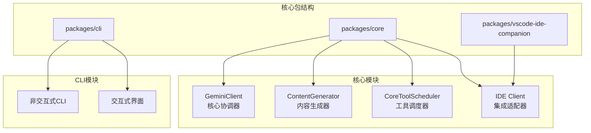
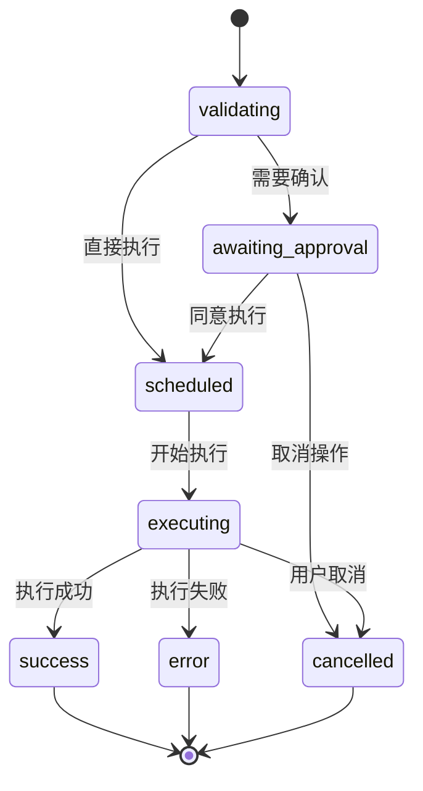
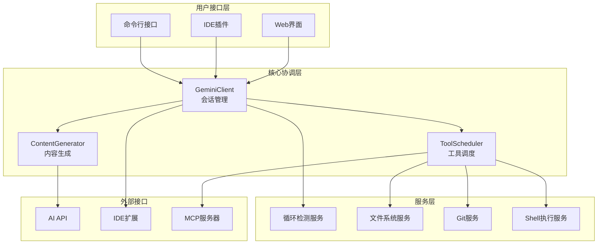
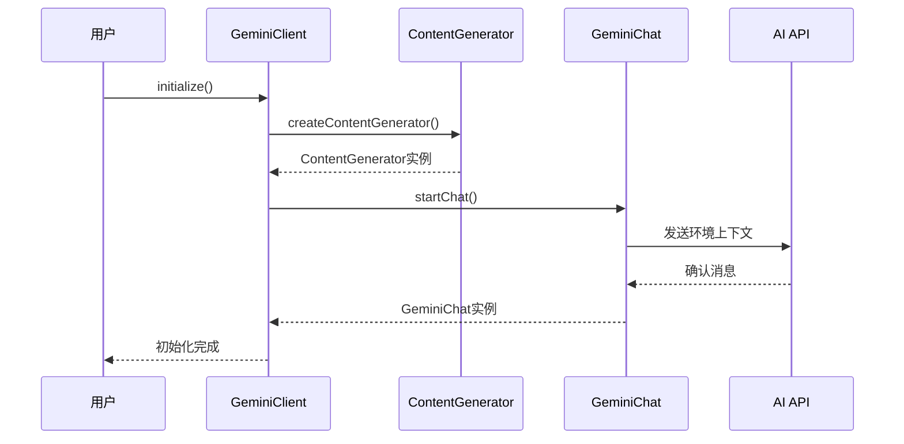
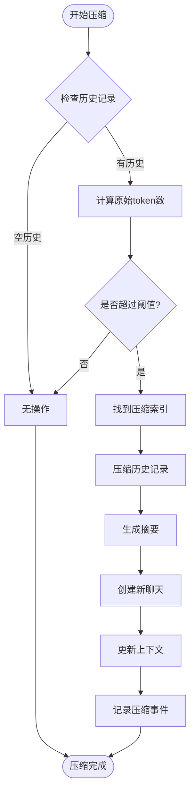
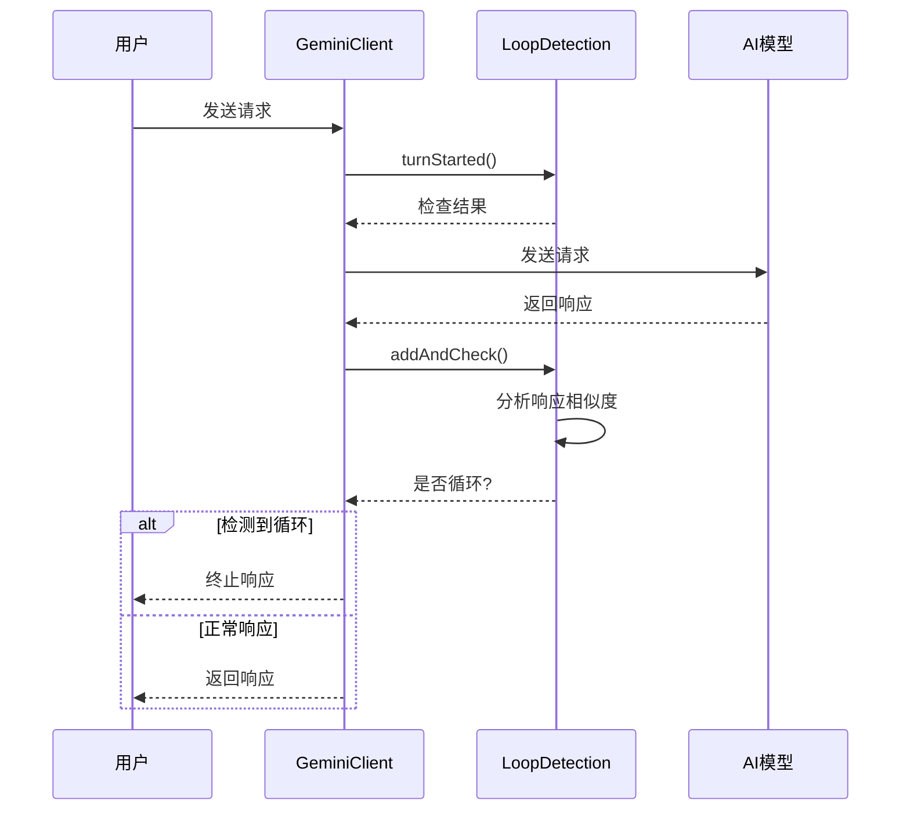
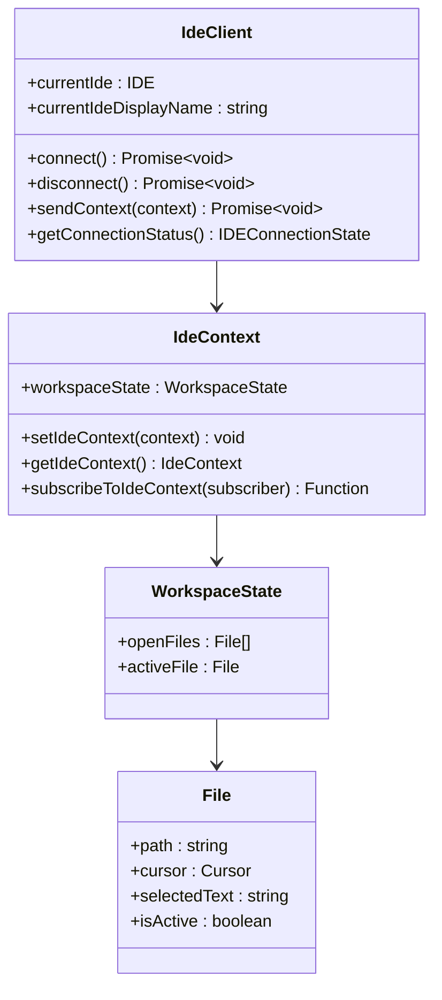
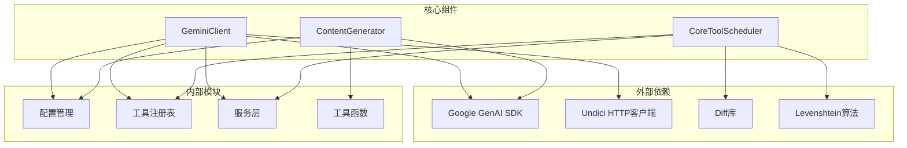

# 核心客户端设计与实现

<cite>
**本文档中引用的文件**
- [packages/core/src/core/client.ts](file://packages/core/src/core/client.ts)
- [packages/core/src/core/contentGenerator.ts](file://packages/core/src/core/contentGenerator.ts)
- [packages/core/src/core/coreToolScheduler.ts](file://packages/core/src/core/coreToolScheduler.ts)
- [packages/cli/src/nonInteractiveCli.ts](file://packages/cli/src/nonInteractiveCli.ts)
- [packages/core/src/ide/ide-client.ts](file://packages/core/src/ide/ide-client.ts)
- [packages/core/src/ide/ideContext.ts](file://packages/core/src/ide/ideContext.ts)
- [packages/core/src/config/config.ts](file://packages/core/src/config/config.ts)
</cite>

## 目录
1. [简介](#简介)
2. [项目结构概览](#项目结构概览)
3. [核心组件分析](#核心组件分析)
4. [架构概览](#架构概览)
5. [详细组件分析](#详细组件分析)
6. [依赖关系分析](#依赖关系分析)
7. [性能考虑](#性能考虑)
8. [故障排除指南](#故障排除指南)
9. [结论](#结论)

## 简介

CoreClient类是Qwen Code系统的核心协调者，负责管理AI内容生成、工具调度和会话状态的完整生命周期。该类作为系统的主要入口点，协调ContentGenerator和CoreToolScheduler等关键组件，为用户提供无缝的AI驱动开发体验。

CoreClient的设计遵循了单一职责原则，专注于会话管理、内容生成协调和状态维护。它通过智能的聊天压缩机制、循环检测服务和IDE集成适配器，确保在各种使用场景下都能提供高质量的服务。

## 项目结构概览

Qwen Code项目采用模块化的包结构，核心功能集中在`packages/core`目录中：



**图表来源**
- [packages/core/src/core/client.ts](file://packages/core/src/core/client.ts#L1-L50)
- [packages/core/src/core/contentGenerator.ts](file://packages/core/src/core/contentGenerator.ts#L1-L30)
- [packages/core/src/core/coreToolScheduler.ts](file://packages/core/src/core/coreToolScheduler.ts#L1-L50)

**章节来源**
- [packages/core/src/core/client.ts](file://packages/core/src/core/client.ts#L1-L100)
- [README.md](file://README.md#L1-L50)

## 核心组件分析

### GeminiClient - 核心协调器

GeminiClient是整个系统的核心协调者，负责管理AI内容生成的完整生命周期。该类实现了以下关键功能：

#### 会话管理
- **初始化管理**: 通过`initialize()`方法建立ContentGenerator和GeminiChat实例
- **历史记录维护**: 提供完整的对话历史管理，支持压缩和恢复
- **状态同步**: 确保所有子组件的状态保持一致

#### 内容生成协调
- **流式响应**: 支持异步生成内容并实时流式传输
- **多模态支持**: 处理文本、图像等多种内容格式
- **工具集成**: 协调工具调用和响应处理

#### 智能优化
- **聊天压缩**: 自动压缩长对话历史以节省token
- **循环检测**: 防止无限递归和重复响应
- **模型切换**: 在不同模型间平滑切换

**章节来源**
- [packages/core/src/core/client.ts](file://packages/core/src/core/client.ts#L70-L200)
- [packages/core/src/core/client.ts](file://packages/core/src/core/client.ts#L400-L600)

### ContentGenerator - 内容生成引擎

ContentGenerator接口抽象了所有内容生成功能，支持多种后端提供商：

#### 多提供商支持
- **Google Gemini**: 原生Gemini API支持
- **OpenAI兼容**: 支持OpenAI和其他兼容提供商
- **Qwen OAuth**: 专为Qwen3-Coder优化的OAuth认证
- **Vertex AI**: Google Cloud Vertex AI集成

#### 认证类型管理
```typescript
export enum AuthType {
  LOGIN_WITH_GOOGLE = 'oauth-personal',
  USE_GEMINI = 'gemini-api-key',
  USE_VERTEX_AI = 'vertex-ai',
  CLOUD_SHELL = 'cloud-shell',
  USE_OPENAI = 'openai',
  QWEN_OAUTH = 'qwen-oauth',
}
```

#### 配置灵活性
- 动态配置加载
- 超时和重试机制
- 代理支持
- 用户代理标识

**章节来源**
- [packages/core/src/core/contentGenerator.ts](file://packages/core/src/core/contentGenerator.ts#L30-L150)
- [packages/core/src/core/contentGenerator.ts](file://packages/core/src/core/contentGenerator.ts#L180-L246)

### CoreToolScheduler - 工具调度器

CoreToolScheduler负责管理所有工具调用的生命周期，从验证到执行再到结果处理：

#### 工具状态管理


**图表来源**
- [packages/core/src/core/coreToolScheduler.ts](file://packages/core/src/core/coreToolScheduler.ts#L20-L80)

#### 审批机制
- **YOLO模式**: 允许所有工具无限制执行
- **计划模式**: 仅允许只读工具执行
- **手动审批**: 需要用户明确同意每个工具调用

#### 输出处理
- 实时输出更新
- 文件差异显示
- 错误处理和恢复

**章节来源**
- [packages/core/src/core/coreToolScheduler.ts](file://packages/core/src/core/coreToolScheduler.ts#L100-L300)
- [packages/core/src/core/coreToolScheduler.ts](file://packages/core/src/core/coreToolScheduler.ts#L700-L900)

## 架构概览

CoreClient的整体架构体现了清晰的分层设计和职责分离：



**图表来源**
- [packages/core/src/core/client.ts](file://packages/core/src/core/client.ts#L70-L150)
- [packages/core/src/core/coreToolScheduler.ts](file://packages/core/src/core/coreToolScheduler.ts#L150-L200)

## 详细组件分析

### 会话生命周期管理

GeminiClient通过精心设计的生命周期管理确保会话的一致性和可靠性：

#### 初始化阶段
```typescript
async initialize(
  contentGeneratorConfig: ContentGeneratorConfig,
  extraHistory?: Content[],
) {
  this.contentGenerator = await createContentGenerator(
    contentGeneratorConfig,
    this.config,
    this.config.getSessionId(),
  );
  this.chat = await this.startChat(
    extraHistory || [],
    contentGeneratorConfig.model,
  );
}
```

#### 聊天启动流程


**图表来源**
- [packages/core/src/core/client.ts](file://packages/core/src/core/client.ts#L80-L120)
- [packages/core/src/core/client.ts](file://packages/core/src/core/client.ts#L200-L250)

#### 历史记录管理
GeminiClient提供了强大的历史记录管理功能：

```typescript
async setTools(): Promise<void> {
  const toolRegistry = this.config.getToolRegistry();
  const toolDeclarations = toolRegistry.getFunctionDeclarations();
  const tools: Tool[] = [{ functionDeclarations: toolDeclarations }];
  this.getChat().setTools(tools);
}
```

**章节来源**
- [packages/core/src/core/client.ts](file://packages/core/src/core/client.ts#L150-L200)
- [packages/core/src/core/client.ts](file://packages/core/src/core/client.ts#L250-L300)

### 聊天压缩机制

为了优化token使用和性能，GeminiClient实现了智能的聊天压缩机制：

#### 压缩触发条件
- 历史记录超过token限制阈值
- 会话持续时间过长
- 手动压缩请求

#### 压缩算法


**图表来源**
- [packages/core/src/core/client.ts](file://packages/core/src/core/client.ts#L850-L950)

#### 压缩配置
```typescript
const COMPRESSION_TOKEN_THRESHOLD = 0.7;
const COMPRESSION_PRESERVE_THRESHOLD = 0.3;
```

**章节来源**
- [packages/core/src/core/client.ts](file://packages/core/src/core/client.ts#L800-L900)

### 循环检测服务

为了避免无限递归和重复响应，GeminiClient集成了循环检测服务：

#### 检测机制
- **响应相似度分析**: 使用Levenshtein距离检测相似响应
- **上下文窗口跟踪**: 监控连续响应的上下文变化
- **自动终止**: 检测到循环时自动终止生成

#### 循环处理流程


**图表来源**
- [packages/core/src/core/client.ts](file://packages/core/src/core/client.ts#L600-L700)

**章节来源**
- [packages/core/src/core/client.ts](file://packages/core/src/core/client.ts#L600-L700)

### IDE集成适配器

GeminiClient提供了强大的IDE集成能力，支持多种编辑器：

#### 连接管理
```typescript
async connect(): Promise<void> {
  if (!this.currentIde || !this.currentIdeDisplayName) {
    this.setState(
      IDEConnectionStatus.Disconnected,
      `IDE integration is not supported in your current environment.`,
      false,
    );
    return;
  }
  
  this.setState(IDEConnectionStatus.Connecting);
  // 连接逻辑...
}
```

#### 上下文同步
- **文件状态**: 实时同步打开文件和光标位置
- **选择内容**: 跟踪用户选中的文本区域
- **变更检测**: 智能检测文件变更并发送增量更新

#### 编辑器适配


**图表来源**
- [packages/core/src/ide/ide-client.ts](file://packages/core/src/ide/ide-client.ts#L80-L150)
- [packages/core/src/ide/ideContext.ts](file://packages/core/src/ide/ideContext.ts#L114-L175)

**章节来源**
- [packages/core/src/ide/ide-client.ts](file://packages/core/src/ide/ide-client.ts#L80-L200)
- [packages/core/src/ide/ideContext.ts](file://packages/core/src/ide/ideContext.ts#L114-L175)

### 非交互模式处理

对于自动化脚本和CI/CD管道，CoreClient提供了专门的非交互模式：

#### 非交互式CLI实现
```typescript
export async function runNonInteractive(
  config: Config,
  input: string,
  prompt_id: string,
): Promise<void> {
  const geminiClient = config.getGeminiClient();
  const abortController = new AbortController();
  
  const responseStream = geminiClient.sendMessageStream(
    currentMessages[0]?.parts || [],
    abortController.signal,
    prompt_id,
  );
  
  for await (const event of responseStream) {
    if (event.type === GeminiEventType.Content) {
      process.stdout.write(event.value);
    } else if (event.type === GeminiEventType.ToolCallRequest) {
      toolCallRequests.push(event.value);
    }
  }
}
```

#### 特殊处理逻辑
- **工具调用处理**: 自动执行工具调用而不等待用户确认
- **错误处理**: 提供详细的错误报告和恢复建议
- **输出格式化**: 确保机器可读的输出格式

**章节来源**
- [packages/cli/src/nonInteractiveCli.ts](file://packages/cli/src/nonInteractiveCli.ts#L20-L100)

## 依赖关系分析

CoreClient系统的依赖关系体现了清晰的分层架构：



**图表来源**
- [packages/core/src/core/client.ts](file://packages/core/src/core/client.ts#L1-L30)
- [packages/core/src/core/coreToolScheduler.ts](file://packages/core/src/core/coreToolScheduler.ts#L1-L30)

**章节来源**
- [packages/core/src/core/client.ts](file://packages/core/src/core/client.ts#L1-L50)
- [packages/core/src/core/contentGenerator.ts](file://packages/core/src/core/contentGenerator.ts#L1-L50)

## 性能考虑

### Token优化策略
- **智能压缩**: 基于内容重要性进行压缩
- **缓存机制**: 缓存常用工具定义和配置
- **批量处理**: 合并多个小工具调用

### 内存管理
- **历史记录截断**: 自动清理过期的历史记录
- **对象池**: 复用频繁创建的对象
- **垃圾回收**: 及时释放不再使用的资源

### 并发控制
- **队列管理**: 限制同时执行的工具数量
- **信号处理**: 支持优雅的中断和取消
- **超时保护**: 防止长时间运行的操作阻塞系统

## 故障排除指南

### 常见问题诊断

#### 连接问题
```typescript
// 检查IDE连接状态
const { status, details } = ideClient.getConnectionStatus();
if (status === IDEConnectionStatus.Disconnected) {
  console.error('IDE连接已断开:', details);
}
```

#### 内容生成失败
- **检查认证**: 验证API密钥和权限
- **网络诊断**: 测试网络连接和代理设置
- **模型可用性**: 确认目标模型是否可用

#### 工具执行错误
- **参数验证**: 检查工具参数的有效性
- **权限检查**: 确认文件系统访问权限
- **资源限制**: 监控内存和CPU使用情况

**章节来源**
- [packages/core/src/ide/ide-client.ts](file://packages/core/src/ide/ide-client.ts#L280-L320)

### 调试技巧
- **启用调试模式**: 设置`debugMode`获取详细日志
- **会话压缩**: 使用`/compress`命令减少token使用
- **状态检查**: 使用`/stats`命令监控系统状态

## 结论

CoreClient类作为Qwen Code系统的核心协调者，通过精心设计的架构和丰富的功能特性，为开发者提供了强大而灵活的AI辅助开发体验。其模块化设计、智能优化机制和完善的错误处理，确保了在各种使用场景下都能提供稳定可靠的服务。

该系统的关键优势包括：
- **统一的会话管理**: 从初始化到结束的完整生命周期管理
- **智能的内容生成**: 支持多种提供商和认证方式
- **灵活的工具调度**: 完整的工具生命周期管理和审批机制
- **强大的IDE集成**: 支持多种编辑器的深度集成
- **高效的性能优化**: 智能压缩和循环检测确保最佳性能

通过持续的功能增强和性能优化，CoreClient将继续为开发者提供更加智能和高效的AI辅助开发工具。