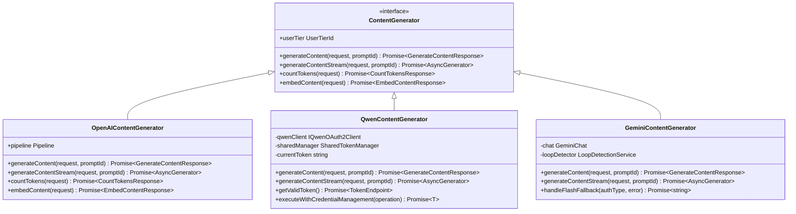

# 核心模块设计

<cite>
**本文档中引用的文件**
- [client.ts](file://packages/core/src/core/client.ts)
- [contentGenerator.ts](file://packages/core/src/core/contentGenerator.ts)
- [coreToolScheduler.ts](file://packages/core/src/core/coreToolScheduler.ts)
- [geminiChat.ts](file://packages/core/src/core/geminiChat.ts)
- [qwenContentGenerator.ts](file://packages/core/src/qwen/qwenContentGenerator.ts)
- [config.ts](file://packages/core/src/config/config.ts)
- [tools.ts](file://packages/core/src/tools/tools.ts)
- [client.test.ts](file://packages/core/src/core/client.test.ts)
- [coreToolScheduler.test.ts](file://packages/core/src/core/coreToolScheduler.test.ts)
</cite>

## 目录
1. [简介](#简介)
2. [项目结构概览](#项目结构概览)
3. [核心组件分析](#核心组件分析)
4. [架构概览](#架构概览)
5. [详细组件分析](#详细组件分析)
6. [设计模式应用](#设计模式应用)
7. [依赖关系分析](#依赖关系分析)
8. [性能考虑](#性能考虑)
9. [故障排除指南](#故障排除指南)
10. [结论](#结论)

## 简介

qwen-code是一个集成了多种AI模型提供商的智能代码助手系统，其核心模块负责协调AI内容生成、工具调度和会话管理。该系统采用了现代化的设计模式，包括单例模式、工厂模式和观察者模式，以实现高度可扩展和可维护的架构。

核心模块的主要职责包括：
- 协调多个AI模型提供商（OpenAI、Gemini、Qwen）的内容生成
- 管理工具调用的完整生命周期
- 维护会话状态和上下文管理
- 处理流式响应和实时更新
- 实现错误处理和重试机制

## 项目结构概览


**图表来源**
- [client.ts](file://packages/core/src/core/client.ts#L1-L50)
- [contentGenerator.ts](file://packages/core/src/core/contentGenerator.ts#L1-L50)
- [coreToolScheduler.ts](file://packages/core/src/core/coreToolScheduler.ts#L1-L50)

## 核心组件分析

### CoreClient类设计

CoreClient是整个系统的核心协调器，负责管理AI内容生成、工具调度和会话状态。它采用了单例模式确保全局状态的一致性。

```typescript
export class GeminiClient {
  private chat?: GeminiChat;
  private contentGenerator?: ContentGenerator;
  private readonly loopDetector: LoopDetectionService;
  
  constructor(private readonly config: Config) {
    // 初始化配置和依赖注入
  }
  
  async initialize(
    contentGeneratorConfig: ContentGeneratorConfig,
    extraHistory?: Content[],
  ) {
    // 创建内容生成器实例
    this.contentGenerator = await createContentGenerator(
      contentGeneratorConfig,
      this.config,
      this.config.getSessionId(),
    );
  }
}
```

**章节来源**
- [client.ts](file://packages/core/src/core/client.ts#L80-L120)

### ContentGenerator接口体系

ContentGenerator接口定义了统一的内容生成抽象层，支持多种AI模型提供商的集成。

```typescript
export interface ContentGenerator {
  generateContent(
    request: GenerateContentParameters,
    userPromptId: string,
  ): Promise<GenerateContentResponse>;

  generateContentStream(
    request: GenerateContentParameters,
    userPromptId: string,
  ): Promise<AsyncGenerator<GenerateContentResponse>>;

  countTokens(request: CountTokensParameters): Promise<CountTokensResponse>;

  embedContent(request: EmbedContentParameters): Promise<EmbedContentResponse>;

  userTier?: UserTierId;
}
```

**章节来源**
- [contentGenerator.ts](file://packages/core/src/core/contentGenerator.ts#L26-L42)

### CoreToolScheduler工具调度系统

CoreToolScheduler实现了工具调用的完整生命周期管理，包括参数验证、执行调度、结果聚合和错误处理。

```typescript
export class CoreToolScheduler {
  private toolCalls: ToolCall[] = [];
  private toolRegistry: ToolRegistry;
  
  async schedule(
    request: ToolCallRequestInfo | ToolCallRequestInfo[],
    signal: AbortSignal,
  ): Promise<void> {
    // 工具调度逻辑
    const requestsToProcess = Array.isArray(request) ? request : [request];
    
    const newToolCalls: ToolCall[] = requestsToProcess.map(
      (reqInfo): ToolCall => {
        const toolInstance = this.toolRegistry.getTool(reqInfo.name);
        if (!toolInstance) {
          // 错误处理
          return {
            status: 'error',
            request: reqInfo,
            response: createErrorResponse(/*...*/),
            durationMs: 0,
          };
        }
        
        // 参数验证和构建调用
        const invocationOrError = this.buildInvocation(
          toolInstance,
          reqInfo.args,
        );
        
        return {
          status: 'validating',
          request: reqInfo,
          tool: toolInstance,
          invocation: invocationOrError,
          startTime: Date.now(),
        };
      },
    );
  }
}
```

**章节来源**
- [coreToolScheduler.ts](file://packages/core/src/core/coreToolScheduler.ts#L255-L350)

## 架构概览


**图表来源**
- [client.ts](file://packages/core/src/core/client.ts#L400-L500)
- [coreToolScheduler.ts](file://packages/core/src/core/coreToolScheduler.ts#L400-L500)

## 详细组件分析

### AI内容生成器集成

系统支持三种主要的AI模型提供商，每种都有专门的生成器实现：

#### OpenAIContentGenerator
基于OpenAI API的标准实现，支持流式响应和批量处理。

#### GeminiContentGenerator
专门为Google Gemini模型优化的生成器，包含循环检测和压缩功能。

#### QwenContentGenerator
阿里云Qwen模型的专用实现，集成了OAuth认证和自动令牌刷新。



**图表来源**
- [contentGenerator.ts](file://packages/core/src/core/contentGenerator.ts#L26-L80)
- [qwenContentGenerator.ts](file://packages/core/src/qwen/qwenContentGenerator.ts#L30-L80)
- [geminiChat.ts](file://packages/core/src/core/geminiChat.ts#L150-L200)

**章节来源**
- [contentGenerator.ts](file://packages/core/src/core/contentGenerator.ts#L150-L246)
- [qwenContentGenerator.ts](file://packages/core/src/qwen/qwenContentGenerator.ts#L1-L100)

### 工具调度生命周期

CoreToolScheduler实现了完整的工具调用生命周期管理，包括状态转换和错误处理：


**图表来源**
- [coreToolScheduler.ts](file://packages/core/src/core/coreToolScheduler.ts#L50-L150)

**章节来源**
- [coreToolScheduler.ts](file://packages/core/src/core/coreToolScheduler.ts#L255-L400)

### 会话管理和上下文维护

CoreClient负责维护会话状态和上下文管理，包括历史记录压缩、IDE上下文同步和环境变量处理。

```typescript
async sendMessageStream(
  request: PartListUnion,
  signal: AbortSignal,
  prompt_id: string,
  turns: number = MAX_TURNS,
  originalModel?: string,
): AsyncGenerator<ServerGeminiStreamEvent, Turn> {
  // 压缩聊天历史
  const compressed = await this.tryCompressChat(prompt_id);
  
  // 添加IDE上下文
  if (this.config.getIdeMode() && !hasPendingToolCall) {
    const { contextParts, newIdeContext } = this.getIdeContextParts(
      this.forceFullIdeContext || history.length === 0,
    );
    if (contextParts.length > 0) {
      this.getChat().addHistory({
        role: 'user',
        parts: [{ text: contextParts.join('\n') }],
      });
    }
  }
  
  // 执行对话轮次
  const turn = new Turn(this.getChat(), prompt_id);
  const resultStream = turn.run(requestToSent, signal);
  
  return turn;
}
```

**章节来源**
- [client.ts](file://packages/core/src/core/client.ts#L400-L600)

## 设计模式应用

### 单例模式 - 全局状态管理

CoreClient采用单例模式确保全局状态的一致性，避免重复初始化和资源浪费。

```typescript
// 单例模式实现
class GeminiClient {
  private static instance: GeminiClient;
  
  private constructor(config: Config) {
    // 私有构造函数
  }
  
  public static getInstance(config: Config): GeminiClient {
    if (!GeminiClient.instance) {
      GeminiClient.instance = new GeminiClient(config);
    }
    return GeminiClient.instance;
  }
}
```

### 工厂模式 - AI生成器创建

ContentGenerator使用工厂模式根据不同的认证类型创建相应的生成器实例。

```typescript
export async function createContentGenerator(
  config: ContentGeneratorConfig,
  gcConfig: Config,
  sessionId?: string,
): Promise<ContentGenerator> {
  if (config.authType === AuthType.LOGIN_WITH_GOOGLE) {
    return new LoggingContentGenerator(
      await createCodeAssistContentGenerator(httpOptions, authType, gcConfig, sessionId),
      gcConfig,
    );
  }
  
  if (config.authType === AuthType.QWEN_OAUTH) {
    const qwenClient = await getQwenOauthClient(gcConfig);
    return new QwenContentGenerator(qwenClient, config, gcConfig);
  }
  
  throw new Error(`Unsupported authType: ${config.authType}`);
}
```

**章节来源**
- [contentGenerator.ts](file://packages/core/src/core/contentGenerator.ts#L150-L246)

### 观察者模式 - 事件通知系统

CoreToolScheduler使用观察者模式实现工具调用状态变更的通知机制。

```typescript
export class CoreToolScheduler {
  private onToolCallsUpdate?: ToolCallsUpdateHandler;
  private onAllToolCallsComplete?: AllToolCallsCompleteHandler;
  
  private notifyToolCallsUpdate(): void {
    if (this.onToolCallsUpdate) {
      this.onToolCallsUpdate([...this.toolCalls]);
    }
  }
  
  private async checkAndNotifyCompletion(): Promise<void> {
    const allCallsAreTerminal = this.toolCalls.every(
      (call) => call.status === 'success' || call.status === 'error' || call.status === 'cancelled',
    );
    
    if (this.toolCalls.length > 0 && allCallsAreTerminal) {
      if (this.onAllToolCallsComplete) {
        await this.onAllToolCallsComplete(completedCalls);
      }
    }
  }
}
```

**章节来源**
- [coreToolScheduler.ts](file://packages/core/src/core/coreToolScheduler.ts#L950-L1000)

## 依赖关系分析


**图表来源**
- [client.ts](file://packages/core/src/core/client.ts#L1-L50)
- [coreToolScheduler.ts](file://packages/core/src/core/coreToolScheduler.ts#L1-L50)

**章节来源**
- [client.ts](file://packages/core/src/core/client.ts#L1-L100)
- [config.ts](file://packages/core/src/config/config.ts#L1-L100)

## 性能考虑

### 流式响应处理

系统支持流式响应以提高用户体验，特别是在处理大型输出时。

### 内存管理

- 使用LRU缓存管理频繁访问的数据
- 实现聊天历史压缩以控制内存使用
- 支持分块传输减少内存峰值

### 并发控制

- 工具调用队列防止并发冲突
- 信号量控制同时运行的任务数量
- 自动重试机制处理临时失败

## 故障排除指南

### 常见问题和解决方案

1. **认证失败**
   - 检查API密钥有效性
   - 验证网络连接
   - 确认权限设置

2. **工具调用超时**
   - 增加超时配置
   - 检查网络延迟
   - 优化工具参数

3. **内存不足**
   - 启用聊天历史压缩
   - 减少并发任务数
   - 清理临时文件

**章节来源**
- [client.ts](file://packages/core/src/core/client.ts#L700-L800)
- [coreToolScheduler.ts](file://packages/core/src/core/coreToolScheduler.ts#L800-L900)

## 结论

qwen-code的核心模块展现了现代软件架构的最佳实践，通过精心设计的接口和清晰的职责分离，实现了高度可扩展和可维护的系统。主要优势包括：

1. **模块化设计** - 清晰的组件边界和职责分离
2. **多提供商支持** - 统一接口下的多样化AI模型集成
3. **完善的错误处理** - 全面的状态管理和重试机制
4. **实时响应** - 流式处理和异步操作支持
5. **可扩展性** - 插件化的工具系统和配置管理

这种设计不仅满足了当前的功能需求，也为未来的功能扩展和技术演进奠定了坚实的基础。