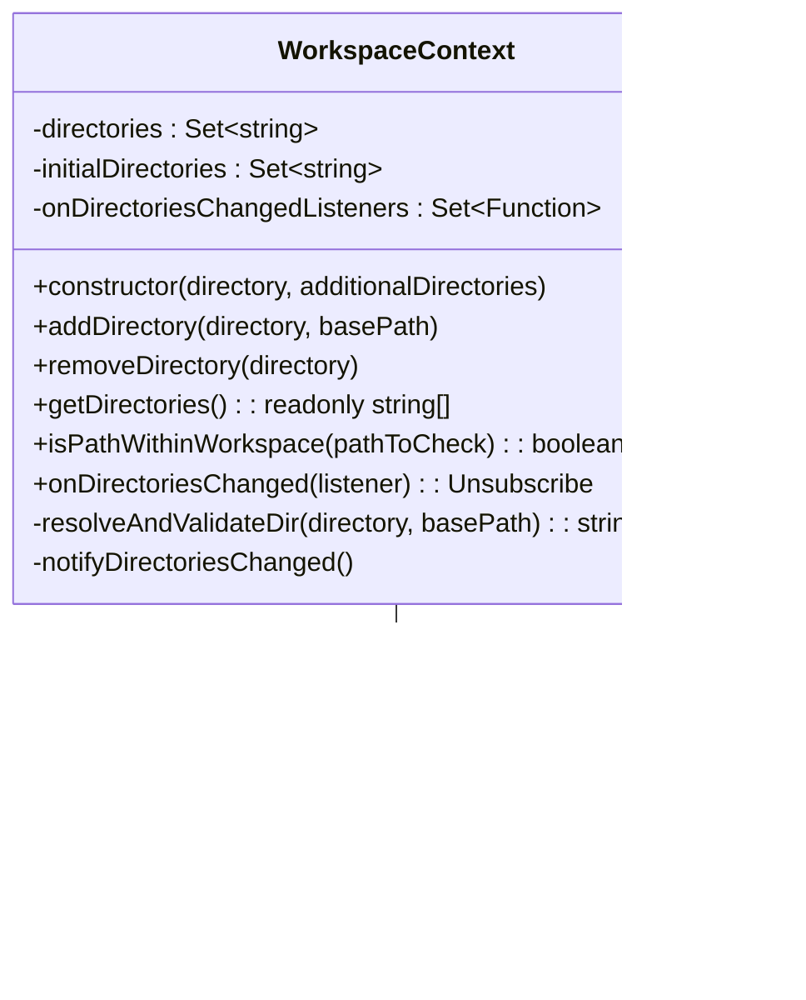

# qwen-code上下文管理系统

<cite>
**本文档中引用的文件**
- [client.ts](file://packages/core/src/core/client.ts)
- [workspaceContext.ts](file://packages/core/src/utils/workspaceContext.ts)
- [fileDiscoveryService.ts](file://packages/core/src/services/fileDiscoveryService.ts)
- [crawlCache.ts](file://packages/core/src/utils/filesearch/crawlCache.ts)
- [memoryDiscovery.ts](file://packages/core/src/utils/memoryDiscovery.ts)
- [settingsSchema.ts](file://packages/cli/src/config/settingsSchema.ts)
- [stdin-context.test.ts](file://integration-tests/stdin-context.test.ts)
</cite>

## 目录
1. [简介](#简介)
2. [项目架构概览](#项目架构概览)
3. [核心组件分析](#核心组件分析)
4. [client.ts上下文管理机制](#clientts上下文管理机制)
5. [workspaceContext工作区状态跟踪](#workspacecontext工作区状态跟踪)
6. [fileDiscoveryService代码库索引](#filediscoveryservice代码库索引)
7. [crawlCache缓存策略](#crawlcachecache策略)
8. [memoryDiscovery上下文发现](#memorydiscovery上下文发现)
9. [配置与调优](#配置与调优)
10. [性能优化与最佳实践](#性能优化与最佳实践)
11. [故障排除指南](#故障排除指南)
12. [总结](#总结)

## 简介

qwen-code上下文管理系统是一个复杂而精密的架构，专门设计用于在大型代码库环境中维护跨文件的上下文一致性。该系统通过多个相互协作的组件，实现了高效的代码理解、模块依赖分析和符号解析功能。

系统的核心目标是在保持高性能的同时，为AI模型提供准确、完整的代码上下文信息。这包括处理复杂的跨文件引用关系、管理大规模项目的内存使用，以及在超大代码库中实现智能的分页加载策略。

## 项目架构概览


**图表来源**
- [client.ts](file://packages/core/src/core/client.ts#L1-L50)
- [workspaceContext.ts](file://packages/core/src/utils/workspaceContext.ts#L1-L30)
- [fileDiscoveryService.ts](file://packages/core/src/services/fileDiscoveryService.ts#L1-L30)

## 核心组件分析

### 系统架构设计原则

qwen-code上下文管理系统采用了分层架构设计，每一层都有明确的职责分工：

1. **客户端层（Client Layer）**：负责与AI模型的交互和上下文管理
2. **服务层（Service Layer）**：提供各种核心服务功能
3. **缓存层（Cache Layer）**：优化性能的关键组件
4. **发现层（Discovery Layer）**：智能的文件和内容发现机制
5. **配置层（Configuration Layer）**：灵活的配置管理系统

### 组件间依赖关系


**图表来源**
- [client.ts](file://packages/core/src/core/client.ts#L70-L120)
- [workspaceContext.ts](file://packages/core/src/utils/workspaceContext.ts#L15-L50)
- [fileDiscoveryService.ts](file://packages/core/src/services/fileDiscoveryService.ts#L15-L40)
- [crawlCache.ts](file://packages/core/src/utils/filesearch/crawlCache.ts#L8-L25)

**章节来源**
- [client.ts](file://packages/core/src/core/client.ts#L1-L100)
- [workspaceContext.ts](file://packages/core/src/utils/workspaceContext.ts#L1-L50)
- [fileDiscoveryService.ts](file://packages/core/src/services/fileDiscoveryService.ts#L1-L50)

## client.ts上下文管理机制

### 客户端核心架构

GeminiClient是整个上下文管理系统的核心组件，负责维护与AI模型的会话状态和上下文信息。


**图表来源**
- [client.ts](file://packages/core/src/core/client.ts#L400-L500)

### IDE上下文同步机制

client.ts实现了智能的IDE上下文同步机制，能够区分全量更新和增量更新：

```typescript
// 全量上下文发送逻辑
private getIdeContextParts(forceFullContext: boolean): {
  contextParts: string[];
  newIdeContext: IdeContext | undefined;
} {
  const currentIdeContext = ideContext.getIdeContext();
  
  if (forceFullContext || !this.lastSentIdeContext) {
    // 发送完整上下文作为JSON
    const openFiles = currentIdeContext.workspaceState?.openFiles || [];
    const activeFile = openFiles.find((f) => f.isActive);
    const otherOpenFiles = openFiles
      .filter((f) => !f.isActive)
      .map((f) => f.path);
    
    // 构建JSON格式的上下文数据
    const contextData: Record<string, unknown> = {};
    // ... 上下文构建逻辑
  } else {
    // 计算并发送增量变更
    const delta: Record<string, unknown> = {};
    const changes: Record<string, unknown> = {};
    
    // 检测文件打开/关闭事件
    const openedFiles: string[] = [];
    for (const [path] of currentFiles.entries()) {
      if (!lastFiles.has(path)) {
        openedFiles.push(path);
      }
    }
    
    // 检测活动文件变更
    if (currentActiveFile) {
      if (!lastActiveFile || lastActiveFile.path !== currentActiveFile.path) {
        changes['activeFileChanged'] = { /* 变更详情 */ };
      }
    }
    
    // 返回增量JSON
    delta['changes'] = changes;
    return { contextParts, newIdeContext: currentIdeContext };
  }
}
```

### 聊天历史压缩机制

为了优化性能和控制token使用，client.ts实现了智能的聊天历史压缩机制：


**图表来源**
- [client.ts](file://packages/core/src/core/client.ts#L400-L500)

**章节来源**
- [client.ts](file://packages/core/src/core/client.ts#L300-L600)

## workspaceContext工作区状态跟踪

### 工作区上下文管理器

WorkspaceContext类提供了多目录工作区的统一管理能力，支持动态添加和验证工作区目录。



**图表来源**
- [workspaceContext.ts](file://packages/core/src/utils/workspaceContext.ts#L15-L50)

### 路径验证和安全机制

workspaceContext实现了严格的路径验证机制，确保只有合法的工作区目录被包含：

```typescript
// 路径解析和验证逻辑
private resolveAndValidateDir(
  directory: string,
  basePath: string = process.cwd(),
): string {
  const absolutePath = path.isAbsolute(directory)
    ? directory
    : path.resolve(basePath, directory);

  if (!fs.existsSync(absolutePath)) {
    throw new Error(`Directory does not exist: ${absolutePath}`);
  }
  const stats = fs.statSync(absolutePath);
  if (!stats.isDirectory()) {
    throw new Error(`Path is not a directory: ${absolutePath}`);
  }

  return fs.realpathSync(absolutePath);
}

// 路径安全性检查
private isPathWithinRoot(
  pathToCheck: string,
  rootDirectory: string,
): boolean {
  const relative = path.relative(rootDirectory, pathToCheck);
  return (
    !relative.startsWith(`..${path.sep}`) &&
    relative !== '..' &&
    !path.isAbsolute(relative)
  );
}
```

### 动态监听机制

workspaceContext支持动态监听工作区变化，这对于实时更新上下文信息至关重要：

```typescript
// 监听器注册和通知机制
onDirectoriesChanged(listener: () => void): Unsubscribe {
  this.onDirectoriesChangedListeners.add(listener);
  return () => {
    this.onDirectoriesChangedListeners.delete(listener);
  };
}

private notifyDirectoriesChanged() {
  // 迭代副本以防止监听器修改集合
  for (const listener of [...this.onDirectoriesChangedListeners]) {
    try {
      listener();
    } catch (e) {
      // 防止单个监听器错误影响其他监听器
      console.error('Error in WorkspaceContext listener:', e);
    }
  }
}
```

**章节来源**
- [workspaceContext.ts](file://packages/core/src/utils/workspaceContext.ts#L1-L200)

## fileDiscoveryService代码库索引

### 文件发现服务架构

fileDiscoveryService负责高效地索引代码库结构，支持多种忽略规则和过滤选项。


**图表来源**
- [fileDiscoveryService.ts](file://packages/core/src/services/fileDiscoveryService.ts#L15-L40)

### 多层次忽略规则

fileDiscoveryService实现了多层次的文件过滤机制：

```typescript
// 统一的文件过滤方法
filterFiles(
  filePaths: string[],
  options: FilterFilesOptions = {
    respectGitIgnore: true,
    respectGeminiIgnore: true,
  },
): string[] {
  return filePaths.filter((filePath) => {
    if (options.respectGitIgnore && this.shouldGitIgnoreFile(filePath)) {
      return false;
    }
    if (options.respectGeminiIgnore && this.shouldGeminiIgnoreFile(filePath)) {
      return false;
    }
    return true;
  });
}

// Git忽略规则检查
shouldGitIgnoreFile(filePath: string): boolean {
  if (this.gitIgnoreFilter) {
    return this.gitIgnoreFilter.isIgnored(filePath);
  }
  return false;
}

// Gemini忽略规则检查
shouldGeminiIgnoreFile(filePath: string): boolean {
  if (this.geminiIgnoreFilter) {
    return this.geminiIgnoreFilter.isIgnored(filePath);
  }
  return false;
}
```

### 初始化和配置

fileDiscoveryService在初始化时会自动检测Git仓库并加载相应的忽略规则：

```typescript
constructor(projectRoot: string) {
  this.projectRoot = path.resolve(projectRoot);
  
  // 检测Git仓库并加载Git忽略规则
  if (isGitRepository(this.projectRoot)) {
    const parser = new GitIgnoreParser(this.projectRoot);
    try {
      parser.loadGitRepoPatterns();
    } catch (_error) {
      // 忽略文件不存在的情况
    }
    this.gitIgnoreFilter = parser;
  }
  
  // 加载Gemini特定的忽略规则
  const gParser = new GitIgnoreParser(this.projectRoot);
  try {
    gParser.loadPatterns(GEMINI_IGNORE_FILE_NAME);
  } catch (_error) {
    // 忽略文件不存在的情况
  }
  this.geminiIgnoreFilter = gParser;
}
```

**章节来源**
- [fileDiscoveryService.ts](file://packages/core/src/services/fileDiscoveryService.ts#L1-L113)

## crawlCache缓存策略

### 缓存系统架构

crawlCache实现了基于内存的智能缓存系统，显著提升了大型项目中的文件发现性能。


**图表来源**
- [crawlCache.ts](file://packages/core/src/utils/filesearch/crawlCache.ts#L8-L25)

### 缓存键生成策略

crawlCache使用SHA-256哈希算法生成唯一的缓存键，确保缓存的有效性和一致性：

```typescript
export const getCacheKey = (
  directory: string,
  ignoreContent: string,
  maxDepth?: number,
): string => {
  const hash = crypto.createHash('sha256');
  hash.update(directory);
  hash.update(ignoreContent);
  if (maxDepth !== undefined) {
    hash.update(String(maxDepth));
  }
  return hash.digest('hex');
};
```

### TTL管理和自动清理

缓存系统实现了基于时间的过期机制，确保缓存不会无限增长：

```typescript
export const write = (key: string, results: string[], ttlMs: number): void => {
  // 清除现有定时器以防止提前删除
  if (cacheTimers.has(key)) {
    clearTimeout(cacheTimers.get(key)!);
  }

  // 存储新的数据
  crawlCache.set(key, results);

  // 设置定时器在TTL后自动删除缓存条目
  const timerId = setTimeout(() => {
    crawlCache.delete(key);
    cacheTimers.delete(key);
  }, ttlMs);

  // 存储定时器句柄以便更新时清除
  cacheTimers.set(key, timerId);
};
```

### 缓存命中率优化


**图表来源**
- [crawlCache.ts](file://packages/core/src/utils/filesearch/crawlCache.ts#L30-L50)

### 性能优化特性

1. **智能键生成**：基于项目目录、忽略规则内容和最大深度生成唯一键
2. **自动过期**：基于TTL的时间自动清理机制
3. **内存效率**：使用Map数据结构提供O(1)的查找性能
4. **并发安全**：支持高并发访问场景

**章节来源**
- [crawlCache.ts](file://packages/core/src/utils/filesearch/crawlCache.ts#L1-L70)

## memoryDiscovery上下文发现

### 层次化记忆发现机制

memoryDiscovery实现了智能的层次化上下文发现机制，能够从多个层级自动发现和整合上下文信息。


**图表来源**
- [memoryDiscovery.ts](file://packages/core/src/utils/memoryDiscovery.ts#L150-L250)

### 项目根目录检测

memoryDiscovery实现了智能的项目根目录检测机制：

```typescript
async function findProjectRoot(startDir: string): Promise<string | null> {
  let currentDir = path.resolve(startDir);
  while (true) {
    const gitPath = path.join(currentDir, '.git');
    try {
      const stats = await fs.lstat(gitPath);
      if (stats.isDirectory()) {
        return currentDir;
      }
    } catch (error: unknown) {
      // 处理ENOENT错误（预期行为）
      const isENOENT =
        typeof error === 'object' &&
        error !== null &&
        'code' in error &&
        (error as { code: string }).code === 'ENOENT';
      
      if (!isENOENT && !isTestEnv) {
        // 记录意外错误
        logger.warn(`Error checking for .git directory: ${String(error)}`);
      }
    }
    
    const parentDir = path.dirname(currentDir);
    if (parentDir === currentDir) {
      return null; // 到达根目录
    }
    currentDir = parentDir;
  }
}
```

### 并发文件处理

memoryDiscovery使用并发限制机制来处理大量文件，避免EMFILE错误：

```typescript
// 并发限制设置
const CONCURRENT_LIMIT = 10;

// 批量处理目录
for (let i = 0; i < dirsArray.length; i += CONCURRENT_LIMIT) {
  const batch = dirsArray.slice(i, i + CONCURRENT_LIMIT);
  const batchPromises = batch.map((dir) =>
    getGeminiMdFilePathsInternalForEachDir(
      dir,
      userHomePath,
      debugMode,
      fileService,
      extensionContextFilePaths,
      fileFilteringOptions,
      maxDirs,
    ),
  );

  const batchResults = await Promise.allSettled(batchPromises);
  
  for (const result of batchResults) {
    if (result.status === 'fulfilled') {
      pathsArrays.push(result.value);
    } else {
      const error = result.reason;
      const message = error instanceof Error ? error.message : String(error);
      logger.error(`Error discovering files in directory: ${message}`);
    }
  }
}
```

### 导入处理和内容合并

```typescript
// 导入处理和内容合并
async function readGeminiMdFiles(
  filePaths: string[],
  debugMode: boolean,
  importFormat: 'flat' | 'tree' = 'tree',
): Promise<GeminiFileContent[]> {
  const CONCURRENT_LIMIT = 20; // 更高的并发限制用于文件读取
  const results: GeminiFileContent[] = [];

  for (let i = 0; i < filePaths.length; i += CONCURRENT_LIMIT) {
    const batch = filePaths.slice(i, i + CONCURRENT_LIMIT);
    const batchPromises = batch.map(
      async (filePath): Promise<GeminiFileContent> => {
        try {
          const content = await fs.readFile(filePath, 'utf-8');
          
          // 处理内容中的导入指令
          const processedResult = await processImports(
            content,
            path.dirname(filePath),
            debugMode,
            undefined,
            undefined,
            importFormat,
          );
          
          return { filePath, content: processedResult.content };
        } catch (error: unknown) {
          // 错误处理和日志记录
          const message = error instanceof Error ? error.message : String(error);
          logger.warn(`Could not read QWEN.md file: ${message}`);
          return { filePath, content: null };
        }
      },
    );

    // 处理批次结果
    const batchResults = await Promise.allSettled(batchPromises);
    for (const result of batchResults) {
      if (result.status === 'fulfilled') {
        results.push(result.value);
      }
    }
  }

  return results;
}
```

**章节来源**
- [memoryDiscovery.ts](file://packages/core/src/utils/memoryDiscovery.ts#L1-L408)

## 配置与调优

### 上下文配置架构

系统提供了丰富的配置选项来调整上下文范围和深度：


**图表来源**
- [settingsSchema.ts](file://packages/cli/src/config/settingsSchema.ts#L400-L500)

### 关键配置参数详解

#### 1. 包含目录配置
```typescript
// 额外包含的目录列表
includeDirectories: {
  type: 'array',
  label: 'Include Directories',
  category: 'Context',
  requiresRestart: false,
  default: [] as string[],
  description: 'Additional directories to include in the workspace context. Missing directories will be skipped with a warning.',
}
```

#### 2. 文件发现限制
```typescript
// 文件发现的最大目录数
discoveryMaxDirs: {
  type: 'number',
  label: 'Memory Discovery Max Dirs',
  category: 'Context',
  requiresRestart: false,
  default: 200,
  description: 'Maximum number of directories to search for memory.',
}
```

#### 3. 文件过滤配置
```typescript
fileFiltering: {
  respectGitIgnore: {
    type: 'boolean',
    label: 'Respect .gitignore',
    category: 'Context',
    requiresRestart: true,
    default: true,
    description: 'Respect .gitignore files when searching',
  },
  respectGeminiIgnore: {
    type: 'boolean',
    label: 'Respect .qwenignore',
    category: 'Context',
    requiresRestart: true,
    default: true,
    description: 'Respect .qwenignore files when searching',
  },
}
```

### 实际配置示例

以下是一个典型的生产环境配置示例：

```json
{
  "context": {
    "includeDirectories": [
      "/project/src",
      "/project/tests",
      "/shared/utils"
    ],
    "loadMemoryFromIncludeDirectories": true,
    "discoveryMaxDirs": 500,
    "fileFiltering": {
      "respectGitIgnore": true,
      "respectGeminiIgnore": true,
      "enableRecursiveFileSearch": true,
      "disableFuzzySearch": false
    },
    "importFormat": "tree"
  }
}
```

**章节来源**
- [settingsSchema.ts](file://packages/cli/src/config/settingsSchema.ts#L400-L500)

## 性能优化与最佳实践

### 内存优化策略

#### 1. 分页加载机制
对于超大代码库，系统实现了智能的分页加载策略：


#### 2. 缓存策略优化
```typescript
// 智能缓存配置
const cacheConfig = {
  // 基础TTL设置
  defaultTTL: 300000, // 5分钟
  
  // 不同场景下的TTL调整
  shortTermTTL: 60000, // 1分钟（频繁变更的文件）
  longTermTTL: 1800000, // 30分钟（稳定文件）
  
  // 缓存大小限制
  maxSize: 1000,
  maxMemoryUsage: '512MB'
};
```

### 并发处理优化

#### 1. 并发限制机制
```typescript
// 并发处理配置
const concurrentConfig = {
  // 目录扫描并发数
  directoryScanConcurrency: 10,
  
  // 文件读取并发数
  fileReadConcurrency: 20,
  
  // 内存处理并发数
  memoryProcessingConcurrency: 5,
  
  // 网络请求并发数
  networkRequestConcurrency: 3
};
```

#### 2. 资源池管理
```typescript
// 资源池实现
class ResourcePool<T> {
  private pool: T[] = [];
  private factory: () => T;
  
  async acquire(): Promise<T> {
    if (this.pool.length > 0) {
      return this.pool.pop()!;
    }
    return this.factory();
  }
  
  release(resource: T): void {
    if (this.pool.length < this.maxPoolSize) {
      this.pool.push(resource);
    }
  }
}
```

### 上下文边界管理

#### 1. 上下文大小控制
```typescript
// 上下文大小限制
const contextLimits = {
  // 单个文件最大大小
  maxFileSize: 1048576, // 1MB
  
  // 单个上下文块最大大小
  maxContextChunk: 524288, // 512KB
  
  // 总上下文大小限制
  maxTotalContext: 2097152, // 2MB
  
  // 压缩阈值
  compressionThreshold: 0.7, // 70%
  
  // 保留比例
  compressionPreserveRatio: 0.3 // 30%
};
```

#### 2. 智能裁剪策略
```typescript
// 上下文裁剪算法
function smartContextTrimming(context: string, targetSize: number): string {
  const chunks = splitIntoChunks(context, contextLimits.maxContextChunk);
  
  // 如果总大小超过限制，按重要性排序裁剪
  if (calculateTotalSize(chunks) > targetSize) {
    const sortedChunks = chunks.sort((a, b) => 
      calculateImportance(a) - calculateImportance(b)
    );
    
    // 移除最不重要的部分直到达到目标大小
    while (calculateTotalSize(sortedChunks) > targetSize && sortedChunks.length > 1) {
      sortedChunks.pop(); // 移除最不重要的块
    }
    
    return mergeChunks(sortedChunks);
  }
  
  return context;
}
```

## 故障排除指南

### 常见问题诊断

#### 1. 缓存失效问题


#### 2. 内存泄漏排查
```typescript
// 内存监控工具
class MemoryMonitor {
  private snapshots: Map<string, number> = new Map();
  
  snapshot(label: string): void {
    const heapUsed = process.memoryUsage().heapUsed;
    this.snapshots.set(label, heapUsed);
  }
  
  compareSnapshots(before: string, after: string): number {
    const beforeMem = this.snapshots.get(before) || 0;
    const afterMem = this.snapshots.get(after) || 0;
    return afterMem - beforeMem;
  }
  
  diagnoseLeak(): string {
    // 分析内存增长趋势
    const growths = Array.from(this.snapshots.entries())
      .sort((a, b) => a[0].localeCompare(b[0]))
      .map(([label, mem], index, arr) => {
        if (index === 0) return 0;
        return mem - arr[index - 1][1];
      });
    
    const totalGrowth = growths.reduce((sum, val) => sum + val, 0);
    return `Memory leak detected: ${totalGrowth} bytes increase`;
  }
}
```

#### 3. 性能瓶颈识别
```typescript
// 性能分析工具
class PerformanceAnalyzer {
  static async analyzeFileDiscovery(): Promise<AnalysisResult> {
    const startTime = Date.now();
    const results = await fileDiscoveryService.discoverFiles();
    const endTime = Date.now();
    
    return {
      duration: endTime - startTime,
      fileCount: results.length,
      averageTimePerFile: (endTime - startTime) / results.length,
      bottleneck: this.identifyBottleneck(startTime, endTime, results)
    };
  }
  
  private static identifyBottleneck(
    start: number, 
    end: number, 
    results: string[]
  ): Bottleneck {
    // 分析性能瓶颈
    const duration = end - start;
    const avgTime = duration / results.length;
    
    if (avgTime > 100) {
      return { type: 'slowFileRead', severity: 'high' };
    } else if (duration > 5000) {
      return { type: 'longOperation', severity: 'medium' };
    }
    
    return { type: 'unknown', severity: 'low' };
  }
}
```

### 调试和监控

#### 1. 启用调试模式
```typescript
// 调试配置
const debugConfig = {
  enableDebugMode: true,
  logLevel: 'debug',
  traceMemoryUsage: true,
  monitorCachePerformance: true,
  logContextChanges: true
};
```

#### 2. 监控指标收集
```typescript
// 监控指标接口
interface ContextMetrics {
  cacheHitRate: number;
  averageResponseTime: number;
  memoryUsage: number;
  fileDiscoveryTime: number;
  contextSize: number;
  errorRate: number;
}

// 指标收集器
class MetricsCollector {
  collectMetrics(): ContextMetrics {
    return {
      cacheHitRate: this.calculateCacheHitRate(),
      averageResponseTime: this.calculateAverageResponseTime(),
      memoryUsage: process.memoryUsage().heapUsed,
      fileDiscoveryTime: this.getFileDiscoveryTime(),
      contextSize: this.getContextSize(),
      errorRate: this.calculateErrorRate()
    };
  }
}
```

**章节来源**
- [stdin-context.test.ts](file://integration-tests/stdin-context.test.ts#L1-L50)

## 总结

qwen-code上下文管理系统是一个高度优化的复杂系统，通过精心设计的架构和算法，在保持高性能的同时提供了强大的上下文管理能力。

### 主要优势

1. **智能缓存策略**：基于SHA-256哈希的缓存键生成和TTL管理，显著提升大型项目性能
2. **多层次过滤**：支持Git忽略规则和Gemini特定忽略规则的双重过滤机制
3. **并发优化**：智能的并发限制和资源池管理，避免系统资源耗尽
4. **内存管理**：分页加载和智能裁剪策略，有效控制内存使用
5. **可配置性**：丰富的配置选项，适应不同规模和需求的项目

### 技术创新点

- **增量上下文同步**：仅传输变更的上下文信息，减少不必要的网络传输
- **层次化记忆发现**：自动从多个层级发现和整合上下文信息
- **智能压缩机制**：根据内容重要性进行智能压缩，保持关键信息完整性
- **动态监听机制**：实时监听工作区变化，确保上下文信息的时效性

### 应用场景

该系统特别适用于：
- 大型开源项目开发
- 多团队协作的复杂项目
- 需要精确代码理解的AI辅助开发场景
- 跨文件引用和模块依赖分析

通过合理配置和优化，qwen-code上下文管理系统能够在各种规模的项目中提供卓越的性能和用户体验。