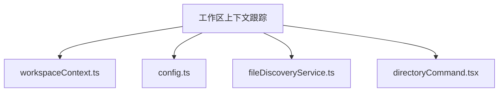
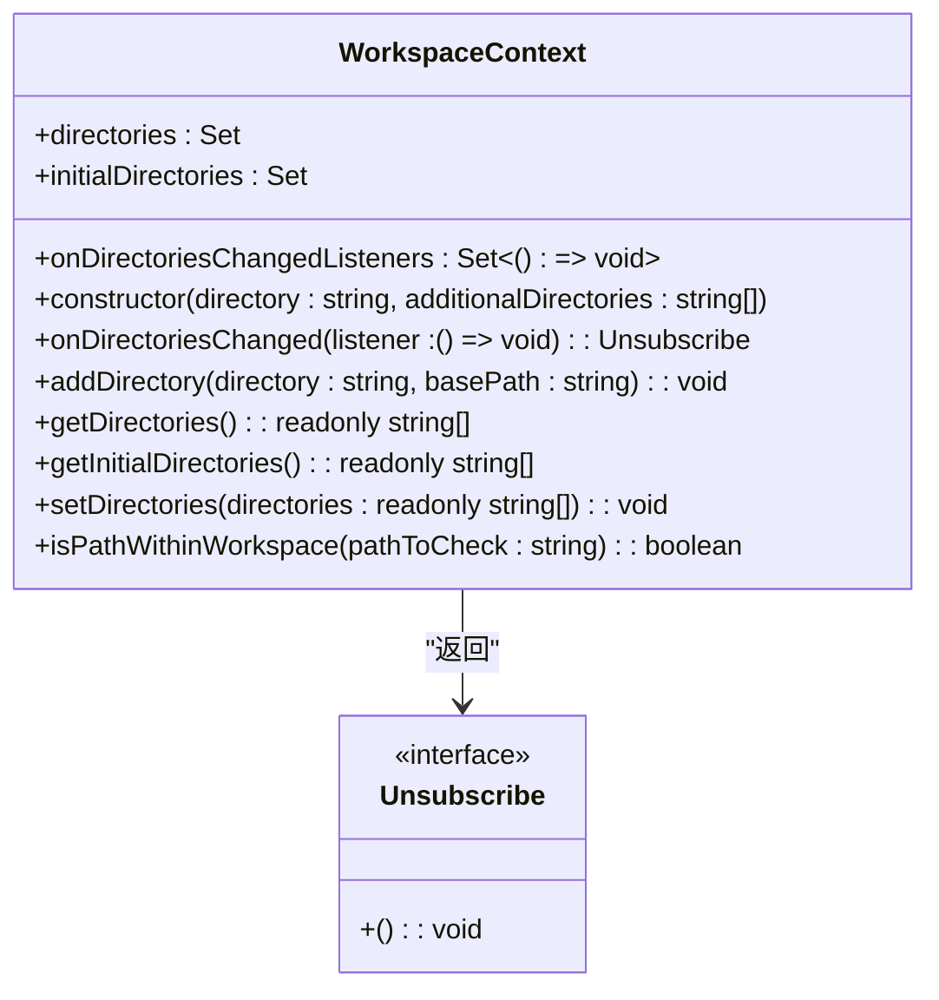
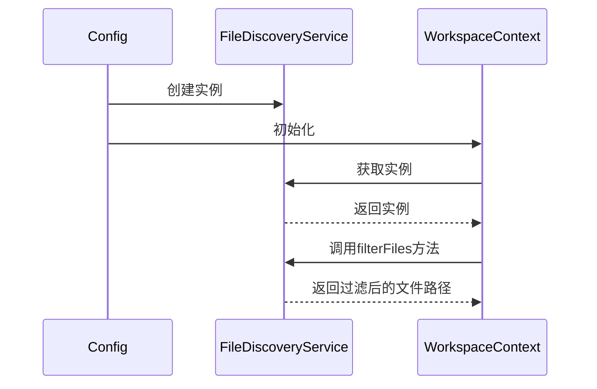
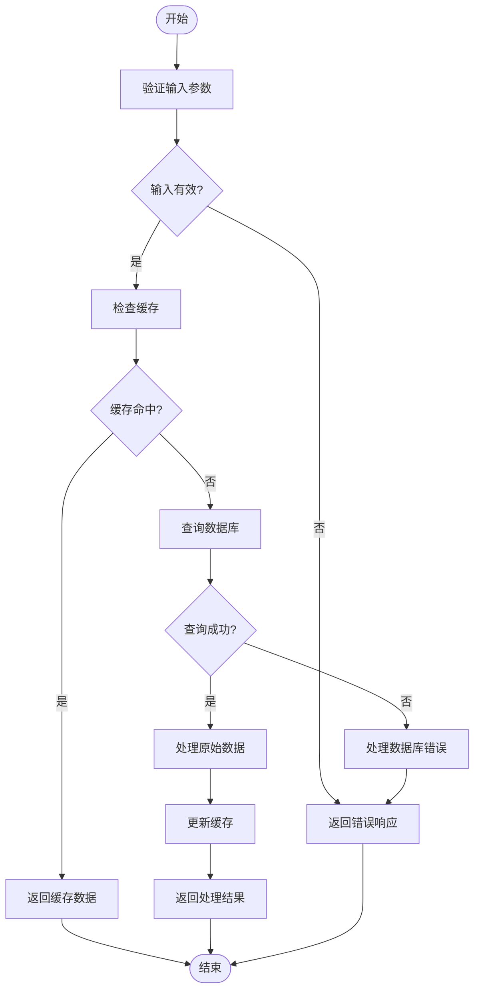
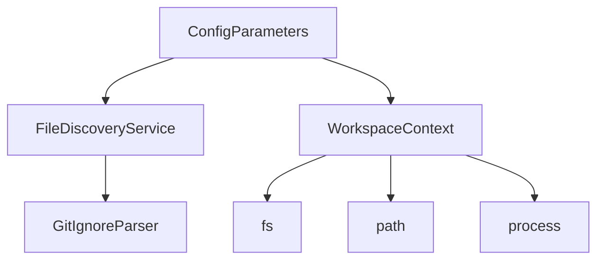

# 工作区上下文跟踪

<cite>
**本文档中引用的文件**  
- [workspaceContext.ts](file://packages/core/src/utils/workspaceContext.ts)
- [config.ts](file://packages/core/src/config/config.ts)
- [fileDiscoveryService.ts](file://packages/core/src/services/fileDiscoveryService.ts)
- [directoryCommand.tsx](file://packages/cli/src/ui/commands/directoryCommand.tsx)
</cite>

## 目录
1. [介绍](#介绍)
2. [项目结构](#项目结构)
3. [核心组件](#核心组件)
4. [架构概述](#架构概述)
5. [详细组件分析](#详细组件分析)
6. [依赖分析](#依赖分析)
7. [性能考虑](#性能考虑)
8. [故障排除指南](#故障排除指南)
9. [结论](#结论)
10. [附录](#附录)（如有必要）

## 介绍
工作区上下文跟踪机制是qwen-code系统的核心功能之一，它负责维护当前项目的状态信息并确保跨组件的数据一致性。该机制通过WorkspaceContext类管理多个工作区目录，验证路径的有效性，并在目录发生变化时通知监听器。这种设计允许CLI在单个会话中操作来自多个目录的文件，同时保持上下文的一致性和完整性。

## 项目结构
qwen-code项目的目录结构清晰地组织了各个功能模块，其中核心的上下文跟踪功能位于`packages/core/src/utils`目录下的`workspaceContext.ts`文件中。该文件定义了WorkspaceContext类，负责管理多个工作区目录并验证路径的有效性。相关的配置参数和集成服务则分布在`config.ts`和`fileDiscoveryService.ts`等文件中。



**图示来源**
- [workspaceContext.ts](file://packages/core/src/utils/workspaceContext.ts)
- [config.ts](file://packages/core/src/config/config.ts)
- [fileDiscoveryService.ts](file://packages/core/src/services/fileDiscoveryService.ts)
- [directoryCommand.tsx](file://packages/cli/src/ui/commands/directoryCommand.tsx)

**章节来源**
- [workspaceContext.ts](file://packages/core/src/utils/workspaceContext.ts)
- [config.ts](file://packages/core/src/config/config.ts)

## 核心组件
工作区上下文跟踪机制的核心组件包括WorkspaceContext类、ConfigParameters接口以及FileDiscoveryService类。这些组件协同工作，确保系统能够正确地管理多个工作区目录，验证路径的有效性，并在目录发生变化时通知所有相关的监听器。

**章节来源**
- [workspaceContext.ts](file://packages/core/src/utils/workspaceContext.ts)
- [config.ts](file://packages/core/src/config/config.ts)
- [fileDiscoveryService.ts](file://packages/core/src/services/fileDiscoveryService.ts)

## 架构概述
工作区上下文跟踪机制的架构设计旨在提供一个灵活且可扩展的解决方案，以管理多个工作区目录并确保上下文的一致性。该机制通过WorkspaceContext类管理多个工作区目录，并通过ConfigParameters接口与FileDiscoveryService类集成，实现对工作区元数据的存储和更新。

```mermaid
classDiagram
class WorkspaceContext {
+directories : Set<string>
+initialDirectories : Set<string>
+onDirectoriesChangedListeners : Set<() => void>
+constructor(directory : string, additionalDirectories : string[])
+onDirectoriesChanged(listener : () => void) : Unsubscribe
+addDirectory(directory : string, basePath : string) : void
+getDirectories() : readonly string[]
+getInitialDirectories() : readonly string[]
+setDirectories(directories : readonly string[]) : void
+isPathWithinWorkspace(pathToCheck : string) : boolean
}
class ConfigParameters {
+sessionId : string
+embeddingModel? : string
+sandbox? : SandboxConfig
+targetDir : string
+debugMode : boolean
+question? : string
+fullContext? : boolean
+coreTools? : string[]
+allowedTools? : string[]
+excludeTools? : string[]
+toolDiscoveryCommand? : string
+toolCallCommand? : string
+mcpServerCommand? : string
+mcpServers? : Record<string, MCPServerConfig>
+userMemory? : string
+geminiMdFileCount? : number
+approvalMode? : ApprovalMode
+showMemoryUsage? : boolean
+contextFileName? : string | string[]
+accessibility? : AccessibilitySettings
+telemetry? : TelemetrySettings
+gitCoAuthor? : GitCoAuthorSettings
+usageStatisticsEnabled? : boolean
+fileFiltering? : FileFilteringOptions
+checkpointing? : boolean
+proxy? : string
+cwd : string
+fileDiscoveryService? : FileDiscoveryService
+includeDirectories? : string[]
+bugCommand? : BugCommandSettings
+model : string
+extensionContextFilePaths? : string[]
+maxSessionTurns? : number
+sessionTokenLimit? : number
+experimentalZedIntegration? : boolean
+listExtensions? : boolean
+extensions? : GeminiCLIExtension[]
+blockedMcpServers? : Array<{ name : string; extensionName : string }>
+noBrowser? : boolean
+summarizeToolOutput? : Record<string, SummarizeToolOutputSettings>
+folderTrustFeature? : boolean
+folderTrust? : boolean
+ideMode? : boolean
+enableOpenAILogging? : boolean
+systemPromptMappings? : Array<{ baseUrls : string[]; modelNames : string[]; template : string }>
+authType? : AuthType
+contentGenerator? : ContentGeneratorConfig
+cliVersion? : string
+loadMemoryFromIncludeDirectories? : boolean
+tavilyApiKey? : string
+chatCompression? : ChatCompressionSettings
+interactive? : boolean
+trustedFolder? : boolean
+useRipgrep? : boolean
+shouldUseNodePtyShell? : boolean
+skipNextSpeakerCheck? : boolean
+extensionManagement? : boolean
+enablePromptCompletion? : boolean
+skipLoopDetection? : boolean
+vlmSwitchMode? : string
}
class FileDiscoveryService {
+gitIgnoreFilter : GitIgnoreFilter | null
+geminiIgnoreFilter : GitIgnoreFilter | null
+projectRoot : string
+constructor(projectRoot : string)
+filterFiles(filePaths : string[], options : FilterFilesOptions) : string[]
+shouldGitIgnoreFile(filePath : string) : boolean
+shouldGeminiIgnoreFile(filePath : string) : boolean
+shouldIgnoreFile(filePath : string, options : FilterFilesOptions) : boolean
+getGeminiIgnorePatterns() : string[]
}
WorkspaceContext --> ConfigParameters : "使用"
ConfigParameters --> FileDiscoveryService : "集成"
```

**图示来源**
- [workspaceContext.ts](file://packages/core/src/utils/workspaceContext.ts)
- [config.ts](file://packages/core/src/config/config.ts)
- [fileDiscoveryService.ts](file://packages/core/src/services/fileDiscoveryService.ts)

## 详细组件分析
### WorkspaceContext分析
WorkspaceContext类是工作区上下文跟踪机制的核心，它负责管理多个工作区目录并验证路径的有效性。该类提供了添加、获取和设置工作区目录的方法，并在目录发生变化时通知所有注册的监听器。

#### 对象导向组件


**图示来源**
- [workspaceContext.ts](file://packages/core/src/utils/workspaceContext.ts)

**章节来源**
- [workspaceContext.ts](file://packages/core/src/utils/workspaceContext.ts)

### ConfigParameters与FileDiscoveryService集成
ConfigParameters接口定义了配置参数，其中包括fileDiscoveryService属性，用于与FileDiscoveryService类集成。这种集成方式使得系统能够在初始化时创建FileDiscoveryService实例，并在需要时使用它来过滤文件路径。

#### API/服务组件


**图示来源**
- [config.ts](file://packages/core/src/config/config.ts)
- [fileDiscoveryService.ts](file://packages/core/src/services/fileDiscoveryService.ts)

**章节来源**
- [config.ts](file://packages/core/src/config/config.ts)
- [fileDiscoveryService.ts](file://packages/core/src/services/fileDiscoveryService.ts)

### 上下文一致性保障机制
为了确保上下文的一致性，系统采用了多种机制，包括监听器模式、路径验证和错误处理。当工作区目录发生变化时，所有注册的监听器都会被调用，从而确保所有相关组件都能及时更新其状态。

#### 复杂逻辑组件


**图示来源**
- [workspaceContext.ts](file://packages/core/src/utils/workspaceContext.ts)

**章节来源**
- [workspaceContext.ts](file://packages/core/src/utils/workspaceContext.ts)

## 依赖分析
工作区上下文跟踪机制依赖于多个核心组件和服务，包括ConfigParameters、FileDiscoveryService和WorkspaceContext。这些组件之间的依赖关系确保了系统的稳定性和可扩展性。



**图示来源**
- [config.ts](file://packages/core/src/config/config.ts)
- [fileDiscoveryService.ts](file://packages/core/src/services/fileDiscoveryService.ts)
- [workspaceContext.ts](file://packages/core/src/utils/workspaceContext.ts)

**章节来源**
- [config.ts](file://packages/core/src/config/config.ts)
- [fileDiscoveryService.ts](file://packages/core/src/services/fileDiscoveryService.ts)
- [workspaceContext.ts](file://packages/core/src/utils/workspaceContext.ts)

## 性能考虑
在设计工作区上下文跟踪机制时，性能是一个重要的考虑因素。系统通过使用Set数据结构来存储目录，确保了高效的查找和去重操作。此外，路径验证和监听器调用也被优化，以减少不必要的计算和I/O操作。

## 故障排除指南
当遇到工作区上下文跟踪相关的问题时，可以参考以下步骤进行排查：
1. 检查工作区目录是否存在且可读。
2. 确认路径是否正确解析为绝对路径。
3. 验证监听器是否正确注册和调用。
4. 检查FileDiscoveryService是否正确初始化并过滤文件路径。

**章节来源**
- [workspaceContext.ts](file://packages/core/src/utils/workspaceContext.ts)
- [config.ts](file://packages/core/src/config/config.ts)
- [fileDiscoveryService.ts](file://packages/core/src/services/fileDiscoveryService.ts)

## 结论
工作区上下文跟踪机制是qwen-code系统中不可或缺的一部分，它通过灵活的设计和高效的实现，确保了跨组件的数据一致性和上下文完整性。通过对核心组件的深入分析和对集成方式的详细说明，本文档为开发者提供了全面的理解和指导，以便更好地利用这一机制来支持自定义功能。

## 附录
### 扩展上下文属性
开发者可以通过扩展ConfigParameters接口来支持自定义功能。例如，可以添加新的配置参数或修改现有参数的行为，以满足特定的需求。

**章节来源**
- [config.ts](file://packages/core/src/config/config.ts)