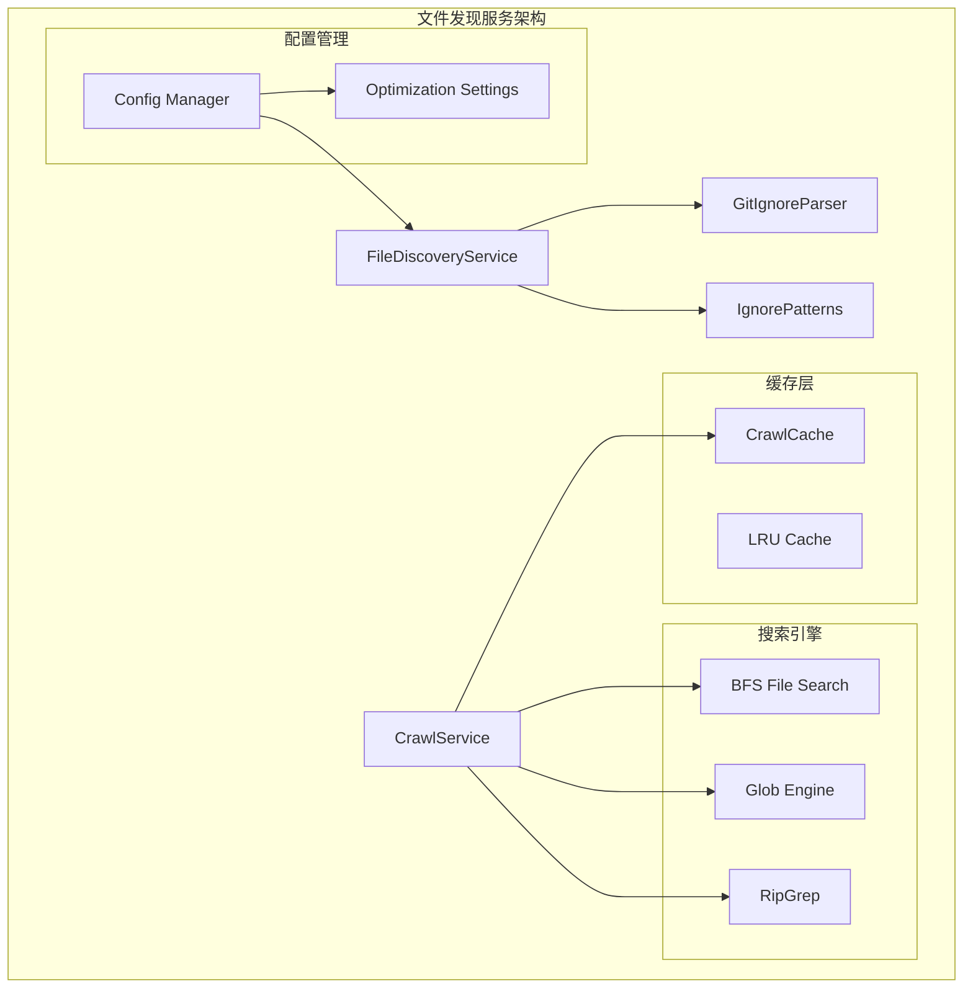
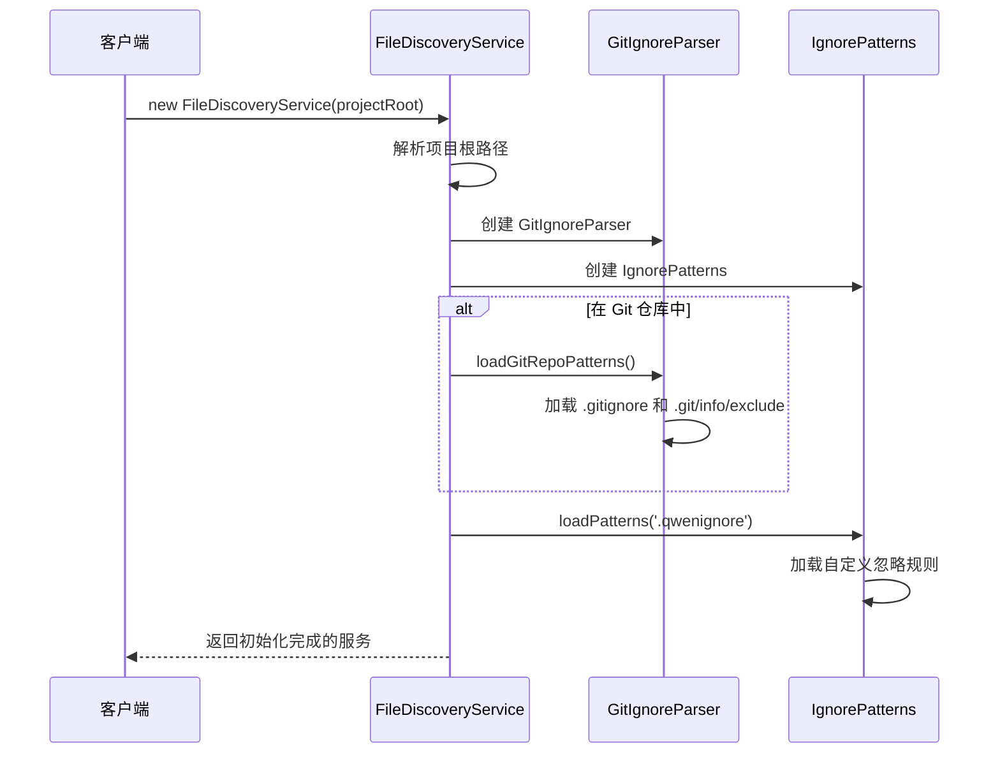
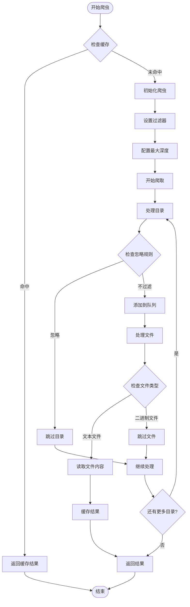
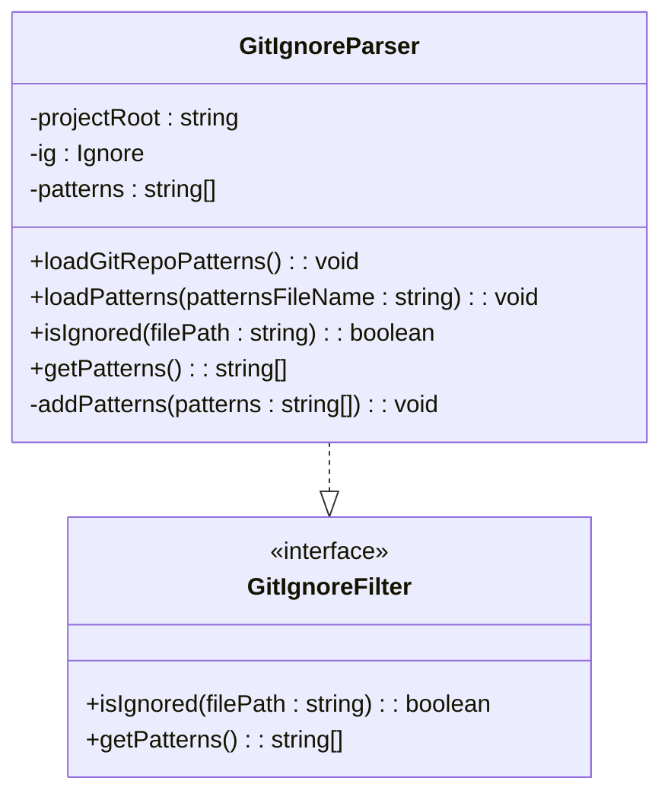
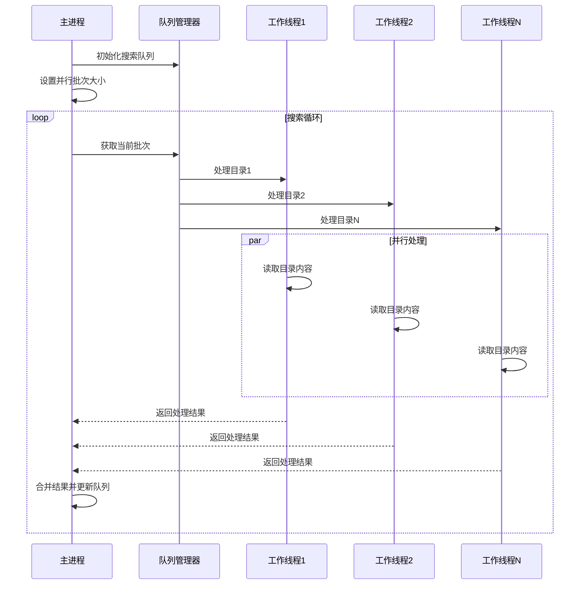
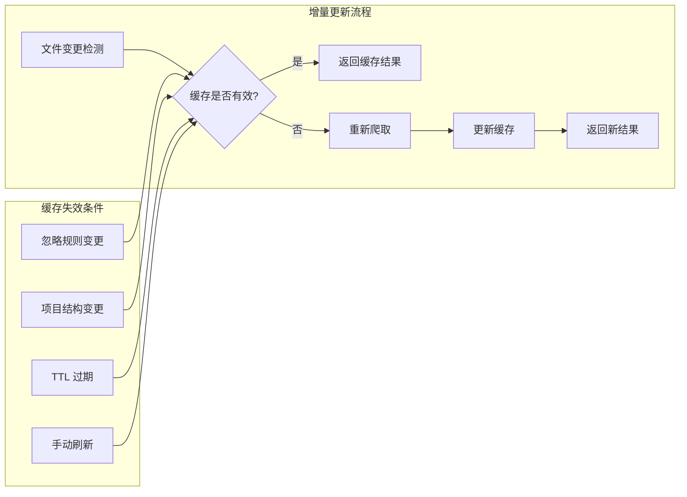

# 文件发现与索引系统

<cite>
**本文档中引用的文件**
- [fileDiscoveryService.ts](file://packages/core/src/services/fileDiscoveryService.ts)
- [gitIgnoreParser.ts](file://packages/core/src/utils/gitIgnoreParser.ts)
- [ignorePatterns.ts](file://packages/core/src/utils/ignorePatterns.ts)
- [bfsFileSearch.ts](file://packages/core/src/utils/bfsFileSearch.ts)
- [crawler.ts](file://packages/core/src/utils/filesearch/crawler.ts)
- [crawlCache.ts](file://packages/core/src/utils/filesearch/crawlCache.ts)
- [config.ts](file://packages/core/src/config/config.ts)
- [read-many-files.ts](file://packages/core/src/tools/read-many-files.ts)
- [gitUtils.ts](file://packages/core/src/utils/gitUtils.ts)
</cite>

## 目录
1. [简介](#简介)
2. [核心架构概览](#核心架构概览)
3. [FileDiscoveryService 核心组件](#filediscoveryservice-核心组件)
4. [爬虫引擎与缓存机制](#爬虫引擎与缓存机制)
5. [忽略规则处理系统](#忽略规则处理系统)
6. [并行处理与性能优化](#并行处理与性能优化)
7. [增量更新与实时索引](#增量更新与实时索引)
8. [配置选项与调优](#配置选项与调优)
9. [故障排除指南](#故障排除指南)
10. [总结](#总结)

## 简介

qwen-code 文件发现服务是一个高度优化的代码库索引系统，专门设计用于在大型项目中快速构建和维护完整的文件索引。该系统通过智能的爬虫引擎、高效的缓存机制和灵活的忽略规则处理，为代码分析、文件搜索和内容检索提供了强大的基础设施支持。

系统的核心目标是：
- 快速扫描和索引大型代码库
- 智能过滤不需要的文件和目录
- 提供可扩展的性能优化策略
- 支持增量更新和实时索引
- 与其他组件无缝集成

## 核心架构概览



**图表来源**
- [fileDiscoveryService.ts](file://packages/core/src/services/fileDiscoveryService.ts#L1-L113)
- [crawler.ts](file://packages/core/src/utils/filesearch/crawler.ts#L1-L84)
- [crawlCache.ts](file://packages/core/src/utils/filesearch/crawlCache.ts#L1-L70)

## FileDiscoveryService 核心组件

FileDiscoveryService 是整个文件发现系统的核心控制器，负责协调各种文件过滤和索引操作。

### 初始化流程



**图表来源**
- [fileDiscoveryService.ts](file://packages/core/src/services/fileDiscoveryService.ts#L20-L35)
- [gitIgnoreParser.ts](file://packages/core/src/utils/gitIgnoreParser.ts#L25-L40)

### 文件过滤机制

FileDiscoveryService 提供了多层次的文件过滤能力：

```typescript
// 基本过滤接口
interface FilterFilesOptions {
  respectGitIgnore?: boolean;
  respectGeminiIgnore?: boolean;
}

// 核心过滤方法
filterFiles(
  filePaths: string[],
  options: FilterFilesOptions = {
    respectGitIgnore: true,
    respectGeminiIgnore: true,
  },
): string[]
```

**章节来源**
- [fileDiscoveryService.ts](file://packages/core/src/services/fileDiscoveryService.ts#L37-L55)

## 爬虫引擎与缓存机制

### 爬虫引擎架构

爬虫引擎采用深度优先搜索（DFS）结合缓存优化的设计，能够高效地遍历大型目录结构。



**图表来源**
- [crawler.ts](file://packages/core/src/utils/filesearch/crawler.ts#L25-L84)

### 缓存系统设计

缓存系统采用基于 SHA256 的键值存储，确保缓存的有效性和一致性：

```typescript
// 缓存键生成逻辑
export const getCacheKey = (
  directory: string,
  ignoreContent: string,
  maxDepth?: number,
): string => {
  const hash = crypto.createHash('sha256');
  hash.update(directory);
  hash.update(ignoreContent);
  if (maxDepth !== undefined) {
    hash.update(String(maxDepth));
  }
  return hash.digest('hex');
};
```

缓存特性：
- **内存存储**：使用 Map 数据结构实现高性能访问
- **TTL 支持**：自动过期机制防止缓存污染
- **内容感知**：基于项目目录和忽略规则内容生成唯一键
- **并发安全**：线程安全的缓存操作

**章节来源**
- [crawlCache.ts](file://packages/core/src/utils/filesearch/crawlCache.ts#L15-L25)
- [crawler.ts](file://packages/core/src/utils/filesearch/crawler.ts#L25-L45)

## 忽略规则处理系统

### GitIgnoreParser 实现

GitIgnoreParser 是一个功能完整的 .gitignore 规则解析器，支持标准的 Git 忽略语法：



**图表来源**
- [gitIgnoreParser.ts](file://packages/core/src/utils/gitIgnoreParser.ts#L15-L75)

### 多层次忽略规则

系统支持多种忽略规则的组合使用：

1. **Git 忽略规则**：从 `.gitignore` 和 `.git/info/exclude` 加载
2. **Gemini 忽略规则**：从 `.qwenignore` 文件加载
3. **默认排除模式**：预定义的通用排除规则
4. **自定义排除模式**：用户配置的特定规则

```typescript
// 默认排除模式示例
export const DEFAULT_FILE_EXCLUDES: string[] = [
  '**/node_modules/**',
  '**/.git/**',
  '**/bower_components/**',
  '**/dist/**',
  '**/build/**',
  '**/*.bin',
  '**/*.exe',
  '**/*.png',
  '**/*.jpg',
];
```

**章节来源**
- [ignorePatterns.ts](file://packages/core/src/utils/ignorePatterns.ts#L40-L60)
- [gitIgnoreParser.ts](file://packages/core/src/utils/gitIgnoreParser.ts#L25-L50)

## 并行处理与性能优化

### BFS 文件搜索优化

BFS 文件搜索实现了高度优化的并行处理机制：



**图表来源**
- [bfsFileSearch.ts](file://packages/core/src/utils/bfsFileSearch.ts#L40-L80)

### 性能优化策略

1. **并行批处理**：每批次最多 15 个目录并行处理
2. **指针队列**：避免昂贵的数组切片操作
3. **访问者集合**：防止重复处理相同目录
4. **错误恢复**：优雅处理不可读目录

```typescript
// 关键性能参数
const PARALLEL_BATCH_SIZE = 15; // 并行处理批次大小
let queueHead = 0; // 指针式队列头，避免 splice 操作
const visited = new Set<string>(); // 访问记录集合
```

**章节来源**
- [bfsFileSearch.ts](file://packages/core/src/utils/bfsFileSearch.ts#L45-L55)

## 增量更新与实时索引

### 增量更新机制

系统通过以下机制支持增量更新：

1. **缓存失效检测**：当忽略规则或项目结构变化时自动失效缓存
2. **时间戳监控**：监控文件修改时间进行增量扫描
3. **变更检测**：识别新增、删除和修改的文件



### 实时索引同步

系统支持与外部文件系统事件的实时同步：

- **文件系统监控**：监听文件创建、删除和修改事件
- **索引更新**：自动更新相关索引条目
- **冲突解决**：处理并发修改场景下的索引一致性

## 配置选项与调优

### 核心配置参数

```typescript
interface FileFilteringOptions {
  respectGitIgnore: boolean;
  respectGeminiIgnore: boolean;
  enableRecursiveFileSearch: boolean;
  disableFuzzySearch: boolean;
}
```

### 性能调优建议

1. **缓存配置**
   ```typescript
   // 推荐的缓存设置
   const crawlOptions = {
     cache: true,
     cacheTtl: 300000, // 5分钟TTL
     maxDepth: 10,     // 限制搜索深度
   };
   ```

2. **并行度调整**
   ```typescript
   // 根据系统资源调整批次大小
   const PARALLEL_BATCH_SIZE = os.cpus().length * 2;
   ```

3. **内存管理**
   ```typescript
   // 对于大型项目，启用流式处理
   const streamingOptions = {
     chunkSize: 1024 * 1024, // 1MB 块大小
     bufferLimit: 100,       // 最大缓冲区大小
   };
   ```

**章节来源**
- [config.ts](file://packages/core/src/config/config.ts#L100-L120)
- [bfsFileSearch.ts](file://packages/core/src/utils/bfsFileSearch.ts#L45-L55)

## 故障排除指南

### 常见问题与解决方案

1. **缓存不命中频繁**
   - 检查忽略规则是否经常变化
   - 调整 TTL 设置
   - 验证缓存键生成逻辑

2. **性能下降**
   - 减少搜索深度
   - 优化忽略规则
   - 增加并行处理批次大小

3. **内存使用过高**
   - 启用流式处理
   - 限制同时处理的文件数量
   - 清理过期缓存

### 调试工具

系统提供了丰富的调试信息：

```typescript
// 启用调试模式
const debugOptions = {
  debug: true,
  maxDirs: 100, // 限制扫描目录数量
};

// 日志输出示例
console.debug(`[DEBUG] [BfsFileSearch] Scanning [${scannedDirCount}/${maxDirs}]`);
```

**章节来源**
- [bfsFileSearch.ts](file://packages/core/src/utils/bfsFileSearch.ts#L15-L25)

## 总结

qwen-code 文件发现服务通过精心设计的架构和优化策略，为大型代码库提供了高效、可靠的文件索引和搜索能力。其核心优势包括：

- **高性能爬虫引擎**：基于并行处理和智能缓存的快速文件扫描
- **灵活的忽略规则**：支持多层级、可扩展的文件过滤机制
- **实时索引更新**：自动化的增量更新和缓存失效机制
- **可配置的性能参数**：适应不同规模项目的调优能力
- **完善的错误处理**：健壮的异常处理和恢复机制

该系统为 qwen-code 生态系统中的代码分析、文件搜索和内容检索功能提供了坚实的基础设施支持，是现代代码编辑器和 IDE 中不可或缺的核心组件。