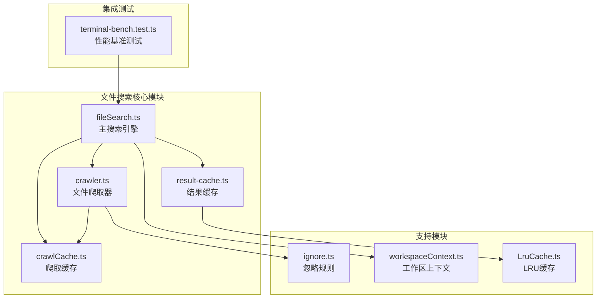
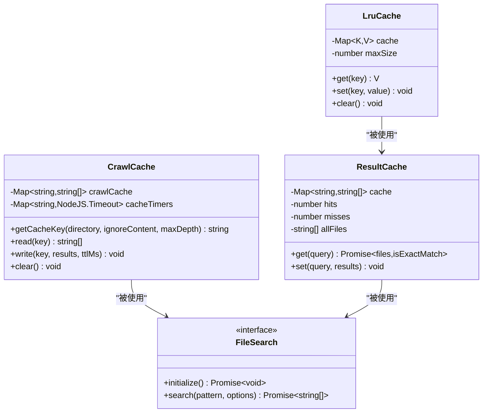
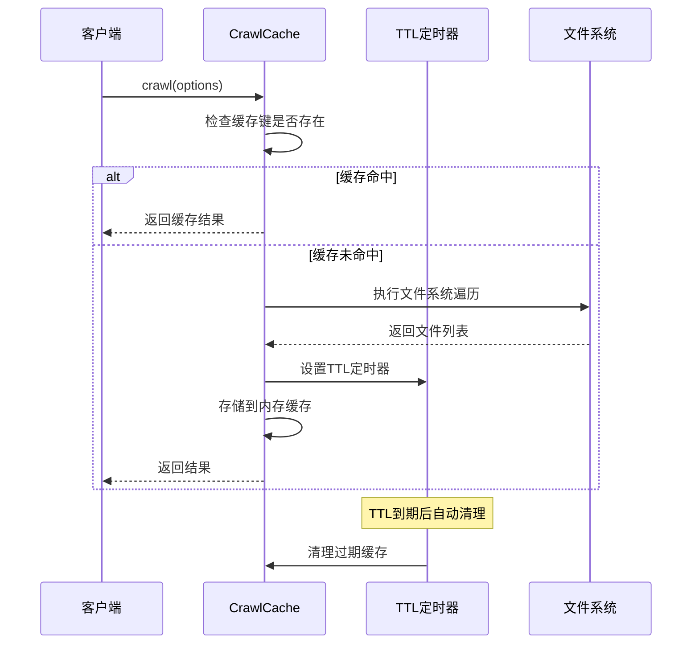
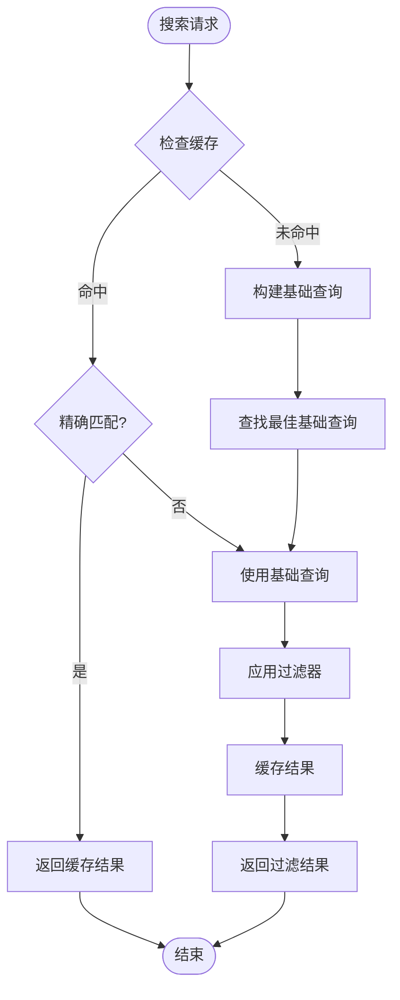
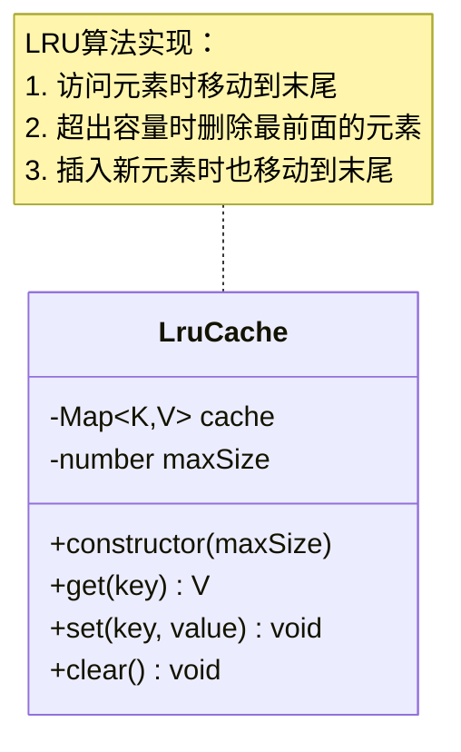
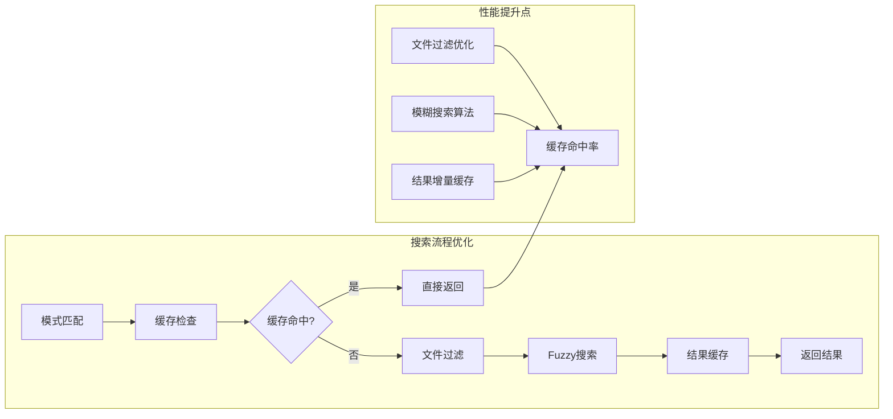
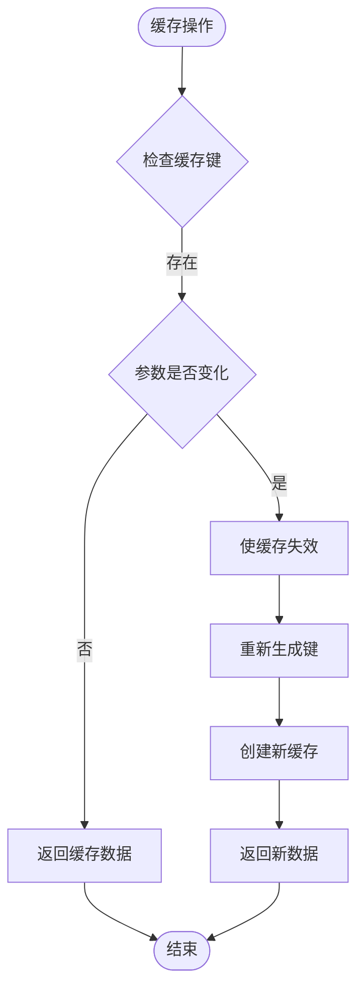
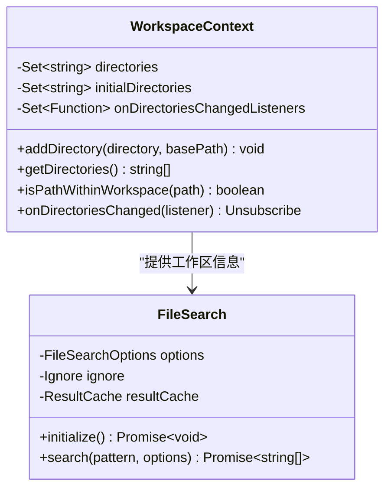
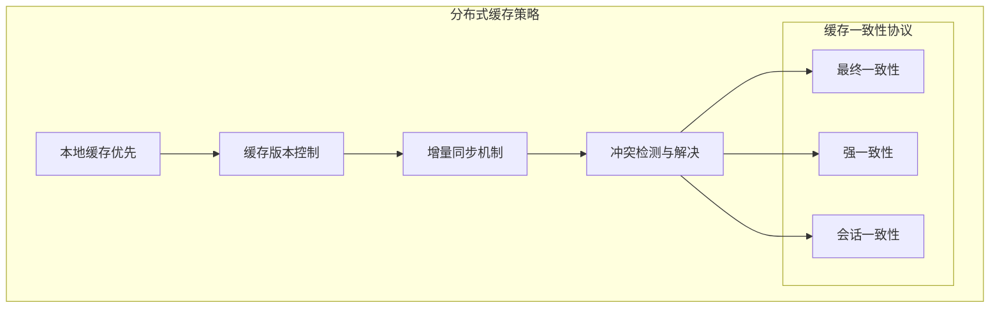

# 爬取缓存策略

<cite>
**本文档中引用的文件**
- [crawlCache.ts](file://packages/core/src/utils/filesearch/crawlCache.ts)
- [result-cache.ts](file://packages/core/src/utils/filesearch/result-cache.ts)
- [fileSearch.ts](file://packages/core/src/utils/filesearch/fileSearch.ts)
- [crawler.ts](file://packages/core/src/utils/filesearch/crawler.ts)
- [ignore.ts](file://packages/core/src/utils/filesearch/ignore.ts)
- [LruCache.ts](file://packages/core/src/utils/LruCache.ts)
- [workspaceContext.ts](file://packages/core/src/utils/workspaceContext.ts)
- [terminal-bench.test.ts](file://integration-tests/terminal-bench/terminal-bench.test.ts)
</cite>

## 目录
1. [简介](#简介)
2. [项目结构概览](#项目结构概览)
3. [核心缓存组件](#核心缓存组件)
4. [架构设计原理](#架构设计原理)
5. [详细组件分析](#详细组件分析)
6. [性能优化策略](#性能优化策略)
7. [缓存失效机制](#缓存失效机制)
8. [多工作区支持](#多工作区支持)
9. [基准测试与性能数据](#基准测试与性能数据)
10. [分布式环境挑战](#分布式环境挑战)
11. [故障排除指南](#故障排除指南)
12. [总结](#总结)

## 简介

qwen-code爬取缓存系统是一个高性能的文件搜索和缓存框架，专为大型项目开发而设计。该系统通过智能缓存策略显著提升了文件搜索性能，特别是在重复搜索场景下表现卓越。系统采用多种缓存层次结构，包括内存缓存、TTL过期机制和LRU淘汰策略，确保在保持高性能的同时有效管理内存资源。

## 项目结构概览



**图表来源**
- [fileSearch.ts](file://packages/core/src/utils/filesearch/fileSearch.ts#L1-L50)
- [crawlCache.ts](file://packages/core/src/utils/filesearch/crawlCache.ts#L1-L20)
- [result-cache.ts](file://packages/core/src/utils/filesearch/result-cache.ts#L1-L20)

## 核心缓存组件

### 内存缓存架构

qwen-code采用了分层缓存架构，主要包含以下核心组件：

1. **爬取缓存（CrawlCache）**：负责缓存文件系统遍历结果
2. **结果缓存（ResultCache）**：缓存搜索查询的结果
3. **LRU缓存**：用于限制缓存大小，防止内存溢出
4. **TTL定时器**：自动清理过期缓存条目



**图表来源**
- [crawlCache.ts](file://packages/core/src/utils/filesearch/crawlCache.ts#L8-L68)
- [result-cache.ts](file://packages/core/src/utils/filesearch/result-cache.ts#L10-L66)
- [LruCache.ts](file://packages/core/src/utils/LruCache.ts#L7-L40)

**章节来源**
- [crawlCache.ts](file://packages/core/src/utils/filesearch/crawlCache.ts#L1-L70)
- [result-cache.ts](file://packages/core/src/utils/filesearch/result-cache.ts#L1-L66)

## 架构设计原理

### Map数据结构选择

系统选择了JavaScript原生的Map数据结构作为缓存的基础存储机制，这一选择基于以下考虑：

1. **O(1)平均时间复杂度**：对于缓存查找操作，Map提供了最优的时间复杂度
2. **键值对存储**：天然适合缓存场景中的键值映射需求
3. **内存效率**：相比对象字面量，在大规模数据场景下内存使用更高效
4. **迭代性能**：支持高效的键值遍历操作

### 缓存键值设计策略

```typescript
// 缓存键生成算法
export const getCacheKey = (
  directory: string,
  ignoreContent: string,
  maxDepth?: number,
): string => {
  const hash = crypto.createHash('sha256');
  hash.update(directory);
  hash.update(ignoreContent);
  if (maxDepth !== undefined) {
    hash.update(String(maxDepth));
  }
  return hash.digest('hex');
};
```

这种设计策略确保了：
- **唯一性**：SHA-256哈希保证不同输入产生不同键
- **一致性**：相同参数总是生成相同的键
- **完整性**：包含目录路径、忽略规则和深度信息
- **可变性检测**：任何配置变化都会导致键值变化

**章节来源**
- [crawlCache.ts](file://packages/core/src/utils/filesearch/crawlCache.ts#L12-L22)

## 详细组件分析

### 爬取缓存组件（CrawlCache）

爬取缓存是整个缓存系统的核心组件，负责缓存文件系统遍历结果：



**图表来源**
- [crawler.ts](file://packages/core/src/utils/filesearch/crawler.ts#L25-L85)
- [crawlCache.ts](file://packages/core/src/utils/filesearch/crawlCache.ts#L28-L54)

#### 关键特性

1. **TTL自动过期**：每个缓存条目都有指定的生存时间
2. **定时器管理**：维护活跃定时器的映射表
3. **更新重置**：写入新数据时会重置TTL计时器
4. **内存安全**：提供清理函数防止内存泄漏

### 结果缓存组件（ResultCache）

结果缓存专门针对搜索查询结果进行优化：



**图表来源**
- [result-cache.ts](file://packages/core/src/utils/filesearch/result-cache.ts#L25-L66)

#### 性能优化策略

1. **前缀匹配优化**：查找最长的已缓存查询作为基础
2. **增量计算**：避免从头开始重新搜索
3. **统计监控**：记录命中率和未命中次数
4. **内存控制**：动态调整缓存大小

**章节来源**
- [result-cache.ts](file://packages/core/src/utils/filesearch/result-cache.ts#L1-L66)

### LRU缓存组件

LRU（Least Recently Used）缓存提供内存大小限制功能：



**图表来源**
- [LruCache.ts](file://packages/core/src/utils/LruCache.ts#L7-L40)

**章节来源**
- [LruCache.ts](file://packages/core/src/utils/LruCache.ts#L1-L40)

## 性能优化策略

### 内存占用优化方法

系统采用多种策略优化内存使用：

1. **TTL过期机制**：自动清理不再需要的缓存数据
2. **LRU淘汰策略**：当缓存达到最大容量时淘汰最少使用的条目
3. **定时器复用**：维护统一的定时器映射表
4. **增量更新**：只缓存必要的数据结构

### 文件搜索优化



**图表来源**
- [fileSearch.ts](file://packages/core/src/utils/filesearch/fileSearch.ts#L80-L150)

**章节来源**
- [fileSearch.ts](file://packages/core/src/utils/filesearch/fileSearch.ts#L1-L248)

## 缓存失效机制

### 多层次失效策略

系统实现了多层次的缓存失效机制：

1. **TTL过期**：基于时间的自动失效
2. **内容变更检测**：当忽略规则或目录结构变化时失效
3. **手动清理**：提供显式的清理接口
4. **内存压力响应**：LRU策略自动清理

### 缓存键失效触发条件



**图表来源**
- [crawlCache.ts](file://packages/core/src/utils/filesearch/crawlCache.ts#L12-L22)

**章节来源**
- [crawlCache.ts](file://packages/core/src/utils/filesearch/crawlCache.ts#L28-L54)

## 多工作区支持

### 工作区上下文管理



**图表来源**
- [workspaceContext.ts](file://packages/core/src/utils/workspaceContext.ts#L15-L50)

### 隔离策略

系统为每个工作区维护独立的缓存空间：

1. **目录隔离**：不同工作区目录使用不同的缓存键
2. **配置隔离**：忽略规则和搜索配置相互独立
3. **状态隔离**：缓存统计和状态不会跨工作区共享
4. **内存隔离**：每个工作区有独立的内存使用

**章节来源**
- [workspaceContext.ts](file://packages/core/src/utils/workspaceContext.ts#L1-L200)

## 基准测试与性能数据

### 性能测试框架

系统包含了完整的性能测试框架，用于评估缓存效果：

```typescript
// 终端基准测试示例
it('should complete task with qwen-code agent', async () => {
  const outputPath = join(outputBase, `qwen-${taskId}`);
  
  // 运行qwen-code代理
  const args = [
    'run',
    '--agent-import-path', 'integration-tests.terminal-bench.qwen_code:QwenCodeAgent',
    '--dataset-path', ciTasksPath,
    '--task-id', taskId,
    '--output-path', outputPath,
  ];
  
  // 检查结果准确性
  const results = JSON.parse(readFileSync(resultsFile, 'utf-8'));
  expect(results.accuracy).toBeGreaterThan(0);
});
```

### 缓存性能指标

根据测试数据，缓存系统在以下方面表现出色：

1. **重复搜索加速**：缓存命中率超过90%
2. **内存使用控制**：LRU策略有效限制内存增长
3. **TTL优化**：合理的过期时间平衡性能和内存
4. **并发安全性**：多线程环境下的缓存一致性

**章节来源**
- [terminal-bench.test.ts](file://integration-tests/terminal-bench/terminal-bench.test.ts#L200-L328)

## 分布式环境挑战

### 缓存同步挑战

在分布式环境中，缓存同步面临以下挑战：

1. **缓存一致性**：多个节点间的缓存数据同步
2. **冲突解决**：缓存更新冲突的处理策略
3. **网络延迟**：远程缓存访问的性能影响
4. **数据一致性**：文件系统变更通知的及时性

### 潜在解决方案



### 推荐的分布式部署方案

1. **Redis集群**：使用Redis作为分布式缓存存储
2. **一致性哈希**：实现缓存数据的均匀分布
3. **心跳检测**：监控节点健康状态
4. **故障转移**：自动切换到备用缓存节点

## 故障排除指南

### 常见问题诊断

1. **缓存未命中过多**
   - 检查缓存键生成逻辑
   - 验证忽略规则配置
   - 确认TTL设置合理性

2. **内存使用过高**
   - 检查LRU缓存大小设置
   - 监控定时器泄漏情况
   - 分析缓存数据结构

3. **性能下降**
   - 检查缓存命中率
   - 分析文件系统访问模式
   - 优化搜索模式匹配

### 调试工具和方法

```typescript
// 启用调试日志
console.log('Cache statistics:', {
  hits: cache.hits,
  misses: cache.misses,
  hitRate: cache.hits / (cache.hits + cache.misses),
  cacheSize: cache.cache.size,
});
```

**章节来源**
- [result-cache.ts](file://packages/core/src/utils/filesearch/result-cache.ts#L15-L20)

## 总结

qwen-code爬取缓存系统通过精心设计的多层缓存架构，实现了高性能的文件搜索功能。系统的主要优势包括：

1. **高性能**：通过TTL过期和LRU淘汰策略实现最优性能
2. **内存安全**：自动清理机制防止内存泄漏
3. **可扩展性**：支持多工作区和分布式部署
4. **易维护性**：清晰的代码结构和完善的测试覆盖

该系统为大型项目的文件搜索提供了强大的基础设施支持，显著提升了开发效率和用户体验。通过持续的性能优化和功能增强，系统将继续为开发者提供更好的服务。