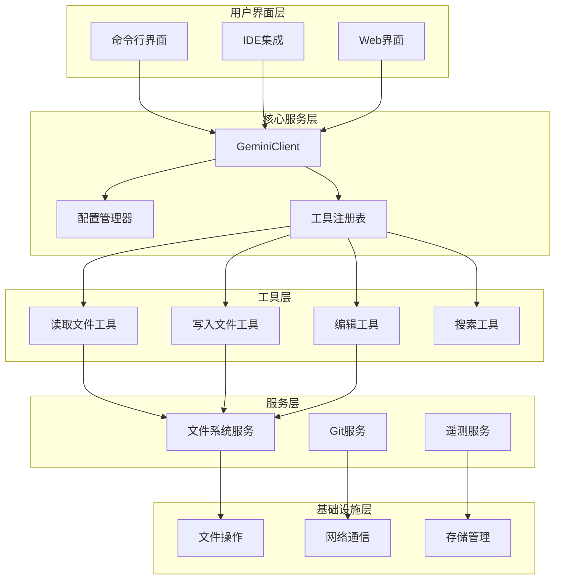
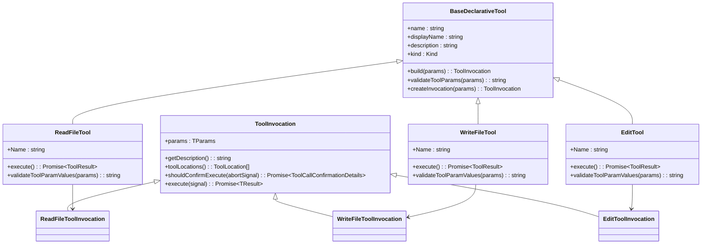
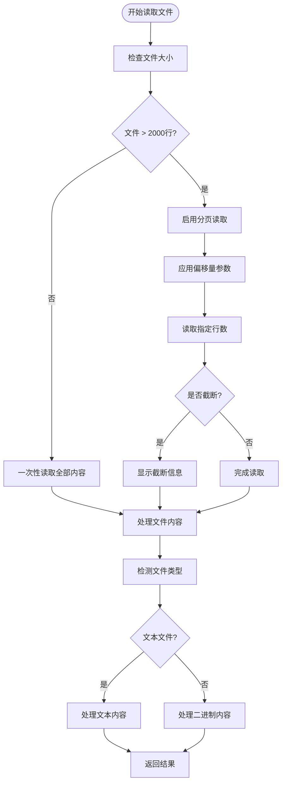
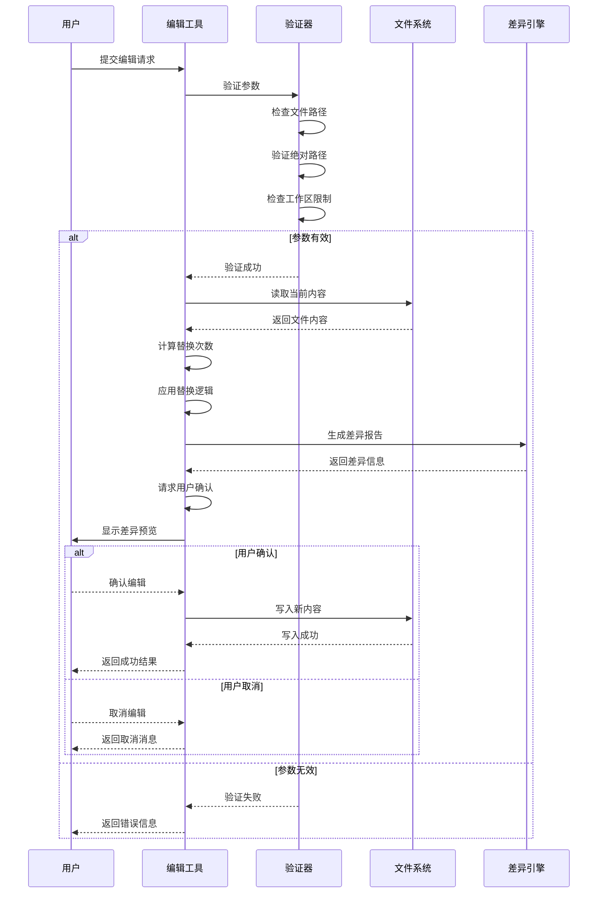
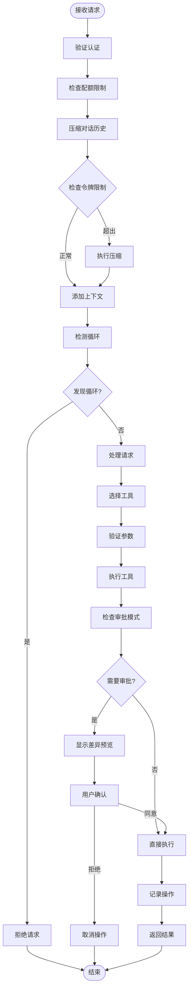
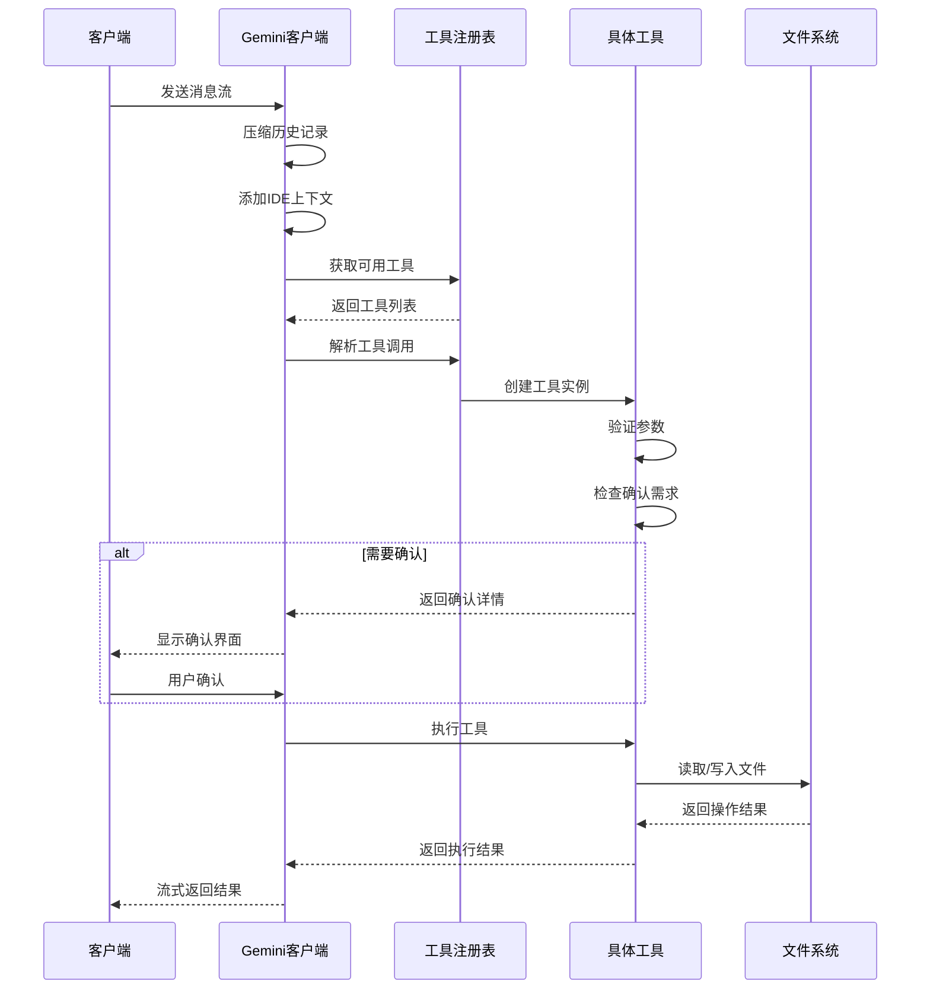
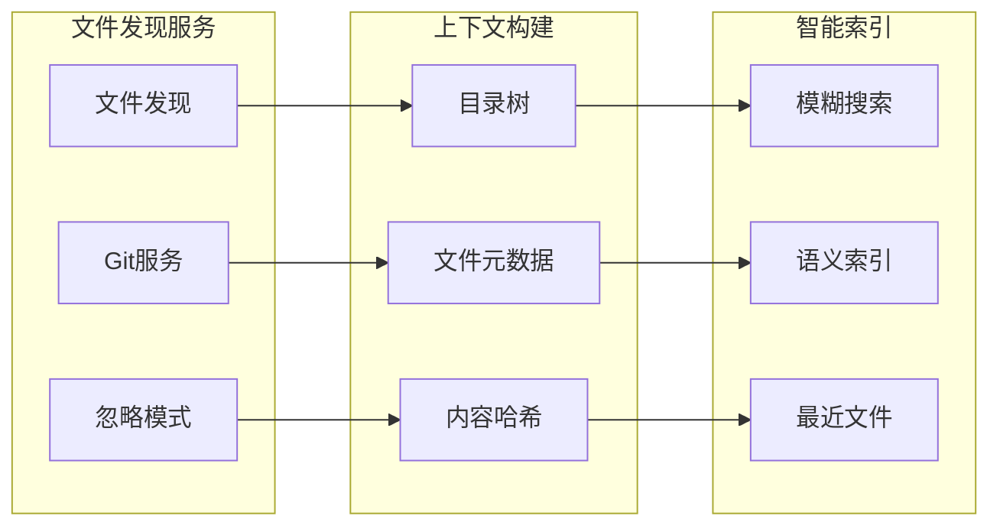
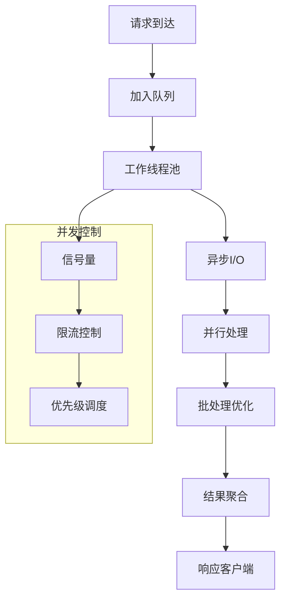

# 代码理解与编辑功能详细文档

<cite>
**本文档中引用的文件**
- [packages/core/src/tools/edit.ts](file://packages/core/src/tools/edit.ts)
- [packages/core/src/tools/read-file.ts](file://packages/core/src/tools/read-file.ts)
- [packages/core/src/tools/write-file.ts](file://packages/core/src/tools/write-file.ts)
- [packages/core/src/services/fileSystemService.ts](file://packages/core/src/services/fileSystemService.ts)
- [packages/core/src/core/client.ts](file://packages/core/src/core/client.ts)
- [packages/core/src/tools/tools.ts](file://packages/core/src/tools/tools.ts)
- [packages/core/src/config/config.ts](file://packages/core/src/config/config.ts)
- [packages/core/src/utils/fileUtils.ts](file://packages/core/src/utils/fileUtils.ts)
- [integration-tests/edit.test.ts](file://integration-tests/edit.test.ts)
- [integration-tests/write_file.test.ts](file://integration-tests/write_file.test.ts)
</cite>

## 目录
1. [简介](#简介)
2. [项目架构概览](#项目架构概览)
3. [核心组件分析](#核心组件分析)
4. [文件读取与写入机制](#文件读取与写入机制)
5. [智能编辑工具实现](#智能编辑工具实现)
6. [客户端请求处理流程](#客户端请求处理流程)
7. [跨文件上下文感知](#跨文件上下文感知)
8. [性能优化策略](#性能优化策略)
9. [实际使用示例](#实际使用示例)
10. [故障排除指南](#故障排除指南)
11. [总结](#总结)

## 简介

qwen-code 是一个强大的代码理解和编辑工具，专门设计用于处理大型代码库和跨文件上下文感知。该系统通过智能的文件读取、编辑和写入操作，为开发者提供了高效的代码修改能力。本文档将深入探讨其核心功能，包括如何处理大型代码库、维护上下文一致性，以及实现高效的 I/O 操作。

## 项目架构概览

qwen-code 采用模块化架构设计，主要分为以下几个核心层次：



**图表来源**
- [packages/core/src/core/client.ts](file://packages/core/src/core/client.ts#L1-L50)
- [packages/core/src/config/config.ts](file://packages/core/src/config/config.ts#L1-L100)

## 核心组件分析

### 工具系统架构

qwen-code 的工具系统基于声明式设计模式，每个工具都实现了标准化的接口：



**图表来源**
- [packages/core/src/tools/tools.ts](file://packages/core/src/tools/tools.ts#L1-L100)
- [packages/core/src/tools/read-file.ts](file://packages/core/src/tools/read-file.ts#L1-L50)
- [packages/core/src/tools/write-file.ts](file://packages/core/src/tools/write-file.ts#L1-L50)
- [packages/core/src/tools/edit.ts](file://packages/core/src/tools/edit.ts#L1-L50)

**章节来源**
- [packages/core/src/tools/tools.ts](file://packages/core/src/tools/tools.ts#L1-L588)
- [packages/core/src/tools/read-file.ts](file://packages/core/src/tools/read-file.ts#L1-L210)
- [packages/core/src/tools/write-file.ts](file://packages/core/src/tools/write-file.ts#L1-L482)
- [packages/core/src/tools/edit.ts](file://packages/core/src/tools/edit.ts#L1-L590)

## 文件读取与写入机制

### 文件系统服务抽象

qwen-code 通过 `FileSystemService` 接口抽象了文件操作，提供了标准的读写方法：

```typescript
export interface FileSystemService {
  readTextFile(filePath: string): Promise<string>;
  writeTextFile(filePath: string, content: string): Promise<void>;
}

export class StandardFileSystemService implements FileSystemService {
  async readTextFile(filePath: string): Promise<string> {
    return fs.readFile(filePath, 'utf-8');
  }

  async writeTextFile(filePath: string, content: string): Promise<void> {
    await fs.writeFile(filePath, content, 'utf-8');
  }
}
```

### 大文件处理策略

对于大型文件，系统采用了分页读取策略：



**图表来源**
- [packages/core/src/utils/fileUtils.ts](file://packages/core/src/utils/fileUtils.ts#L150-L200)

**章节来源**
- [packages/core/src/services/fileSystemService.ts](file://packages/core/src/services/fileSystemService.ts#L1-L42)
- [packages/core/src/utils/fileUtils.ts](file://packages/core/src/utils/fileUtils.ts#L1-L343)

## 智能编辑工具实现

### 编辑工具的核心逻辑

编辑工具实现了精确的文本替换功能，支持多种验证机制：



**图表来源**
- [packages/core/src/tools/edit.ts](file://packages/core/src/tools/edit.ts#L100-L200)
- [packages/core/src/tools/edit.ts](file://packages/core/src/tools/edit.ts#L250-L350)

### 替换算法实现

编辑工具使用精确的字符串替换算法：

```typescript
export function applyReplacement(
  currentContent: string | null,
  oldString: string,
  newString: string,
  isNewFile: boolean,
): string {
  if (isNewFile) {
    return newString;
  }
  if (currentContent === null) {
    return oldString === '' ? newString : '';
  }
  if (oldString === '' && !isNewFile) {
    return currentContent;
  }
  return currentContent.replaceAll(oldString, newString);
}
```

### 确认机制

系统实现了多层确认机制：

1. **自动确认模式**：无需用户干预
2. **计划模式**：显示完整计划后确认
3. **交互模式**：每次编辑前显示差异

**章节来源**
- [packages/core/src/tools/edit.ts](file://packages/core/src/tools/edit.ts#L1-L590)

## 客户端请求处理流程

### 核心请求处理架构

GeminiClient 负责协调所有文件操作请求：



**图表来源**
- [packages/core/src/core/client.ts](file://packages/core/src/core/client.ts#L700-L800)

### 工具调用序列



**图表来源**
- [packages/core/src/core/client.ts](file://packages/core/src/core/client.ts#L600-L700)

**章节来源**
- [packages/core/src/core/client.ts](file://packages/core/src/core/client.ts#L1-L1141)

## 跨文件上下文感知

### 上下文管理机制

系统通过多种方式维护跨文件上下文：



### IDE上下文同步

系统能够实时同步IDE中的文件状态：

```typescript
private getIdeContextParts(forceFullContext: boolean): {
  contextParts: string[];
  newIdeContext: IdeContext | undefined;
} {
  const currentIdeContext = ideContext.getIdeContext();
  if (!currentIdeContext) {
    return { contextParts: [], newIdeContext: undefined };
  }

  if (forceFullContext || !this.lastSentIdeContext) {
    // 发送完整上下文作为JSON
    const openFiles = currentIdeContext.workspaceState?.openFiles || [];
    const activeFile = openFiles.find((f) => f.isActive);
    const otherOpenFiles = openFiles
      .filter((f) => !f.isActive)
      .map((f) => f.path);
    
    // 构建上下文数据
    const contextData: Record<string, unknown> = {};
    if (activeFile) {
      contextData['activeFile'] = {
        path: activeFile.path,
        cursor: activeFile.cursor,
        selectedText: activeFile.selectedText || undefined,
      };
    }
    // ... 更多上下文信息
  }
}
```

**章节来源**
- [packages/core/src/core/client.ts](file://packages/core/src/core/client.ts#L400-L500)

## 性能优化策略

### 缓存机制

系统实现了多级缓存策略：

1. **文件内容缓存**：避免重复读取相同文件
2. **工具调用缓存**：缓存频繁使用的工具结果
3. **上下文缓存**：缓存计算密集型的上下文信息

### 异步处理

所有文件操作都采用异步非阻塞模式：



### 内存管理

系统采用流式处理和内存池技术：

- **流式文件处理**：大文件分块读取
- **对象池**：重用频繁分配的对象
- **垃圾回收优化**：及时释放不需要的资源

## 实际使用示例

### 基本文件读取

```bash
# 读取单个文件
qwen read_file --file-path "/path/to/file.js"

# 读取特定行范围
qwen read_file --file-path "/path/to/file.js" --offset 10 --limit 20

# 分页读取大文件
qwen read_file --file-path "/path/to/large_file.txt" --offset 0 --limit 1000
qwen read_file --file-path "/path/to/large_file.txt" --offset 1000 --limit 1000
```

### 文件编辑操作

```bash
# 替换文本内容
qwen edit --file-path "/path/to/file.js" \
  --old-string "console.log('old')" \
  --new-string "console.log('new')" \
  --expected-replacements 1

# 创建新文件
qwen edit --file-path "/path/to/new_file.js" \
  --old-string "" \
  --new-string "console.log('Hello World');"
```

### 批量文件操作

```bash
# 写入多个文件
qwen write_file --file-path "/path/to/file1.js" --content "content1"
qwen write_file --file-path "/path/to/file2.js" --content "content2"

# 搜索和替换
qwen grep --pattern "TODO:" --recursive
qwen edit --file-path "/path/to/file.js" \
  --old-string "TODO: old" \
  --new-string "TODO: new"
```

### 高级配置选项

```json
{
  "approvalMode": "plan",
  "maxSessionTurns": 100,
  "sessionTokenLimit": 100000,
  "fileFiltering": {
    "respectGitIgnore": true,
    "respectGeminiIgnore": true
  }
}
```

**章节来源**
- [integration-tests/edit.test.ts](file://integration-tests/edit.test.ts#L1-L65)
- [integration-tests/write_file.test.ts](file://integration-tests/write_file.test.ts#L1-L70)

## 故障排除指南

### 常见问题及解决方案

#### 1. 文件权限错误

**问题**：无法读取或写入文件
```
Error: Permission denied writing to file: /path/to/file.txt (EACCES)
```

**解决方案**：
- 检查文件权限：`ls -la /path/to/file.txt`
- 修改权限：`chmod 644 /path/to/file.txt`
- 使用管理员权限运行（谨慎）

#### 2. 文件不存在错误

**问题**：目标文件路径无效
```
Error: File not found. Cannot apply edit.
```

**解决方案**：
- 验证文件路径是否正确
- 确保使用绝对路径
- 检查文件是否存在：`ls /path/to/file.txt`

#### 3. 编码检测问题

**问题**：文件编码不匹配导致读取失败

**解决方案**：
- 系统会自动检测编码格式
- 支持UTF-8、GBK等常见编码
- 可通过环境变量强制指定编码

#### 4. 大文件处理超时

**问题**：处理大型文件时超时

**解决方案**：
- 使用分页读取：`--offset` 和 `--limit` 参数
- 增加超时时间配置
- 启用流式处理模式

#### 5. 内存不足错误

**问题**：处理大量文件时内存溢出

**解决方案**：
- 启用流式处理
- 减少同时处理的文件数量
- 增加系统内存或虚拟内存

### 调试技巧

#### 启用调试模式

```bash
# 设置调试级别
export DEBUG=true
qwen --debug-mode read_file --file-path "/path/to/file.js"

# 查看详细日志
qwen --verbose edit --file-path "/path/to/file.js" \
  --old-string "old" \
  --new-string "new"
```

#### 性能监控

```bash
# 启用性能分析
qwen --profile edit --file-path "/path/to/file.js" \
  --old-string "old" \
  --new-string "new"

# 查看内存使用情况
qwen --memory-usage read_file --file-path "/path/to/file.js"
```

### 错误代码参考

| 错误代码 | 描述 | 解决方案 |
|---------|------|----------|
| EACCES | 权限被拒绝 | 检查文件权限 |
| ENOENT | 文件不存在 | 验证文件路径 |
| EMFILE | 打开文件过多 | 关闭不必要的文件句柄 |
| ENOSPC | 磁盘空间不足 | 清理磁盘空间 |
| ETIMEDOUT | 操作超时 | 增加超时时间 |

**章节来源**
- [packages/core/src/tools/write-file.ts](file://packages/core/src/tools/write-file.ts#L350-L400)
- [packages/core/src/utils/fileUtils.ts](file://packages/core/src/utils/fileUtils.ts#L50-L100)

## 总结

qwen-code 通过其精心设计的架构和功能，为开发者提供了强大而灵活的代码理解和编辑能力。其核心优势包括：

### 主要特性

1. **智能文件处理**：支持大文件分页读取、多种文件格式处理
2. **精确编辑控制**：基于上下文的精确文本替换，防止意外修改
3. **跨文件上下文感知**：实时同步IDE状态，提供完整的开发环境视图
4. **安全的确认机制**：多层审批模式，确保操作安全性
5. **高性能架构**：异步处理、缓存优化、内存管理

### 技术亮点

- **模块化设计**：清晰的职责分离，易于扩展和维护
- **声明式工具系统**：标准化的工具接口，简化新工具开发
- **流式处理**：支持大数据量的高效处理
- **错误恢复**：完善的错误处理和恢复机制

### 最佳实践建议

1. **合理使用确认模式**：根据项目重要性选择合适的审批级别
2. **优化文件过滤**：配置适当的忽略规则，提高处理效率
3. **监控性能指标**：定期检查内存使用和处理速度
4. **备份重要文件**：在生产环境中谨慎使用自动编辑功能

qwen-code 不仅是一个代码编辑工具，更是一个完整的代码理解平台，它通过智能化的文件处理和编辑功能，大大提升了开发者的工作效率和代码质量。随着项目的持续发展，我们期待看到更多创新功能的加入，进一步完善这个强大的代码处理生态系统。