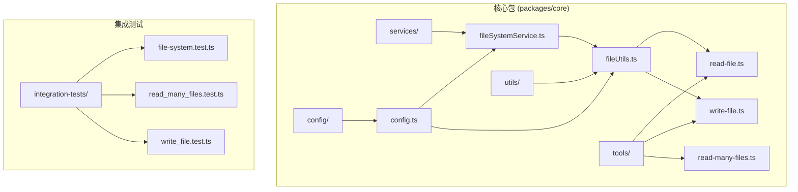
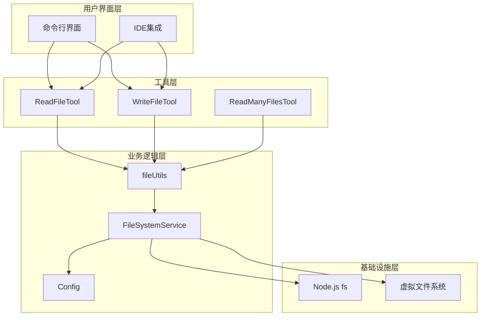
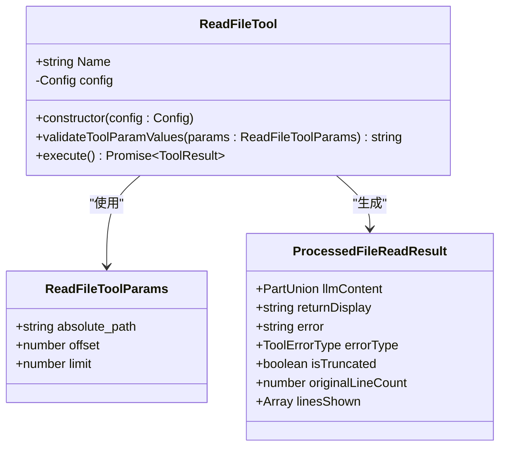
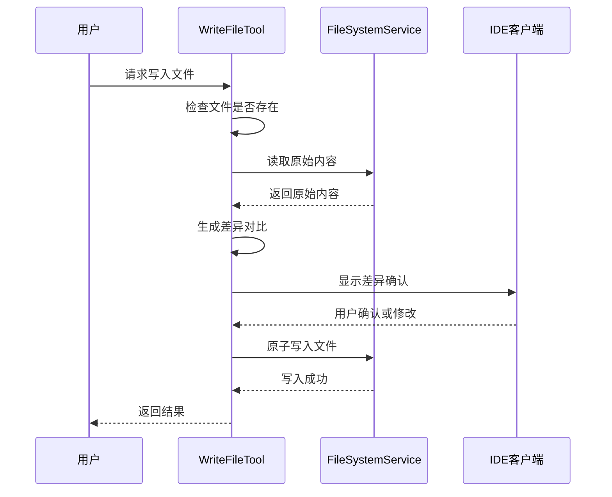
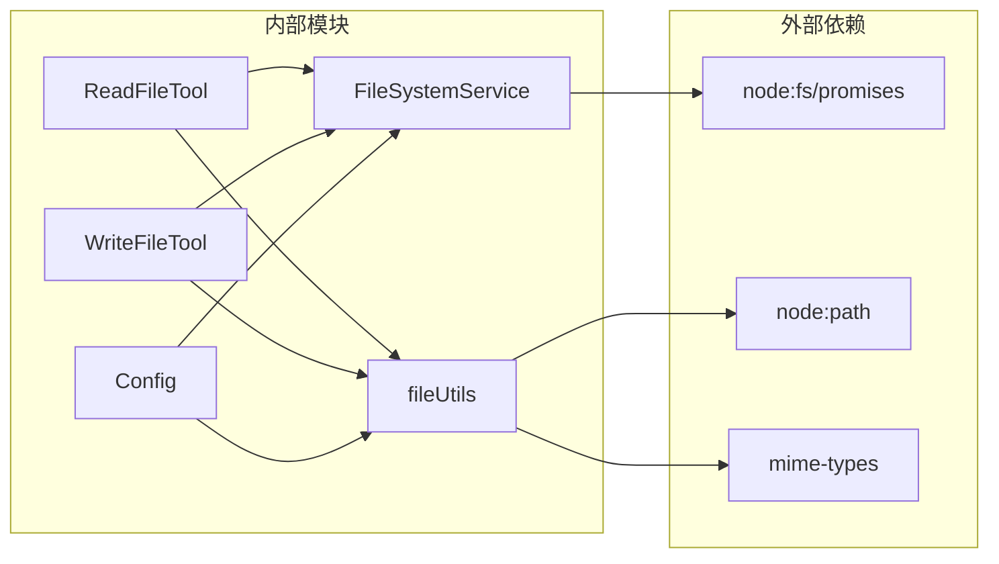

# 文件读写操作

<cite>
**本文档引用的文件**
- [fileSystemService.ts](file://packages/core/src/services/fileSystemService.ts)
- [fileUtils.ts](file://packages/core/src/utils/fileUtils.ts)
- [read-file.ts](file://packages/core/src/tools/read-file.ts)
- [write-file.ts](file://packages/core/src/tools/write-file.ts)
- [retry.ts](file://packages/core/src/utils/retry.ts)
- [result-cache.ts](file://packages/core/src/utils/filesearch/result-cache.ts)
- [config.ts](file://packages/core/src/config/config.ts)
- [file-system.test.ts](file://integration-tests/file-system.test.ts)
- [read-many-files.test.ts](file://integration-tests/read_many_files.test.ts)
</cite>

## 目录
1. [简介](#简介)
2. [项目结构概览](#项目结构概览)
3. [核心组件分析](#核心组件分析)
4. [架构概览](#架构概览)
5. [详细组件分析](#详细组件分析)
6. [依赖关系分析](#依赖关系分析)
7. [性能考虑](#性能考虑)
8. [故障排除指南](#故障排除指南)
9. [结论](#结论)

## 简介

qwen-code项目实现了一套完整的文件读写系统，提供了跨平台的文件操作能力。该系统通过抽象层设计实现了文件操作的统一接口，支持多种文件类型的处理，并包含了完善的错误处理、性能优化和安全控制机制。

系统的核心设计理念是通过`FileSystemService`接口抽象出标准的文件操作方法，同时在`fileUtils`模块中提供了丰富的辅助功能，包括文件类型检测、编码识别、权限检查等。这种设计使得系统能够在不同的运行环境中灵活适配，无论是本地文件系统还是虚拟文件系统。

## 项目结构概览

文件读写功能主要分布在以下关键目录中：



**图表来源**
- [fileSystemService.ts](file://packages/core/src/services/fileSystemService.ts#L1-L42)
- [fileUtils.ts](file://packages/core/src/utils/fileUtils.ts#L1-L50)
- [read-file.ts](file://packages/core/src/tools/read-file.ts#L1-L50)

**章节来源**
- [fileSystemService.ts](file://packages/core/src/services/fileSystemService.ts#L1-L42)
- [fileUtils.ts](file://packages/core/src/utils/fileUtils.ts#L1-L343)

## 核心组件分析

### FileSystemService 接口

`FileSystemService`是整个文件操作系统的抽象层，定义了标准的文件读写接口：

```typescript
export interface FileSystemService {
  readTextFile(filePath: string): Promise<string>;
  writeTextFile(filePath: string, content: string): Promise<void>;
}
```

这个接口的设计遵循了单一职责原则，专注于文本文件的读写操作。通过抽象层设计，系统可以在不同的运行环境中灵活切换实现，例如在浏览器环境中可以使用虚拟文件系统，在Node.js环境中使用真实的文件系统。

### StandardFileSystemService 实现

标准实现直接基于Node.js的`fs/promises`模块：

```typescript
export class StandardFileSystemService implements FileSystemService {
  async readTextFile(filePath: string): Promise<string> {
    return fs.readFile(filePath, 'utf-8');
  }

  async writeTextFile(filePath: string, content: string): Promise<void> {
    await fs.writeFile(filePath, content, 'utf-8');
  }
}
```

这种实现方式简单高效，充分利用了Node.js原生的异步文件操作能力。

**章节来源**
- [fileSystemService.ts](file://packages/core/src/services/fileSystemService.ts#L10-L42)

## 架构概览

文件读写系统采用分层架构设计，确保了良好的可维护性和扩展性：



**图表来源**
- [read-file.ts](file://packages/core/src/tools/read-file.ts#L1-L50)
- [write-file.ts](file://packages/core/src/tools/write-file.ts#L1-L50)
- [fileUtils.ts](file://packages/core/src/utils/fileUtils.ts#L1-L50)

## 详细组件分析

### ReadFileTool 工具实现

`ReadFileTool`是文件读取功能的核心实现，提供了丰富的参数支持和智能的内容处理：



**图表来源**
- [read-file.ts](file://packages/core/src/tools/read-file.ts#L25-L100)
- [fileUtils.ts](file://packages/core/src/utils/fileUtils.ts#L120-L180)

#### 文件类型检测机制

系统实现了智能的文件类型检测机制，能够准确识别各种文件类型：

```typescript
export async function detectFileType(filePath: string): Promise<'text' | 'image' | 'pdf' | 'audio' | 'video' | 'binary' | 'svg'> {
  const ext = path.extname(filePath).toLowerCase();
  
  // 特殊处理TypeScript扩展名
  if (['.ts', '.mts', '.cts'].includes(ext)) {
    return 'text';
  }
  
  if (ext === '.svg') {
    return 'svg';
  }
  
  const lookedUpMimeType = mime.lookup(filePath);
  if (lookedUpMimeType) {
    if (lookedUpMimeType.startsWith('image/')) return 'image';
    if (lookedUpMimeType.startsWith('audio/')) return 'audio';
    if (lookedUpMimeType.startsWith('video/')) return 'video';
    if (lookedUpMimeType === 'application/pdf') return 'pdf';
  }
  
  // 内容检测
  if (await isBinaryFile(filePath)) {
    return 'binary';
  }
  
  return 'text';
}
```

#### 大文件分块读取

对于大型文件，系统提供了分块读取功能，避免内存溢出：

```typescript
// 分块读取逻辑
const content = await fileSystemService.readTextFile(filePath);
const lines = content.split('\n');
const originalLineCount = lines.length;

const startLine = offset || 0;
const effectiveLimit = limit === undefined ? DEFAULT_MAX_LINES_TEXT_FILE : limit;
const endLine = Math.min(startLine + effectiveLimit, originalLineCount);

const selectedLines = lines.slice(startLine, endLine);
```

**章节来源**
- [read-file.ts](file://packages/core/src/tools/read-file.ts#L1-L210)
- [fileUtils.ts](file://packages/core/src/utils/fileUtils.ts#L120-L200)

### WriteFileTool 工具实现

`WriteFileTool`提供了安全的文件写入功能，包含确认机制和原子写入支持：



**图表来源**
- [write-file.ts](file://packages/core/src/tools/write-file.ts#L80-L150)

#### 原子写入机制

系统实现了原子写入机制，确保文件操作的完整性：

```typescript
async function getCorrectedFileContent(
  config: Config,
  filePath: string,
  proposedContent: string,
): Promise<GetCorrectedFileContentResult> {
  let originalContent = '';
  let fileExists = false;
  const correctedContent = proposedContent;

  try {
    originalContent = await config.getFileSystemService().readTextFile(filePath);
    fileExists = true;
  } catch (err) {
    if (isNodeError(err) && err.code === 'ENOENT') {
      fileExists = false;
      originalContent = '';
    } else {
      // 处理其他错误情况
      fileExists = true;
      originalContent = '';
      return { originalContent, correctedContent, fileExists, error };
    }
  }

  return { originalContent, correctedContent, fileExists };
}
```

**章节来源**
- [write-file.ts](file://packages/core/src/tools/write-file.ts#L1-L482)

### fileUtils 辅助函数

`fileUtils`模块提供了丰富的文件处理辅助函数：

#### 路径解析和验证

```typescript
export function isWithinRoot(pathToCheck: string, rootDirectory: string): boolean {
  const normalizedPathToCheck = path.resolve(pathToCheck);
  const normalizedRootDirectory = path.resolve(rootDirectory);
  
  const rootWithSeparator = normalizedRootDirectory === path.sep ||
    normalizedRootDirectory.endsWith(path.sep)
      ? normalizedRootDirectory
      : normalizedRootDirectory + path.sep;

  return (
    normalizedPathToCheck === normalizedRootDirectory ||
    normalizedPathToCheck.startsWith(rootWithSeparator)
  );
}
```

#### 编码检测和二进制文件识别

```typescript
export async function isBinaryFile(filePath: string): Promise<boolean> {
  let fileHandle: fs.promises.FileHandle | undefined;
  try {
    fileHandle = await fs.promises.open(filePath, 'r');
    
    const stats = await fileHandle.stat();
    const fileSize = stats.size;
    if (fileSize === 0) return false;
    
    const bufferSize = Math.min(4096, fileSize);
    const buffer = Buffer.alloc(bufferSize);
    const result = await fileHandle.read(buffer, 0, buffer.length, 0);
    const bytesRead = result.bytesRead;

    if (bytesRead === 0) return false;

    let nonPrintableCount = 0;
    for (let i = 0; i < bytesRead; i++) {
      if (buffer[i] === 0) return true; // Null byte是强指示器
      if (buffer[i] < 9 || (buffer[i] > 13 && buffer[i] < 32)) {
        nonPrintableCount++;
      }
    }
    
    return nonPrintableCount / bytesRead > 0.3;
  } finally {
    if (fileHandle) {
      try {
        await fileHandle.close();
      } catch (closeError) {
        console.warn(`Failed to close file handle for: ${filePath}`, closeError);
      }
    }
  }
}
```

**章节来源**
- [fileUtils.ts](file://packages/core/src/utils/fileUtils.ts#L40-L120)

## 依赖关系分析

文件读写系统的依赖关系体现了清晰的分层架构：



**图表来源**
- [fileSystemService.ts](file://packages/core/src/services/fileSystemService.ts#L1-L10)
- [fileUtils.ts](file://packages/core/src/utils/fileUtils.ts#L1-L15)

**章节来源**
- [fileSystemService.ts](file://packages/core/src/services/fileSystemService.ts#L1-L42)
- [fileUtils.ts](file://packages/core/src/utils/fileUtils.ts#L1-L343)
- [read-file.ts](file://packages/core/src/tools/read-file.ts#L1-L50)
- [write-file.ts](file://packages/core/src/tools/write-file.ts#L1-L50)

## 性能考虑

### 缓存机制

系统实现了多层缓存机制来提升性能：

#### 结果缓存 (ResultCache)

```typescript
export class ResultCache {
  private readonly cache: Map<string, string[]>;
  private hits = 0;
  private misses = 0;

  async get(query: string): Promise<{ files: string[]; isExactMatch: boolean }> {
    const isCacheHit = this.cache.has(query);
    
    if (isCacheHit) {
      this.hits++;
      return { files: this.cache.get(query)!, isExactMatch: true };
    }

    this.misses++;
    
    // 利用前缀查询优化
    let bestBaseQuery = '';
    for (const key of this.cache.keys()) {
      if (query.startsWith(key) && key.length > bestBaseQuery.length) {
        bestBaseQuery = key;
      }
    }

    const filesToSearch = bestBaseQuery
      ? this.cache.get(bestBaseQuery)!
      : this.allFiles;

    return { files: filesToSearch, isExactMatch: false };
  }
}
```

#### 内存缓存优化

系统还实现了内存缓存来存储频繁访问的数据：

```typescript
// 缓存检查间隔限制
if (now - this.memoryCache.lastCheck < CACHE_CHECK_INTERVAL_MS) {
  return;
}

// 执行文件检查并存储promise
this.checkPromise = this.performFileCheck(qwenClient, now);
```

### I/O批处理

对于大量文件的操作，系统提供了批处理机制：

```typescript
// 批量文件读取
export class ReadManyFilesTool extends BaseDeclarativeTool<ReadManyFilesToolParams, ToolResult> {
  async execute(): Promise<ToolResult> {
    const results = await Promise.all(
      this.params.absolute_paths.map(async (path) => {
        return await processSingleFileContent(
          path,
          this.config.getTargetDir(),
          this.config.getFileSystemService()
        );
      })
    );
    
    return { llmContent: results, returnDisplay: '' };
  }
}
```

### 错误重试机制

系统实现了智能的错误重试机制：

```typescript
export async function retryWithBackoff<T>(
  fn: () => Promise<T>,
  options?: Partial<RetryOptions>,
): Promise<T> {
  const {
    maxAttempts,
    initialDelayMs,
    maxDelayMs,
    onPersistent429,
    authType,
    shouldRetry,
  } = {
    ...DEFAULT_RETRY_OPTIONS,
    ...options,
  };

  let attempt = 0;
  let currentDelay = initialDelayMs;
  let consecutive429Count = 0;

  while (attempt < maxAttempts) {
    attempt++;
    try {
      return await fn();
    } catch (error) {
      // 指数退避和抖动
      await delay(currentDelay);
      currentDelay = Math.min(currentDelay * 2, maxDelayMs);
      
      if (attempt >= maxAttempts) {
        throw error;
      }
    }
  }
}
```

**章节来源**
- [result-cache.ts](file://packages/core/src/utils/filesearch/result-cache.ts#L1-L100)
- [retry.ts](file://packages/core/src/utils/retry.ts#L1-L200)

## 故障排除指南

### 常见问题及解决方案

#### 权限不足问题

当遇到权限不足时，系统会返回明确的错误信息：

```typescript
// 权限检查和错误处理
if (isNodeError(err) && err.code === 'EACCES') {
  return {
    llmContent: `Permission denied: Cannot access file ${filePath}`,
    returnDisplay: `Permission denied: ${filePath}`,
    error: `Permission denied: ${filePath}`,
    errorType: ToolErrorType.PERMISSION_DENIED,
  };
}
```

#### 磁盘空间不足

系统会检测文件大小并提前阻止过大文件的读取：

```typescript
const fileSizeInMB = stats.size / (1024 * 1024);
if (fileSizeInMB > 20) {
  return {
    llmContent: 'File size exceeds the 20MB limit.',
    returnDisplay: 'File size exceeds the 20MB limit.',
    error: `File size exceeds the 20MB limit: ${filePath} (${fileSizeInMB.toFixed(2)}MB)`,
    errorType: ToolErrorType.FILE_TOO_LARGE,
  };
}
```

#### 符号链接和特殊文件处理

系统对符号链接和特殊文件有专门的处理逻辑：

```typescript
// 符号链接检测
const stats = await fs.promises.lstat(filePath);
if (stats.isSymbolicLink()) {
  // 解析符号链接目标
  const targetPath = await fs.promises.readlink(filePath);
  return await processSingleFileContent(targetPath, rootDirectory, fileSystemService);
}
```

#### 编码问题解决

对于非UTF-8编码的文件，系统会尝试自动检测和转换：

```typescript
// 编码检测逻辑
export const DEFAULT_ENCODING: BufferEncoding = 'utf-8';

// 自动检测编码
const detectedEncoding = await detectEncoding(filePath);
const content = await fs.readFile(filePath, detectedEncoding);
```

### 调试和监控

系统提供了详细的日志记录和监控功能：

```typescript
// 文件操作日志记录
logFileOperation(
  this.config,
  new FileOperationEvent(
    ReadFileTool.Name,
    FileOperation.READ,
    lines,
    mimetype,
    path.extname(this.params.absolute_path),
    undefined,
    programming_language,
  ),
);
```

**章节来源**
- [fileUtils.ts](file://packages/core/src/utils/fileUtils.ts#L200-L343)
- [read-file.ts](file://packages/core/src/tools/read-file.ts#L100-L210)

## 结论

qwen-code的文件读写系统展现了优秀的软件工程实践，通过分层架构、抽象接口和丰富的辅助功能，构建了一个健壮、高效且易于扩展的文件操作平台。

### 主要优势

1. **抽象化设计**：通过`FileSystemService`接口实现了跨平台兼容性
2. **智能文件处理**：支持多种文件类型的自动识别和处理
3. **性能优化**：实现了多层缓存和批处理机制
4. **错误处理**：提供了完善的错误检测和恢复机制
5. **安全性**：包含权限检查和路径验证功能

### 最佳实践建议

1. **合理使用缓存**：根据文件访问模式选择合适的缓存策略
2. **分块处理大文件**：避免一次性加载过大的文件到内存中
3. **及时释放资源**：确保文件句柄和连接得到正确关闭
4. **监控性能指标**：定期检查缓存命中率和I/O性能
5. **错误日志记录**：保持详细的错误日志以便问题排查

这个文件读写系统为开发者提供了一个强大而可靠的文件操作基础，支持各种复杂的文件处理场景，是现代软件开发中不可或缺的重要组件。