# 变更应用机制

<cite>
**本文档中引用的文件**
- [edit.ts](file://packages/core/src/tools/edit.ts)
- [textUtils.ts](file://packages/core/src/utils/textUtils.ts)
- [fileSystemService.ts](file://packages/core/src/services/fileSystemService.ts)
- [DiffRenderer.tsx](file://packages/cli/src/ui/components/messages/DiffRenderer.tsx)
- [ide-client.ts](file://packages/core/src/ide/ide-client.ts)
- [sharedTokenManager.ts](file://packages/core/src/qwen/sharedTokenManager.ts)
- [gitService.ts](file://packages/core/src/services/gitService.ts)
- [memoryDiscovery.ts](file://packages/core/src/utils/memoryDiscovery.ts)
</cite>

## 目录
1. [简介](#简介)
2. [项目结构概览](#项目结构概览)
3. [核心组件分析](#核心组件分析)
4. [架构概览](#架构概览)
5. [详细组件分析](#详细组件分析)
6. [依赖关系分析](#依赖关系分析)
7. [性能考虑](#性能考虑)
8. [故障排除指南](#故障排除指南)
9. [结论](#结论)

## 简介

变更应用机制是Qwen Code系统的核心功能之一，负责将生成的代码差异安全地应用到目标文件中。该系统通过精密的文本定位算法、事务性写入保证和智能错误回滚策略，确保代码变更的安全性和可靠性。

本文档深入阐述了edit.ts中变更应用的实现机制，重点描述如何将生成的差异安全地应用到目标文件，解释系统如何使用textUtils进行精确的代码定位，确保变更在正确的位置插入或替换。同时说明变更应用的事务性保证，包括临时文件创建、原子写入和错误回滚策略，并提供实际示例展示多文件批量编辑时的顺序控制和依赖管理。

## 项目结构概览

变更应用机制涉及多个关键模块，形成了一个完整的文件操作生态系统：


**图表来源**
- [edit.ts](file://packages/core/src/tools/edit.ts#L1-L50)
- [fileSystemService.ts](file://packages/core/src/services/fileSystemService.ts#L1-L40)
- [DiffRenderer.tsx](file://packages/cli/src/ui/components/messages/DiffRenderer.tsx#L1-L50)

**章节来源**
- [edit.ts](file://packages/core/src/tools/edit.ts#L1-L590)
- [fileSystemService.ts](file://packages/core/src/services/fileSystemService.ts#L1-L40)

## 核心组件分析

### EditTool 类设计

EditTool是变更应用机制的核心类，实现了精确的文本替换逻辑：

```typescript
export class EditTool
  extends BaseDeclarativeTool<EditToolParams, ToolResult>
  implements ModifiableDeclarativeTool<EditToolParams>
{
  static readonly Name = ToolNames.EDIT;
  
  // 参数验证和工具创建
  protected override validateToolParamValues(
    params: EditToolParams,
  ): string | null {
    // 验证文件路径绝对性
    if (!path.isAbsolute(params.file_path)) {
      return `File path must be absolute: ${params.file_path}`;
    }
    
    // 验证工作区目录范围
    const workspaceContext = this.config.getWorkspaceContext();
    if (!workspaceContext.isPathWithinWorkspace(params.file_path)) {
      const directories = workspaceContext.getDirectories();
      return `File path must be within one of the workspace directories: ${directories.join(', ')}`;
    }
    
    return null;
  }
}
```

### 应用替换算法

系统使用高效的字符串替换算法来确保精确的文本定位：

```typescript
export function applyReplacement(
  currentContent: string | null,
  oldString: string,
  newString: string,
  isNewFile: boolean,
): string {
  if (isNewFile) {
    return newString;
  }
  if (currentContent === null) {
    return oldString === '' ? newString : '';
  }
  if (oldString === '' && !isNewFile) {
    return currentContent;
  }
  return currentContent.replaceAll(oldString, newString);
}
```

**章节来源**
- [edit.ts](file://packages/core/src/tools/edit.ts#L37-L99)
- [edit.ts](file://packages/core/src/tools/edit.ts#L200-L250)

## 架构概览

变更应用机制采用分层架构设计，确保各组件职责清晰且高度解耦：


**图表来源**
- [edit.ts](file://packages/core/src/tools/edit.ts#L248-L289)
- [edit.ts](file://packages/core/src/tools/edit.ts#L328-L364)
- [ide-client.ts](file://packages/core/src/ide/ide-client.ts#L421-L458)

## 详细组件分析

### 事务性写入机制

系统实现了完整的事务性写入保证，确保文件操作的原子性和一致性：


**图表来源**
- [edit.ts](file://packages/core/src/tools/edit.ts#L328-L364)
- [sharedTokenManager.ts](file://packages/core/src/qwen/sharedTokenManager.ts#L608-L653)

### 错误处理和回滚策略

系统实现了多层次的错误处理和自动回滚机制：

```typescript
// 文件写入错误处理
try {
  this.ensureParentDirectoriesExist(this.params.file_path);
  await this.config
    .getFileSystemService()
    .writeTextFile(this.params.file_path, editData.newContent);
} catch (error) {
  const errorMsg = error instanceof Error ? error.message : String(error);
  return {
    llmContent: `Error executing edit: ${errorMsg}`,
    returnDisplay: `Error writing file: ${errorMsg}`,
    error: {
      message: errorMsg,
      type: ToolErrorType.FILE_WRITE_FAILURE,
    },
  };
}
```

### 多文件批量编辑控制

系统支持高效的多文件批量编辑，采用并发控制和依赖管理：

```typescript
// 并发限制的文件处理
async function readGeminiMdFiles(
  filePaths: string[],
  debugMode: boolean,
  importFormat: 'flat' | 'tree' = 'tree',
): Promise<GeminiFileContent[]> {
  const CONCURRENT_LIMIT = 20;
  const results: GeminiFileContent[] = [];

  for (let i = 0; i < filePaths.length; i += CONCURRENT_LIMIT) {
    const batch = filePaths.slice(i, i + CONCURRENT_LIMIT);
    const batchPromises = batch.map(
      async (filePath): Promise<GeminiFileContent> => {
        try {
          const content = await fs.readFile(filePath, 'utf-8');
          // 处理导入逻辑...
        } catch (error) {
          // 错误处理...
        }
      }
    );
    results.push(...await Promise.all(batchPromises));
  }
  return results;
}
```

**章节来源**
- [edit.ts](file://packages/core/src/tools/edit.ts#L328-L364)
- [memoryDiscovery.ts](file://packages/core/src/utils/memoryDiscovery.ts#L262-L290)

### 变更预览功能实现

系统提供了丰富的变更预览功能，支持多种格式和交互方式：


**图表来源**
- [DiffRenderer.tsx](file://packages/cli/src/ui/components/messages/DiffRenderer.tsx#L90-L145)
- [ide-client.ts](file://packages/core/src/ide/ide-client.ts#L421-L458)

### IDE集成和可视化反馈

系统与IDE深度集成，提供实时的可视化反馈：

```typescript
// IDE连接状态管理
const ideConfirmation =
  this.config.getIdeMode() &&
  ideClient?.getConnectionStatus().status === IDEConnectionStatus.Connected
    ? ideClient.openDiff(this.params.file_path, editData.newContent)
    : undefined;

// IDE确认处理
if (ideConfirmation) {
  const result = await ideConfirmation;
  if (result.status === 'accepted' && result.content) {
    this.params.old_string = editData.currentContent ?? '';
    this.params.new_string = result.content;
  }
}
```

**章节来源**
- [edit.ts](file://packages/core/src/tools/edit.ts#L248-L289)
- [ide-client.ts](file://packages/core/src/ide/ide-client.ts#L421-L458)

## 依赖关系分析

变更应用机制的依赖关系体现了清晰的分层架构：

```mermaid
graph LR
subgraph "外部依赖"
NodeFS[node:fs]
DiffLib[diff库]
PathLib[path]
end
subgraph "核心模块"
EditTool --> FileSystemService
EditTool --> TextUtils
EditTool --> DiffLib
FileSystemService --> NodeFS
TextUtils --> PathLib
end
subgraph "UI组件"
DiffRenderer --> EditTool
IDEClient --> EditTool
end
```



**图表来源**
- [edit.ts](file://packages/core/src/tools/edit.ts#L1-L30)
- [fileSystemService.ts](file://packages/core/src/services/fileSystemService.ts#L1-L20)

**章节来源**
- [edit.ts](file://packages/core/src/tools/edit.ts#L1-L30)
- [fileSystemService.ts](file://packages/core/src/services/fileSystemService.ts#L1-L40)

## 性能考虑

### 内存优化技术

系统采用了多种内存优化技术来处理大型文件：

1. **流式处理**: 对于超大文件，系统采用流式读取和处理
2. **分块处理**: 将大文件分割成可管理的块进行处理
3. **缓存策略**: 智能缓存频繁访问的文件内容
4. **垃圾回收**: 及时释放不再需要的内存资源

### 并发控制

系统实现了智能的并发控制机制：

```typescript
// 并发限制的文件读取
const CONCURRENT_LIMIT = 20;
const results: GeminiFileContent[] = [];

for (let i = 0; i < filePaths.length; i += CONCURRENT_LIMIT) {
  const batch = filePaths.slice(i, i + CONCURRENT_LIMIT);
  const batchPromises = batch.map(processFile);
  results.push(...await Promise.all(batchPromises));
}
```

## 故障排除指南

### 常见错误类型

系统定义了详细的错误类型来帮助诊断问题：

```typescript
enum ToolErrorType {
  FILE_NOT_FOUND = 'FILE_NOT_FOUND',
  ATTEMPT_TO_CREATE_EXISTING_FILE = 'ATTEMPT_TO_CREATE_EXISTING_FILE',
  EDIT_NO_OCCURRENCE_FOUND = 'EDIT_NO_OCCURRENCE_FOUND',
  EDIT_EXPECTED_OCCURRENCE_MISMATCH = 'EDIT_EXPECTED_OCCURRENCE_MISMATCH',
  EDIT_NO_CHANGE = 'EDIT_NO_CHANGE',
  READ_CONTENT_FAILURE = 'READ_CONTENT_FAILURE',
  FILE_WRITE_FAILURE = 'FILE_WRITE_FAILURE',
  PERMISSION_DENIED = 'PERMISSION_DENIED',
  NO_SPACE_LEFT = 'NO_SPACE_LEFT',
  EDIT_PREPARATION_FAILURE = 'EDIT_PREPARATION_FAILURE',
}
```

### 调试和监控

系统提供了全面的调试和监控功能：

1. **日志记录**: 详细的执行日志记录
2. **性能监控**: 实时性能指标收集
3. **错误追踪**: 完整的错误堆栈追踪
4. **状态监控**: 实时系统状态监控

**章节来源**
- [edit.ts](file://packages/core/src/tools/edit.ts#L543-L588)

## 结论

变更应用机制通过精心设计的架构和实现，为Qwen Code系统提供了安全、可靠、高效的代码变更能力。系统不仅支持单文件的精确文本替换，还具备强大的批量处理能力和智能的错误恢复机制。

主要特性包括：
- **精确的文本定位**: 基于上下文的精确匹配算法
- **事务性保证**: 原子写入和自动回滚机制
- **智能预览**: 丰富的可视化反馈和IDE集成
- **性能优化**: 并发控制和内存优化技术
- **错误处理**: 完善的错误分类和恢复策略

这些特性使得变更应用机制能够安全可靠地处理各种复杂的代码变更场景，为用户提供流畅的开发体验。