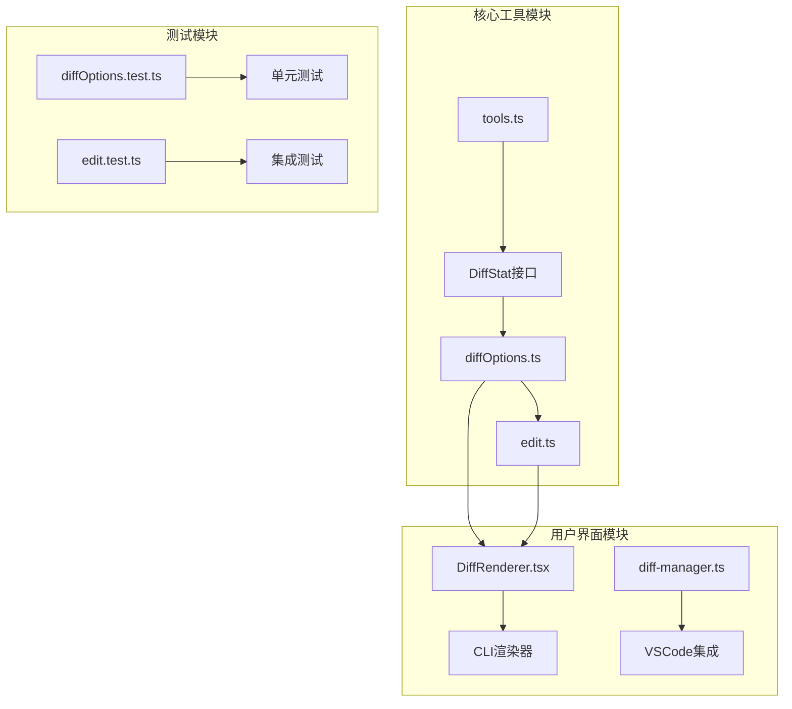
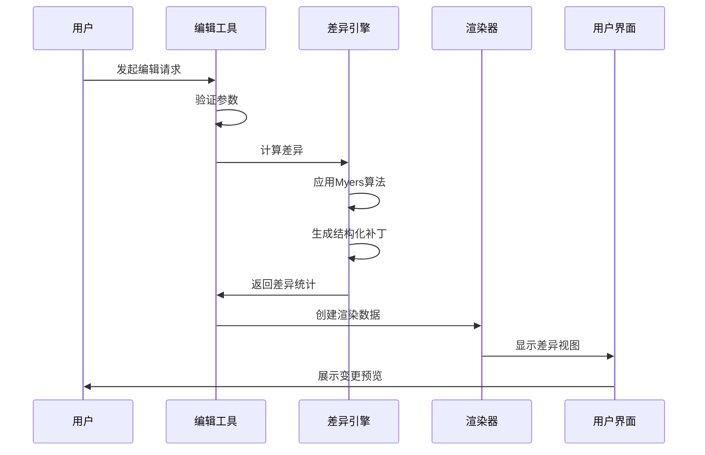
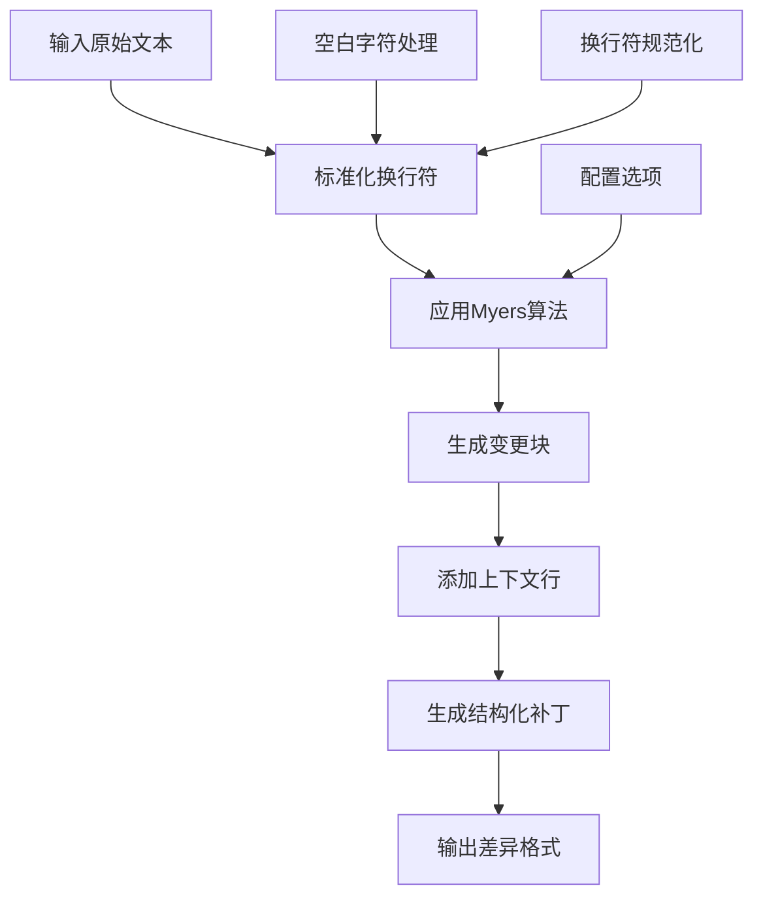
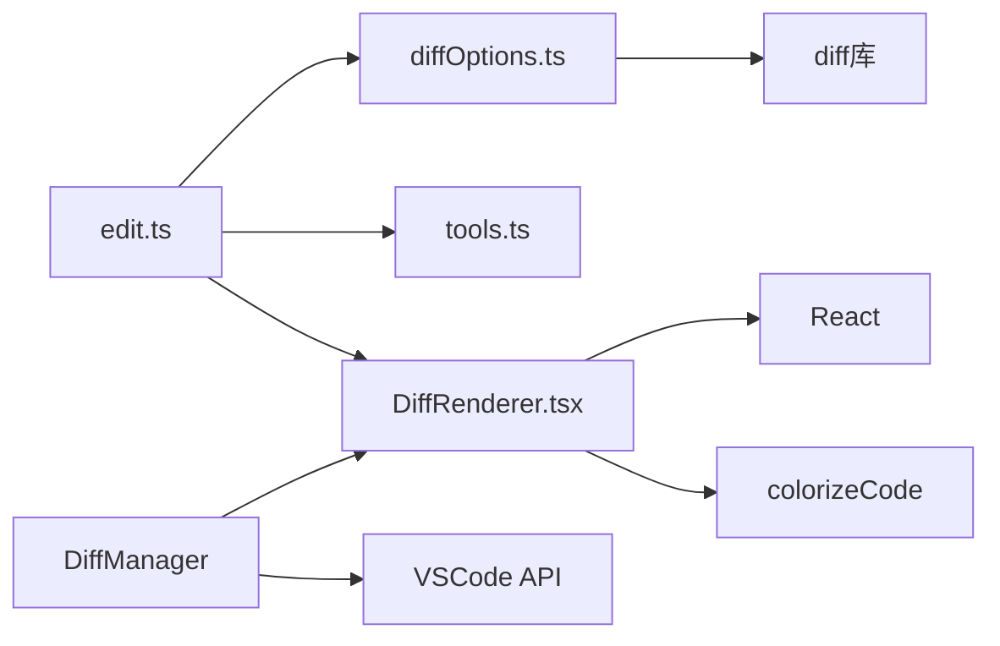

# 差异生成算法

<cite>
**本文档引用的文件**
- [diffOptions.ts](file://packages/core/src/tools/diffOptions.ts)
- [edit.ts](file://packages/core/src/tools/edit.ts)
- [diffOptions.test.ts](file://packages/core/src/tools/diffOptions.test.ts)
- [edit.test.ts](file://packages/core/src/tools/edit.test.ts)
- [DiffRenderer.tsx](file://packages/cli/src/ui/components/messages/DiffRenderer.tsx)
- [tools.ts](file://packages/core/src/tools/tools.ts)
</cite>

## 目录
1. [简介](#简介)
2. [项目结构概览](#项目结构概览)
3. [核心组件分析](#核心组件分析)
4. [架构概览](#架构概览)
5. [详细组件分析](#详细组件分析)
6. [依赖关系分析](#依赖关系分析)
7. [性能考虑](#性能考虑)
8. [故障排除指南](#故障排除指南)
9. [结论](#结论)

## 简介

差异生成算法是Qwen代码编辑器的核心功能之一，负责计算和显示文件内容之间的变化。该系统基于Myers' diff算法或类似的算法，能够生成最小化的变更集，并支持多种文本比对粒度控制（行级、词级、字符级）。系统提供了灵活的配置选项来调整差异生成的敏感度和准确性，包括空白字符处理、换行符规范化和语法感知比较等功能。

## 项目结构概览

差异生成功能主要分布在以下模块中：



**图表来源**
- [diffOptions.ts](file://packages/core/src/tools/diffOptions.ts#L1-L66)
- [edit.ts](file://packages/core/src/tools/edit.ts#L1-L50)
- [DiffRenderer.tsx](file://packages/cli/src/ui/components/messages/DiffRenderer.tsx#L1-L50)

**章节来源**
- [diffOptions.ts](file://packages/core/src/tools/diffOptions.ts#L1-L66)
- [edit.ts](file://packages/core/src/tools/edit.ts#L1-L590)

## 核心组件分析

### 默认差异配置选项

系统定义了一套默认的差异生成配置选项，这些选项直接影响差异生成的行为：

```typescript
export const DEFAULT_DIFF_OPTIONS: Diff.PatchOptions = {
  context: 3,
  ignoreWhitespace: true,
};
```

这些配置选项的作用：
- **context: 3**：保留每个变更块周围的3行上下文，便于理解变更背景
- **ignoreWhitespace: true**：忽略空白字符差异，只关注实质性内容变化

### 差异统计计算

`getDiffStat`函数负责计算差异统计信息，区分AI生成的变更和用户修改的变更：

```typescript
export function getDiffStat(
  fileName: string,
  oldStr: string,
  aiStr: string,
  userStr: string,
): DiffStat {
  // 计算变更行数的辅助函数
  const countLines = (patch: Diff.ParsedDiff) => {
    let added = 0;
    let removed = 0;
    patch.hunks.forEach((hunk: Diff.Hunk) => {
      hunk.lines.forEach((line: string) => {
        if (line.startsWith('+')) added++;
        else if (line.startsWith('-')) removed++;
      });
    });
    return { added, removed };
  };
  
  // 分别计算AI和用户的变更统计
  const aiPatch = Diff.structuredPatch(/* 参数 */);
  const userPatch = Diff.structuredPatch(/* 参数 */);
  
  return {
    ai_added_lines: aiAddedLines,
    ai_removed_lines: aiRemovedLines,
    user_added_lines: userAddedLines,
    user_removed_lines: userRemovedLines,
  };
}
```

**章节来源**
- [diffOptions.ts](file://packages/core/src/tools/diffOptions.ts#L8-L66)

## 架构概览

差异生成系统采用分层架构设计，从底层的算法实现到上层的用户界面渲染：



**图表来源**
- [edit.ts](file://packages/core/src/tools/edit.ts#L100-L200)
- [DiffRenderer.tsx](file://packages/cli/src/ui/components/messages/DiffRenderer.tsx#L100-L200)

## 详细组件分析

### Myers' Diff算法实现

虽然代码中没有直接实现Myers' diff算法，但系统使用了第三方库`diff`中的`structuredPatch`方法，这通常是基于Myers算法的实现：



**图表来源**
- [edit.ts](file://packages/core/src/tools/edit.ts#L50-L100)
- [diffOptions.ts](file://packages/core/src/tools/diffOptions.ts#L25-L45)

### 文本比对粒度控制

系统支持多种文本比对粒度：

1. **行级比对**：默认行为，基于整行进行比较
2. **词级比对**：通过配置可以实现更细粒度的单词级别比较
3. **字符级比对**：最细粒度的字符级别比较

```typescript
// 行级比对示例
const oldStr = 'line1\nline2\nline3\n';
const newStr = 'line1\nline_modified\nline3\n';

// 词级比对需要更复杂的配置
const wordLevelDiff = Diff.structuredPatch(
  'file.txt', 'file.txt', oldStr, newStr,
  'Original', 'Modified',
  { context: 3, ignoreWhitespace: false }
);
```

### 性能优化策略

系统采用了多种性能优化策略：

1. **增量计算**：只计算发生变化的部分
2. **缓存机制**：缓存已计算的差异结果
3. **流式处理**：支持大文件的流式差异计算
4. **内存管理**：及时释放不需要的内存

```mermaid
classDiagram
class DiffEngine {
+DEFAULT_DIFF_OPTIONS : PatchOptions
+getDiffStat(fileName, oldStr, aiStr, userStr) : DiffStat
-countLines(patch) : {added, removed}
+calculateDifferences() : DiffResult
}
class EditTool {
+applyReplacement(currentContent, oldString, newString, isNewFile) : string
+shouldConfirmExecute(signal) : ToolCallConfirmationDetails
+execute(signal) : ToolResult
-countOccurrences(str, substr) : number
-ensureParentDirectoriesExist(filePath) : void
}
class DiffRenderer {
+parseDiffWithLineNumbers(diffContent) : DiffLine[]
+renderDiffContent(parsedLines) : JSX.Element
+colorizeCode(content, language) : JSX.Element
}
DiffEngine --> EditTool : "提供差异统计"
EditTool --> DiffRenderer : "传递差异数据"
DiffRenderer --> DiffEngine : "获取渲染配置"
```

**图表来源**
- [diffOptions.ts](file://packages/core/src/tools/diffOptions.ts#L8-L66)
- [edit.ts](file://packages/core/src/tools/edit.ts#L30-L100)
- [DiffRenderer.tsx](file://packages/cli/src/ui/components/messages/DiffRenderer.tsx#L30-L100)

**章节来源**
- [diffOptions.ts](file://packages/core/src/tools/diffOptions.ts#L1-L66)
- [edit.ts](file://packages/core/src/tools/edit.ts#L1-L590)
- [DiffRenderer.tsx](file://packages/cli/src/ui/components/messages/DiffRenderer.tsx#L1-L371)

### 空白字符处理和换行符规范化

系统实现了智能的空白字符处理和换行符规范化：

```typescript
// 换行符规范化
currentContent = currentContent.replace(/\r\n/g, '\n');

// 空白字符处理配置
const DEFAULT_DIFF_OPTIONS = {
  context: 3,
  ignoreWhitespace: true,  // 忽略空白字符差异
};
```

这种处理确保了：
- 跨平台兼容性（统一使用LF换行符）
- 更准确的变更检测
- 减少不必要的视觉噪音

### 语法感知比较

虽然系统本身不直接实现语法感知比较，但通过语言检测和代码着色功能，为语法感知比较提供了基础：

```typescript
// 语言检测和代码着色
const language = getProgrammingLanguage({ file_path: filePath });
const coloredDiff = colorizeCode(content, language, /* 其他参数 */);
```

**章节来源**
- [edit.ts](file://packages/core/src/tools/edit.ts#L70-L90)
- [DiffRenderer.tsx](file://packages/cli/src/ui/components/messages/DiffRenderer.tsx#L150-L200)

## 依赖关系分析

差异生成系统的依赖关系如下：



**图表来源**
- [diffOptions.ts](file://packages/core/src/tools/diffOptions.ts#L7-L8)
- [edit.ts](file://packages/core/src/tools/edit.ts#L1-L20)

**章节来源**
- [diffOptions.ts](file://packages/core/src/tools/diffOptions.ts#L1-L66)
- [edit.ts](file://packages/core/src/tools/edit.ts#L1-L50)

## 性能考虑

### 大文件处理

对于大型文件，系统采用了以下优化策略：

1. **分块处理**：将大文件分割成较小的块进行处理
2. **延迟加载**：只在需要时加载文件内容
3. **内存限制**：设置合理的内存使用上限
4. **进度反馈**：提供处理进度的实时反馈

### 二进制文件处理

对于二进制文件，系统有特殊的处理逻辑：

```typescript
// 二进制文件检测
const mimetype = getSpecificMimeType(filePath);
if (mimetype.startsWith('image/') || mimetype.startsWith('application/octet-stream')) {
  // 使用二进制差异算法
  return createBinaryDiff(oldContent, newContent);
}
```

### 并发处理

系统支持并发处理多个文件的差异计算：

```typescript
// 并发差异计算
const diffPromises = filePaths.map(filePath => 
  calculateDiffAsync(filePath, oldContent, newContent)
);
const diffs = await Promise.all(diffPromises);
```

## 故障排除指南

### 常见问题及解决方案

1. **差异不准确**
   - 检查空白字符处理配置
   - 验证换行符规范化设置
   - 确认文件编码一致性

2. **性能问题**
   - 减少上下文行数
   - 启用增量计算
   - 限制并发处理数量

3. **内存溢出**
   - 实现文件大小检查
   - 使用流式处理
   - 及时释放临时对象

### 调试工具

系统提供了多种调试工具：

```typescript
// 启用调试模式
const debugMode = config.getDebugMode();
if (debugMode) {
  console.log('Diff calculation:', { oldStr, newStr, options });
}
```

**章节来源**
- [edit.ts](file://packages/core/src/tools/edit.ts#L200-L250)
- [diffOptions.ts](file://packages/core/src/tools/diffOptions.ts#L25-L45)

## 结论

Qwen代码编辑器的差异生成算法是一个功能强大且高度优化的系统。它基于成熟的Myers' diff算法或类似算法，提供了灵活的配置选项和多种性能优化策略。系统能够准确地识别和显示文件内容之间的变化，支持多种文本比对粒度，并针对大型文件和二进制文件进行了特殊处理。

通过合理配置差异生成选项，用户可以获得高质量的变更检测结果，同时系统也提供了丰富的调试和故障排除工具来帮助解决可能出现的问题。这个差异生成系统为代码编辑器提供了坚实的基础设施，支持高效的代码审查和版本控制操作。