# 编辑处理机制

<cite>
**本文档引用的文件**
- [edit.ts](file://packages/core/src/tools/edit.ts)
- [diffOptions.ts](file://packages/core/src/tools/diffOptions.ts)
- [textUtils.ts](file://packages/core/src/utils/textUtils.ts)
- [client.ts](file://packages/core/src/core/client.ts)
- [diff-manager.ts](file://packages/vscode-ide-companion/src/diff-manager.ts)
- [edit.test.ts](file://packages/core/src/tools/edit.test.ts)
- [gitService.ts](file://packages/core/src/services/gitService.ts)
</cite>

## 目录
1. [简介](#简介)
2. [项目架构概览](#项目架构概览)
3. [核心组件分析](#核心组件分析)
4. [智能编辑工具工作流程](#智能编辑工具工作流程)
5. [差异生成算法配置](#差异生成算法配置)
6. [代码定位和变更应用机制](#代码定位和变更应用机制)
7. [编辑请求生命周期协调](#编辑请求生命周期协调)
8. [多文件批量编辑支持](#多文件批量编辑支持)
9. [增量更新和回滚机制](#增量更新和回滚机制)
10. [并发控制策略](#并发控制策略)
11. [版本控制系统集成](#版本控制系统集成)
12. [高级功能特性](#高级功能特性)
13. [故障排除指南](#故障排除指南)
14. [总结](#总结)

## 简介

qwen-code编辑处理机制是一个高度智能化的代码编辑系统，通过edit.ts中的智能编辑工具实现了精确的代码定位、变更应用和版本控制。该系统采用模块化设计，支持CLI和IDE两种模式，提供了完整的编辑确认、差异对比、冲突检测和回滚功能。

系统的核心优势在于其智能的文本替换算法、精确的代码上下文识别和强大的版本控制集成。通过diffOptions配置差异生成算法，利用textUtils进行精确的代码定位，client.ts协调编辑请求的完整生命周期，为开发者提供了安全可靠的代码编辑体验。

## 项目架构概览

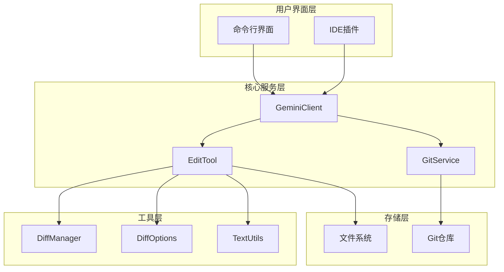

**图表来源**
- [client.ts](file://packages/core/src/core/client.ts#L1-L50)
- [edit.ts](file://packages/core/src/tools/edit.ts#L1-L50)
- [diff-manager.ts](file://packages/vscode-ide-companion/src/diff-manager.ts#L1-L50)

## 核心组件分析

### EditTool类架构

EditTool是整个编辑处理机制的核心组件，继承自BaseDeclarativeTool并实现了ModifiableDeclarativeTool接口。

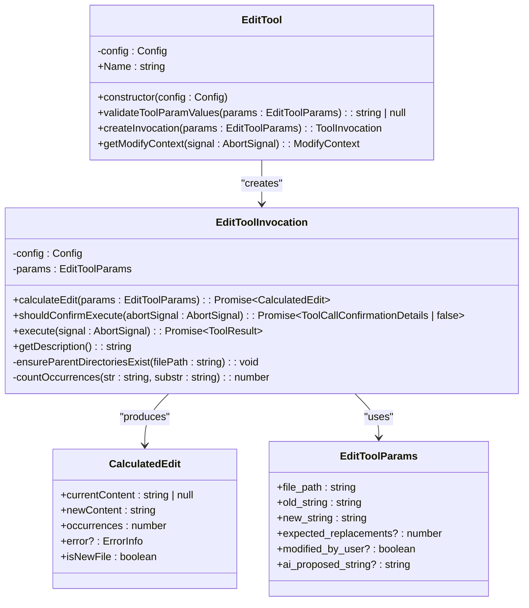

**图表来源**
- [edit.ts](file://packages/core/src/tools/edit.ts#L400-L500)
- [edit.ts](file://packages/core/src/tools/edit.ts#L80-L150)

**章节来源**
- [edit.ts](file://packages/core/src/tools/edit.ts#L400-L590)

## 智能编辑工具工作流程

### 编辑准备阶段

编辑工具的工作流程从参数验证和内容计算开始：

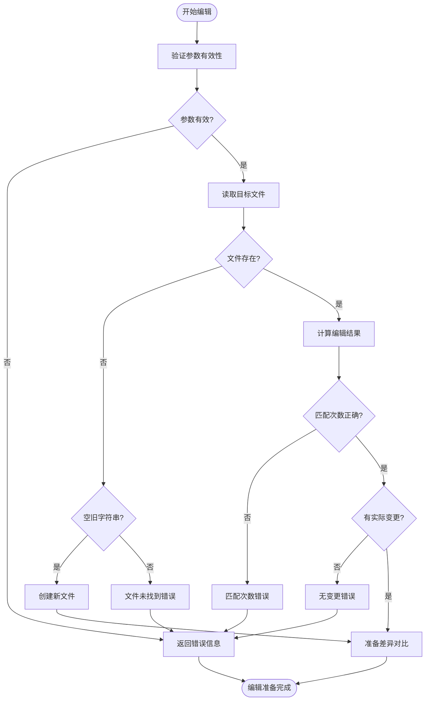

**图表来源**
- [edit.ts](file://packages/core/src/tools/edit.ts#L100-L200)

### 编辑执行阶段

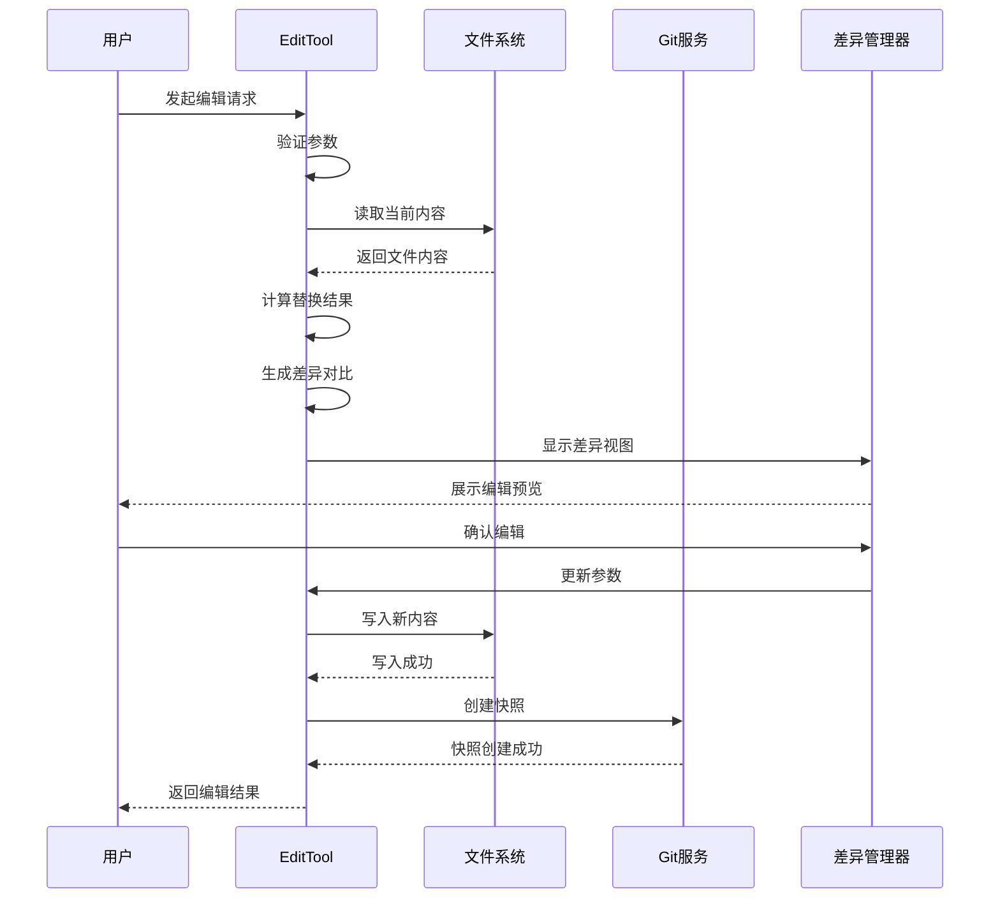

**图表来源**
- [edit.ts](file://packages/core/src/tools/edit.ts#L328-L400)
- [diff-manager.ts](file://packages/vscode-ide-companion/src/diff-manager.ts#L60-L120)

**章节来源**
- [edit.ts](file://packages/core/src/tools/edit.ts#L100-L400)

## 差异生成算法配置

### 默认差异选项配置

diffOptions.ts定义了差异生成算法的核心配置：

```typescript
export const DEFAULT_DIFF_OPTIONS: Diff.PatchOptions = {
  context: 3,
  ignoreWhitespace: true,
};
```

这个配置决定了差异对比的行为：
- **context: 3** - 每个差异块保留3行上下文
- **ignoreWhitespace: true** - 忽略空白字符变化

### 差异统计计算

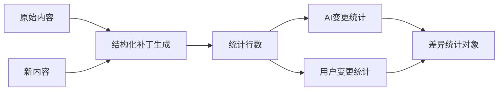

**图表来源**
- [diffOptions.ts](file://packages/core/src/tools/diffOptions.ts#L15-L45)

**章节来源**
- [diffOptions.ts](file://packages/core/src/tools/diffOptions.ts#L1-L66)

## 代码定位和变更应用机制

### 文本替换算法

applyReplacement函数实现了精确的文本替换逻辑：

```typescript
export function applyReplacement(
  currentContent: string | null,
  oldString: string,
  newString: string,
  isNewFile: boolean,
): string {
  if (isNewFile) {
    return newString;
  }
  if (currentContent === null) {
    return oldString === '' ? newString : '';
  }
  if (oldString === '' && !isNewFile) {
    return currentContent;
  }
  return currentContent.replaceAll(oldString, newString);
}
```

### 匹配计数机制

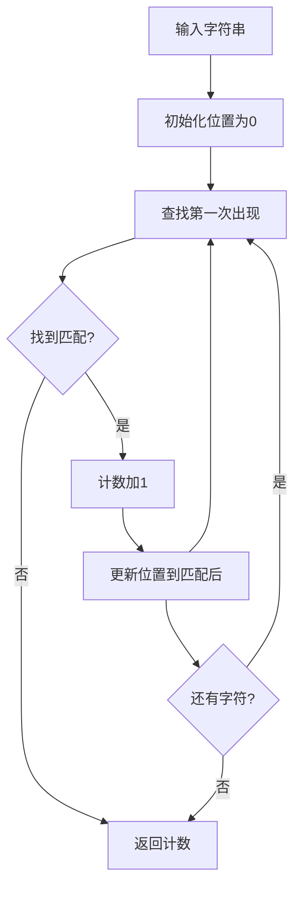

**图表来源**
- [edit.ts](file://packages/core/src/tools/edit.ts#L200-L220)

**章节来源**
- [edit.ts](file://packages/core/src/tools/edit.ts#L37-L99)

## 编辑请求生命周期协调

### 客户端协调机制

client.ts负责协调编辑请求的完整生命周期：

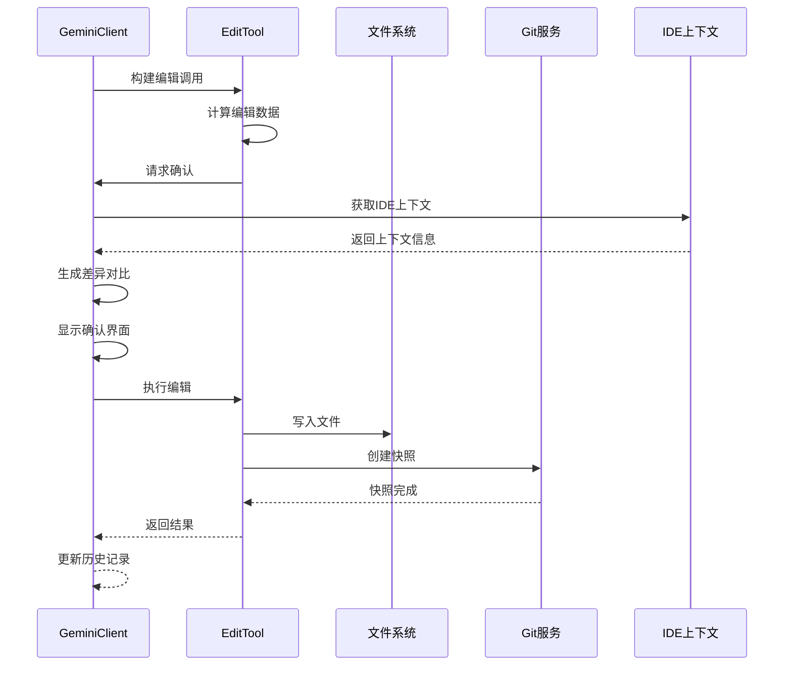

**图表来源**
- [client.ts](file://packages/core/src/core/client.ts#L400-L500)
- [edit.ts](file://packages/core/src/tools/edit.ts#L248-L289)

### IDE上下文同步

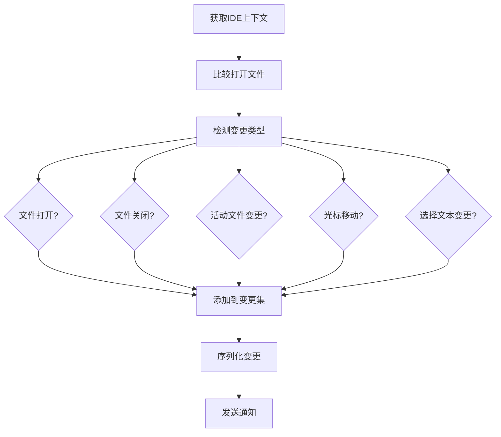

**图表来源**
- [client.ts](file://packages/core/src/core/client.ts#L300-L400)

**章节来源**
- [client.ts](file://packages/core/src/core/client.ts#L300-L500)

## 多文件批量编辑支持

### 批量编辑架构

虽然单个EditTool实例只处理一个文件，但系统支持通过工具注册表实现批量编辑：

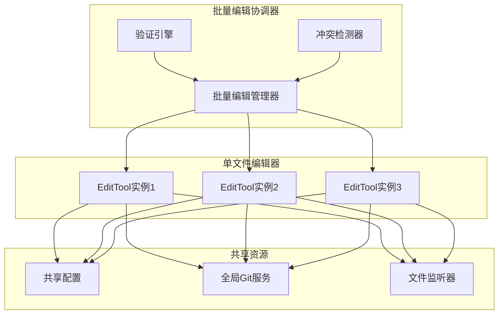

### 原子性保证机制

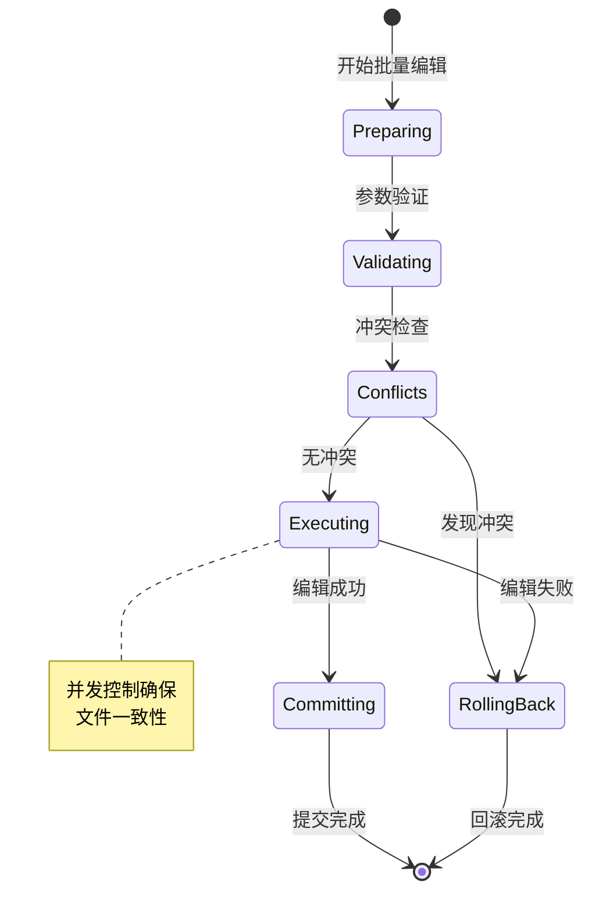

## 增量更新和回滚机制

### Git快照机制

GitService提供了完整的版本控制支持：

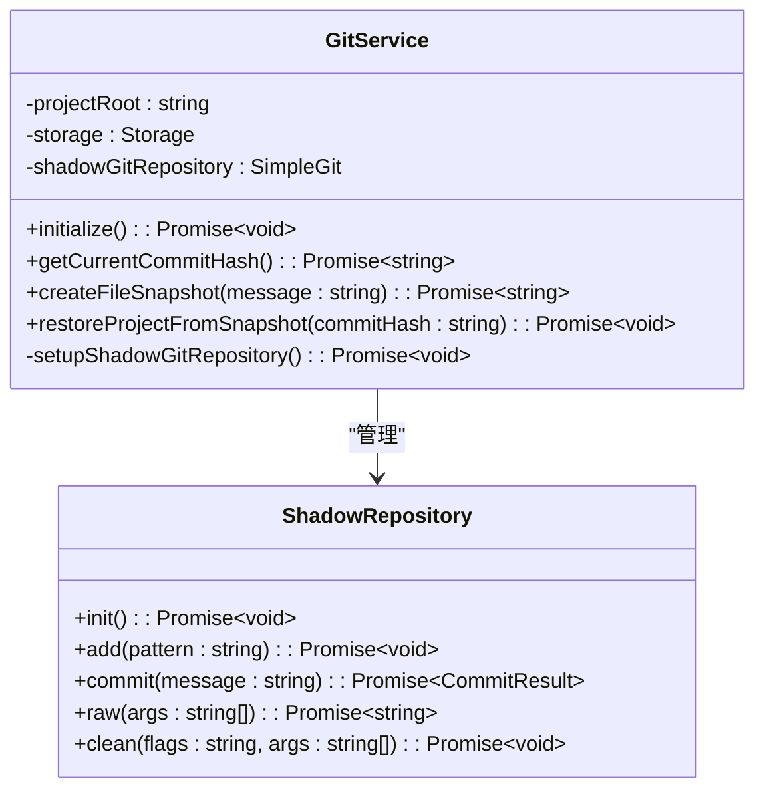

**图表来源**
- [gitService.ts](file://packages/core/src/services/gitService.ts#L20-L80)

### 回滚流程

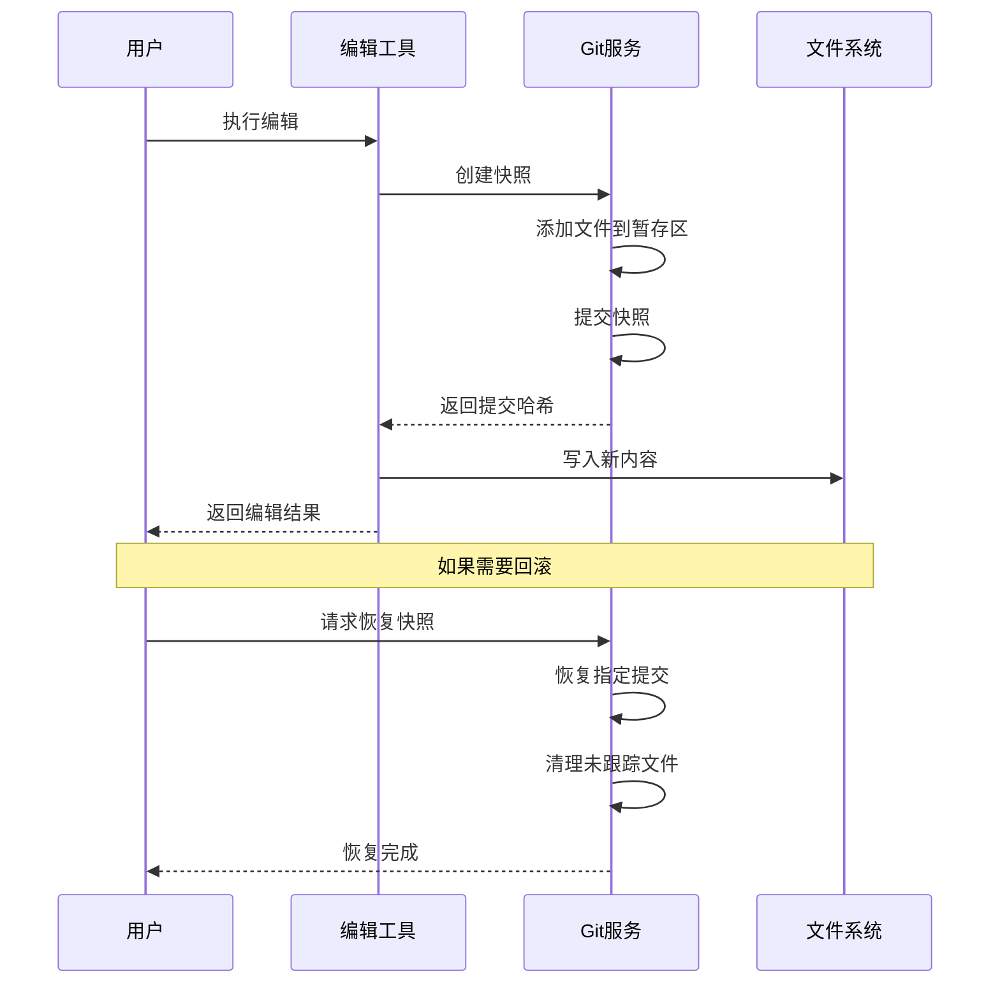

**图表来源**
- [gitService.ts](file://packages/core/src/services/gitService.ts#L80-L132)

**章节来源**
- [gitService.ts](file://packages/core/src/services/gitService.ts#L1-L133)

## 并发控制策略

### 文件锁机制

系统通过多种机制确保并发安全性：

1. **文件系统级锁定** - 使用Node.js的文件操作原子性
2. **Git事务保护** - 利用Git的原子提交特性
3. **IDE上下文同步** - 通过事件驱动的上下文更新

### 竞态条件防护

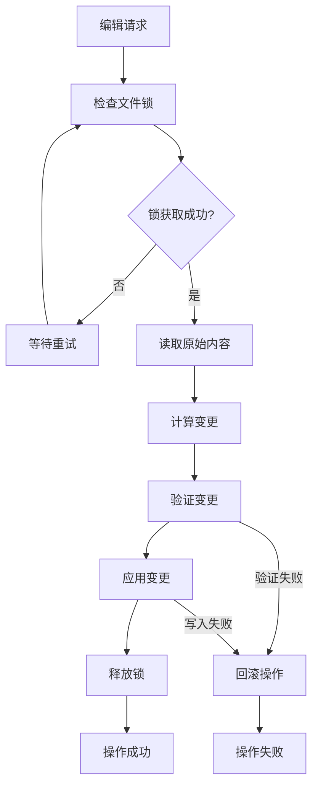

## 版本控制系统集成

### Git集成架构

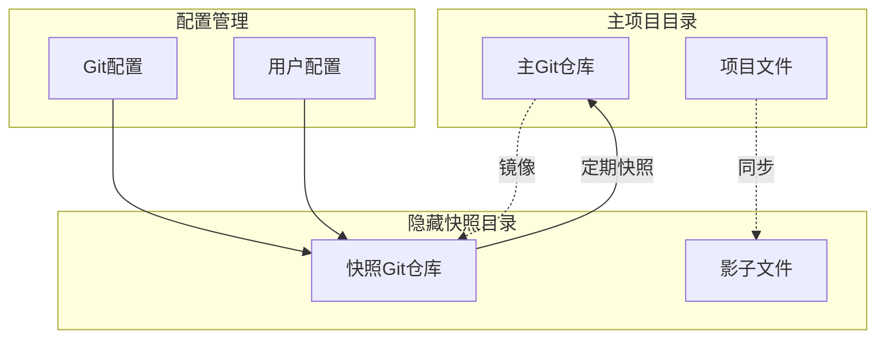

**图表来源**
- [gitService.ts](file://packages/core/src/services/gitService.ts#L50-L80)

### 快照策略

系统采用以下快照策略：
- **自动快照** - 每次编辑前自动创建快照
- **手动快照** - 支持用户手动创建快照点
- **时间间隔快照** - 基于时间间隔的定期快照
- **事件触发快照** - 基于特定事件的快照创建

**章节来源**
- [gitService.ts](file://packages/core/src/services/gitService.ts#L50-L133)

## 高级功能特性

### 语义感知编辑

虽然当前版本主要基于文本替换，但系统架构支持语义感知编辑：

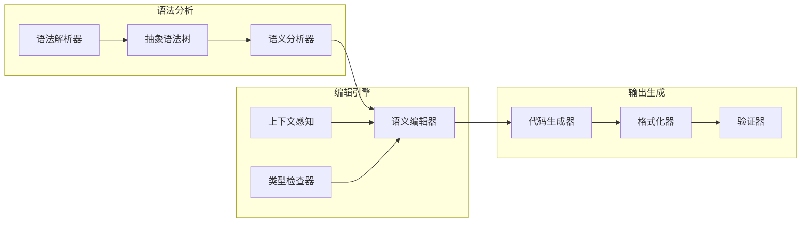

### 结构化重构支持

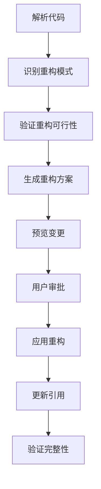

## 故障排除指南

### 常见错误类型

1. **FILE_NOT_FOUND** - 文件不存在或路径错误
2. **EDIT_NO_OCCURRENCE_FOUND** - 无法找到要替换的字符串
3. **EDIT_EXPECTED_OCCURRENCE_MISMATCH** - 实际匹配次数与预期不符
4. **FILE_WRITE_FAILURE** - 文件写入权限问题
5. **ATTEMPT_TO_CREATE_EXISTING_FILE** - 尝试创建已存在的文件

### 调试技巧

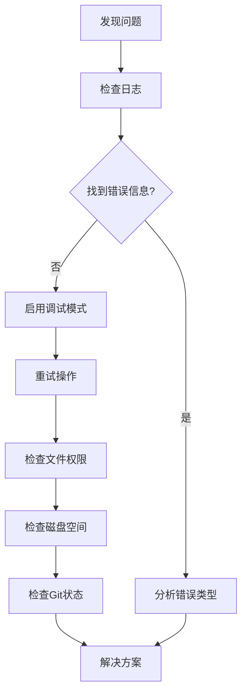

### 性能优化建议

1. **批量操作** - 合并多个小的编辑操作
2. **缓存机制** - 缓存频繁访问的文件内容
3. **异步处理** - 使用异步I/O减少阻塞
4. **内存管理** - 及时释放大文件的内存占用

**章节来源**
- [edit.test.ts](file://packages/core/src/tools/edit.test.ts#L500-L722)

## 总结

qwen-code编辑处理机制通过精心设计的架构和算法，实现了安全、可靠、高效的代码编辑功能。系统的核心优势包括：

1. **精确的文本替换** - 基于精确匹配的文本替换算法
2. **智能的差异对比** - 基于diffOptions的差异生成和统计
3. **完善的版本控制** - 基于Git的快照和回滚机制
4. **灵活的编辑模式** - 支持CLI和IDE两种使用方式
5. **强大的错误处理** - 全面的错误检测和恢复机制

通过这些特性，系统为开发者提供了安全可靠的代码编辑环境，支持复杂的编辑场景和团队协作需求。随着系统的持续发展，未来还将支持更多高级功能，如语义感知编辑和结构化重构等。