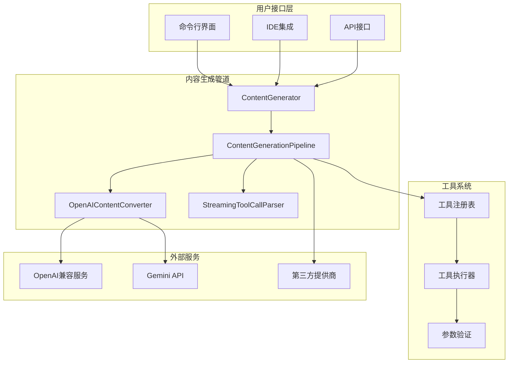
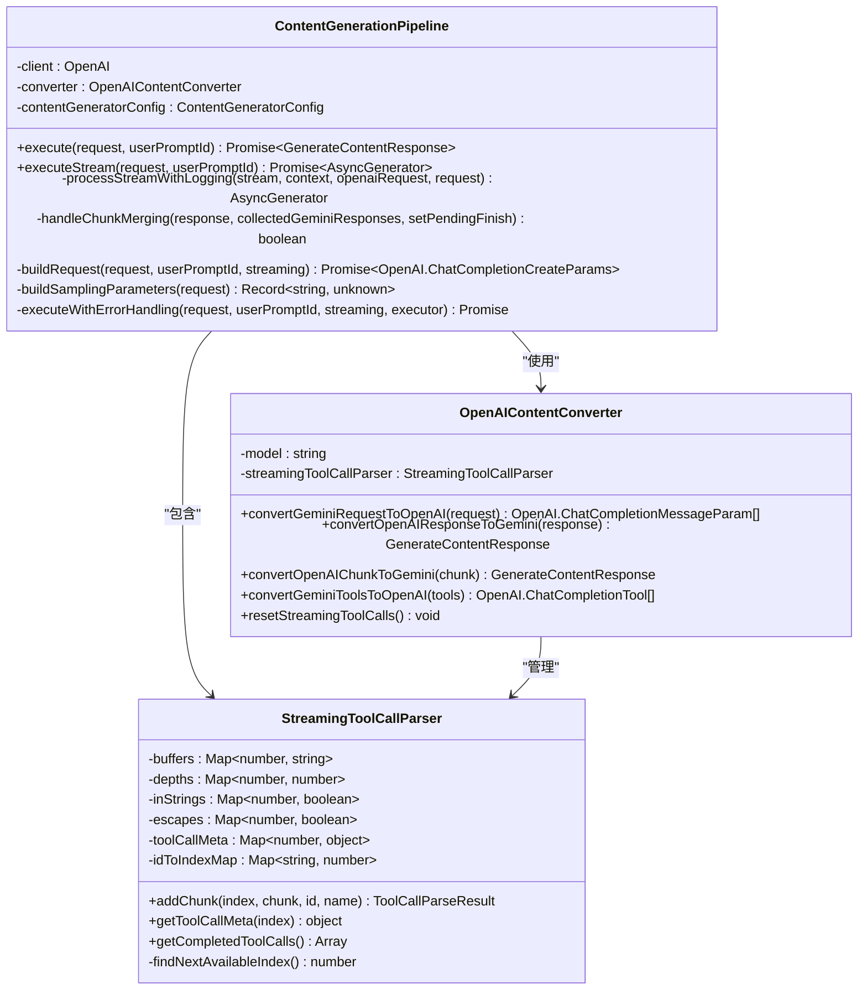
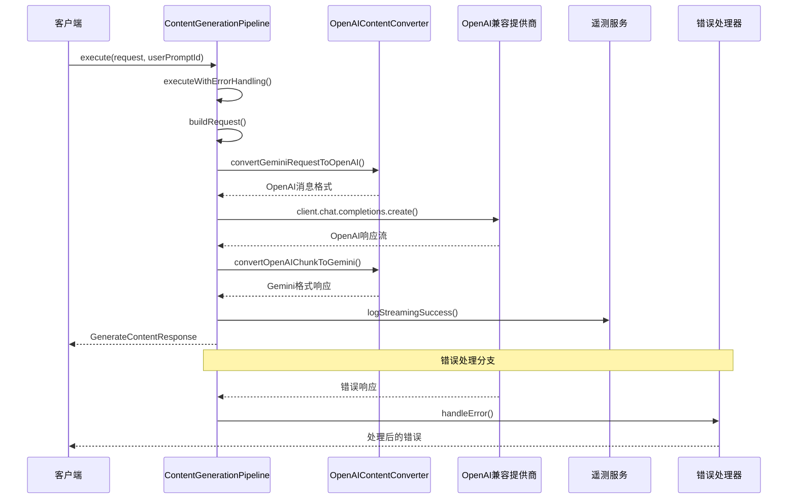
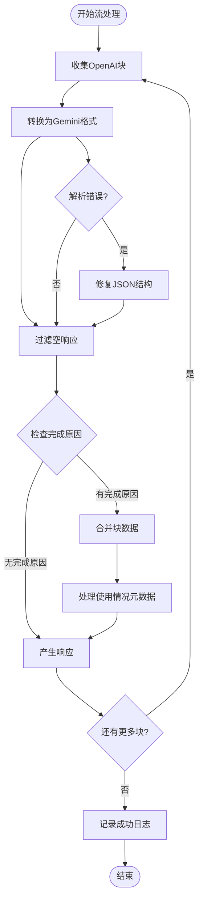
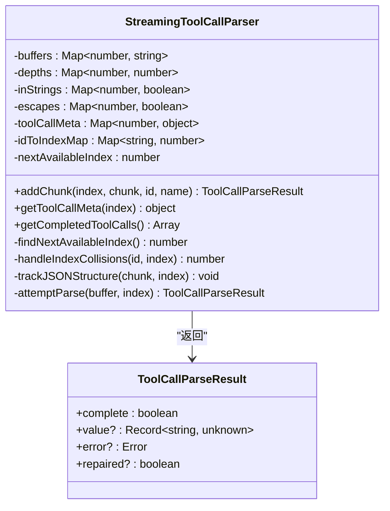
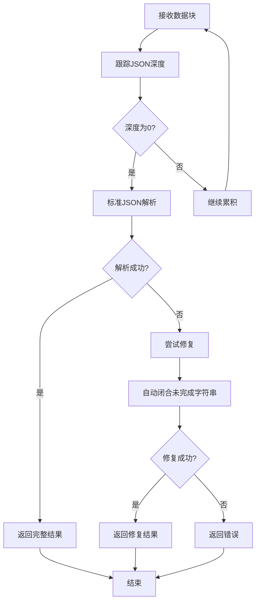
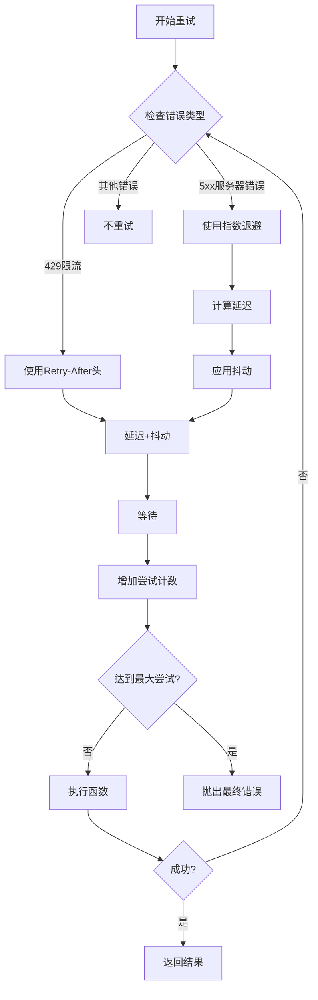
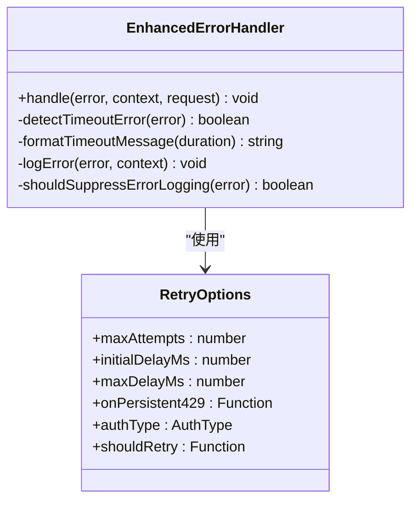

# 内容生成管道

<cite>
**本文档引用的文件**
- [contentGenerator.ts](file://packages/core/src/core/contentGenerator.ts)
- [pipeline.ts](file://packages/core/src/core/openaiContentGenerator/pipeline.ts)
- [streamingToolCallParser.ts](file://packages/core/src/core/openaiContentGenerator/streamingToolCallParser.ts)
- [converter.ts](file://packages/core/src/core/openaiContentGenerator/converter.ts)
- [pipeline.test.ts](file://packages/core/src/core/openaiContentGenerator/pipeline.test.ts)
- [streamingToolCallParser.test.ts](file://packages/core/src/core/openaiContentGenerator/streamingToolCallParser.test.ts)
- [retry.ts](file://packages/core/src/utils/retry.ts)
- [errorHandler.ts](file://packages/core/src/core/openaiContentGenerator/errorHandler.ts)
- [constants.ts](file://packages/core/src/core/openaiContentGenerator/constants.ts)
- [tools.ts](file://packages/core/src/tools/tools.ts)
</cite>

## 目录
1. [简介](#简介)
2. [项目架构概览](#项目架构概览)
3. [核心组件分析](#核心组件分析)
4. [内容生成管道详解](#内容生成管道详解)
5. [流式工具调用解析器](#流式工具调用解析器)
6. [错误处理与重试机制](#错误处理与重试机制)
7. [性能优化策略](#性能优化策略)
8. [故障排除指南](#故障排除指南)
9. [总结](#总结)

## 简介

qwen-code内容生成管道是一个复杂而精密的系统，负责处理从用户请求到最终响应的整个生命周期。该管道的核心功能包括：

- **请求处理流程**：将Gemini格式的请求转换为OpenAI兼容格式
- **上下文管理**：维护对话历史和状态信息
- **响应流组装**：实时处理和转换流式响应
- **工具调用解析**：智能解析和重组流式工具调用数据
- **错误恢复**：提供强大的错误检测和恢复机制

## 项目架构概览



**图表来源**
- [contentGenerator.ts](file://packages/core/src/core/contentGenerator.ts#L1-L50)
- [pipeline.ts](file://packages/core/src/core/openaiContentGenerator/pipeline.ts#L1-L50)

## 核心组件分析

### ContentGenerator接口

ContentGenerator是整个管道的核心抽象层，定义了所有内容生成操作的标准接口：

```typescript
export interface ContentGenerator {
  generateContent(
    request: GenerateContentParameters,
    userPromptId: string,
  ): Promise<GenerateContentResponse>;

  generateContentStream(
    request: GenerateContentParameters,
    userPromptId: string,
  ): Promise<AsyncGenerator<GenerateContentResponse>>;

  countTokens(request: CountTokensParameters): Promise<CountTokensResponse>;

  embedContent(request: EmbedContentParameters): Promise<EmbedContentResponse>;

  userTier?: UserTierId;
}
```

### ContentGenerationPipeline类

Pipeline类是管道的主要执行器，负责协调整个内容生成流程：



**图表来源**
- [pipeline.ts](file://packages/core/src/core/openaiContentGenerator/pipeline.ts#L25-L50)
- [converter.ts](file://packages/core/src/core/openaiContentGenerator/converter.ts#L40-L60)
- [streamingToolCallParser.ts](file://packages/core/src/core/openaiContentGenerator/streamingToolCallParser.ts#L25-L50)

**章节来源**
- [contentGenerator.ts](file://packages/core/src/core/contentGenerator.ts#L25-L100)
- [pipeline.ts](file://packages/core/src/core/openaiContentGenerator/pipeline.ts#L25-L100)

## 内容生成管道详解

### 请求处理流程

管道的请求处理遵循严格的转换和验证流程：



**图表来源**
- [pipeline.ts](file://packages/core/src/core/openaiContentGenerator/pipeline.ts#L40-L80)
- [converter.ts](file://packages/core/src/core/openaiContentGenerator/converter.ts#L150-L200)

### 上下文管理机制

管道通过多层上下文管理确保数据的一致性和完整性：

1. **请求级上下文**：跟踪单个请求的生命周期
2. **会话级上下文**：维护跨请求的状态信息
3. **工具调用上下文**：管理复杂的工具调用序列

### 响应流的组装过程

响应流的组装是一个精心设计的过程，确保数据的完整性和及时性：



**图表来源**
- [pipeline.ts](file://packages/core/src/core/openaiContentGenerator/pipeline.ts#L80-L150)

**章节来源**
- [pipeline.ts](file://packages/core/src/core/openaiContentGenerator/pipeline.ts#L40-L200)

## 流式工具调用解析器

### 实时解析能力

StreamingToolCallParser是管道中最复杂的组件之一，专门处理流式工具调用的实时解析：



**图表来源**
- [streamingToolCallParser.ts](file://packages/core/src/core/openaiContentGenerator/streamingToolCallParser.ts#L25-L80)

### 分块数据的重组

解析器的核心功能是处理不规则的分块数据，包括：

1. **索引冲突解决**：当相同的索引被用于不同的工具调用时
2. **JSON结构跟踪**：监控大括号、方括号和引号的嵌套深度
3. **字符串边界检测**：准确识别字符串字面量的开始和结束
4. **转义字符处理**：正确处理反斜杠转义序列

### JSON结构验证

解析器实现了多层次的JSON验证机制：



**图表来源**
- [streamingToolCallParser.ts](file://packages/core/src/core/openaiContentGenerator/streamingToolCallParser.ts#L150-L250)

### 错误恢复策略

解析器采用多种策略来处理格式错误的数据：

1. **智能修复**：自动闭合未完成的字符串
2. **安全解析**：使用safeJsonParse作为后备方案
3. **状态重置**：在遇到严重错误时重置解析状态
4. **错误传播**：将解析错误传递给上层处理

**章节来源**
- [streamingToolCallParser.ts](file://packages/core/src/core/openaiContentGenerator/streamingToolCallParser.ts#L50-L300)

## 错误处理与重试机制

### 默认配置

管道内置了完善的错误处理和重试机制：

```typescript
export const DEFAULT_TIMEOUT = 120000; // 2分钟超时
export const DEFAULT_MAX_RETRIES = 3;   // 最大重试次数
```

### 重试策略

系统采用指数退避和抖动的重试策略：



**图表来源**
- [retry.ts](file://packages/core/src/utils/retry.ts#L67-L150)

### 超时检测

系统能够智能检测各种类型的超时错误：

- 连接超时（Connection timeout）
- 请求超时（Request timed out）
- 读取超时（Read timeout）
- ETIMEDOUT错误码
- deadline exceeded

### 错误分类与处理



**图表来源**
- [errorHandler.ts](file://packages/core/src/core/openaiContentGenerator/errorHandler.ts#L1-L50)

**章节来源**
- [retry.ts](file://packages/core/src/utils/retry.ts#L37-L200)
- [constants.ts](file://packages/core/src/core/openaiContentGenerator/constants.ts#L1-L10)

## 性能优化策略

### 高延迟场景优化

在高延迟网络环境下，管道采用了多种优化策略：

1. **流式处理**：尽早开始处理响应，而不是等待完整响应
2. **并行转换**：同时进行多个转换操作
3. **缓存机制**：缓存频繁使用的转换结果
4. **连接复用**：复用HTTP连接以减少握手开销

### 内存管理

管道实现了高效的内存管理策略：

- 及时释放不再需要的缓冲区
- 使用流式处理避免大量数据驻留内存
- 实现对象池化减少GC压力

### 网络优化

- 连接池管理
- 请求压缩
- 智能超时配置
- 断线重连机制

## 故障排除指南

### 常见问题诊断

1. **工具调用解析失败**
   - 检查JSON格式是否正确
   - 验证字符串是否正确闭合
   - 查看是否有转义字符问题

2. **流式响应中断**
   - 检查网络连接稳定性
   - 验证超时配置是否合理
   - 查看是否有429限流问题

3. **性能问题**
   - 监控内存使用情况
   - 检查CPU使用率
   - 分析网络延迟

### 调试技巧

- 启用详细日志记录
- 使用遥测服务监控性能指标
- 实施渐进式部署验证

**章节来源**
- [pipeline.test.ts](file://packages/core/src/core/openaiContentGenerator/pipeline.test.ts#L400-L500)
- [streamingToolCallParser.test.ts](file://packages/core/src/core/openaiContentGenerator/streamingToolCallParser.test.ts#L500-L600)

## 总结

qwen-code内容生成管道是一个高度复杂且精密的系统，它通过以下关键特性确保了高质量的内容生成：

1. **模块化设计**：清晰的职责分离使得系统易于维护和扩展
2. **流式处理**：实时处理和响应提高了用户体验
3. **智能解析**：强大的工具调用解析能力支持复杂的交互模式
4. **健壮的错误处理**：完善的错误检测和恢复机制保证了系统的稳定性
5. **性能优化**：针对高延迟场景的优化确保了良好的用户体验

这个管道不仅展示了现代软件架构的最佳实践，也为构建类似系统提供了宝贵的参考。通过深入理解其实现机制，开发者可以更好地利用和扩展这一强大的内容生成平台。