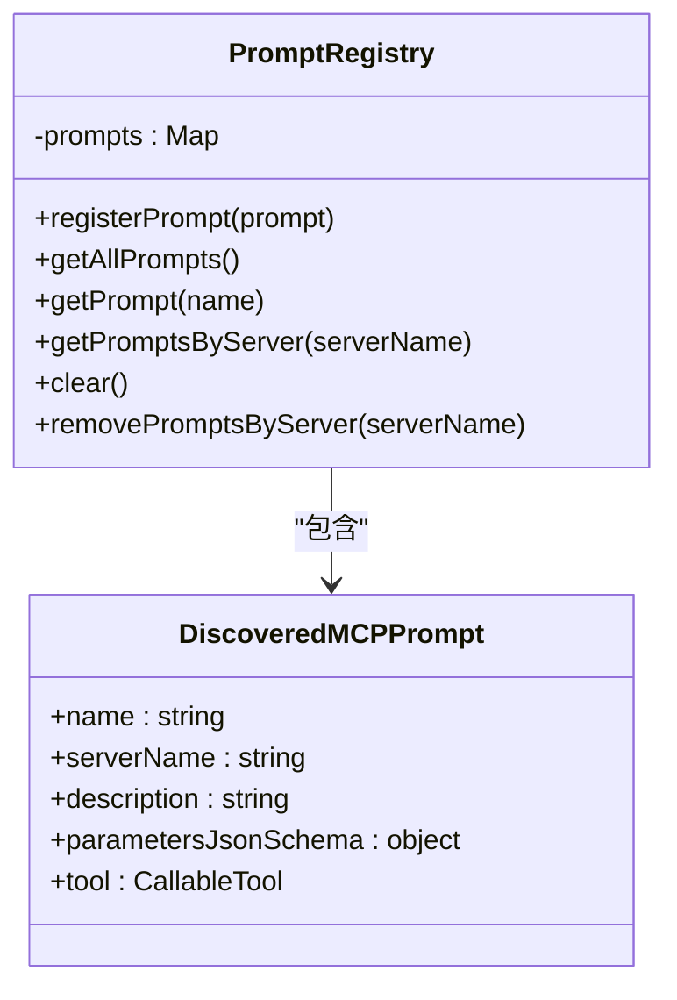
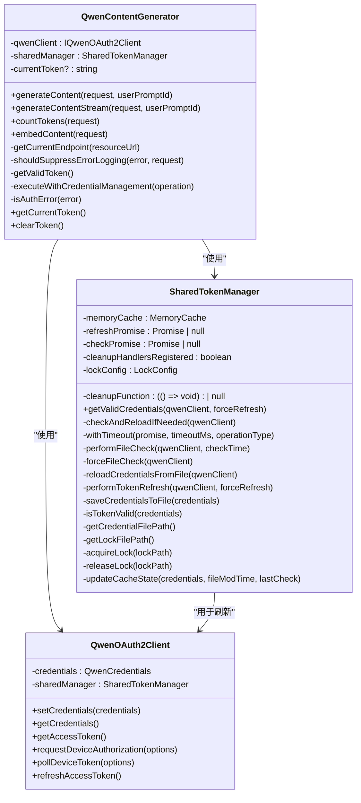
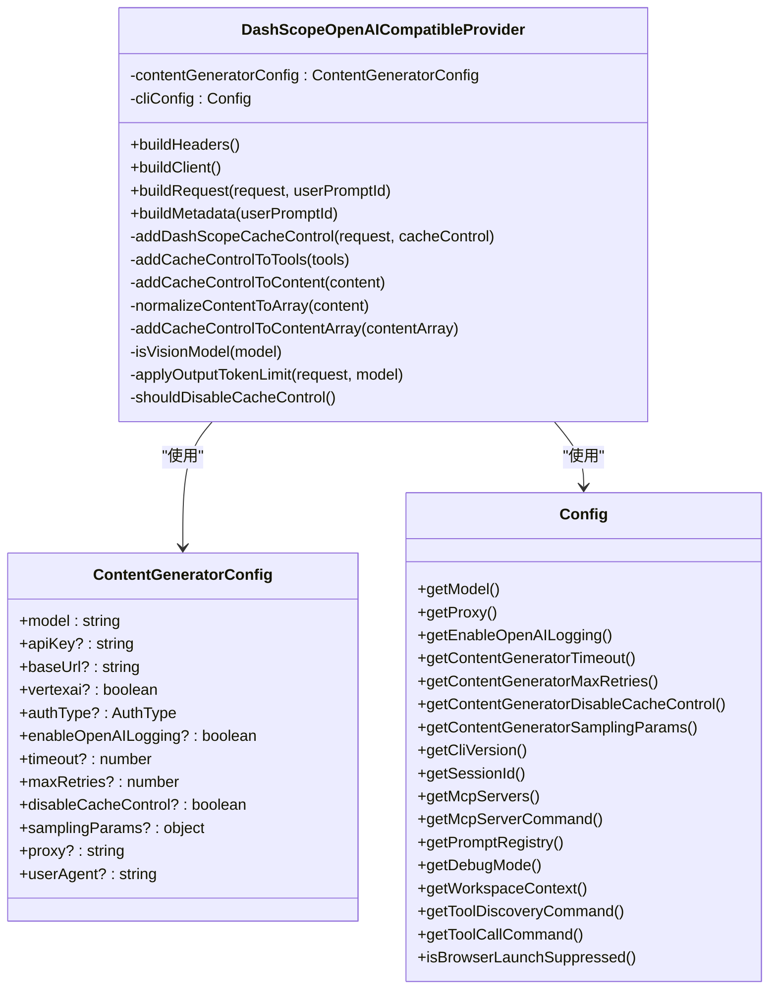
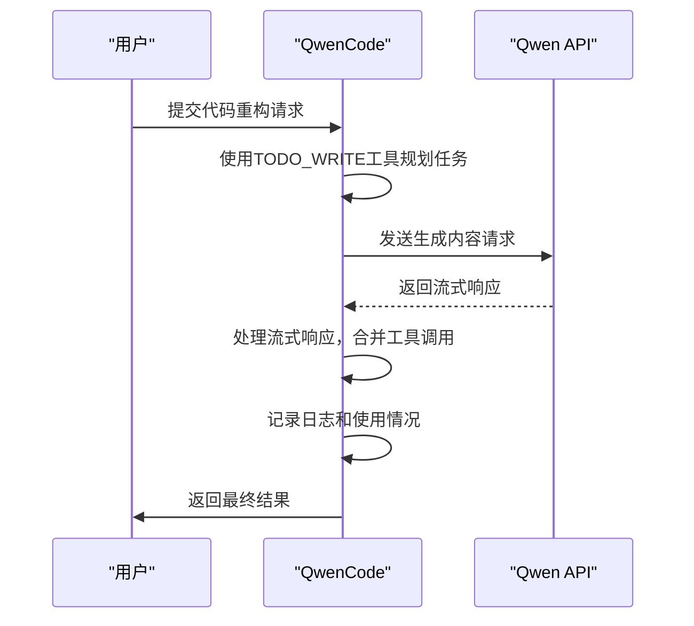

# 增强解析器

<cite>
**本文档中引用的文件**   
- [contentGenerator.ts](file://packages/core/src/core/contentGenerator.ts)
- [prompts.ts](file://packages/core/src/core/prompts.ts)
- [prompt-registry.ts](file://packages/core/src/prompts/prompt-registry.ts)
- [qwenContentGenerator.ts](file://packages/core/src/qwen/qwenContentGenerator.ts)
- [default.ts](file://packages/core/src/core/openaiContentGenerator/provider/dashscope.ts)
- [sharedTokenManager.ts](file://packages/core/src/qwen/sharedTokenManager.ts)
- [qwenOAuth2.ts](file://packages/core/src/qwen/qwenOAuth2.ts)
- [pipeline.ts](file://packages/core/src/core/openaiContentGenerator/pipeline.ts)
- [converter.ts](file://packages/core/src/core/openaiContentGenerator/converter.ts)
- [streamingToolCallParser.ts](file://packages/core/src/core/openaiContentGenerator/streamingToolCallParser.ts)
- [tool-registry.ts](file://packages/core/src/tools/tool-registry.ts)
- [mcp-tool.ts](file://packages/core/src/tools/mcp-tool.ts)
</cite>

## 目录
1. [引言](#引言)
2. [内容生成管道设计](#内容生成管道设计)
3. [提示词工程实现](#提示词工程实现)
4. [Qwen模型优化](#qwen模型优化)
5. [默认提供者处理](#默认提供者处理)
6. [实际示例](#实际示例)
7. [性能影响](#性能影响)
8. [结论](#结论)

## 引言
增强解析器是qwen-code项目中的核心组件，旨在优化Qwen-Coder模型的输出质量。该系统通过精心设计的内容生成管道、先进的提示词工程和针对Qwen模型特性的专门优化，显著提升了代码生成的准确性和结构化输出能力。增强解析器不仅处理流式响应和工具调用解析，还实现了复杂的错误恢复机制和动态令牌管理，确保了系统的稳定性和可靠性。

**Section sources**
- [contentGenerator.ts](file://packages/core/src/core/contentGenerator.ts#L1-L246)
- [qwenContentGenerator.ts](file://packages/core/src/qwen/qwenContentGenerator.ts#L1-L254)

## 内容生成管道设计
增强解析器的内容生成管道基于模块化架构设计，通过`ContentGenerationPipeline`类实现。该管道负责协调请求处理、响应转换和错误处理等核心功能。管道的核心组件包括`OpenAIContentConverter`，它负责在Gemini和OpenAI格式之间进行数据转换，确保不同API之间的兼容性。

管道的执行流程分为几个关键阶段：首先，`buildRequest`方法将Gemini格式的请求转换为OpenAI兼容格式，同时应用提供者特定的增强功能；其次，`execute`和`executeStream`方法分别处理同步和流式请求，通过`processStreamWithLogging`方法实现流式响应的处理；最后，`handleError`方法提供统一的错误处理逻辑，确保错误信息能够被正确记录和处理。

```mermaid
classDiagram
class ContentGenerationPipeline {
+client : OpenAI
-converter : OpenAIContentConverter
-contentGeneratorConfig : ContentGeneratorConfig
+execute(request, userPromptId)
+executeStream(request, userPromptId)
-processStreamWithLogging(stream, context, openaiRequest, request)
-handleChunkMerging(response, collectedGeminiResponses, setPendingFinish)
-buildRequest(request, userPromptId, streaming)
-buildSamplingParameters(request)
-executeWithErrorHandling(request, userPromptId, isStreaming, executor)
-handleError(error, context, request, userPromptId, isStreaming)
-createRequestContext(userPromptId, isStreaming)
}
class OpenAIContentConverter {
-model : string
-streamingToolCallParser : StreamingToolCallParser
+convertGeminiRequestToOpenAI(request)
+convertOpenAIResponseToGemini(openaiResponse)
+convertOpenAIChunkToGemini(chunk)
+convertGeminiResponseToOpenAI(response)
-addSystemInstructionMessage(request, messages)
-processContents(contents, messages)
-processContent(content, messages)
-parseParts(parts)
-getMediaType(mimeType)
-createMultimodalMessage(role, parsedParts)
-getAudioFormat(mimeType)
-isContentObject(content)
-extractTextFromContentUnion(contentUnion)
-mapOpenAIFinishReasonToGemini(openaiReason)
-mapGeminiFinishReasonToOpenAI(geminiReason)
}
class StreamingToolCallParser {
-buffers : Map<number, string>
-depths : Map<number, number>
-inStrings : Map<number, boolean>
-escapes : Map<number, boolean>
-toolCallMeta : Map<number, { id? : string; name? : string }>
-idToIndexMap : Map<string, number>
-nextAvailableIndex : number
+addChunk(index, chunk, id, name)
+getToolCallMeta(index)
+getCompletedToolCalls()
-findNextAvailableIndex()
-findMostRecentIncompleteIndex()
+resetIndex(index)
+reset()
+getBuffer(index)
+getState(index)
}
ContentGenerationPipeline --> OpenAIContentConverter : "使用"
ContentGenerationPipeline --> StreamingToolCallParser : "通过converter使用"
OpenAIContentConverter --> StreamingToolCallParser : "使用"
```

**Diagram sources **
- [pipeline.ts](file://packages/core/src/core/openaiContentGenerator/pipeline.ts#L1-L418)
- [converter.ts](file://packages/core/src/core/openaiContentGenerator/converter.ts#L1-L1036)
- [streamingToolCallParser.ts](file://packages/core/src/core/openaiContentGenerator/streamingToolCallParser.ts#L1-L415)

**Section sources**
- [pipeline.ts](file://packages/core/src/core/openaiContentGenerator/pipeline.ts#L1-L418)
- [converter.ts](file://packages/core/src/core/openaiContentGenerator/converter.ts#L1-L1036)
- [streamingToolCallParser.ts](file://packages/core/src/core/openaiContentGenerator/streamingToolCallParser.ts#L1-L415)

## 提示词工程实现
增强解析器的提示词工程通过`prompts.ts`和`prompt-registry.ts`文件实现。`prompts.ts`文件定义了核心系统提示、压缩提示和项目摘要提示，这些提示为模型提供了明确的指导和上下文。系统提示包含了详细的指令，涵盖了代码约定、库使用、风格结构、任务管理等多个方面，确保模型能够生成符合项目规范的代码。

`prompt-registry.ts`文件实现了`PromptRegistry`类，用于管理提示词的注册和发现。该类提供了一个中心化的注册表，允许动态注册和检索提示词。注册表支持按服务器名称检索提示词，确保了多服务器环境下的提示词管理。此外，注册表还提供了清除和移除提示词的功能，便于在运行时动态更新提示词集合。



**Diagram sources **
- [prompts.ts](file://packages/core/src/core/prompts.ts#L1-L885)
- [prompt-registry.ts](file://packages/core/src/prompts/prompt-registry.ts#L1-L75)

**Section sources**
- [prompts.ts](file://packages/core/src/core/prompts.ts#L1-L885)
- [prompt-registry.ts](file://packages/core/src/prompts/prompt-registry.ts#L1-L75)

## Qwen模型优化
增强解析器针对Qwen模型特性进行了专门优化，主要体现在`qwenContentGenerator.ts`文件中。该文件实现了`QwenContentGenerator`类，继承自`OpenAIContentGenerator`，并针对Qwen OAuth认证和DashScope API进行了定制化处理。优化的核心包括动态令牌管理和错误恢复机制。

`QwenContentGenerator`通过`SharedTokenManager`实现跨进程的令牌管理，确保多个实例之间的令牌同步。该管理器使用文件锁和内存缓存，防止并发刷新操作。令牌刷新过程采用分布式文件锁，确保同一时间只有一个进程可以刷新令牌。此外，管理器还实现了令牌过期检查和自动刷新，确保令牌始终有效。



**Diagram sources **
- [qwenContentGenerator.ts](file://packages/core/src/qwen/qwenContentGenerator.ts#L1-L254)
- [sharedTokenManager.ts](file://packages/core/src/qwen/sharedTokenManager.ts#L1-L881)
- [qwenOAuth2.ts](file://packages/core/src/qwen/qwenOAuth2.ts#L1-L884)

**Section sources**
- [qwenContentGenerator.ts](file://packages/core/src/qwen/qwenContentGenerator.ts#L1-L254)
- [sharedTokenManager.ts](file://packages/core/src/qwen/sharedTokenManager.ts#L1-L881)
- [qwenOAuth2.ts](file://packages/core/src/qwen/qwenOAuth2.ts#L1-L884)

## 默认提供者处理
增强解析器的默认提供者处理通过`DashScopeOpenAICompatibleProvider`类实现，位于`default.ts`文件中。该提供者针对DashScope API进行了优化，支持缓存控制、输出令牌限制和视觉模型参数。提供者通过`buildRequest`方法构建和配置请求，应用DashScope特定的配置。

缓存控制功能通过`addDashScopeCacheControl`方法实现，为系统消息、最后的工具消息和最新的历史消息添加缓存控制标志。输出令牌限制通过`applyOutputTokenLimit`方法实现，确保`max_tokens`参数不超过模型的最大输出限制。此外，提供者还支持视觉模型的高分辨率图像参数，确保视觉模型能够正确处理高分辨率输入。



**Diagram sources **
- [default.ts](file://packages/core/src/core/openaiContentGenerator/provider/dashscope.ts#L1-L338)
- [contentGenerator.ts](file://packages/core/src/core/contentGenerator.ts#L1-L246)
- [config.ts](file://packages/core/src/config/config.ts#L1-L100)

**Section sources**
- [default.ts](file://packages/core/src/core/openaiContentGenerator/provider/dashscope.ts#L1-L338)
- [contentGenerator.ts](file://packages/core/src/core/contentGenerator.ts#L1-L246)
- [config.ts](file://packages/core/src/config/config.ts#L1-L100)

## 实际示例
增强解析器在实际应用中显著改善了代码生成的准确性和结构化输出能力。例如，在处理复杂的代码重构任务时，增强解析器能够准确理解项目上下文，遵循现有代码风格，并生成符合项目规范的代码。通过`TODO_WRITE`工具，增强解析器能够有效地管理任务，确保每个步骤都得到妥善处理。

在处理流式响应时，增强解析器通过`processStreamWithLogging`方法实现了高效的流式处理。该方法能够正确处理分块的响应，合并完成的工具调用，并记录详细的日志信息。此外，增强解析器还能够正确解析和处理工具调用，确保工具调用的结果能够被正确地集成到最终的响应中。



**Diagram sources **
- [pipeline.ts](file://packages/core/src/core/openaiContentGenerator/pipeline.ts#L1-L418)
- [qwenContentGenerator.ts](file://packages/core/src/qwen/qwenContentGenerator.ts#L1-L254)

**Section sources**
- [pipeline.ts](file://packages/core/src/core/openaiContentGenerator/pipeline.ts#L1-L418)
- [qwenContentGenerator.ts](file://packages/core/src/qwen/qwenContentGenerator.ts#L1-L254)

## 性能影响
增强解析器对整体系统性能产生了积极影响。通过优化的内容生成管道和高效的提示词工程，增强了系统的响应速度和准确性。动态令牌管理和错误恢复机制减少了因认证问题导致的请求失败，提高了系统的稳定性。

缓存控制和输出令牌限制功能有效减少了不必要的API调用和资源消耗，提高了系统的效率。流式响应处理机制通过合并完成的工具调用和过滤空响应，减少了网络传输的数据量，提高了响应速度。此外，增强解析器的模块化设计使得各个组件可以独立优化，进一步提升了系统的整体性能。

**Section sources**
- [pipeline.ts](file://packages/core/src/core/openaiContentGenerator/pipeline.ts#L1-L418)
- [qwenContentGenerator.ts](file://packages/core/src/qwen/qwenContentGenerator.ts#L1-L254)
- [default.ts](file://packages/core/src/core/openaiContentGenerator/provider/dashscope.ts#L1-L338)

## 结论
增强解析器通过精心设计的内容生成管道、先进的提示词工程和针对Qwen模型特性的专门优化，显著提升了Qwen-Coder模型的输出质量。该系统不仅提高了代码生成的准确性和结构化输出能力，还通过动态令牌管理、错误恢复机制和高效的流式响应处理，确保了系统的稳定性和可靠性。增强解析器的模块化设计和高性能特性使其成为qwen-code项目中的核心组件，为用户提供了一个高效、可靠的代码生成解决方案。