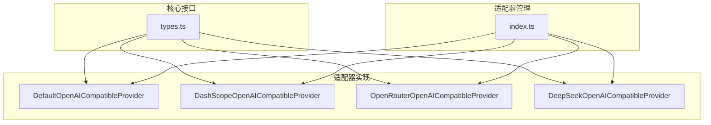
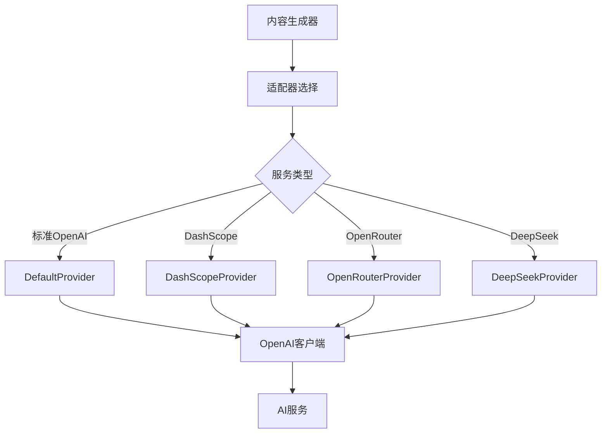
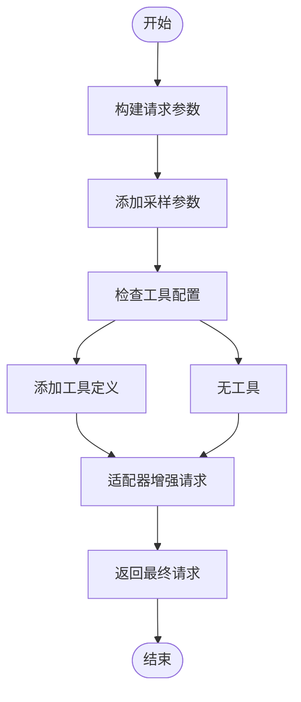
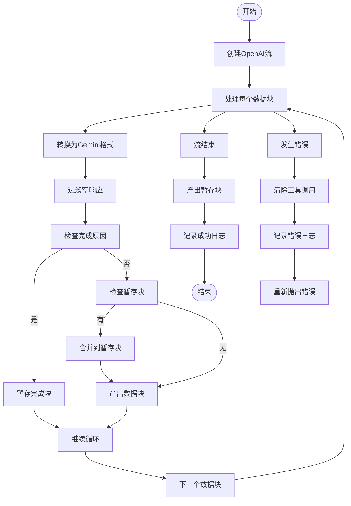
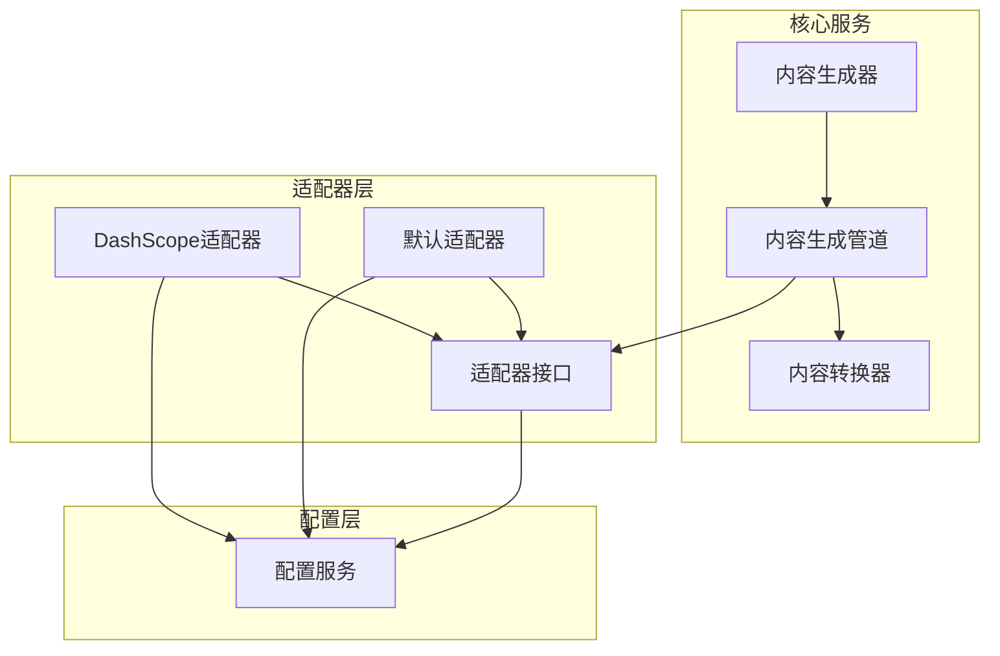

# 基础适配器架构

<cite>
**本文档中引用的文件**  
- [default.ts](file://packages/core/src/core/openaiContentGenerator/provider/default.ts)
- [types.ts](file://packages/core/src/core/openaiContentGenerator/provider/types.ts)
- [index.ts](file://packages/core/src/core/openaiContentGenerator/provider/index.ts)
- [contentGenerator.ts](file://packages/core/src/core/contentGenerator.ts)
- [openaiContentGenerator.ts](file://packages/core/src/core/openaiContentGenerator/openaiContentGenerator.ts)
- [pipeline.ts](file://packages/core/src/core/openaiContentGenerator/pipeline.ts)
- [dashscope.ts](file://packages/core/src/core/openaiContentGenerator/provider/dashscope.ts)
- [constants.ts](file://packages/core/src/core/openaiContentGenerator/provider/constants.ts)
</cite>

## 目录
1. [简介](#简介)
2. [项目结构](#项目结构)
3. [核心组件](#核心组件)
4. [架构概述](#架构概述)
5. [详细组件分析](#详细组件分析)
6. [依赖分析](#依赖分析)
7. [性能考虑](#性能考虑)
8. [故障排除指南](#故障排除指南)
9. [结论](#结论)

## 简介
本文档深入解析了Qwen代码库中定义的基础适配器架构，重点分析了`AbstractProvider`类如何通过抽象方法统一不同AI服务的核心交互模式。文档详细说明了请求构造、响应解析、错误处理和流式传输等关键生命周期方法的设计原理，并阐述了适配器与上层内容生成器之间的契约关系。

## 项目结构
基础适配器架构主要位于`packages/core/src/core/openaiContentGenerator/provider/`目录下，该目录包含多个适配器实现，通过统一的接口为不同AI服务提供一致的交互模式。



**图示来源**
- [default.ts](file://packages/core/src/core/openaiContentGenerator/provider/default.ts)
- [dashscope.ts](file://packages/core/src/core/openaiContentGenerator/provider/dashscope.ts)
- [types.ts](file://packages/core/src/core/openaiContentGenerator/provider/types.ts)

**本节来源**
- [default.ts](file://packages/core/src/core/openaiContentGenerator/provider/default.ts)
- [types.ts](file://packages/core/src/core/openaiContentGenerator/provider/types.ts)

## 核心组件
基础适配器架构的核心是`OpenAICompatibleProvider`接口，该接口定义了所有适配器必须实现的三个关键方法：`buildHeaders`、`buildClient`和`buildRequest`。这些方法共同构成了适配器与底层AI服务交互的基础契约。

**本节来源**
- [types.ts](file://packages/core/src/core/openaiContentGenerator/provider/types.ts)
- [default.ts](file://packages/core/src/core/openaiContentGenerator/provider/default.ts)

## 架构概述
基础适配器架构采用策略模式，通过统一的接口抽象不同AI服务的实现细节。适配器负责处理服务特定的配置，如HTTP头、客户端配置和请求转换，而上层内容生成器则通过统一的接口与任何适配器交互。



**图示来源**
- [contentGenerator.ts](file://packages/core/src/core/contentGenerator.ts)
- [openaiContentGenerator.ts](file://packages/core/src/core/openaiContentGenerator/openaiContentGenerator.ts)

## 详细组件分析

### 抽象提供者接口分析
`OpenAICompatibleProvider`接口定义了适配器必须实现的核心方法，这些方法共同构成了与AI服务交互的生命周期。

#### 接口定义
```mermaid
classDiagram
class OpenAICompatibleProvider {
<<interface>>
+buildHeaders() Record~string, string | undefined~
+buildClient() OpenAI
+buildRequest(request : ChatCompletionCreateParams, userPromptId : string) ChatCompletionCreateParams
}
class DefaultOpenAICompatibleProvider {
-contentGeneratorConfig : ContentGeneratorConfig
-cliConfig : Config
+buildHeaders() Record~string, string | undefined~
+buildClient() OpenAI
+buildRequest(request : ChatCompletionCreateParams, userPromptId : string) ChatCompletionCreateParams
}
class DashScopeOpenAICompatibleProvider {
-contentGeneratorConfig : ContentGeneratorConfig
-cliConfig : Config
+isDashScopeProvider(config : ContentGeneratorConfig) boolean
+buildHeaders() Record~string, string | undefined~
+buildClient() OpenAI
+buildRequest(request : ChatCompletionCreateParams, userPromptId : string) ChatCompletionCreateParams
+buildMetadata(userPromptId : string) DashScopeRequestMetadata
+addDashScopeCacheControl(request : ChatCompletionCreateParams, cacheControl : 'system_only' | 'all') {messages, tools}
}
OpenAICompatibleProvider <|.. DefaultOpenAICompatibleProvider
OpenAICompatibleProvider <|.. DashScopeOpenAICompatibleProvider
```

**图示来源**
- [types.ts](file://packages/core/src/core/openaiContentGenerator/provider/types.ts)
- [default.ts](file://packages/core/src/core/openaiContentGenerator/provider/default.ts)
- [dashscope.ts](file://packages/core/src/core/openaiContentGenerator/provider/dashscope.ts)

### 请求生命周期分析
适配器的请求生命周期从请求构造开始，经过客户端执行，到响应解析结束。`buildRequest`方法在这一过程中扮演关键角色，负责将通用请求转换为服务特定的格式。

#### 请求处理流程


**图示来源**
- [pipeline.ts](file://packages/core/src/core/openaiContentGenerator/pipeline.ts)
- [dashscope.ts](file://packages/core/src/core/openaiContentGenerator/provider/dashscope.ts)

**本节来源**
- [pipeline.ts](file://packages/core/src/core/openaiContentGenerator/pipeline.ts)
- [dashscope.ts](file://packages/core/src/core/openaiContentGenerator/provider/dashscope.ts)

### 流式传输处理分析
流式传输是适配器架构中的重要功能，通过`processStreamWithLogging`方法实现。该方法不仅处理流式响应，还负责日志记录和错误处理。

#### 流式处理流程


**图示来源**
- [pipeline.ts](file://packages/core/src/core/openaiContentGenerator/pipeline.ts)

**本节来源**
- [pipeline.ts](file://packages/core/src/core/openaiContentGenerator/pipeline.ts)

## 依赖分析
适配器架构与其他组件有明确的依赖关系，这些关系确保了系统的模块化和可扩展性。



**图示来源**
- [openaiContentGenerator.ts](file://packages/core/src/core/openaiContentGenerator/openaiContentGenerator.ts)
- [pipeline.ts](file://packages/core/src/core/openaiContentGenerator/pipeline.ts)
- [contentGenerator.ts](file://packages/core/src/core/contentGenerator.ts)

**本节来源**
- [openaiContentGenerator.ts](file://packages/core/src/core/openaiContentGenerator/openaiContentGenerator.ts)
- [pipeline.ts](file://packages/core/src/core/openaiContentGenerator/pipeline.ts)

## 性能考虑
适配器架构在设计时考虑了多个性能因素，包括连接池配置、请求超时和重试机制。`DEFAULT_TIMEOUT`和`DEFAULT_MAX_RETRIES`常量定义了默认的超时和重试策略，这些策略可以在运行时通过配置进行调整。

## 故障排除指南
当适配器出现问题时，可以从以下几个方面进行排查：
1. 检查配置是否正确，特别是API密钥和基础URL
2. 验证适配器选择逻辑是否正确识别了服务类型
3. 检查请求构造是否符合服务的特定要求
4. 查看错误日志以获取详细的错误信息

**本节来源**
- [contentGenerator.ts](file://packages/core/src/core/contentGenerator.ts)
- [openaiContentGenerator.ts](file://packages/core/src/core/openaiContentGenerator/openaiContentGenerator.ts)
- [pipeline.ts](file://packages/core/src/core/openaiContentGenerator/pipeline.ts)

## 结论
基础适配器架构通过`OpenAICompatibleProvider`接口成功抽象了不同AI服务的实现细节，为上层应用提供了统一的交互接口。该架构具有良好的扩展性，可以轻松添加新的适配器来支持更多的AI服务。通过清晰的职责划分和模块化设计，该架构确保了系统的可维护性和可靠性。