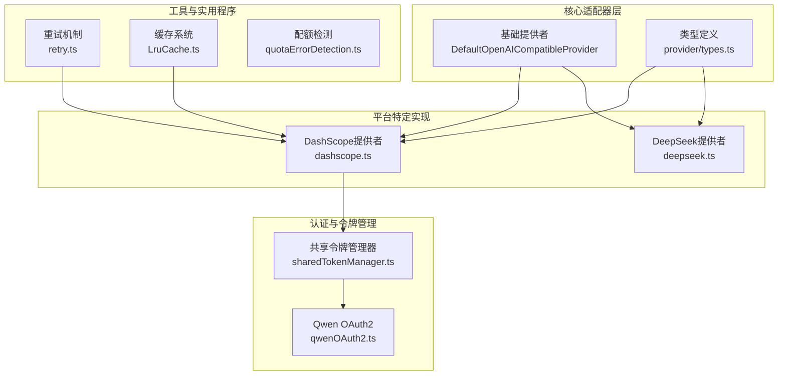
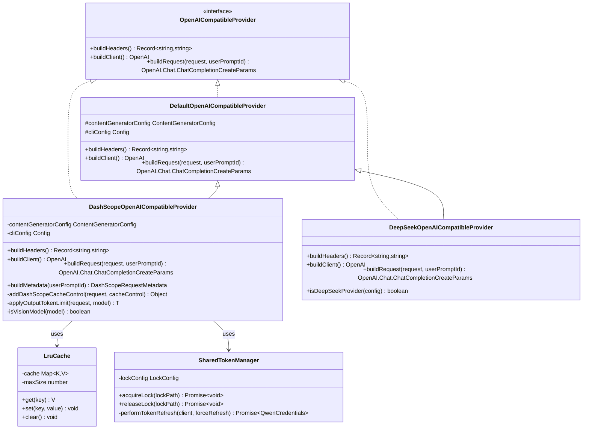
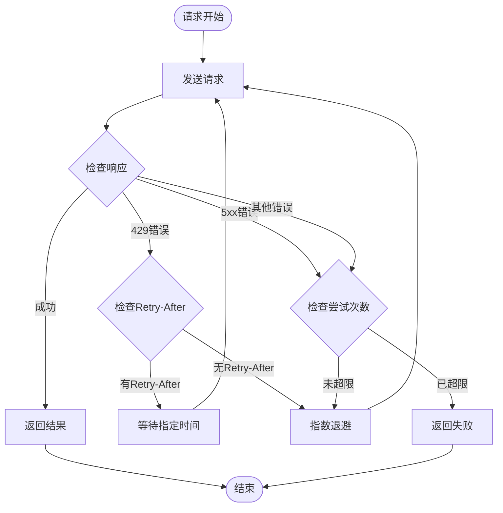
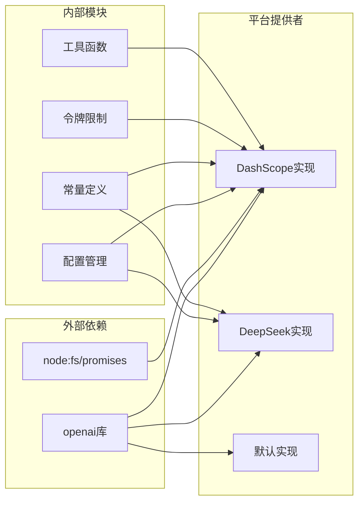

# 平台特定实现对比分析

<cite>
**本文档中引用的文件**
- [dashscope.ts](file://packages/core/src/core/openaiContentGenerator/provider/dashscope.ts)
- [deepseek.ts](file://packages/core/src/core/openaiContentGenerator/provider/deepseek.ts)
- [default.ts](file://packages/core/src/core/openaiContentGenerator/provider/default.ts)
- [types.ts](file://packages/core/src/core/openaiContentGenerator/provider/types.ts)
- [constants.ts](file://packages/core/src/core/openaiContentGenerator/constants.ts)
- [sharedTokenManager.ts](file://packages/core/src/qwen/sharedTokenManager.ts)
- [qwenOAuth2.ts](file://packages/core/src/qwen/qwenOAuth2.ts)
- [quotaErrorDetection.ts](file://packages/core/src/utils/quotaErrorDetection.ts)
- [retry.ts](file://packages/core/src/utils/retry.ts)
- [LruCache.ts](file://packages/core/src/utils/LruCache.ts)
- [crawlCache.ts](file://packages/core/src/utils/filesearch/crawlCache.ts)
</cite>

## 目录
1. [简介](#简介)
2. [项目结构概览](#项目结构概览)
3. [核心组件分析](#核心组件分析)
4. [架构概览](#架构概览)
5. [详细组件分析](#详细组件分析)
6. [依赖关系分析](#依赖关系分析)
7. [性能考虑](#性能考虑)
8. [故障排除指南](#故障排除指南)
9. [结论](#结论)

## 简介

本文档深入分析了Qwen代码库中DashScope和DeepSeek两个平台特定实现的差异性处理。通过对比分析认证机制、速率限制策略、专有功能集成等方面，展示了如何在遵循基础适配器契约的同时，扩展特定于平台的功能特性。

该系统采用统一的OpenAI兼容接口设计，通过抽象工厂模式为不同AI服务平台提供定制化的实现。每个平台都继承自基础的`OpenAICompatibleProvider`接口，并根据自身特点实现了独特的功能增强。

## 项目结构概览



**图表来源**
- [default.ts](file://packages/core/src/core/openaiContentGenerator/provider/default.ts#L1-L59)
- [dashscope.ts](file://packages/core/src/core/openaiContentGenerator/provider/dashscope.ts#L1-L338)
- [deepseek.ts](file://packages/core/src/core/openaiContentGenerator/provider/deepseek.ts#L1-L80)

## 核心组件分析

### 基础适配器契约

所有平台提供者都必须实现`OpenAICompatibleProvider`接口，该接口定义了三个核心方法：

```typescript
export interface OpenAICompatibleProvider {
  buildHeaders(): Record<string, string | undefined>;
  buildClient(): OpenAI;
  buildRequest(
    request: OpenAI.Chat.ChatCompletionCreateParams,
    userPromptId: string,
  ): OpenAI.Chat.ChatCompletionCreateParams;
}
```

这种设计确保了不同平台之间的行为一致性，同时允许每个平台实现自己的特殊需求。

**章节来源**
- [types.ts](file://packages/core/src/core/openaiContentGenerator/provider/types.ts#L15-L20)

### 认证机制对比

#### DashScope认证机制

DashScope平台使用阿里云的认证体系，支持多种认证方式：

```typescript
static isDashScopeProvider(
  contentGeneratorConfig: ContentGeneratorConfig,
): boolean {
  const authType = contentGeneratorConfig.authType;
  const baseUrl = contentGeneratorConfig.baseUrl;
  return (
    authType === AuthType.QWEN_OAUTH ||
    baseUrl === 'https://dashscope.aliyuncs.com/compatible-mode/v1' ||
    baseUrl === 'https://dashscope-intl.aliyuncs.com/compatible-mode/v1'
  );
}
```

#### DeepSeek认证机制

DeepSeek平台采用标准的OpenAI认证方式，通过URL判断是否为目标平台：

```typescript
static isDeepSeekProvider(
  contentGeneratorConfig: ContentGeneratorConfig,
): boolean {
  const baseUrl = contentGeneratorConfig.baseUrl ?? '';
  return baseUrl.toLowerCase().includes('api.deepseek.com');
}
```

**章节来源**
- [dashscope.ts](file://packages/core/src/core/openaiContentGenerator/provider/dashscope.ts#L25-L32)
- [deepseek.ts](file://packages/core/src/core/openaiContentGenerator/provider/deepseek.ts#L15-L20)

## 架构概览



**图表来源**
- [default.ts](file://packages/core/src/core/openaiContentGenerator/provider/default.ts#L10-L59)
- [dashscope.ts](file://packages/core/src/core/openaiContentGenerator/provider/dashscope.ts#L15-L338)
- [deepseek.ts](file://packages/core/src/core/openaiContentGenerator/provider/deepseek.ts#L12-L80)

## 详细组件分析

### DashScope平台特定实现

#### 缓存控制系统

DashScope提供了先进的缓存控制机制，通过`X-DashScope-CacheControl`头部实现智能缓存：

```typescript
buildHeaders(): Record<string, string | undefined> {
  const version = this.cliConfig.getCliVersion() || 'unknown';
  const userAgent = `QwenCode/${version} (${process.platform}; ${process.arch})`;
  const { authType } = this.contentGeneratorConfig;
  return {
    'User-Agent': userAgent,
    'X-DashScope-CacheControl': 'enable',
    'X-DashScope-UserAgent': userAgent,
    'X-DashScope-AuthType': authType,
  };
}
```

#### 多模态支持

DashScope特别针对视觉模型进行了优化，支持高分辨率图像处理：

```typescript
private isVisionModel(model: string | undefined): boolean {
  if (!model) return false;
  
  const normalized = model.toLowerCase();
  if (normalized === 'vision-model') return true;
  if (normalized.startsWith('qwen-vl')) return true;
  if (normalized.startsWith('qwen3-vl-plus')) return true;
  
  return false;
}
```

当检测到视觉模型时，会自动启用高分辨率图像支持：

```typescript
if (this.isVisionModel(request.model)) {
  return {
    ...requestWithTokenLimits,
    messages,
    ...(tools ? { tools } : {}),
    ...(this.buildMetadata(userPromptId) || {}),
    /* @ts-expect-error dashscope exclusive */
    vl_high_resolution_images: true,
  } as OpenAI.Chat.ChatCompletionCreateParams;
}
```

#### 输出令牌限制

为了防止超出模型的最大输出限制，DashScope实现了智能的令牌限制应用：

```typescript
private applyOutputTokenLimit<T extends { max_tokens?: number | null }>(
  request: T,
  model: string,
): T {
  const currentMaxTokens = request.max_tokens;
  
  if (currentMaxTokens === undefined || currentMaxTokens === null) {
    return request;
  }
  
  const modelLimit = tokenLimit(model, 'output');
  
  if (currentMaxTokens > modelLimit) {
    return {
      ...request,
      max_tokens: modelLimit,
    };
  }
  
  return request;
}
```

#### 缓存控制增强

DashScope实现了复杂的缓存控制逻辑，可以选择性地为系统消息和最新消息添加缓存控制：

```typescript
private addDashScopeCacheControl(
  request: OpenAI.Chat.ChatCompletionCreateParams,
  cacheControl: 'system_only' | 'all',
): {
  messages: OpenAI.Chat.ChatCompletionMessageParam[];
  tools?: ChatCompletionToolWithCache[];
} {
  const messages = request.messages;
  const systemIndex = messages.findIndex((msg) => msg.role === 'system');
  const lastIndex = messages.length - 1;

  const updatedMessages = messages.map((message, index) => {
    const shouldAddCacheControl = Boolean(
      (index === systemIndex && systemIndex !== -1) ||
      (index === lastIndex && cacheControl === 'all'),
    );

    if (!shouldAddCacheControl || !('content' in message)) {
      return message;
    }

    return {
      ...message,
      content: this.addCacheControlToContent(message.content),
    } as OpenAI.Chat.ChatCompletionMessageParam;
  });

  return { messages: updatedMessages, tools: updatedTools };
}
```

**章节来源**
- [dashscope.ts](file://packages/core/src/core/openaiContentGenerator/provider/dashscope.ts#L34-L45)
- [dashscope.ts](file://packages/core/src/core/openaiContentGenerator/provider/dashscope.ts#L260-L289)
- [dashscope.ts](file://packages/core/src/core/openaiContentGenerator/provider/dashscope.ts#L291-L310)
- [dashscope.ts](file://packages/core/src/core/openaiContentGenerator/provider/dashscope.ts#L130-L191)

### DeepSeek平台特定实现

#### 文本内容标准化

DeepSeek提供者对多模态内容进行标准化处理，只支持纯文本内容：

```typescript
override buildRequest(
  request: OpenAI.Chat.ChatCompletionCreateParams,
  userPromptId: string,
): OpenAI.Chat.ChatCompletionCreateParams {
  const baseRequest = super.buildRequest(request, userPromptId);
  if (!baseRequest.messages?.length) {
    return baseRequest;
  }

  const messages = baseRequest.messages.map((message) => {
    if (!('content' in message)) {
      return message;
    }

    const { content } = message;

    if (
      typeof content === 'string' ||
      content === null ||
      content === undefined
    ) {
      return message;
    }

    if (!Array.isArray(content)) {
      return message;
    }

    const text = content
      .map((part) => {
        if (part.type !== 'text') {
          throw new Error(
            `DeepSeek provider only supports text content. Found non-text part of type '${part.type}' in message with role '${message.role}'.`,
          );
        }
        return part.text ?? '';
      })
      .join('');

    return {
      ...message,
      content: text,
    } as OpenAI.Chat.ChatCompletionMessageParam;
  });

  return {
    ...baseRequest,
    messages,
  };
}
```

这种实现确保了DeepSeek平台只能处理纯文本输入，避免了多模态内容的复杂性。

**章节来源**
- [deepseek.ts](file://packages/core/src/core/openaiContentGenerator/provider/deepseek.ts#L22-L79)

### 速率限制策略对比

#### 错误检测机制

系统实现了统一的错误检测机制来识别速率限制错误：

```typescript
const checkMessage = (message: string): boolean => {
  return (
    message.includes('rate limit') ||
    message.includes('too many requests') ||
    message.includes('exceeded rate limit') ||
    message.includes('rate limit exceeded')
  );
};
```

#### 重试策略



**图表来源**
- [retry.ts](file://packages/core/src/utils/retry.ts#L208-L231)

#### 分布式令牌刷新

DashScope使用分布式文件锁机制来防止并发令牌刷新：

```typescript
private async acquireLock(lockPath: string): Promise<void> {
  const { maxAttempts, attemptInterval, maxInterval } = this.lockConfig;
  const lockId = randomUUID();

  let currentInterval = attemptInterval;

  for (let attempt = 0; attempt < maxAttempts; attempt++) {
    try {
      await fs.writeFile(lockPath, lockId, { flag: 'wx' });
      return;
    } catch (error: unknown) {
      if ((error as NodeJS.ErrnoException).code === 'EEXIST') {
        try {
          const stats = await fs.stat(lockPath);
          const lockAge = Date.now() - stats.mtimeMs;
          
          if (lockAge > MAX_LOCK_AGE) {
            // Remove stale lock
            await fs.unlink(lockPath);
            continue;
          }
        } catch {
          // Lock file doesn't exist anymore
        }
        
        // Wait and try again
        await delay(currentInterval);
        currentInterval = Math.min(maxInterval, currentInterval * 2);
      } else {
        throw error;
      }
    }
  }
  
  throw new Error(`Failed to acquire lock after ${maxAttempts} attempts`);
}
```

**章节来源**
- [sharedTokenManager.ts](file://packages/core/src/qwen/sharedTokenManager.ts#L694-L716)

### 专有功能集成

#### DashScope多模态功能

DashScope提供了丰富的多模态功能，包括：

1. **视觉模型支持**：自动检测和优化视觉模型
2. **高分辨率图像处理**：支持高质量图像输入
3. **缓存控制**：智能的消息缓存机制
4. **元数据追踪**：完整的会话和提示追踪

#### DeepSeek简化功能

DeepSeek专注于文本处理，提供：

1. **纯文本优化**：专门优化的文本处理管道
2. **简单易用**：最小化的配置和设置
3. **高性能**：针对长上下文优化的推理引擎

**章节来源**
- [dashscope.ts](file://packages/core/src/core/openaiContentGenerator/provider/dashscope.ts#L260-L289)
- [deepseek.ts](file://packages/core/src/core/openaiContentGenerator/provider/deepseek.ts#L22-L79)

## 依赖关系分析



**图表来源**
- [dashscope.ts](file://packages/core/src/core/openaiContentGenerator/provider/dashscope.ts#L1-L10)
- [deepseek.ts](file://packages/core/src/core/openaiContentGenerator/provider/deepseek.ts#L1-L6)

**章节来源**
- [dashscope.ts](file://packages/core/src/core/openaiContentGenerator/provider/dashscope.ts#L1-L10)
- [deepseek.ts](file://packages/core/src/core/openaiContentGenerator/provider/deepseek.ts#L1-L6)

## 性能考虑

### 缓存优化策略

系统实现了多层次的缓存机制来提升性能：

1. **LRU缓存**：用于内存中的快速访问
2. **文件系统缓存**：持久化存储大型数据
3. **HTTP缓存**：利用HTTP头部进行缓存控制

```typescript
export class LruCache<K, V> {
  private cache: Map<K, V>;
  private maxSize: number;

  constructor(maxSize: number) {
    this.cache = new Map<K, V>();
    this.maxSize = maxSize;
  }

  get(key: K): V | undefined {
    const value = this.cache.get(key);
    if (value) {
      // Move to end to mark as recently used
      this.cache.delete(key);
      this.cache.set(key, value);
    }
    return value;
  }

  set(key: K, value: V): void {
    if (this.cache.has(key)) {
      this.cache.delete(key);
    } else if (this.cache.size >= this.maxSize) {
      const firstKey = this.cache.keys().next().value;
      if (firstKey !== undefined) {
        this.cache.delete(firstKey);
      }
    }
    this.cache.set(key, value);
  }
}
```

### 异步操作优化

系统使用异步操作来避免阻塞主线程，特别是在网络请求和文件I/O操作中。

### 内存管理

通过及时释放不再需要的对象和使用流式处理来优化内存使用。

## 故障排除指南

### 常见错误类型

#### 认证错误

```typescript
export class FatalAuthenticationError extends FatalError {
  constructor(message: string) {
    super(message, 41);
  }
}
```

#### 输入错误

```typescript
export class FatalInputError extends FatalError {
  constructor(message: string) {
    super(message, 42);
  }
}
```

#### 配额错误检测

```typescript
export function isQuotaExceededError(error: unknown): boolean {
  const checkMessage = (message: string): boolean => {
    return (
      message.includes('quota') ||
      message.includes('exceeded') ||
      message.includes('limit') ||
      message.includes('throttling')
    );
  };

  // Check status code
  const getStatusCode = (error: unknown): number | undefined => {
    if (error && typeof error === 'object') {
      const errorObj = error as { status?: number; code?: number };
      return errorObj.status || errorObj.code;
    }
    return undefined;
  };

  const statusCode = getStatusCode(error);

  if (typeof error === 'string') {
    return (
      (statusCode === 429 && checkMessage(error)) ||
      error.includes('throttling')
    );
  }

  if (isStructuredError(error)) {
    return statusCode === 429 && checkMessage(error.message);
  }

  if (isApiError(error)) {
    return error.error.code === 429 && checkMessage(error.error.message);
  }

  return false;
}
```

### 调试技巧

1. **启用详细日志**：设置适当的日志级别来跟踪请求和响应
2. **监控网络流量**：使用网络调试工具观察API调用
3. **检查配置**：验证API密钥和基础URL配置
4. **测试连接**：使用简单的ping测试来验证网络连通性

**章节来源**
- [errors.ts](file://packages/core/src/utils/errors.ts#L25-L71)
- [quotaErrorDetection.ts](file://packages/core/src/utils/quotaErrorDetection.ts#L139-L166)

## 结论

通过对DashScope和DeepSeek平台特定实现的深入分析，我们可以看到以下关键差异：

### 认证机制
- **DashScope**：支持多种认证方式，包括OAuth和个人API密钥
- **DeepSeek**：主要使用标准的OpenAI认证方式

### 功能特性
- **DashScope**：提供全面的多模态支持，包括视觉模型和高级缓存控制
- **DeepSeek**：专注于文本处理，提供简化的API接口

### 性能优化
- **DashScope**：实现了复杂的缓存策略和分布式令牌管理
- **DeepSeek**：注重简单性和可靠性，减少不必要的复杂性

### 适用场景
- **DashScope**：适合需要多模态能力、高级缓存控制和企业级功能的应用
- **DeepSeek**：适合需要简单文本处理、高性能推理和成本敏感的应用

这种设计模式展示了如何在保持接口一致性的前提下，为不同的平台提供定制化的功能增强。通过抽象工厂模式和策略模式的结合，系统能够灵活地适应不同平台的需求，同时保持代码的可维护性和可扩展性。