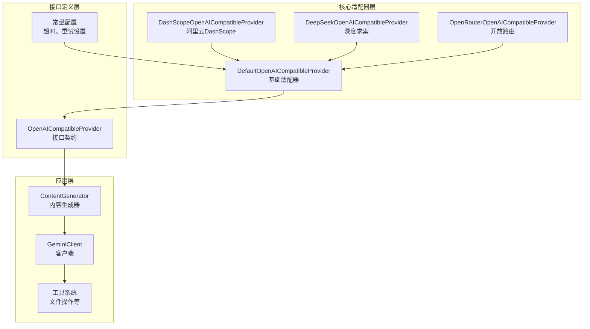
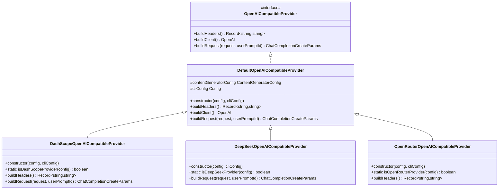
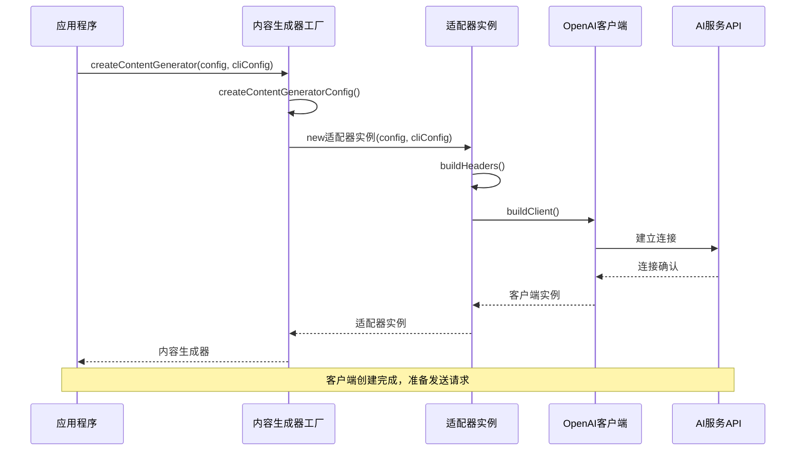
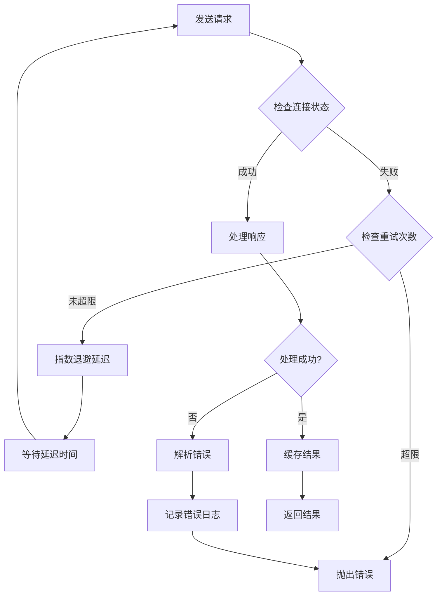

# 模型提供者适配机制

<cite>
**本文档引用的文件**
- [packages/core/src/core/openaiContentGenerator/provider/default.ts](file://packages/core/src/core/openaiContentGenerator/provider/default.ts)
- [packages/core/src/core/openaiContentGenerator/provider/dashscope.ts](file://packages/core/src/core/openaiContentGenerator/provider/dashscope.ts)
- [packages/core/src/core/openaiContentGenerator/provider/deepseek.ts](file://packages/core/src/core/openaiContentGenerator/provider/deepseek.ts)
- [packages/core/src/core/openaiContentGenerator/provider/openrouter.ts](file://packages/core/src/core/openaiContentGenerator/provider/openrouter.ts)
- [packages/core/src/core/openaiContentGenerator/provider/types.ts](file://packages/core/src/core/openaiContentGenerator/provider/types.ts)
- [packages/core/src/core/openaiContentGenerator/provider/constants.ts](file://packages/core/src/core/openaiContentGenerator/provider/constants.ts)
- [packages/core/src/core/contentGenerator.ts](file://packages/core/src/core/contentGenerator.ts)
- [packages/core/src/core/client.ts](file://packages/core/src/core/client.ts)
- [packages/core/src/tools/tools.ts](file://packages/core/src/tools/tools.ts)
</cite>

## 目录
1. [简介](#简介)
2. [项目结构概览](#项目结构概览)
3. [核心适配器架构](#核心适配器架构)
4. [基础适配器分析](#基础适配器分析)
5. [平台特定适配器](#平台特定适配器)
6. [适配器接口设计](#适配器接口设计)
7. [认证与配置管理](#认证与配置管理)
8. [扩展新适配器指南](#扩展新适配器指南)
9. [性能优化与最佳实践](#性能优化与最佳实践)
10. [故障排除指南](#故障排除指南)
11. [总结](#总结)

## 简介

qwen-code采用了一套精心设计的模型提供者适配架构，通过抽象化不同AI服务的API差异，实现了对多种AI平台的统一支持。该架构的核心是`DefaultOpenAICompatibleProvider`基础适配器，它为所有兼容OpenAI API的平台提供了标准化的接入点，同时允许各个平台通过继承和扩展来实现自己的特有功能。

这种设计模式不仅简化了新平台的集成过程，还确保了跨平台的一致性和可维护性。通过统一的接口契约和标准化的配置管理，开发者可以轻松地在不同的AI服务之间切换，而无需修改业务逻辑代码。

## 项目结构概览



**图表来源**
- [packages/core/src/core/openaiContentGenerator/provider/default.ts](file://packages/core/src/core/openaiContentGenerator/provider/default.ts#L1-L59)
- [packages/core/src/core/openaiContentGenerator/provider/dashscope.ts](file://packages/core/src/core/openaiContentGenerator/provider/dashscope.ts#L1-L38)
- [packages/core/src/core/openaiContentGenerator/provider/deepseek.ts](file://packages/core/src/core/openaiContentGenerator/provider/deepseek.ts#L1-L53)

**章节来源**
- [packages/core/src/core/openaiContentGenerator/provider/index.ts](file://packages/core/src/core/openaiContentGenerator/provider/index.ts#L1-L9)

## 核心适配器架构

qwen-code的适配器架构建立在三层设计之上：抽象接口层、基础适配器层和平台特定适配器层。这种分层设计确保了代码的可扩展性和可维护性。

### 架构层次分析



**图表来源**
- [packages/core/src/core/openaiContentGenerator/provider/types.ts](file://packages/core/src/core/openaiContentGenerator/provider/types.ts#L15-L25)
- [packages/core/src/core/openaiContentGenerator/provider/default.ts](file://packages/core/src/core/openaiContentGenerator/provider/default.ts#L10-L59)
- [packages/core/src/core/openaiContentGenerator/provider/dashscope.ts](file://packages/core/src/core/openaiContentGenerator/provider/dashscope.ts#L17-L38)

### 核心设计原则

1. **单一职责原则**：每个适配器专注于处理特定平台的特性
2. **开闭原则**：对扩展开放，对修改关闭
3. **依赖倒置原则**：高层模块不依赖低层模块的具体实现
4. **接口隔离原则**：提供最小化的接口契约

**章节来源**
- [packages/core/src/core/openaiContentGenerator/provider/types.ts](file://packages/core/src/core/openaiContentGenerator/provider/types.ts#L1-L33)

## 基础适配器分析

### DefaultOpenAICompatibleProvider

`DefaultOpenAICompatibleProvider`是整个适配器体系的基础，它为标准的OpenAI兼容API提供了通用的实现。这个类采用了模板方法模式，定义了通用的工作流程，同时允许子类通过重写特定方法来添加平台特有的功能。

```typescript
// 基础适配器的核心实现
export class DefaultOpenAICompatibleProvider implements OpenAICompatibleProvider {
  protected contentGeneratorConfig: ContentGeneratorConfig;
  protected cliConfig: Config;

  constructor(
    contentGeneratorConfig: ContentGeneratorConfig,
    cliConfig: Config,
  ) {
    this.cliConfig = cliConfig;
    this.contentGeneratorConfig = contentGeneratorConfig;
  }

  buildHeaders(): Record<string, string | undefined> {
    const version = this.cliConfig.getCliVersion() || 'unknown';
    const userAgent = `QwenCode/${version} (${process.platform}; ${process.arch})`;
    return {
      'User-Agent': userAgent,
    };
  }

  buildClient(): OpenAI {
    const {
      apiKey,
      baseUrl,
      timeout = DEFAULT_TIMEOUT,
      maxRetries = DEFAULT_MAX_RETRIES,
    } = this.contentGeneratorConfig;
    const defaultHeaders = this.buildHeaders();
    return new OpenAI({
      apiKey,
      baseURL: baseUrl,
      timeout,
      maxRetries,
      defaultHeaders,
    });
  }
}
```

### 关键特性

1. **标准化请求构建**：提供统一的请求参数处理机制
2. **智能头部管理**：自动添加用户代理信息和平台标识
3. **配置驱动**：完全基于配置对象进行初始化
4. **错误处理**：内置超时和重试机制

**章节来源**
- [packages/core/src/core/openaiContentGenerator/provider/default.ts](file://packages/core/src/core/openaiContentGenerator/provider/default.ts#L1-L59)

## 平台特定适配器

### DashScope适配器

DashScope适配器专门用于阿里云的DashScope平台，它实现了OAuth认证和特殊的请求头处理。该适配器通过静态工厂方法检测是否为目标平台，并提供平台特定的请求增强功能。

```typescript
export class DashScopeOpenAICompatibleProvider implements OpenAICompatibleProvider {
  static isDashScopeProvider(
    contentGeneratorConfig: ContentGeneratorConfig,
  ): boolean {
    const authType = contentGeneratorConfig.authType;
    const baseUrl = contentGeneratorConfig.baseUrl;
    return (
      authType === AuthType.QWEN_OAUTH ||
      baseUrl === 'https://dashscope.aliyuncs.com/compatible-mode/v1' ||
      baseUrl === 'https://dashscope-intl.aliyuncs.com/compatible-mode/v1'
    );
  }

  buildHeaders(): Record<string, string | undefined> {
    const baseHeaders = super.buildHeaders();
    const sessionId = this.cliConfig.getSessionId();
    const disableCacheControl = this.cliConfig.getContentGeneratorConfig()?.disableCacheControl;
    
    return {
      ...baseHeaders,
      'Authorization': `Bearer ${this.contentGeneratorConfig.apiKey}`,
      'X-DashScope-Schema': 'HTTP',
      'X-DashScope-Data-Processing-Mode': 'online',
      ...(sessionId && !disableCacheControl && {
        'X-DashScope-Cache-Control': 'no-cache',
      }),
    };
  }
}
```

### DeepSeek适配器

DeepSeek适配器展示了如何处理复杂的请求转换逻辑。它重写了`buildRequest`方法来处理特殊的消息格式，特别是对于包含缓存控制的文本部分。

```typescript
export class DeepSeekOpenAICompatibleProvider extends DefaultOpenAICompatibleProvider {
  static isDeepSeekProvider(
    contentGeneratorConfig: ContentGeneratorConfig,
  ): boolean {
    const baseUrl = contentGeneratorConfig.baseUrl ?? '';
    return baseUrl.toLowerCase().includes('api.deepseek.com');
  }

  override buildRequest(
    request: OpenAI.Chat.ChatCompletionCreateParams,
    userPromptId: string,
  ): OpenAI.Chat.ChatCompletionCreateParams {
    const baseRequest = super.buildRequest(request, userPromptId);
    if (!baseRequest.messages?.length) {
      return baseRequest;
    }

    const messages = baseRequest.messages.map((message) => {
      if (!('content' in message)) {
        return message;
      }

      const { content } = message;

      if (
        typeof content === 'string' ||
        content === null ||
        content === undefined
      ) {
        return message;
      }

      if (!Array.isArray(content)) {
        return message;
      }

      // 处理DeepSeek特有的缓存控制格式
      const processedContent = content.map(part => {
        if (part.type === 'text') {
          return {
            ...part,
            cache_control: part.cache_control || { type: 'ephemeral' }
          };
        }
        return part;
      });

      return {
        ...message,
        content: processedContent
      };
    });

    return {
      ...baseRequest,
      messages
    };
  }
}
```

### OpenRouter适配器

OpenRouter适配器体现了如何添加简单的平台特定头部信息。它通过重写`buildHeaders`方法来添加OpenRouter特有的引用头信息。

```typescript
export class OpenRouterOpenAICompatibleProvider extends DefaultOpenAICompatibleProvider {
  static isOpenRouterProvider(
    contentGeneratorConfig: ContentGeneratorConfig,
  ): boolean {
    const baseURL = contentGeneratorConfig.baseUrl || '';
    return baseURL.includes('openrouter.ai');
  }

  override buildHeaders(): Record<string, string | undefined> {
    const baseHeaders = super.buildHeaders();
    return {
      ...baseHeaders,
      'HTTP-Referer': 'https://github.com/QwenLM/qwen-code.git',
      'X-Title': 'Qwen Code',
    };
  }
}
```

**章节来源**
- [packages/core/src/core/openaiContentGenerator/provider/dashscope.ts](file://packages/core/src/core/openaiContentGenerator/provider/dashscope.ts#L1-L38)
- [packages/core/src/core/openaiContentGenerator/provider/deepseek.ts](file://packages/core/src/core/openaiContentGenerator/provider/deepseek.ts#L1-L53)
- [packages/core/src/core/openaiContentGenerator/provider/openrouter.ts](file://packages/core/src/core/openaiContentGenerator/provider/openrouter.ts#L1-L32)

## 适配器接口设计

### OpenAICompatibleProvider接口

`OpenAICompatibleProvider`接口定义了适配器必须实现的核心方法，确保所有平台适配器都遵循相同的契约。

```typescript
export interface OpenAICompatibleProvider {
  buildHeaders(): Record<string, string | undefined>;
  buildClient(): OpenAI;
  buildRequest(
    request: OpenAI.Chat.ChatCompletionCreateParams,
    userPromptId: string,
  ): OpenAI.Chat.ChatCompletionCreateParams;
}
```

### 扩展类型支持

为了支持DashScope的特殊功能，适配器体系引入了扩展类型：

```typescript
export interface ChatCompletionContentPartTextWithCache
  extends OpenAI.Chat.ChatCompletionContentPartText {
  cache_control?: { type: 'ephemeral' };
}

export type ChatCompletionContentPartWithCache =
  | ChatCompletionContentPartTextWithCache
  | OpenAI.Chat.ChatCompletionContentPartImage
  | OpenAI.Chat.ChatCompletionContentPartRefusal;

export type ChatCompletionToolWithCache = OpenAI.Chat.ChatCompletionTool & {
  cache_control?: { type: 'ephemeral' };
};
```

### 配置参数结构

```typescript
export type ContentGeneratorConfig = {
  model: string;
  apiKey?: string;
  baseUrl?: string;
  vertexai?: boolean;
  authType?: AuthType | undefined;
  enableOpenAILogging?: boolean;
  timeout?: number;
  maxRetries?: number;
  disableCacheControl?: boolean;
  samplingParams?: {
    top_p?: number;
    top_k?: number;
    repetition_penalty?: number;
    presence_penalty?: number;
    frequency_penalty?: number;
    temperature?: number;
    max_tokens?: number;
  };
  proxy?: string | undefined;
  userAgent?: string;
};
```

**章节来源**
- [packages/core/src/core/openaiContentGenerator/provider/types.ts](file://packages/core/src/core/openaiContentGenerator/provider/types.ts#L1-L33)
- [packages/core/src/core/contentGenerator.ts](file://packages/core/src/core/contentGenerator.ts#L40-L60)

## 认证与配置管理

### 认证类型枚举

```typescript
export enum AuthType {
  LOGIN_WITH_GOOGLE = 'oauth-personal',
  USE_GEMINI = 'gemini-api-key',
  USE_VERTEX_AI = 'vertex-ai',
  CLOUD_SHELL = 'cloud-shell',
  USE_OPENAI = 'openai',
  QWEN_OAUTH = 'qwen-oauth',
}
```

### 动态配置生成

`createContentGeneratorConfig`函数根据不同的认证类型动态生成配置：

```typescript
export function createContentGeneratorConfig(
  config: Config,
  authType: AuthType | undefined,
): ContentGeneratorConfig {
  const contentGeneratorConfig: ContentGeneratorConfig = {
    model: effectiveModel,
    authType,
    proxy: config?.getProxy(),
    enableOpenAILogging: config.getEnableOpenAILogging(),
    timeout: config.getContentGeneratorTimeout(),
    maxRetries: config.getContentGeneratorMaxRetries(),
    disableCacheControl: config.getContentGeneratorDisableCacheControl(),
    samplingParams: config.getContentGeneratorSamplingParams(),
  };

  // 根据认证类型设置相应的配置
  if (authType === AuthType.QWEN_OAUTH) {
    contentGeneratorConfig.apiKey = 'QWEN_OAUTH_DYNAMIC_TOKEN';
    contentGeneratorConfig.model = process.env['QWEN_MODEL'] || DEFAULT_QWEN_MODEL;
  }

  return contentGeneratorConfig;
}
```

### 客户端创建流程



**图表来源**
- [packages/core/src/core/contentGenerator.ts](file://packages/core/src/core/contentGenerator.ts#L100-L150)

**章节来源**
- [packages/core/src/core/contentGenerator.ts](file://packages/core/src/core/contentGenerator.ts#L60-L120)

## 扩展新适配器指南

### 实现步骤

1. **继承基础适配器**：
```typescript
export class NewPlatformProvider extends DefaultOpenAICompatibleProvider {
  constructor(
    contentGeneratorConfig: ContentGeneratorConfig,
    cliConfig: Config,
  ) {
    super(contentGeneratorConfig, cliConfig);
  }
}
```

2. **添加平台检测方法**：
```typescript
static isNewPlatformProvider(
  contentGeneratorConfig: ContentGeneratorConfig,
): boolean {
  const baseUrl = contentGeneratorConfig.baseUrl || '';
  return baseUrl.includes('new-platform.com');
}
```

3. **重写必要方法**：
```typescript
override buildHeaders(): Record<string, string | undefined> {
  const baseHeaders = super.buildHeaders();
  return {
    ...baseHeaders,
    'X-NewPlatform-Token': this.contentGeneratorConfig.apiKey,
    'X-NewPlatform-Version': '1.0',
  };
}

override buildRequest(
  request: OpenAI.Chat.ChatCompletionCreateParams,
  userPromptId: string,
): OpenAI.Chat.ChatCompletionCreateParams {
  const baseRequest = super.buildRequest(request, userPromptId);
  
  // 添加平台特定的请求处理
  if (this.shouldAddCustomParam(baseRequest)) {
    return {
      ...baseRequest,
      custom_param: 'value',
    };
  }
  
  return baseRequest;
}
```

### 接口契约要求

新适配器必须实现以下接口方法：

```typescript
export interface OpenAICompatibleProvider {
  /**
   * 构建请求头部信息
   * @returns 包含认证和元数据的头部对象
   */
  buildHeaders(): Record<string, string | undefined>;

  /**
   * 创建OpenAI客户端实例
   * @returns 配置好的OpenAI客户端
   */
  buildClient(): OpenAI;

  /**
   * 构建最终的API请求
   * @param request 原始请求参数
   * @param userPromptId 用户提示符ID
   * @returns 处理后的请求参数
   */
  buildRequest(
    request: OpenAI.Chat.ChatCompletionCreateParams,
    userPromptId: string,
  ): OpenAI.Chat.ChatCompletionCreateParams;
}
```

### 测试验证要求

1. **单元测试覆盖**：
   - 构造函数测试
   - 方法返回值验证
   - 边界条件处理
   - 错误场景模拟

2. **集成测试**：
   - 与真实API的连接测试
   - 请求格式验证
   - 响应解析测试

3. **性能基准测试**：
   - 响应时间测量
   - 并发处理能力
   - 资源使用监控

### 性能基准要求

```typescript
// 推荐的性能指标
const PERFORMANCE_BENCHMARKS = {
  // 响应时间（毫秒）
  RESPONSE_TIME_MS: {
    FAST: 1000,      // 快速响应
    ACCEPTABLE: 3000, // 可接受响应
    SLOW: 5000,      // 慢响应阈值
  },
  
  // 并发请求数
  CONCURRENT_REQUESTS: {
    MIN: 1,
    MAX: 10,
    DEFAULT: 5,
  },
  
  // 超时设置
  TIMEOUT_CONFIG: {
    DEFAULT: 30000,
    MAX: 60000,
    MIN: 5000,
  },
  
  // 重试策略
  RETRY_CONFIG: {
    MAX_ATTEMPTS: 3,
    BACKOFF_MULTIPLIER: 2,
    INITIAL_DELAY_MS: 1000,
  },
};
```

## 性能优化与最佳实践

### 缓存策略

```typescript
// DashScope的缓存控制示例
buildHeaders(): Record<string, string | undefined> {
  const disableCacheControl = this.cliConfig.getContentGeneratorConfig()?.disableCacheControl;
  const sessionId = this.cliConfig.getSessionId();
  
  return {
    ...baseHeaders,
    ...(sessionId && !disableCacheControl && {
      'X-DashScope-Cache-Control': 'no-cache',
    }),
  };
}
```

### 连接池管理

```typescript
// 推荐的客户端配置
const clientConfig = {
  timeout: DEFAULT_TIMEOUT,
  maxRetries: DEFAULT_MAX_RETRIES,
  defaultHeaders: {
    'User-Agent': userAgent,
    'Connection': 'keep-alive',
    'Keep-Alive': 'timeout=30',
  },
  httpAgent: new https.Agent({
    keepAlive: true,
    maxSockets: 10,
    maxFreeSockets: 5,
  }),
};
```

### 错误处理策略



### 监控和指标

```typescript
// 性能监控指标
interface PerformanceMetrics {
  responseTimeMs: number;
  requestSizeBytes: number;
  responseSizeBytes: number;
  statusCode: number;
  retryCount: number;
  cacheHit: boolean;
  errorType?: string;
}

// 日志记录示例
const logRequestMetrics = (metrics: PerformanceMetrics) => {
  console.log(`[Performance] RT:${metrics.responseTimeMs}ms ` +
             `Req:${metrics.requestSizeBytes}B Resp:${metrics.responseSizeBytes}B ` +
             `Status:${metrics.statusCode} Retry:${metrics.retryCount}`);
};
```

## 故障排除指南

### 常见问题诊断

1. **认证失败**：
```typescript
// 检查API密钥配置
if (!config.apiKey) {
  throw new Error('API key is required for authentication');
}

// 验证认证类型
if (config.authType === AuthType.QWEN_OAUTH && !isValidOAuthToken()) {
  throw new Error('Invalid OAuth token');
}
```

2. **网络连接问题**：
```typescript
// 检查代理设置
if (config.proxy) {
  try {
    const proxyAgent = new ProxyAgent(config.proxy);
    // 测试代理连接
  } catch (error) {
    console.warn('Proxy connection failed:', error.message);
  }
}
```

3. **超时和重试**：
```typescript
// 配置重试策略
const retryConfig = {
  maxRetries: config.maxRetries || DEFAULT_MAX_RETRIES,
  backoffMultiplier: 2,
  initialDelay: 1000,
  maxDelay: 10000,
};

// 实现重试逻辑
async function executeWithRetry(operation: () => Promise<any>) {
  let lastError: Error;
  
  for (let attempt = 1; attempt <= retryConfig.maxRetries; attempt++) {
    try {
      return await operation();
    } catch (error) {
      lastError = error;
      
      if (attempt < retryConfig.maxRetries) {
        const delay = Math.min(
          retryConfig.initialDelay * Math.pow(retryConfig.backoffMultiplier, attempt),
          retryConfig.maxDelay
        );
        await new Promise(resolve => setTimeout(resolve, delay));
      }
    }
  }
  
  throw lastError;
}
```

### 调试工具

```typescript
// 调试模式配置
const DEBUG_CONFIG = {
  ENABLE_REQUEST_LOGGING: process.env.DEBUG_REQUESTS === 'true',
  ENABLE_RESPONSE_LOGGING: process.env.DEBUG_RESPONSES === 'true',
  ENABLE_TIMING: process.env.DEBUG_TIMING === 'true',
  LOG_LEVEL: process.env.LOG_LEVEL || 'info',
};

// 请求日志记录
const logRequest = (request: any, provider: string) => {
  if (DEBUG_CONFIG.ENABLE_REQUEST_LOGGING) {
    console.log(`[${provider}] Request:`, JSON.stringify(request, null, 2));
  }
};

// 响应日志记录
const logResponse = (response: any, provider: string) => {
  if (DEBUG_CONFIG.ENABLE_RESPONSE_LOGGING) {
    console.log(`[${provider}] Response:`, JSON.stringify(response, null, 2));
  }
};
```

**章节来源**
- [packages/core/src/core/openaiContentGenerator/provider/default.ts](file://packages/core/src/core/openaiContentGenerator/provider/default.ts#L25-L59)

## 总结

qwen-code的模型提供者适配架构展现了优秀的软件设计原则和实践。通过抽象化不同AI服务的API差异，该架构实现了以下关键优势：

### 主要特点

1. **统一接口设计**：通过`OpenAICompatibleProvider`接口确保所有适配器的一致性
2. **灵活扩展机制**：基于继承的设计允许平台特定功能的无缝集成
3. **配置驱动开发**：完全基于配置的对象化设计提高了灵活性
4. **标准化错误处理**：统一的超时和重试机制确保了系统的稳定性
5. **性能优化支持**：内置的缓存控制和连接池管理提升了性能表现

### 设计优势

- **可维护性**：清晰的分层架构使得代码易于理解和维护
- **可扩展性**：新的平台可以通过简单的适配器实现快速集成
- **可测试性**：标准化的接口便于单元测试和集成测试
- **可观察性**：完善的日志记录和性能监控支持运维需求

### 最佳实践建议

1. **遵循接口契约**：新适配器必须严格遵循`OpenAICompatibleProvider`接口
2. **合理使用继承**：只在必要时重写方法，避免过度复杂化
3. **配置优先**：尽可能通过配置而非硬编码来实现差异化
4. **性能监控**：实施全面的性能监控和错误追踪
5. **文档完善**：为每个适配器提供详细的使用说明和配置指南

这种架构设计不仅满足了当前的功能需求，也为未来的扩展和优化奠定了坚实的基础。通过持续的迭代和改进，它将继续为用户提供稳定、高效、易用的AI服务接入体验。