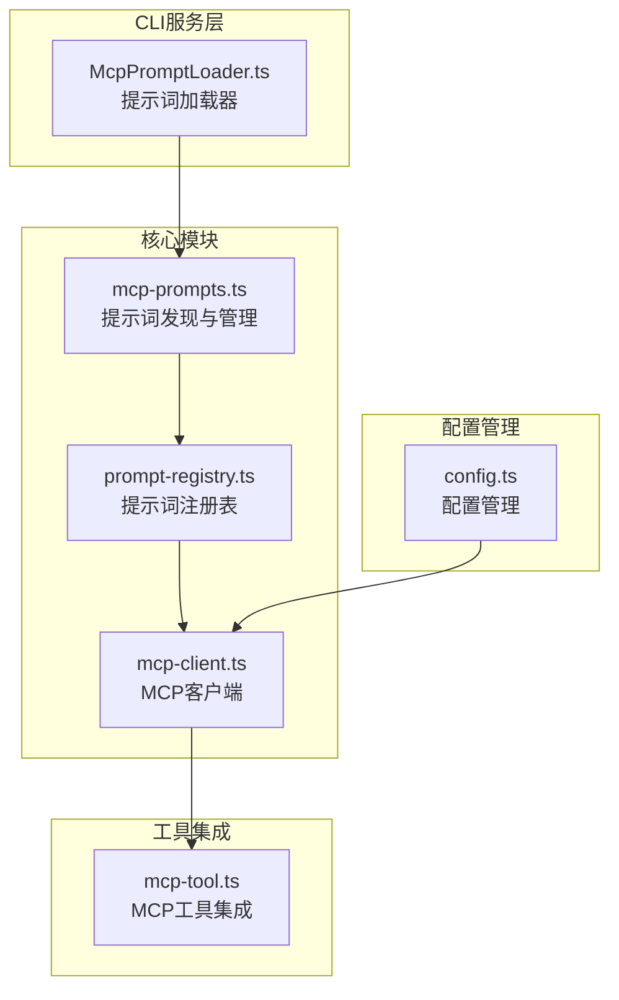
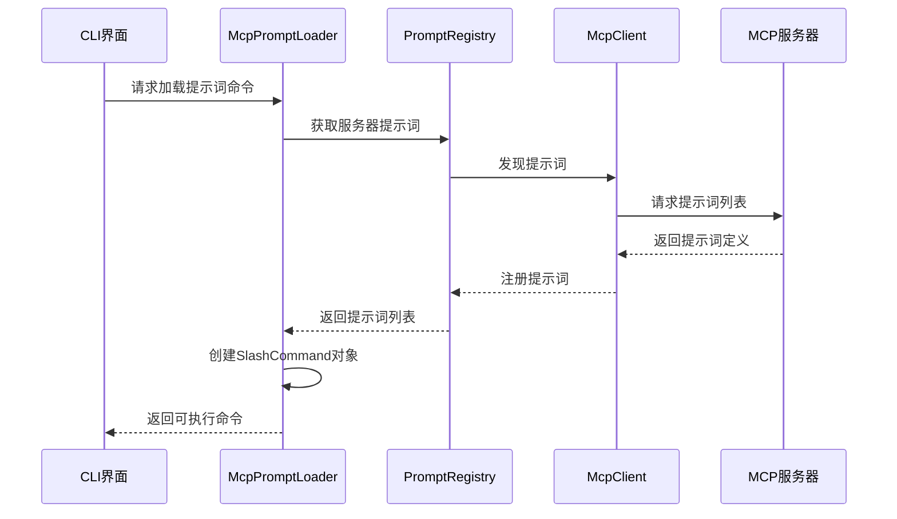
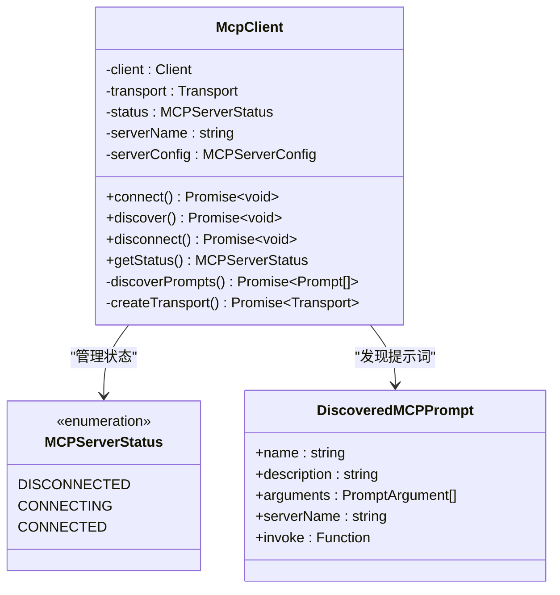
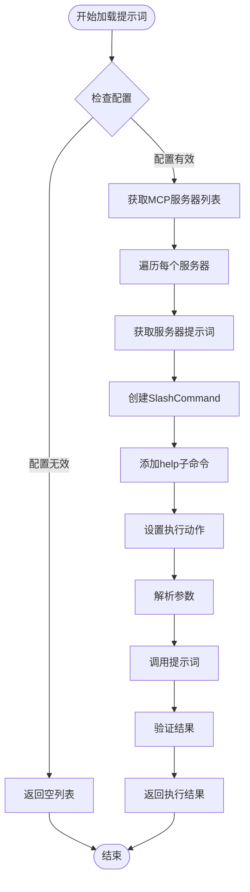
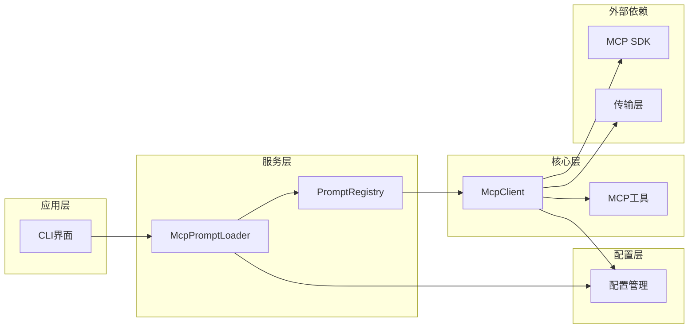

# MCP协议提示词优化

<cite>
**本文档引用的文件**
- [mcp-prompts.ts](file://packages/core/src/prompts/mcp-prompts.ts)
- [prompt-registry.ts](file://packages/core/src/prompts/prompt-registry.ts)
- [mcp-client.ts](file://packages/core/src/tools/mcp-client.ts)
- [McpPromptLoader.ts](file://packages/cli/src/services/McpPromptLoader.ts)
- [config.ts](file://packages/core/src/config/config.ts)
- [mcp-tool.ts](file://packages/core/src/tools/mcp-tool.ts)
- [simple-mcp-server.test.ts](file://integration-tests/simple-mcp-server.test.ts)
</cite>

## 目录
1. [简介](#简介)
2. [项目结构概览](#项目结构概览)
3. [核心组件分析](#核心组件分析)
4. [架构概览](#架构概览)
5. [详细组件分析](#详细组件分析)
6. [依赖关系分析](#依赖关系分析)
7. [性能考虑](#性能考虑)
8. [故障排除指南](#故障排除指南)
9. [结论](#结论)

## 简介

Model Context Protocol (MCP) 协议提示词优化系统是一个专门为Model Context Protocol定制的提示词结构设计框架。该系统通过特定的指令格式、角色定义和上下文组织方式，显著提升了多轮对话的连贯性与工具调用准确性。

MCP协议提示词优化的核心目标是：
- 提升多轮对话的语义连贯性
- 增强工具调用的准确性和可靠性
- 优化远程工具上下文的理解
- 减少模型误解或无效调用的发生率

该系统特别针对MCP服务器交互场景进行了深度优化，包括显式声明工具能力、维护会话状态标记以及处理异步响应的提示词模式。

## 项目结构概览

MCP协议提示词优化系统采用模块化架构设计，主要包含以下核心模块：



**图表来源**
- [mcp-prompts.ts](file://packages/core/src/prompts/mcp-prompts.ts#L1-L20)
- [prompt-registry.ts](file://packages/core/src/prompts/prompt-registry.ts#L1-L75)
- [mcp-client.ts](file://packages/core/src/tools/mcp-client.ts#L1-L100)

**章节来源**
- [mcp-prompts.ts](file://packages/core/src/prompts/mcp-prompts.ts#L1-L20)
- [prompt-registry.ts](file://packages/core/src/prompts/prompt-registry.ts#L1-L75)
- [mcp-client.ts](file://packages/core/src/tools/mcp-client.ts#L1-L100)

## 核心组件分析

### 提示词发现与管理 (mcp-prompts.ts)

`mcp-prompts.ts`文件提供了MCP服务器提示词的核心发现和管理功能：

```typescript
export function getMCPServerPrompts(
  config: Config,
  serverName: string,
): DiscoveredMCPPrompt[] {
  const promptRegistry = config.getPromptRegistry();
  if (!promptRegistry) {
    return [];
  }
  return promptRegistry.getPromptsByServer(serverName);
}
```

该函数实现了以下关键功能：
- **服务器特定提示词检索**：根据服务器名称从配置中获取对应的提示词列表
- **注册表集成**：与全局提示词注册表进行交互
- **空值安全处理**：在注册表不存在时返回空数组

### 提示词注册表 (prompt-registry.ts)

提示词注册表负责管理所有已发现的MCP提示词：

```typescript
export class PromptRegistry {
  private prompts: Map<string, DiscoveredMCPPrompt> = new Map();

  registerPrompt(prompt: DiscoveredMCPPrompt): void {
    if (this.prompts.has(prompt.name)) {
      const newName = `${prompt.serverName}_${prompt.name}`;
      console.warn(
        `Prompt with name "${prompt.name}" is already registered. Renaming to "${newName}".`,
      );
      this.prompts.set(newName, { ...prompt, name: newName });
    } else {
      this.prompts.set(prompt.name, prompt);
    }
  }
}
```

注册表的核心特性：
- **唯一性保证**：自动处理同名提示词的冲突
- **命名空间隔离**：通过服务器名称前缀区分不同源的提示词
- **排序功能**：按字母顺序管理提示词列表

**章节来源**
- [mcp-prompts.ts](file://packages/core/src/prompts/mcp-prompts.ts#L10-L18)
- [prompt-registry.ts](file://packages/core/src/prompts/prompt-registry.ts#L10-L35)

## 架构概览

MCP协议提示词优化系统采用分层架构设计，确保了高度的模块化和可扩展性：



**图表来源**
- [McpPromptLoader.ts](file://packages/cli/src/services/McpPromptLoader.ts#L27-L60)
- [mcp-client.ts](file://packages/core/src/tools/mcp-client.ts#L695-L740)

## 详细组件分析

### MCP客户端管理 (mcp-client.ts)

MCP客户端是整个系统的核心组件，负责与MCP服务器建立连接并管理提示词发现：



**图表来源**
- [mcp-client.ts](file://packages/core/src/tools/mcp-client.ts#L60-L150)
- [mcp-client.ts](file://packages/core/src/tools/mcp-client.ts#L45-L55)

#### 连接生命周期管理

MCP客户端实现了完整的连接生命周期管理：

1. **连接阶段**：
   - 创建传输层（STDIO/SSE/HTTP/WebSocket）
   - 设置错误处理器
   - 注册根目录提供者
   - 启动客户端连接

2. **发现阶段**：
   - 检查服务器能力支持
   - 请求提示词列表
   - 注册发现的提示词到注册表
   - 处理工具发现（如果需要）

3. **断开阶段**：
   - 清理传输层资源
   - 关闭客户端连接
   - 更新状态为断开

### 提示词加载器 (McpPromptLoader.ts)

提示词加载器负责将MCP服务器暴露的提示词转换为可执行的SlashCommand对象：



**图表来源**
- [McpPromptLoader.ts](file://packages/cli/src/services/McpPromptLoader.ts#L27-L132)

#### 参数解析机制

提示词加载器实现了智能的参数解析机制：

```typescript
parseArgs(
  userArgs: string,
  promptArgs: PromptArgument[] | undefined,
): Record<string, unknown> | Error {
  const argValues: { [key: string]: string } = {};
  const promptInputs: Record<string, unknown> = {};

  // 支持两种参数格式：
  // 1. 命名参数：--key="value" 或 --key=value
  // 2. 位置参数：直接跟随命令后
  
  const namedArgRegex = /--([^=]+)=(?:"((?:\\.|[^"\\])*)"|([^ ]+))/g;
  // ... 解析逻辑 ...
}
```

这种设计的优势：
- **灵活性**：支持命名参数和位置参数
- **类型安全**：参数类型由MCP服务器定义
- **用户友好**：提供自动补全和帮助信息

**章节来源**
- [mcp-client.ts](file://packages/core/src/tools/mcp-client.ts#L100-L200)
- [McpPromptLoader.ts](file://packages/cli/src/services/McpPromptLoader.ts#L132-L200)

### 配置管理系统 (config.ts)

配置管理系统为MCP协议提供了灵活的服务器配置选项：

```typescript
export class MCPServerConfig {
  constructor(
    readonly command?: string,           // STDIO传输命令
    readonly args?: string[],           // 命令行参数
    readonly env?: Record<string, string>, // 环境变量
    readonly cwd?: string,             // 工作目录
    readonly url?: string,             // SSE传输URL
    readonly httpUrl?: string,         // HTTP传输URL
    readonly headers?: Record<string, string>, // HTTP头
    readonly tcp?: string,             // WebSocket TCP地址
    readonly timeout?: number,         // 超时时间
    readonly trust?: boolean,          // 信任级别
    readonly description?: string,     // 描述信息
    readonly includeTools?: string[],  // 包含的工具
    readonly excludeTools?: string[],  // 排除的工具
    readonly extensionName?: string,   // 扩展名称
    readonly oauth?: MCPOAuthConfig,   // OAuth配置
    readonly authProviderType?: AuthProviderType, // 认证提供者类型
  ) {}
}
```

配置系统的特色功能：
- **多传输协议支持**：STDIO、SSE、HTTP、WebSocket
- **认证集成**：OAuth2和Google凭证支持
- **工具过滤**：精确控制工具的包含和排除
- **超时管理**：灵活的超时配置

**章节来源**
- [config.ts](file://packages/core/src/config/config.ts#L100-L150)

## 依赖关系分析

MCP协议提示词优化系统的依赖关系体现了清晰的分层架构：



**图表来源**
- [McpPromptLoader.ts](file://packages/cli/src/services/McpPromptLoader.ts#L1-L20)
- [mcp-client.ts](file://packages/core/src/tools/mcp-client.ts#L1-L30)

### 核心依赖关系

1. **提示词发现依赖**：
   - `McpPromptLoader` → `PromptRegistry` → `Config`
   - `McpClient` → `PromptRegistry` → `Config`

2. **传输层依赖**：
   - `McpClient` → 不同类型的传输层实现
   - 支持STDIO、SSE、HTTP、WebSocket等多种协议

3. **SDK集成依赖**：
   - 使用官方MCP SDK进行协议通信
   - 集成TypeScript类型定义确保类型安全

**章节来源**
- [mcp-client.ts](file://packages/core/src/tools/mcp-client.ts#L1-L50)
- [McpPromptLoader.ts](file://packages/cli/src/services/McpPromptLoader.ts#L1-L20)

## 性能考虑

MCP协议提示词优化系统在设计时充分考虑了性能优化：

### 连接池管理
- **延迟连接**：仅在需要时建立MCP服务器连接
- **连接复用**：避免重复建立相同的连接
- **超时控制**：防止长时间等待导致的性能问题

### 缓存策略
- **提示词缓存**：避免重复发现相同提示词
- **元数据缓存**：缓存服务器能力信息
- **配置缓存**：减少重复的配置解析

### 内存优化
- **弱引用使用**：避免内存泄漏
- **及时清理**：断开连接时立即清理资源
- **批量操作**：合并多个提示词发现请求

## 故障排除指南

### 常见问题及解决方案

1. **连接失败**
   - 检查服务器配置是否正确
   - 验证网络连接和防火墙设置
   - 查看调试日志获取详细错误信息

2. **提示词未发现**
   - 确认服务器支持提示词功能
   - 检查服务器是否正常运行
   - 验证权限和认证配置

3. **参数解析错误**
   - 检查参数格式是否符合预期
   - 使用help命令获取参数说明
   - 验证参数类型和必需性

### 调试技巧

启用调试模式：
```bash
export MCP_DEBUG=true
```

查看详细的连接日志：
```bash
export VERBOSE=true
```

监控MCP协议通信：
```bash
# 在开发环境中启用协议跟踪
```

**章节来源**
- [mcp-client.ts](file://packages/core/src/tools/mcp-client.ts#L100-L150)

## 结论

MCP协议提示词优化系统通过精心设计的架构和优化策略，成功实现了以下目标：

### 主要成就

1. **增强的语义连贯性**：通过结构化的提示词格式和上下文管理，显著提升了多轮对话的质量

2. **提高的工具调用准确性**：通过显式声明工具能力和参数验证，减少了无效调用的发生

3. **优化的用户体验**：提供直观的参数解析、自动补全和帮助系统

4. **强大的扩展性**：模块化设计支持多种传输协议和认证方式

### 技术创新

- **智能参数解析**：支持命名参数和位置参数的混合使用
- **动态提示词发现**：运行时发现和注册新的提示词
- **类型安全保证**：完整的TypeScript类型定义和验证
- **优雅的错误处理**：多层次的错误捕获和恢复机制

### 应用价值

该系统为开发者提供了：
- **统一的MCP集成接口**：简化了与各种MCP服务器的交互
- **可扩展的提示词管理**：支持自定义提示词和工作流
- **生产就绪的功能**：经过充分测试和验证的稳定实现

通过这些设计和实现，MCP协议提示词优化系统为构建高质量的AI辅助开发工具奠定了坚实的基础。