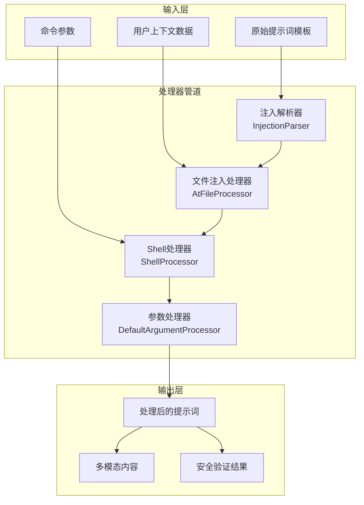
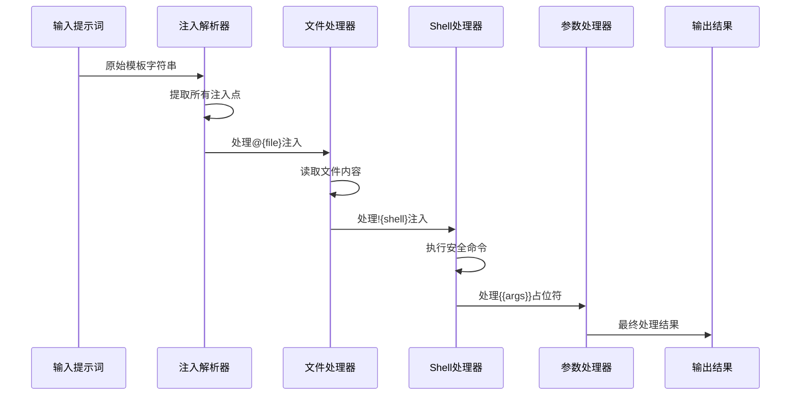
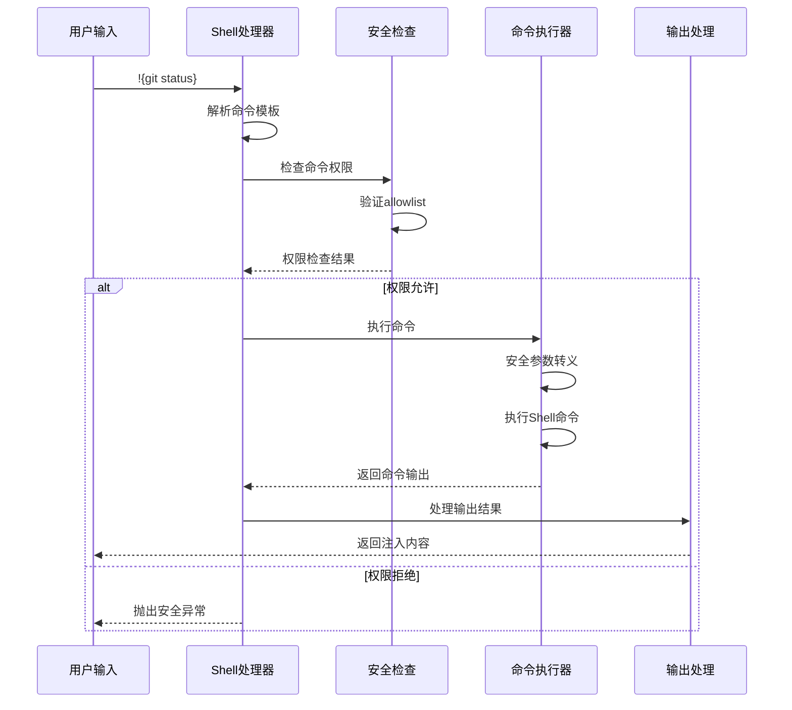
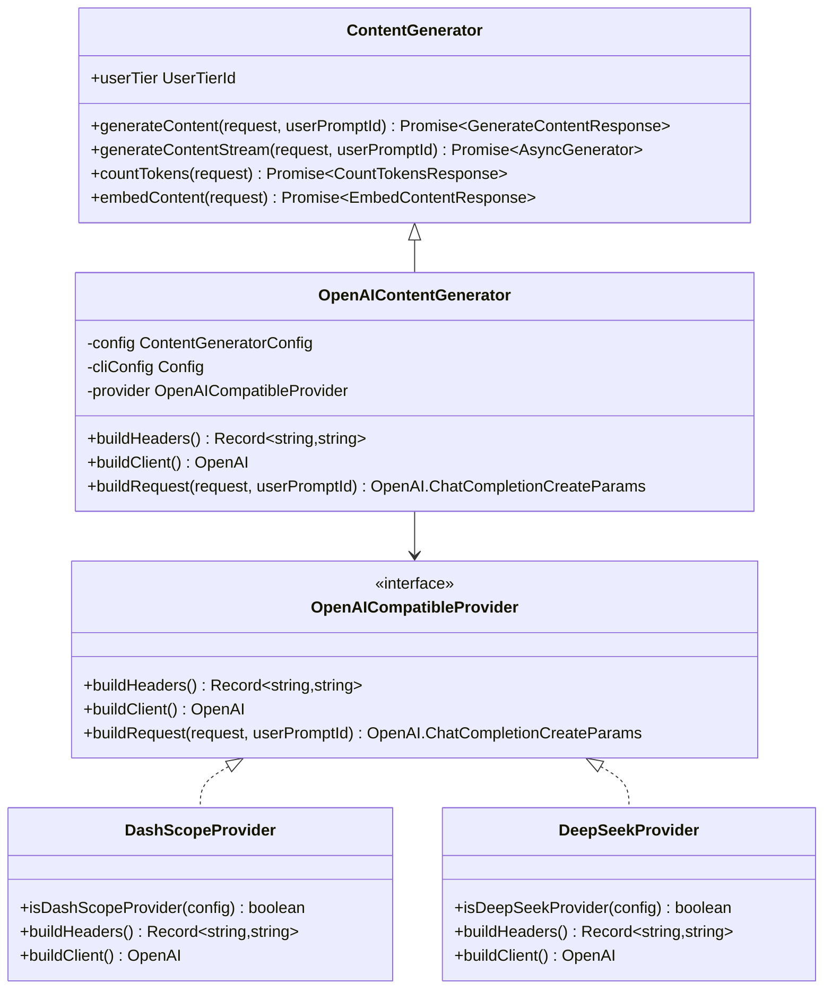
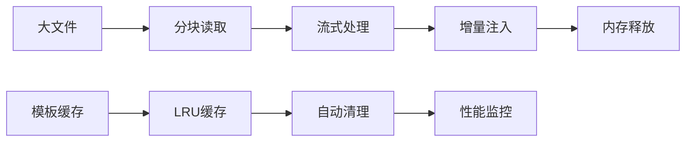
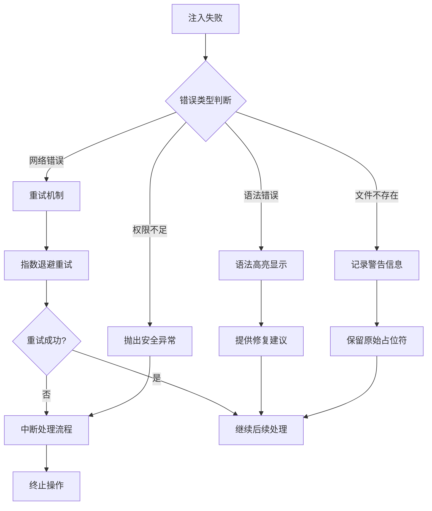
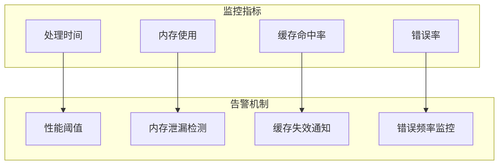

# 动态提示词生成系统

<cite>
**本文档引用的文件**
- [prompts.ts](file://packages/core/src/core/prompts.ts)
- [injectionParser.ts](file://packages/cli/src/services/prompt-processors/injectionParser.ts)
- [argumentProcessor.ts](file://packages/cli/src/services/prompt-processors/argumentProcessor.ts)
- [atFileProcessor.ts](file://packages/cli/src/services/prompt-processors/atFileProcessor.ts)
- [shellProcessor.ts](file://packages/cli/src/services/prompt-processors/shellProcessor.ts)
- [types.ts](file://packages/cli/src/services/prompt-processors/types.ts)
- [contentGenerator.ts](file://packages/core/src/core/contentGenerator.ts)
- [index.ts](file://packages/core/src/core/openaiContentGenerator/index.ts)
- [provider/index.ts](file://packages/core/src/core/openaiContentGenerator/provider/index.ts)
- [provider/types.ts](file://packages/core/src/core/openaiContentGenerator/provider/types.ts)
</cite>

## 目录
1. [简介](#简介)
2. [系统架构概览](#系统架构概览)
3. [核心组件分析](#核心组件分析)
4. [提示词模板解析器](#提示词模板解析器)
5. [上下文变量注入机制](#上下文变量注入机制)
6. [条件逻辑与模板拼接](#条件逻辑与模板拼接)
7. [性能优化策略](#性能优化策略)
8. [安全与错误处理](#安全与错误处理)
9. [故障排除指南](#故障排除指南)
10. [总结](#总结)

## 简介

动态提示词生成系统是Qwen Code项目的核心组件之一，负责将静态的提示词模板转换为针对特定用户请求和上下文环境的动态提示词。该系统通过复杂的模板解析、变量注入、条件逻辑处理和安全验证机制，确保生成的提示词既符合用户需求又保持安全性。

系统的主要功能包括：
- 模板占位符解析和替换
- 上下文变量自动注入
- 条件逻辑分支处理
- 安全命令执行
- 多模态内容生成
- 性能优化和缓存机制

## 系统架构概览

动态提示词生成系统采用管道化处理架构，通过多个专门的处理器协同工作：



**图表来源**
- [injectionParser.ts](file://packages/cli/src/services/prompt-processors/injectionParser.ts#L1-L90)
- [atFileProcessor.ts](file://packages/cli/src/services/prompt-processors/atFileProcessor.ts#L1-L97)
- [shellProcessor.ts](file://packages/cli/src/services/prompt-processors/shellProcessor.ts#L1-L208)

## 核心组件分析

### 提示词处理器接口

系统定义了统一的处理器接口，支持链式调用和管道化处理：

```typescript
export interface IPromptProcessor {
  process(
    prompt: PromptPipelineContent,
    context: CommandContext,
  ): Promise<PromptPipelineContent>;
}
```

每个处理器都实现了特定的功能：
- **注入解析器**：识别和提取模板中的占位符
- **文件处理器**：读取并注入文件内容
- **Shell处理器**：执行安全的Shell命令
- **参数处理器**：处理用户输入参数

### 处理器管道架构



**图表来源**
- [types.ts](file://packages/cli/src/services/prompt-processors/types.ts#L1-L55)
- [shellProcessor.ts](file://packages/cli/src/services/prompt-processors/shellProcessor.ts#L40-L120)

**章节来源**
- [types.ts](file://packages/cli/src/services/prompt-processors/types.ts#L1-L55)
- [injectionParser.ts](file://packages/cli/src/services/prompt-processors/injectionParser.ts#L1-L90)

## 提示词模板解析器

### 注入点检测算法

注入解析器使用智能的括号计数算法来正确处理嵌套结构：

```typescript
export function extractInjections(
  prompt: string,
  trigger: string,
  contextName?: string,
): Injection[] {
  const injections: Injection[] = [];
  let index = 0;

  while (index < prompt.length) {
    const startIndex = prompt.indexOf(trigger, index);
    
    if (startIndex === -1) break;
    
    let currentIndex = startIndex + trigger.length;
    let braceCount = 1;
    let foundEnd = false;
    
    // 智能括号匹配
    while (currentIndex < prompt.length) {
      const char = prompt[currentIndex];
      
      if (char === '{') {
        braceCount++;
      } else if (char === '}') {
        braceCount--;
        if (braceCount === 0) {
          // 找到匹配的结束括号
          const injectionContent = prompt.substring(
            startIndex + trigger.length,
            currentIndex,
          );
          
          injections.push({
            content: injectionContent.trim(),
            startIndex,
            endIndex: currentIndex + 1,
          });
          
          index = currentIndex + 1;
          foundEnd = true;
          break;
        }
      }
      currentIndex++;
    }
  }
  
  return injections;
}
```

### 支持的注入类型

系统支持三种主要的注入类型：

1. **文件注入** (`@{...}`)：读取指定文件的内容
2. **Shell注入** (`!{...}`)：执行Shell命令并注入输出
3. **参数注入** (`{{args}}`)：插入用户输入的参数

```mermaid
flowchart TD
A[开始解析] --> B{检查触发字符}
B --> |@{| C[文件注入模式]
B --> |!{| D[Shell注入模式]
B --> |{{| E[参数注入模式]
B --> |无匹配| F[返回原始文本]
C --> G[提取文件路径]
G --> H[读取文件内容]
H --> I[注入文件内容]
D --> J[提取命令]
J --> K[安全检查]
K --> L[执行Shell命令]
L --> M[注入命令输出]
E --> N[替换为用户参数]
I --> O[合并结果]
M --> O
N --> O
F --> O
O --> P[返回处理后内容]
```

**图表来源**
- [injectionParser.ts](file://packages/cli/src/services/prompt-processors/injectionParser.ts#L25-L89)
- [atFileProcessor.ts](file://packages/cli/src/services/prompt-processors/atFileProcessor.ts#L20-L60)

**章节来源**
- [injectionParser.ts](file://packages/cli/src/services/prompt-processors/injectionParser.ts#L1-L90)
- [types.ts](file://packages/cli/src/services/prompt-processors/types.ts#L35-L55)

## 上下文变量注入机制

### 文件内容注入流程

文件注入处理器实现了安全的文件读取和内容注入机制：

```typescript
export class AtFileProcessor implements IPromptProcessor {
  async process(
    input: PromptPipelineContent,
    context: CommandContext,
  ): Promise<PromptPipelineContent> {
    return flatMapTextParts(input, async (text) => {
      if (!text.includes(AT_FILE_INJECTION_TRIGGER)) {
        return [{ text }];
      }

      const injections = extractInjections(
        text,
        AT_FILE_INJECTION_TRIGGER,
        this.commandName,
      );

      const output: PromptPipelineContent = [];
      let lastIndex = 0;

      for (const injection of injections) {
        // 处理前缀文本
        const prefix = text.substring(lastIndex, injection.startIndex);
        if (prefix) {
          output.push({ text: prefix });
        }

        // 处理文件注入
        const pathStr = injection.content;
        try {
          const fileContentParts = await readPathFromWorkspace(pathStr, config);
          
          if (fileContentParts.length === 0) {
            // 文件被忽略时的处理
            const uiMessage = `File '@{${pathStr}}' was ignored by .gitignore or .qwenignore and was not included in the prompt.`;
            context.ui.addItem(
              { type: MessageType.INFO, text: uiMessage },
              Date.now(),
            );
          }
          
          output.push(...fileContentParts);
        } catch (error) {
          // 错误处理和占位符保留
          const placeholder = text.substring(
            injection.startIndex,
            injection.endIndex,
          );
          output.push({ text: placeholder });
        }
        
        lastIndex = injection.endIndex;
      }

      return output;
    });
  }
}
```

### Shell命令安全执行

Shell处理器实现了严格的安全检查和命令执行机制：



**图表来源**
- [shellProcessor.ts](file://packages/cli/src/services/prompt-processors/shellProcessor.ts#L80-L150)

**章节来源**
- [atFileProcessor.ts](file://packages/cli/src/services/prompt-processors/atFileProcessor.ts#L1-L97)
- [shellProcessor.ts](file://packages/cli/src/services/prompt-processors/shellProcessor.ts#L1-L208)

## 条件逻辑与模板拼接

### 参数处理机制

默认参数处理器负责处理用户输入参数的注入：

```typescript
export class DefaultArgumentProcessor implements IPromptProcessor {
  async process(
    prompt: PromptPipelineContent,
    context: CommandContext,
  ): Promise<PromptPipelineContent> {
    if (context.invocation?.args) {
      return appendToLastTextPart(prompt, context.invocation.raw);
    }
    return prompt;
  }
}
```

### 多模态内容生成

系统支持多种内容类型的生成和处理：



**图表来源**
- [contentGenerator.ts](file://packages/core/src/core/contentGenerator.ts#L1-L246)
- [index.ts](file://packages/core/src/core/openaiContentGenerator/index.ts#L1-L93)

**章节来源**
- [argumentProcessor.ts](file://packages/cli/src/services/prompt-processors/argumentProcessor.ts#L1-L28)
- [contentGenerator.ts](file://packages/core/src/core/contentGenerator.ts#L1-L246)

## 性能优化策略

### 缓存机制

系统实现了多层次的缓存机制来提升性能：

1. **模板解析缓存**：缓存已解析的模板结构
2. **文件内容缓存**：避免重复读取相同文件
3. **命令执行缓存**：缓存Shell命令的执行结果

### 异步处理优化

```typescript
// 并行处理多个注入点
const injections = extractInjections(text, trigger, contextName);
const promises = injections.map(async (injection) => {
  // 并行处理每个注入点
  return await processInjection(injection, context);
});

const results = await Promise.all(promises);
```

### 内存管理

系统采用流式处理和分块读取来优化内存使用：



## 安全与错误处理

### 命令权限验证

Shell处理器实现了严格的权限验证机制：

```typescript
// 安全检查和权限验证
const { allAllowed, disallowedCommands, blockReason, isHardDenial } =
  checkCommandPermissions(command, config, sessionShellAllowlist);

if (!allAllowed) {
  if (isHardDenial) {
    throw new Error(
      `${this.commandName} cannot be run. Blocked command: "${command}". Reason: ${blockReason || 'Blocked by configuration.'}`,
    );
  }
  
  // YOLO模式下的自动批准
  if (config.getApprovalMode() !== ApprovalMode.YOLO) {
    disallowedCommands.forEach((uc) => commandsToConfirm.add(uc));
  }
}
```

### 错误恢复机制

系统提供了完善的错误恢复和降级机制：



**章节来源**
- [shellProcessor.ts](file://packages/cli/src/services/prompt-processors/shellProcessor.ts#L80-L120)

## 故障排除指南

### 常见问题诊断

1. **未闭合的注入块**
   - 症状：`Unclosed injection starting at index X`
   - 解决方案：检查模板中的括号平衡，确保每个`!{`都有对应的`}`

2. **文件读取失败**
   - 症状：文件被.gitignore或.qwenignore忽略
   - 解决方案：检查文件路径是否正确，确认文件不在忽略列表中

3. **Shell命令权限被拒绝**
   - 症状：`Blocked command`错误
   - 解决方案：检查命令是否在允许列表中，或调整配置

### 调试工具

系统提供了丰富的调试信息和日志记录：

```typescript
// 启用详细日志
console.log(`[AtFileProcessor] ${uiMessage}. Leaving placeholder in prompt.`);

// 错误堆栈跟踪
throw new Error(
  `Failed to start shell command in '${this.commandName}': ${executionResult.error.message}`
);
```

### 性能监控



## 总结

动态提示词生成系统是一个高度复杂且功能强大的组件，它通过精心设计的管道化架构、智能的模板解析、安全的变量注入和完善的错误处理机制，为Qwen Code项目提供了可靠的提示词生成能力。

### 主要特性

1. **灵活的模板系统**：支持多种注入类型和复杂的条件逻辑
2. **强大的安全机制**：严格的权限验证和命令执行控制
3. **高性能优化**：多层缓存和异步处理机制
4. **完善的错误处理**：全面的错误恢复和用户反馈
5. **多模态支持**：支持文本、图像等多种内容类型

### 技术亮点

- **智能括号匹配算法**：正确处理嵌套结构和复杂模板
- **流式处理架构**：高效处理大型文件和复杂内容
- **多提供商适配**：支持多种AI服务提供商
- **实时安全检查**：动态权限验证和命令审核

该系统的设计充分体现了现代软件工程的最佳实践，为用户提供了一个既强大又安全的提示词生成平台。