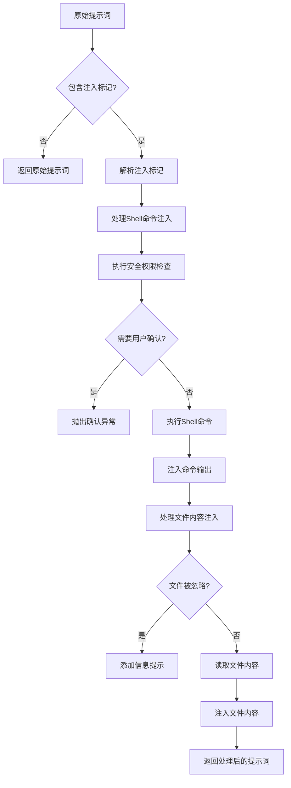
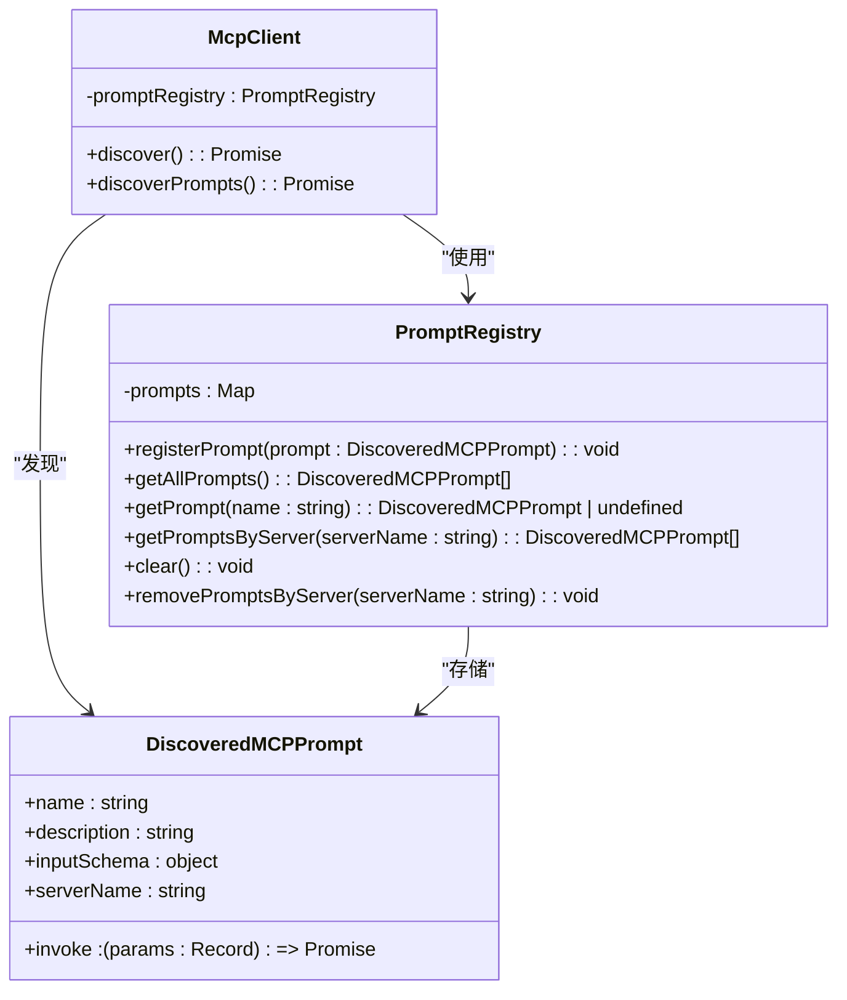
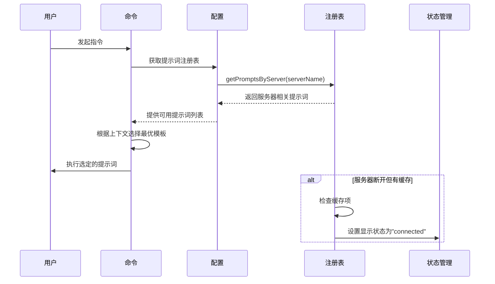

# 提示词工程实现

<cite>
**本文档引用的文件**
- [prompts.ts](file://packages/core/src/core/prompts.ts)
- [prompt-registry.ts](file://packages/core/src/prompts/prompt-registry.ts)
- [mcp-prompts.ts](file://packages/core/src/prompts/mcp-prompts.ts)
- [injectionParser.ts](file://packages/cli/src/services/prompt-processors/injectionParser.ts)
- [shellProcessor.ts](file://packages/cli/src/services/prompt-processors/shellProcessor.ts)
- [atFileProcessor.ts](file://packages/cli/src/services/prompt-processors/atFileProcessor.ts)
- [config.ts](file://packages/core/src/config/config.ts)
- [mcp-client.ts](file://packages/core/src/tools/mcp-client.ts)
</cite>

## 目录
1. [架构概述](#架构概述)
2. [动态提示词构建逻辑](#动态提示词构建逻辑)
3. [提示词注册与检索机制](#提示词注册与检索机制)
4. [MCP优化提示词结构](#mcp优化提示词结构)
5. [提示词选择与缓存策略](#提示词选择与缓存策略)

## 架构概述

提示词工程系统采用分层架构设计，核心组件包括提示词注册表、处理器管道和运行时上下文管理。系统通过`PromptRegistry`类实现提示词模板的集中管理，支持从MCP（Model Context Protocol）服务器动态加载和注册。提示词处理流程由多个处理器组成管道，依次处理上下文变量注入、文件内容注入和shell命令执行等操作。整个系统与配置管理、工具注册和工作区上下文紧密集成，确保提示词能够根据运行时环境动态调整。

**Section sources**
- [prompt-registry.ts](file://packages/core/src/prompts/prompt-registry.ts#L1-L73)
- [config.ts](file://packages/core/src/config/config.ts#L1-L200)
- [mcp-client.ts](file://packages/core/src/tools/mcp-client.ts#L1-L200)

## 动态提示词构建逻辑

动态提示词构建系统通过处理器管道实现上下文变量注入和条件片段拼接。核心机制包括三种主要处理器：`ShellProcessor`处理shell命令注入（!{...}），`AtFileProcessor`处理文件内容注入（@{...}），以及参数处理器处理用户输入参数。系统使用`extractInjections`函数解析提示词字符串中的注入标记，正确处理嵌套的大括号。`ShellProcessor`在处理过程中会进行安全检查，验证shell命令权限，并在需要时抛出`ConfirmationRequiredError`异常以请求用户确认。文件注入处理器会检查.gitignore和.qwenignore文件，忽略被排除的文件内容。

**Diagram sources**
- [shellProcessor.ts](file://packages/cli/src/services/prompt-processors/shellProcessor.ts#L1-L208)
- [atFileProcessor.ts](file://packages/cli/src/services/prompt-processors/atFileProcessor.ts#L1-L97)
- [injectionParser.ts](file://packages/cli/src/services/prompt-processors/injectionParser.ts#L1-L90)

**Section sources**
- [shellProcessor.ts](file://packages/cli/src/services/prompt-processors/shellProcessor.ts#L1-L208)
- [atFileProcessor.ts](file://packages/cli/src/services/prompt-processors/atFileProcessor.ts#L1-L97)
- [injectionParser.ts](file://packages/cli/src/services/prompt-processors/injectionParser.ts#L1-L90)

## 提示词注册与检索机制

提示词注册与检索机制通过`PromptRegistry`类实现，提供完整的生命周期管理功能。系统支持提示词的注册、检索、按服务器分组查询和清除操作。当MCP客户端连接到服务器时，会调用`discoverPrompts`函数发现服务器提供的提示词，并通过`registerPrompt`方法注册到全局注册表中。如果提示词名称冲突，系统会自动重命名为`{serverName}_{promptName}`格式。`getPromptsByServer`方法允许按MCP服务器名称查询相关提示词，支持运行时动态加载。注册表还提供`clear`和`removePromptsByServer`方法，用于清理特定服务器或全部提示词。

**Diagram sources**
- [prompt-registry.ts](file://packages/core/src/prompts/prompt-registry.ts#L1-L73)
- [mcp-client.ts](file://packages/core/src/tools/mcp-client.ts#L695-L740)

**Section sources**
- [prompt-registry.ts](file://packages/core/src/prompts/prompt-registry.ts#L1-L73)
- [mcp-client.ts](file://packages/core/src/tools/mcp-client.ts#L695-L740)

## MCP优化提示词结构

MCP优化提示词结构通过`getMCPServerPrompts`函数实现，专门针对Model Context Protocol进行优化。该函数从配置中获取提示词注册表，并根据指定的服务器名称查询相关提示词。这种设计确保了多轮对话的连贯性，因为来自同一MCP服务器的提示词会被统一管理和调用。系统通过`DiscoveredMCPPrompt`接口扩展了标准提示词定义，增加了`serverName`和`invoke`方法，使得提示词能够与特定的MCP服务器实例关联。`invoke`方法封装了MCP客户端调用逻辑，确保提示词执行时能够正确路由到对应的服务器。这种结构设计支持动态服务器发现和连接状态管理，提升了系统的可靠性和用户体验。

**Section sources**
- [mcp-prompts.ts](file://packages/core/src/prompts/mcp-prompts.ts#L1-L18)
- [mcp-client.ts](file://packages/core/src/tools/mcp-client.ts#L160-L215)

## 提示词选择与缓存策略

提示词选择与缓存策略结合了运行时上下文和性能优化考虑。系统根据用户指令和上下文环境自动选择最优提示词模板，优先使用与当前MCP服务器匹配的提示词。缓存策略主要体现在两个层面：首先，`PromptRegistry`本身作为内存缓存存储所有已注册的提示词，避免重复发现和注册；其次，系统在服务器断开连接但仍有缓存项时，会显示为"Ready"状态，允许继续使用缓存的提示词和工具。这种设计显著提升了响应性能，特别是在网络不稳定或服务器启动较慢的情况下。`getMCPServerStatus`函数负责管理服务器状态，当服务器处于"disconnected"状态但有缓存项时，会将其显示状态调整为"connected"，确保用户体验的连续性。

**Diagram sources**
- [mcpCommand.ts](file://packages/cli/src/ui/commands/mcpCommand.ts#L86-L124)
- [mcp-client.ts](file://packages/core/src/tools/mcp-client.ts#L452-L487)

**Section sources**
- [mcpCommand.ts](file://packages/cli/src/ui/commands/mcpCommand.ts#L86-L124)
- [mcp-client.ts](file://packages/core/src/tools/mcp-client.ts#L452-L487)