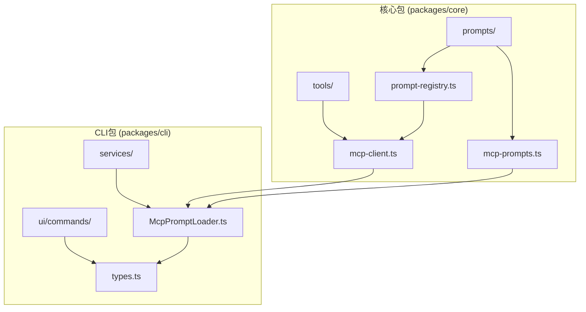
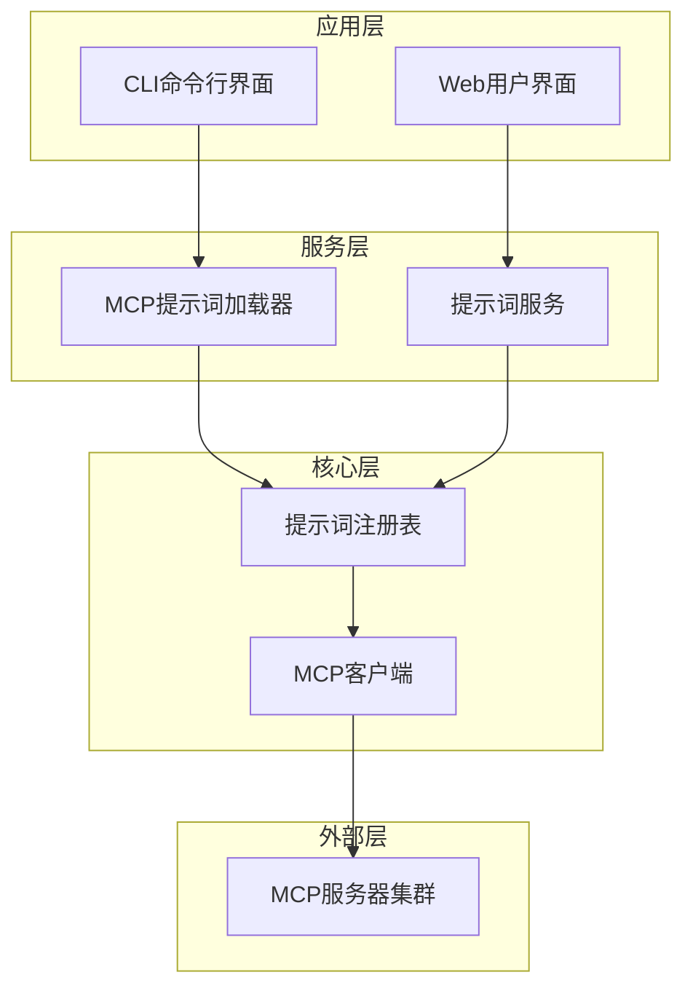
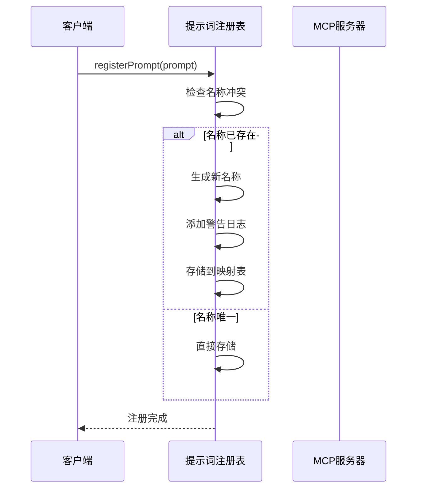
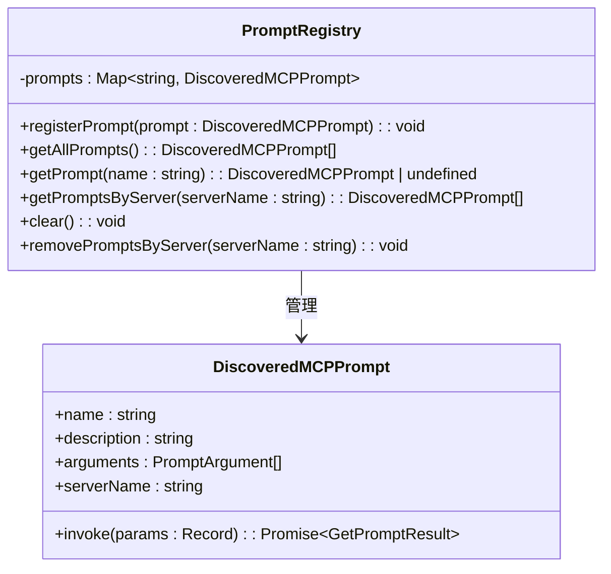
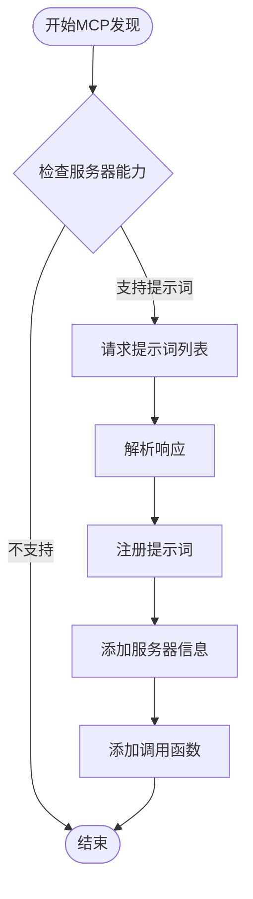
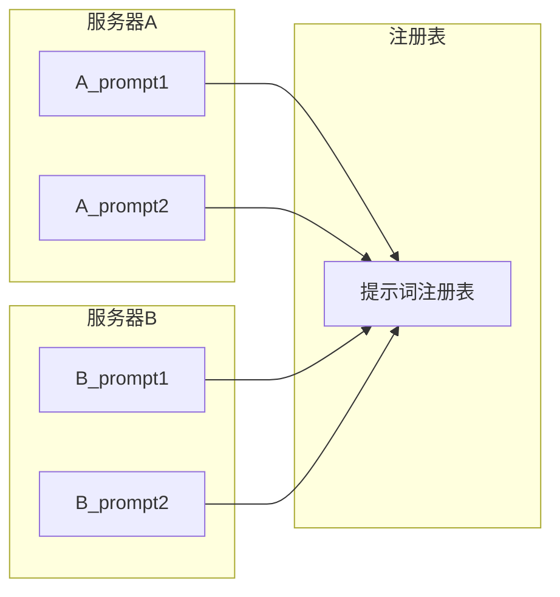

# 提示词模板注册表

<cite>
**本文档引用的文件**
- [prompt-registry.ts](file://packages/core/src/prompts/prompt-registry.ts)
- [mcp-client.ts](file://packages/core/src/tools/mcp-client.ts)
- [McpPromptLoader.ts](file://packages/cli/src/services/McpPromptLoader.ts)
- [mcp-prompts.ts](file://packages/core/src/prompts/mcp-prompts.ts)
- [McpPromptLoader.ts](file://packages/cli/src/services/McpPromptLoader.ts)
</cite>

## 目录
1. [简介](#简介)
2. [项目结构](#项目结构)
3. [核心组件](#核心组件)
4. [架构概览](#架构概览)
5. [详细组件分析](#详细组件分析)
6. [依赖关系分析](#依赖关系分析)
7. [性能考虑](#性能考虑)
8. [故障排除指南](#故障排除指南)
9. [结论](#结论)

## 简介

提示词模板注册表是Qwen Code项目中负责管理提示词模板的核心模块。该模块提供了完整的提示词注册、检索、版本化管理和动态加载功能，支持运行时的热替换机制。通过唯一标识符系统，它能够有效地组织和管理来自不同MCP服务器的提示词模板，为上层功能提供可扩展的提示词管理基础设施。

该模块的设计遵循了现代软件架构的最佳实践，采用了类型安全的接口设计、命名空间隔离和智能冲突解决机制，确保了系统的稳定性和可维护性。

## 项目结构

提示词模板注册表模块在项目中的组织结构如下：



**图表来源**
- [prompt-registry.ts](file://packages/core/src/prompts/prompt-registry.ts#L1-L75)
- [mcp-client.ts](file://packages/core/src/tools/mcp-client.ts#L1-L199)

**章节来源**
- [prompt-registry.ts](file://packages/core/src/prompts/prompt-registry.ts#L1-L75)
- [mcp-client.ts](file://packages/core/src/tools/mcp-client.ts#L1-L199)

## 核心组件

### PromptRegistry 类

`PromptRegistry` 是整个提示词管理系统的核心类，负责所有提示词模板的注册、检索和管理操作。

```typescript
export class PromptRegistry {
  private prompts: Map<string, DiscoveredMCPPrompt> = new Map();
  
  registerPrompt(prompt: DiscoveredMCPPrompt): void {
    if (this.prompts.has(prompt.name)) {
      const newName = `${prompt.serverName}_${prompt.name}`;
      console.warn(
        `Prompt with name "${prompt.name}" is already registered. Renaming to "${newName}".`,
      );
      this.prompts.set(newName, { ...prompt, name: newName });
    } else {
      this.prompts.set(prompt.name, prompt);
    }
  }
}
```

### DiscoveredMCPPrompt 类型

`DiscoveredMCPPrompt` 是从MCP协议发现的提示词对象，包含了额外的服务器信息和执行逻辑：

```typescript
export type DiscoveredMCPPrompt = Prompt & {
  serverName: string;
  invoke: (params: Record<string, unknown>) => Promise<GetPromptResult>;
};
```

**章节来源**
- [prompt-registry.ts](file://packages/core/src/prompts/prompt-registry.ts#L9-L25)
- [mcp-client.ts](file://packages/core/src/tools/mcp-client.ts#L45-L48)

## 架构概览

提示词模板注册表采用分层架构设计，各组件之间通过明确定义的接口进行交互：



**图表来源**
- [McpPromptLoader.ts](file://packages/cli/src/services/McpPromptLoader.ts#L1-L257)
- [prompt-registry.ts](file://packages/core/src/prompts/prompt-registry.ts#L1-L75)

## 详细组件分析

### 提示词注册机制

提示词注册机制是整个系统的基础，它实现了智能的冲突检测和自动重命名功能：



**图表来源**
- [prompt-registry.ts](file://packages/core/src/prompts/prompt-registry.ts#L15-L25)

#### 冲突解决策略

当检测到重复的提示词名称时，系统采用以下策略：

1. **自动重命名**：将服务器名称前缀添加到原始名称
2. **警告通知**：通过控制台输出警告信息
3. **保持兼容性**：确保原有功能不受影响

```typescript
if (this.prompts.has(prompt.name)) {
  const newName = `${prompt.serverName}_${prompt.name}`;
  console.warn(
    `Prompt with name "${prompt.name}" is already registered. Renaming to "${newName}".`,
  );
  this.prompts.set(newName, { ...prompt, name: newName });
}
```

### 提示词检索接口

系统提供了多种检索方式以满足不同的使用场景：



**图表来源**
- [prompt-registry.ts](file://packages/core/src/prompts/prompt-registry.ts#L9-L73)
- [mcp-client.ts](file://packages/core/src/tools/mcp-client.ts#L45-L48)

#### 类型安全的检索

系统通过TypeScript的类型系统确保检索操作的安全性：

```typescript
// 单个提示词检索
getPrompt(name: string): DiscoveredMCPPrompt | undefined {
  return this.prompts.get(name);
}

// 批量检索
getAllPrompts(): DiscoveredMCPPrompt[] {
  return Array.from(this.prompts.values()).sort((a, b) =>
    a.name.localeCompare(b.name),
  );
}
```

### MCP服务器集成

系统通过MCP协议与外部服务器进行集成，实现了动态提示词发现和管理：



**图表来源**
- [mcp-client.ts](file://packages/core/src/tools/mcp-client.ts#L695-L740)

#### 动态提示词发现

系统实现了智能的提示词发现机制：

```typescript
export async function discoverPrompts(
  mcpServerName: string,
  mcpClient: Client,
  promptRegistry: PromptRegistry,
): Promise<Prompt[]> {
  try {
    if (mcpClient.getServerCapabilities()?.prompts == null) return [];
    
    const response = await mcpClient.request(
      { method: 'prompts/list', params: {} },
      ListPromptsResultSchema,
    );
    
    for (const prompt of response.prompts) {
      promptRegistry.registerPrompt({
        ...prompt,
        serverName: mcpServerName,
        invoke: (params: Record<string, unknown>) =>
          invokeMcpPrompt(mcpServerName, mcpClient, prompt.name, params),
      });
    }
    return response.prompts;
  } catch (error) {
    if (!(error instanceof Error && error.message?.includes('Method not found'))) {
      console.error(`Error discovering prompts from ${mcpServerName}: ${getErrorMessage(error)}`);
    }
    return [];
  }
}
```

**章节来源**
- [mcp-client.ts](file://packages/core/src/tools/mcp-client.ts#L695-L740)

### 命名空间管理

系统通过服务器名称实现命名空间隔离，避免不同服务器间的提示词冲突：



**图表来源**
- [prompt-registry.ts](file://packages/core/src/prompts/prompt-registry.ts#L15-L25)

### 错误处理策略

系统实现了多层次的错误处理机制：

1. **运行时错误捕获**：通过try-catch块捕获异常
2. **优雅降级**：当某个服务器不可用时不影响其他功能
3. **详细日志记录**：提供完整的错误信息用于调试

```typescript
try {
  const result = await prompt.invoke(promptInputs);
  if (result['error']) {
    return {
      type: 'message',
      messageType: 'error',
      content: `Error invoking prompt: ${result['error']}`,
    };
  }
} catch (error) {
  return {
    type: 'message',
    messageType: 'error',
    content: `Error: ${getErrorMessage(error)}`,
  };
}
```

**章节来源**
- [McpPromptLoader.ts](file://packages/cli/src/services/McpPromptLoader.ts#L96-L132)

## 依赖关系分析

提示词模板注册表模块具有清晰的依赖关系结构：

```mermaid
graph TD
subgraph "外部依赖"
MCP_SDK[@modelcontextprotocol/sdk]
TS_TYPES[TypeScript类型定义]
end
subgraph "内部模块"
PROMPT_REGISTRY[prompt-registry.ts]
MCP_CLIENT[mcp-client.ts]
MCP_PROMPTS[mcp-prompts.ts]
MCP_LOADER[McpPromptLoader.ts]
end
PROMPT_REGISTRY --> TS_TYPES
MCP_CLIENT --> MCP_SDK
MCP_CLIENT --> PROMPT_REGISTRY
MCP_PROMPTS --> PROMPT_REGISTRY
MCP_LOADER --> MCP_PROMPTS
MCP_LOADER --> MCP_CLIENT
```

**图表来源**
- [prompt-registry.ts](file://packages/core/src/prompts/prompt-registry.ts#L6-L8)
- [mcp-client.ts](file://packages/core/src/tools/mcp-client.ts#L1-L25)

### 关键依赖说明

1. **@modelcontextprotocol/sdk**：提供MCP协议的标准实现
2. **TypeScript类型系统**：确保类型安全和开发体验
3. **Node.js内置模块**：提供基础的文件系统和网络功能

**章节来源**
- [prompt-registry.ts](file://packages/core/src/prompts/prompt-registry.ts#L6-L8)
- [mcp-client.ts](file://packages/core/src/tools/mcp-client.ts#L1-L25)

## 性能考虑

### 内存管理

系统采用Map数据结构存储提示词，提供了O(1)的平均查找时间复杂度：

```typescript
private prompts: Map<string, DiscoveredMCPPrompt> = new Map();
```

### 清理机制

提供了专门的清理方法来释放内存资源：

```typescript
clear(): void {
  this.prompts.clear();
}

removePromptsByServer(serverName: string): void {
  for (const [name, prompt] of this.prompts.entries()) {
    if (prompt.serverName === serverName) {
      this.prompts.delete(name);
    }
  }
}
```

### 批量操作优化

对于批量检索操作，系统实现了排序优化：

```typescript
getAllPrompts(): DiscoveredMCPPrompt[] {
  return Array.from(this.prompts.values()).sort((a, b) =>
    a.name.localeCompare(b.name),
  );
}
```

## 故障排除指南

### 常见问题及解决方案

#### 1. 提示词名称冲突

**症状**：控制台出现警告信息，提示名称冲突
**解决方案**：系统会自动重命名，无需手动干预

#### 2. MCP服务器连接失败

**症状**：无法发现提示词或连接超时
**解决方案**：
- 检查服务器配置
- 验证网络连接
- 查看详细错误日志

#### 3. 提示词调用失败

**症状**：提示词注册成功但调用时出错
**解决方案**：
- 检查参数格式
- 验证服务器状态
- 查看具体的错误信息

**章节来源**
- [prompt-registry.ts](file://packages/core/src/prompts/prompt-registry.ts#L15-L25)
- [McpPromptLoader.ts](file://packages/cli/src/services/McpPromptLoader.ts#L96-L132)

## 结论

提示词模板注册表是一个设计精良、功能完备的系统，它成功地解决了提示词管理中的关键挑战：

### 主要优势

1. **类型安全**：通过TypeScript确保编译时类型检查
2. **命名空间隔离**：避免不同来源提示词的冲突
3. **动态管理**：支持运行时的提示词发现和更新
4. **错误恢复**：具备完善的错误处理和降级机制
5. **扩展性**：良好的架构设计便于功能扩展

### 技术创新

- **智能冲突解决**：自动重命名机制确保系统稳定性
- **MCP协议集成**：标准化的外部服务器集成方案
- **命名空间管理**：基于服务器名称的隔离策略
- **批量操作优化**：高效的检索和排序算法

该模块为Qwen Code项目提供了坚实的提示词管理基础设施，支持复杂的多服务器环境下的提示词统一管理，是整个系统架构中的重要组成部分。