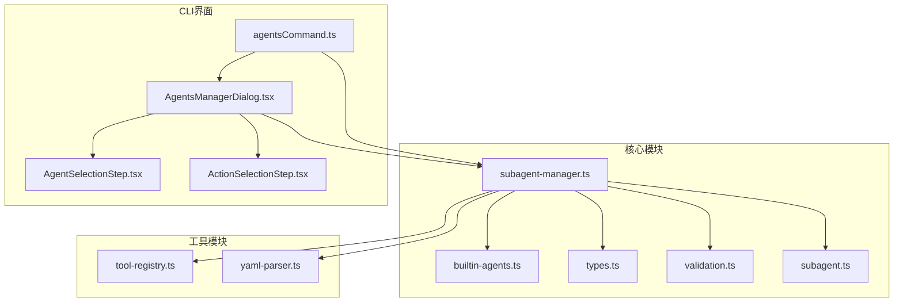
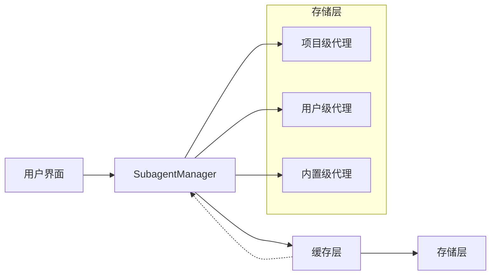
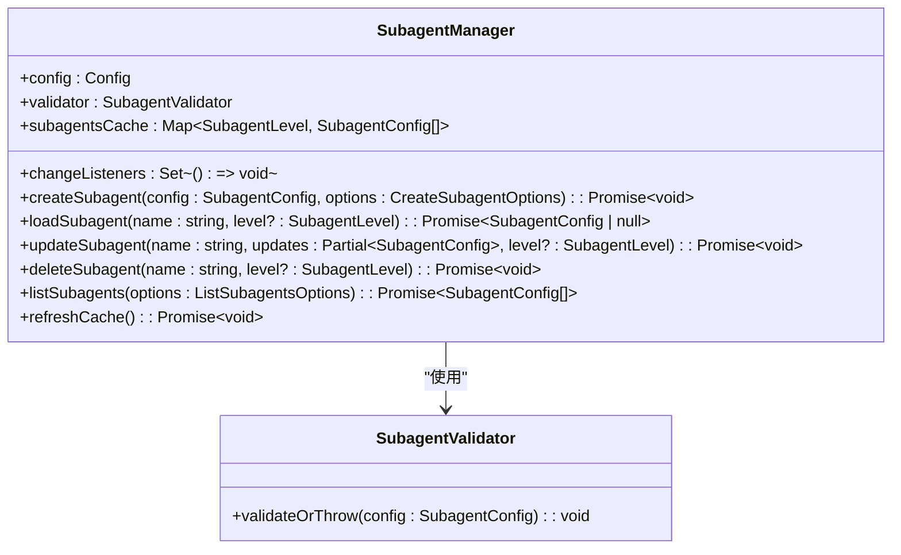
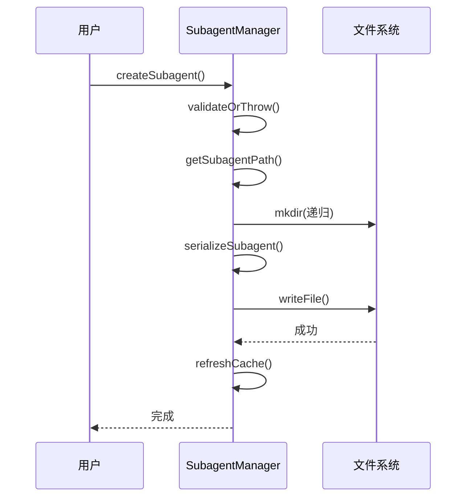
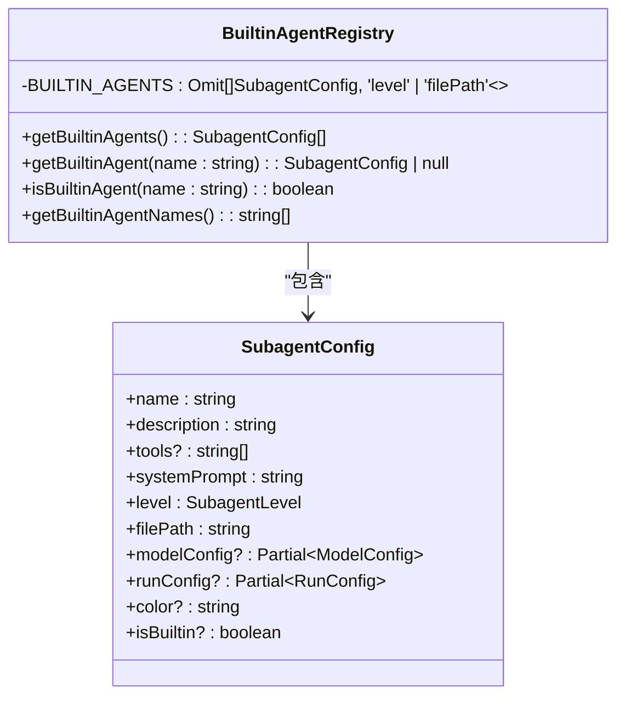
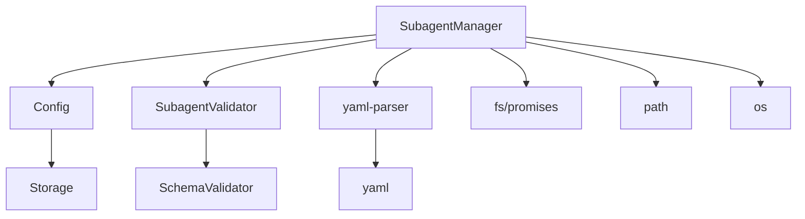

# 代理管理

<cite>
**本文档引用的文件**
- [subagent-manager.ts](file://packages/core/src/subagents/subagent-manager.ts)
- [builtin-agents.ts](file://packages/core/src/subagents/builtin-agents.ts)
- [types.ts](file://packages/core/src/subagents/types.ts)
- [agentsCommand.ts](file://packages/cli/src/ui/commands/agentsCommand.ts)
- [AgentsManagerDialog.tsx](file://packages/cli/src/ui/components/subagents/manage/AgentsManagerDialog.tsx)
- [validation.ts](file://packages/core/src/subagents/validation.ts)
- [yaml-parser.ts](file://packages/core/src/utils/yaml-parser.ts)
</cite>

## 目录
1. [简介](#简介)
2. [项目结构](#项目结构)
3. [核心组件](#核心组件)
4. [架构概述](#架构概述)
5. [详细组件分析](#详细组件分析)
6. [依赖分析](#依赖分析)
7. [性能考虑](#性能考虑)
8. [故障排除指南](#故障排除指南)
9. [结论](#结论)

## 简介
qwen-code代理管理系统提供了一套完整的子代理生命周期管理功能，允许用户创建、加载、更新和删除自定义代理。系统通过SubagentManager类实现核心管理功能，支持多层级存储（项目级、用户级、内置级）和优先级解析机制。内置代理（builtin-agents）作为系统预定义的通用代理，为用户提供开箱即用的功能。系统采用YAML前端语法格式定义代理配置，并通过缓存机制优化代理查找性能。

## 项目结构
代理管理系统主要位于`packages/core/src/subagents`目录下，包含核心管理类、内置代理定义、类型定义和验证逻辑。命令行界面（CLI）组件位于`packages/cli/src/ui`目录下，提供用户交互界面。系统采用分层架构，将配置管理、验证、序列化等功能分离，确保代码的可维护性和扩展性。

**图源**
- [subagent-manager.ts](file://packages/core/src/subagents/subagent-manager.ts)
- [builtin-agents.ts](file://packages/core/src/subagents/builtin-agents.ts)
- [agentsCommand.ts](file://packages/cli/src/ui/commands/agentsCommand.ts)
- [AgentsManagerDialog.tsx](file://packages/cli/src/ui/components/subagents/manage/AgentsManagerDialog.tsx)

## 核心组件
SubagentManager类是代理管理系统的核心，负责管理子代理的全生命周期操作。该类提供创建、加载、更新和删除代理的API，支持多层级存储和优先级解析。内置代理通过BuiltinAgentRegistry类注册，确保系统始终提供基本功能。系统采用缓存机制优化代理查找性能，减少文件系统I/O操作。

**章节源**
- [subagent-manager.ts](file://packages/core/src/subagents/subagent-manager.ts#L44-L95)
- [builtin-agents.ts](file://packages/core/src/subagents/builtin-agents.ts#L17-L20)

## 架构概述
代理管理系统采用分层架构设计，上层为用户界面，中层为管理逻辑，底层为数据存储。SubagentManager类作为中间层，协调界面操作与数据存储之间的交互。系统支持三种存储级别：项目级（project）、用户级（user）和内置级（builtin），并按照优先级顺序解析代理配置。

**图源**
- [subagent-manager.ts](file://packages/core/src/subagents/subagent-manager.ts#L313-L358)
- [builtin-agents.ts](file://packages/core/src/subagents/builtin-agents.ts#L17-L20)

## 详细组件分析

### SubagentManager分析
SubagentManager类实现了子代理的全生命周期管理功能，包括创建、加载、更新和删除操作。该类通过缓存机制优化性能，避免重复的文件系统读取操作。

#### 类图

**图源**
- [subagent-manager.ts](file://packages/core/src/subagents/subagent-manager.ts#L44-L144)
- [validation.ts](file://packages/core/src/subagents/validation.ts)

#### 代理创建流程

**图源**
- [subagent-manager.ts](file://packages/core/src/subagents/subagent-manager.ts#L44-L95)

### 内置代理注册机制
BuiltinAgentRegistry类负责管理内置代理的注册和查找。内置代理作为系统预定义的通用代理，提供基本功能支持。

#### 内置代理类图

**图源**
- [builtin-agents.ts](file://packages/core/src/subagents/builtin-agents.ts#L17-L20)

## 依赖分析
代理管理系统依赖多个核心模块，包括配置管理、工具注册、YAML解析等。这些模块协同工作，确保系统的稳定性和可扩展性。

**图源**
- [subagent-manager.ts](file://packages/core/src/subagents/subagent-manager.ts#L30-L35)
- [config.ts](file://packages/core/src/config/config.ts)

## 性能考虑
SubagentManager通过缓存机制显著提升代理查找性能。系统在首次加载时读取所有代理配置并缓存，后续操作直接从缓存中获取数据，避免重复的文件系统I/O操作。缓存会在创建、更新、删除代理时自动刷新，确保数据一致性。

## 故障排除指南
当代理管理出现问题时，可以检查以下常见情况：
1. 代理名称冲突：确保代理名称在指定级别唯一
2. 文件权限问题：检查代理配置文件的读写权限
3. YAML语法错误：验证代理配置的YAML语法正确性
4. 缓存不一致：尝试强制刷新缓存

**章节源**
- [subagent-manager.ts](file://packages/core/src/subagents/subagent-manager.ts#L747-L798)
- [validation.ts](file://packages/core/src/subagents/validation.ts)

## 结论
qwen-code代理管理系统通过SubagentManager类提供了完整的子代理生命周期管理功能。系统采用多层级存储和优先级解析机制，支持灵活的代理配置管理。内置代理提供开箱即用的基本功能，而缓存机制确保了高性能的代理查找操作。YAML前端语法格式使代理配置易于编写和维护，为用户提供了强大的自定义能力。