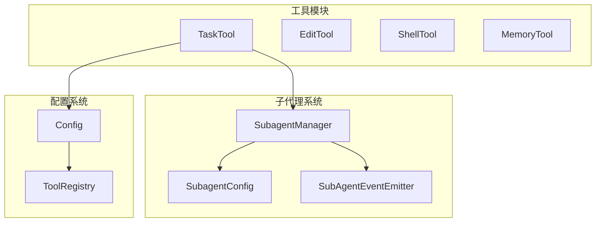
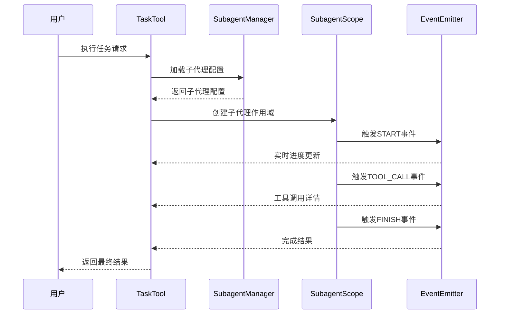
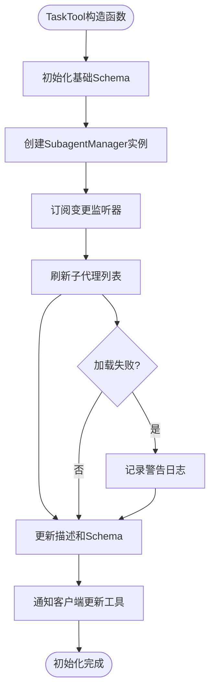
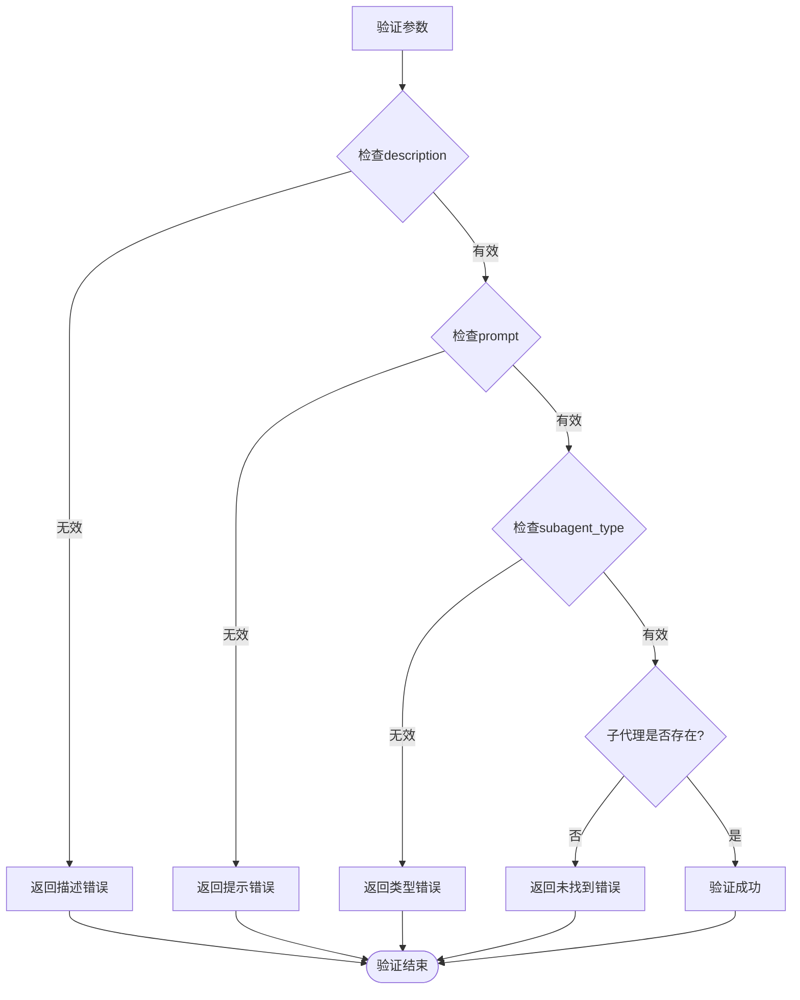
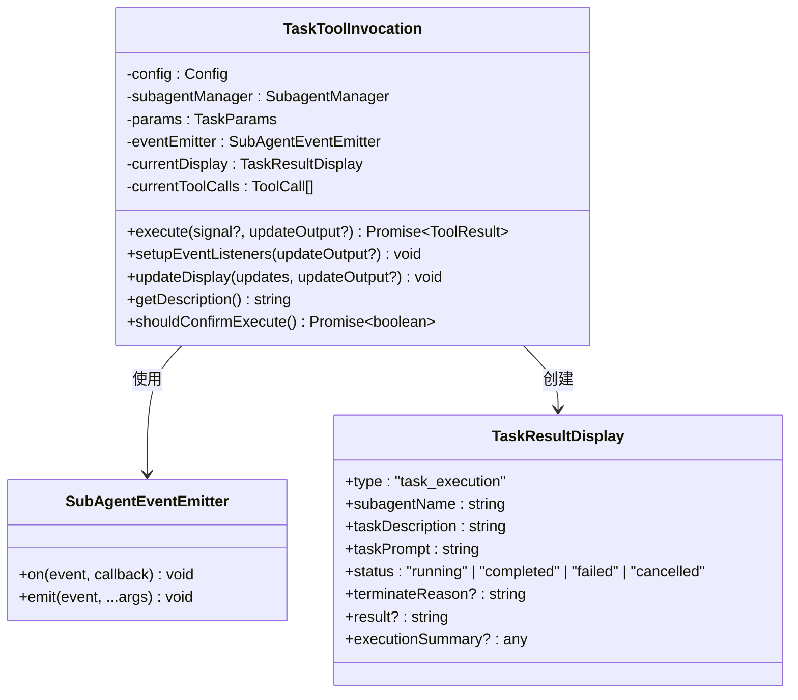
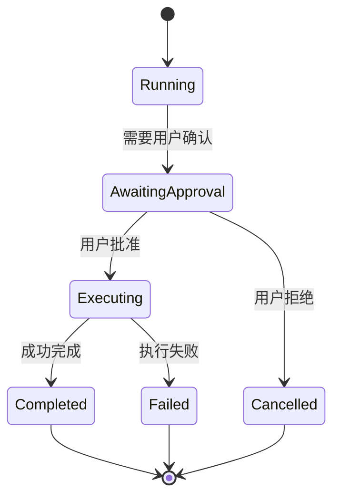
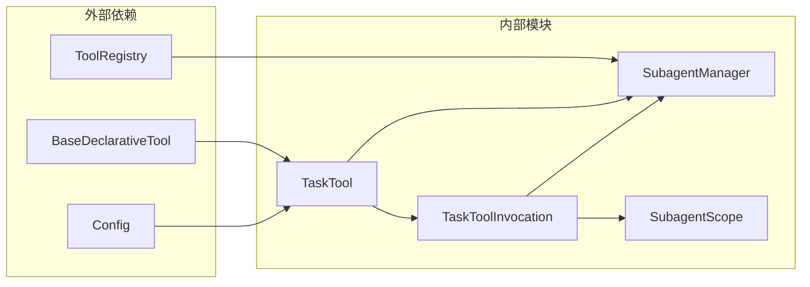

# 任务工具

<cite>
**本文档中引用的文件**
- [task.ts](file://packages/core/src/tools/task.ts)
- [task.test.ts](file://packages/core/src/tools/task.test.ts)
- [subagent-manager.ts](file://packages/core/src/subagents/subagent-manager.ts)
- [types.ts](file://packages/core/src/subagents/types.ts)
- [prompts.ts](file://packages/core/src/core/prompts.ts)
- [tool-names.ts](file://packages/core/src/tools/tool-names.ts)
</cite>

## 目录
1. [简介](#简介)
2. [项目结构](#项目结构)
3. [核心组件](#核心组件)
4. [架构概览](#架构概览)
5. [详细组件分析](#详细组件分析)
6. [依赖关系分析](#依赖关系分析)
7. [性能考虑](#性能考虑)
8. [故障排除指南](#故障排除指南)
9. [结论](#结论)

## 简介

TaskTool是qwen-code系统中的核心工作流自动化入口点，它作为主代理委托复杂任务给专门的子代理的桥梁。该工具通过动态加载可用的子代理并根据运行时状态实时更新其JSON Schema和描述信息，实现了高度灵活和可扩展的任务委派机制。

TaskTool的设计理念是将复杂的多步骤任务分解为可管理的子任务，每个子代理专注于特定领域的能力，如文件搜索、代码审查、构建系统操作等。这种架构不仅提高了系统的模块化程度，还增强了任务执行的可靠性和效率。

## 项目结构

TaskTool位于qwen-code项目的工具模块中，与其他核心工具协同工作：



**图表来源**
- [task.ts](file://packages/core/src/tools/task.ts#L1-L50)
- [subagent-manager.ts](file://packages/core/src/subagents/subagent-manager.ts#L1-L50)

**章节来源**
- [task.ts](file://packages/core/src/tools/task.ts#L1-L100)
- [subagent-manager.ts](file://packages/core/src/subagents/subagent-manager.ts#L1-L100)

## 核心组件

### TaskTool类

TaskTool继承自BaseDeclarativeTool，提供了声明式工具接口和动态参数验证功能：

```typescript
export interface TaskParams {
  description: string;
  prompt: string;
  subagent_type: string;
}
```

主要特性包括：
- **动态Schema生成**：根据可用子代理实时更新JSON Schema
- **参数验证**：确保所有必需参数都有效且子代理存在
- **异步初始化**：支持在运行时动态加载子代理配置
- **实时输出更新**：支持LiveOutput功能进行进度监控

### 子代理管理系统

SubagentManager负责管理所有可用的子代理配置，支持三种存储级别：

```typescript
export type SubagentLevel = 'project' | 'user' | 'builtin';
```

存储优先级：project > user > builtin

**章节来源**
- [task.ts](file://packages/core/src/tools/task.ts#L20-L100)
- [types.ts](file://packages/core/src/subagents/types.ts#L10-L50)

## 架构概览

TaskTool采用事件驱动的架构模式，通过SubAgentEventEmitter实现实时状态更新：



**图表来源**
- [task.ts](file://packages/core/src/tools/task.ts#L458-L539)
- [subagent-manager.ts](file://packages/core/src/subagents/subagent-manager.ts#L200-L300)

## 详细组件分析

### TaskTool初始化过程

TaskTool的初始化是一个异步过程，包含以下关键步骤：



**图表来源**
- [task.ts](file://packages/core/src/tools/task.ts#L40-L95)

### 参数验证机制

TaskTool实现了严格的参数验证逻辑：



**图表来源**
- [task.ts](file://packages/core/src/tools/task.ts#L220-L250)

### 子代理执行流程

TaskToolInvocation负责处理具体的子代理执行：



**图表来源**
- [task.ts](file://packages/core/src/tools/task.ts#L250-L350)

**章节来源**
- [task.ts](file://packages/core/src/tools/task.ts#L250-L564)

### 实时输出更新机制

TaskTool支持LiveOutput功能，通过事件驱动的方式实现实时状态更新：

```typescript
// 设置事件监听器
private setupEventListeners(updateOutput?: (output: ToolResultDisplay) => void): void {
  this.eventEmitter.on(SubAgentEventType.START, () => {
    this.updateDisplay({ status: 'running' }, updateOutput);
  });

  this.eventEmitter.on(SubAgentEventType.TOOL_CALL, (...args: unknown[]) => {
    const event = args[0] as SubAgentToolCallEvent;
    // 更新工具调用状态
  });

  this.eventEmitter.on(SubAgentEventType.FINISH, (...args: unknown[]) => {
    const event = args[0] as SubAgentFinishEvent;
    // 更新完成状态
  });
}
```

### 用户确认流程

TaskTool集成了用户确认机制，支持多种确认策略：



**章节来源**
- [task.ts](file://packages/core/src/tools/task.ts#L350-L450)

## 依赖关系分析

TaskTool与多个核心模块紧密耦合：



**图表来源**
- [task.ts](file://packages/core/src/tools/task.ts#L1-L20)
- [subagent-manager.ts](file://packages/core/src/subagents/subagent-manager.ts#L1-L30)

**章节来源**
- [task.ts](file://packages/core/src/tools/task.ts#L1-L50)
- [subagent-manager.ts](file://packages/core/src/subagents/subagent-manager.ts#L1-L50)

## 性能考虑

TaskTool在设计时充分考虑了性能优化：

1. **缓存机制**：SubagentManager使用Map缓存子代理配置，避免重复磁盘访问
2. **延迟加载**：子代理配置仅在需要时才加载，减少启动时间
3. **事件去抖**：实时更新通过事件系统实现，避免频繁的状态同步
4. **内存管理**：及时清理不再使用的子代理作用域和事件监听器

## 故障排除指南

### 常见问题及解决方案

1. **子代理未找到错误**
   - 检查子代理名称拼写
   - 验证子代理是否已正确配置
   - 确认子代理存储级别设置

2. **Schema更新失败**
   - 检查SubagentManager是否正常工作
   - 验证文件权限和路径配置
   - 查看控制台日志获取详细错误信息

3. **实时更新不生效**
   - 确认EventEmitter正确初始化
   - 检查updateOutput回调函数设置
   - 验证事件监听器注册状态

**章节来源**
- [task.ts](file://packages/core/src/tools/task.ts#L95-L135)
- [task.test.ts](file://packages/core/src/tools/task.test.ts#L136-L182)

## 结论

TaskTool作为qwen-code系统的工作流自动化核心组件，通过其动态子代理管理和实时状态更新机制，为复杂的多步骤任务执行提供了强大而灵活的解决方案。其模块化的架构设计不仅保证了系统的可维护性，也为未来的功能扩展奠定了坚实的基础。

通过合理的错误处理、性能优化和用户体验设计，TaskTool能够稳定可靠地处理各种复杂的软件工程任务，是qwen-code生态系统中不可或缺的重要组成部分。