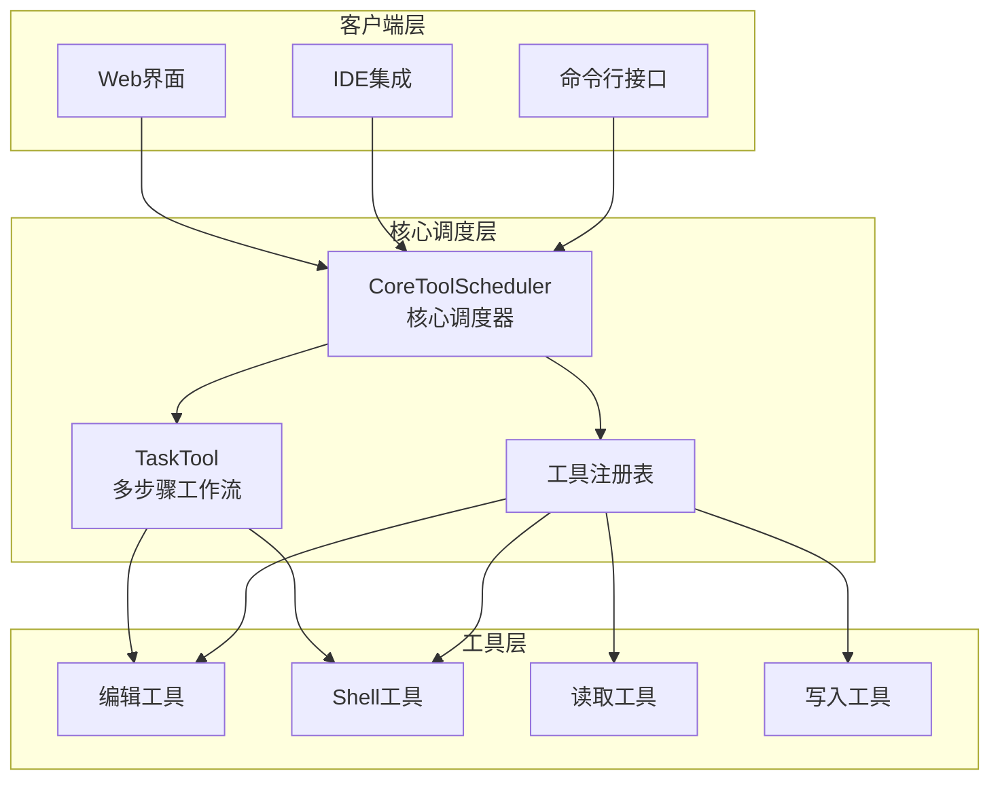
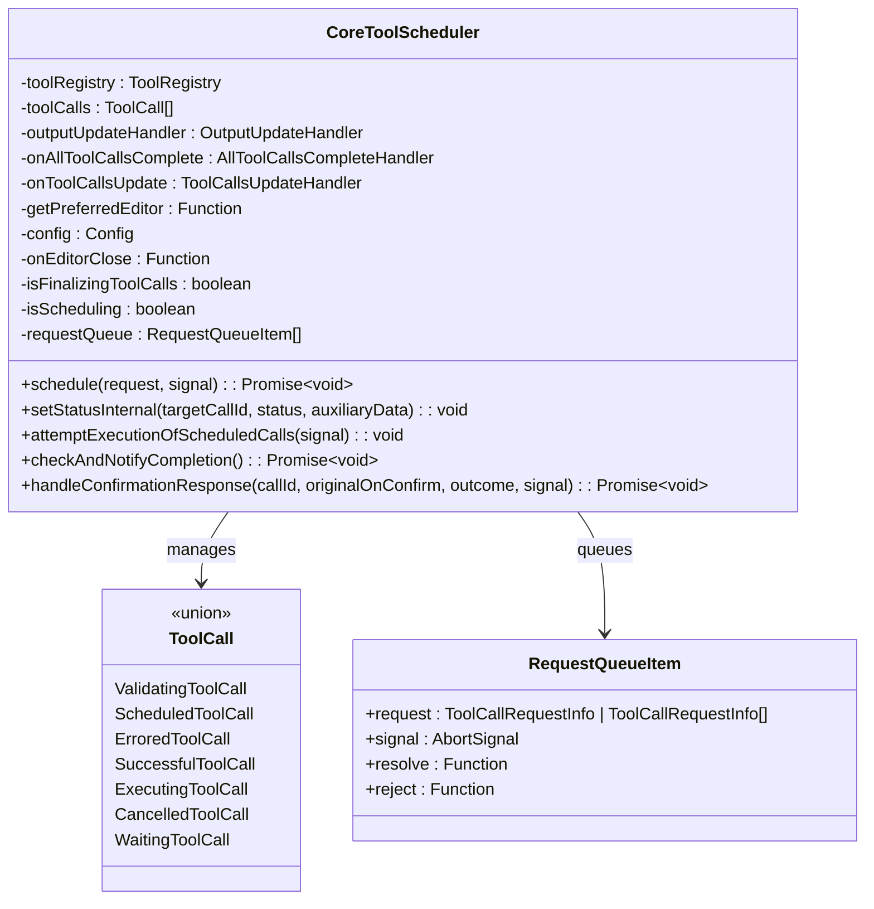
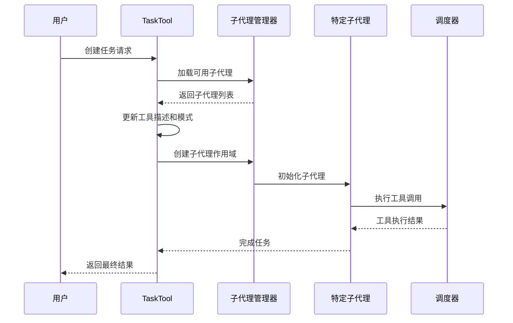
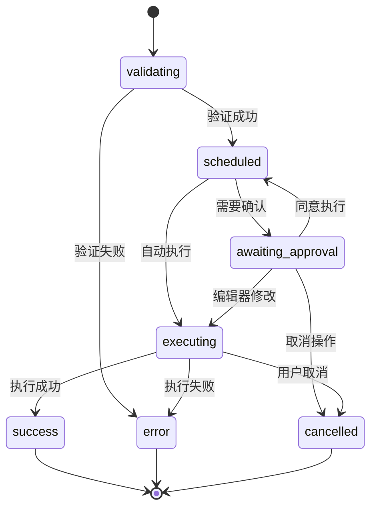
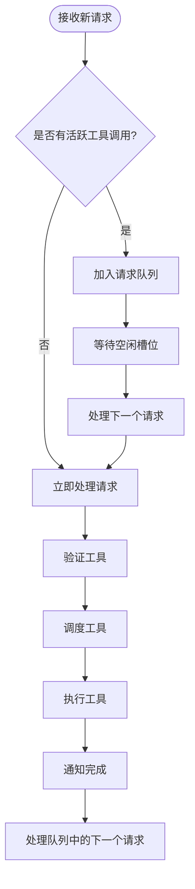
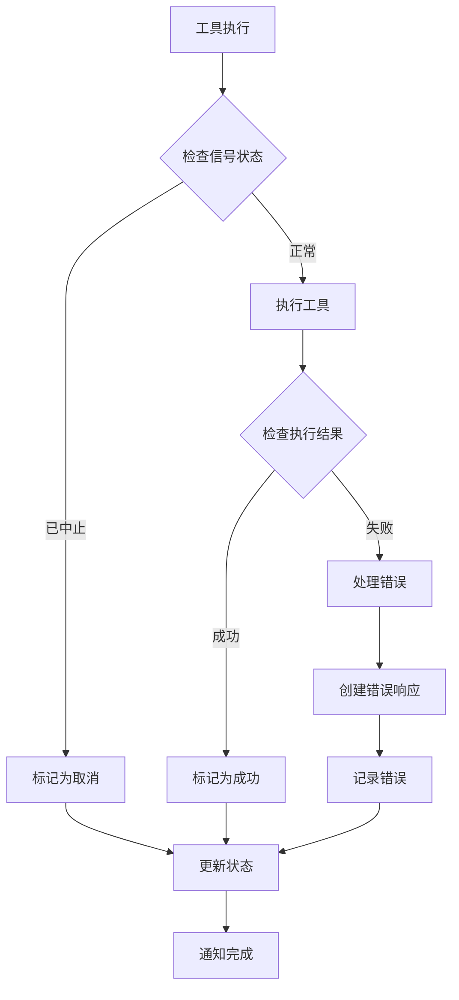
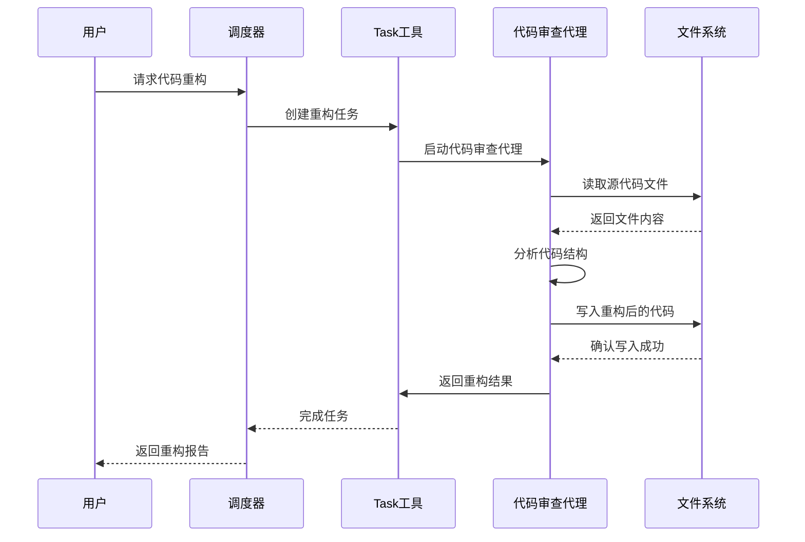

# 任务调度机制

<cite>
**本文档中引用的文件**
- [coreToolScheduler.ts](file://packages/core/src/core/coreToolScheduler.ts)
- [task.ts](file://packages/core/src/tools/task.ts)
- [coreToolScheduler.test.ts](file://packages/core/src/core/coreToolScheduler.test.ts)
- [task.test.ts](file://packages/core/src/tools/task.test.ts)
- [edit.test.ts](file://integration-tests/edit.test.ts)
- [shell-service.test.ts](file://integration-tests/shell-service.test.ts)
- [nonInteractiveCli.ts](file://packages/cli/src/nonInteractiveCli.ts)
- [CommandService.ts](file://packages/cli/src/services/CommandService.ts)
- [tool-names.ts](file://packages/core/src/tools/tool-names.ts)
- [prompts.ts](file://packages/core/src/core/prompts.ts)
</cite>

## 目录
1. [简介](#简介)
2. [项目结构概览](#项目结构概览)
3. [CoreToolScheduler 核心调度器](#coretoolscheduler-核心调度器)
4. [TaskTool 多步骤工作流](#tasktool-多步骤工作流)
5. [调度策略与状态管理](#调度策略与状态管理)
6. [异步请求批处理优化](#异步请求批处理优化)
7. [错误恢复与取消机制](#错误恢复与取消机制)
8. [实际案例分析](#实际案例分析)
9. [性能考虑](#性能考虑)
10. [故障排除指南](#故障排除指南)
11. [总结](#总结)

## 简介

qwen-code的任务调度机制是一个高度复杂的系统，负责协调工具调用的完整生命周期管理。该系统通过CoreToolScheduler类实现，提供了强大的任务调度、状态转换、异步处理和错误恢复功能。本文档将详细介绍这个调度系统的架构设计、实现原理和最佳实践。

## 项目结构概览



**图表来源**
- [coreToolScheduler.ts](file://packages/core/src/core/coreToolScheduler.ts#L255-L281)
- [task.ts](file://packages/core/src/tools/task.ts#L25-L50)

## CoreToolScheduler 核心调度器

CoreToolScheduler是整个任务调度系统的核心组件，负责管理工具调用的完整生命周期。

### 核心数据结构



**图表来源**
- [coreToolScheduler.ts](file://packages/core/src/core/coreToolScheduler.ts#L255-L281)
- [coreToolScheduler.ts](file://packages/core/src/core/coreToolScheduler.ts#L35-L100)

### 调度器初始化

调度器通过构造函数接收配置选项，包括工具注册表、回调函数和编辑器偏好设置：

```typescript
constructor(options: CoreToolSchedulerOptions) {
  this.config = options.config;
  this.toolRegistry = options.config.getToolRegistry();
  this.outputUpdateHandler = options.outputUpdateHandler;
  this.onAllToolCallsComplete = options.onAllToolCallsComplete;
  this.onToolCallsUpdate = options.onToolCallsUpdate;
  this.getPreferredEditor = options.getPreferredEditor;
  this.onEditorClose = options.onEditorClose;
}
```

**章节来源**
- [coreToolScheduler.ts](file://packages/core/src/core/coreToolScheduler.ts#L255-L281)

## TaskTool 多步骤工作流

TaskTool是专门设计用于处理复杂多步骤任务的工具，它能够委托给专门的子代理来完成复杂的任务。

### TaskTool 架构



**图表来源**
- [task.ts](file://packages/core/src/tools/task.ts#L243-L291)
- [task.ts](file://packages/core/src/tools/task.ts#L400-L450)

### 动态子代理支持

TaskTool具有动态加载子代理的能力，能够根据可用的子代理类型更新其描述和参数模式：

```typescript
async refreshSubagents(): Promise<void> {
  try {
    this.availableSubagents = await this.subagentManager.listSubagents();
    this.updateDescriptionAndSchema();
  } catch (error) {
    console.warn('Failed to load subagents for Task tool:', error);
    this.availableSubagents = [];
    this.updateDescriptionAndSchema();
  } finally {
    // 更新客户端的新工具
    const geminiClient = this.config.getGeminiClient();
    if (geminiClient) {
      await geminiClient.setTools();
    }
  }
}
```

**章节来源**
- [task.ts](file://packages/core/src/tools/task.ts#L70-L90)

## 调度策略与状态管理

### 工具调用状态转换

CoreToolScheduler实现了完整的状态机来管理工具调用的生命周期：



**图表来源**
- [coreToolScheduler.ts](file://packages/core/src/core/coreToolScheduler.ts#L35-L100)

### 状态转换机制

每个状态转换都通过`setStatusInternal`方法进行管理，确保状态的一致性和完整性：

```typescript
private setStatusInternal(
  targetCallId: string,
  newStatus: Status,
  auxiliaryData?: unknown,
): void {
  this.toolCalls = this.toolCalls.map((currentCall) => {
    if (
      currentCall.request.callId !== targetCallId ||
      currentCall.status === 'success' ||
      currentCall.status === 'error' ||
      currentCall.status === 'cancelled'
    ) {
      return currentCall;
    }
    
    // 根据新状态创建新的工具调用对象
    switch (newStatus) {
      case 'success':
        return {
          request: currentCall.request,
          tool: toolInstance,
          invocation,
          status: 'success',
          response: auxiliaryData as ToolCallResponseInfo,
          durationMs,
          outcome,
        } as SuccessfulToolCall;
      // ... 其他状态处理
    }
  });
  this.notifyToolCallsUpdate();
  this.checkAndNotifyCompletion();
}
```

**章节来源**
- [coreToolScheduler.ts](file://packages/core/src/core/coreToolScheduler.ts#L120-L250)

## 异步请求批处理优化

### 请求队列管理

CoreToolScheduler实现了智能的请求队列系统，支持并发请求的批处理：



**图表来源**
- [coreToolScheduler.ts](file://packages/core/src/core/coreToolScheduler.ts#L450-L500)

### 并发控制

调度器通过多个标志变量来控制并发行为：

```typescript
private isFinalizingToolCalls = false;
private isScheduling = false;

private isRunning(): boolean {
  return (
    this.isFinalizingToolCalls ||
    this.toolCalls.some(
      (call) =>
        call.status === 'executing' || call.status === 'awaiting_approval',
    )
  );
}
```

**章节来源**
- [coreToolScheduler.ts](file://packages/core/src/core/coreToolScheduler.ts#L280-L290)

## 错误恢复与取消机制

### 取消信号处理

调度器完全支持AbortSignal，允许外部取消正在进行的操作：

```typescript
schedule(
  request: ToolCallRequestInfo | ToolCallRequestInfo[],
  signal: AbortSignal,
): Promise<void> {
  if (this.isRunning() || this.isScheduling) {
    return new Promise((resolve, reject) => {
      const abortHandler = () => {
        // 从队列中移除请求
        const index = this.requestQueue.findIndex(
          (item) => item.request === request,
        );
        if (index > -1) {
          this.requestQueue.splice(index, 1);
          reject(new Error('Tool call cancelled while in queue.'));
        }
      };

      signal.addEventListener('abort', abortHandler, { once: true });

      this.requestQueue.push({
        request,
        signal,
        resolve: () => {
          signal.removeEventListener('abort', abortHandler);
          resolve();
        },
        reject: (reason?: Error) => {
          signal.removeEventListener('abort', abortHandler);
          reject(reason);
        },
      });
    });
  }
  return this._schedule(request, signal);
}
```

**章节来源**
- [coreToolScheduler.ts](file://packages/core/src/core/coreToolScheduler.ts#L450-L480)

### 错误处理策略

调度器实现了多层次的错误处理机制：



**图表来源**
- [coreToolScheduler.ts](file://packages/core/src/core/coreToolScheduler.ts#L850-L950)

### 自动重试和恢复

调度器支持自动重试机制，特别是在计划模式下的工具执行：

```typescript
private async autoApproveCompatiblePendingTools(
  signal: AbortSignal,
  triggeringCallId: string,
): Promise<void> {
  const pendingTools = this.toolCalls.filter(
    (call) =>
      call.status === 'awaiting_approval' &&
      call.request.callId !== triggeringCallId,
  ) as WaitingToolCall[];

  for (const pendingTool of pendingTools) {
    try {
      const stillNeedsConfirmation =
        await pendingTool.invocation.shouldConfirmExecute(signal);

      if (!stillNeedsConfirmation) {
        this.setToolCallOutcome(
          pendingTool.request.callId,
          ToolConfirmationOutcome.ProceedAlways,
        );
        this.setStatusInternal(pendingTool.request.callId, 'scheduled');
      }
    } catch (error) {
      console.error(
        `Error checking confirmation for tool ${pendingTool.request.callId}:`,
        error,
      );
    }
  }
}
```

**章节来源**
- [coreToolScheduler.ts](file://packages/core/src/core/coreToolScheduler.ts#L1000-L1050)

## 实际案例分析

### 代码重构任务示例

以下是一个典型的代码重构任务的调度执行流程：



**图表来源**
- [task.ts](file://packages/core/src/tools/task.ts#L400-L500)

### 编辑器集成示例

当需要用户确认编辑操作时，调度器会启动编辑器集成：

```typescript
// 在确认响应处理中
if (isModifiableDeclarativeTool(waitingToolCall.tool)) {
  const modifyContext = waitingToolCall.tool.getModifyContext(signal);
  const editorType = this.getPreferredEditor();
  
  if (!editorType) {
    return;
  }

  this.setStatusInternal(callId, 'awaiting_approval', {
    ...waitingToolCall.confirmationDetails,
    isModifying: true,
  } as ToolCallConfirmationDetails);

  const { updatedParams, updatedDiff } = await modifyWithEditor<
    typeof waitingToolCall.request.args
  >(
    waitingToolCall.request.args,
    modifyContext as ModifyContext<typeof waitingToolCall.request.args>,
    editorType,
    signal,
    this.onEditorClose,
  );
  
  this.setArgsInternal(callId, updatedParams);
  this.setStatusInternal(callId, 'awaiting_approval', {
    ...waitingToolCall.confirmationDetails,
    fileDiff: updatedDiff,
    isModifying: false,
  } as ToolCallConfirmationDetails);
}
```

**章节来源**
- [coreToolScheduler.ts](file://packages/core/src/core/coreToolScheduler.ts#L800-L850)

## 性能考虑

### 内存管理

调度器采用了多种策略来优化内存使用：

1. **状态压缩**：只保留必要的状态信息
2. **事件清理**：及时清理已完成的工具调用
3. **缓存策略**：对频繁访问的数据进行缓存

### 并发优化

1. **批量处理**：将多个工具调用合并为单个批次
2. **异步执行**：所有工具调用都是异步的
3. **资源池化**：复用昂贵的资源创建操作

### 响应时间优化

1. **即时状态更新**：实时更新工具调用状态
2. **增量进度报告**：提供渐进式的进度反馈
3. **预加载机制**：提前加载可能需要的工具

## 故障排除指南

### 常见问题诊断

#### 1. 工具调用超时

**症状**：工具调用长时间处于"executing"状态
**解决方案**：
- 检查AbortSignal是否正确传递
- 验证工具实现是否正确处理取消信号
- 查看日志中的详细错误信息

#### 2. 计划模式违规

**症状**：编辑工具在计划模式下被阻止
**解决方案**：
- 检查当前审批模式设置
- 使用`exit_plan_mode`工具退出计划模式
- 确认工具权限配置

#### 3. 请求队列阻塞

**症状**：新请求无法立即执行
**解决方案**：
- 检查是否有未完成的工具调用
- 清理已完成但未清理的状态
- 重启调度器实例

### 调试技巧

1. **启用调试模式**：设置`getDebugMode()`返回`true`
2. **监控状态变化**：监听`onToolCallsUpdate`回调
3. **检查工具注册**：验证工具是否正确注册到注册表
4. **验证配置**：确保所有必需的配置项都已正确设置

**章节来源**
- [coreToolScheduler.test.ts](file://packages/core/src/core/coreToolScheduler.test.ts#L1109-L1147)

## 总结

qwen-code的任务调度机制是一个设计精良、功能完备的系统，它通过CoreToolScheduler提供了强大的工具调用管理能力。该系统的主要优势包括：

1. **完整的生命周期管理**：从工具发现到结果返回的全流程管理
2. **灵活的状态转换**：支持多种状态之间的平滑转换
3. **强大的错误处理**：多层次的错误恢复和用户反馈机制
4. **高效的并发控制**：智能的请求队列和并发限制
5. **优秀的扩展性**：支持动态工具注册和子代理集成

通过TaskTool和CoreToolScheduler的协同工作，系统能够有效地处理复杂的多步骤任务，为用户提供流畅的开发体验。无论是简单的文件操作还是复杂的代码重构任务，该调度系统都能够可靠地执行并提供及时的反馈。