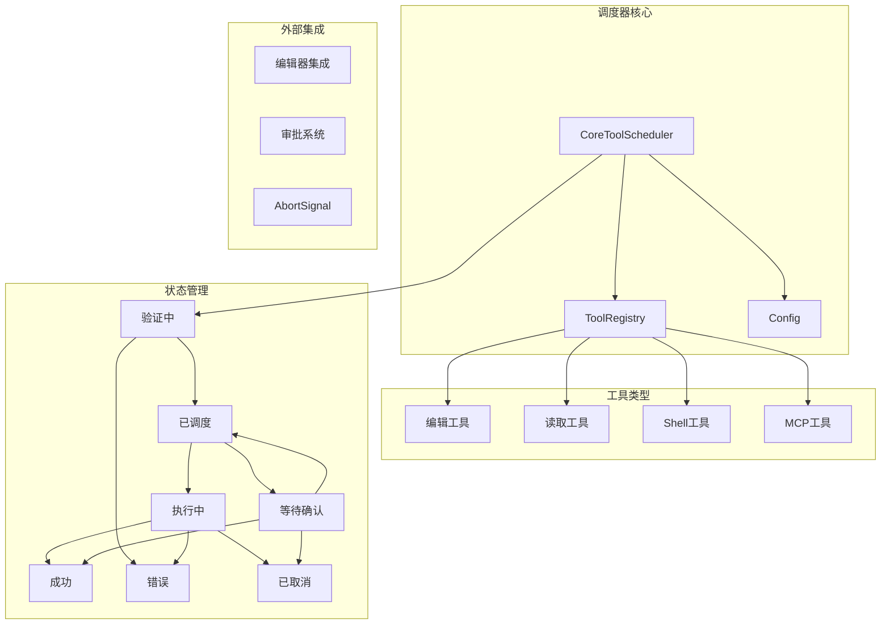
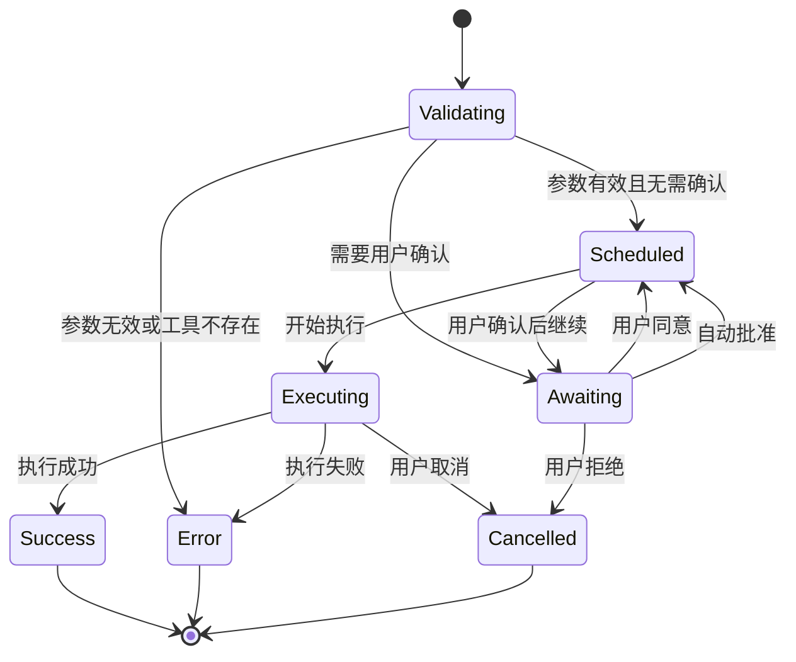

# 核心调度器 CoreToolScheduler

<cite>
**本文档中引用的文件**
- [coreToolScheduler.ts](file://packages/core/src/core/coreToolScheduler.ts)
- [coreToolScheduler.test.ts](file://packages/core/src/core/coreToolScheduler.test.ts)
- [config.ts](file://packages/core/src/config/config.ts)
- [tool-registry.ts](file://packages/core/src/tools/tool-registry.ts)
- [tools.ts](file://packages/core/src/tools/tools.ts)
- [edit.ts](file://packages/core/src/tools/edit.ts)
- [approvalModeCommand.ts](file://packages/cli/src/ui/commands/approvalModeCommand.ts)
</cite>

## 目录
1. [简介](#简介)
2. [架构概览](#架构概览)
3. [核心组件分析](#核心组件分析)
4. [状态机转换](#状态机转换)
5. [调度器功能详解](#调度器功能详解)
6. [信号量集成机制](#信号量集成机制)
7. [用户确认流程](#用户确认流程)
8. [性能优化策略](#性能优化策略)
9. [故障排除指南](#故障排除指南)
10. [总结](#总结)

## 简介

CoreToolScheduler 是 qwen-code 项目中的核心调度器，作为工具调用生命周期管理的中枢系统。它负责维护工具调用队列，实现复杂的状态机转换，并处理异步请求的批处理与优先级管理。该调度器确保所有工具调用都能得到适当的权限检查、用户确认和执行监控。

调度器的核心职责包括：
- 工具调用的生命周期管理
- 多工具并发调度与队列管理
- 用户确认流程协调
- 异步请求的取消机制
- 执行结果的回调通知
- 错误恢复与状态跟踪

## 架构概览

CoreToolScheduler 采用事件驱动的架构模式，通过状态机管理工具调用的完整生命周期。整个系统围绕工具调用的状态转换展开，支持多种工具类型和执行模式。



**图表来源**
- [coreToolScheduler.ts](file://packages/core/src/core/coreToolScheduler.ts#L255-L281)
- [tool-registry.ts](file://packages/core/src/tools/tool-registry.ts#L130-L150)

## 核心组件分析

### 调度器类结构

CoreToolScheduler 类是整个系统的核心，包含以下关键属性和方法：

```typescript
export class CoreToolScheduler {
  private toolRegistry: ToolRegistry;
  private toolCalls: ToolCall[] = [];
  private outputUpdateHandler?: OutputUpdateHandler;
  private onAllToolCallsComplete?: AllToolCallsCompleteHandler;
  private onToolCallsUpdate?: ToolCallsUpdateHandler;
  private getPreferredEditor: () => EditorType | undefined;
  private config: Config;
  private onEditorClose: () => void;
  private isFinalizingToolCalls = false;
  private isScheduling = false;
  private requestQueue: Array<{
    request: ToolCallRequestInfo | ToolCallRequestInfo[];
    signal: AbortSignal;
    resolve: () => void;
    reject: (reason?: Error) => void;
  }> = [];
}
```

### 工具调用状态类型

调度器定义了七种不同的工具调用状态：

```typescript
export type ToolCall =
  | ValidatingToolCall
  | ScheduledToolCall
  | ErroredToolCall
  | SuccessfulToolCall
  | ExecutingToolCall
  | CancelledToolCall
  | WaitingToolCall;
```

每种状态都有特定的数据结构和行为特征：

- **ValidatingToolCall**: 验证阶段，检查参数有效性
- **ScheduledToolCall**: 已调度，等待执行
- **ExecutingToolCall**: 正在执行，支持实时输出更新
- **WaitingToolCall**: 等待用户确认
- **SuccessfulToolCall**: 执行成功，返回结果
- **ErroredToolCall**: 执行失败，包含错误信息
- **CancelledToolCall**: 已取消，支持保留差异信息

**章节来源**
- [coreToolScheduler.ts](file://packages/core/src/core/coreToolScheduler.ts#L25-L100)
- [coreToolScheduler.ts](file://packages/core/src/core/coreToolScheduler.ts#L255-L281)

## 状态机转换

CoreToolScheduler 实现了一个复杂的有限状态机，用于管理工具调用的完整生命周期。状态转换遵循严格的规则，确保系统的稳定性和一致性。



**图表来源**
- [coreToolScheduler.ts](file://packages/core/src/core/coreToolScheduler.ts#L300-L450)

### 状态转换逻辑

状态转换通过 `setStatusInternal` 方法实现，该方法确保状态变更的一致性和完整性：

```typescript
private setStatusInternal(
  targetCallId: string,
  newStatus: Status,
  auxiliaryData?: unknown,
): void {
  this.toolCalls = this.toolCalls.map((currentCall) => {
    // 状态过滤逻辑
    if (
      currentCall.request.callId !== targetCallId ||
      currentCall.status === 'success' ||
      currentCall.status === 'error' ||
      currentCall.status === 'cancelled'
    ) {
      return currentCall;
    }
    
    // 状态转换逻辑
    switch (newStatus) {
      case 'success':
        // 成功状态转换
        return {
          request: currentCall.request,
          tool: toolInstance,
          invocation,
          status: 'success',
          response: auxiliaryData as ToolCallResponseInfo,
          durationMs,
          outcome,
        } as SuccessfulToolCall;
      // 其他状态转换...
    }
  });
  
  this.notifyToolCallsUpdate();
  this.checkAndNotifyCompletion();
}
```

**章节来源**
- [coreToolScheduler.ts](file://packages/core/src/core/coreToolScheduler.ts#L300-L450)

## 调度器功能详解

### 请求调度机制

调度器提供了灵活的请求调度机制，支持单个和批量工具调用：

```typescript
schedule(
  request: ToolCallRequestInfo | ToolCallRequestInfo[],
  signal: AbortSignal,
): Promise<void> {
  if (this.isRunning() || this.isScheduling) {
    return new Promise((resolve, reject) => {
      // 加入请求队列
      this.requestQueue.push({
        request,
        signal,
        resolve: () => resolve(),
        reject: (reason?: Error) => reject(reason),
      });
    });
  }
  return this._schedule(request, signal);
}
```

### 工具验证与注册

调度器通过工具注册表获取工具实例，并进行参数验证：

```typescript
private async _schedule(
  request: ToolCallRequestInfo | ToolCallRequestInfo[],
  signal: AbortSignal,
): Promise<void> {
  const requestsToProcess = Array.isArray(request) ? request : [request];
  
  const newToolCalls: ToolCall[] = requestsToProcess.map((reqInfo): ToolCall => {
    const toolInstance = this.toolRegistry.getTool(reqInfo.name);
    if (!toolInstance) {
      const suggestion = this.getToolSuggestion(reqInfo.name);
      const errorMessage = `Tool "${reqInfo.name}" not found in registry.${suggestion}`;
      return {
        status: 'error',
        request: reqInfo,
        response: createErrorResponse(reqInfo, new Error(errorMessage), ToolErrorType.TOOL_NOT_REGISTERED),
        durationMs: 0,
      };
    }
    
    // 参数验证和构建调用
    const invocationOrError = this.buildInvocation(toolInstance, reqInfo.args);
    if (invocationOrError instanceof Error) {
      return {
        status: 'error',
        request: reqInfo,
        tool: toolInstance,
        response: createErrorResponse(reqInfo, invocationOrError, ToolErrorType.INVALID_TOOL_PARAMS),
        durationMs: 0,
      };
    }
    
    return {
      status: 'validating',
      request: reqInfo,
      tool: toolInstance,
      invocation: invocationOrError,
      startTime: Date.now(),
    };
  });
}
```

### 批处理与优先级管理

调度器实现了智能的批处理机制，支持多个工具调用的同时处理：

```typescript
private attemptExecutionOfScheduledCalls(signal: AbortSignal): void {
  const allCallsFinalOrScheduled = this.toolCalls.every(
    (call) =>
      call.status === 'scheduled' ||
      call.status === 'cancelled' ||
      call.status === 'success' ||
      call.status === 'error',
  );

  if (allCallsFinalOrScheduled) {
    const callsToExecute = this.toolCalls.filter(
      (call) => call.status === 'scheduled',
    );

    callsToExecute.forEach((toolCall) => {
      if (toolCall.status !== 'scheduled') return;
      
      const { callId, name: toolName } = toolCall.request;
      const invocation = toolCall.invocation;
      this.setStatusInternal(callId, 'executing');

      // 执行工具调用
      invocation
        .execute(signal, liveOutputCallback)
        .then(async (toolResult: ToolResult) => {
          // 处理执行结果
        })
        .catch((executionError: Error) => {
          // 处理执行错误
        });
    });
  }
}
```

**章节来源**
- [coreToolScheduler.ts](file://packages/core/src/core/coreToolScheduler.ts#L500-L650)
- [coreToolScheduler.ts](file://packages/core/src/core/coreToolScheduler.ts#L850-L950)

## 信号量集成机制

CoreToolScheduler 与 AbortSignal 紧密集成，确保任务的可取消性。这种设计允许外部系统随时中断正在执行的工具调用。

### 取消机制实现

```typescript
// 在工具执行过程中检查取消信号
if (signal.aborted) {
  this.setStatusInternal(
    callId,
    'cancelled',
    'Tool call cancelled by user.',
  );
  return;
}

// 在状态转换时处理取消
if (outcome === ToolConfirmationOutcome.Cancel || signal.aborted) {
  this.setStatusInternal(
    callId,
    'cancelled',
    'User did not allow tool call',
  );
}
```

### 请求队列管理

调度器使用 AbortSignal 来管理请求队列中的任务：

```typescript
schedule(
  request: ToolCallRequestInfo | ToolCallRequestInfo[],
  signal: AbortSignal,
): Promise<void> {
  if (this.isRunning() || this.isScheduling) {
    return new Promise((resolve, reject) => {
      const abortHandler = () => {
        // 从队列中移除请求
        const index = this.requestQueue.findIndex(
          (item) => item.request === request,
        );
        if (index > -1) {
          this.requestQueue.splice(index, 1);
          reject(new Error('Tool call cancelled while in queue.'));
        }
      };

      signal.addEventListener('abort', abortHandler, { once: true });

      this.requestQueue.push({
        request,
        signal,
        resolve: () => {
          signal.removeEventListener('abort', abortHandler);
          resolve();
        },
        reject: (reason?: Error) => {
          signal.removeEventListener('abort', abortHandler);
          reject(reason);
        },
      });
    });
  }
  return this._schedule(request, signal);
}
```

**章节来源**
- [coreToolScheduler.ts](file://packages/core/src/core/coreToolScheduler.ts#L500-L550)
- [coreToolScheduler.ts](file://packages/core/src/core/coreToolScheduler.ts#L950-L1000)

## 用户确认流程

CoreToolScheduler 实现了多层次的用户确认机制，确保工具调用的安全性和可控性。

### 审批模式系统

系统支持四种不同的审批模式：

```typescript
export enum ApprovalMode {
  PLAN = 'plan',
  DEFAULT = 'default',
  AUTO_EDIT = 'auto-edit',
  YOLO = 'yolo',
}
```

### 确认详情结构

```typescript
export type ToolCallConfirmationDetails =
  | ToolEditConfirmationDetails
  | ToolExecuteConfirmationDetails
  | ToolMcpConfirmationDetails
  | ToolInfoConfirmationDetails
  | ToolPlanConfirmationDetails;
```

### 编辑工具确认流程

对于编辑类工具，调度器会生成详细的差异显示：

```typescript
async shouldConfirmExecute(
  _abortSignal: AbortSignal,
): Promise<ToolCallConfirmationDetails | false> {
  if (this.config.getApprovalMode() === ApprovalMode.AUTO_EDIT) {
    return false;
  }

  let editData: CalculatedEdit;
  try {
    editData = await this.calculateEdit(this.params);
  } catch (error) {
    return false;
  }

  if (editData.error) {
    return false;
  }

  const fileName = path.basename(this.params.file_path);
  const fileDiff = Diff.createPatch(
    fileName,
    editData.currentContent ?? '',
    editData.newContent,
    'Current',
    'Proposed',
    DEFAULT_DIFF_OPTIONS,
  );

  const confirmationDetails: ToolEditConfirmationDetails = {
    type: 'edit',
    title: `Confirm Edit: ${shortenPath(makeRelative(this.params.file_path, this.config.getTargetDir()))}`,
    fileName,
    filePath: this.params.file_path,
    fileDiff,
    originalContent: editData.currentContent,
    newContent: editData.newContent,
    onConfirm: async (outcome: ToolConfirmationOutcome) => {
      // 处理确认结果
    },
  };
  return confirmationDetails;
}
```

### 自动批准机制

调度器实现了自动批准兼容工具的功能：

```typescript
private async autoApproveCompatiblePendingTools(
  signal: AbortSignal,
  triggeringCallId: string,
): Promise<void> {
  const pendingTools = this.toolCalls.filter(
    (call) =>
      call.status === 'awaiting_approval' &&
      call.request.callId !== triggeringCallId,
  ) as WaitingToolCall[];

  for (const pendingTool of pendingTools) {
    try {
      const stillNeedsConfirmation =
        await pendingTool.invocation.shouldConfirmExecute(signal);

      if (!stillNeedsConfirmation) {
        this.setToolCallOutcome(
          pendingTool.request.callId,
          ToolConfirmationOutcome.ProceedAlways,
        );
        this.setStatusInternal(pendingTool.request.callId, 'scheduled');
      }
    } catch (error) {
      console.error(
        `Error checking confirmation for tool ${pendingTool.request.callId}:`,
        error,
      );
    }
  }
}
```

**章节来源**
- [coreToolScheduler.ts](file://packages/core/src/core/coreToolScheduler.ts#L700-L800)
- [edit.ts](file://packages/core/src/tools/edit.ts#L200-L300)

## 性能优化策略

### 内存管理

调度器采用了多种内存优化策略：

1. **延迟初始化**: 工具调用对象只在需要时创建
2. **状态压缩**: 终止状态的调用会被清理以释放内存
3. **缓存机制**: 工具注册表使用 Map 结构提高查找效率

### 并发控制

```typescript
private isRunning(): boolean {
  return (
    this.isFinalizingToolCalls ||
    this.toolCalls.some(
      (call) =>
        call.status === 'executing' || call.status === 'awaiting_approval',
    )
  );
}
```

### 批处理优化

调度器通过批处理减少系统开销：

```typescript
private attemptExecutionOfScheduledCalls(signal: AbortSignal): void {
  const allCallsFinalOrScheduled = this.toolCalls.every(
    (call) =>
      call.status === 'scheduled' ||
      call.status === 'cancelled' ||
      call.status === 'success' ||
      call.status === 'error',
  );

  if (allCallsFinalOrScheduled) {
    const callsToExecute = this.toolCalls.filter(
      (call) => call.status === 'scheduled',
    );

    // 批量执行所有就绪的调用
    callsToExecute.forEach((toolCall) => {
      // 执行逻辑...
    });
  }
}
```

### 队列管理优化

```typescript
// 智能队列管理
if (this.requestQueue.length > 0) {
  const next = this.requestQueue.shift()!;
  this._schedule(next.request, next.signal)
    .then(next.resolve)
    .catch(next.reject);
}
```

**章节来源**
- [coreToolScheduler.ts](file://packages/core/src/core/coreToolScheduler.ts#L450-L500)
- [coreToolScheduler.ts](file://packages/core/src/core/coreToolScheduler.ts#L850-L900)

## 故障排除指南

### 常见错误类型

调度器定义了多种错误类型来帮助诊断问题：

```typescript
export enum ToolErrorType {
  INVALID_TOOL_PARAMS = 'INVALID_TOOL_PARAMS',
  TOOL_NOT_REGISTERED = 'TOOL_NOT_REGISTERED',
  EXECUTION_FAILED = 'EXECUTION_FAILED',
  FILE_NOT_FOUND = 'FILE_NOT_FOUND',
  EDIT_NO_OCCURRENCE_FOUND = 'EDIT_NO_OCCURRENCE_FOUND',
  UNHANDLED_EXCEPTION = 'UNHANDLED_EXCEPTION',
}
```

### 错误处理机制

```typescript
private setStatusInternal(
  targetCallId: string,
  newStatus: Status,
  auxiliaryData?: unknown,
): void {
  // 状态转换逻辑
  switch (newStatus) {
    case 'error':
      const durationMs = existingStartTime
        ? Date.now() - existingStartTime
        : undefined;
      return {
        request: currentCall.request,
        status: 'error',
        tool: toolInstance,
        response: auxiliaryData as ToolCallResponseInfo,
        durationMs,
        outcome,
      } as ErroredToolCall;
    // 其他状态...
  }
}
```

### 调试工具

调度器提供了丰富的调试信息：

```typescript
// 获取工具建议
private getToolSuggestion(unknownToolName: string, topN = 3): string {
  const allToolNames = this.toolRegistry.getAllToolNames();
  const matches = allToolNames.map((toolName) => ({
    name: toolName,
    distance: levenshtein.get(unknownToolName, toolName),
  }));
  
  matches.sort((a, b) => a.distance - b.distance);
  // 返回最接近的工具名称建议
}
```

### 日志记录

```typescript
for (const call of completedCalls) {
  logToolCall(this.config, new ToolCallEvent(call));
}
```

**章节来源**
- [coreToolScheduler.ts](file://packages/core/src/core/coreToolScheduler.ts#L350-L400)
- [coreToolScheduler.ts](file://packages/core/src/core/coreToolScheduler.ts#L950-L1000)

## 总结

CoreToolScheduler 是 qwen-code 项目中的核心组件，它成功地实现了以下关键功能：

### 主要特性

1. **完整的生命周期管理**: 从工具验证到执行完成的全过程管理
2. **灵活的状态机**: 支持七种不同状态的平滑转换
3. **强大的并发控制**: 支持多工具并发执行和队列管理
4. **完善的错误处理**: 提供详细的错误信息和恢复机制
5. **用户友好的确认流程**: 支持多种审批模式和确认方式
6. **高效的性能优化**: 通过批处理和内存管理提升性能

### 技术亮点

- **事件驱动架构**: 基于状态机的事件驱动设计
- **信号量集成**: 完整的 AbortSignal 支持确保任务可取消性
- **模块化设计**: 清晰的职责分离和接口定义
- **扩展性强**: 支持新工具类型的无缝集成
- **安全可靠**: 多层次的权限检查和错误处理

### 应用场景

CoreToolScheduler 适用于各种需要工具调用管理的场景，包括但不限于：

- 代码编辑和修改
- 文件系统操作
- Shell 命令执行
- 第三方服务集成
- 自动化任务处理

通过其精心设计的架构和功能，CoreToolScheduler 为 qwen-code 项目提供了稳定、高效、安全的工具调用管理能力，是整个系统的核心支柱。