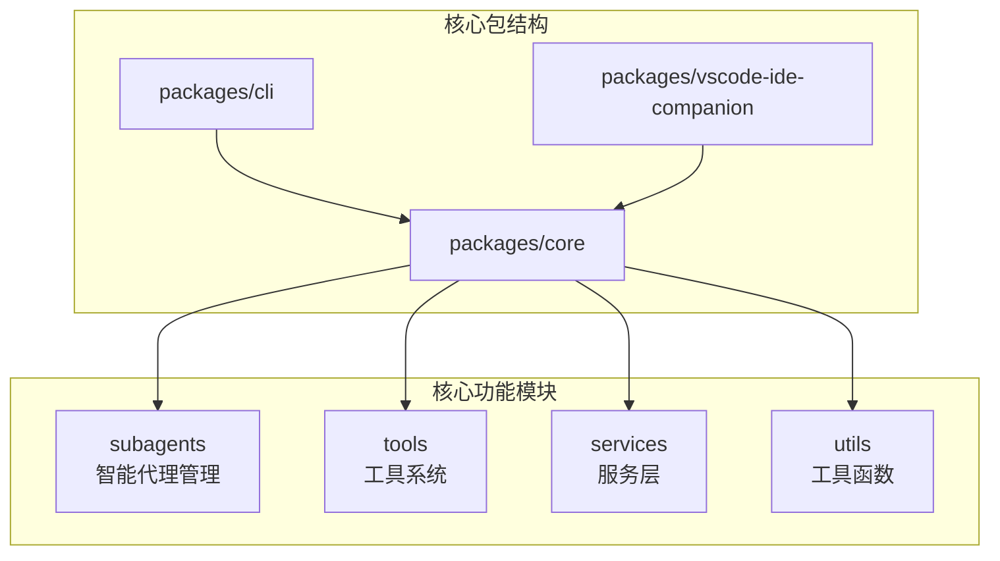
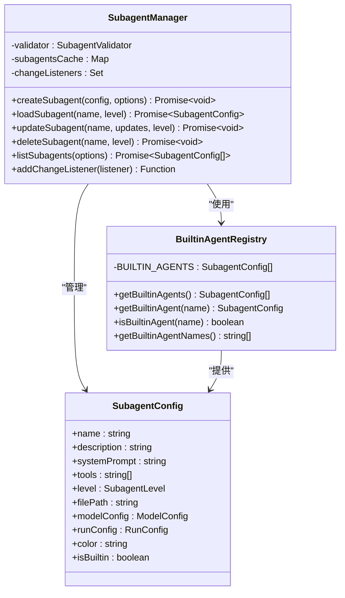
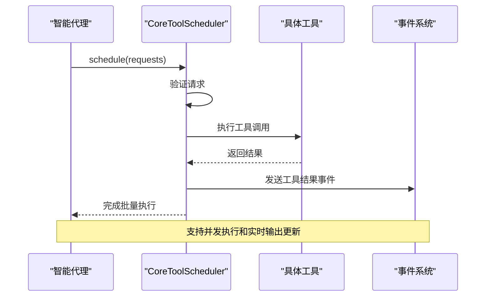
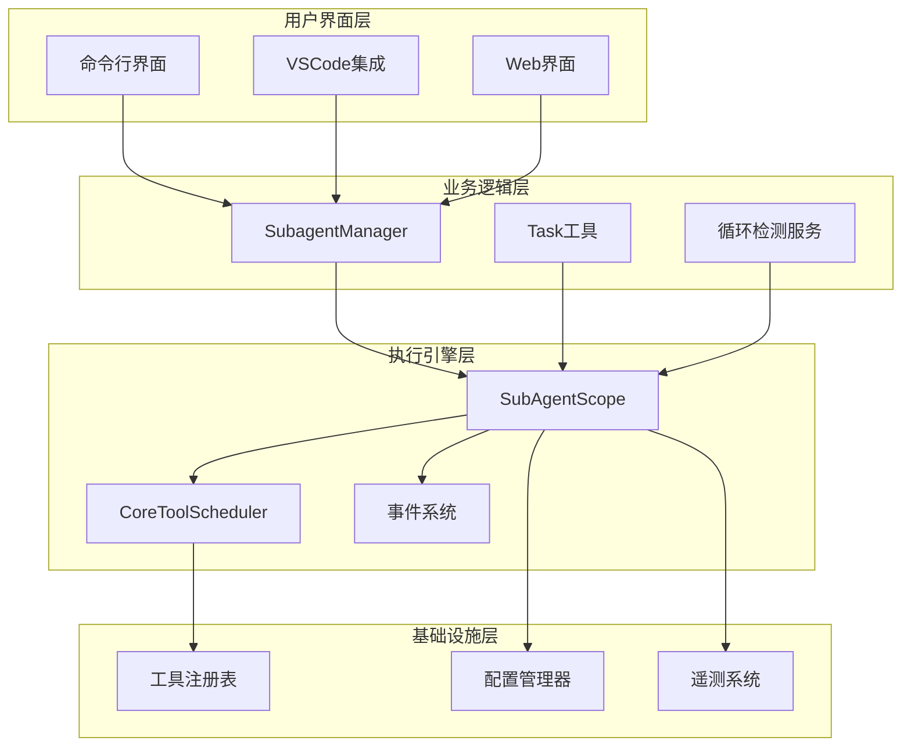
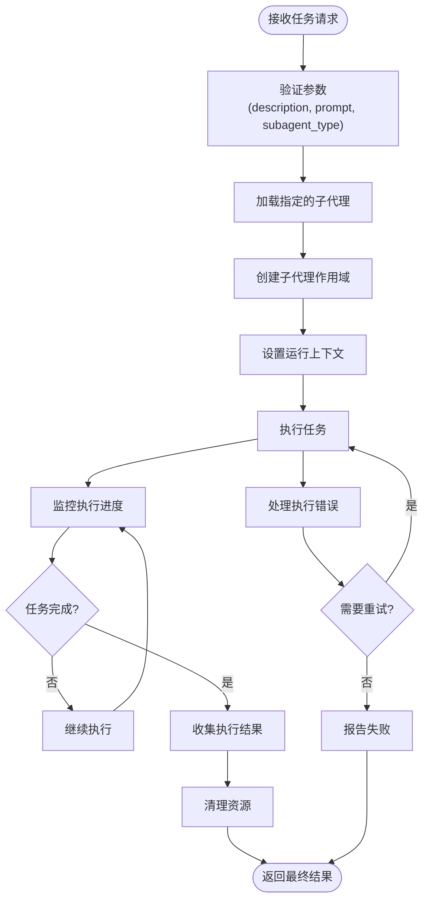
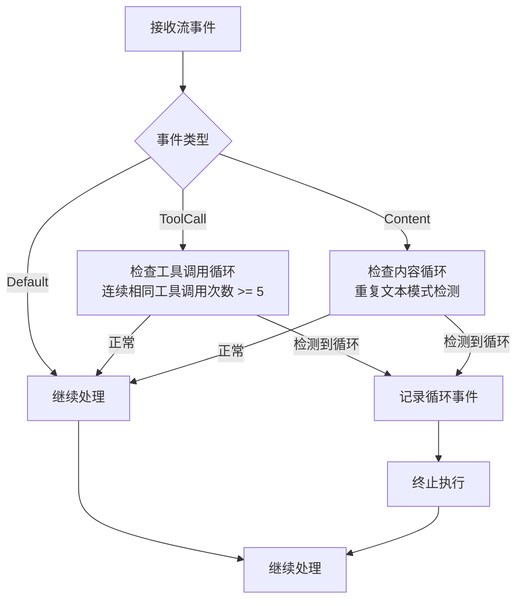
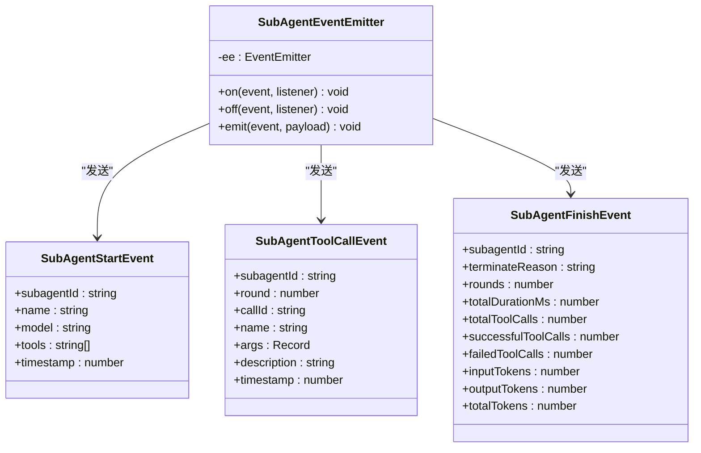
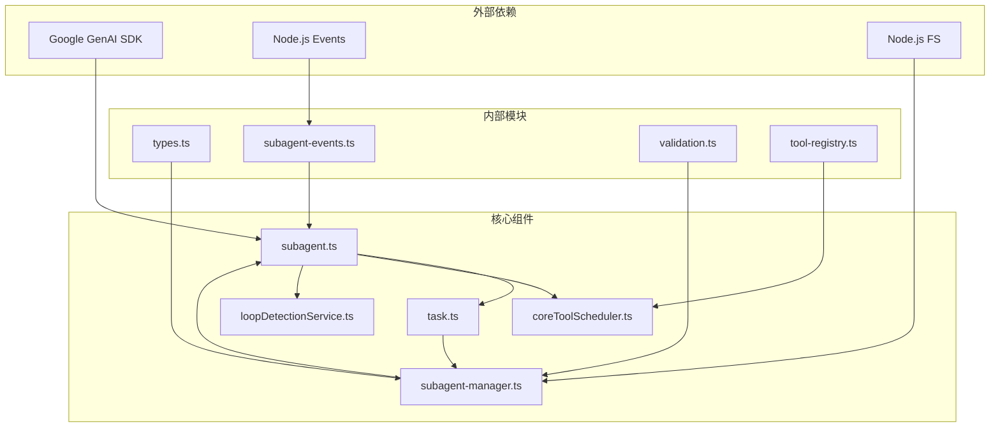

# 工作流自动化

<cite>
**本文档引用的文件**
- [builtin-agents.ts](file://packages/core/src/subagents/builtin-agents.ts)
- [subagent-manager.ts](file://packages/core/src/subagents/subagent-manager.ts)
- [subagent.ts](file://packages/core/src/subagents/subagent.ts)
- [task.ts](file://packages/core/src/tools/task.ts)
- [coreToolScheduler.ts](file://packages/core/src/core/coreToolScheduler.ts)
- [loopDetectionService.ts](file://packages/core/src/services/loopDetectionService.ts)
- [types.ts](file://packages/core/src/subagents/types.ts)
- [subagent-events.ts](file://packages/core/src/subagents/subagent-events.ts)
- [tools.ts](file://packages/core/src/tools/tools.ts)
- [task.yaml](file://integration-tests/terminal-bench/ci-tasks/hello-world/task.yaml)
- [task.yaml](file://integration-tests/terminal-bench/ci-tasks/swe-bench-astropy-1/task.yaml)
</cite>

## 目录
1. [简介](#简介)
2. [项目结构概览](#项目结构概览)
3. [核心组件分析](#核心组件分析)
4. [架构概览](#架构概览)
5. [详细组件分析](#详细组件分析)
6. [依赖关系分析](#依赖关系分析)
7. [性能考虑](#性能考虑)
8. [故障排除指南](#故障排除指南)
9. [结论](#结论)

## 简介

qwen-code是一个先进的AI驱动的代码助手平台，其工作流自动化功能通过subagent-manager协调多个智能代理执行复杂的开发任务。该系统的核心在于能够自动识别、调度和执行各种工具调用序列，确保任务执行的可靠性和可恢复性。

工作流自动化系统的主要特点包括：
- **多代理协调**：通过subagent-manager管理多个专门化的智能代理
- **内置代理支持**：提供预定义的通用代理用于复杂任务处理
- **工具调度器**：高效的coreToolScheduler负责管理工具调用序列
- **任务封装**：task工具封装和执行多步骤操作
- **循环检测**：loopDetectionService防止无限循环调用
- **可靠性保障**：完整的错误处理和性能监控机制

## 项目结构概览

qwen-code采用模块化架构设计，主要包含以下核心包：



**图表来源**
- [packages/core/src/index.ts](file://packages/core/src/index.ts)
- [packages/cli/src/index.ts](file://packages/cli/src/index.ts)

**章节来源**
- [packages/core/src/index.ts](file://packages/core/src/index.ts#L1-L50)
- [packages/cli/src/index.ts](file://packages/cli/src/index.ts#L1-L30)

## 核心组件分析

### subagent-manager - 智能代理协调器

subagent-manager是整个工作流自动化系统的核心协调器，负责管理不同级别的智能代理配置和生命周期。



**图表来源**
- [subagent-manager.ts](file://packages/core/src/subagents/subagent-manager.ts#L30-L100)
- [builtin-agents.ts](file://packages/core/src/subagents/builtin-agents.ts#L15-L50)
- [types.ts](file://packages/core/src/subagents/types.ts#L20-L80)

### builtin-agents - 预定义代理集合

builtin-agents提供了系统内置的通用代理，这些代理无法被修改或删除，为用户提供基础的智能代理能力。

```typescript
// 内置通用代理示例
{
  name: 'general-purpose',
  description: '通用代理，用于研究复杂问题、搜索代码和执行多步任务',
  systemPrompt: `你是一个通用的研究和代码分析代理...`
}
```

**章节来源**
- [builtin-agents.ts](file://packages/core/src/subagents/builtin-agents.ts#L15-L96)

### coreToolScheduler - 工具调度器

coreToolScheduler负责高效地调度和管理工具调用序列，确保工具执行的顺序性和可靠性。



**图表来源**
- [coreToolScheduler.ts](file://packages/core/src/core/coreToolScheduler.ts#L1-L100)
- [subagent.ts](file://packages/core/src/subagents/subagent.ts#L700-L800)

**章节来源**
- [coreToolScheduler.ts](file://packages/core/src/core/coreToolScheduler.ts#L1-L200)

## 架构概览

qwen-code工作流自动化系统采用分层架构设计，各组件之间通过明确定义的接口进行交互：



**图表来源**
- [subagent-manager.ts](file://packages/core/src/subagents/subagent-manager.ts#L1-L50)
- [subagent.ts](file://packages/core/src/subagents/subagent.ts#L1-L100)
- [coreToolScheduler.ts](file://packages/core/src/core/coreToolScheduler.ts#L1-L50)

## 详细组件分析

### Task工具 - 多步骤操作封装器

Task工具是工作流自动化的核心组件，它允许主代理将复杂任务委托给专门的子代理执行。



**图表来源**
- [task.ts](file://packages/core/src/tools/task.ts#L50-L150)
- [subagent.ts](file://packages/core/src/subagents/subagent.ts#L200-L300)

Task工具的关键特性：

1. **动态代理发现**：自动发现可用的子代理并更新工具描述
2. **并发执行**：支持同时启动多个子代理以提高性能
3. **状态管理**：维护任务执行的完整状态信息
4. **结果聚合**：收集所有子代理的结果并进行统一处理

**章节来源**
- [task.ts](file://packages/core/src/tools/task.ts#L1-L200)

### 循环检测服务 - 防止无限循环

loopDetectionService通过多种策略检测和防止AI响应中的无限循环：



**图表来源**
- [loopDetectionService.ts](file://packages/core/src/services/loopDetectionService.ts#L50-L150)

循环检测的关键机制：

1. **工具调用阈值检测**：连续相同工具调用超过5次视为循环
2. **内容重复检测**：分析流式内容中的重复模式
3. **LLM辅助检测**：在特定条件下使用LLM检测潜在循环
4. **实时终止**：一旦检测到循环立即终止执行

**章节来源**
- [loopDetectionService.ts](file://packages/core/src/services/loopDetectionService.ts#L1-L200)

### 事件系统 - 实时状态跟踪

事件系统提供完整的执行状态跟踪和实时通知机制：



**图表来源**
- [subagent-events.ts](file://packages/core/src/subagents/subagent-events.ts#L20-L80)

**章节来源**
- [subagent-events.ts](file://packages/core/src/subagents/subagent-events.ts#L1-L131)

## 依赖关系分析

工作流自动化系统的依赖关系呈现清晰的层次结构：



**图表来源**
- [subagent-manager.ts](file://packages/core/src/subagents/subagent-manager.ts#L1-L30)
- [subagent.ts](file://packages/core/src/subagents/subagent.ts#L1-L30)

**章节来源**
- [subagent-manager.ts](file://packages/core/src/subagents/subagent-manager.ts#L1-L50)
- [subagent.ts](file://packages/core/src/subagents/subagent.ts#L1-L50)

## 性能考虑

工作流自动化系统在设计时充分考虑了性能优化：

### 并发执行策略
- **批量工具调用**：支持同时执行多个工具调用
- **异步处理**：所有工具执行都是异步的，避免阻塞
- **资源池管理**：合理管理内存和计算资源

### 缓存机制
- **代理配置缓存**：避免重复读取代理配置文件
- **工具注册表缓存**：快速访问可用工具列表
- **统计信息缓存**：减少重复计算

### 监控和指标
- **执行时间监控**：跟踪每个步骤的执行时间
- **资源使用监控**：监控内存和CPU使用情况
- **成功率统计**：收集工具执行的成功率数据

## 故障排除指南

### 常见问题及解决方案

1. **代理加载失败**
   - 检查代理配置文件语法
   - 验证工具权限设置
   - 确认文件路径正确性

2. **工具调用超时**
   - 调整max_time_minutes配置
   - 检查网络连接状态
   - 优化工具参数设置

3. **循环检测误报**
   - 调整循环检测阈值
   - 检查工具逻辑是否存在真正循环
   - 使用更精确的内容过滤规则

4. **内存泄漏问题**
   - 及时清理事件监听器
   - 正确释放工具资源
   - 监控长期运行的代理实例

**章节来源**
- [loopDetectionService.ts](file://packages/core/src/services/loopDetectionService.ts#L100-L200)
- [subagent.ts](file://packages/core/src/subagents/subagent.ts#L800-L896)

## 结论

qwen-code的工作流自动化系统通过精心设计的架构和组件，实现了高效、可靠的智能代理协调和任务执行。系统的核心优势包括：

1. **模块化设计**：清晰的职责分离和接口定义
2. **可扩展性**：支持自定义代理和工具的添加
3. **可靠性保障**：完善的错误处理和循环检测机制
4. **性能优化**：并发执行和智能缓存策略
5. **可观测性**：完整的事件系统和监控指标

该系统为开发者提供了强大的自动化能力，能够处理复杂的开发任务，显著提升开发效率和代码质量。通过持续的优化和改进，工作流自动化系统将继续为用户提供更加智能和高效的开发体验。