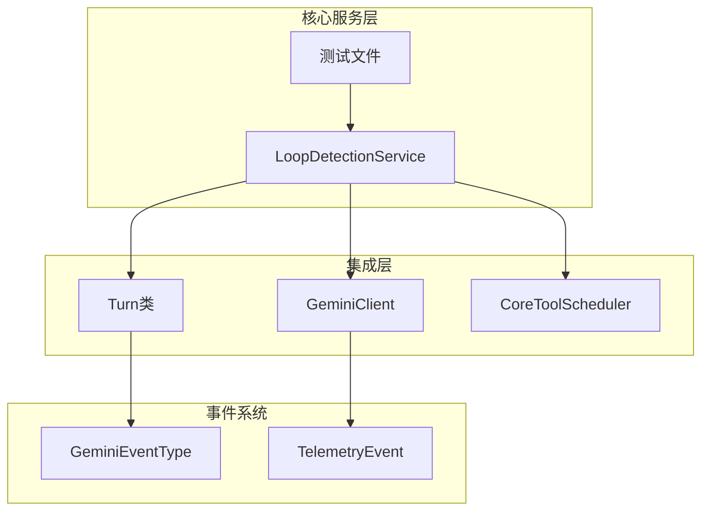
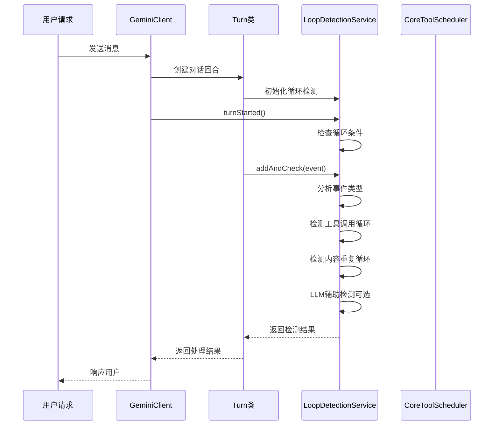
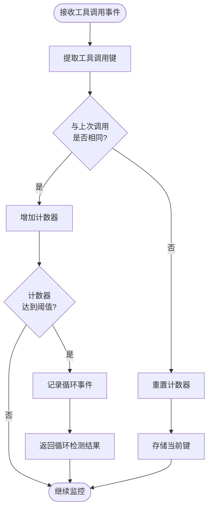
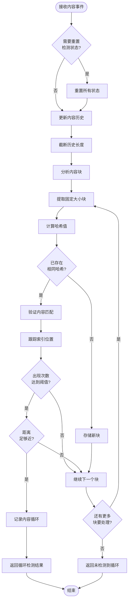
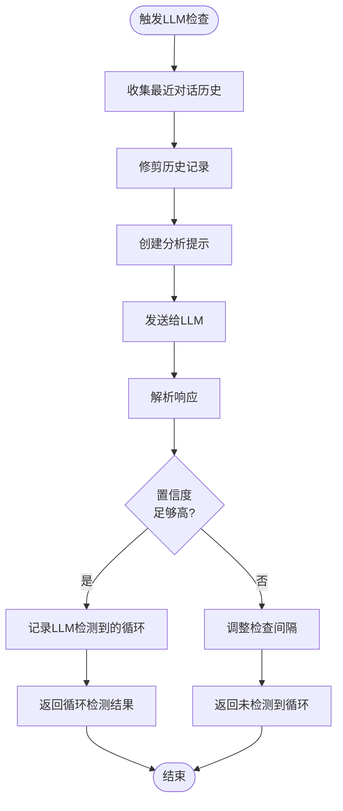
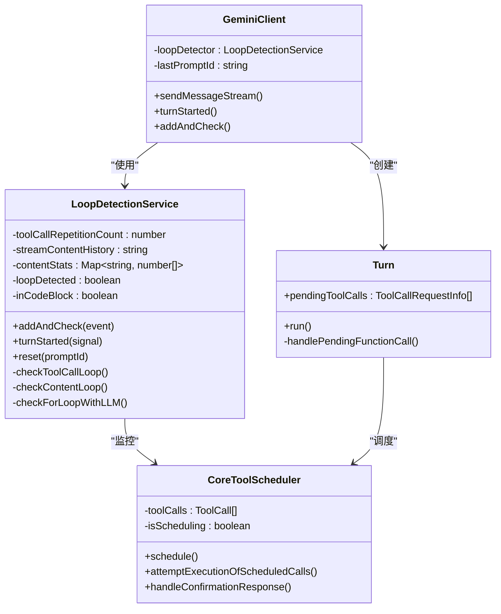
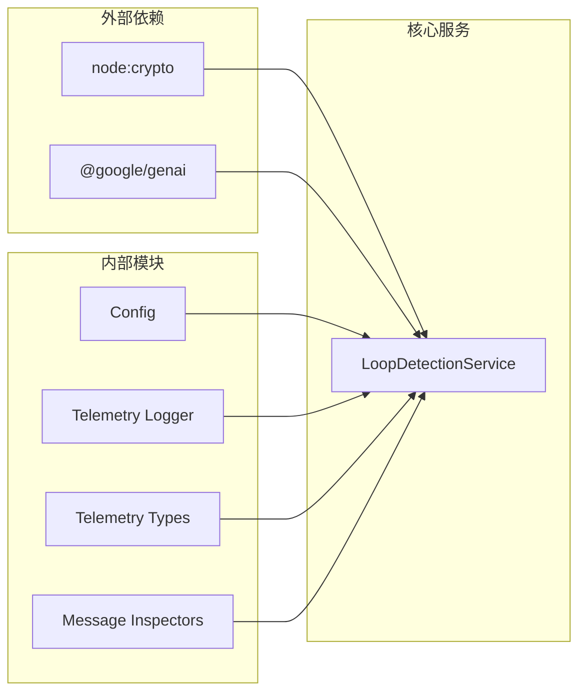

# 循环检测服务

<cite>
**本文档引用的文件**
- [loopDetectionService.ts](file://packages/core/src/services/loopDetectionService.ts)
- [loopDetectionService.test.ts](file://packages/core/src/services/loopDetectionService.test.ts)
- [turn.ts](file://packages/core/src/core/turn.ts)
- [types.ts](file://packages/core/src/telemetry/types.ts)
- [coreToolScheduler.ts](file://packages/core/src/core/coreToolScheduler.ts)
- [client.ts](file://packages/core/src/core/client.ts)
</cite>

## 目录
1. [简介](#简介)
2. [项目结构](#项目结构)
3. [核心组件](#核心组件)
4. [架构概览](#架构概览)
5. [详细组件分析](#详细组件分析)
6. [依赖关系分析](#依赖关系分析)
7. [性能考虑](#性能考虑)
8. [故障排除指南](#故障排除指南)
9. [结论](#结论)

## 简介

LoopDetectionService 是 qwen-code 项目中的一个关键安全组件，专门设计用于防止 AI 代理陷入无限调用循环。该服务通过监控工具调用序列和内容流来检测潜在的循环模式，并在发现循环时采取适当的措施来保护系统稳定性。

循环检测服务采用多层防护机制：
- **工具调用循环检测**：监控连续相同的工具调用
- **内容重复检测**：分析文本流中的重复模式
- **LLM辅助检测**：使用大语言模型识别认知循环
- **实时监控**：在不影响性能的前提下持续监控

## 项目结构

循环检测服务的核心文件组织如下：



**图表来源**
- [loopDetectionService.ts](file://packages/core/src/services/loopDetectionService.ts#L1-L459)
- [client.ts](file://packages/core/src/core/client.ts#L1-L1141)

## 核心组件

### LoopDetectionService 类

LoopDetectionService 是循环检测的核心实现类，负责以下功能：

- **工具调用跟踪**：监控连续相同的工具调用
- **内容流分析**：分析文本流中的重复模式
- **LLM辅助检测**：使用大语言模型识别复杂循环
- **状态管理**：维护检测状态和重置逻辑

### 关键常量配置

服务使用以下关键阈值和参数：

```typescript
const TOOL_CALL_LOOP_THRESHOLD = 5;        // 工具调用循环阈值
const CONTENT_LOOP_THRESHOLD = 10;         // 内容循环阈值
const CONTENT_CHUNK_SIZE = 50;             // 内容块大小
const MAX_HISTORY_LENGTH = 1000;           // 最大历史长度
const LLM_CHECK_AFTER_TURNS = 30;          // LLM检查触发轮数
```

**章节来源**
- [loopDetectionService.ts](file://packages/core/src/services/loopDetectionService.ts#L20-L35)

## 架构概览

循环检测服务在整个系统架构中的位置和交互关系：



**图表来源**
- [client.ts](file://packages/core/src/core/client.ts#L400-L450)
- [turn.ts](file://packages/core/src/core/turn.ts#L100-L200)

## 详细组件分析

### 工具调用循环检测

工具调用循环检测是基于哈希比较的简单而有效的机制：



**图表来源**
- [loopDetectionService.ts](file://packages/core/src/services/loopDetectionService.ts#L110-L130)

#### 实现细节

```typescript
private checkToolCallLoop(toolCall: { name: string; args: object }): boolean {
  const key = this.getToolCallKey(toolCall);
  if (this.lastToolCallKey === key) {
    this.toolCallRepetitionCount++;
  } else {
    this.lastToolCallKey = key;
    this.toolCallRepetitionCount = 1;
  }
  if (this.toolCallRepetitionCount >= TOOL_CALL_LOOP_THRESHOLD) {
    logLoopDetected(
      this.config,
      new LoopDetectedEvent(
        LoopType.CONSECUTIVE_IDENTICAL_TOOL_CALLS,
        this.promptId,
      ),
    );
    return true;
  }
  return false;
}
```

**章节来源**
- [loopDetectionService.ts](file://packages/core/src/services/loopDetectionService.ts#L110-L130)

### 内容重复循环检测

内容重复检测采用滑动窗口和哈希技术来识别文本中的重复模式：



**图表来源**
- [loopDetectionService.ts](file://packages/core/src/services/loopDetectionService.ts#L132-L200)

#### 核心算法实现

```typescript
private analyzeContentChunksForLoop(): boolean {
  while (this.hasMoreChunksToProcess()) {
    const currentChunk = this.streamContentHistory.substring(
      this.lastContentIndex,
      this.lastContentIndex + CONTENT_CHUNK_SIZE,
    );
    const chunkHash = createHash('sha256').update(currentChunk).digest('hex');

    if (this.isLoopDetectedForChunk(currentChunk, chunkHash)) {
      logLoopDetected(
        this.config,
        new LoopDetectedEvent(
          LoopType.CHANTING_IDENTICAL_SENTENCES,
          this.promptId,
        ),
      );
      return true;
    }

    this.lastContentIndex++;
  }
  return false;
}
```

**章节来源**
- [loopDetectionService.ts](file://packages/core/src/services/loopDetectionService.ts#L180-L200)

### LLM辅助循环检测

当传统检测方法无法确定循环时，服务会使用大语言模型进行高级分析：



**图表来源**
- [loopDetectionService.ts](file://packages/core/src/services/loopDetectionService.ts#L350-L420)

#### LLM检测提示模板

```typescript
const prompt = `You are a sophisticated AI diagnostic agent specializing in identifying when a conversational AI is stuck in an unproductive state. Your task is to analyze the provided conversation history and determine if the assistant has ceased to make meaningful progress...

An unproductive state is characterized by one or more of the following patterns over the last 5 or more assistant turns:

Repetitive Actions: The assistant repeats the same tool calls or conversational responses a decent number of times. This includes simple loops (e.g., tool_A, tool_A, tool_A) and alternating patterns (e.g., tool_A, tool_B, tool_A, tool_B, ...).

Cognitive Loop: The assistant seems unable to determine the next logical step. It might express confusion, repeatedly ask the same questions, or generate responses that don't logically follow from the previous turns, indicating it's stuck and not advancing the task.

Please analyze the conversation history to determine the possibility that the conversation is stuck in a repetitive, non-productive state.`;
```

**章节来源**
- [loopDetectionService.ts](file://packages/core/src/services/loopDetectionService.ts#L350-L420)

### 集成到核心调度流程

循环检测服务无缝集成到 qwen-code 的核心调度流程中：



**图表来源**
- [client.ts](file://packages/core/src/core/client.ts#L400-L450)
- [loopDetectionService.ts](file://packages/core/src/services/loopDetectionService.ts#L50-L100)

**章节来源**
- [client.ts](file://packages/core/src/core/client.ts#L400-L450)
- [coreToolScheduler.ts](file://packages/core/src/core/coreToolScheduler.ts#L1-L100)

## 依赖关系分析

循环检测服务的依赖关系图展示了其与其他组件的交互：



**图表来源**
- [loopDetectionService.ts](file://packages/core/src/services/loopDetectionService.ts#L1-L20)

**章节来源**
- [loopDetectionService.ts](file://packages/core/src/services/loopDetectionService.ts#L1-L20)

## 性能考虑

### 内存管理

循环检测服务采用了多种优化策略来确保高性能：

1. **历史长度限制**：最大历史长度为 1000 字符，防止内存无限增长
2. **滑动窗口算法**：使用固定大小的内容块进行分析
3. **哈希缓存**：利用哈希表快速查找重复内容
4. **及时清理**：定期清理过期的检测状态

### 计算效率

- **早期退出**：一旦检测到循环立即返回结果
- **增量分析**：只分析新增的内容块
- **智能重置**：根据内容类型智能重置检测状态
- **动态间隔**：根据 LLM 置信度动态调整检查频率

### 并发处理

服务设计支持并发操作：
- 多个对话可以同时运行
- 每个对话有独立的检测状态
- 无状态设计避免竞态条件

## 故障排除指南

### 常见问题及解决方案

#### 1. 循环检测误报

**症状**：正常操作被错误识别为循环
**原因**：代码块或表格等结构化内容触发了检测
**解决方案**：服务自动检测并重置这些内容类型的检测状态

#### 2. LLM检查延迟

**症状**：循环检测响应变慢
**原因**：LLM API 调用延迟或超时
**解决方案**：动态调整检查间隔，降低置信度要求

#### 3. 内存使用过高

**症状**：长时间运行后内存占用增加
**原因**：历史内容累积过多
**解决方案**：自动截断历史记录，保持最大长度

**章节来源**
- [loopDetectionService.ts](file://packages/core/src/services/loopDetectionService.ts#L200-L250)

### 调试技巧

1. **启用调试模式**：设置 `debugEnabled: true` 查看详细日志
2. **监控检测事件**：通过遥测系统观察循环检测事件
3. **分析历史记录**：检查内容历史以理解检测决策
4. **测试边界条件**：使用测试文件验证各种场景

## 结论

LoopDetectionService 是 qwen-code 项目中一个精心设计的安全组件，它通过多层次的检测机制有效防止 AI 代理陷入无限循环。该服务具有以下优势：

### 主要特性

1. **多层检测**：结合工具调用、内容重复和 LLM 辅助检测
2. **实时监控**：在不影响性能的前提下持续监控
3. **智能重置**：根据内容类型智能调整检测策略
4. **可扩展性**：模块化设计便于添加新的检测算法

### 技术创新

- **滑动窗口分析**：高效的重复模式检测算法
- **动态阈值**：根据上下文调整检测敏感度
- **LLM集成**：利用大语言模型识别复杂循环模式
- **状态管理**：优雅的状态重置和恢复机制

### 应用价值

循环检测服务不仅提高了系统的稳定性，还增强了用户体验。通过及时发现和阻止循环，系统能够：
- 避免资源浪费
- 提供更好的错误反馈
- 维护对话的连贯性
- 支持更复杂的 AI 交互场景

这个服务的设计体现了现代 AI 系统中安全性与功能性平衡的重要性，为构建可靠的 AI 应用提供了宝贵的参考。