# Qwen Code 核心功能

<cite>
**本文档中引用的文件**
- [README.md](file://README.md)
- [client.ts](file://packages/core/src/core/client.ts)
- [tools.ts](file://packages/core/src/tools/tools.ts)
- [subagent.ts](file://packages/core/src/subagents/subagent.ts)
- [edit.ts](file://packages/core/src/tools/edit.ts)
- [read-file.ts](file://packages/core/src/tools/read-file.ts)
- [config.ts](file://packages/core/src/config/config.ts)
- [qwenContentGenerator.ts](file://packages/core/src/qwen/qwenContentGenerator.ts)
- [imageTokenizer.ts](file://packages/core/src/utils/request-tokenizer/imageTokenizer.ts)
- [supportedImageFormats.ts](file://packages/core/src/utils/request-tokenizer/supportedImageFormats.ts)
</cite>

## 目录
1. [简介](#简介)
2. [项目架构概览](#项目架构概览)
3. [代码理解与编辑功能](#代码理解与编辑功能)
4. [工作流自动化](#工作流自动化)
5. [增强解析器](#增强解析器)
6. [视觉模型支持](#视觉模型支持)
7. [工具系统](#工具系统)
8. [配置管理](#配置管理)
9. [性能优化](#性能优化)
10. [故障排除指南](#故障排除指南)
11. [总结](#总结)

## 简介

Qwen Code 是一个强大的命令行 AI 工作流工具，专为开发者设计，基于 Qwen3-Coder 模型优化。它提供了先进的代码理解、自动化任务执行和智能辅助功能，显著提升了开发效率。

该工具的核心优势在于：
- **智能代码理解**：超越传统上下文窗口限制的大文件处理能力
- **跨文件上下文感知**：能够理解整个项目的结构和依赖关系
- **工作流自动化**：通过 subagents 和 tool scheduler 实现复杂开发任务的自动化
- **增强解析器**：专门优化的 Qwen-Coder 模型输出解析
- **视觉模型支持**：自动检测并处理图像输入的多模态分析

## 项目架构概览

Qwen Code 采用模块化架构设计，主要包含以下核心组件：

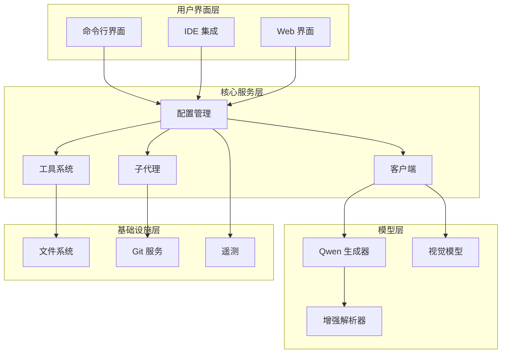

**图表来源**
- [client.ts](file://packages/core/src/core/client.ts#L1-L50)
- [config.ts](file://packages/core/src/config/config.ts#L1-L100)

## 代码理解与编辑功能

### 大文件处理能力

Qwen Code 的核心优势之一是其卓越的大文件处理能力。传统的语言模型通常有严格的上下文窗口限制，而 Qwen Code 通过创新的架构设计实现了真正的无边界代码理解。

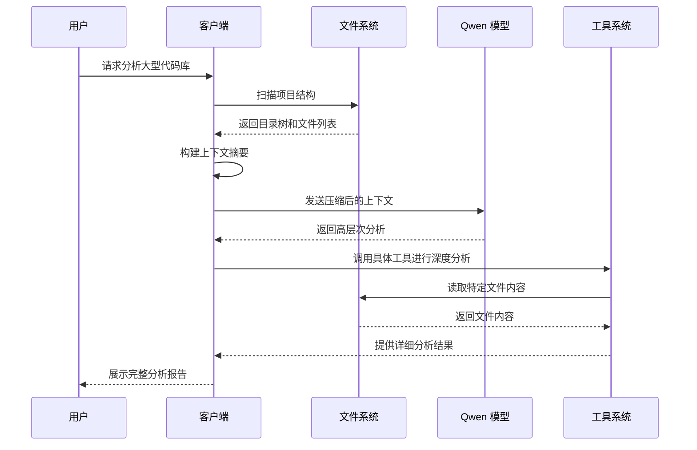

**图表来源**
- [client.ts](file://packages/core/src/core/client.ts#L200-L300)
- [read-file.ts](file://packages/core/src/tools/read-file.ts#L1-L50)

### 跨文件上下文感知

系统能够理解多个文件之间的相互关系，提供全局性的代码分析和修改建议：

```typescript
// 示例：跨文件上下文感知的工作流程
class CrossFileAnalyzer {
  async analyzeProjectStructure(projectPath: string) {
    const workspaceContext = new WorkspaceContext(projectPath);
    const files = await workspaceContext.discoverFiles();
    
    // 构建依赖图
    const dependencyGraph = await this.buildDependencyGraph(files);
    
    // 分析文件间关系
    const crossFileContext = await this.analyzeCrossFileDependencies(dependencyGraph);
    
    return crossFileContext;
  }
}
```

### 智能补全机制

Qwen Code 提供了先进的智能补全功能，支持多种编程语言和框架：

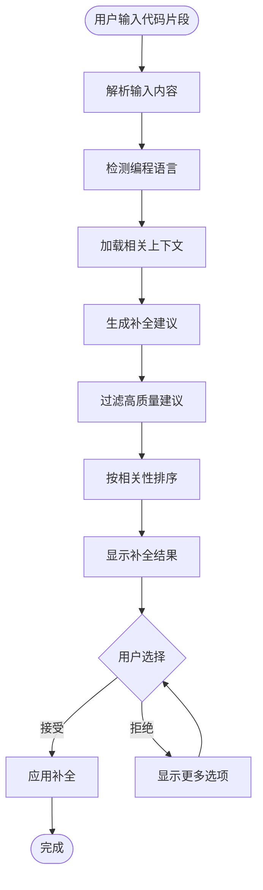

**图表来源**
- [client.ts](file://packages/core/src/core/client.ts#L600-L700)

**章节来源**
- [client.ts](file://packages/core/src/core/client.ts#L1-L800)
- [read-file.ts](file://packages/core/src/tools/read-file.ts#L1-L210)

## 工作流自动化

### Subagents 系统

Qwen Code 的工作流自动化核心是基于 subagents 的分布式任务执行系统。每个 subagent 可以独立执行特定的任务，同时与其他 agent 协作完成复杂的工作流。

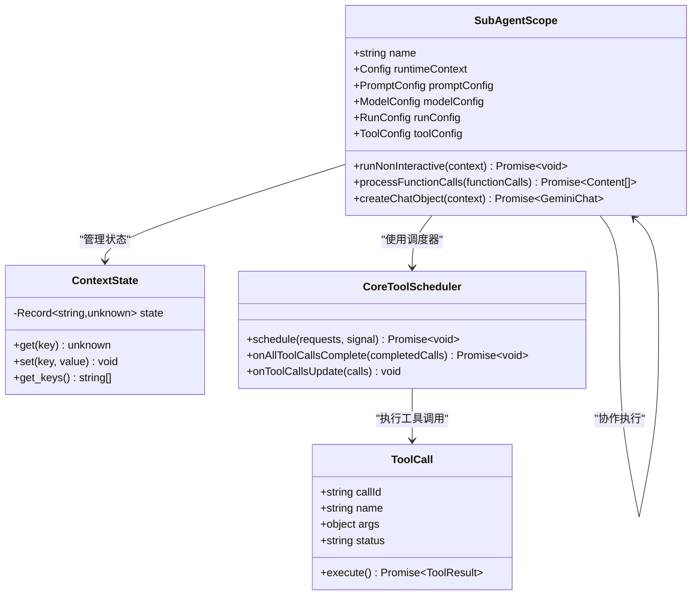

**图表来源**
- [subagent.ts](file://packages/core/src/subagents/subagent.ts#L100-L200)
- [subagent.ts](file://packages/core/src/subagents/subagent.ts#L300-L400)

### Tool Scheduler 实现

工具调度器负责协调多个工具的执行，确保任务的正确性和效率：

```typescript
// 示例：工具调度器的核心逻辑
class CoreToolScheduler {
  async schedule(requests: ToolCallRequestInfo[], signal: AbortSignal) {
    const batch = new Map<string, ToolCall>();
    
    // 创建工具调用对象
    for (const request of requests) {
      const tool = this.toolRegistry.getTool(request.name);
      const toolCall = new ToolCall(request, tool);
      batch.set(request.callId, toolCall);
    }
    
    // 并行执行所有工具调用
    const promises = Array.from(batch.values()).map(async (toolCall) => {
      try {
        const result = await toolCall.execute(signal);
        return { toolCall, result };
      } catch (error) {
        return { toolCall, error };
      }
    });
    
    const results = await Promise.all(promises);
    
    // 处理完成的工具调用
    await this.onAllToolCallsComplete(results);
  }
}
```

### 自动化工作流示例

以下是几个典型的工作流自动化场景：

1. **代码重构自动化**
```typescript
// 自动化重构工作流
const refactoringWorkflow = {
  name: '代码重构',
  steps: [
    {
      type: 'analyze',
      tool: 'read-file',
      params: { absolute_path: 'src/main.ts' }
    },
    {
      type: 'suggest',
      tool: 'qwen-analyzer',
      params: { analysis_type: 'refactoring' }
    },
    {
      type: 'execute',
      tool: 'edit',
      params: { file_path: 'src/main.ts', old_string: '...', new_string: '...' }
    }
  ]
};
```

2. **测试生成自动化**
```typescript
// 自动化测试生成工作流
const testGenerationWorkflow = {
  name: '测试生成',
  steps: [
    {
      type: 'analyze',
      tool: 'read-file',
      params: { absolute_path: 'src/service.ts' }
    },
    {
      type: 'generate',
      tool: 'qwen-test-generator',
      params: { target_file: 'src/service.ts' }
    },
    {
      type: 'verify',
      tool: 'shell',
      params: { command: 'npm test' }
    }
  ]
};
```

**章节来源**
- [subagent.ts](file://packages/core/src/subagents/subagent.ts#L1-L800)
- [tools.ts](file://packages/core/src/tools/tools.ts#L1-L200)

## 增强解析器

### Qwen-Coder 模型优化

Qwen Code 针对 Qwen-Coder 模型进行了专门的解析器优化，提高了输出质量和准确性：

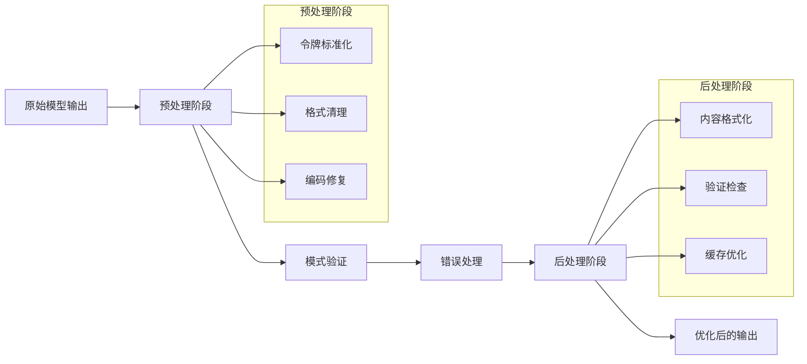

**图表来源**
- [qwenContentGenerator.ts](file://packages/core/src/qwen/qwenContentGenerator.ts#L1-L100)

### 输出质量优化

增强解析器通过以下技术提高输出质量：

1. **模式约束**：确保模型输出符合预期的数据结构
2. **错误恢复**：自动检测和修复常见的输出错误
3. **上下文保持**：维护对话历史的一致性
4. **性能优化**：减少重复计算和不必要的 API 调用

```typescript
// 示例：增强解析器的核心功能
class EnhancedContentGenerator {
  async generateContent(request: GenerateContentParameters, promptId: string) {
    try {
      // 应用模式约束
      const constrainedRequest = this.applySchemaConstraints(request);
      
      // 发送请求到模型
      const response = await this.sendToModel(constrainedRequest);
      
      // 解析和验证响应
      const parsedResponse = await this.parseAndValidate(response);
      
      // 后处理优化
      const optimizedResponse = this.optimizeOutput(parsedResponse);
      
      return optimizedResponse;
    } catch (error) {
      // 错误恢复机制
      return this.handleErrorAndRecover(error, request, promptId);
    }
  }
}
```

**章节来源**
- [qwenContentGenerator.ts](file://packages/core/src/qwen/qwenContentGenerator.ts#L1-L500)

## 视觉模型支持

### 图像输入检测

Qwen Code 具备自动检测图像输入的能力，并根据需要切换到视觉模型：

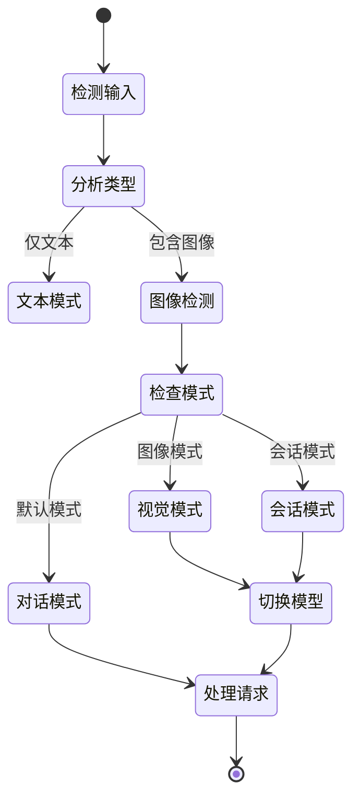

**图表来源**
- [imageTokenizer.ts](file://packages/core/src/utils/request-tokenizer/imageTokenizer.ts#L1-L50)

### 支持的图像格式

系统支持多种图像格式，确保广泛的兼容性：

```typescript
// 支持的图像格式定义
const SUPPORTED_IMAGE_MIME_TYPES = [
  'image/bmp',
  'image/jpeg',
  'image/jpg',
  'image/png',
  'image/tiff',
  'image/webp',
  'image/heic',
] as const;

// 图像元数据提取
class ImageTokenizer {
  async extractImageMetadata(base64Data: string, mimeType: string) {
    // 检查格式支持
    if (!isSupportedImageMimeType(mimeType)) {
      throw new Error(`不支持的图像格式: ${mimeType}`);
    }
    
    // 解码并提取尺寸信息
    const buffer = Buffer.from(base64Data, 'base64');
    const dimensions = await this.extractDimensions(buffer, mimeType);
    
    return {
      width: dimensions.width,
      height: dimensions.height,
      mimeType,
      dataSize: buffer.length,
    };
  }
}
```

### 多模态分析能力

当检测到图像时，系统会自动切换到视觉模型，提供多模态分析能力：

1. **代码截图分析**：识别和解释代码截图中的内容
2. **架构图理解**：分析架构图和设计图
3. **错误信息识别**：从屏幕截图中提取错误信息
4. **文档扫描**：处理扫描的文档和注释

**章节来源**
- [imageTokenizer.ts](file://packages/core/src/utils/request-tokenizer/imageTokenizer.ts#L1-L100)
- [supportedImageFormats.ts](file://packages/core/src/utils/request-tokenizer/supportedImageFormats.ts#L1-L55)

## 工具系统

### 核心工具架构

Qwen Code 提供了一个强大且灵活的工具系统，支持多种类型的文件操作和系统交互：

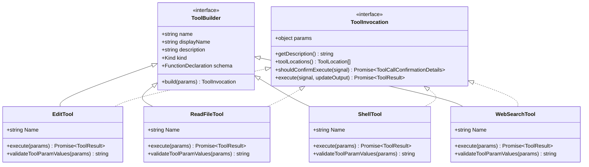

**图表来源**
- [tools.ts](file://packages/core/src/tools/tools.ts#L1-L100)
- [edit.ts](file://packages/core/src/tools/edit.ts#L1-L50)

### 编辑工具实现

编辑工具是最常用的工具之一，提供了安全可靠的文件修改功能：

```typescript
// 编辑工具的核心实现
class EditToolInvocation implements ToolInvocation<EditToolParams, ToolResult> {
  async execute(signal: AbortSignal): Promise<ToolResult> {
    // 计算编辑结果
    const calculatedEdit = await this.calculateEdit(this.params);
    
    if (calculatedEdit.error) {
      return {
        llmContent: calculatedEdit.error.raw,
        returnDisplay: `错误: ${calculatedEdit.error.display}`,
        error: {
          message: calculatedEdit.error.raw,
          type: calculatedEdit.error.type,
        },
      };
    }
    
    try {
      // 确保父目录存在
      this.ensureParentDirectoriesExist(this.params.file_path);
      
      // 写入新内容
      await this.config
        .getFileSystemService()
        .writeTextFile(this.params.file_path, calculatedEdit.newContent);
      
      // 生成差异统计
      const diffStat = getDiffStat(
        fileName,
        calculatedEdit.currentContent ?? '',
        originallyProposedContent,
        this.params.new_string,
      );
      
      return {
        llmContent: `成功修改文件: ${this.params.file_path} (${calculatedEdit.occurrences} 次替换).`,
        returnDisplay: {
          fileDiff: Diff.createPatch(/* ... */),
          fileName,
          originalContent: calculatedEdit.currentContent,
          newContent: calculatedEdit.newContent,
          diffStat,
        },
      };
    } catch (error) {
      return this.handleWriteError(error);
    }
  }
}
```

### 文件读取工具

文件读取工具支持大文件的分页读取和内容截断：

```typescript
// 文件读取工具的高级功能
class ReadFileTool {
  async execute(): Promise<ToolResult> {
    const result = await processSingleFileContent(
      this.params.absolute_path,
      this.config.getTargetDir(),
      this.config.getFileSystemService(),
      this.params.offset,
      this.params.limit,
    );
    
    if (result.error) {
      return this.createErrorResult(result);
    }
    
    // 处理截断情况
    if (result.isTruncated) {
      const [start, end] = result.linesShown!;
      const total = result.originalLineCount!;
      
      return {
        llmContent: `
重要提示: 文件内容已被截断。
状态: 显示第 ${start}-${end} 行，共 ${total} 行。
操作: 如需查看更多内容，请使用 'offset' 和 'limit' 参数进行后续 'read_file' 调用。
        `,
        returnDisplay: result.returnDisplay || '',
      };
    }
    
    return {
      llmContent: result.llmContent || '',
      returnDisplay: result.returnDisplay || '',
    };
  }
}
```

### Shell 工具集成

Shell 工具允许执行系统命令，支持沙箱环境和权限控制：

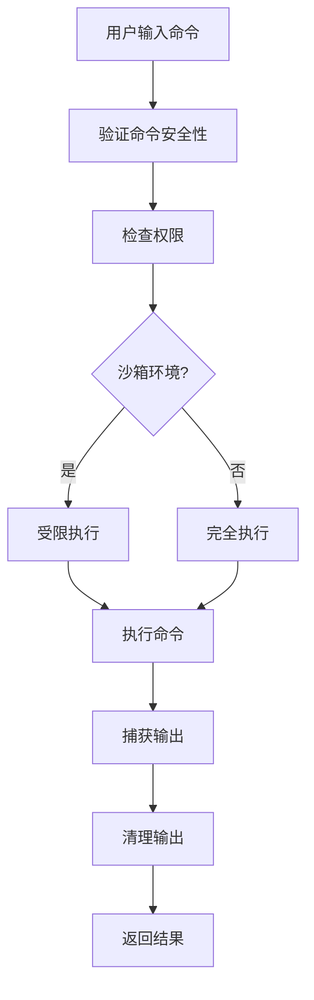

**图表来源**
- [edit.ts](file://packages/core/src/tools/edit.ts#L200-L300)

**章节来源**
- [tools.ts](file://packages/core/src/tools/tools.ts#L1-L200)
- [edit.ts](file://packages/core/src/tools/edit.ts#L1-L590)
- [read-file.ts](file://packages/core/src/tools/read-file.ts#L1-L210)

## 配置管理

### 配置系统架构

Qwen Code 使用集中式的配置管理系统，支持多种配置源和动态更新：

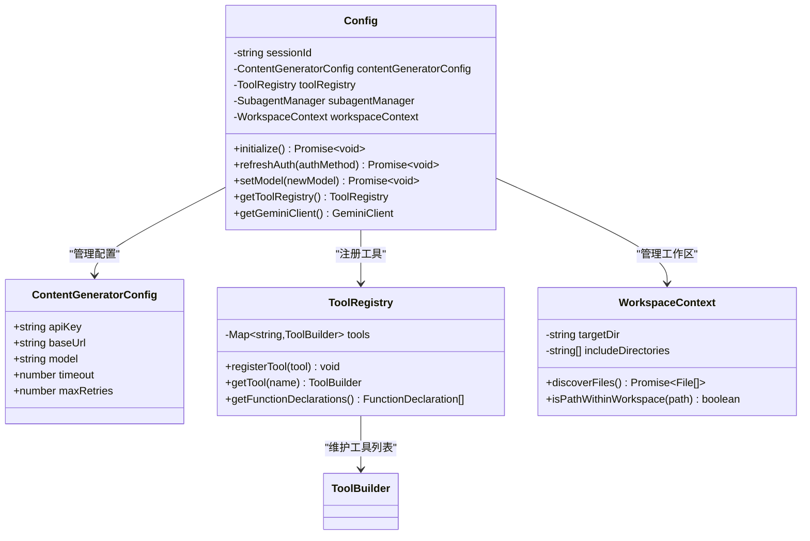

**图表来源**
- [config.ts](file://packages/core/src/config/config.ts#L100-L200)

### 动态模型切换

系统支持运行时动态切换模型，适应不同的使用场景：

```typescript
// 动态模型切换的实现
class Config {
  async setModel(newModel: string, options?: {
    reason?: ModelSwitchEvent['reason'];
    context?: string;
  }): Promise<void> {
    const oldModel = this.getModel();
    
    // 更新配置
    if (this.contentGeneratorConfig) {
      this.contentGeneratorConfig.model = newModel;
    }
    
    // 记录模型切换
    if (oldModel !== newModel && this.logger) {
      const switchEvent: ModelSwitchEvent = {
        fromModel: oldModel,
        toModel: newModel,
        reason: options?.reason || 'manual',
        context: options?.context,
      };
      
      this.logger.logModelSwitch(switchEvent).catch((error) => {
        console.debug('记录模型切换失败:', error);
      });
    }
    
    // 重新初始化聊天以应用新配置
    const geminiClient = this.getGeminiClient();
    if (geminiClient && geminiClient.isInitialized()) {
      await geminiClient.reinitialize();
    }
  }
}
```

### 权限管理模式

系统提供了多种权限管理模式，平衡安全性和便利性：

```typescript
enum ApprovalMode {
  PLAN = 'plan',           // 计划模式：先计划再执行
  DEFAULT = 'default',     // 默认模式：标准确认
  AUTO_EDIT = 'auto-edit', // 自动编辑：无需确认
  YOLO = 'yolo',         // YOLO 模式：一键执行
}

// 权限模式的具体行为
class ApprovalModeManager {
  shouldRequireApproval(toolName: string, params: object): boolean {
    switch (this.config.getApprovalMode()) {
      case ApprovalMode.PLAN:
        return this.requiresPlanApproval(toolName, params);
      case ApprovalMode.AUTO_EDIT:
        return false; // 自动编辑不需要确认
      case ApprovalMode.YOLO:
        return this.yoloModeAllowsExecution(toolName);
      default:
        return this.requiresStandardApproval(toolName, params);
    }
  }
}
```

**章节来源**
- [config.ts](file://packages/core/src/config/config.ts#L1-L800)

## 性能优化

### 会话压缩机制

为了应对长对话的内存和性能问题，Qwen Code 实现了智能的会话压缩机制：

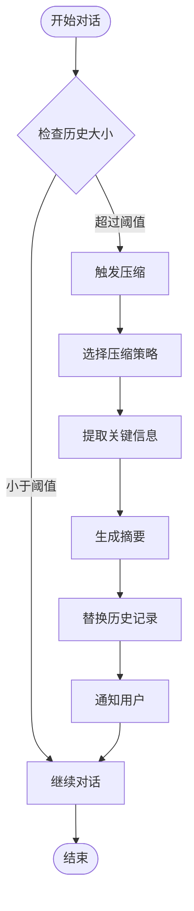

**图表来源**
- [client.ts](file://packages/core/src/core/client.ts#L400-L500)

### Token 限制管理

系统实现了精细的 token 限制管理，确保在不同模型之间高效切换：

```typescript
// Token 限制检查和管理
class GeminiClient {
  async sendMessageStream(request, signal, prompt_id, turns, originalModel) {
    // 尝试压缩聊天历史
    const compressed = await this.tryCompressChat(prompt_id);
    
    if (compressed.compressionStatus === CompressionStatus.COMPRESSED) {
      yield { type: GeminiEventType.ChatCompressed, value: compressed };
    }
    
    // 检查会话 token 限制
    const sessionTokenLimit = this.config.getSessionTokenLimit();
    if (sessionTokenLimit > 0) {
      const totalRequestTokens = await this.calculateTotalTokens();
      
      if (totalRequestTokens > sessionTokenLimit) {
        yield {
          type: GeminiEventType.SessionTokenLimitExceeded,
          value: {
            currentTokens: totalRequestTokens,
            limit: sessionTokenLimit,
            message: `会话 token 限制超出: ${totalRequestTokens} > ${sessionTokenLimit}`
          }
        };
        return new Turn(this.getChat(), prompt_id);
      }
    }
  }
}
```

### 缓存和优化策略

系统采用了多层次的缓存策略来提升性能：

1. **文件内容缓存**：避免重复读取相同文件
2. **工具调用缓存**：缓存工具执行结果
3. **模型响应缓存**：缓存相似查询的结果
4. **依赖关系缓存**：缓存项目结构信息

## 故障排除指南

### 常见问题诊断

以下是 Qwen Code 中常见问题的诊断和解决方案：

1. **认证问题**
```bash
# 检查当前认证状态
qwen /auth

# 切换到 Qwen OAuth
qwen /auth qwen-oauth

# 清除认证缓存
rm -rf ~/.qwen/cache
```

2. **模型切换问题**
```bash
# 查看可用模型
qwen /model list

# 手动切换模型
qwen /model set qwen3-coder-plus

# 检查模型状态
qwen /stats
```

3. **工具执行失败**
```bash
# 检查工具状态
qwen /tools

# 重置工具配置
qwen /settings reset

# 启用调试模式
qwen --debug
```

### 性能问题排查

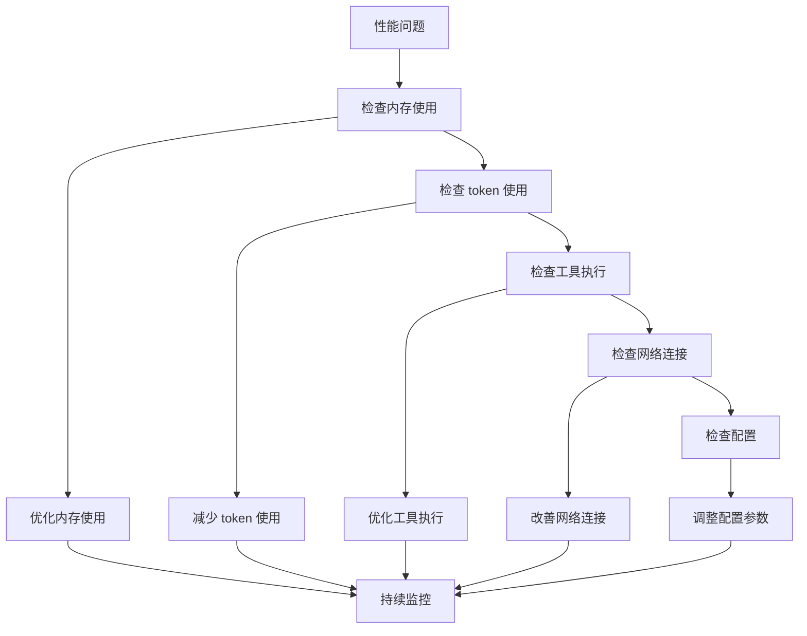

### 日志分析

系统提供了详细的日志记录功能，帮助诊断问题：

```typescript
// 启用详细日志记录
const logger = new Logger(sessionId, storage);
logger.initialize().catch((error) => {
  console.debug('日志初始化失败:', error);
});

// 记录模型切换事件
const switchEvent: ModelSwitchEvent = {
  fromModel: oldModel,
  toModel: newModel,
  reason: options?.reason || 'manual',
  context: options?.context,
};
logger.logModelSwitch(switchEvent).catch((error) => {
  console.debug('记录模型切换失败:', error);
});
```

## 总结

Qwen Code 作为一个现代化的智能开发助手，通过其创新的架构设计和丰富的功能特性，为开发者提供了前所未有的开发体验。其核心优势包括：

### 主要特点

1. **智能代码理解**：突破传统上下文窗口限制，实现真正的大文件处理能力
2. **工作流自动化**：通过 subagents 和 tool scheduler 实现复杂的开发任务自动化
3. **增强解析器**：专门优化的 Qwen-Coder 模型输出解析，提高准确性和可靠性
4. **视觉模型支持**：自动检测和处理图像输入，提供多模态分析能力
5. **灵活的工具系统**：支持多种类型的文件操作和系统交互
6. **动态配置管理**：支持运行时动态切换模型和配置更新

### 技术创新

- **分布式任务执行**：通过 subagents 实现任务的分布式执行和协作
- **智能上下文管理**：自动管理对话历史和上下文信息
- **多模态输入处理**：无缝集成文本和图像输入处理
- **性能优化策略**：多层次的缓存和优化机制

### 应用价值

Qwen Code 不仅仅是一个工具，更是一个完整的开发工作流平台。它能够：

- 显著提升开发效率，减少重复性工作
- 提供智能化的代码分析和改进建议
- 支持复杂的自动化任务执行
- 适应不同的开发场景和需求

通过持续的技术创新和功能完善，Qwen Code 正在成为开发者不可或缺的智能助手，推动软件开发向更高效率和智能化方向发展。