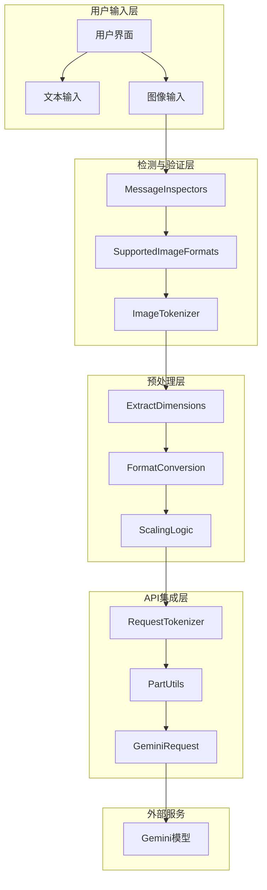
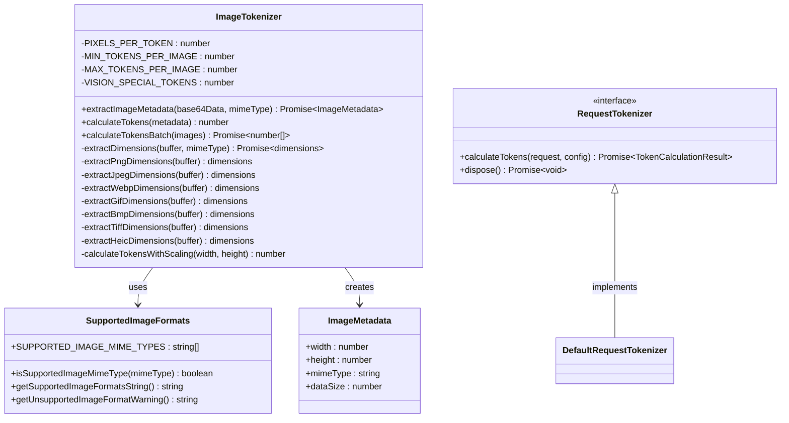
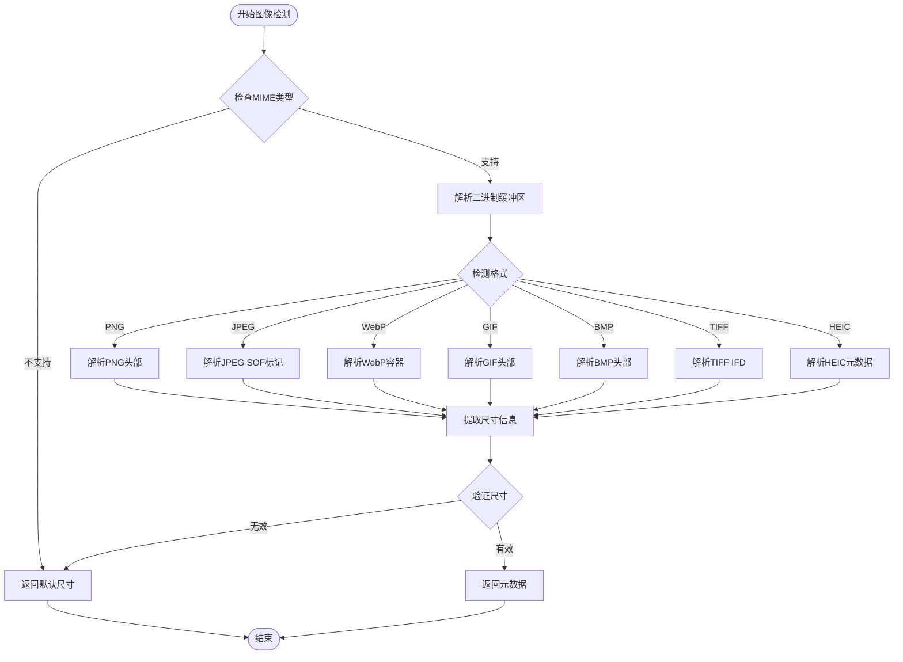
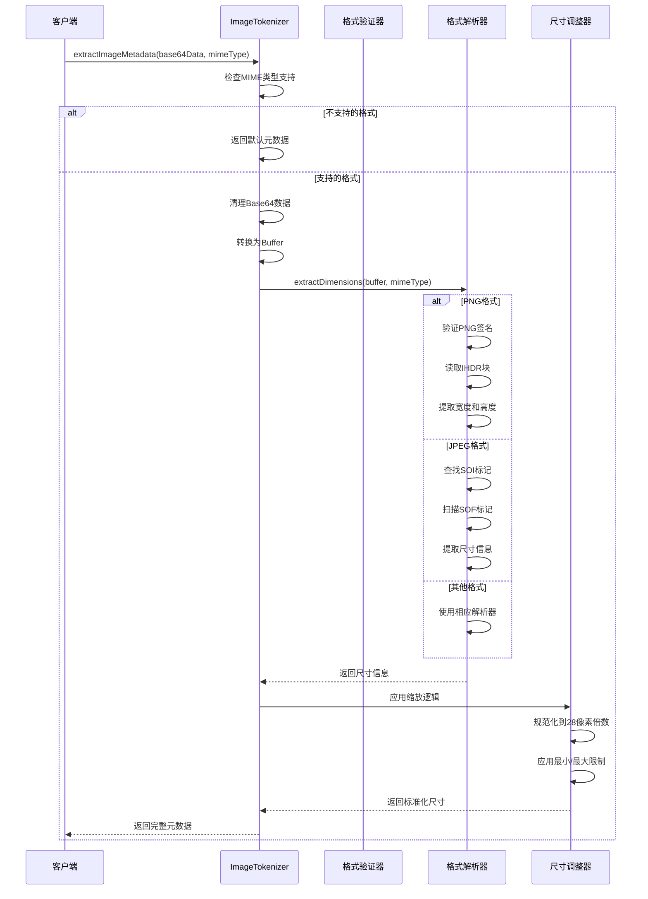
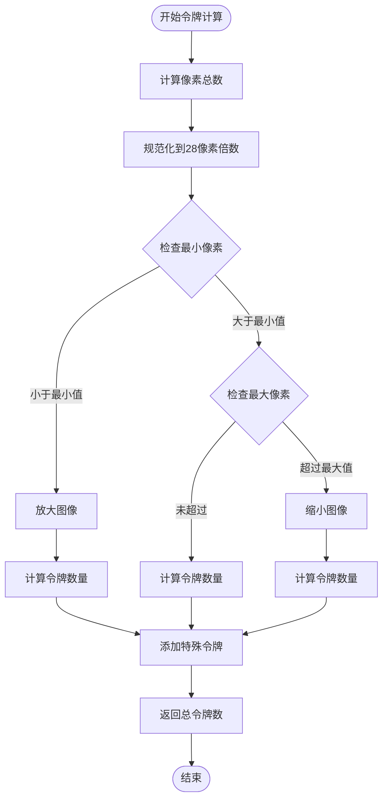
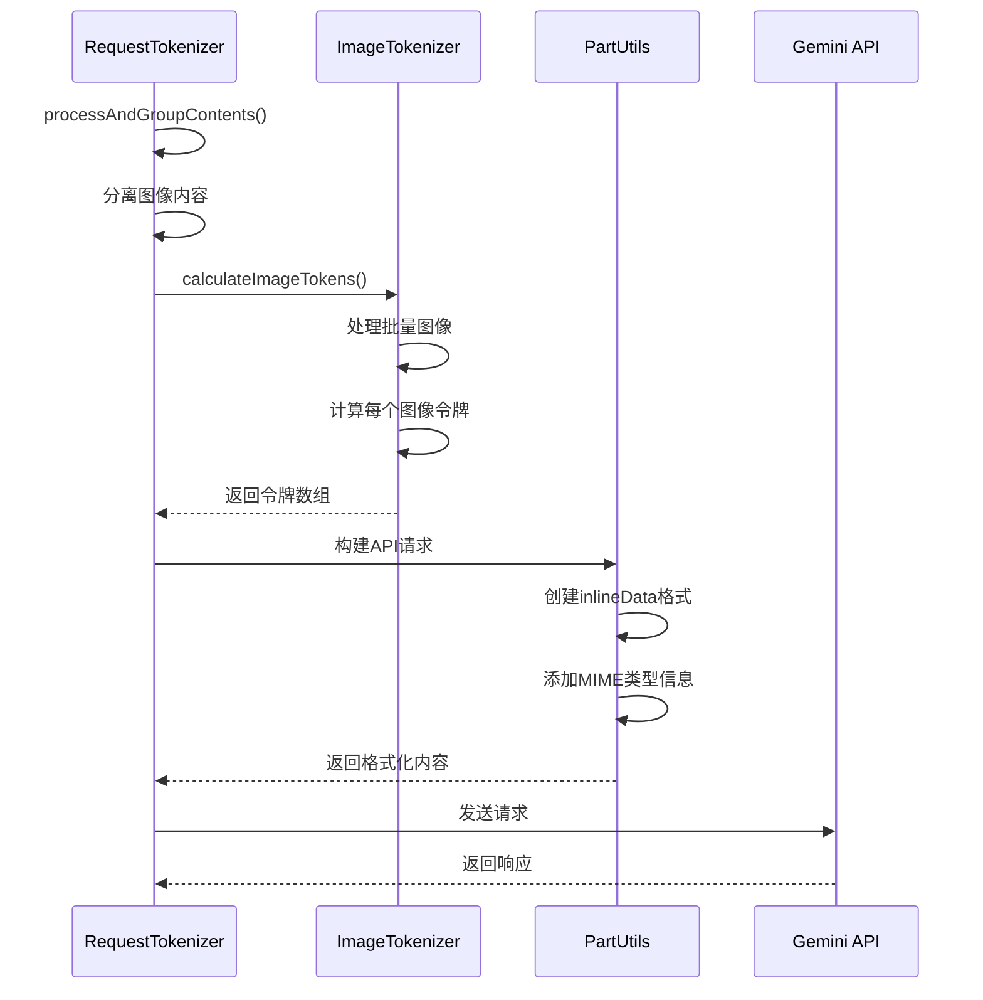
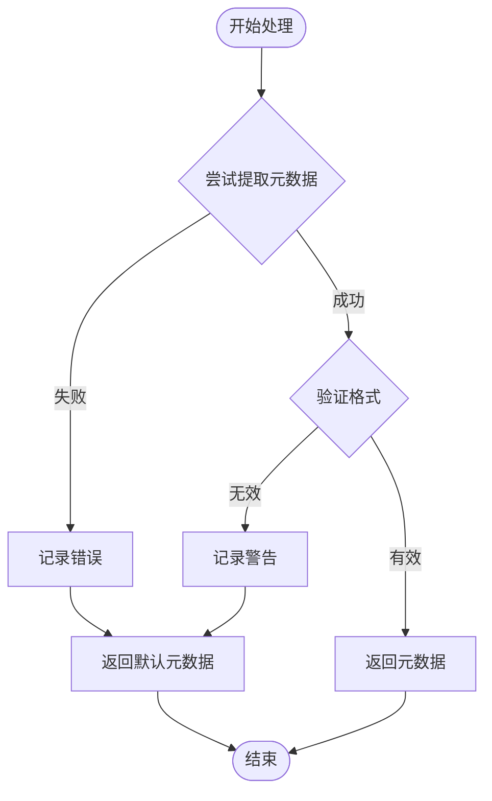

# 图像检测与处理

<cite>
**本文档引用的文件**
- [messageInspectors.ts](file://packages/core/src/utils/messageInspectors.ts)
- [imageTokenizer.ts](file://packages/core/src/utils/request-tokenizer/imageTokenizer.ts)
- [supportedImageFormats.ts](file://packages/core/src/utils/request-tokenizer/supportedImageFormats.ts)
- [requestTokenizer.ts](file://packages/core/src/utils/request-tokenizer/requestTokenizer.ts)
- [types.ts](file://packages/core/src/utils/request-tokenizer/types.ts)
- [imageTokenizer.test.ts](file://packages/core/src/utils/request-tokenizer/imageTokenizer.test.ts)
- [partUtils.ts](file://packages/core/src/utils/partUtils.ts)
- [geminiRequest.ts](file://packages/core/src/core/geminiRequest.ts)
</cite>

## 目录
1. [简介](#简介)
2. [项目架构概览](#项目架构概览)
3. [核心组件分析](#核心组件分析)
4. [图像检测机制](#图像检测机制)
5. [图像预处理流程](#图像预处理流程)
6. [图像令牌计算](#图像令牌计算)
7. [API集成与传输](#API集成与传输)
8. [异常处理策略](#异常处理策略)
9. [性能优化建议](#性能优化建议)
10. [故障排除指南](#故障排除指南)
11. [总结](#总结)

## 简介

qwen-code项目中的图像检测与处理系统是一个完整的图像处理管道，专门设计用于处理用户输入中的图像内容并将其转换为Gemini模型可接受的格式。该系统通过多层检测和预处理机制，确保图像数据能够正确地被识别、验证、转换和传输。

系统的核心目标是：
- 自动识别用户输入中的图像内容
- 验证图像格式和完整性
- 将图像数据转换为适合Gemini模型处理的格式
- 计算图像处理所需的令牌数量
- 提供可靠的错误处理和降级机制

## 项目架构概览



**图表来源**
- [messageInspectors.ts](file://packages/core/src/utils/messageInspectors.ts#L1-L24)
- [imageTokenizer.ts](file://packages/core/src/utils/request-tokenizer/imageTokenizer.ts#L1-L30)
- [requestTokenizer.ts](file://packages/core/src/utils/request-tokenizer/requestTokenizer.ts#L1-L50)

## 核心组件分析

### ImageTokenizer类架构



**图表来源**
- [imageTokenizer.ts](file://packages/core/src/utils/request-tokenizer/imageTokenizer.ts#L18-L30)
- [supportedImageFormats.ts](file://packages/core/src/utils/request-tokenizer/supportedImageFormats.ts#L10-L20)
- [types.ts](file://packages/core/src/utils/request-tokenizer/types.ts#L30-L45)

**章节来源**
- [imageTokenizer.ts](file://packages/core/src/utils/request-tokenizer/imageTokenizer.ts#L1-L350)
- [supportedImageFormats.ts](file://packages/core/src/utils/request-tokenizer/supportedImageFormats.ts#L1-L55)

## 图像检测机制

### 文件扩展名检测

系统通过多种方式检测图像文件：

1. **MIME类型验证**：检查文件的MIME类型是否在支持列表中
2. **签名检测**：读取文件头部字节进行格式验证
3. **数据URL解析**：处理包含MIME类型信息的数据URL

```typescript
// 支持的图像格式检测
export const SUPPORTED_IMAGE_MIME_TYPES = [
  'image/bmp',
  'image/jpeg',
  'image/jpg',
  'image/png',
  'image/tiff',
  'image/webp',
  'image/heic',
] as const;
```

### 二进制特征识别

每种图像格式都有特定的二进制特征，系统通过以下方式识别：



**图表来源**
- [imageTokenizer.ts](file://packages/core/src/utils/request-tokenizer/imageTokenizer.ts#L78-L131)

**章节来源**
- [supportedImageFormats.ts](file://packages/core/src/utils/request-tokenizer/supportedImageFormats.ts#L10-L30)
- [imageTokenizer.ts](file://packages/core/src/utils/request-tokenizer/imageTokenizer.ts#L78-L131)

## 图像预处理流程

### 格式转换与尺寸调整

图像预处理是整个管道的关键环节，涉及多个步骤：

1. **Base64解码**：将Base64编码的图像数据转换为二进制格式
2. **格式验证**：确认图像格式的有效性
3. **尺寸提取**：从图像头部信息中提取宽度和高度
4. **格式标准化**：确保所有图像都具有统一的尺寸表示



**图表来源**
- [imageTokenizer.ts](file://packages/core/src/utils/request-tokenizer/imageTokenizer.ts#L29-L76)

### 编码压缩处理

系统实现了智能的编码压缩策略：

- **PNG格式**：支持无损压缩，直接读取IHDR块中的尺寸信息
- **JPEG格式**：扫描Start of Frame (SOF)标记找到尺寸信息
- **WebP格式**：支持VP8、VP8L和VP8X三种子格式
- **其他格式**：提供通用的解析方法

**章节来源**
- [imageTokenizer.ts](file://packages/core/src/utils/request-tokenizer/imageTokenizer.ts#L133-L260)

## 图像令牌计算

### 令牌计算规则

图像令牌计算遵循严格的规则体系：



**图表来源**
- [imageTokenizer.ts](file://packages/core/src/utils/request-tokenizer/imageTokenizer.ts#L262-L304)

### 缩放逻辑实现

系统实现了复杂的缩放逻辑来确保图像尺寸符合模型要求：

```typescript
private calculateTokensWithScaling(width: number, height: number): number {
  // 规范化到28像素倍数
  let hBar = Math.round(height / 28) * 28;
  let wBar = Math.round(width / 28) * 28;

  // 定义像素边界
  const minPixels = ImageTokenizer.MIN_TOKENS_PER_IMAGE * ImageTokenizer.PIXELS_PER_TOKEN;
  const maxPixels = ImageTokenizer.MAX_TOKENS_PER_IMAGE * ImageTokenizer.PIXELS_PER_TOKEN;

  // 应用缩放
  if (hBar * wBar > maxPixels) {
    // 缩小大图像
    const beta = Math.sqrt((height * width) / maxPixels);
    hBar = Math.floor(height / beta / 28) * 28;
    wBar = Math.floor(width / beta / 28) * 28;
  } else if (hBar * wBar < minPixels) {
    // 放大小图像
    const beta = Math.sqrt(minPixels / (height * width));
    hBar = Math.ceil((height * beta) / 28) * 28;
    wBar = Math.ceil((width * beta) / 28) * 28;
  }

  // 计算令牌
  const imageTokens = Math.floor((hBar * wBar) / ImageTokenizer.PIXELS_PER_TOKEN);
  return imageTokens + ImageTokenizer.VISION_SPECIAL_TOKENS;
}
```

**章节来源**
- [imageTokenizer.ts](file://packages/core/src/utils/request-tokenizer/imageTokenizer.ts#L262-L304)

## API集成与传输

### 媒体部分集成

图像数据最终需要转换为Gemini模型可接受的媒体部分格式：



**图表来源**
- [requestTokenizer.ts](file://packages/core/src/utils/request-tokenizer/requestTokenizer.ts#L200-L300)
- [partUtils.ts](file://packages/core/src/utils/partUtils.ts#L15-L50)

### 请求构建过程

系统通过以下步骤将图像数据集成到API请求中：

1. **内容分组**：将不同类型的内容分离到不同的数组中
2. **令牌计算**：为每种内容类型计算相应的令牌数量
3. **格式转换**：将图像数据转换为API可接受的格式
4. **请求组装**：构建完整的API请求对象

**章节来源**
- [requestTokenizer.ts](file://packages/core/src/utils/request-tokenizer/requestTokenizer.ts#L200-L342)
- [partUtils.ts](file://packages/core/src/utils/partUtils.ts#L15-L80)

## 异常处理策略

### 损坏图像检测

系统实现了多层次的异常处理机制：



**图表来源**
- [imageTokenizer.ts](file://packages/core/src/utils/request-tokenizer/imageTokenizer.ts#L29-L76)

### 错误响应机制

当遇到损坏或不支持的图像时，系统采用以下降级策略：

1. **格式不支持**：返回默认尺寸（512x512）
2. **损坏数据**：使用字符长度估算数据大小
3. **解析失败**：返回最小令牌数量（6个令牌）
4. **网络错误**：重试机制和超时处理

```typescript
async extractImageMetadata(base64Data: string, mimeType: string): Promise<ImageMetadata> {
  try {
    // 检查MIME类型支持
    if (!isSupportedImageMimeType(mimeType)) {
      console.warn(`Unsupported image format: ${mimeType}`);
      return {
        width: 512,
        height: 512,
        mimeType,
        dataSize: Math.floor(base64Data.length * 0.75),
      };
    }

    const cleanBase64 = base64Data.replace(/^data:[^;]+;base64,/, '');
    const buffer = Buffer.from(cleanBase64, 'base64');
    const dimensions = await this.extractDimensions(buffer, mimeType);

    return {
      width: dimensions.width,
      height: dimensions.height,
      mimeType,
      dataSize: buffer.length,
    };
  } catch (error) {
    console.warn('Failed to extract image metadata:', error);
    // 降级到默认元数据
    return {
      width: 512,
      height: 512,
      mimeType,
      dataSize: Math.floor(base64Data.length * 0.75),
    };
  }
}
```

**章节来源**
- [imageTokenizer.ts](file://packages/core/src/utils/request-tokenizer/imageTokenizer.ts#L29-L76)

## 性能优化建议

### 缓存策略

为了提高性能，建议实施以下缓存策略：

1. **元数据缓存**：缓存已处理图像的元数据信息
2. **令牌结果缓存**：缓存重复图像的令牌计算结果
3. **格式解析缓存**：缓存格式解析结果避免重复计算

### 最大文件大小限制

系统内置了合理的文件大小限制：

- **最小图像尺寸**：4 tokens per image
- **最大图像尺寸**：16384 tokens per image  
- **默认尺寸**：512x512像素

### 并发处理优化

对于批量图像处理，系统提供了并发优化：

```typescript
async calculateTokensBatch(
  base64DataArray: Array<{ data: string; mimeType: string }>,
): Promise<number[]> {
  const results: number[] = [];

  for (const { data, mimeType } of base64DataArray) {
    try {
      const metadata = await this.extractImageMetadata(data, mimeType);
      results.push(this.calculateTokens(metadata));
    } catch (error) {
      console.warn('Error calculating tokens for image:', error);
      // 返回最小令牌作为降级
      results.push(ImageTokenizer.MIN_TOKENS_PER_IMAGE + ImageTokenizer.VISION_SPECIAL_TOKENS);
    }
  }

  return results;
}
```

**章节来源**
- [imageTokenizer.ts](file://packages/core/src/utils/request-tokenizer/imageTokenizer.ts#L306-L350)

## 故障排除指南

### 常见问题诊断

1. **图像格式不支持**
   - 检查MIME类型是否在支持列表中
   - 验证文件头部签名
   - 确认文件扩展名与实际格式匹配

2. **令牌计算错误**
   - 检查图像尺寸是否合理
   - 验证缩放逻辑是否正确应用
   - 确认特殊令牌计数是否准确

3. **API传输失败**
   - 检查Base64编码是否正确
   - 验证MIME类型格式
   - 确认请求格式符合API规范

### 调试工具

系统提供了丰富的调试信息：

```typescript
// 启用详细日志记录
console.warn('Unsupported image format:', mimeType);
console.warn('Failed to extract image metadata:', error);
console.warn('Error calculating tokens for image:', error);
```

**章节来源**
- [imageTokenizer.ts](file://packages/core/src/utils/request-tokenizer/imageTokenizer.ts#L29-L76)
- [imageTokenizer.test.ts](file://packages/core/src/utils/request-tokenizer/imageTokenizer.test.ts#L1-L50)

## 总结

qwen-code项目的图像检测与处理系统是一个设计精良、功能完备的图像处理管道。它通过以下关键特性确保了高质量的图像处理能力：

### 主要优势

1. **全面的格式支持**：支持PNG、JPEG、WebP、GIF、BMP、TIFF、HEIC等多种格式
2. **智能缩放算法**：自动调整图像尺寸以满足模型要求
3. **健壮的错误处理**：多层次的异常处理和降级机制
4. **高效的令牌计算**：精确的令牌数量计算和性能优化
5. **灵活的API集成**：无缝集成到Gemini模型的处理流程中

### 技术亮点

- **28像素倍数规范化**：确保图像尺寸符合模型处理要求
- **最小/最大令牌限制**：防止极端情况下的性能问题
- **批量处理优化**：高效处理多个图像文件
- **格式签名验证**：通过二进制特征确保格式准确性

### 应用场景

该系统适用于各种需要图像处理的应用场景，包括但不限于：
- 代码辅助开发中的图像注释
- 文档生成中的图像嵌入
- 代码审查中的视觉元素分析
- 多模态AI交互中的图像理解

通过其完善的架构设计和robust的实现，该图像处理系统为qwen-code项目提供了强大的视觉处理能力，确保了用户能够高效、可靠地使用图像相关的功能。